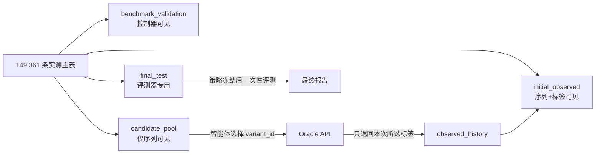

# GB1 结合景观：训练、验证、候选池与测试集划分及数据泄露防护策略

> 版本：v1.1（2026-08-15）  
> 适用任务：GB1 四位点（V39/D40/G41/V54）组合突变体对 IgG-Fc 的结合富集分数预测，以及以该景观为隐藏 oracle 的虚拟定向进化  
> 数据基线：Wu et al. 2016；FLIP；ProteinGym v1.3；FLIP-2；PG-LLM eval-data-v1.2

## 1. 结论摘要

GB1 不应只切成传统的 train/validation/test 三份。如果模型或智能体会在运行中选择候选、向 oracle 查询 fitness、再用新标签继续训练，那么“测试集”一旦被查询就已经变成训练数据。适合本项目的最小结构应为四层：

1. **`initial_observed`**：模拟已经完成的实验，序列与 fitness 均可见；
2. **`benchmark_validation`**：只供方法选择、阈值和不确定性校准使用，不进入候选生成，也不计入闭环收益；
3. **`candidate_pool`**：序列可见、fitness 隐藏，被主动学习选中后才由 oracle 揭示并转入观测历史；
4. **`final_test`**：全程不可查询，只由独立评测器在方法、超参数和策略冻结后打开一次。

推荐把 **149,361 条实测序列全部保留为 oracle 宇宙**，而不是使用 FLIP 为静态回归而重采样出的 8,733 条子集。主闭环采用低阶突变起步；FLIP 的 1/2/3-vs-rest、low-vs-high 和 sampled 作为单独的可比性/压力测试轨道，不与闭环主划分混用。

对 [PG-LLM](https://doi.org/10.64898/2026.07.27.741045) 的论文、固定代码和实际发布包复核后，结论是：**PG-LLM 的三个 fixed draws 是同一 assay 上的三次 outcome-stratified 评测抽样，不是训练、验证、测试三分，也不是获得实验反馈后的三轮迭代。** 它的标签隔离、文件哈希、冻结 prompt、运行清单和 evaluation-only 使用政策值得直接借鉴；但其候选集先按真实 fitness 排序并分成十个等频箱，不能用于生成标签盲的闭环候选池。

建议的首个正式配置为 `GB1-AL96`：

| 角色 | 数量 | 构成 | 对智能体可见性 |
|---|---:|---|---|
| `initial_observed` | 96 | WT 1 + 全部单点 76 + 19 个按序列覆盖选出的双点 | 序列、fitness 均可见 |
| `benchmark_validation` | 384 | 三点 192 + 四点 192；不看 fitness 选样 | 仅训练/评测控制器可用，智能体不可查询 |
| `candidate_pool` | 134,161 | 双点 2,072 + 三点 23,225 + 四点 108,864 | 序列可见；选中后才揭示 fitness |
| `final_test` | 14,720 | 三点 2,602 + 四点 12,118，即各高阶层约 10% | 仅最终评测器可读，永不进入查询池 |

这个设计把“已完成实验”明确限制在 WT、单点及少量双点，把高阶组合作为主要未知空间，同时保留足够大的、标签盲选的最终测试集。若要复现“已测完全部低阶组合”的场景，可改用 `GB1-LowOrderFull`：训练集取 WT + 全部单点 + 全部双点，共 2,168 条；沿用相同验证/测试划分，候选池为 132,089 条。

若后续只运行一次主动学习 campaign，上述四层足够；若要在 GB1 上反复训练、选择并最终评测一个可复用的 agent/RL 策略，则还应把 `candidate_pool` 再按标签盲规则拆成 `policy_train_pool`、`policy_validation_pool` 和 `policy_test_pool`，形成六角色扩展。否则，策略在早期 episode 查询过的标签会污染后续所谓“测试 episode”。

## 2. 数据与任务结构对划分的约束

### 2.1 它是近完整景观，不是严格完整景观

名义空间为 `20^4 = 160,000`，实测 149,361 条，覆盖率约 93.35%，仍有 10,639 个组合没有实验真值。因此：

| Hamming depth | 名义数量 | 实测数量 | 缺失数量 | 覆盖率 |
|---:|---:|---:|---:|---:|
| 0 | 1 | 1 | 0 | 100% |
| 1 | 76 | 76 | 0 | 100% |
| 2 | 2,166 | 2,091 | 75 | 96.54% |
| 3 | 27,436 | 26,019 | 1,417 | 94.83% |
| 4 | 130,321 | 121,174 | 9,147 | 92.98% |

闭环基准只能把 149,361 条实测序列作为可评分 oracle。其余 10,639 条应标为 `unmeasured_universe`：智能体若提出这些序列，可计为超出 oracle 范围，或留给未来真实实验；不能用插值值冒充测试真值。

### 2.2 强上位性决定了 random split 只能是容易的 sanity check

[Wu et al.](https://doi.org/10.7554/eLife.16965)选择的四个位点位于 GB1 结合相关区域，原研究的目的之一就是刻画高阶相互作用和间接适应路径。随机拆分会让一个测试四突变体在训练集中拥有大量相距 1–2 个残基的近邻，并让相同的单突变效应出现在两侧。这不一定是“违规泄露”，但它测到的主要是局部插值，而不是工程上关心的低阶到高阶外推。

### 2.3 极端 fitness 不平衡要求使用头部指标，但不能按标签挑主测试集

FLIP 报告 149,361 条中有 143,539 条 fitness 低于 0.5；WT fitness 为 1。只预测低值也可能得到看似不错的总体误差。因此最终报告不能只用 MSE 或全局相关性，还应包含 NDCG、top-k recall、enrichment factor、best-seen 曲线和 simple regret。

另一方面，主 `final_test` 不应刻意抽取高 fitness 序列：若测试成员身份对智能体可见，成员身份本身就会成为 fitness 线索。推荐对高阶序列做**标签盲、按突变阶数分层的哈希抽样**，然后只做一次事后分布审计，不因审计结果反复重抽。

## 3. 现有 benchmark 的划分能否直接使用

### 3.1 FLIP：适合静态 OOD 对照，不适合直接充当全量闭环划分

[FLIP 论文](https://doi.org/10.1101/2021.11.09.467890)先保留全部 5,822 条 `fitness > 0.5` 的序列，再从 `fitness <= 0.5` 中随机抽取 2,911 条，形成 8,733 条重平衡子集，随后定义：

- `1-vs-rest`：WT + 单点训练，其余测试；
- `2-vs-rest`：WT + 单点 + 双点训练，其余测试；
- `3-vs-rest`：WT + 单点 + 双点 + 三点训练，四点测试；
- `low-vs-high`：低 fitness 训练，高 fitness 测试；
- `sampled`：约 80/20 随机拆分。

这套语义非常值得保留，但有四个限制：

1. 它只覆盖 8,733 条重采样数据，改变了完整景观中低功能序列的自然频率，也丢掉了绝大多数可供闭环查询的真值；
2. `keep=True` 子集中只有 WT 1、单点 27、双点 396、三点 2,566、四点 5,743，因此所谓 1-vs-rest 并不是“全部 76 个单点已完成实验”；
3. FLIP 明确把 `sampled` 标为橙色 split，不建议用于性能比较；论文也称其主要用于讨论；
4. 官方验证列是训练集合中的一个朴素子集；论文鼓励使用者从训练数据中另行设计验证方案。

对当前固定的 FLIP commit `62cace8` 本地文件进行核验后，得到：

| split | 固定文件中的 `set=train/test` | 其中 `validation=True` | 备注 |
|---|---:|---:|---|
| `one_vs_rest` | 28 / 8,705 | 3 | 验证样本仍标为 train |
| `two_vs_rest` | 424 / 8,309 | 43 | 去掉验证后为 381/43/8,309 |
| `three_vs_rest` | 2,990 / 5,743 | 299 | 去掉验证后训练为 2,691 |
| `low_vs_high` | 5,089 / 3,644 | 509 | 固定文件实际为 `< WT` 训练、`>= WT` 测试 |
| `sampled` | 6,988 / 1,745 | 699 | 随机性 sanity check |

这些数字与 FLIP 论文表格中的部分数字并不完全一致；`low-vs-high` 的论文正文写作“`<= WT` 训练、`> WT` 测试”，而固定 README/数据把 WT 放在测试侧。结论不是判断哪一版“正确”，而是：**必须固定 commit、文件哈希和实际 split 列，不能只凭 split 名称或论文描述复现。**

因此，FLIP 官方 split 应原样保留为 `static_flip_*` 对照，不应用来替代 149,361 条全量闭环 oracle 的主划分。

### 3.2 ProteinGym：提供标准 CV folds，但 GB1 多突变仍是随机五折

[ProteinGym](https://proceedings.neurips.cc/paper_files/paper/2023/file/cac723e5ff29f65e3fcbb0739ae91bee-Paper-Datasets_and_Benchmarks.pdf)在监督评测中提供 Random、Contiguous、Modulo 三类交叉验证思想。Random 把突变随机分折；Contiguous 按序列连续位置分折；Modulo 按位置编号取模分折。论文强调后两者用于评估对未见位置的外推，并说明多突变难以归入单一位置折。

对 [ProteinGym v1.3 官方 CV 文件](https://github.com/OATML-Markslab/ProteinGym)中的 GB1 条目直接核验后：

- 多突变文件包含 149,360 条非 WT 序列，只有 `fold_rand_multiples`；五折规模为 29,874、29,874、29,874、29,874、29,864；
- 单点文件包含 76 条；Random、Modulo、Contiguous 在 GB1 上实际只有 4 个有效折，因为只有 4 个突变位置；Modulo/Contiguous 各折恰为一个位置的 19 种替换；
- 官方文件提供的是 fold id，而不是唯一固定的 train/validation/test 三分法；使用者仍需指定哪些折训练、验证和测试。

ProteinGym 的优点是格式统一、跨 assay 可比；缺点是 GB1 多突变主文件仍是 IID 随机折，不能替代 1/2/3-vs-rest，更没有候选查询与 oracle 状态。因此它适合外部静态 CV 和跨蛋白泛化，不是闭环任务的现成答案。

### 3.3 FLIP-2：split 语义最值得借鉴，但不能无条件移植

[FLIP-2](https://flip.protein.properties/)给出 7 个数据集、16 个 split，分为 Number、Position、Mutation、Fitness、Wild-type 五类，明确模拟“少突变到多突变、已见位置到未见位置、已见替换到未见替换、低 fitness 到高 fitness、一个骨架到另一个骨架”的工程分布偏移。

官方文件确实具有可用的验证语义。所核验的两个例子中：

- Hydro `low-to-high`：有效训练 9,974、验证 2,493、测试 12,468；文件中验证样本仍为 `set=train, validation=True`；
- PDZ3 `single-to-double`：有效训练 124、验证 31、测试 579；验证也嵌在 `set=train` 中。

FLIP-2 的验证集用于早停，这比 FLIP 的“自行设计验证”更完整。但有两点不能直接用于闭环主划分：

- Fitness split 天然使用标签决定归属；若候选/测试成员身份暴露，会泄露目标区间；
- PDZ3 测试集按显著非加和效应筛选，成员身份本身就携带“强上位性”信息。

因此，FLIP-2 最适合作为**场景分类法和静态压力测试模板**；GB1 主闭环的候选池与最终测试集仍应采用标签盲划分。

### 3.4 PG-LLM：三个 draw 不是三分数据，也不是三轮实验

[PG-LLM 论文](https://doi.org/10.64898/2026.07.27.741045)及其[固定代码版本 `7b8abf4`](https://github.com/rohitarorayyc/proteingym-llm/tree/7b8abf423bc6e797c3a023a2c435f27f258eaa76)定义的是 **evaluation-only、zero-shot、one-shot ranking** 任务。它覆盖 ProteinGym v1.3 substitution component 的 217 个 assay、186 个蛋白，其中 148 个 assay 为单点替换、69 个包含多突变体。模型得到 assay 描述、WT 全长序列和一组打乱顺序的候选全长序列，一次性返回从优到劣的完整排序；看不到实验标签、突变简写、MSA 或结构，也没有“查询一批—得到反馈—更新—再查询”的状态转换。

其候选集构造流程是：在每个 assay 内先按**已测 fitness**排序，分成十个等样本量区间，再从每个区间近似等量抽样并打乱顺序。每个 assay 使用固定 seed 1–3 生成三个独立 draw；主榜为 `N=50`，发布包还提供 `N=10/100`，用于候选列表长度敏感性分析。换言之：

- `draw 1/2/3` 是重复评测，用来估计候选抽样方差，不是 train/validation/test；
- `N=10/50/100` 是同一任务的规模压力测试，不是逐级训练或从验证到测试的层级；
- fitness 分箱让小样本评测覆盖整个响应范围，这对诊断排序能力是合理设计；但它在构造候选成员时已经读取标签，不能模拟实验前未知的大候选池。

[eval-data-v1.2](https://github.com/rohitarorayyc/proteingym-llm/releases/tag/eval-data-v1.2) 把候选序列与 `.labels.json` 分文件保存，archive SHA-256 为 `b40ca6bb30741a652243e90e08a485ef48a52691bff8a075ec0f396200cf6f8a`。不过[读取代码](https://github.com/rohitarorayyc/proteingym-llm/blob/7b8abf423bc6e797c3a023a2c435f27f258eaa76/src/subsample.py)会在评测进程内重新连接序列与分数，再由[prompt 构造代码](https://github.com/rohitarorayyc/proteingym-llm/blob/7b8abf423bc6e797c3a023a2c435f27f258eaa76/src/prompt.py)保证分数不进入模型输入。因此它实现的是良好的**接口级标签隔离和可复现性**，不是访问控制意义上的私有 oracle；候选文件和标签文件都公开可下载。

对发布包中的 GB1 条目进行直接审计，结果如下：

| 项目 | PG-LLM 中的实际情况 |
|---|---|
| assay | `SPG1_STRSG_Wu_2016`，Binding，`multi=True` |
| 变体基数 | 149,360 个非 WT 变体；WT 单独作为参考序列 |
| 序列表示 | 448 aa 全长 SPG1；四个位点映射为 265/266/267/280 |
| 主榜 `N=50` | 三个 seed 两两无交集，共 150 个不同变体 |
| 跨 N 重叠 | 对每个相同 seed，`N10∩N50=1`、`N10∩N100=1`、`N50∩N100=5` |
| 九个公开 episode 合计 | 480 个候选槽位，对应 462 个不同变体 |

这进一步说明：即使 GB1 的三个同规模 draw 恰好不重叠，它们仍来自同一公开景观，并且成员由真实 fitness 分箱决定；“样本不重叠”不等于“可把三个 seed 改名为训练/验证/测试”。在更小的 ProteinGym assay 上，不同 draw 还可能出现候选重叠。

证据边界：任务定义、fitness 分箱、三个 draw、文件结构及上表数字分别来自论文、固定代码和发布包直接核验；下面关于“是否适合多轮 agent”的内容是基于这些实现事实作出的任务适配判断和协议建议，不是 PG-LLM 作者声称其已支持闭环训练。

#### 对当前多轮 agent 的适配结论

| 维度 | PG-LLM | 当前 GB1 agent 所需 | 判断 |
|---|---|---|---|
| 初始实验 | 不提供带标签示例 | WT、单点及少量双点已测 | 不满足 |
| 决策形式 | 一次性排序固定 N 个候选 | 多轮、预算受限、每轮重新决策 | 不满足 |
| 反馈 | 运行结束后统一计分 | 每轮只揭示所选候选 fitness | 不满足 |
| 划分 | 三个 outcome-stratified evaluation draws | 标签盲 train/val/pool/test 角色 | 不满足 |
| 最终测试 | 公开候选和公开标签，靠使用政策约束 | 训练进程不可访问的 sealed evaluator | 仅部分满足 |
| 可复现性 | 固定数据包、hash、prompt、seed、run manifest | 同样需要 | 强烈值得借鉴 |

因此，PG-LLM **不能直接作为当前 agent 的主数据划分**，也不能用某个 draw 训练、另一个 draw 调参、第三个 draw 报最终结果；这会违反其明确的 [evaluation-only policy](https://github.com/rohitarorayyc/proteingym-llm/blob/7b8abf423bc6e797c3a023a2c435f27f258eaa76/BENCHMARK_USE_POLICY.md)。可以借鉴的部分有：

1. 候选输入与标签文件分离，并为 bundle、单个 split、prompt 和结果保存哈希；
2. 固定多个 draw/seed，用相同候选集合公平比较不同系统，并把 seed 方差作为结果的一部分；
3. 冻结 assay 描述、prompt 模板、模型身份、reasoning 设置和查询参数；探索性配置写入不同 `run_label`，不覆盖 canonical run；
4. 保存每次尝试、终止状态和完整性校验，失败或不完整输出不静默纳入评分；
5. 明确发布 evaluation-only 使用政策、污染披露规则和 canary；
6. 把“十等频 fitness 覆盖的 50 候选排序”保留为**最终冻结后的辅助诊断轨道**，而不是主训练或闭环候选池。

### 3.5 综合判断

| 来源 | 是否已有 train/val/test | 对 GB1 的价值 | 是否可直接用于主动学习/RL |
|---|---|---|---|
| FLIP | 有 train/test，并以布尔列标记 train 内 validation | 最好的低阶→高阶、低→高 fitness 静态对照 | 否；只有 8,733 条重采样子集，没有查询状态隔离 |
| ProteinGym | 有官方 CV folds，需自行映射三分 | 标准化 IID/位置 CV；跨 assay 可比 | 否；GB1 多突变是随机五折，无 oracle 协议 |
| FLIP-2 | 有 train/test/validation，工程分布偏移最丰富 | 提供 Number/Fitness/Mutation 等设计模板 | 部分可借鉴；仍没有为 GB1 建立防重复查询的闭环环境 |
| PG-LLM | 没有训练/验证集；只有 evaluation draws 和公开 held-out labels | 零样本排序、候选规模敏感性、污染与复现审计 | 否；one-shot、标签分箱抽样、无逐轮反馈；工程治理可借鉴 |

**没有一个现有 benchmark 同时满足：全量 GB1 真值、现实起始实验、可查询候选池、最终不可查询测试集、RL 多回合隔离。需要自定义四层主划分。**

## 4. 推荐主划分：GB1-AL96

### 4.1 划分顺序

划分算法必须先固定角色，再允许模型或人查看 fitness；推荐顺序如下：

1. **规范化与去重**：把 FLIP 的四字母 `Variants` 作为主基因型；WT 固定为 `VDGV`；同一四字母组合只保留一条；
2. **先锁最终测试集**：在 HD=3、HD=4 内分别按带私有 salt 的 SHA-256 排序，取 2,602 和 12,118 条；不读取 fitness；
3. **再取验证集**：从剩余 HD=3、HD=4 中各按独立 salt 取 192 条；不读取 fitness；
4. **构造初始实验集**：固定 WT + 全部 76 个单点；从未占用的双点中选 19 条，使六种位置对、每个位点的氨基酸种类和理化类别尽量均衡；选择目标不能包含 fitness；
5. **其余实测序列进入候选池**；未实测组合单独登记，不进入可评分池；
6. **划分冻结后才关联 oracle 标签**，由独立检查程序生成各层分布报告。

这里最终测试集只取三、四点突变，是有意的目标分布设计：低阶突变被定义为已有实验，高阶组合才是部署目标。最终指标应分别报告 HD=3 和 HD=4，再做宏平均，不能被数量更多的四点突变完全支配。

### 4.2 数据流与权限



| 组件 | 可读取训练标签 | 可读取候选标签 | 可读取验证标签 | 可读取测试标签 |
|---|---:|---:|---:|---:|
| surrogate / acquisition policy | 是 | 否；仅选中后返回 | 否 | 否 |
| 训练控制器 | 是 | 否 | 是，但只能用于模型选择 | 否 |
| oracle 服务 | 按请求返回 | 是 | 不对智能体开放 | 否 |
| final evaluator | 是 | 可用于闭环计分 | 是 | 是；仅冻结后 |

`benchmark_validation` 不应在每一轮主动学习后反复用于挑 acquisition 函数。轮内早停和模型选择应在当轮 `observed_history` 上做内部交叉验证；全局 validation 用于开发阶段比较方案。否则，几十轮和大量超参数组合会逐渐把验证集变成事实上的训练集。

### 4.3 为什么初始集不是按全体突变阶数比例抽样

当前项目的 `build_gb1_benchmark` 对全景观按 HD 比例抽取 96/96/2,048。生成的正式 `initial_observed` 实际为：WT 1、单点 1、双点 1、三点 16、四点 77；验证集也以四点为主。这更像从全空间随机拿到一批标签，不像“先做低阶突变，再组合优化”。

对于目标任务，96 条初始数据应明确解释为：已知 WT，完成全部 76 个单点扫描，并额外完成 19 个覆盖性双点实验。这样模型是否能够从低阶效应和少量成对相互作用推断高阶组合，才与 FLIP 的核心科学问题一致。

### 4.4 面向多轮 agent 的六角色扩展

四层划分回答的是“在一个冻结候选池上运行一次闭环”的问题。如果策略网络、LLM prompt、长期记忆或 acquisition 超参数会在多个 episode 之间继续更新，那么还必须同时隔离**样本角色、campaign 角色和轮次时间**。仅用不同随机 seed 反复重置环境并不产生新的测试集。

#### 第一层：变体级 outer split

在保留 `initial_observed`、`benchmark_validation` 和 `final_test` 不变的前提下，可把原 134,161 条 `candidate_pool` 按 HD 分层、用三个独立私有 salt 做标签盲的 80/10/10 划分：

| 角色 | HD2 | HD3 | HD4 | 合计 | 标签何时可见 |
|---|---:|---:|---:|---:|---|
| `initial_observed` | 19 | 0 | 0 | 96（另含 WT 1、HD1 76） | campaign 开始前可见 |
| `benchmark_validation` | 0 | 192 | 192 | 384 | 仅静态开发评测器可见，不可查询 |
| `policy_train_pool` | 1,658 | 18,580 | 87,092 | 107,330 | 训练 episode 中仅对被选项揭示 |
| `policy_validation_pool` | 207 | 2,322 | 10,886 | 13,415 | 策略选择 episode 中仅对被选项揭示 |
| `policy_test_pool` | 207 | 2,323 | 10,886 | 13,416 | 策略完全冻结后的最终 campaign 才可查询 |
| `final_test` | 0 | 2,602 | 12,118 | 14,720 | 永不向 agent 返回；最终静态评测器一次性使用 |

这六个角色合计仍为 149,361 条。`benchmark_validation` 和 `policy_validation_pool` 不能合并：前者评估 surrogate 的静态预测、校准和实现正确性；后者允许真实的多轮查询，用于选择整个决策策略。动态验证过程中揭示的标签已经属于调参信息，不能再进入 `policy_test_pool` 或 `final_test`。

#### 第二层：campaign 级隔离

- **policy training campaign**：只从 `policy_train_pool` 查询；允许 episode 间更新策略权重、prompt、长期记忆和 replay buffer；
- **policy validation campaign**：只从 `policy_validation_pool` 查询；可据此选择超参数和 checkpoint，但不能把查询到的序列/标签并回最终模型；
- **policy test campaign**：先冻结策略权重、prompt、工具、预算、停止规则和随机性协议，再从 `policy_test_pool` 多轮查询。允许预先声明的**轮内适应**，例如用本 episode 已获得标签重训 surrogate；禁止跨 test seed 更新全局策略或共享记忆；
- **sealed static test**：campaign 结束后，在 `final_test` 上评价最终 surrogate 的排序、头部召回和校准。这个评测不向 agent 提供逐样本反馈，用于发现只会利用在线奖励而没有学到可泛化 landscape 的策略。

一次正式 policy test 后，该 benchmark 版本应视为已消耗。若开发者查看了逐轮标签、候选身份或失败案例并据此修改系统，后续结果必须进入新版本或新的私有 salt，不能继续称为同一次盲测。

#### 第三层：round 级时间因果

对第 `r` 轮决策，合法观测集只能包含 `acquired_round < r` 的标签。第 `r` 轮批次中的任何 fitness、由这些 fitness 计算的归一化统计或 evaluator 指标，都不能反向影响同一批次的排序。每轮至少冻结并记录：

```text
state_r = hash(initial_observed + acquired_before_r + model/prompt/tool versions)
action_r = unique candidate IDs selected from the legal pool
feedback_r = oracle labels for action_r only
transition = available -> proposed -> acquired
```

对离线 RL 或历史轨迹回放，replay buffer 只能包含该轨迹实际查询到的反馈。虽然完整 GB1 oracle 在磁盘上可用，也不得用未查询候选的真实 fitness 计算特征、塑造奖励、挑 checkpoint 或生成“反事实最优动作”。全局最优值和未查询 top-k 只允许由评测器在运行后计算，并且不能返回训练进程。

#### 何时使用四层，何时使用六角色

- 只比较若干已冻结算法、每个算法运行独立的一次主动学习 campaign：使用 `GB1-AL96` 四层主划分即可；
- 要在 GB1 内训练一个跨 episode 持续更新的 RL/agent 策略：使用六角色扩展；
- 要证明策略能迁移到**未见蛋白景观**：最优做法仍是在其他 assay/合成景观上训练和验证，把整个 GB1 留作冻结后的外部测试。六角色 GB1 拆分只能防止精确变体标签重用，不能消除四位点空间中的共享替换和近邻污染。

## 5. 需要并行保留的评测轨道

一个 split 无法同时回答插值、组合外推、fitness 外推和闭环优化四个问题。建议固定同一数据版本，发布以下互不混报的轨道：

### Track A：`AL96 closed-loop`（主结果）

- 使用第 4 节四层划分；
- 每轮固定查询预算，例如 32 或 96；
- 只允许从 `candidate_pool` 选择未查询序列；
- 报告 best-seen、simple regret、top-1% hit rate、EF@k、达到 WT/指定阈值所需查询数、无效/重复查询率；
- `final_test` 只评估最终 surrogate 的排序、头部识别和不确定性校准，不参与闭环奖励。

### Track B：`LowOrderFull closed-loop`

- 初始训练为全部 HD≤2，共 2,168 条；
- 验证/测试沿用主划分，避免不同轨道各自挑一个有利测试集；
- 用来回答“完成系统性单点/双点扫描后，能否找到优质三点/四点组合”。

### Track C：FLIP-compatible static OOD

- 原样读取固定 commit 中 `keep=True` 的 `one_vs_rest`、`two_vs_rest`、`three_vs_rest` 和 `low_vs_high`；
- validation 必须从 `set=train` 中排除后单列；
- `sampled` 只作上限/sanity check，不作为主排名；
- 报告所用文件中的实际样本数，而不是复制其他版本论文表格。

### Track D：标签盲 IID sanity check

- 在实测宇宙中用序列哈希做 80/10/10 或五折随机划分；
- 只用于确认训练管线是否正常、估计局部插值上限；
- 不能作为“能支持定向进化外推”的证据。

### Track E：Mutation-identity OOD（可选）

受 FLIP-2 的 Mutation split 启发，把 `(position, mutant amino acid)` 身份划成互斥组。训练序列只能含训练组替换；测试序列至少含一个测试组替换；混合组序列进入隔离区或测试侧。该轨道能检验未见替换泛化，但会明显缩小有效训练集，应作为压力测试而非主闭环。

Fitness split 也应只作为静态回顾性压力测试。按 fitness 定义“未知候选”需要先看 oracle 标签，与真实候选池形成过程相矛盾；不能把这种轨道的闭环发现效率与标签盲主轨道直接比较。

### Track F：PG-LLM-compatible zero-shot ranking（可选辅助轨道）

PG-LLM 的设计可被保留为一个不参与训练的诊断项：在主 split 完全冻结后，由 final evaluator 只在 `final_test` 内按真实 fitness 做十等频分箱，每箱抽 5 条组成 `N=50` panel，生成三个固定 draw。模型只看到 assay 描述、WT 和打乱顺序的候选序列，一次性返回完整排序；报告每个 draw 的 Spearman ρ、三 draw 均值和方差。

该轨道必须满足：

- panel 生成、标签连接和计分都在 final evaluator 内完成；
- 三个 draw 都是测试重复，不把 draw 1/2 用于 prompt 或超参数选择；
- 如比较 `N=10/50/100`，它们是列表长度敏感性条件，不能互相充当验证和测试；
- 结果只解释为“在覆盖整个 fitness 动态范围的小面板上能否排序”，不能解释为从自然候选池发现 top hit 的概率；
- 与 `AL96 closed-loop` 指标分表报告，因为前者的 panel 成员是 outcome-stratified，后者的候选池必须 label-blind。

## 6. 数据泄露威胁模型与防护

### 6.1 同一生物变体跨来源重复

FLIP 与 ProteinGym 收录的是同一个 Wu 2016 assay，但二者的整条 `sequence` 和位点编号表示不同：FLIP 使用四字母组合和基于 5LDE 构造的序列，ProteinGym 使用全长 SPG1 序列及其坐标。若按整条序列哈希，同一实验变体可能被误判为不同样本，导致一版进入训练、另一版进入测试。

防护要求：

- 去重主键必须是 `assay_identity + canonical_four_site_tuple`；
- 建立 V39/D40/G41/V54 与全长 SPG1 坐标的显式映射；
- FLIP、ProteinGym、其他派生版本只能选择一个作为标签主源，其他版本仅作一致性核验；
- 任何跨来源训练前先做四位点等价连接和标签差异报告。

### 6.2 目标泄露列

面向模型和智能体的公共表不得包含：

- `Fitness` / `target` / `DMS_score`；
- 原始筛选计数 `Count input`、`Count selected` 或其比值；
- FLIP 的 `keep`；
- `low_vs_high`、`*_validation` 等由标签或既有划分生成的列；
- 全数据计算出的 fitness 均值、标准差、分位点、top-k 标志或全局最大值。

公开候选表只保留 `variant_id`、四位点序列、突变表示、突变阶数，以及明确允许的序列/结构特征。fitness 变换若需要拟合参数，只能用当前已观测训练标签；WT=1 可以作为 assay 已知标尺，因为 WT 被纳入初始实验。

### 6.3 文件隔离不等于安全边界

当前项目已把 public 与 oracle CSV 分开，这是必要的工程边界，但完整 GB1 标签本身公开可下载；同一进程如果能任意读取 `data/raw` 或 `*_oracle.csv`，分文件并不能阻止泄露。

推荐：

- 训练进程只挂载公共特征与查询客户端，不挂载 raw/oracle/test label 路径；
- oracle 在单独进程中按 `variant_id` 批量返回本轮被批准的标签，并记录不可篡改的查询日志；
- final evaluator 使用独立凭据，拒绝任何训练期调用；
- 测试中扫描模型输入 schema、日志、缓存、异常栈和产物，确保没有隐藏标签；
- 每次查询校验 `candidate -> acquired` 的单向状态转换，禁止重复查询和批量导出。

### 6.4 相似性与近邻污染

四位点空间很小，随机拆分必然让训练与测试共享大量相同替换和一跳近邻。应把它称为“任务过易/分布不匹配”，不要与精确重复标签泄露混为一谈。控制方式是同时报告：

- 测试点到初始训练集的最小 Hamming 距离；
- 每个测试替换身份是否在训练中出现；
- HD=3、HD=4 分层指标；
- IID、number OOD、mutation-identity OOD 三条轨道的性能差距。

### 6.5 验证集过拟合与跨 seed 泄露

- 全部方法共享一个冻结的 `final_test`，不能在不同 seed 中把某次测试样本变成另一次训练样本；
- seed 只改变初始 19 个双点或 acquisition 随机性，不改变最终测试成员；
- 每轮模型选择使用 observed-only 内部 CV；全局 validation 的访问次数写入运行清单；
- 看过 final test 后产生的任何改动都属于下一 benchmark 版本，必须生成新测试 salt/manifest，不能继续声称同一盲测。

### 6.6 公开数据与预训练/智能体记忆污染

GB1 是著名公开景观。联网工具可能直接检索到高 fitness 变体；语言模型或外部数据库也可能记住部分热点序列。仅隐藏本地 CSV 无法消除这种污染。

建议并行运行两类协议：

- **科学知识轨道**：允许蛋白结构、保守性和一般生化知识，但禁止任何含 Wu 2016 变体级 fitness、排行榜或已知最优序列的来源；所有检索结果留审计日志；
- **匿名污染审计轨道**：隐藏 GB1/IgG/位点名称，对四个位点分别应用每轮私有的氨基酸符号双射，只测搜索/决策算法。该轨道会破坏蛋白语言模型和氨基酸理化先验，因此只能诊断记忆污染，不能替代主科学结果。

### 6.7 PG-LLM 暴露出的 benchmark-level 泄露

[PG-LLM 的污染审计](https://www.proteingymllm.com/)显示，模型推理中经常直接识别来源研究或数据集；作者因此把未来的 unpublished/private assays 视为降低污染的关键方向。其经验对 GB1 尤其重要，因为 GB1 比多数 ProteinGym assay 更著名、空间更小、最优组合和完整表格也更容易被收录进训练语料。

需要把以下三类情况单独登记：

1. **预训练污染**：基础模型在进入项目之前可能已经见过 Wu 2016、FLIP、ProteinGym 或 PG-LLM 的变体与标签。无法通过本地重切分消除，只能披露模型版本/知识截止、运行识别审计，并增加私有或匿名对照；
2. **开发污染**：开发者用 draw 1、`N=10` 或 public final labels 调 prompt/超参数，再在 draw 2/3 或 `N=50/100` 报告结果。因为这些条件共享 assay、生成规则且可能共享变体，这属于 benchmark-specific tuning，不是独立验证；
3. **运行时泄露**：agent 通过文件系统、检索工具、错误栈、缓存或评分 API 得到未查询标签。候选/标签分文件只能减少误传，必须再加进程权限和 oracle API 边界。

建议借鉴 PG-LLM 的 [benchmark-use policy](https://github.com/rohitarorayyc/proteingym-llm/blob/7b8abf423bc6e797c3a023a2c435f27f258eaa76/BENCHMARK_USE_POLICY.md) 和 canary，但把它们视为治理层而不是安全边界：在数据包中嵌入唯一 canary；训练语料和 agent 检索日志扫描该字符串；公开 dev split 与私有 final split 分开；任何 test exposure 都记录模型版本、暴露范围和时间，并取消该系统的 clean-run 标记。

## 7. 主动学习与强化学习的额外规则

### 7.1 主动学习

在四层协议中，下文的合法查询池是 `candidate_pool`；在六角色协议中，它随阶段分别是 `policy_train_pool`、`policy_validation_pool` 或 `policy_test_pool`，绝不能跨阶段回退或拼接。

每轮应严格执行：

1. 只用 `initial_observed + previously_acquired` 训练 surrogate；
2. 对未查询 `candidate_pool` 预测均值与不确定性；
3. acquisition policy 返回固定预算的唯一 `variant_id`；
4. oracle 仅揭示这一批标签；
5. 写入 append-only `observed_history(round, variant_id, fitness, policy, seed)`；
6. 评测器更新闭环指标，但不返回候选池全局排名、全局最优值或未查询标签。

候选池中真实最优序列可能因哈希被放入 `final_test`。因此闭环 regret 的分母必须定义为“可查询候选池最优值”；全景观排名可在最终解封后另报，不能在运行中向智能体暴露。

### 7.2 强化学习/元策略训练

如果 RL 策略在同一个 GB1 oracle 上反复跑 episode 并更新参数，那么所有历史查询过的候选标签都属于策略训练数据。只更换随机 seed 并不能产生独立测试。

方案优先级如下：

1. **跨景观训练**：在其他蛋白景观、合成景观或训练用 assay 上学习策略，把完整的 `GB1-AL96` 作为冻结后的外部评测；这是最能支持“迁移到新蛋白任务”结论的设计；
2. **GB1 内精确变体隔离**：若必须在 GB1 上训练 RL，采用第 4.4 节六角色扩展。训练、策略选择和最终 campaign 只能访问各自的 queryable pool；`final_test` 始终不查询；
3. **更强组合外推**：在六角色基础上再按 mutation identity 或笛卡尔子空间分组，并设置不进入任何阶段的 buffer。该设计样本利用率更低，但比简单哈希拆分更能检测未见替换的迁移。

GB1 内训练时还必须冻结以下边界：

- policy validation 只能选择 checkpoint、prompt 和超参数；不得把其逐样本标签加入 replay buffer 后再声称在同一 validation 上独立评估；
- policy test 开始前冻结全局策略、长期记忆、工具列表、surrogate 架构、归一化规则、查询预算和停止条件；只有预注册的 episode 内更新可以继续；
- 不同 test seed 使用隔离进程和空白 agent memory；若在 seed 之间保留模型更新或标签记忆，后续 seed 属于继续训练，不属于重复测量；
- 多个算法应面对相同的 outer pool、初始实验和预算；仅改变策略随机性。比较 best-seen、simple regret、AUC-best-so-far、top-1% hit rate 及无效/重复查询率，并对 HD3/HD4 和 seed 做宏平均；
- 任何读过 `policy_test_pool` 反馈后产生的新系统，只能进入新 split 版本评测。

由于 GB1 只有四个位点，任何大规模随机子集之间都会有很多近邻，无法同时做到“样本多”和“图距离远”。这一限制必须在结论中披露，而不能通过随机五折掩盖。

## 8. 可复现 split manifest

每个正式 split 至少记录：

```yaml
benchmark_id: GB1-AL96-v1
assay_id: GB1_IgG_binding_Wu2016
protocol_mode: single_campaign  # 或 gb1_policy_training
source:
  flip_commit: 62cace8735f5610e2743cf06ce0f944b37fffaa6
  source_archive_sha256: 85692d808dcd3ae54fa2ac31f4e590858d4582369b6c7b05df299b9b6c383bff
  measured_rows: 149361
references:
  proteingym_version: v1.3
  pgllm_code_commit: 7b8abf423bc6e797c3a023a2c435f27f258eaa76
  pgllm_eval_bundle: v1.2
canonical_genotype: [V39, D40, G41, V54]
split_algorithm: keyed_sha256_within_hamming_depth
split_counts:
  initial_observed: 96
  benchmark_validation: 384
  candidate_pool: 134161
  final_test: 14720
label_blind_assignment: true
test_salt_commitment: "sha256:<commitment>"
fitness_transform: none
agent_extension:
  enabled: false
  policy_pool_algorithm: keyed_sha256_80_10_10_within_hamming_depth
  policy_train_pool: 107330
  policy_validation_pool: 13415
  policy_test_pool: 13416
temporal_rule: "labels visible only when acquired_round < decision_round"
canonical_run:
  query_budget: "由实验配置固定"
  rounds: "由实验配置固定"
  batch_size: "由实验配置固定"
  policy_frozen_before_test: true
  prompt_sha256: "sha256:<prompt>"
  split_manifest_sha256: "sha256:<manifest>"
  public_bundle_sha256: "sha256:<public-bundle>"
  evaluator_version: "<commit-or-image-digest>"
```

私有测试 salt 不应和测试标签一起暴露；可以先发布其哈希承诺， benchmark 冻结/结束后再公开 salt 以证明测试成员没有事后挑选。开放复现实验可另发布一个 public development split，但正式排行榜和内部验收应使用独立 salt。借鉴 PG-LLM，还应让每个 canonical 结果绑定精确的 split hash、prompt hash、模型/agent 身份、reasoning 设置、工具权限和运行参数；任何敏感性分析写入独立 `run_label`，不能覆盖正式结果。

## 9. 划分验收与泄露测试

生成数据后必须自动检查：

1. 配置中的四个角色（或六角色扩展）的 canonical variant 集合两两不相交，合集恰为 149,361；
2. WT 只在 `initial_observed`；全部 76 个单点均在 `initial_observed`；
3. `final_test` 和 validation 的选择代码不读取 fitness；
4. public/candidate schema 不包含标签及目标代理列；
5. oracle API 拒绝 final-test ID、非候选 ID、重复 ID 和超预算请求；
6. scaler、特征选择、监督降维、校准器只在合法观测标签上拟合；
7. 同一 canonical 四字母变体不能从 ProteinGym/FLIP 两种表示跨集合重复；
8. 每个运行产物包含 source hash、split manifest hash、代码 commit、随机 seed、查询日志和配置；
9. 事后只读报告 fitness 分布、头部覆盖、HD 分布和最小训练距离；不因结果不好而重抽；
10. final-test 调用次数为 1，且发生在模型/策略冻结之后。
11. 六角色模式下，训练/验证/测试 campaign 的查询 ID 均属于对应 policy pool，且各阶段 oracle 凭据不能访问其他 pool；
12. 每条训练记录满足 `label_acquired_round < decision_round`；同一轮反馈未进入同一轮特征、排序、归一化或 checkpoint 选择；
13. 不把 PG-LLM 的 draw seed 或 N 条件映射为 train/validation/test；若启用 Track F，其 panel 与全部训练、调参输入均无交叉暴露；
14. policy-test seed 之间没有共享可写 memory、replay buffer 或权重更新；任何跨 seed 更新都会自动取消 clean-run 标记；
15. 训练语料、检索日志、prompt、模型产物和缓存扫描 benchmark canary；命中时写入 contamination report，而不是静默继续。

## 10. 对当前项目实现的具体建议

当前 `src/fitness_agents/data/gb1.py` 的优点是已经具备 canonical `variant_id`、public/oracle 分文件和固定 seed；需要调整的是 split 语义：

- 将当前“全景观按 HD 比例抽取 96 条”替换为 `WT + 76 singles + 19 sequence-only doubles`；
- 最终测试从高阶层先行锁定，并扩大到约 10% 的高阶实测空间；
- 把 validation 与 candidate/oracle 查询彻底分离，validation 不进入智能体可调用接口；
- public 表删除任何上游原始 split/计数/keep 列；oracle 表按服务权限拆分为 queryable labels 与 final-test labels；
- 同时导出 `static_flip_*`，保留文献对齐能力，但不要和 `GB1-AL96` 指标聚合；
- 数据 manifest 增加 salt commitment、每层 HD 计数、canonical source hash 和 label-blind 声明；
- 为未来 RL 预留六角色字段和阶段化 oracle 凭据；即使首版只启用四层，也不要把所有 candidate label 放进训练进程可读目录；
- 增加 PG-LLM 式的 bundle/split/prompt/result hash、canonical 与 sensitivity `run_label`、模型和工具版本冻结、append-only attempt/transition 日志；
- 若生成 PG-LLM-compatible Track F，只能从已经锁定的 `final_test` 由评测器派生，产物不得进入训练数据包或 prompt 调优流程。

## 11. 最终建议

GB1 的优势不是“可以随便随机切分”，而是能把一个几乎完整的真实上位性景观变成受控实验系统。最可靠的评测应把三件事分开：

- **FLIP/ProteinGym/FLIP-2 静态 split**回答模型在不同分布偏移下能否预测；
- **GB1-AL96 四层闭环**回答固定实验预算下能否发现更优结合变体；
- **六角色 campaign 隔离**回答一个在 GB1 上反复训练的 agent/RL 策略能否在未查询过的候选池上继续有效；
- **PG-LLM-compatible panel**回答没有实验反馈时，通用 LLM 能否在小型、fitness 覆盖均衡的候选列表中做零样本排序；
- **sealed final test 与匿名审计**回答提升是否来自真实泛化，而不是反复调参、跨版本重复或公开数据记忆。

因此，主结果应采用四层闭环；一旦允许策略跨 episode 学习，就升级为六角色协议。PG-LLM 的 draws 只作为冻结后的辅助排序轨道，其不可变数据包、哈希、运行清单和污染治理进入主协议，但其按真实 fitness 构造候选集的方法不进入闭环主划分。

## 参考资料

1. Wu, N. C. et al. *Adaptation in protein fitness landscapes is facilitated by indirect paths*. eLife 5, e16965 (2016). [论文与数据](https://elifesciences.org/articles/16965)
2. Dallago, C. et al. *FLIP: Benchmark tasks in fitness landscape inference for proteins* (2021). [论文](https://doi.org/10.1101/2021.11.09.467890)；[官方 GB1 数据与说明（固定 commit）](https://github.com/J-SNACKKB/FLIP/tree/62cace8735f5610e2743cf06ce0f944b37fffaa6/splits/gb1)
3. Notin, P. et al. *ProteinGym: Large-Scale Benchmarks for Protein Fitness Prediction and Design*. NeurIPS 36 (2023). [论文](https://proceedings.neurips.cc/paper_files/paper/2023/file/cac723e5ff29f65e3fcbb0739ae91bee-Paper-Datasets_and_Benchmarks.pdf)；[官方仓库](https://github.com/OATML-Markslab/ProteinGym)
4. Didi, K. et al. *FLIP2: Expanding Protein Fitness Landscape Benchmarks for Real-World Machine Learning Applications* (2026). [论文](https://doi.org/10.64898/2026.02.23.707496)；[数据与 split 说明](https://flip.protein.properties/)
5. Arora, R. K. et al. *PG-LLM: Benchmarking General-Purpose Language Models for Protein Variant Ranking* (2026). [预印本](https://doi.org/10.64898/2026.07.27.741045)；[项目说明与污染审计](https://www.proteingymllm.com/)；[固定代码版本](https://github.com/rohitarorayyc/proteingym-llm/tree/7b8abf423bc6e797c3a023a2c435f27f258eaa76)；[eval-data-v1.2](https://github.com/rohitarorayyc/proteingym-llm/releases/tag/eval-data-v1.2)
