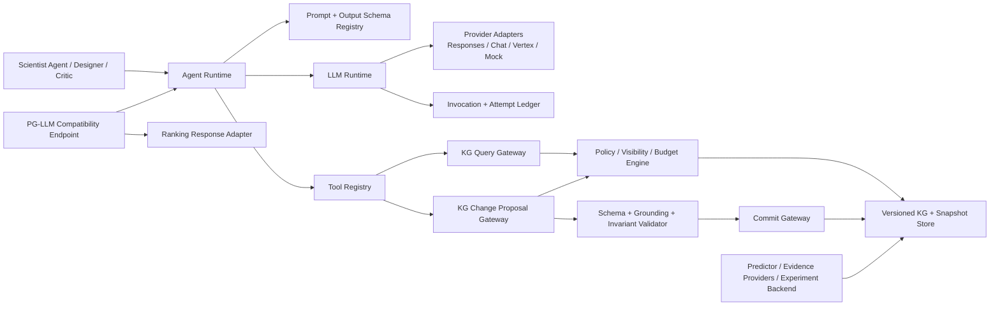
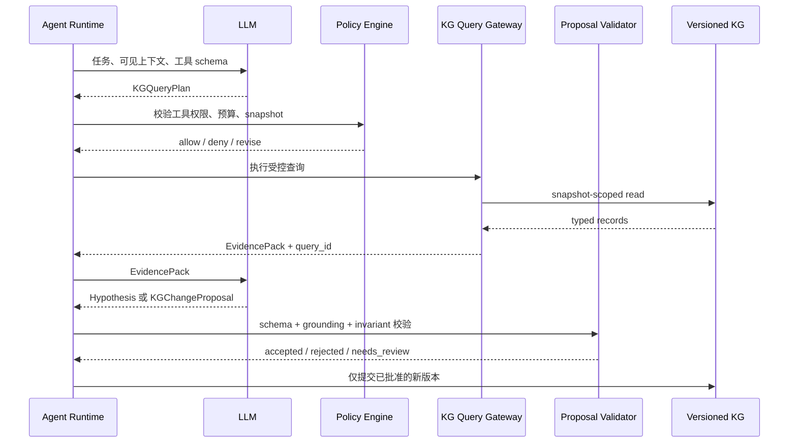
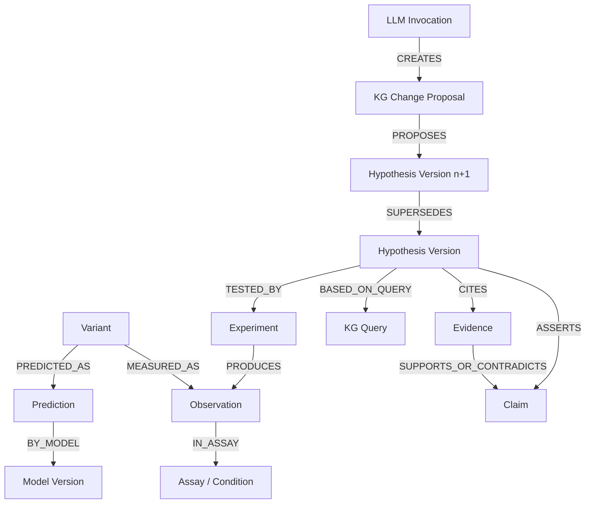

# PG-LLM 复用与 LLM-KG 可插拔架构可行性分析

> 日期：2026-08-15  
> 状态：架构分析与优化建议，不包含代码修改  
> PG-LLM 审阅快照：`7b8abf423bc6e797c3a023a2c435f27f258eaa76`（2026-07-28）  
> 当前系统：`fitness-agents`，GB1 虚拟定向进化 MVP

## 1. 执行结论

可以参考和复用 PG-LLM 的 LLM 调用策略，并建议这样做；但应区分两条不同的集成路径：

1. **复用 PG-LLM 的调用工程思想**：模型注册表、无密钥配置、请求描述符与指纹、Prompt 版本、Provider 响应归一化、完整 attempt 保存、原子写入、可恢复执行、截断/失败分类、模型身份与 token usage 校验。这部分与当前系统高度互补，可行性高。
2. **把当前系统接入 PG-LLM 做评测**：PG-LLM 评测的是“给定 WT、assay 描述和候选全序列后，对候选进行完整排序”的能力，不直接评测定向进化闭环、主动学习或 KG 写回。因此需要独立的 PG-LLM 兼容端点和任务映射层，可行性中等偏高，但只能测当前系统的“排序推理切片”，不能代替完整 Agent 评测。

知识图谱可以成为核心模块，但不建议让 LLM 直接执行 SQL/Cypher 或直接修改事实。合理的目标是：

> LLM 通过受控、可审计、版本化的工具调用查询 KG；LLM 只能提交知识变更提案；策略与验证层决定是否把提案提交为新的 Hypothesis、AgentAssertion 或关系版本。Observation、Prediction 和计算型 Evidence 只能由对应可信生产者写入。

总体可行性判断：

| 方向 | 可行性 | 建议 |
|---|---:|---|
| 复用 PG-LLM 调用规范 | 高 | 优先实施 |
| LLM Provider 可插拔化 | 高 | 抽离为独立运行时 |
| KG 多步查询增强 | 高 | 使用受控 Query DSL 和工具注册表 |
| LLM 直接修改 KG | 低且风险高 | 不采用 |
| LLM 提案、验证后提交 KG | 中高 | 采用 proposal/validate/commit 流程 |
| 接入 PG-LLM 单元测试/冒烟 | 高 | 使用公开 Prompt 和合成 fixture |
| 参与 PG-LLM clean leaderboard | 中 | 必须冻结系统、审计数据暴露并使用只读 KG |
| 用 PG-LLM 评价完整定向进化闭环 | 低 | 另建 campaign benchmark，不混用概念 |

## 2. 分析范围与决策依据

本分析采用以下路径，而不是直接把 PG-LLM 当作依赖接入：

1. 审阅 PG-LLM 的模型注册、Provider 调用、Prompt、运行器、结果 schema、重试、日志、测试、许可证与 benchmark-use policy。
2. 将 PG-LLM 的工程能力拆成“可复用调用基础设施”和“仅适用于排序 benchmark 的任务逻辑”。
3. 对照当前系统的 `LLMClient`、`ScientistAgent`、`KnowledgeGraphTool`、SQLite KG 和四类实体。
4. 先定义数据可见性、事实写入权和审计边界，再设计 Agent 工具调用。
5. 最后设计 PG-LLM 兼容层，避免 benchmark 需求反向污染核心业务模型。

这是一份架构决策摘要，不记录逐字推演过程；重点保留可验证的依据、权衡和实施结论。

## 3. PG-LLM 实际提供了什么

PG-LLM 是一个 evaluation-only 的蛋白质变体排序 benchmark。每个 episode 向模型提供 WT 序列、assay 描述和打乱顺序的候选全序列，模型必须输出包含全部候选且不重复的 best-to-worst 排名，按 assay 内 Spearman 相关性评分，再逐级做宏平均。它不是 Agent 框架，也不包含 KG 查询或定向进化迭代器。[PG-LLM README](https://github.com/rohitarorayyc/proteingym-llm/blob/7b8abf423bc6e797c3a023a2c435f27f258eaa76/README.md)

### 3.1 最值得复用的调用策略

| PG-LLM 能力 | 具体做法 | 对当前系统的价值 |
|---|---|---|
| Secret-free Model Registry | 模型、Provider、API style、reasoning、token/context 限制写配置；密钥和 endpoint 只引用环境变量 | 将当前单一 OpenAI 客户端变为可配置 Provider |
| 配置严格校验 | 拒绝未知字段、明文 URL/密钥、非法模型名、不兼容 Provider 参数 | 避免隐式配置漂移和凭据泄漏 |
| Request Descriptor | 生成不含凭据和 endpoint 明文的公开请求描述 | 便于审计和比较实验条件 |
| Request Fingerprint | 对规范化 descriptor 做稳定 SHA-256 | 同一调用条件可去重、复现和防漂移 |
| Prompt/Split Hash | 保存 Prompt 版本、Prompt hash、候选 split hash | 能证明两次 Agent 实验输入是否相同 |
| Provider 归一化 | 统一 Responses、Chat Completions 和 Vertex 返回字段 | 业务层不再依赖某一 SDK 的响应形状 |
| 模型身份校验 | 校验 Provider 实际返回的 model id | 防止网关静默路由到别的模型 |
| Usage/Reasoning 校验 | 可要求完整 token usage 和 reasoning trace 元数据 | 支持成本、调用深度和失败审计 |
| Attempt Ledger | 每个外部请求分配独立 attempt id，调用前先落盘 | 进程中断后可区分“未调用”和“调用未返回” |
| Event Journal | 流式 Responses 事件逐条追加并 fsync | 保留不完整流和终止事件证据 |
| Fail-closed Result | 缺排名、重复 ID、截断、模型身份不符、状态异常均不评分 | 可迁移到结构化 Hypothesis/ToolCall 校验 |
| Retry Ownership | Provider client 一次只发一个请求；重试由 runner 管理，每次重试单独记账 | 避免 SDK 隐式重试造成重复调用和不可审计成本 |
| Atomic/Resumable Output | 临时文件写完后替换；成功 cell 自动跳过 | 适合多轮 campaign 和大规模消融 |
| Raw Payload Preservation | 完整保留 Provider payload；大响应确定性压缩并校验 hash | 支持后续响应解析修复和独立审计 |

主要实现依据见 [model registry validation](https://github.com/rohitarorayyc/proteingym-llm/blob/7b8abf423bc6e797c3a023a2c435f27f258eaa76/config/models.py)、[provider client](https://github.com/rohitarorayyc/proteingym-llm/blob/7b8abf423bc6e797c3a023a2c435f27f258eaa76/src/client.py)、[resumable runner](https://github.com/rohitarorayyc/proteingym-llm/blob/7b8abf423bc6e797c3a023a2c435f27f258eaa76/src/run.py) 和 [payload integrity](https://github.com/rohitarorayyc/proteingym-llm/blob/7b8abf423bc6e797c3a023a2c435f27f258eaa76/src/payloads.py)。

### 3.2 不应直接照搬的部分

1. PG-LLM 的核心输出只有 `ranking`，当前系统需要 Hypothesis、候选生成、Critic、工具调用和多轮状态。
2. PG-LLM Prompt 明确不提供结构、MSA、mutation shorthand 或实验标签；当前 KG Agent 的上下文更丰富，二者必须作为不同测试条件。
3. PG-LLM 是 CLI/benchmark 工程，不是稳定 SDK；其顶层包名包含通用的 `src` 和 `config`，直接作为运行时库导入容易产生包冲突和升级耦合。
4. PG-LLM 的公开 Prompt parser 是为完整排名设计的，不能直接充当通用结构化 Agent 输出解析器。
5. PG-LLM 保存公开 reasoning trace 的方式不能等同于完整内部思维链。当前系统应保存可审计的短理由、证据引用、工具调用和决策摘要，不应依赖或要求隐藏思维过程。

因此建议：**复用协议和工程模式，避免把 PG-LLM 内部模块直接耦合进核心包**。若复制或改写实质性代码，应保留 MIT 版权与许可证通知。[PG-LLM MIT License](https://github.com/rohitarorayyc/proteingym-llm/blob/7b8abf423bc6e797c3a023a2c435f27f258eaa76/LICENSE)

## 4. 当前系统与目标状态的差距

| 当前状态 | 主要限制 | 目标状态 |
|---|---|---|
| `LLMClient.generate_hypothesis(...)` | 接口绑定单一业务动作 | 通用 `LLMRuntime.invoke(LLMRequest) -> LLMResult` |
| OpenAI Responses 直接调用 | 无 registry、request fingerprint、usage/model identity 校验 | Provider adapter + validated model registry |
| JSON Schema 只覆盖 Hypothesis | 没有通用 ToolCall、RankVariants、Critique、ChangeProposal schema | 任务类型与输出 schema 注册表 |
| Prompt 字符串内嵌代码 | 难以版本化、hash、比较和 PG 映射 | PromptTemplate registry + prompt version/hash |
| KG 自动返回固定上下文 | LLM 不能选择查询，也没有多步查询预算 | Tool registry + query plan + bounded execution |
| `hypothesis_context`/`explain_variant` | 查询面窄、结果仍是自由 dict | 版本化 `KGQueryRequest/Result` |
| Agent 无工具调用循环 | 当前只是“先查一次，再调用 LLM” | plan → query → observe → revise → finalize |
| Agent query 有记录 | 缺 attempt、tool call、input/output hash、策略决策 | 统一 Invocation/Tool ledger |
| LLM 不能修改 KG | 安全，但无法积累 Agent 结论 | ChangeProposal → validate → commit |
| 四类实体已区分 | 缺公共 envelope、schema version、scope、content hash、supersession | 不可变、版本化、带来源的数据契约 |
| KG 仍硬编码 GB1 `VDGV` 和 39/40/41/54 | 不能直接覆盖 PG-LLM 的 217 assay/full sequence | Protein/Assay/Position 显式化，任务无关 mutation mapping |
| `Hypothesis.preferred_residues` 是 GB1 特化字段 | 不能表达通用排序、机制或组合假设 | 通用 claim + intervention + expected outcome |

## 5. 推荐的目标架构



### 5.1 模块职责

#### A. Model Registry

定义模型别名、Provider、API style、模型 ID、允许的返回模型 ID、reasoning effort、context/output 限制、流式能力、usage 要求、超时和环境变量名。配置中不得保存密钥或 endpoint 明文。

#### B. Prompt and Schema Registry

每个 Agent 动作使用独立、版本化的 Prompt 与输出 schema，例如：

- `hypothesis.generate/v2`
- `hypothesis.revise/v1`
- `candidate.rank/v1`
- `candidate.critique/v1`
- `kg.query.plan/v1`
- `kg.change.propose/v1`

运行时记录模板版本、渲染后 prompt hash、schema id/version/hash 和输入 artifact hash。

#### C. LLM Runtime

业务无关的调用入口，负责：

1. 校验 `LLMRequest`。
2. 计算 request descriptor/fingerprint/idempotency key。
3. 估算 context，超限时 fail closed 或使用明示的压缩策略。
4. 调用单一 Provider adapter，一次 attempt 只发一个外部请求。
5. 归一化结果、校验 model identity/usage/status/结构化输出。
6. 保存 raw payload pointer/hash、错误分类和 attempt ledger。
7. 由 runner 决定是否启动新的 retry attempt。

#### D. Agent Runtime

负责多步状态机，而不是 Provider SDK：

```text
PREPARE_CONTEXT
  → PLAN_TOOLS
  → VALIDATE_PLAN
  → EXECUTE_TOOL_CALLS
  → BUILD_EVIDENCE_PACK
  → GENERATE_OR_REVISE
  → VALIDATE_GROUNDING
  → FINALIZE_OUTPUT or REQUEST_MORE_EVIDENCE
```

每个步骤都设置最大工具调用次数、最大深度、最大返回行数、token/cost/time 预算和终止原因。

#### E. Tool Registry

工具通过 schema 注册，不把 Python 对象或任意函数直接暴露给模型。注册项至少包含：

- `tool_name` 与 `version`
- JSON input/output schema
- `capability`: read/query/propose/commit
- 数据可见性级别
- 允许调用的 Agent role
- side-effect 等级
- timeout、row limit、cost class
- 幂等性策略

#### F. Invocation and Tool Ledger

至少记录：

- invocation/attempt/tool_call ID
- campaign/round/agent role
- provider/model/reasoning effort
- prompt/schema/request fingerprint
- 输入 artifact IDs 与 snapshot ID
- tool name/version、参数 hash、结果 hash、行数
- token usage、耗时、成本估计
- status、stop reason、error class、retryable
- raw provider payload 引用与 hash
- 最终输出及其 evidence/query/proposal IDs

## 6. LLM 调用契约的规范化建议

### 6.1 `LLMRequest`

| 字段组 | 建议字段 |
|---|---|
| 身份 | `invocation_id`, `task_type`, `agent_role`, `campaign_id`, `round_id` |
| 模型 | `model_alias`, `provider`, `reasoning_effort`, `max_output_tokens` |
| Prompt | `prompt_id`, `prompt_version`, `messages`, `prompt_sha256` |
| 输出 | `output_schema_id`, `output_schema_version`, `output_schema_sha256` |
| 工具 | `allowed_tools`, `tool_policy_id`, `max_tool_calls`, `max_tool_depth` |
| 数据 | `input_artifact_ids`, `input_hashes`, `kg_snapshot_id`, `visibility_scope` |
| 预算 | `timeout_s`, `token_budget`, `cost_budget`, `row_budget` |
| 复现 | `request_descriptor`, `request_fingerprint`, `idempotency_key` |

### 6.2 `LLMResult`

| 字段组 | 建议字段 |
|---|---|
| 结果 | `structured_output`, `output_schema_valid`, `grounding_valid` |
| 调用 | `invocation_id`, `attempt_id`, `provider_request_id` |
| 身份 | `requested_model_id`, `response_model_id`, `model_identity_valid` |
| 工具 | `tool_calls`, `tool_call_count`, `query_ids`, `proposal_ids` |
| 资源 | `usage`, `reasoning_tokens`, `elapsed_s`, `estimated_cost` |
| 状态 | `status`, `stop_reason`, `incomplete_reason`, `failure_class`, `retryable` |
| 审计 | `response_payload_ref`, `response_payload_sha256`, `created_at` |

### 6.3 Retry 原则

1. Provider adapter 不做隐藏重试。
2. transport failure、429、5xx 可以创建新 attempt。
3. policy block、invalid request、权限、quota exhaustion 不自动重试。
4. schema invalid、缺字段、截断最多允许一次显式修复 attempt，旧响应必须保留。
5. 工具调用失败与 LLM Provider 失败分开分类。
6. 同一 idempotency key 的 side-effect tool 不得重复提交。

## 7. LLM 应如何合理调用知识图谱

### 7.1 核心原则

1. **LLM 不直接连接数据库。** 不向模型暴露 SQL、Cypher、数据库 URI 或文件路径。
2. **查询与修改分离。** Query tool 为只读；修改必须先生成 ChangeProposal。
3. **基于快照查询。** 每次推理绑定 `kg_snapshot_id` 和 `as_of_round`，避免同一推理过程中视图漂移。
4. **最小权限。** PG evaluation、普通 Scientist Agent、Critic 和管理员拥有不同 capability。
5. **结果有界。** 限制行数、字段、深度和 token，优先返回带来源的 EvidencePack。
6. **事实类型不可混淆。** measured、computed、curated、agent_inferred 使用不同 predicate/authority。
7. **写入不可变。** 不原地覆盖实体；使用新版本、`supersedes`、`retracts` 和状态转换。
8. **每次工具调用可重放。** 保存规范化参数、snapshot、结果 hash 和策略判定。

### 7.2 推荐查询工具

| 工具 | 用途 | 副作用 |
|---|---|---|
| `kg.search_entities` | 按 protein/assay/type/source 筛选实体 | 无 |
| `kg.get_variant_context` | 返回候选的序列、突变、历史观测、预测、证据 | 无 |
| `kg.get_position_evidence` | 查询位点/残基的支持、反例和结构上下文 | 无 |
| `kg.compare_variants` | 在同一 assay/snapshot 下比较候选 | 无 |
| `kg.get_conflicting_evidence` | 返回相互矛盾的证据及作用域 | 无 |
| `kg.trace_provenance` | 追踪 prediction/evidence/hypothesis 来源 | 无 |
| `kg.get_hypothesis_history` | 查看历史假设、状态和实验结果 | 无 |
| `kg.propose_change` | 提交 Hypothesis/Assertion/Relation 变更提案 | 只新增 proposal |
| `kg.validate_proposal` | schema、grounding、权限和并发检查 | 无 |
| `kg.commit_proposal` | 在批准后提交新版本 | 受控写入 |

查询请求应是结构化 DSL，例如：

```json
{
  "schema": "fitness-agents.kg-query",
  "version": 1,
  "operation": "get_position_evidence",
  "scope": {
    "protein_id": "GB1",
    "assay_id": "gb1_igg_binding",
    "as_of_round": 2,
    "snapshot_id": "kg:campaign-17:r2"
  },
  "filters": {
    "positions": [39, 40, 41, 54],
    "evidence_types": ["measured", "computed", "curated"]
  },
  "limit": 20,
  "include_conflicts": true
}
```

### 7.3 多步 Query–Think–Propose 流程



### 7.4 LLM 可以和不可以修改什么

| 实体/动作 | LLM 权限 | 原因 |
|---|---|---|
| 新建 Hypothesis draft | 可提案并自动提交 | 本身是 Agent 推断，不是假装事实 |
| 修订 Hypothesis | 可提案；创建新版本 | 保留历史与反例 |
| 新建 AgentAssertion | 可提案；低 authority | 允许积累解释，但必须与事实隔离 |
| 建立 `SUPPORTS/CONTRADICTS` 关系 | 可提案；需引用现有 Evidence ID | 确保 grounded |
| 标记 Hypothesis supported/refuted | 可提案；由评估器依据 Observation 决定 | 防止 LLM 自我确认 |
| 写入 Observation | 禁止 | 只能由 ExperimentBackend/LIMS 写入 |
| 修改 Observation 数值 | 禁止 | 用 correction/supersession，由数据管理员或 backend 执行 |
| 写入 Prediction | 禁止 | 只能由版本化 FitnessPredictor 写入 |
| 写入计算型 Evidence | 禁止 | 只能由 EvidenceProvider 写入 |
| 删除事实/证据 | 禁止 | 只能提议 retract，保留历史 |
| 执行任意 SQL/Cypher | 禁止 | 防注入、越权和标签泄漏 |

### 7.5 三种运行权限模式

1. `READ_ONLY_EVAL`：PG-LLM 和正式 final evaluation；KG 固定快照，不允许持久写入。
2. `CAMPAIGN_AGENT`：允许查询和提交 Hypothesis/AgentAssertion proposal，不允许写 Observation/Prediction。
3. `TRUSTED_INGEST`：仅 ExperimentBackend、Predictor 和 EvidenceProvider 使用，按各自 schema 写入。

人工管理员可以拥有单独的 `CURATION_REVIEW` 权限，但不应由普通 LLM Agent继承。

## 8. Observation、Prediction、Evidence、Hypothesis 的进一步规范

### 8.1 公共 Entity Envelope

四类实体应共享以下不可变元数据：

| 字段 | 说明 |
|---|---|
| `entity_id` | 全局稳定 ID |
| `entity_type` | observation/prediction/evidence/hypothesis |
| `schema_version` | 契约版本 |
| `record_version` | 同一逻辑实体的版本号 |
| `campaign_id`, `round_id` | 闭环位置 |
| `protein_id`, `assay_id`, `condition_id` | 作用域 |
| `created_at`, `created_by` | 时间和生产者 |
| `source_ids` | 上游 artifact/entity IDs |
| `content_sha256` | 规范化内容 hash |
| `visibility` | public/observed/oracle/final/private |
| `status` | active/superseded/retracted/invalid |
| `supersedes_id` | 版本替代关系 |

所有实体采用 append-only；修正通过新版本表达，不原地改历史记录。

### 8.2 Observation

Observation 表示“在明确 assay/condition 下对完整 variant 的真实测量”，建议字段：

- `observation_id`, `variant_id`, `assay_id`, `condition_id`
- `raw_value`, `raw_unit`, `normalized_fitness`, `directionality`
- `replicate_values` 或 `replicate_ids`, `replicate_count`
- `measurement_error`, `qc_status`, `qc_flags`
- `batch_id`, `sample_id`, `experiment_run_id`
- `round_revealed`, `measured_at`, `source_uri/source_hash`
- `normalization_method`, `normalization_version`
- `visibility` 与 reveal receipt

关键约束：

1. `fitness` 不再是唯一、无上下文的浮点数。
2. raw measurement 与 normalized fitness 分开。
3. failed/inconclusive 不得自动等于 0 fitness。
4. 多次测量保留为独立 Observation 或显式 replicate group。
5. Observation 不能由 LLM 创建或更改。

### 8.3 Prediction

Prediction 表示一个模型版本在一个确定输入快照上的输出，建议字段：

- `prediction_id`, `variant_id`, `assay_id`, `round_id`
- `model_id`, `model_version`, `model_artifact_sha256`
- `training_snapshot_id`, `feature_snapshot_id`, `input_signature`
- `mean`, `median`, `std`, `quantiles`, `intervals`
- `epistemic_uncertainty`, `aleatoric_uncertainty`
- `ood_score`, `ood_method`, `calibration_version`
- `component_scores`
- `created_at`, `inference_config_hash`
- `intervention_tags`, `status`

关键约束：

1. Prediction 永远不使用 `is_measured` 混合表达 Observation。
2. 区间必须声明 coverage 与 calibration 方法。
3. 同一 variant 可有多个模型/轮次 Prediction，不覆盖。
4. Agent 引用 Prediction 时必须引用 `prediction_id`，不能只复述数值。

### 8.4 Evidence

Evidence 表示支持或反驳一个 claim 的可追踪材料，建议将“Evidence Record”和“Claim”分开：

- `evidence_id`, `subject_id`, `claim_id`
- `channel`: physchem/conservation/structure/observation_aggregate/literature/other
- `evidence_class`: measured/computed/curated/agent_inferred
- `direction`: supports/contradicts/neutral
- `value`, `unit`, `score`
- `quality_score`, `confidence`, `confidence_semantics`
- `method_id`, `method_version`, `parameters_hash`
- `source_uri`, `source_sha256`, `license`
- `scope`: protein/position/variant/assay/condition
- `as_of_round`, `snapshot_id`, `valid_from`, `valid_to`
- `dependency_ids`, `conflict_group_id`

关键约束：

1. 结构分数、保守性、实验聚合和文献结论的 confidence 含义不同，必须声明语义。
2. `Mutation improves Fitness` 不能作为无 assay、无背景序列的事实。
3. Evidence 必须允许反例和冲突并存，不能只保存支持证据。
4. LLM 只能增加 AgentAssertion 或关系 proposal，不能伪装成 computed/curated evidence。

### 8.5 Hypothesis

Hypothesis 应从 GB1 特化的 `preferred_residues` 扩展为可版本化的科学主张：

- `hypothesis_id`, `hypothesis_version`, `parent_hypothesis_id`
- `campaign_id`, `round_created`, `created_by_invocation_id`
- `claim_type`: association/mechanism/interaction/design_rule
- `scope`: protein/assay/condition/positions/variant set
- `statement`
- `intervention_spec` 或 candidate constraints
- `supporting_evidence_ids`, `contradicting_evidence_ids`, `query_ids`
- `assumptions`, `known_conflicts`
- `expected_outcome` 的结构化指标、方向和阈值
- `falsification_criterion` 的可执行条件
- `confidence` 与更新规则
- `status`: draft/active/supported/refuted/inconclusive/superseded
- `tested_by_experiment_ids`, `revision_reason`

关键约束：

1. status 由评估逻辑基于新 Observation 更新，不由 LLM 自报。
2. 每次修订产生新版本并说明新增/删除的证据。
3. 假设必须引用 evidence/query IDs，不能只保存自然语言。
4. “预期提升”必须带比较基线、指标和失败条件。

### 8.6 推荐关系模型



## 9. 接入 PG-LLM 的推荐方式

### 9.1 两个适配器，不混为一个

#### `PGLLMProviderStyleAdapter`

目标是把 PG-LLM 的 Provider 工程规范引入当前系统：registry、request descriptor、fingerprint、attempt ledger、normalized result 和 retry policy。它属于核心 LLM runtime，不依赖 PG-LLM evaluation data。

#### `PGLLMBenchmarkBridge`

目标是让 PG-LLM 把当前系统视为一个 OpenAI-compatible endpoint：

```text
PG-LLM prompt
  → /v1/responses 或 /v1/chat/completions
  → PG task mapper
  → RankVariants Agent task
  → 可选只读 KG 查询
  → 完整 ranking
  → PG-LLM canonical parser/scorer
```

PG-LLM 当前支持 Responses、Chat Completions 和 Google Vertex；最简单的兼容路径是实现单独的 OpenAI-compatible Responses endpoint，并在正式运行前使用 `pgllm-models` 探测。[endpoint configuration](https://github.com/rohitarorayyc/proteingym-llm/blob/7b8abf423bc6e797c3a023a2c435f27f258eaa76/README.md#configure-an-endpoint)

### 9.2 `RankVariants` 任务契约

当前 `generate_hypothesis` 不能直接映射 PG-LLM。需要新增通用任务概念：

- 输入：protein name、organism、assay description、WT sequence、匿名候选 ID 与 full sequence。
- 输出：包含全部候选且不重复的 `ranking`，可选每项短理由和 evidence IDs。
- 严格校验：缺失、重复、未知 candidate ID、截断或非完整排序均失败。
- 最终 PG 响应必须符合公开 Prompt 要求，在最后输出 `{"ranking": [...]}`。

PG-LLM 的公开 Prompt 和 parser 逻辑可以作为兼容测试依据。[versioned inference prompt](https://github.com/rohitarorayyc/proteingym-llm/blob/7b8abf423bc6e797c3a023a2c435f27f258eaa76/prompts/inference_prompt.md)、[ranking parser and scorer](https://github.com/rohitarorayyc/proteingym-llm/blob/7b8abf423bc6e797c3a023a2c435f27f258eaa76/src/prompt.py)

### 9.3 PG-LLM 评测中的 KG 约束

PG-LLM 明确禁止把发布的 evaluation candidate sets 或 held-out labels 用于训练、继续训练、蒸馏、检索增强、Prompt 优化或 benchmark-specific 调参。公开代码、文档、Prompt 模板和公开 reasoning traces 不在该限制内。[benchmark-use policy](https://github.com/rohitarorayyc/proteingym-llm/blob/7b8abf423bc6e797c3a023a2c435f27f258eaa76/BENCHMARK_USE_POLICY.md)

因此 clean evaluation 模式必须满足：

1. KG 使用正式评测前冻结的通用快照。
2. KG 中不得包含 PG-LLM evaluation candidate sets、held-out labels 或由其结果产生的 tuning 记录。
3. 当前 episode 候选只存在于请求级 ephemeral memory，不写入持久 KG。
4. 不把 PG-LLM 得分反馈给 Agent 或 KG。
5. 运行结束不增量学习，不更新 Prompt、query policy 或 ranking rule。
6. 记录 `kg_snapshot_id/hash`、训练数据 manifest 和 exposure declaration。
7. 若系统曾接触 evaluation splits 用于开发或调参，应明确披露，不能宣称 clean leaderboard eligibility。

### 9.4 推荐评测矩阵

| 条件 | 用途 | 是否属于 PG-LLM 原始模型能力 |
|---|---|---|
| LLM only | 复现 PG-LLM 标准调用 | 是 |
| LLM + frozen KG read | 测试通用知识检索增益 | 否，属于 Agent 系统，需单独标注 |
| LLM + predictor | 测试模型工具增强 | 否，需单独标注 |
| LLM + KG + predictor | 测试完整排序子系统 | 否，不能与纯 LLM 结果混报 |
| Full campaign loop | 测主动学习和迭代收益 | PG-LLM 不覆盖，使用自有闭环 benchmark |

对所有条件应固定同一 PG split、seed、endpoint spec 和 Prompt version，报告 paired 差异而不只报告单个总分。

### 9.5 接入顺序

1. 使用合成 WT/candidate fixture 验证完整 ranking parser，不接触 PG evaluation bundle。
2. 实现 endpoint probe，确认 response model id、usage、reasoning、context/output 限制。
3. 用 PG-LLM README 建议的单 assay、N=50、seed=1 做一次受控冒烟。
4. 固化代码、配置、KG snapshot 和 exposure manifest。
5. 再运行 217 assays × 3 fixed seeds × N=50 主评测。
6. 分开保存 LLM-only 与 Agent/KG 增强条件，不覆盖 canonical 结果。

## 10. 建议的目标优化模块

以下只是未来模块边界建议，本分析没有创建这些代码文件。

```text
src/fitness_agents/
  llm/
    contracts.py          # LLMRequest/Result/Attempt/ToolCall
    registry.py           # secret-free model registry
    prompt_registry.py    # prompt/schema version and hashes
    runtime.py            # invoke + validation + retry orchestration
    ledger.py             # immutable invocation/attempt journal
    providers/
      mock.py
      openai_responses.py
      openai_chat.py
      google_vertex.py
  knowledge/
    contracts.py          # KGQuery/Result/ChangeProposal
    tool_registry.py
    query_gateway.py
    proposal_gateway.py
    policy.py              # visibility/capability/budget
    validators.py          # grounding/invariants/concurrency
    snapshots.py
  contracts/entities/
    common.py
    observation.py
    prediction.py
    evidence.py
    hypothesis.py
  integrations/pgllm/
    endpoint.py
    task_mapper.py
    response_adapter.py
    exposure_manifest.py
```

### 10.1 优先级与阶段

| 阶段 | 目标 | 关键产物 | 退出条件 |
|---|---|---|---|
| P0 契约冻结 | 统一四类实体和 LLM/KG request/result schema | schema 文档、JSON Schema、迁移说明 | schema version、ID、visibility 和 provenance 定义完整 |
| P1 LLM Runtime | 复用 PG-LLM 调用规范 | registry、Provider adapter、attempt ledger、prompt hash | Mock/Responses/Chat contract tests 通过，失败可恢复 |
| P2 KG Read | 支持多步、受控、可审计查询 | tool registry、Query DSL、snapshot、EvidencePack | 无 raw SQL；查询 budget、visibility、hash 测试通过 |
| P3 KG Proposal | 支持 Agent 提案和受控提交 | ChangeProposal、validator、commit gateway | LLM 无法写 Observation/Prediction；并发和回滚测试通过 |
| P4 通用蛋白任务 | 移除 GB1 硬编码 | Protein/Assay/Position schema、通用 mutation mapping | 至少 GB1 + 第二蛋白端到端通过 |
| P5 PG Bridge | 接入 PG-LLM 测试 | OpenAI-compatible endpoint、RankVariants、exposure manifest | 合成 fixture、probe、单 assay 冒烟通过 |
| P6 实验评估 | 比较 LLM/KG/模型增益 | paired benchmark 报告 | LLM-only、KG-read、predictor 条件可独立复现 |

## 11. 测试与验收方向

### 11.1 LLM Runtime

- registry 拒绝明文 secret、endpoint、未知字段和不兼容 Provider 参数；
- request fingerprint 对字段顺序稳定，对有效配置变化敏感；
- 实际 response model id 不符时 fail closed；
- usage、reasoning metadata、stop status 和截断判定有 contract tests；
- 每次 retry 创建新 attempt，不覆盖旧 payload；
- raw payload/hash 可验证，日志不包含 secret/base URL；
- Prompt/schema/hash 和输入 artifact IDs 可重放。

### 11.2 KG Query/Proposal

- 隐藏 oracle/final label 无法通过任何 query operation 返回；
- snapshot/as-of-round 可见性正确；
- limit、depth、cost 和 tool-call budget 生效；
- 查询参数注入不能变成 SQL/Cypher；
- ToolResult 必须包含 query ID、snapshot、provenance 和 result hash；
- ChangeProposal 引用不存在的 evidence/query 时拒绝；
- LLM 对 Observation/Prediction 的写入请求被拒绝；
- stale snapshot 下 commit 触发乐观并发冲突；
- proposal 重放具有幂等性；
- retraction/supersession 保留完整历史。

### 11.3 四类实体

- schema round-trip 和版本迁移；
- content hash 稳定；
- Observation raw/normalized、replicate/QC 约束；
- Prediction model/training/feature snapshot 完整；
- Evidence class/direction/scope/conflict 可表达；
- Hypothesis status 只能由评估器按 Observation 转换；
- measured/computed/agent_inferred predicate 不混淆。

### 11.4 PG-LLM 兼容

- 完整候选排名，无缺失、重复或未知 ID；
- endpoint 同时通过 Responses 或 Chat 中至少一种 probe；
- PG 模式为只读 KG、ephemeral candidate context；
- exposure manifest 不含 evaluation data；
- canonical PG 结果与 Agent/KG 增强结果分目录、分 run label；
- interrupted run 可恢复且不会重复已成功 cell。

## 12. 主要风险与缓解措施

| 风险 | 后果 | 缓解 |
|---|---|---|
| 把 PG-LLM 当完整 Agent benchmark | 错误评价 KG/闭环价值 | 只称为 ranking slice；闭环使用自有 benchmark |
| KG 含 PG evaluation 数据 | 失去 clean leaderboard 资格 | 冻结快照、exposure manifest、候选 exact-match 审计 |
| LLM 直接改事实 | 证据污染、自我强化 | proposal/validate/commit；authority 分层 |
| 查询结果过大 | token/cost 增长、注意力稀释 | row/depth/token budget、EvidencePack 摘要 |
| 把 Prediction 当 Observation | 标签泄漏和错误学习 | 不同实体、predicate、writer capability |
| Prompt/配置漂移 | 实验不可比较 | version/hash/fingerprint、run manifest |
| Provider 隐式重试 | 重复费用和不可审计调用 | adapter 单次请求，runner 管 retry |
| PG-LLM 内部 API 变化 | 直接依赖易破坏 | 通过 OpenAI-compatible endpoint 集成，不 import 内部模块 |
| GB1 硬编码 | 无法泛化到 217 assays | P4 先完成通用 Protein/Assay/Position schema |
| Reasoning trace 合规问题 | 暴露敏感推理或依赖不可用字段 | 保存决策摘要、证据与工具轨迹，不要求隐藏思维链 |

## 13. 需要冻结的架构决策

进入代码修改前，建议先确认以下决策：

1. 核心 LLM 协议采用 provider-neutral `invoke`，业务动作通过 `task_type + output_schema` 表达。
2. PG-LLM 只作为外部 benchmark runner，通过 OpenAI-compatible endpoint 对接，不作为核心包运行时依赖。
3. KG 不开放 raw SQL/Cypher；只开放版本化、allow-listed Query DSL。
4. LLM 不直接修改 KG 事实；只能创建 ChangeProposal。
5. Observation、Prediction、Evidence 的可信写入者分别是 ExperimentBackend、FitnessPredictor、EvidenceProvider。
6. Hypothesis 和 AgentAssertion 可以由 LLM 提案，但必须保存 invocation/query/evidence 关联。
7. 所有实体和调用记录 append-only，通过 version/supersedes/retracts 演进。
8. PG evaluation 固定 `READ_ONLY_EVAL`、冻结 KG snapshot、禁止写回和后验调参。
9. LLM-only、LLM+KG、LLM+predictor、完整 Agent 四条结果线分开报告。
10. 在 PG bridge 前先移除 GB1 位点和任务描述硬编码。

## 14. 最终建议

最合理的实施顺序不是先“让 LLM 可以改图”，而是：

1. 先规范 LLM 调用与四类实体；
2. 再把 KG 查询做成受控、版本化工具；
3. 然后增加 ChangeProposal 和验证提交；
4. 最后以独立 endpoint 接入 PG-LLM。

PG-LLM 可显著提升当前系统在模型调用、失败处理、审计、可恢复性和 benchmark 接入方面的工程质量；但 KG Agent 的核心价值仍需通过自有闭环消融证明。PG-LLM 应作为“跨蛋白候选排序能力”的外部测试，而不是替代当前 Design–Score–Select–Test–Learn 主实验。

## 15. 参考资料

- [PG-LLM repository and README](https://github.com/rohitarorayyc/proteingym-llm/tree/7b8abf423bc6e797c3a023a2c435f27f258eaa76)
- [Model registry validation](https://github.com/rohitarorayyc/proteingym-llm/blob/7b8abf423bc6e797c3a023a2c435f27f258eaa76/config/models.py)
- [Provider client and normalized response handling](https://github.com/rohitarorayyc/proteingym-llm/blob/7b8abf423bc6e797c3a023a2c435f27f258eaa76/src/client.py)
- [Resumable runner and result schema](https://github.com/rohitarorayyc/proteingym-llm/blob/7b8abf423bc6e797c3a023a2c435f27f258eaa76/src/run.py)
- [Versioned inference prompt](https://github.com/rohitarorayyc/proteingym-llm/blob/7b8abf423bc6e797c3a023a2c435f27f258eaa76/prompts/inference_prompt.md)
- [Ranking parser and scorer](https://github.com/rohitarorayyc/proteingym-llm/blob/7b8abf423bc6e797c3a023a2c435f27f258eaa76/src/prompt.py)
- [Payload integrity and deterministic compression](https://github.com/rohitarorayyc/proteingym-llm/blob/7b8abf423bc6e797c3a023a2c435f27f258eaa76/src/payloads.py)
- [Benchmark-use policy](https://github.com/rohitarorayyc/proteingym-llm/blob/7b8abf423bc6e797c3a023a2c435f27f258eaa76/BENCHMARK_USE_POLICY.md)
- [MIT license](https://github.com/rohitarorayyc/proteingym-llm/blob/7b8abf423bc6e797c3a023a2c435f27f258eaa76/LICENSE)
