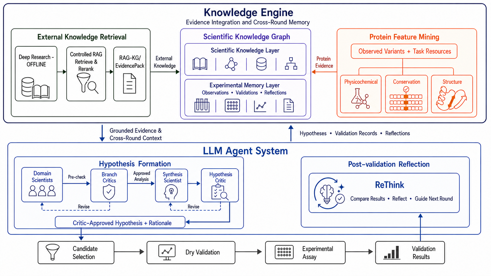

# EvoSEEK



`EvoSEEK` is an auditable, ablatable, and interface-swappable virtual protein directed-evolution system. The current MVP targets the GB1 four-site IgG-binding landscape as its main task and runs the Design → Score → Select → Test → Learn loop while keeping the true fitness hidden.

## 1. Environment Setup

### 1.1 Clone the repository

```bash
git clone https://github.com/H-Dw/EvoSEEK.git EvoSEEK
cd EvoSEEK
```

### 1.2 Install with Conda

```bash
conda env create -f environment.yml
conda activate EvoSEEK
python scripts/check_environment.py
```

`environment.yml` pins Python 3.11 and installs the core dependencies (including `httpx>=0.27,<1`) and the editable package. Remote LLM, RAG, Kermut, and UI still need their extras installed separately after activation, as described in §1.6.

### 1.3 Install optional extras by use case

The core environment does not force-install PyTorch. Install extras according to the scripts you actually need to run:

```bash
conda activate EvoSEEK

# Remote Scientist / Critic (DeepSeek or other OpenAI-compatible API)
python -m pip install -e ".[llm]"

# Local RAG vector retrieval (sentence-transformers)
python -m pip install -e ".[rag]"

# Scientific document parsing and ingestion
python -m pip install -e ".[rag-docs]"

# Kermut / ESM-2 fitness backend (installs PyTorch, GPyTorch, fair-esm)
python -m pip install -e ".[kermut]"

# Local Gradio interactive interface
python -m pip install -e ".[ui]"
```

Common combinations can be installed in one shot:

```bash
python -m pip install -e ".[dev,llm,rag]"
```

### 1.4 Configure secrets (`.env`)

Do **not** write secrets into YAML, and do not commit them to git. Create a `.env` in the repository root (already listed in `.gitignore`):

```bash
cat > .env <<'EOF'
# Scientist / Critic (defaults to DeepSeek V4)
DEEPSEEK_API_KEY='sk-...'

# Uncomment the next line if using Alibaba DashScope / Qwen embedding and reranker
# DASHSCOPE_API_KEY='sk-...'
EOF
```

At runtime the project root `.env` is read, and it will **not** override already-existing process environment variables. By default the `llm_agent` / `knowledge_agent*` experiments use `api_key: env:DEEPSEEK_API_KEY`. You can also use `FITNESS_AGENTS_LLM_API_KEY` or `OPENAI_API_KEY` as a general override.

Offline reproduction needs no keys: change the experiment YAML back to `llm_provider: mock`, or run the unit tests first.

Common environment variables:

| Variable | Purpose |
|---|---|
| `DEEPSEEK_API_KEY` | Default Scientist / Critic key |
| `DASHSCOPE_API_KEY` | Qwen embedding / reranker |
| `FITNESS_AGENTS_LLM_API_KEY` | General LLM key override |
| `FITNESS_AGENTS_LLM_BASE_URL` / `OPENAI_BASE_URL` / `DEEPSEEK_BASE_URL` | API gateway |
| `FITNESS_AGENTS_LOG_LEVEL` | Progress log level (default `INFO`) |
| `FITNESS_AGENTS_FORCE_DOWNLOAD` | Force re-download of the data archive when set to `1` |

### 1.5 Verify the environment is ready

```bash
python scripts/check_environment.py
python -c "import fitness_agents; print('import ok')"
python -m pytest tests/unit -q
```

`check_environment.py` prints the Python version, platform, and core package versions. The unit tests need no API key and do not depend on external data downloads.

Data and model assets are still prepared per §2 and §3; the default `python scripts/run_demo.py` requires `[llm]`, `[kermut]`, `DEEPSEEK_API_KEY` in `.env`, and Kermut's conditional-probability / coordinate files.

## 2. Data Download and Preparation

The download script pins a verified `J-SNACKKB/FLIP` commit and checks the archive SHA-256; if the pinned address is unavailable it falls back to the same repo's `main`, but any fallback file must still pass the same verification:

```bash
bash scripts/data/download_flip_gb1.sh
python scripts/data/prepare_gb1.py \
  --source data/raw/flip/gb1/four_mutations_full_data.csv
python scripts/data/validate_data.py
```

If you used an older script and saw a GitHub Raw `404`, confirm the repo in the script is `J-SNACKKB/FLIP`, then force a re-download:

```bash
grep 'REPOSITORY=' scripts/data/download_flip_gb1.sh
FITNESS_AGENTS_FORCE_DOWNLOAD=1 bash scripts/data/download_flip_gb1.sh
```

On success it prints `Verified archive`; the expected SHA-256 is
`85692d808dcd3ae54fa2ac31f4e590858d4582369b6c7b05df299b9b6c383bff`.

Two datasets are produced:

| Data | Split | Purpose |
|---|---|---|
| `data/demo/gb1_demo_*` | 64 initial + 32 validation + 352 oracle pool + 64 final | CPU demo, CI, quick ablation |
| `data/processed/gb1_full_*` | 96 initial + 96 validation + 147121 oracle pool + 2048 final | Full landscape experiment |

Each dataset is split into `*_public.csv` and `*_oracle.csv`. The public file contains no fitness; the oracle file may only be handed to `ExperimentBackend`. This split is for leak-prevention testing, not a cryptographic security boundary.

The raw GB1 measurements are CC BY 4.0; the FLIP derivative files and splits are AFL-3.0. Sources and statistics are written to `data/demo/data_manifest.json`.

### 2.1 Official five-fold dataset splits

The `prepare_gb1.py` above is retained for the old demo. The official closed loop and OOD experiments use a manifest-driven split; a single command must generate `fold_00` through `fold_04`, rather than treating five random seeds as five folds.

Build the GB1-AL96 closed-loop:

```bash
python scripts/data/build_splits.py \
  --dataset-spec configs/data/splits/gb1.yaml \
  --strategy al96_closed_loop \
  --n-folds 5 \
  --seed 20260815 \
  --protocol-version GB1-AL96-5CV-v1 \
  --output-root data/processed/splits
```

The 96 initial experiments for this config consist of 1 WT, all 76 single-point mutations, and 19 double-point mutations chosen blind to labels. The HD3/HD4 deployable universe is divided into five mutually exclusive outer final-test shards; each fold also has its own benchmark validation and a candidate pool queryable only through the oracle.

Build the FLIP-compatible static OOD:

```bash
python scripts/data/build_splits.py \
  --dataset-spec configs/data/splits/gb1.yaml \
  --strategy flip_static_ood \
  --ood-rule two_vs_rest \
  --population full \
  --n-folds 5 \
  --protocol-version FLIP-two-vs-rest-5CV-v1
```

Build the mutation-identity OOD:

```bash
python scripts/data/build_splits.py \
  --dataset-spec configs/data/splits/gb1.yaml \
  --strategy mutation_identity_ood \
  --mutation-row-policy contains_unseen \
  --mixed-policy quarantine \
  --n-folds 5 \
  --protocol-version Mutation-OOD-5CV-v1
```

Generate all three strategies at once:

```bash
python scripts/data/build_splits.py \
  --dataset-spec configs/data/splits/gb1.yaml \
  --strategy all \
  --n-folds 5 \
  --protocol-version v1
```

Inspect a fold's manifest, file hashes, and role counts:

```bash
python scripts/data/validate_data.py \
  --split-root data/processed/splits/GB1/al96_closed_loop/GB1-AL96-5CV-v1 \
  --fold-index 0
```

Output is capability-isolated into `agent/`, `controller/`, `oracle/`, and `evaluator/`. Candidate files have no target; queryable labels exclude final-test IDs; an existing directory is reused only when source/config/code match.

## 3. Model and Structure Assets

The default model is trained in-place from visible GB1 labels; there are no external pretrained weights. You should still run the model preparation script to generate a traceable manifest:

```bash
python scripts/models/download_models.py --profile baseline
```

To prepare the GB1 reference structure needed for structural evidence:

```bash
python scripts/models/download_models.py --profile structure
# or: bash scripts/models/download_models.sh --profile all
```

This downloads RCSB 5LDE and records the source and SHA-256. AlphaFold, Boltz, Rosetta, SaProt, or Kermut can later be plugged in through the `EvidenceProvider` / `FitnessPredictor` registries. The current structure channel is a versioned 5LDE site-risk prior; it does not equate ipTM with binding affinity or experimental fitness.

### 4.1 Local RAG vector retrieval and KG materialization diagnostics

The default config uses an English atomic-fact corpus with FTS5 + BGE dense hybrid retrieval. The general corpus/vector index lives at `artifacts/local_knowledge/corpus/directed_evolution-v4.sqlite`; the GB1 leak policy and query audit live separately in `artifacts/local_knowledge/overlays/gb1.sqlite` and never write target state back to the general vector store. Explicitly install dependencies and download a pinned revision before the first run; the campaign runtime does not touch the network:

```bash
python -m pip install -e ".[rag]"
python scripts/setup_local_rag_models.py --model bge-small-en-v1.5
python -m fitness_agents.cli knowledge index \
  configs/experiments/knowledge_agent.yaml
python -m fitness_agents.cli knowledge inspect \
  configs/experiments/knowledge_agent.yaml

python scripts/rag_diagnostics/simulate_local_rag_to_kg.py \
  --embedding-model models/embeddings/bge-small-en-v1.5 \
  --output-dir artifacts/rag-diagnostics/manual-run \
  --strict

export FITNESS_RAG_TEST_MODEL="$(pwd)/models/embeddings/bge-small-en-v1.5"
python -m pytest -q \
  tests/integration/test_local_rag_real_embedding_to_kg.py
```

The diagnostics output `diagnostic.json`, `summary.md`, a real-vector SQLite, and a structured-KG SQLite, and compare gold-query hit rates for lexical, dense, and hybrid retrieval. `--strict` also checks chunk token budget, model truncation, embedding coverage, no-answer threshold, and whether vector backfill completed when enabling dense on top of an existing lexical index. The query and target databases are uniformly English; the model's actual tokenizer controls the chunk cap, and silent truncation is forbidden.

When adding external knowledge, use the project skill and run bundle validation:

```bash
python \
  skills/ingest-scientific-knowledge/scripts/validate_knowledge_bundle.py \
  resources/local_knowledge/directed_evolution \
  --embedding-model models/embeddings/bge-small-en-v1.5
```

Retrieval chunks only generate an unsorted `context:<protein>` context. If you later enable `contributes_to_selection=true`, you must also use `calibrated_candidate_projection` and a `status: validated` candidate-level calibration file; a draft example is at `configs/knowledge/local_rag_selection.example.yaml` and is rejected by default.

### 4.2 API embedding and reranker

Remote vectorization goes through a standalone YAML config; no keys are stored in the repo. The default example is Qwen `text-embedding-v4`; there are also Jina v5, TEI-hosted BGE-M3/E5, and Qwen/Jina/BGE reranker examples, all under `configs/knowledge/api/`. Copy the example first, replace the workspace/host in the endpoint, then supply the key via environment variable:

```bash
export DASHSCOPE_API_KEY="<YOUR_API_KEY>"

python scripts/rag_api_embeddings.py probe \
  --embedding-config configs/knowledge/api/embedding.default-qwen.example.yaml \
  --prompt "How does epistasis constrain combinatorial mutation design?" \
  --document "Epistatic effects make mutation outcomes depend on genetic background."

python scripts/rag_api_embeddings.py index \
  --experiment-config configs/experiments/knowledge_agent.yaml \
  --embedding-config configs/knowledge/api/embedding.default-qwen.example.yaml \
  --index-path artifacts/local_knowledge/corpus/directed_evolution-qwen-v4.sqlite
```

`probe` calls query/document encoding separately and prints only vector dimension, norm, hash, and an eight-dimensional preview; `index` reuses the production parsing, atomic chunking, manifest, and SQLite write flow. To rerank, add `--reranker-config configs/knowledge/api/reranker.qwen3.example.yaml` to both commands. The default 20-atomic-fact corpus still does not enable a reranker; calibrate Recall@K, MRR/nDCG, no-answer, and thresholds against the project query set before going live.

If you want the campaign to use the API directly, configure it in the `retrieval` block of the knowledge YAML:

```yaml
embedding_backend: api
embedding_model_path: null
embedding_api_config: configs/knowledge/api/embedding.default-qwen.example.yaml
reranker_backend: api  # or none
reranker_api_config: configs/knowledge/api/reranker.qwen3.example.yaml
```

Returned API vectors are checked for count, order, dimension, finiteness, and zero vectors, and L2-normalized locally; silent server-side truncation is forbidden. The manifest records provider, model family, model/deployment version, endpoint hash, task/instruction, dimension, and tokenizer policy, but never the API key.

The `directed_evolution-qwen-v4.sqlite` from §4.2 only covers the directed_evolution corpus and is used by `knowledge_agent_qwen_rag`. The Hierarchical Scientist's RAG condition needs a separate shared index containing binding claims — see §4.3.

### 4.3 Shared Qwen corpus index for the official matrix

Parallel RAG workers read a single prebuilt Qwen corpus index and each write their own per-condition/fold overlay; building on the fly is forbidden. The key is read from `DASHSCOPE_API_KEY` in `.env` (§1.7).

The Hierarchical Scientist's `kg_base_rag` and `kg_3features_rag` require the file:

`artifacts/local_knowledge/corpus/gb1-reasoning-routes-qwen-v4.sqlite`

This path is given by `configs/knowledge/gb1_reasoning_routes.yaml`; the corpus contains English claims from both `resources/local_knowledge/directed_evolution` and `resources/local_knowledge/binding`. It must be built before launching `scripts/run_hierarchical_scientist.py` with RAG conditions; if the file is missing the scheduler exits immediately and none of the 12 jobs start.

```bash
python -m fitness_agents.cli knowledge index \
  configs/experiments/gb1_reasoning_routes_base.yaml
python -m fitness_agents.cli knowledge inspect \
  configs/experiments/gb1_reasoning_routes_base.yaml
```

`inspect` should print corpus statistics. Do not copy or rename the §4.2 `directed_evolution-qwen-v4.sqlite` into `gb1-reasoning-routes-qwen-v4.sqlite`: the two indexes differ in roots, chunks, and embedding manifest.

The Qwen knowledge-agent AL96 (`run_agent_baselines.py --modes knowledge_agent_qwen_rag`) still uses the §4.2 `directed_evolution-qwen-v4.sqlite`. If that file does not yet exist, build it with the same DashScope key:

```bash
python -m fitness_agents.cli knowledge index \
  configs/experiments/knowledge_agent_qwen_al96.yaml
python -m fitness_agents.cli knowledge inspect \
  configs/experiments/knowledge_agent_qwen_al96.yaml
```

## 5. Baselines

All baselines share the same initial/validation/oracle/final split, query budget, fitness predictor, and seed. Main comparisons use the greedy predictor mean to avoid mis-attributing UQ-strategy gains to the Agent; UCB is evaluated separately in ablation.

| Mode | Candidate generation | Selection |
|---|---|---|
| Random | All unobserved candidates | Random |
| Fitness model direct | All unobserved candidates | predictor top-μ |

### 5.1 GB1-AL96 parallel baselines (`run_agent_baselines.py`)

`scripts/run_baselines.py` runs the demo/full four-mode serially by seed. For the official AL96 five-fold loop use `scripts/run_agent_baselines.py`: each `(mode, seed, fold)` is an independent process and can be parallelized with `--max-parallel`. First generate `GB1-AL96-5CV-v1` per §2.1 and install `[llm]` and `[kermut]`.

`random` / `fitness_direct` do not call the LLM and do not enable RAG or KG tools. Scientist-style modes need `DEEPSEEK_API_KEY`. `knowledge_agent_qwen_rag` additionally needs `DASHSCOPE_API_KEY` and the §4.2 Qwen index.

Inspect the schedule (no campaign launch):

```bash
python scripts/run_agent_baselines.py \
  --preset al96 \
  --modes random,fitness_direct \
  --seeds 42 \
  --folds 0,1,2 \
  --max-parallel 3 \
  --dry-run
```

Run random and fitness_direct in the background (6 jobs; `--max-parallel 3` in two waves):

```bash
nohup python scripts/run_agent_baselines.py \
  --preset al96 \
  --modes random,fitness_direct \
  --seeds 42 \
  --folds 0,1,2 \
  --max-parallel 3 \
  --cuda-devices 0,1,2 \
  > random_fitness_direct_b16.log 2>&1 &
```

`--preset al96` available modes:

| `--modes` | Purpose |
|---|---|
| `random` | Randomly select wet-lab batches within the configured `candidate_limit` pool |
| `fitness_direct` | Kermut greedy within the same pool |

Named sets such as `--comparison rag`, `agents`, `llm_vs_qwen_rag` are defined in `COMPARISON_SETS` inside the script. Artifacts are written to `artifacts/agent-baselines-<timestamp>/` (`schedule.json`, `job_logs/`, `report.json`, `aggregate/`). `--folds config` (default) follows each YAML's `fold_index`; for official three-fold comparison pass `--folds 0,1,2` explicitly.

Kermut config is at `configs/model/kermut.yaml` (`device: cuda:0`). Launch inside the conda env `EvoSEEK` (§6.1). With `--max-parallel 3` or `4`, add `--cuda-devices 0,1,2,3` (the default `auto` also allocates by visible card count) so concurrent jobs each occupy one card. Do not saturate the same GPUs simultaneously with the §16 Hierarchical Scientist.

### 6.1 Install the Kermut backend

The core environment does not force-install PyTorch. When Kermut is needed, first check the **CUDA Version** in the top-right of `nvidia-smi` (this is the highest toolkit the driver supports, not the `nvcc` version), then install a matching PyTorch. Then install GPyTorch and `fair-esm`. Kermut's composite kernel and Exact-GP core are already included in the project; no upstream Kermut wheel needs to be installed separately.

You may install directly only if you run CPU-only, or if the driver already supports CUDA 12.4+:

```bash
python -m pip install -e ".[kermut]"
```

`pip install -e ".[kermut]"` pulls the latest default torch from PyPI (currently cu130). On a CUDA 12.1 driver `torch.cuda.is_available()` is false, the log shows `NVIDIA driver too old`, and the process continues on CPU.

Kermut also needs two assay/protein-specific external resources that the project will not substitute with placeholder data:

- ProteinMPNN conditional amino-acid probabilities, shaped `L × 20`;
- Protein C-alpha coordinates, shaped `L × 3`.

### 6.2 Configure GB1 fitness scoring

Edit [`configs/model/kermut.yaml`](configs/model/kermut.yaml) and set at least the two resource paths:

```yaml
name: kermut
device: cuda:0
allow_device_fallback: false
batch_size: 8
backend_factory: fitness_agents.models.backends.kermut:create_backend
checkpoint: ~/.cache/torch/hub/checkpoints/esm2_t33_650M_UR50D.pt

options:
  wild_type_sequence: VDGV
  feature_mode: live_esm2
  esm_model: esm2_t33_650M_UR50D
  esm_representation_layer: 33
  cache_dir: artifacts/model_cache/kermut_esm2

  conditional_probs_path: /path/to/SPG1_STRSG_Wu_2016.conditional_probs.npy
  coords_path: /path/to/SPG1_STRSG_Wu_2016.coords.npy
  resource_positions: [39, 40, 41, 54]
  positions_are_one_indexed: true

  composition: weighted_sum
  learning_rate: 0.1
  n_steps: 150
```

The GB1 candidate table can use a four-site sequence such as `VDGV`, while the structure resources can keep the full protein length; `resource_positions` extracts positions 39, 40, 41, 54 from the full resource. Conversely, a full-protein candidate sequence can use a cropped resource containing only those four sites.

Select this model in the experiment YAML:

```yaml
model_config: configs/model/kermut.yaml
```

This repo's `configs/model/kermut.yaml` already sets `device: cuda:0` for the local GPU. GB1 candidates are 265-residue FLIP fusions; ESM-2 650M on a dedicated 24GB 3090 can raise `batch_size` to 16–32; keep it at 8 when multiprocessing or sharing memory with other jobs. `allow_device_fallback: false` means it errors out directly when the GPU is unavailable, avoiding a silent fall back to CPU.

```yaml
device: cuda:0
allow_device_fallback: false  # error out directly when GPU is unavailable
# allow_device_fallback: true # explicitly allow fallback to CPU
batch_size: 8                 # safe value when sharing the 3090; 16 or 32 when dedicated
```

Do not change the YAML to `cuda:0` / `cuda:1` / `cuda:2` / `cuda:3` for four-card parallelism: all workers read the same config and would pile onto `cuda:0`. The correct approach is to keep `device: cuda:0` and let the scheduler set `CUDA_VISIBLE_DEVICES` for each child process so that process sees only one card (still called `cuda:0` inside the process).

`scripts/run_hierarchical_scientist.py` and `scripts/run_agent_baselines.py` provide `--cuda-devices`:

| Value | Behavior |
|---|---|
| `auto` (default) | Discover visible GPUs; `--max-parallel` must not exceed card count |
| `0,1,2,3` | Four-card pool, concurrent jobs each occupy one card |
| `none` | No isolation; all workers inherit the parent process device (multiprocessing contends for GPU 0) |

```bash
conda activate EvoSEEK
python scripts/run_hierarchical_scientist.py \
  --max-parallel 4 \
  --cuda-devices 0,1,2,3 \
  --dry-run
```

Use `--max-parallel 1` on a single GPU or when memory is tight. When the card count is below the parallelism, the scheduler exits directly rather than letting two ESM-2 650M models crowd the same 3090.

### 6.3 Live sequences and fixed candidate pools

The open sequence space uses live mode. The system caches the ESM-2 embedding and, per WT site, the masked-marginal:

```yaml
options:
  feature_mode: live_esm2
  cache_dir: artifacts/model_cache/kermut_esm2
```

For the fixed GB1 benchmark you can first generate a feature file without fitness labels:

```bash
python scripts/models/build_kermut_feature_store.py \
  --public-csv data/processed/gb1_full_public.csv \
  --output models/kermut/gb1_features.npz \
  --cache-dir artifacts/model_cache/kermut_esm2 \
  --device cpu
```

Then switch to precomputed mode:

```yaml
options:
  feature_mode: precomputed
  precomputed_features_path: models/kermut/gb1_features.npz
```

The NPZ must contain `variant_ids` or `sequences`, plus `embeddings` and `zero_shot`. Regardless of feature mode, `conditional_probs_path` and `coords_path` are still required. If the resources are missing, the backend terminates before loading the 650M ESM-2 weights and reports the missing config. For the fuller plugin contract and other model-integration methods see the predictor registry under `src/fitness_agents/models/`.

`CampaignRunner` also allows injecting `ExperimentBackend`, a predictor factory, and `ScientistAgent` at construction time, so the CSV oracle can be swapped for a LIMS/robotics queue without modifying the loop state machine. A real experiment backend must guarantee: idempotent submission, explicit QC status, retained repeat measurements, retryable failures, and an irreversible final-test gate.

The knowledge-enhanced Agent queries the KG by default through the controlled `AgentKnowledgeGraphTool` rather than executing arbitrary SQL. `hypothesis_context` returns only observations revealed before the current round, plus current-round results explicitly marked as prediction/evidence; every query is written to `agent_queries`, enabling round history, reasoning traceability, and ablation. A future Mutation Designer or Scientific Critic can reuse `explain_variant` to obtain a single candidate's sequence, prediction, and evidence context.

## 7. Project Structure

```text
configs/                  task/model/experiment/knowledge/ablation configs
data/                     raw, processed, demo, and data licensing notes
src/fitness_agents/
  contracts/              typed schemas and Protocol
  data/                    download, clean, split, public/oracle isolation
  features/                one-hot/pairwise features and registry
  models/                  ensemble, calibration, UQ, and predictor registry
  mutation/                 full enumeration, hypothesis filter, knowledge filter
  acquisition/             Random/Greedy/UCB/Thompson + batch diversity
  knowledge/               physchem, conservation, structure, observation-centric KG
  agents/                  Mock/remote LLM, hypothesis, critic, sanitizer
  loop/                     state machine, CSV oracle, dependency injection
  evaluation/              prediction/loop/scientific-thinking metrics
  reporting/               baseline, ablation, and intervention reports
scripts/data/              data download, preparation, validation
scripts/models/            model/structure asset preparation
scripts/run_*.py           demo, four baselines, AL96 parallel baseline, Hierarchical Scientist, ablation, scientific-thinking tests
scripts/tests/             layered test commands
tests/                     unit/integration/leakage/e2e
services/structure/        optional GPU sidecar interface contract
```

## 8. Known Limitations

- Demo results are hidden-label simulations, not new wet-lab conclusions;
- The 5LDE site-risk is a lightweight prior and does not replace variant structure prediction or free-energy calculation;
- Ensemble uncertainty must be evaluated together with coverage/NLL and closed-loop acquisition utility;
- Small-sample KG residue aggregates may be confounded by epistasis, so fitness is always bound to the full variant, assay, and observation;
- Official conclusions should use paired seeds, bootstrap confidence intervals, and multiple-comparison correction.

## 9. Hierarchical Scientist Official Matrix

`scripts/run_hierarchical_scientist.py` runs four condition groups on the first three folds of GB1-AL96. Scientist / Critic go through DeepSeek; RAG embedding / reranker go through Qwen; fitness is Kermut. The Agent-UQ condition does not mix fitness into acquisition; `kg_base_al` uses the explicit Kermut posterior. `--placeholder-predictor` is rejected.

| Condition | Hierarchy | Doc RAG | Three-channel feature tools | KG | Acquisition |
|---|---|---|---|---|---|
| `kg_base` | No | No | No | Base KG | Agent-UQ |
| `kg_base_rag` | No | Yes | No | Base KG | Agent-UQ |
| `kg_base_al` | No | No | No | Base KG | Kermut active learning |
| `kg_3features_rag` | Yes (three-path Scientist) | Yes | physchem / conservation / structure | Base KG | Agent-UQ |
| `kg_3features_base` | Yes (three-path Scientist) | No | physchem / conservation / structure | Base KG | Agent-UQ |
| `agent_only` | No | No | No | Fully off (knowledge runtime ablation) | Agent-UQ |

`kg_3features_base` and `agent_only` are not in the default 12-job matrix; schedule them explicitly via `--conditions`, e.g. `--conditions kg_3features_base,agent_only`. `agent_only` turns off `knowledge_enabled` / `knowledge.kg` / `kg_interaction.enabled`; the Scientist attaches no KG tools and relies purely on the LLM for multi-round hypothesis-selection iteration; the audit verifies the KG runtime did not leak.

Inspect only the schedule:

```bash
python scripts/run_hierarchical_scientist.py \
  --config configs/experiments/hierarchical_scientist.deepseek.yaml \
  --conditions kg_base,kg_base_rag,kg_base_al,kg_3features_rag \
  --folds 0,1,2 \
  --max-parallel 4 \
  --cuda-devices 0,1,2,3 \
  --dry-run
```

Official 12-job matrix (4 conditions × 3 folds). Default `--max-parallel 4` runs in three waves, each wave containing exactly one `kg_3features_rag` (which fans out three-path Scientists internally). Switch to `--max-parallel 2` under DeepSeek contention. Add `--cuda-devices 0,1,2,3` when running Kermut on four 3090s simultaneously (default `auto` is equivalent to discovering all visible cards); the YAML keeps `device: cuda:0` and the scheduler sets `CUDA_VISIBLE_DEVICES` per job.

```bash
conda activate EvoSEEK
nohup python scripts/run_hierarchical_scientist.py \
  --config configs/experiments/hierarchical_scientist.deepseek.yaml \
  --conditions kg_base,kg_base_rag,kg_base_al,kg_3features_rag \
  --folds 0,1,2 \
  --max-parallel 4 \
  --cuda-devices 0,1,2,3 \
  > hierarchical_scientist.log 2>&1 &
```

Artifacts are written to `artifacts/hierarchical-scientist-<timestamp>/` (`schedule.json`, `fold_logs/`, `report.json`, `aggregate/`). Watch the overall log at `hierarchical_scientist.log`; watch a single job at `fold_logs/<condition>-fXX-sYY.stderr.log`.

If you only run the two RAG-independent groups, you can defer the §4.3 index:

```bash
nohup python scripts/run_hierarchical_scientist.py \
  --conditions kg_base,kg_base_al \
  --folds 0,1,2 \
  --max-parallel 2 \
  > hierarchical_scientist_base.log 2>&1 &
```

## 10. Interactive Interface

Install the local Gradio UI extra (referenced in §1.3):

```bash
conda activate EvoSEEK
python -m pip install -e ".[ui]"
```

Launch the interactive web interface backed by a knowledge-agent experiment config:

```bash
fitness-agents serve configs/experiments/knowledge_agent_open_design.yaml --host 127.0.0.1 --port 7860
```

This starts a Gradio server bound to `127.0.0.1:7860`. Open the printed URL in your browser to drive the Design → Score → Select → Test → Learn loop through the UI. The served experiment must define a valid `model_config` and knowledge/RAG settings; see §6.2 and §4 for configuration details.
