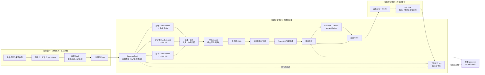

# EvoSEEK: Evidence-Governed Multi-Agent Protein Directed Evolution with Coupled Scientific-Knowledge and Experimental-Memory Graphs

## 1. 研究背景

蛋白定向进化需要在指数增长的序列空间中，以有限实验测量寻找满足目标功能的变体。其优化过程同时受到低样本、实验批次昂贵、fitness landscape 稀疏和上位性显著等约束；单点突变的局部收益可能在组合后改变符号，大面积无功能区域也会削弱随机文库和均匀训练集的有效信息密度。[14][15][17] 因而，测试集上的平均预测精度与固定实验预算下的最优变体发现能力属于两个不同目标。

现有 AI 定向进化工作主要沿四条路线推进。MLDE 与 informed training-set design 使用少量组合文库训练监督模型，并通过训练集选择降低无功能样本比例；Low-N 和 EVOLVEpro 利用蛋白语言模型表征提高少样本学习效率；ALDE 以批量贝叶斯优化和不确定性量化协调探索与利用；KnowRLM、LatProtRL、SAMPLE 和 ORI 分别将知识图谱、强化学习、机器人实验或湿实验反馈引入序列搜索与闭环更新。[5][15–22] 这些方法强化了表示学习、fitness prediction、acquisition、生成策略和实验自动化。

本项目将 AI 辅助定向进化表述为固定实验预算下的序贯决策问题。系统从当前已测变体出发，每轮读取允许访问的实验历史，形成可证伪的突变假设，完成候选审批与批次选择，再由密封虚拟实验 oracle 揭示新标签；新观察从下一轮开始可见，形成“知识检索 → 证据推理 → 批次选择 → 结果验证 → 记忆更新”的闭环。实验比较固定初始观测、候选池、数据折和查询预算，并分别评价发现效用、机制贡献和无泄漏可重放性。[I2][I3]

该任务面临四类相互耦合的挑战。第一，文献知识、模型预测和实验记录分散在不同载体与轮次中，并具有不同的适用范围、证据权威和时间效力；未经约束的融合容易把一般机制、候选解释和 fitness 真值混为一体。第二，强上位性使理化、保守性和结构信号可能相互冲突，单一 Agent 同时承担证据读取、假设生成和自我审查时难以定位推理错误。第三，低样本、有限实验预算和代理模型的 OOD 失准要求候选选择协调局部利用与覆盖探索；假设、负结果、dry prediction 与 wet observation 若未被跨轮关联，系统还会重复已暴露的失败模式。[13–17] 第四，Multi-Agent、RAG、KG、Critic 和 acquisition 的组合增加了标签泄漏、流程漂移和组件归因难度。科学 Multi-Agent、图推理和动态 KG 已显示角色协作与实验记忆的潜力[25–27]，定向进化仍需要统一的证据权限、时间可见性和对照协议。

围绕上述挑战，本项目提出四项关键贡献（key contributions）：

1. **跨轮双图谱证据底座。** 系统分离外部科学知识 KG 与 campaign-specific 实验记忆 KG，并以 provenance-aware `EvidencePack` 连接两者，使带来源、证据类型、选择资格和轮次可见性的图谱信息进入假设生成、候选解释和后续轮次选择；未经任务校准的通用知识保持 context-only。[I2][I8][I11]
2. **证据治理型分层 Multi-Agent 推理。** 理化、保守性和结构通道分别由 Sub-Scientist 与 Sub-Critic 处理，主 Scientist 综合已批准的子假设，主 Critic 和批次 Critic 分别控制假设与实验提交。角色隔离、引用闭包和 fail-closed 合同将证据权限落实为可执行接口，支持冲突定位、证据不足时弃权和按通道消融。[I10][I14]
3. **面向实验预算的决策—反思闭环。** Agent-UQ 将假设靶向、证据/历史先验、覆盖探索和匹配对照组织为可审计批次；Critic 在选择前检查候选，ReThink 在结果揭示后关联假设、dry prediction 与 wet observation，并将验证与反驳写入下一轮实验记忆。[I7][I15]
4. **无泄漏且可归因的评估协议。** 角色能力视图、密封 oracle、轮次开放规则和一次性 final-test 访问共同限定信息边界；所有路线共享数据折、初始观测、候选池和查询预算，层级 Agent、双图谱、RAG、UQ 与 ReThink 通过同折、同 seed 消融评估独立贡献。[I3][I4][I7]

对应地，双图谱底座预期提高 provenance 完整率、证据复用率和假设—观察的一致性，并降低干湿证据混用；分层 Multi-Agent 推理预期减少无效候选、false-pass、未知证据 ID 和未处理的跨通道冲突；决策—反思闭环预期在相同查询预算下提高 `best@budget`、AULC 和 top-k hit rate，降低 regret 与跨轮重复错误；无泄漏评估协议预期保持 final-test 零提前访问，并提高不同 fold、seed 和组件配置之间的可重放性与归因能力。上述预期性能是第 4 节对照与消融实验的验证目标，先导结果与独立组件贡献分别报告。

### 1.1 数据集选择

数据集选择关注 fitness 定义、实验标签覆盖、组合突变结构和闭环评估成本。丰富的实测标签可以将候选标签隐藏在 oracle 中，并在统一数据折和查询预算下比较不同方法。[I5] ProteinGym 与 FLIP 汇集多种蛋白和 assay，适合数据标准化与跨蛋白评估；当前实验从中选择一个标签覆盖充分、fitness 定义统一的具体 assay。[2][3]

GFP 的多点景观为稀疏采样，AAV 涉及较长突变区段、高阶变体和 indel，β-lactamase 数据以单点 DMS 为主。这些数据分别适合大空间外推、复杂序列工程和跨蛋白活性评估，均未形成接近完整的多点组合 fitness 景观。[2][3][I5] GB1 四位点空间为 $20^4=160{,}000$，其中 149,361 个变体已有实验标签。该景观兼具显著上位性、可枚举候选空间和低成本 oracle 封装，可直接检验智能体从低阶观测搜索高阶优良组合的能力。GB1 的实验读出为 IgG-Fc 结合 fitness，数据集选择最终确定了本项目的结合能力优化目标。[1][2]

实验评价分为两部分：最终测试集衡量模型的排序与头部识别能力；闭环轨迹衡量固定查询预算下的最佳已测 fitness、命中率和 regret。不同方法使用相同数据折、初始观测和查询预算进行比较。

### 1.2 适应度预测模型选择

GB1 闭环从 96 条已测变体启动，预测模型需要在少量标签下学习四个位点的组合效应，并为候选排序提供可用的不确定性。Kermut 以 ESM-2 表征、ProteinMPNN 位点条件概率和残基空间距离构造复合核，再用高斯过程输出 assay fitness 的后验均值与标准差。该结构同时覆盖序列、局部结构和多突变关系，精确 GP 的计算规模也适合当前标签预算。[4][I6]

模型选择采用同一 GB1 assay 的直接结果。ProteinGym 监督式基准中，Kermut 在 random、contiguous 和 modulo 切分上的 Spearman 分别为 0.781、0.778 和 0.778；ProteinNPT 为 0.858、−0.322 和 −0.322，ESM-1v embedding 为 0.731、0.310 和 0.259，one-hot 为 0.710、−0.222 和 −0.222。[9][I9] Kermut 在不同突变分布下保持稳定排序，更契合由低阶观测搜索高阶组合的闭环任务。

当前系统将 Kermut 用于任务特异预测与 dry validation；实验或密封 oracle 提供 fitness 真值。[I6][I7][I9]

## 2. 数据与无泄漏评估协议

数据来自 FLIP GB1 `four_mutations_full_data.csv`，记录四位点变体、突变深度、蛋白序列和实验 fitness。[2][I1] 当前 `GB1-AL96-5CV-v1` 协议采用五折闭环划分，每折包含以下四类数据：[I3]

| 数据角色 | 规模 | 用途与可见性 |
|---|---:|---|
| `initial_observed` | 96 | WT 1 条、单点 76 条、双点 19 条；序列与 fitness 对智能体可见 |
| `benchmark_validation` | 384 | 控制器用于模型选择与评估；智能体不可访问 |
| `candidate_pool` | 约 119,400 | 智能体可见序列；oracle 在候选被选中后返回 fitness |
| `final_test` | 约 29,400 | 高阶突变外层测试集；闭环结束后由评测器读取 |

五个 `final_test` 由全部三点和四点突变按突变深度分层、稳定哈希分配，折间互斥。初始集固定为低阶突变，验证集和最终测试集的成员选择不读取 fitness。数据写入器按 agent、controller、oracle 和 evaluator 分别生成能力视图，manifest 记录划分与文件哈希；agent 视图不包含候选、验证和测试标签。[I3]

oracle 仅接受候选池内、未查询且未超预算的变体。每轮新标签在下一轮开始时进入观测历史。全部轮次完成后，系统使用已揭示数据拟合最终模型，完成测试集预测，再一次性读取 `final_test` 标签。[I4] RAG 检索采用目标数据泄漏过滤与来源追踪，外部知识以证据上下文进入 KG，实验 fitness 仍由当前折的可见观测和 oracle 查询提供。[I2]

## 3. 证据治理型 Multi-Agent、双层 KG 与主动学习架构

该架构由三个相互锁定的循环组成。知识循环把外部文献和操作知识转化为带来源、适用条件和使用边界的冻结快照；推理决策循环将允许使用的证据投影给专业化智能体，并在候选占用实验预算前完成假设与批次审批；实验学习循环在标签揭示后关联假设、dry prediction 与 observation，再把验证和 ReThink 记录开放给后续轮次。三个循环共享数据契约，同时保持知识类型和时间方向。[I2][I8][I10][I11]

### 3.1 智能体思考与调度框架

GB1 闭环具有固定实验预算、预注册任务分解和严格数据可见性，控制面需要优先保证折间一致性与失败可审计性。系统采用**合同驱动的分层 DAG，并在局部加入有界自适应修订**。`CampaignRunner` 预注册每轮的任务顺序、角色权限、输入输出合同和终止条件；三个证据分支并行执行，分支内按“Sub-Scientist → Sub-Critic → 修订”串行运行，主 Scientist 汇总后再经过主 Critic。实验结果揭示后，ReThink 将假设检验结果送入下一轮。[I10]

ReAct 提供开放的“思考、工具调用、观察”循环[10]，适合动态任务分解；本实验的自主性集中在证据可用性、Critic 修订、候选选择和跨轮反馈。固定 DAG 保持数据边界和调用顺序稳定，有界修订则保留科学推理所需的适应性。每次检索、工具调用、修订、拒绝和放行均形成结构化工件，使系统能够同时评价 fitness 收益与流程可靠性。

### 3.2 Multi-Agent 分层设计

| Agent 角色 | 核心功能 | 系统与算法意义 |
|---|---|---|
| 主 Scientist | 汇总基础 KG/RAG 上下文和已批准子假设，形成统一的可证伪假设、位点偏好及简洁解释 | 执行跨通道证据融合，将局部分析转换为候选生成可消费的决策对象 |
| Sub-Scientist | 理化、保守性和结构三个角色分别读取独立 `EvidencePack`，输出方向性子假设、正反证与不确定性 | 隔离不同证据语义，压缩主 Agent 上下文，并支持按通道消融与并行计算 |
| Sub-Critic | 在单一通道内检查引用、适用范围、因果越界和证据缺口，返回批准、修订或拒绝 | 阻止错误子假设进入汇总层，将错误定位到具体知识通道 |
| 主 Critic | 主假设 Critic 检查跨通道冲突与可证伪性；批次 Critic 检查候选资格、多样性、UQ/OOD 语义和提交条件 | 分离提出与审批权限，为假设和实验批次设置独立决策门禁 |
| ReThink | 在标签揭示后对照假设、dry prediction 与 wet observation，记录支持、反驳和模型分歧 | 完成跨轮信用分配，使失败证据、验证结果和修订方向进入后续 KG 上下文 |

结构与保守性通道为小样本推理提供互补先验。保守性 Provider 对预计算 A3M 进行序列一致性重加权，输出单点频率、野生型相对 log-odds、熵和有效样本量；当前 GB1 对齐的 Neff/L 约为 0.27，系统启用单点 profile 并关闭 pairwise coevolution。结构 Provider 从 1PGB chain A 提取接触、溶剂可及性和粗粒度主链环境，用于判断突变位点的局部堆积与暴露约束；该结构对应游离 GB1 单体，证据范围限定为折叠环境。两类证据分别进入 Sub-Scientist 与 Sub-Critic，原始分数的选择权重为零，缺失资源统一标记为 `unavailable`。[I14]

科学 Multi-Agent 已被用于蛋白设计协作和知识图谱驱动的假设生成[25][26]，CRITIC 与 Reflexion 则分别展示了工具反馈校验和基于反馈的语言记忆[23][24]。当前架构把这些能力收敛到定向进化的实验预算和证据边界：分层节点分别承担科学解释、证据审批、跨域综合、批次门禁和结果后学习，失败可以定位到具体通道与合同。当前实现已通过离线分层闭环测试；fitness 增益仍需在相同 fold、seed 和预算下与 single-Agent 路线比较。

### 3.3 预测模型与闭环

当前预测层采用 Kermut，将 ESM-2、ProteinMPNN 和结构信息组合到高斯过程核中，输出预测均值、后验不确定性、置信区间与 OOD 指标。[4][I6] KG–LLM 主路线先由 Scientist 生成结构化假设，再由 Agent-UQ 按假设靶向、证据/历史先验、覆盖探索和匹配对照选择候选；Kermut 随后执行 dry validation，结果进入 Critic、ReThink 和后续轮次知识。[I7]

当前生产路线按用途区分四类数值不确定性：[13][I15]

| 模块 | 估计量 | 作用位置 |
|---|---|---|
| Agent-UQ coverage GP | 基于 Hamming 距离的覆盖标准差 | 默认 `agent_uq` 路线的候选评分与探索配额；表示候选相对已观测序列的覆盖缺口 |
| Kermut | Exact GP 的 fitness 后验标准差与高斯区间 | 默认路线的批次 dry validation；主动学习路线的 posterior 来源 |
| `visible_holdout_ensemble` | 可见标签校准后的方差尺度与 conformal 半径 | `active_learning` 路线，在 `hybrid_batch` 采集前校准 predictor 输出 |
| `visible_linear` | 知识通道线性校准的残差标准差 | KG evidence 的置信度与不确定性；当前用于达到最小样本量后的理化证据校准 |

Agent-UQ 的兼容输出沿用 `fitness_std` 字段，其语义由 `selection_driver=agent_uq` 标记为覆盖不确定性。OOD 是基于序列距离的风险信号；`hybrid_batch` 和 Critic 负责消费这些数值，interval coverage 与 Gaussian NLL 负责评价校准质量。Sub-Scientist 输出的 `uncertainty` 为定性说明，不进入数值后验。

### 3.4 实验记忆 KG 和外部科学知识 KG

双层 KG 将一般科学知识与本 campaign 产生的实验记忆分别持久化。**科学知识层**把本地文献与操作知识组织为 `Document → Chunk → Claim → CitationSupport → Publication → Evidence` 关系；**实验记忆层**把 `Observation`、`Prediction`、`Hypothesis`、Critic 决策、`Validation` 和 ReThink 按轮次关联，形成可重放的决策历史。[I8][I11] 两层通过 provenance-aware `EvidencePack` 协作，保留证据类型、来源、权威和轮次可见性。KnowRLM 使用氨基酸知识图谱引导强化学习序列策略[18]；本项目的双层 KG 聚焦证据治理与实验记忆，可与不同 predictor、acquisition 或 generator 组合。

外部知识先在实验闭环之外生产。GPT-5.6 Sol 调用学术检索、引文核验和结构化写作 Skills，围绕目标、assay 与作用机制搜索文献，将实验操作、适用条件、可观察读数、决策边界和来源整理为原子化 Markdown。[I13] 原始论文与 PDF 保留为引用和逐条核验依据，版本化 Markdown 作为 RAG 直接索引的知识服务层。

该流程在入库前完成跨文献聚合、去重和主张原子化，使检索单元围绕“实验动作、可观察读出、适用条件、决策边界”组织。Markdown 支持逐行复核、引用纠错、版本比较和局部更新；审核通过的知识快照才进入索引。在线闭环无需重复解析长篇 PDF，也不会因搜索结果实时变化而改变不同 fold 的知识条件。

结构化 KG 表达变体、assay、条件、证据、反证和来源之间的语义关系，运行 manifest 记录节点完成状态与调用顺序。LLM 获取按任务、证据域和轮次裁剪的相关子图，证据类型与权限在进入提示词前已经确定。外部知识由此参与假设形成，实验观测保持最高权威等级。[7][8][27][I8]

KG 负责知识表示、查询和跨轮持久化；LangGraph 负责节点调度、状态流转与恢复。[11] 当前 `CampaignRunner` 和 `HypothesisReviewGraph` 已实现类型化状态、并行分支、有界重试和审批门禁，接入 LangGraph 只会替换工作流运行层，无法替代实验知识模型。现阶段保留项目内控制器，可减少依赖迁移并维持既有 oracle、预算和审批状态机。

当前 RAG 路线从版本化本地原子知识库建立 SQLite 索引，每轮经过查询清洗、目标泄漏过滤、词法或混合召回、top-k/token 限制和 no-answer 门禁；命中内容携带来源并按 `retrieved_only` 写入科学知识 KG，再以只读 `EvidencePack` 提供给对应 Agent。[6][I11] 未经 GB1 校准的检索证据保持 context-only，不直接形成 fitness 分数。

Agentic RAG 与 Deep Research 涵盖的文献发现、反证搜索和引用核验能力由上述离线流程承担。[12] 这种双时间尺度设计允许科学知识持续更新，同时使单次实验比较保持固定语料版本、查询预算和延迟。新增知识经过审核后发布为下一版本地语料，再进入后续实验。

### 3.5 主动学习设计

主动学习路线同时启用 `selection_driver: active_learning` 与 `active_learning.enabled: true`。每轮先用已揭示标签拟合并校准 Kermut posterior，再由 `hybrid_batch` 将 16 个实验名额分为 8 个利用候选、4 个不确定性探索候选和 4 个知识候选；OOD 惩罚与 Hamming 多样性约束贯穿三路选择。新揭示的 wet fitness 进入下一轮训练，形成“预测 → 选择 → 测量 → 更新”闭环。[5][13][I12]

该路线以 `best@budget`、AULC 和 regret 衡量优化效率，并用 interval coverage、Gaussian NLL 及 No-UQ 消融检查不确定性是否带来决策收益。Agent-UQ、主动学习、predictor 和 random 路线共享数据折、初始观测与查询预算，支持配对比较。[I12]

## 4. 主要结果、对照实验与消融矩阵

### 4.1 结果口径与版面结构

本节先录入 seed 42、fold 0 至 2 的先导结果，Qwen RAG 条件在每折均按 GB1-AL96 协议完成 96 次查询。`knowledge_agent_qwen_rag` 表示 DeepSeek Agent 使用 Qwen embedding/reranker 的本地 RAG 路线；本次结果包导入 `knowledge_agent` 与 `knowledge_agent_rag`，其余基线按相同协议、fold、seed、查询预算和 assignment hash 从 SDK baseline 对齐。[I17]

正式结果以 `best-seen@96` 衡量固定预算内发现的最高 fitness，以末轮 batch mean 衡量推荐批次的整体质量，并同步报告 top-k hit/recall、regret、AULC 与运行完成率。Surrogate Spearman 只反映预测排序，不作为定向进化发现能力的主指标。

> **图 2（结果位）**：五种方法的逐轮 best-seen 与 batch mean 曲线。每个 fold 保留独立轨迹，完整五折和多 seed 后再绘制配对均值与置信区间。

### 4.2 先导主结果

| 方法 | Fold 0 | Fold 1 | Fold 2 | 三折均值 | 完成率 |
|---|---:|---:|---:|---:|---:|
| `knowledge_agent_qwen_rag` | 5.23 | 6.04 | 5.23 | **5.50** | 3/3 |
| `knowledge_agent`（无 RAG） | **7.23** | 5.77 | 5.23 | **6.08** | 3/3 |
| `fitness_direct` | 5.44 | 5.77 | 5.44 | **5.55** | 3/3 |
| `random` | 4.07 | 4.07 | 4.07 | **4.07** | 3/3 |
| `llm_agent` | 5.77 | 运行失败 | 运行失败 | NA | 1/3 |

表中数值为查询预算用尽时的 best-seen。Qwen RAG 在三折中均超过随机选择，平均提高 1.43；相对 `fitness_direct` 为 1 胜 2 负，均值低 0.05；相对无 RAG 的 `knowledge_agent` 为 1 胜、1 平、1 负，均值低 0.58。`llm_agent` 仅 fold 0 可比，该折比 Qwen RAG 高 0.54。fold 1 和 2 在首轮 `llm_hypothesis` 阶段失败，计入完成率，不进入 fitness 均值。[I17]

### 4.3 折间差异与指标解释

Qwen RAG 的末轮 batch mean 依次为 1.55、1.81 和 2.17，三折均值为 1.84。随机选择接近 0，`fitness_direct` 为 2.76 至 2.98。`fitness_direct` 采用模型 greedy 排序，较高的 batch mean 反映了更集中的 exploitation。fold 1 是 Qwen RAG 表现最好的一折，best-seen 为 6.04，top-k hit 为 1、recall 为 0.5、regret 为 0；fold 0 未命中 top-k；fold 2 与无 RAG 条件取得相同 best-seen，末轮 batch mean 从 1.12 提升至 2.17。

当前结果支持 Qwen RAG 优于随机选择，尚未显示其相对无 RAG 知识智能体或 Kermut 直接推荐的总体优势。fold 0 中随机方法的 surrogate Spearman 为 0.31，Qwen RAG 为 0.21，说明更均匀的采样可提高全局相关性，却未同步提高已发现的最高 fitness。最终报告需同时呈现发现指标、批次分布与预测指标。

> **图 3（结果位）**：按 fold 绘制 RAG 相对无 RAG、`fitness_direct` 和 `random` 的配对差值，分别展示 best-seen、末轮 batch mean、top-k 指标与运行完成率。

### 4.4 对照与消融矩阵

| 实验目的 | 对照条件 | 实验条件 | 主要变量 | 当前状态 |
|---|---|---|---|---|
| 随机下界 | `random` | `knowledge_agent_qwen_rag` | 完整知识智能体选择策略 | 3 折完成 |
| 预测模型基线 | `fitness_direct` | `knowledge_agent_qwen_rag` | Kermut greedy 与 Agent-UQ | 3 折完成 |
| LLM 基线 | `llm_agent` | `knowledge_agent_qwen_rag` | KG、RAG 与反馈闭环 | 仅 fold 0 可比 |
| RAG 增量 | `knowledge_agent` | `knowledge_agent_qwen_rag` | 本地 RAG 检索 | 3 折完成 |
| 分层 Agent | 单 Scientist | Scientist、Critic、Sub-Agent | 分层提案与审查 | 待补同折实验 |
| 反馈闭环 | 关闭 ReThink | 开启 ReThink | 干湿验证反馈写回 KG | 待补同折实验 |
| 不确定性 | 关闭不确定性项 | Agent-UQ | coverage uncertainty | 待补同折实验 |
| 主动学习 | Agent-UQ | calibrated posterior 与 hybrid batch | 选择驱动器 | 待补同折实验 |
| 特征知识 | 无特征工具 | 理化、MSA、结构及联合路线 | KG 特征证据通道 | 待补单通道与联合消融 |

正式对照将扩展到完整五折和至少三个配对 seed。每组固定 assignment hash、初始观测、查询预算与候选池，报告 paired delta、置信区间、完成率和失败类型。该矩阵把基线性能、知识增益与各模块贡献分开呈现，避免用单次最优值替代组件归因。[I7][I12][I17]

## 5. 局限、未来工作及来源声明

研究背景提出的预期效果是由任务约束和实现接口推导出的可检验假设。当前三折先导结果支持完整路线能够运行并优于随机选择，但尚未显示 RAG 相对无 RAG 知识智能体或 Kermut greedy 的总体优势。层级 Multi-Agent、双层 KG 和 ReThink 的独立贡献将在完整配对消融后判定。

当前实验采用受限候选池筛选：系统只在 GB1 四个预设位点组合突变，并从给定候选中选取序列。该设置未覆盖开放序列设计与实际实验约束。评估仅包含 GB1 binding assay，缺少其他结合靶标和蛋白质性质数据，现有结果尚不能支持框架泛化性结论。[I1][I5][I16]

本地知识库的主题和规模有限，后续需比较不同语料范围与知识类型对假设质量和实验收益的影响。Scientist、Critic 和 ReThink 目前统一使用 DeepSeek V4 Flash，实验结果包含单一模型效应。固定的本地 RAG 快照让不同 LLM 在同一知识和预算下接受比较，同时降低运行期外部搜索的来源漂移和安全风险。当前引用检查只验证标识与证据闭包，后续需加入文献真实性与主张支持关系核验。[I10][I11][I16]

ReThink 已接收 dry prediction 与 wet observation 并将反思写回 KG，现有干湿权重和衰减系数仍需系统校准。Dry validation 目前只使用 Kermut，后续将评估校准后的模型集成。保守性通道复用 Protenix 预计算 A3M，仅生成单点 MSA profile；结构通道提取静态接触、溶剂可及性、粗粒度主链构象及氢键和盐桥候选。后续可接入 Rosetta 能量评估与突变后结构松弛，检验其对 KG 推理和候选选择的增益。[I7][I14][I16]

本项目的知识调研和代码编写使用 GPT-5.6、Grok-4.6 与 Kimi K3。报告以仓库代码、配置和可复现运行记录为依据，文献性陈述保留来源。

## 参考文献

[1] Wu, N. C., Dai, L., Olson, C. A., Lloyd-Smith, J. O., & Sun, R. (2016). *Adaptation in protein fitness landscapes is facilitated by indirect paths*. **eLife, 5**, e16965. [https://doi.org/10.7554/eLife.16965](https://doi.org/10.7554/eLife.16965)

[2] Dallago, C., Mou, J., Johnston, K. E., Wittmann, B. J., Bhattacharya, N., Goldman, S., Madani, A., & Yang, K. K. (2021). *FLIP: Benchmark tasks in fitness landscape inference for proteins*. **Advances in Neural Information Processing Systems, 34**, 26601–26622. [论文](https://datasets-benchmarks-proceedings.neurips.cc/paper/2021/hash/2b44928ae11fb9384c4cf38708677c48-Abstract-round2.html)

[3] Notin, P. et al. (2023). *ProteinGym: Large-Scale Benchmarks for Protein Fitness Prediction and Design*. **NeurIPS 36, Datasets and Benchmarks**. [论文](https://proceedings.neurips.cc/paper_files/paper/2023/file/cac723e5ff29f65e3fcbb0739ae91bee-Paper-Datasets_and_Benchmarks.pdf)

[4] Groth, P. M., Kerrn, M. H., Olsen, L., Salomon, J., & Boomsma, W. (2024). *Kermut: Composite kernel regression for protein variant effects*. **NeurIPS 37**. [https://doi.org/10.52202/079017-0929](https://doi.org/10.52202/079017-0929)

[5] Yang, J. et al. (2025). *Active learning-assisted directed evolution*. **Nature Communications, 16**, 714. [https://doi.org/10.1038/s41467-025-55987-8](https://doi.org/10.1038/s41467-025-55987-8)

[6] Lewis, P. et al. (2020). *Retrieval-Augmented Generation for Knowledge-Intensive NLP Tasks*. **NeurIPS 33**. [论文](https://proceedings.neurips.cc/paper/2020/hash/6b493230205f780e1bc26945df7481e5-Abstract.html)

[7] Soman, K., Rose, P. W., Morris, J. H., & Baranzini, S. E. (2024). *Biomedical knowledge graph-optimized prompt generation for large language models*. **Bioinformatics, 40**(9), btae560. [https://doi.org/10.1093/bioinformatics/btae560](https://doi.org/10.1093/bioinformatics/btae560)

[8] Luo, L., Li, Y.-F., Haffari, G., & Pan, S. (2024). *Reasoning on Graphs: Faithful and Interpretable Large Language Model Reasoning*. **ICLR 2024**. [论文](https://openreview.net/forum?id=ZGNWW7xZ6Q)

[9] ProteinGym. *Supervised DMS benchmark: SPG1_STRSG_Wu_2016*. [Random split](https://raw.githubusercontent.com/OATML-Markslab/ProteinGym/main/benchmarks/DMS_supervised/substitutions/Spearman/DMS_substitutions_Spearman_DMS_level_fold_random_5.csv)、[Contiguous split](https://raw.githubusercontent.com/OATML-Markslab/ProteinGym/main/benchmarks/DMS_supervised/substitutions/Spearman/DMS_substitutions_Spearman_DMS_level_fold_contiguous.csv)、[Modulo split](https://raw.githubusercontent.com/OATML-Markslab/ProteinGym/main/benchmarks/DMS_supervised/substitutions/Spearman/DMS_substitutions_Spearman_DMS_level_fold_modulo_5.csv)。

[10] Yao, S. et al. (2023). *ReAct: Synergizing Reasoning and Acting in Language Models*. **ICLR 2023**. [论文](https://openreview.net/forum?id=WE_vluYUL-X)

[11] LangChain. *Custom workflow, Subgraphs and Persistence*. [Custom workflow](https://docs.langchain.com/oss/python/langchain/multi-agent/custom-workflow)、[Subgraphs](https://docs.langchain.com/oss/python/langgraph/use-subgraphs)、[Persistence](https://docs.langchain.com/oss/python/langgraph/persistence)。

[12] Shao, Y. et al. (2024). *Assisting in Writing Wikipedia-like Articles From Scratch with Large Language Models*. **NAACL 2024**. [论文](https://aclanthology.org/2024.naacl-long.347/)

[13] Greenman, K. P., Amini, A. P., & Yang, K. K. (2025). *Benchmarking uncertainty quantification for protein engineering*. **PLOS Computational Biology, 21**(1), e1012639. [https://doi.org/10.1371/journal.pcbi.1012639](https://doi.org/10.1371/journal.pcbi.1012639)

[14] Yang, K. K., Wu, Z., & Arnold, F. H. (2019). *Machine-learning-guided directed evolution for protein engineering*. **Nature Methods, 16**, 687–694. [https://doi.org/10.1038/s41592-019-0496-6](https://doi.org/10.1038/s41592-019-0496-6)

[15] Wu, Z., Kan, S. B. J., Lewis, R. D., Wittmann, B. J., & Arnold, F. H. (2019). *Machine learning-assisted directed protein evolution with combinatorial libraries*. **Proceedings of the National Academy of Sciences, 116**, 8852–8858. [https://doi.org/10.1073/pnas.1901979116](https://doi.org/10.1073/pnas.1901979116)

[16] Biswas, S. et al. (2021). *Low-N protein engineering with data-efficient deep learning*. **Nature Methods, 18**, 389–396. [https://doi.org/10.1038/s41592-021-01100-y](https://doi.org/10.1038/s41592-021-01100-y)

[17] Wittmann, B. J., Yue, Y., & Arnold, F. H. (2021). *Informed training set design enables efficient machine learning-assisted directed protein evolution*. **Cell Systems, 12**, 1026–1045.e7. [https://doi.org/10.1016/j.cels.2021.07.008](https://doi.org/10.1016/j.cels.2021.07.008)

[18] Wang, Y. et al. (2024). *Knowledge-aware Reinforced Language Models for Protein Directed Evolution*. **Proceedings of the 41st International Conference on Machine Learning, PMLR 235**, 52260–52273. [论文](https://proceedings.mlr.press/v235/wang24cq.html)

[19] Jiang, K. et al. (2025). *Rapid in silico directed evolution by a protein language model with EVOLVEpro*. **Science, 387**, eadr6006. [https://doi.org/10.1126/science.adr6006](https://doi.org/10.1126/science.adr6006)

[20] Rapp, J. T. et al. (2024). *SAMPLE: self-driving autonomous machines for protein landscape exploration*. **Nature Chemical Engineering, 1**, 97–107. [https://doi.org/10.1038/s44286-023-00002-4](https://doi.org/10.1038/s44286-023-00002-4)

[21] Yao, S. et al. (2026). *Ontology-guided protein sequence design via reinforcement learning from wet-lab feedback*. **Nature Communications**. [https://doi.org/10.1038/s41467-026-69855-6](https://doi.org/10.1038/s41467-026-69855-6)

[22] Lee, M. et al. (2024). *Robust Optimization in Protein Fitness Landscapes Using Reinforcement Learning in Latent Space*. **Proceedings of the 41st International Conference on Machine Learning, PMLR 235**, 26976–26990. [论文](https://proceedings.mlr.press/v235/lee24x.html)

[23] Shinn, N. et al. (2023). *Reflexion: Language Agents with Verbal Reinforcement Learning*. **NeurIPS 36**. [论文](https://proceedings.neurips.cc/paper_files/paper/2023/hash/1b44b878bb782e6954cd888628510e90-Abstract-Conference.html)

[24] Gou, Z. et al. (2024). *CRITIC: Large Language Models Can Self-Correct with Tool-Interactive Critiquing*. **ICLR 2024**. [论文](https://proceedings.iclr.cc/paper_files/paper/2024/hash/fef126561bbf9d4467dbb8d27334b8fe-Abstract-Conference.html)

[25] Swanson, K. et al. (2025). *The Virtual Lab: AI agents design new SARS-CoV-2 nanobodies with experimental validation*. **Nature**. [https://doi.org/10.1038/s41586-025-09442-9](https://doi.org/10.1038/s41586-025-09442-9)

[26] Ghafarollahi, A., & Buehler, M. J. (2025). *SciAgents: Automating scientific discovery through multi-agent intelligent graph reasoning*. **Advanced Materials, 37**, 2413523. [https://doi.org/10.1002/adma.202413523](https://doi.org/10.1002/adma.202413523)

[27] Bai, J. et al. (2024). *A dynamic knowledge graph approach to distributed self-driving laboratories*. **Nature Communications, 15**, 462. [https://doi.org/10.1038/s41467-023-44599-9](https://doi.org/10.1038/s41467-023-44599-9)

## 实现依据

[I1] [GB1 数据配置](../configs/data/splits/gb1.yaml)与[任务配置](../configs/task/gb1_binding_al96.yaml)。

[I2] [KnowledgeEngine](../src/fitness_agents/knowledge/engine.py)、[KG–RAG 配置](../configs/knowledge/gb1_local_rag.yaml)与[闭环编排器](../src/fitness_agents/loop/orchestrator.py)。

[I3] [AL96 五折划分](../src/fitness_agents/data/splitting/al96.py)、[能力视图写入](../src/fitness_agents/data/splitting/writer.py)与[角色加载器](../src/fitness_agents/data/loader.py)。

[I4] [Oracle 状态机](../src/fitness_agents/loop/backends.py)与[隐藏标签测试](../tests/leakage/test_hidden_labels.py)。

[I5] [测试数据集的优化目标与任务选择策略](fitness-agents-测试数据集目标与任务选择.md)。

[I6] [Kermut 配置](../configs/model/kermut.yaml)与[Kermut 后端](../src/fitness_agents/models/backends/kermut.py)。

[I7] [KG–LLM 主路线配置](../configs/experiments/knowledge_agent_al96_rag.yaml)、[主动学习路线配置](../configs/experiments/knowledge_agent_active_learning.yaml)、[闭环编排器](../src/fitness_agents/loop/orchestrator.py)、[Agent-UQ 分臂选择](../src/fitness_agents/mutation/quota_acquisition.py)与[主动学习模块](../src/fitness_agents/active_learning/module.py)。

[I8] [KnowledgeEngine](../src/fitness_agents/knowledge/engine.py)、[EvidencePack 契约](../src/fitness_agents/kg_interaction/contracts.py)、[KG 交互控制器](../src/fitness_agents/kg_interaction/controller.py)与[原子 RAG–KG 架构记录](english-atomic-rag-kg-production-architecture.md)。

[I9] [适应度预测模型调研与 GB1 评估策略](fitness-agents-适应度预测模型调研与GB1评估策略.md)与[Predictor 插件说明](predictor-plugins.md)。

[I10] [分层 Scientist–Critic 设计与实施记录](hierarchical-scientist-critic-and-llm-resilience-plan.md)、[HypothesisReviewGraph](../src/fitness_agents/agents/hypothesis_graph.py)、[分层实验配置](../configs/experiments/hierarchical_scientist.deepseek.yaml)与[闭环编排器](../src/fitness_agents/loop/orchestrator.py)。

[I11] [原子 RAG–KG 生产架构](english-atomic-rag-kg-production-architecture.md)、[当前 RAG 执行审计](current-rag-execution-and-agentic-kg-entry-architecture-analysis.md)、[本地 RAG 配置](../configs/knowledge/gb1_local_rag.yaml)与[KnowledgeEngine](../src/fitness_agents/knowledge/engine.py)。

[I12] [主动学习实验配置](../configs/experiments/knowledge_agent_active_learning.yaml)、[可见标签 posterior](../src/fitness_agents/active_learning/posterior.py)与[Hybrid Batch 采集](../src/fitness_agents/active_learning/acquisition.py)。

[I13] [定向进化本地知识库说明](../resources/local_knowledge/directed_evolution/README.md)、[结合能力本地知识库说明](../resources/local_knowledge/binding/README.md)与本项目离线知识生产约定：GPT-5.6 Sol 调用学术检索、引文核验和结构化写作 Skills，输出经人工复核的版本化 Markdown。

[I14] [KG 特征工具说明](kg_feature_tools.md)、[GB1 特征参数审计](gb1_feature_tool_parameter_literature_audit.md)、[三通道推理配置](../configs/knowledge/gb1_reasoning_routes.yaml)、[1PGB 资源与位点映射](../configs/task/gb1_binding_reasoning_routes.yaml)、[MSA Provider](../src/fitness_agents/protein_features/msa.py)与[结构 Provider](../src/fitness_agents/protein_features/structure.py)。

[I15] [Agent-UQ 覆盖不确定性](../src/fitness_agents/mutation/uncertainty.py)、[Kermut 后验](../src/fitness_agents/models/backends/kermut.py)、[主动学习 posterior 校准](../src/fitness_agents/active_learning/posterior.py)、[知识证据校准](../src/fitness_agents/protein_features/calibration.py)与[HybridBatch 采集](../src/fitness_agents/active_learning/acquisition.py)。

[I16] [开放序列设计规划](open-sequence-directed-evolution-and-interactive-platform-plan.md)、[分层实验配置](../configs/experiments/hierarchical_scientist.deepseek.yaml)、[当前 DeepSeek 配置](../configs/llm/deepseek.yaml)、[闭环编排器](../src/fitness_agents/loop/orchestrator.py)、[结构 Provider](../src/fitness_agents/protein_features/structure.py)与[MSA Provider](../src/fitness_agents/protein_features/msa.py)。

[I17] 本节先导数值来自本轮提供的 seed 42 三折运行汇总；程序侧的同折配对逻辑见[报告聚合器](../src/fitness_agents/reporting/aggregate.py)与[基线运行脚本](../scripts/run_agent_baselines.py)，当前 Qwen RAG 路线定义见[实验配置](../configs/experiments/knowledge_agent_qwen_al96.yaml)与[主循环评估审计](kg-llm-validation-main-loop-implementation-audit.md)。
