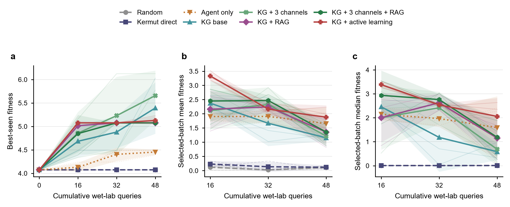
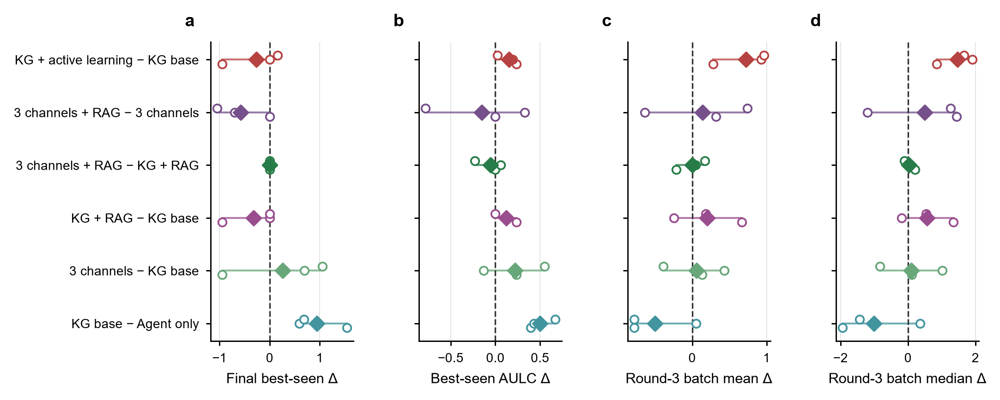

# EvoSEEK: Evidence-Governed Multi-Agent Protein Directed Evolution with Coupled Scientific-Knowledge and Experimental-Memory Graphs

## 1. 研究背景

蛋白定向进化需要在指数增长的序列空间中，以有限实验测量寻找满足目标功能的变体。其优化过程同时受到低样本、实验批次昂贵、fitness landscape 稀疏和上位性显著等约束；单点突变的局部收益可能在组合后改变符号，大面积无功能区域也会削弱随机文库和均匀训练集的有效信息密度。[14][15][17] 因而，测试集上的平均预测精度与固定实验预算下的最优变体发现能力属于两个不同目标。

现有 AI 定向进化工作主要沿四条路线推进。MLDE 与 informed training-set design 使用少量组合文库训练监督模型，并通过训练集选择降低无功能样本比例；Low-N 和 EVOLVEpro 利用蛋白语言模型表征提高少样本学习效率；ALDE 以批量贝叶斯优化和不确定性量化协调探索与利用；KnowRLM、LatProtRL、SAMPLE 和 ORI 分别将知识图谱、强化学习、机器人实验或湿实验反馈引入序列搜索与闭环更新。[5][15–22] 这些方法强化了表示学习、fitness prediction、acquisition、生成策略和实验自动化。

本项目将 AI 辅助定向进化表述为固定实验预算下的序贯决策问题。系统从当前已测变体出发，每轮读取允许访问的实验历史，形成可证伪的突变假设，完成候选审批与批次选择，再由密封虚拟实验 oracle 揭示新标签；新观察从下一轮开始可见，形成“知识检索 → 证据推理 → 批次选择 → 结果验证 → 记忆更新”的闭环。实验比较固定初始观测、候选池、数据折和查询预算，并分别评价发现效用、机制贡献和无泄漏可重放性。[I2][I3]

该任务面临四类相互耦合的挑战。第一，文献知识、模型预测和实验记录分散在不同载体与轮次中，并具有不同的适用范围、证据权威和时间效力；未经约束的融合容易把一般机制、候选解释和 fitness 真值混为一体。第二，强上位性使理化、保守性和结构信号可能相互冲突，单一 Agent 同时承担证据读取、假设生成和自我审查时难以定位推理错误。第三，低样本、有限实验预算和代理模型的 OOD 失准要求候选选择协调局部利用与覆盖探索；假设、负结果、dry prediction 与 wet observation 若未被跨轮关联，系统还会重复已暴露的失败模式。[13–17] 第四，Multi-Agent、RAG、KG、Critic 和 acquisition 的组合增加了标签泄漏、流程漂移和组件归因难度。科学 Multi-Agent、图推理和动态 KG 已显示角色协作与实验记忆的潜力[25–27]，定向进化仍需要统一的证据权限、时间可见性和对照协议。

围绕上述挑战，本项目提出四项关键贡献（key contributions）：

1. **双时间尺度的跨轮双图谱证据底座。** 离线研究 Agent 以 Deep Research 执行多源发现、反证检索和来源核验，将结果冻结为版本化 Markdown 与科学知识 KG；在线 RAG 在固定索引和查询预算下稳定召回，并将通过范围、泄漏、证据类型和选择资格检查的信息投影为 `EvidencePack`，与 campaign-specific 实验记忆共同支持假设生成、候选解释和后续轮次推理。未经任务校准的通用知识保持 context-only。[I2][I8][I11][I13]
2. **证据治理型分层 Multi-Agent 推理。** 理化、保守性和结构通道分别由 Sub-Scientist 与 Sub-Critic 处理，主 Scientist 综合已批准的子假设，主 Critic 和批次 Critic 分别控制假设与实验提交。角色隔离、引用闭包和 fail-closed 合同将证据权限落实为可执行接口，支持冲突定位、证据不足时弃权和按通道消融。[I10][I14]
3. **面向实验预算的决策—反思闭环。** Agent-UQ 将假设靶向、证据/历史先验、覆盖探索和匹配对照组织为可审计批次；Critic 在选择前检查候选，ReThink 在结果揭示后关联假设、dry prediction 与 wet observation，并将验证与反驳写入下一轮实验记忆。[I7][I15]
4. **无泄漏且可归因的评估协议。** 角色能力视图、密封 oracle、轮次开放规则和一次性 final-test 访问共同限定信息边界；所有路线共享数据折、初始观测、候选池和查询预算，层级 Agent、双图谱、RAG、UQ 与 ReThink 通过同折、同 seed 消融评估独立贡献。[I3][I4][I7]

对应地，双图谱底座预期提高 provenance 完整率、证据复用率和假设—观察的一致性，并降低干湿证据混用；分层 Multi-Agent 推理预期减少无效候选、false-pass、未知证据 ID 和未处理的跨通道冲突；决策—反思闭环预期在相同查询预算下提高 `best@budget`、AULC 和 top-k hit rate，降低 regret 与跨轮重复错误；无泄漏评估协议预期保持 final-test 零提前访问，并提高不同 fold、seed 和组件配置之间的可重放性与归因能力。上述预期性能是第 4 节对照与消融实验的验证目标，先导结果与独立组件贡献分别报告。

## 2. 研究方法
### 2.1 数据集选择

数据集选择关注 fitness 定义、实验标签覆盖、组合突变结构和闭环评估成本。丰富的实测标签可以将候选标签隐藏在 oracle 中，并在统一数据折和查询预算下比较不同方法。[I5] ProteinGym 与 FLIP 汇集多种蛋白和 assay，适合数据标准化与跨蛋白评估；当前实验从中选择一个标签覆盖充分、fitness 定义统一的具体 assay。[2][3]

GFP 的多点景观为稀疏采样，AAV 涉及较长突变区段、高阶变体和 indel，β-lactamase 数据以单点 DMS 为主。这些数据分别适合大空间外推、复杂序列工程和跨蛋白活性评估，均未形成接近完整的多点组合 fitness 景观。[2][3][I5] GB1 四位点空间为 $20^4=160{,}000$，其中 149,361 个变体已有实验标签。该景观兼具显著上位性、可枚举候选空间和低成本 oracle 封装，可直接检验智能体从低阶观测搜索高阶优良组合的能力。GB1 的实验读出为 IgG-Fc 结合 fitness，数据集选择最终确定了本项目的结合能力优化目标。[1][2]

实验评价分为两部分：最终测试集衡量模型的排序与头部识别能力；闭环轨迹衡量固定查询预算下的最佳已测 fitness、命中率和 regret。不同方法使用相同数据折、初始观测和查询预算进行比较。

测试数据来自 FLIP GB1 `four_mutations_full_data.csv`，记录四位点变体、突变深度、蛋白序列和实验 fitness。[2][I1] 当前 `GB1-AL96-5CV-v1` 协议采用五折闭环划分，每折包含以下四类数据：[I3]

| 数据角色 | 规模 | 用途与可见性 |
|---|---:|---|
| `initial_observed` | 96 | WT 1 条、单点 76 条、双点 19 条；序列与 fitness 对智能体可见 |
| `benchmark_validation` | 384 | 控制器用于模型选择与评估；智能体不可访问 |
| `candidate_pool` | 约 119,400 | 智能体可见序列；oracle 在候选被选中后返回 fitness |
| `final_test` | 约 29,400 | 高阶突变外层测试集；闭环结束后由评测器读取 |

五个 `final_test` 由全部三点和四点突变按突变深度分层，折间互斥。初始集固定为低阶突变，验证集和最终测试集的成员选择不读取 fitness。

oracle 仅接受候选池内、未查询且未超预算的变体。每轮新标签在下一轮开始时进入观测历史。全部轮次完成后，系统使用已揭示数据拟合最终模型，完成测试集预测，再一次性读取 `final_test` 标签。[I4] RAG 检索采用目标数据泄漏过滤与来源追踪，外部知识以证据上下文进入 KG，实验 fitness 仍由当前折的可见观测和 oracle 查询提供。[I2]

### 2.2 适应度预测模型选择

GB1 闭环从 96 条已测变体启动，预测模型需要在少量标签下学习四个位点的组合效应，并为候选排序提供可用的不确定性。Kermut 以 ESM-2 表征、ProteinMPNN 位点条件概率和残基空间距离构造复合核，再用高斯过程输出 assay fitness 的后验均值与标准差。该结构同时覆盖序列、局部结构和多突变关系，精确 GP 的计算规模也适合当前标签预算。[4][I6]

模型选择采用同一 GB1 assay 的直接结果。ProteinGym 监督式基准中，Kermut 在 random、contiguous 和 modulo 切分上的 Spearman 分别为 0.781、0.778 和 0.778；ProteinNPT 为 0.858、−0.322 和 −0.322，ESM-1v embedding 为 0.731、0.310 和 0.259，one-hot 为 0.710、−0.222 和 −0.222。[9][I9] Kermut 在不同突变分布下保持稳定排序，更契合由低阶观测搜索高阶组合的闭环任务。

当前系统将 Kermut 用于任务特异预测与 dry validation；实验或密封 oracle 提供 fitness 真值。[I6][I7][I9]


<div style="page-break-before: always;"></div>

### 2.3 证据治理型 Multi-Agent、双层 KG 与主动学习架构


该架构由三个相互锁定的循环组成。知识循环承担开放发现、离线核验与版本冻结：研究型 Agent 将多来源文献、反证和操作知识整理为可追溯的知识原子，并在 campaign 启动前发布冻结快照。推理决策循环承担稳定召回、结构化治理与有界使用：本地 RAG 从固定索引召回相关知识，结果经范围、泄漏、证据类型和选择资格检查进入科学知识 KG，再由有界图谱查询投影为 `EvidencePack`，供专业化智能体完成假设与批次审批。实验学习循环在标签揭示后关联假设、dry prediction 与 observation，再把验证和 ReThink 记录开放给后续轮次。三个循环共享数据契约，同时保持知识类型和时间方向。[I2][I8][I10][I11]

GB1 闭环具有固定实验预算、预注册任务分解和严格数据可见性，控制面需要优先保证折间一致性与失败可审计性。系统采用**合同驱动的分层 DAG，并在局部加入有界自适应修订**。`CampaignRunner` 预注册每轮的任务顺序、角色权限、输入输出合同和终止条件；三个证据分支并行执行，分支内按“Sub-Scientist → Sub-Critic → 修订”串行运行，主 Scientist 汇总后再经过主 Critic。实验结果揭示后，ReThink 将假设检验结果送入下一轮。[I10]

ReAct 提供开放的“思考、工具调用、观察”循环[10]，适合动态任务分解；本实验的自主性集中在证据可用性、Critic 修订、候选选择和跨轮反馈。固定 DAG 保持数据边界和调用顺序稳定，有界修订则保留科学推理所需的适应性。每次检索、工具调用、修订、拒绝和放行均形成结构化工件，使系统能够同时评价 fitness 收益与流程可靠性。

### 2.4 Multi-Agent 分层设计

| Agent 角色 | 核心功能 | 系统与算法意义 |
|---|---|---|
| 主 Scientist | 汇总基础 KG/RAG 上下文和已批准子假设，形成统一的可证伪假设、位点偏好及简洁解释 | 执行跨通道证据融合，将局部分析转换为候选生成可消费的决策对象 |
| Sub-Scientist | 理化、保守性和结构三个角色分别读取独立 `EvidencePack`，输出方向性子假设、正反证与不确定性 | 隔离不同证据语义，压缩主 Agent 上下文，并支持按通道消融与并行计算 |
| Sub-Critic | 在单一通道内检查引用、适用范围、因果越界和证据缺口，返回批准、修订或拒绝 | 阻止错误子假设进入汇总层，将错误定位到具体知识通道 |
| 主 Critic | 主假设 Critic 检查跨通道冲突与可证伪性；批次 Critic 检查候选资格、多样性、UQ/OOD 语义和提交条件 | 分离提出与审批权限，为假设和实验批次设置独立决策门禁 |
| ReThink | 在标签揭示后对照假设、dry prediction 与 wet observation，记录支持、反驳和模型分歧 | 完成跨轮信用分配，使失败证据、验证结果和修订方向进入后续 KG 上下文 |

结构与保守性通道为小样本推理提供互补先验。保守性 Provider 对预计算 A3M 进行序列一致性重加权，输出单点频率、野生型相对 log-odds、熵和有效样本量；当前 GB1 对齐的 Neff/L 约为 0.27，系统启用单点 profile 并关闭 pairwise coevolution。结构 Provider 从 1PGB chain A 提取接触、溶剂可及性和粗粒度主链环境，用于判断突变位点的局部堆积与暴露约束；该结构对应游离 GB1 单体，证据范围限定为折叠环境。两类证据分别进入 Sub-Scientist 与 Sub-Critic，原始分数的选择权重为零，缺失资源统一标记为 `unavailable`。[I14]

科学 Multi-Agent 已被用于蛋白设计协作和知识图谱驱动的假设生成[25][26]，CRITIC 与 Reflexion 则分别展示了工具反馈校验和基于反馈的语言记忆[23][24]。当前架构把这些能力收敛到定向进化的实验预算和证据边界：分层节点分别承担科学解释、证据审批、跨域综合、批次门禁和结果后学习，失败可以定位到具体通道与合同。当前实现已通过离线分层闭环测试；fitness 增益仍需在相同 fold、seed 和预算下与 single-Agent 路线比较。

### 2.5 实验记忆和外部科学知识 KG

双层 KG 将一般科学知识与本 campaign 产生的实验记忆分别持久化。**科学知识层**把本地文献与操作知识组织为 `Document → Chunk → Claim → CitationSupport → Publication → Evidence` 关系；**实验记忆层**把 `Observation`、`Prediction`、`Hypothesis`、Critic 决策、`Validation` 和 ReThink 按轮次关联，形成可重放的决策历史。[I8][I11] 两层以 provenance-aware `EvidencePack` 为受控接口，保留证据类型、来源、权威和轮次可见性。KnowRLM 使用氨基酸知识图谱引导强化学习序列策略[18]；本项目的双层 KG 聚焦证据治理与实验记忆，可与不同 predictor、acquisition 或 generator 组合。

外部科学知识在实验闭环之外生产。研究型 Agent 围绕目标、assay 与作用机制执行多来源发现、查询扩展、反证搜索和引文追踪，再通过来源核验与跨文档综合，将实验操作、适用条件、可观察读数、决策边界和证据来源整理为原子化 Markdown。[12][I13] 原始论文与 PDF 保留为逐条核验依据，版本化 Markdown 作为 RAG 直接索引的知识服务层。

知识原子按主题、知识类型、证据等级和适用范围组织，并在入库前完成跨文献聚合、去重和主张原子化。该组织方式将同义表达归并、跨文档关系和反证识别前移到离线阶段，降低在线检索对单一关键词和原始文档切块的依赖。Markdown 支持逐行复核、引用纠错、版本比较和局部更新；审核通过的知识快照才进入索引，使不同 fold、seed 和消融条件使用相同语料版本。

结构化 KG 表达变体、assay、条件、主张、证据、反证和来源之间的语义关系，运行 manifest 记录节点完成状态与调用顺序。跨文档支持与冲突由此保留为可查询关系，LLM 只获取按任务、证据域和轮次裁剪的相关子图；证据类型、权威和使用权限在进入提示词前已经确定。外部知识由此参与假设形成与解释，实验观测保持最高权威等级。[7][8][27][I8]

KG 负责知识表示、查询和跨轮持久化；LangGraph 负责节点调度、状态流转与恢复。[11] 当前 `CampaignRunner` 和 `HypothesisReviewGraph` 已实现类型化状态、并行分支、有界重试和审批门禁，接入 LangGraph 只会替换工作流运行层，无法替代实验知识模型。现阶段保留项目内控制器，可减少依赖迁移并维持既有 oracle、预算和审批状态机。

在线 RAG 从版本化本地原子知识库建立的固定 SQLite 索引中检索，每轮依次执行查询清洗、目标泄漏过滤、词法或混合召回、top-k/token 限制和 no-answer 门禁。命中内容经过任务范围、证据类型和选择资格检查后，携带来源并按 `retrieved_only` 物化到科学知识 KG；对应 Agent 仅接收由有界图谱查询生成的只读 `EvidencePack`，未经治理的检索文本保留在检索与审计工件中。[6][I11] 未经 GB1 校准的检索证据以 context-only 状态保留，选择权重为零。

这一双时间尺度设计以 Deep Research 扩展开放世界知识覆盖，以冻结 RAG 提供稳定、低成本的在线知识供给，再由 KG 和 `EvidencePack` 完成关系保留、权限约束与上下文压缩。[12] 科学知识在实验之间持续更新，单次配对实验固定语料版本、索引、查询预算和延迟；新增知识经过审核后发布为下一版本地语料，再进入后续实验。

### 2.6 闭池候选生成与逐轮选择语义

当前 GB1 实验采用 fixed-library `closed_pool`，而不是亲本—子代式的开放序列进化。任务配置在实验开始前固定野生型四位点表示 `VDGV` 和可突变坐标 39、40、41、54；系统不会在后续轮次提出第 5 个可突变坐标。Scientist 每轮输出的 `preferred_residues` 也不是“新增突变点”，而是在四个既定坐标上给出软残基集合。例如 `41=[G]` 表示偏好保留野生型 G41，不表示要求在 41 位发生突变。[I1][I7][I19]

AL96 初始观测共包含 96 个变体：

- 1 个野生型；
- 39、40、41、54 四个位点的全部 76 个单点突变（4 × 19）；
- 19 个双突变。

AL96 初始观测由此已穷举四个目标位点的全部单点替换。因此，正式三轮候选池和入选批次均不包含单突变；多轮闭环评估衡量的是系统在已知单位点效应基础上发现新的双、三及四位点组合的能力，而不是发现新单突变或新突变坐标的能力。[I19]

每轮选择依次经过四个层次。首先，`remaining` 保存候选库中尚未被 oracle 揭示的**完整四位点变体**；第一至第三轮分别包含 119,442、119,426 和 119,410 个变体。其次，硬残基约束只在 Scientist 明确给出 `hard_residue_constraints` 时过滤候选；`preferred_residues` 保持为软先验。再次，KG 路线的 `KnowledgeCandidateGenerator` 先计算每个完整变体满足多少个 Scientist 偏好位点，再按可用于选择的 KG evidence score 和确定性 tie-break 排序，从剩余库截取 32 个候选。最后，Agent-UQ、active learning、predictor 或 random 策略在这 32 个候选内选出 16 个提交 oracle。本轮结束后，系统只从 `remaining` 中删除这 16 个完整 `variant_id`，并把新揭示的 wet fitness 加入下一轮可见历史。[I7][I19]

因此，第二轮变体并不是在第一轮某个变体上固定增加第二个突变，第三轮也不是固定增加第三个突变。系统没有生物学意义上的 `parent_variant_id` 或 lineage edge；即使后轮某个组合恰好与上一轮组合相差一个位点，这也只是预枚举组合库中的邻接关系。单个候选的 `mutation_count` 始终定义为其四位点序列相对 `VDGV` 的 Hamming 距离，可能为 2、3 或 4；它与“每轮选择 16 个候选”的 batch size 是两个不同量。[I19]

| 层级对象 | 数据形式 | “位点”的准确含义 | 是否提交实验 |
|---|---|---|---|
| Scientist 偏好 | `preferred_residues={39:[...],40:[...],41:[...],54:[...]}` | 四个固定坐标上的软残基集合；命中 WT 残基可表示保留该位点 | 否，只参与候选排序与假设评分 |
| 32-candidate pool | 32 个完整四字符变体及其 `variant_id` | 每个候选同时给出 39/40/41/54 的完整残基组合；其中部分坐标可保持 WT | 否，是本轮允许评分和评审的边界 |
| 16-selected batch | 16 个经采集策略和 Critic 批准的完整变体 | `mutation_notation` 列出相对 `VDGV` 真正改变的坐标；一个批次可混合双、三和四突变 | 是，提交 oracle 并揭示 wet fitness |

### 2.7 不确定性估计

当前预测层采用 Kermut，将 ESM-2、ProteinMPNN 和结构信息组合到高斯过程核中，输出预测均值、后验不确定性、置信区间与 OOD 指标。[4][I6] KG–LLM 主路线先由 Scientist 生成结构化假设，再由 Agent-UQ 按假设靶向、证据/历史先验、覆盖探索和匹配对照选择候选；Kermut 随后执行 dry validation，结果进入 Critic、ReThink 和后续轮次知识。[I7]

当前生产路线按用途区分四类数值不确定性：[13][I15]

| 模块 | 估计量 | 作用位置 |
|---|---|---|
| Agent-UQ coverage GP | 基于 Hamming 距离的覆盖标准差 | 默认 `agent_uq` 路线的候选评分与探索配额；表示候选相对已观测序列的覆盖缺口 |
| Kermut | Exact GP 的 fitness 后验标准差与高斯区间 | 默认路线的批次 dry validation；主动学习路线的 posterior 来源 |
| `visible_holdout_ensemble` | 可见标签校准后的方差尺度与 conformal 半径 | `active_learning` 路线，在 `hybrid_batch` 采集前校准 predictor 输出 |
| `visible_linear` | 知识通道线性校准的残差标准差 | KG evidence 的置信度与不确定性；当前用于达到最小样本量后的理化证据校准 |

Agent-UQ 的兼容输出沿用 `fitness_std` 字段，其语义由 `selection_driver=agent_uq` 标记为覆盖不确定性。OOD 是基于序列距离的风险信号；`hybrid_batch` 和 Critic 负责消费这些数值，interval coverage 与 Gaussian NLL 负责评价校准质量。Sub-Scientist 输出的 `uncertainty` 为定性说明，不进入数值后验。

### 2.8 主动学习设计

主动学习路线同时启用 `selection_driver: active_learning` 与 `active_learning.enabled: true`。每轮先用已揭示标签拟合并校准 Kermut posterior，再由 `hybrid_batch` 将 16 个实验名额分为 8 个利用候选、4 个不确定性探索候选和 4 个知识候选；OOD 惩罚与 Hamming 多样性约束贯穿三路选择。新揭示的 wet fitness 进入下一轮训练，形成“预测 → 选择 → 测量 → 更新”闭环。[5][13][I12]

该路线以 `best@budget`、AULC 和 regret 衡量优化效率，并用 interval coverage、Gaussian NLL 及 No-UQ 消融检查不确定性是否带来决策收益。Agent-UQ、主动学习、predictor 和 random 路线共享数据折、初始观测与查询预算；若要进行严格配对推断，还需进一步固定 seed 和逐轮候选池。本报告对现有三折数据采用 fold 对齐的描述性比较。[I12]

## 4. 主要结果、对照实验与消融矩阵

### 4.1 分析对象、完成性门槛与统计口径

本节完全替换原占位结果，分析 `random`、`fitness_direct`、`kg_base`、`kg_base_rag` 和 `kg_base_al` 五种策略。三种 KG 条件分别表示仅使用 Experimental Memory Layer 的基础 KG、在基础 KG 上加入外部数据库 RAG，以及在基础 KG 上加入主动学习。每种策略包含 fold 0–2；每折从 96 个初始可见观测出发，连续执行 3 轮，每轮揭示 16 个候选，因而总查询预算为 48，最终可见观测数为 144。只有 `completion_manifest.pass_eligible=true`、完成 3 轮、无 aborted round 且实际批量为 16/16/16 的 run 才进入正式统计。[I17]

| 条件 | fold 0 | fold 1 | fold 2 | 正式纳入 |
|---|---:|---:|---:|---:|
| `random` | 通过 | 通过 | 通过 | 3/3 |
| `fitness_direct` | 通过 | 通过 | 通过 | 3/3 |
| `kg_base` | 通过 | 通过 | 通过 | 3/3 |
| `kg_base_rag` | 通过 | 通过 | 通过 | 3/3 |
| `kg_base_al` | 通过 | 通过 | 通过 | 3/3 |
| `kg_3features_rag` | 失败/未纳入 | 失败/未纳入 | 失败/未纳入 | 0/3（占位） |

三折汇总均报告均值 ± 样本标准差。发现能力的主指标为最终 `best-seen`、相对初始观测的 `best-seen` 增量、按 48 次查询归一化的 best-seen AULC，以及末轮 batch best/mean/median。Spearman、Pearson、MSE、RMSE、NDCG@10、top-k hit/recall、regret@10、90% 区间 coverage 偏差和 Gaussian NLL 用于评价隔离测试集上的预测排序、误差与校准，不替代 wet-fitness 发现结论。表中粗体表示第一名，下划线表示第二名；对 fitness、相关性、NDCG 和命中指标取越大越好，对 MSE、RMSE、regret、coverage 偏差和 NLL 取越小越好。

五种策略在同一 fold 使用相同 assignment hash 和初始观测，但 `random`/`fitness_direct` 使用 seed 42，KG 路线使用 seed 11，逐轮候选池也未预先固定。即使在 KG 家族内部，`kg_base` 与 `kg_base_rag`、`kg_base_al` 的候选池平均 Jaccard 相似度也仅为 0.098 和 0.164。因此，下述均值、标准差和 fold 对齐差值是描述性证据，不作为严格配对的因果检验；在 n=3 下不进行显著性检验或置信区间外推。

#### 4.1.1 每轮突变推荐与选择行为审计

AL96 初始可见集由 WT、76 个单点和 19 个双点组成，已经覆盖 39、40、41、54 四个坐标以及每个位点全部 19 种非 WT 残基。因此，三轮中所谓“新候选”均指尚未揭示的**完整组合**：所有 45 个正式 condition–fold–round 均从 32-candidate pool 选择 16 个此前未出现于 pre-round visible 集合的完整 `variant_id`，但相对当轮可见历史，新增突变坐标数和新增 position–residue 对均为 0。第一至第三轮剩余候选数按已提交批次由 119,442 降为 119,426 和 119,410；32 个候选和 16 个实际实验名额在所有正式 run 中保持不变。[I19]

逐轮工件进一步确认，45 个正式 candidate pool 和 selected batch 的单突变计数均为 0。因而，本实验中的“发现新样本”特指发现此前未揭示的双、三或四突变完整组合，而不包括重新测试初始集中的单突变。五种策略第三轮的突变深度构成见附件表 C2。[I19]

每个入选变体包含多少个突变则随策略、fold 和 round 改变。三折平均的单变体 `mutation_count` 如下；括号内为三折之间的样本标准差。

| 策略 | Round 1 | Round 2 | Round 3 | 是否支持“后轮突变数更少” |
|---|---:|---:|---:|---|
| `random` | 3.667 ± 0.144 | 3.938 ± 0.062 | 3.729 ± 0.253 | 否；第二轮最高 |
| `fitness_direct` | 3.688 ± 0.217 | 3.833 ± 0.072 | 3.625 ± 0.272 | 否；非单调 |
| `kg_base` | 2.958 ± 0.253 | 2.833 ± 0.425 | 3.271 ± 0.509 | 否；第三轮最高 |
| `kg_base_rag` | 2.771 ± 0.443 | 2.938 ± 0.062 | 3.083 ± 0.130 | 否；逐轮增加 |
| `kg_base_al` | 2.500 ± 0.000 | 2.896 ± 0.072 | 3.000 ± 0.108 | 否；逐轮增加 |

这些数据不支持“越靠后的轮次，实际选择的新突变点越少”。若“突变点”指坐标，则四个坐标从实验开始即固定，且初始集已经全部覆盖；若指单个变体的突变深度，则 `kg_base_rag` 和 `kg_base_al` 的平均深度反而随轮次增加。若把“新突变点”重新定义为“此前 campaign 入选批次尚未出现过的 position–residue 对”，其均值通常在第一轮后下降，但 `kg_base`、`kg_base_rag` 和 `kg_base_al` 在第三轮分别由 10.3 回升至 11.0、由 5.3 回升至 9.3、由 6.7 回升至 8.3，仍不是单调规则。该变化只是早期批次覆盖较多残基后产生的集合饱和，不是程序逐轮缩减可突变位点。[I19]

三层“位点”对象在实际工件中的关系也不同。三条 KG 路线共 27 个 fold–round，Scientist 每次都对 39/40/41/54 给出偏好，但偏好可以是 WT；例如大多数输出的 `41=[G]` 倾向保留 G41。45 个正式 round 中，32-candidate pool 有 43 个在批次并集上出现四个位点的非 WT 残基，16-selected batch 有 42 个；三个未覆盖 G41 突变的入选批次均来自 `kg_base_al` 第一轮，因为 3/3 folds 的入选变体都保留了 G41。其余 KG fold–round 的入选批次并集均覆盖 39、40、41、54。逐 fold 的 Scientist 残基集合、候选池突变坐标、实际入选坐标和双/三/四突变数见附件表 C1。[I19]

后轮出现与上一轮相邻的组合并不改变上述执行语义。在第二、三轮共 480 个入选变体中，189 个与上一轮至少一个变体的四位点 Hamming 距离为 1，只有 72 个（15.0%）满足“保留上一轮全部非 WT 残基并额外增加一个 WT→mutant 编辑”的严格定义；其中 `random` 和 `fitness_direct` 均为 0。KG 路线中的这些邻接主要来自连续轮次偏好相似、因而反复采样同一局部组合区域，并非代码以该上一轮变体作为亲本。完整候选级审计见附件 C 与 `selected_variant_lineage_audit.csv`。[I19]

### 4.2 三轮 fitness 变化趋势



**图 2｜五种策略的 fitness 轨迹。** a，累计查询预算下的 best-seen；b、c，各轮选中批次的 mean 和 median。粗线和阴影分别表示三折均值和 ±1 s.d.，浅色细线为单折轨迹。所有曲线均从同一初始 best-seen 4.073 出发。

首先，三条 KG 路线在首轮即提高了 best-seen：`kg_base`、`kg_base_rag` 和 `kg_base_al` 分别达到 4.682 ± 0.340、5.015 ± 0.105 和 5.075 ± 0.000，而 `random` 与 `fitness_direct` 在三轮中均未超过初始 best-seen 4.073。随后，`kg_base_rag` 在第二轮达到 5.075 后进入平台；`kg_base_al` 同样在首轮获得主要增益，仅在第三轮进一步升至 5.127 ± 0.089；`kg_base` 则从 4.682、4.879 持续升至 5.393 ± 0.550，其中 fold 0 第三轮发现 fitness 6.027 的 `LWAA`，同时扩大了折间方差。由此，`kg_base_al` 和 `kg_base_rag` 更早获得高值，`kg_base` 的最终最高值更高但稳定性较弱。

其次，批次分布揭示了与单个最优值不同的趋势。`kg_base_al` 的 batch mean 从第一轮 3.331 ± 0.169 降至第二轮 2.164 ± 0.210 和第三轮 1.880 ± 0.418；对应 median 为 3.382 ± 0.134、2.538 ± 0.061 和 2.055 ± 0.768。尽管存在随候选池消耗而出现的递减，其三轮批次质量始终最高或接近最高。`kg_base_rag` 的 batch mean 在第二轮由 2.160 升至 2.242，第三轮降至 1.355；`kg_base` 则由 2.373 连续降至 1.667 和 1.154。相比之下，`random` 与 `fitness_direct` 的末轮 batch mean 仅为 0.110 ± 0.057 和 0.118 ± 0.069，median 接近零。因而，KG 路线的主要优势不仅是偶然命中单个高值，还体现在选中批次整体向高 fitness 区域移动。

### 4.3 跨策略性能比较

| 策略 | 最终 best-seen | best-seen 增量 | best-seen AULC | R3 batch best | R3 batch mean | R3 batch median |
|---|---|---|---|---|---|---|
| 方向 | ↑ | ↑ | ↑ | ↑ | ↑ | ↑ |
| `random` | 4.073 ± 0.000 | 0.000 ± 0.000 | 4.073 ± 0.000 | 1.094 ± 0.742 | 0.110 ± 0.057 | 0.004 ± 0.001 |
| `fitness_direct` | 4.073 ± 0.000 | 0.000 ± 0.000 | 4.073 ± 0.000 | 1.094 ± 0.742 | 0.118 ± 0.069 | 0.008 ± 0.002 |
| `kg_base` | **5.393 ± 0.550** | **1.320 ± 0.550** | 4.765 ± 0.126 | **4.526 ± 1.312** | 1.154 ± 0.106 | 0.583 ± 0.345 |
| `kg_base_rag` | 5.075 ± 0.000 | 1.002 ± 0.000 | <u>4.888 ± 0.035</u> | 3.896 ± 0.672 | <u>1.355 ± 0.499</u> | <u>1.151 ± 0.778</u> |
| `kg_base_al` | <u>5.127 ± 0.089</u> | <u>1.053 ± 0.089</u> | **4.917 ± 0.015** | <u>4.450 ± 0.740</u> | **1.880 ± 0.418** | **2.055 ± 0.768** |

`kg_base` 在最终 best-seen、best-seen 增量和末轮 batch best 上排名第一，说明基础实验记忆 KG 已能把有限查询集中到可产生高峰值的区域。`kg_base_al` 则在 AULC、末轮 batch mean 和 median 上排名第一，并以较小 AULC 标准差保持较早、较广的收益。`kg_base_rag` 的终点最优值低于前两者，但 AULC 和末轮批次分布均排名第二。综合来看，当前数据支持“KG 路线具有发现优势”，且优势集中在固定预算下的高值发现和批次质量，而不是所有指标上的统一领先。

| 策略 | Spearman | Pearson | NDCG@10 | Top-k hit | Top-k recall | Regret@10 |
|---|---|---|---|---|---|---|
| 方向 | ↑ | ↑ | ↑ | ↑ | ↑ | ↓ |
| `random` | 0.216 ± 0.013 | 0.185 ± 0.015 | 0.674 ± 0.010 | **0.333 ± 0.577** | **0.033 ± 0.058** | <u>3.570 ± 1.781</u> |
| `fitness_direct` | 0.235 ± 0.030 | 0.203 ± 0.032 | 0.690 ± 0.023 | **0.333 ± 0.577** | **0.033 ± 0.058** | <u>3.570 ± 1.781</u> |
| `kg_base` | **0.243 ± 0.049** | **0.241 ± 0.071** | <u>0.707 ± 0.035</u> | <u>0.000 ± 0.000</u> | <u>0.000 ± 0.000</u> | 4.140 ± 1.106 |
| `kg_base_rag` | 0.208 ± 0.028 | <u>0.224 ± 0.034</u> | **0.714 ± 0.016** | **0.333 ± 0.577** | **0.033 ± 0.058** | **3.513 ± 1.072** |
| `kg_base_al` | <u>0.242 ± 0.062</u> | 0.209 ± 0.053 | 0.699 ± 0.013 | <u>0.000 ± 0.000</u> | <u>0.000 ± 0.000</u> | 4.282 ± 1.062 |

| 策略 | MSE | RMSE | \|Coverage−0.90\| | Gaussian NLL |
|---|---|---|---|---|
| 方向 | ↓ | ↓ | ↓ | ↓ |
| `random` | **0.172 ± 0.007** | **0.414 ± 0.008** | 0.079 ± 0.002 | **−0.250 ± 0.032** |
| `fitness_direct` | <u>0.220 ± 0.053</u> | <u>0.466 ± 0.055</u> | 0.079 ± 0.003 | <u>−0.157 ± 0.058</u> |
| `kg_base` | 0.357 ± 0.148 | 0.589 ± 0.124 | 0.074 ± 0.014 | 0.139 ± 0.079 |
| `kg_base_rag` | 0.487 ± 0.314 | 0.675 ± 0.217 | <u>0.065 ± 0.027</u> | 0.221 ± 0.175 |
| `kg_base_al` | 0.666 ± 0.329 | 0.796 ± 0.220 | **0.058 ± 0.027** | 0.317 ± 0.187 |

预测指标没有复现 wet-fitness 指标上的全面排序。`kg_base` 的 Spearman 和 Pearson 最高，但优势较小；`kg_base_rag` 的 NDCG@10 与 regret@10 最优，top-k hit/recall 则在 n=3 下呈现 0/1 式波动。另一方面，`random` 的 MSE、RMSE 和 NLL 最低，而发现指标没有增长；这与全测试集误差受大量低值样本主导、而闭环目标关注高值尾部的差异相符。`kg_base_al` 的 90% 区间 coverage 偏差最小，却具有最高 MSE。以上结果说明全局预测误差、概率校准和高值发现是不同目标，不能用任一 surrogate 指标替代实验发现结论。

### 4.4 KG、外部 RAG 与主动学习的增量作用



**图 3｜模块相对 `kg_base` 的 fold 对齐差值。** 空心圆表示三个 fold，菱形表示均值，水平线表示观测范围；虚线为零差值。由于候选池未严格配对，该图用于描述方向和折间一致性，不表示配对统计推断。

| 模块条件（相对 `kg_base`） | 最终 best-seen Δ | best-seen AULC Δ | R3 batch mean Δ | R3 batch median Δ |
|---|---:|---:|---:|---:|
| `kg_base_rag` | −0.317 ± 0.550（0/3 正向） | +0.123 ± 0.118（2/3 正向） | +0.200 ± 0.457（2/3 正向） | +0.568 ± 0.762（2/3 正向） |
| `kg_base_al` | −0.266 ± 0.599（1/3 正向） | +0.152 ± 0.111（3/3 正向） | +0.725 ± 0.382（3/3 正向） | +1.472 ± 0.553（3/3 正向） |

外部 RAG 的加入尚未形成明确的总体优势。与 `kg_base` 相比，`kg_base_rag` 提高了平均 AULC 和末轮 batch mean/median，但三个 fold 的 batch mean 差值分别为 +0.666、−0.247 和 +0.182，方向并不一致；最终 best-seen 在两个 fold 持平、一个 fold 降低 0.952。其 NDCG@10 和 regret@10 改善，Spearman、MSE 和 NLL 则变差。现阶段最稳妥的结论是：外部知识可能改善部分轮次的排序和批次分布，但未证明能够稳定提高峰值发现。原始检索 query、八条重复 claim 及其选择资格见附件表 A1，模型可见 Prompt 的正、负向案例见文本框 B1–B2。[I18]

RAG 的作用并非完全无效，而是停留在逐位偏好的粗粒度富集。将 `kg_base_rag` 三折三轮选中的 144 个候选按满足 Scientist 偏好的位点数分组后，满足 2、3 和 4 个位点偏好的候选分别为 19、40 和 85 个，pooled wet-fitness mean 依次为 0.440、0.866 和 2.745。该递增关系说明 RAG/Scientist 的逐位偏好确实提高了高值候选密度，也解释了 RAG 为何改善部分 batch mean 和 median。然而，85 个四位点全部匹配的候选仍覆盖 0.037–5.075 的 fitness 范围（s.d. = 1.245），说明“所有位点均符合偏好”不足以区分完整组合。当前匹配分数只累计命中的位点数，不编码残基配对或四位点上位性，因而能够富集一个较好的区域，却难以在该区域内稳定定位最高峰。

检索问题本身缺少候选锚点。三折三轮使用同一条清洗后查询，其中只有“结构与稳定性、结合界面突变、理化替换机制、上位性与残基相互作用”等宽泛主题，没有当前 32 个 variants、已观测反例或本轮需要区分的残基组合。由此得到的 72 条检索记录实际仅对应一组由 8 条 claim 构成、在 9 个 fold–round 中重复出现的固定结果集；全部 `selection_eligible=false`，且没有一条包含 GB1、39/40/41/54 位点或具体残基方向。与此同时，每轮 base Prompt 已包含至少 96 个实验观测，并已清楚支持 40 位芳香残基和保留 41G 等方向。RAG 主要重复“注意上位性、验证稳定性、保留野生型或减少文库字母表”等一般性建议，新增信息相对于实验记忆的边际较小（附件表 A1）。

证据融合还降低了信号清晰度。`kg_base_rag` Prompt 平均为 42,711 tokens，相比 `kg_base` 的 28,108 tokens 增加 14,603 tokens（1.52 倍）；八条原始检索 claim 在 Prompt 中平均扩展为 12 张 cards，但只有 4/9 轮的最终 Scientist 输出显式引用了 RAG 短 ID。所有 9 轮均出现 `claim_text_mismatch_across_paths`，且每轮 12 张 cards 中有 6 张带该警告；单张 card 内还可能混合来自不同 claim 路径的 source refs。更多上下文因此没有等比例增加可行动信息，反而增加了证据身份与适用范围的歧义。需要强调的是，以上证据支持“RAG 改变了假设和候选池”的机制链，但由于逐轮候选池随后分叉，尚不能把全部性能差异解释为纯粹的 RAG 因果效应；该边界在文本框 B1–B2 中分别由负向与正向案例说明。

主动学习的帮助主要体现在批次层面，而非最终单点最大值。`kg_base_al` 的 AULC 差值在 3/3 folds 为正，末轮 batch mean 和 median 也在 3/3 folds 高于 `kg_base`；运行记录同时确认每轮完成 8 个 exploitation、4 个 exploration 和 4 个 knowledge 名额，posterior 在 96、112 和 128 个可见观测阶段均标记为 calibrated。相反，最终 best-seen 只在一个 fold 提高、一个持平、一个降低。由此可见，主动学习在当前实验中更像是提高高质量候选的密度和早期收益，而不是保证发现更高的单个峰值。

### 4.5 Prompt—证据—KG 子图案例分析

案例从三种 KG 条件的全部 432 个已选候选中自动筛选：符合预期案例取实测 fitness 最高者；偏离预期案例先限定为条件内 wet fitness 后 25% 且 acquisition 前 25%，再取预测—实测偏差、acquisition 和 knowledge 组成的 surprise score 最高者。筛选规则、全量候选排名和原始路径均由 Python 脚本写入案例审计文件；仅展示模型可见输入和最终结构化输出，不导出隐藏推理内容。

| 案例 | 条件 / fold / round | 变体 | 预测 fitness | 实测 fitness | acquisition / knowledge |
|---|---|---|---:|---:|---:|
| 符合预期 | `kg_base` / 0 / 3 | `LWAA`（V39L;D40W;G41A;V54A） | 1.166 ± 0.722 | **6.027** | 2.163 / 0.552 |
| 偏离预期 | `kg_base_rag` / 2 / 3 | `LWTC`（V39L;D40W;G41T;V54C） | 2.527 ± 0.648 | **0.015** | 2.514 / 0.799 |

在符合预期案例中，Scientist 输入明确记录 `selection_driver=agent_uq`、`rag_configured=false`，并显示 `hypothesis_context`、assay association、truncation audit、variant explain 与 compare 等 KG 工具已经执行且结果可见。其最终输出给出以下软方向先验：

> “position 39 favors hydrophobic I or L; position 40 favors aromatic/hydrophobic Y, W, F, or H; position 41 favors wild-type G … position 54 favors C or A.”

对应候选级证据为 `E3:kg:...`，内容是 “context-bound residue observation score=0.552; support=38”，并明确带有“association only; complete-variant epistasis may confound residue effects”的 caveat。结构化 KG 查询返回 Variant、Evidence 和 ReThinkReflection 三类匹配实体，以及 12 条关系，包括四条 `HAS_MUTATION`、`PREDICTS`、`OBSERVES_VARIANT`、`ABOUT`、`VALIDATES` 和 `REFLECTED_BY`。Critic 记录进一步指出 soft-prior mismatch 只作描述、不构成排除条件，并保留 coverage exploration。`LWAA` 虽在 41 位使用 A 而非偏好的 G，仍被选中并达到全体 KG 候选最高 fitness；同时 Kermut 将其明显低估。该案例说明基础 KG 的优势来自“有证据的软约束 + 有界探索”，而不是把不完整的残基关联写成硬规则，从而保留了发现上位性组合的机会。

在偏离预期案例中，输入记录 `rag_configured=true`、`rag_context_visible=true` 和 `rag_evidence_present=true`；Scientist 最终输出却已经正确识别：

> “G at position 41 is retained in nearly all high-fitness variants … complete-variant epistasis may alter single-residue effects.”

然而，`LWTC` 的 41 位为 T。其候选级 selection evidence 仍只有 KG measured-aggregate 记录，score 为 0.799、support 为 34；L39、W40 和 C54 的正向聚合信号、temporal prior 与 coverage uncertainty 共同产生了 2.514 的高 acquisition，41T 的 soft mismatch 没有形成足够惩罚。结果揭示后，KG 子图出现 `MutationEffectEstimate`、Variant、Evidence 和 ReThinkReflection 四类匹配实体，并通过 `ABOUT_MUTATION(G41T)`、`DERIVED_FROM`、`PREDICTS`、`OBSERVES_VARIANT` 和 `REFLECTED_BY` 等关系记录 2.527 → 0.015 的干湿偏差。该案例暴露出当前残基级聚合对强上位性的表达不足；它同时证明失败能够写回实验记忆，但由于发生在最后一轮，本次实验不能验证该反思是否会改善下一轮选择。

两例共同解释了总体结果：软 KG 先验能避免过度收缩并支持高值发现，却也可能让局部正向残基信号掩盖组合背景中的致损突变。偏离案例虽然来自 RAG 条件，但直接 selection evidence 未包含 local-RAG 记录，因此不能把失败归因于外部数据库本身；更准确的问题是外部知识尚未被转化为可校准、候选特异且能约束 acquisition 的上位性证据。附件文本框 B1 进一步展示了通用上位性 claim 如何伴随 residue set 收缩并导致候选池大幅分叉，文本框 B2 则说明一次 batch mean 改善在未显式引用 RAG claim 时不能被视为外部检索收益的直接证据。[I18]

### 4.6 对照矩阵、复现入口与证据边界

| 实验目的 | 对照条件 | 实验条件 | 本次状态 | 可支持的结论 |
|---|---|---|---|---|
| 随机下界 | `random` | 三条 KG 路线 | 3 折完成 | 支持描述性发现优势；seed/候选池未严格配对 |
| 预测模型基线 | `fitness_direct` | 三条 KG 路线 | 3 折完成 | 支持 wet-fitness 与 surrogate 指标分离分析 |
| 外部知识增量 | `kg_base` | `kg_base_rag` | 3 折完成 | 批次指标部分改善，终点峰值无稳定增益 |
| 主动学习增量 | `kg_base` | `kg_base_al` | 3 折完成 | AULC 与末轮批次质量 3/3 folds 改善 |
| 三通道特征 + RAG | `kg_base_rag` | `kg_3features_rag` | 0/3 可纳入 | 仅保留占位，待成功重跑后补充 |
| 分层 Agent | 单 Scientist | Scientist、Critic、Sub-Agent | 未提供同折对照 | 不判定独立贡献 |
| 反馈闭环 | 关闭 ReThink | 开启 ReThink | 未提供同折对照 | 仅证明写回可执行，不判定 fitness 增益 |
| 不确定性 | No-UQ | Agent-UQ | 未提供 No-UQ 对照 | 不判定 UQ 独立贡献 |

本次分析计划见 [`GB1-AL96新数据分析与报告重写PLAN-20260821.md`](GB1-AL96新数据分析与报告重写PLAN-20260821.md)。完整分析由新建的模块化 Python 包 `analysis/gb1_al96_report_20260821/` 执行，固定复现命令为：

```powershell
python analysis/gb1_al96_report_20260821/run_analysis.py
```

脚本只读原始 artifacts，并在 `outputs/source_data/` 写出逐折指标、均值与标准差、模块差值、候选池重叠、主动学习执行记录和全部 selected candidates；`outputs/case_studies/` 保存案例选择审计、Prompt 摘录、证据记录和 KG 子图；`outputs/figures/` 保存可编辑 SVG 以及 PDF、TIFF 和 PNG；`outputs/analysis_summary.json` 保存输入文件 SHA-256、Python 环境、指标摘要和输出哈希。该路径把报告中的每个数字、表格、图和案例重新连接到具体 run 和源文件。

RAG 专项审计由同一分析包中的独立入口执行：

```powershell
python analysis/gb1_al96_report_20260821/run_rag_effect_diagnostics.py
python analysis/gb1_al96_report_20260821/verify_rag_effect_determinism.py
```

专项输出位于 `outputs/rag_effect_diagnostics/`，包括 72 条检索记录、108 张 Prompt claim cards、Scientist Prompt 审计、`kg_base`–`kg_base_rag` fold-round 对齐比较、逐位偏好匹配审计以及两个 Prompt 案例。确定性复跑对八个声明输出文件的比较结果为 `changed=0`。[I18]

闭池突变行为审计由以下独立入口执行：

```powershell
python analysis/gb1_al96_report_20260821/run_mutation_behavior_diagnostics.py
python analysis/gb1_al96_report_20260821/verify_mutation_behavior_determinism.py
```

该审计逐一连接 Scientist 输出、每轮 `candidate_pool_receipt.json`、fold 级公开候选目录和最终选择记录，生成 45 个 round、1,440 个候选池变体及 720 个入选变体的位点、突变深度和上一轮邻接记录。七个声明输出文件的确定性复跑结果为 `changed=0`。[I19]

## 5. 局限、未来工作及来源声明

研究背景提出的预期效果是由任务约束和实现接口推导出的可检验假设。当前三折结果显示，三条 KG 路线在 fixed-budget 高值发现和推荐批次质量上均高于 `random` 与 `fitness_direct`；其中 `kg_base` 的最终 best-seen 最高，`kg_base_al` 的 AULC 与末轮 batch mean/median 最高。主动学习的批次级增益跨三折方向一致，外部 RAG 的增益较小且折间不稳定。由于 seed 和逐轮候选池未严格配对，且 n=3，本报告不把这些描述性差异解释为组件因果效应。层级 Multi-Agent、ReThink、不确定性和三通道特征的独立贡献仍需固定 seed、候选池和同折对照后判定。

当前实验采用受限候选池筛选：系统只在 GB1 四个预设位点组合突变，并从给定候选中选取序列。该设置未覆盖开放序列设计与实际实验约束。评估仅包含 GB1 binding assay，缺少其他结合靶标和蛋白质性质数据，现有结果尚不能支持框架泛化性结论。[I1][I5][I16]

离线 Deep Research 扩展了知识发现范围，其覆盖仍受查询设计、语料边界和知识原子化质量影响。后续需比较不同语料范围、知识类型、反证召回和关系抽取质量对假设与实验收益的影响。Scientist、Critic 和 ReThink 目前统一使用 DeepSeek V4 Flash，实验结果包含单一模型效应；固定的本地 RAG 快照支持不同 LLM 在同一知识和预算下比较，并降低运行期来源漂移和安全风险。当前引用检查只验证标识与证据闭包，后续需加入文献真实性与主张支持关系核验。[I10][I11][I16]

ReThink 已接收 dry prediction 与 wet observation 并将反思写回 KG，现有干湿权重和衰减系数仍需系统校准。Dry validation 目前只使用 Kermut，后续将评估校准后的模型集成。保守性通道复用 Protenix 预计算 A3M，仅生成单点 MSA profile；结构通道提取静态接触、溶剂可及性、粗粒度主链构象及氢键和盐桥候选。后续可接入 Rosetta 能量评估与突变后结构松弛，检验其对 KG 推理和候选选择的增益。[I7][I14][I16]

本项目的知识调研和代码编写使用 GPT-5.6、Grok-4.6 与 Kimi K3。报告以仓库代码、配置和可复现运行记录为依据，文献性陈述保留来源。

## 参考文献

[1] Wu, N. C., Dai, L., Olson, C. A., Lloyd-Smith, J. O., & Sun, R. (2016). *Adaptation in protein fitness landscapes is facilitated by indirect paths*. **eLife, 5**, e16965. [https://doi.org/10.7554/eLife.16965](https://doi.org/10.7554/eLife.16965)

[2] Dallago, C., Mou, J., Johnston, K. E., Wittmann, B. J., Bhattacharya, N., Goldman, S., Madani, A., & Yang, K. K. (2021). *FLIP: Benchmark tasks in fitness landscape inference for proteins*. **Advances in Neural Information Processing Systems, 34**, 26601–26622. [论文](https://datasets-benchmarks-proceedings.neurips.cc/paper/2021/hash/2b44928ae11fb9384c4cf38708677c48-Abstract-round2.html)

[3] Notin, P. et al. (2023). *ProteinGym: Large-Scale Benchmarks for Protein Fitness Prediction and Design*. **NeurIPS 36, Datasets and Benchmarks**. [论文](https://proceedings.neurips.cc/paper_files/paper/2023/file/cac723e5ff29f65e3fcbb0739ae91bee-Paper-Datasets_and_Benchmarks.pdf)

[4] Groth, P. M., Kerrn, M. H., Olsen, L., Salomon, J., & Boomsma, W. (2024). *Kermut: Composite kernel regression for protein variant effects*. **NeurIPS 37**. [https://doi.org/10.52202/079017-0929](https://doi.org/10.52202/079017-0929)

[5] Yang, J. et al. (2025). *Active learning-assisted directed evolution*. **Nature Communications, 16**, 714. [https://doi.org/10.1038/s41467-025-55987-8](https://doi.org/10.1038/s41467-025-55987-8)

[6] Lewis, P. et al. (2020). *Retrieval-Augmented Generation for Knowledge-Intensive NLP Tasks*. **NeurIPS 33**. [论文](https://proceedings.neurips.cc/paper/2020/hash/6b493230205f780e1bc26945df7481e5-Abstract.html)

[7] Soman, K., Rose, P. W., Morris, J. H., & Baranzini, S. E. (2024). *Biomedical knowledge graph-optimized prompt generation for large language models*. **Bioinformatics, 40**(9), btae560. [https://doi.org/10.1093/bioinformatics/btae560](https://doi.org/10.1093/bioinformatics/btae560)

[8] Luo, L., Li, Y.-F., Haffari, G., & Pan, S. (2024). *Reasoning on Graphs: Faithful and Interpretable Large Language Model Reasoning*. **ICLR 2024**. [论文](https://openreview.net/forum?id=ZGNWW7xZ6Q)

[9] ProteinGym. *Supervised DMS benchmark: SPG1_STRSG_Wu_2016*. [Random split](https://raw.githubusercontent.com/OATML-Markslab/ProteinGym/main/benchmarks/DMS_supervised/substitutions/Spearman/DMS_substitutions_Spearman_DMS_level_fold_random_5.csv)、[Contiguous split](https://raw.githubusercontent.com/OATML-Markslab/ProteinGym/main/benchmarks/DMS_supervised/substitutions/Spearman/DMS_substitutions_Spearman_DMS_level_fold_contiguous.csv)、[Modulo split](https://raw.githubusercontent.com/OATML-Markslab/ProteinGym/main/benchmarks/DMS_supervised/substitutions/Spearman/DMS_substitutions_Spearman_DMS_level_fold_modulo_5.csv)。

[10] Yao, S. et al. (2023). *ReAct: Synergizing Reasoning and Acting in Language Models*. **ICLR 2023**. [论文](https://openreview.net/forum?id=WE_vluYUL-X)

[11] LangChain. *Custom workflow, Subgraphs and Persistence*. [Custom workflow](https://docs.langchain.com/oss/python/langchain/multi-agent/custom-workflow)、[Subgraphs](https://docs.langchain.com/oss/python/langgraph/use-subgraphs)、[Persistence](https://docs.langchain.com/oss/python/langgraph/persistence)。

[12] Shao, Y. et al. (2024). *Assisting in Writing Wikipedia-like Articles From Scratch with Large Language Models*. **NAACL 2024**. [论文](https://aclanthology.org/2024.naacl-long.347/)

[13] Greenman, K. P., Amini, A. P., & Yang, K. K. (2025). *Benchmarking uncertainty quantification for protein engineering*. **PLOS Computational Biology, 21**(1), e1012639. [https://doi.org/10.1371/journal.pcbi.1012639](https://doi.org/10.1371/journal.pcbi.1012639)

[14] Yang, K. K., Wu, Z., & Arnold, F. H. (2019). *Machine-learning-guided directed evolution for protein engineering*. **Nature Methods, 16**, 687–694. [https://doi.org/10.1038/s41592-019-0496-6](https://doi.org/10.1038/s41592-019-0496-6)

[15] Wu, Z., Kan, S. B. J., Lewis, R. D., Wittmann, B. J., & Arnold, F. H. (2019). *Machine learning-assisted directed protein evolution with combinatorial libraries*. **Proceedings of the National Academy of Sciences, 116**, 8852–8858. [https://doi.org/10.1073/pnas.1901979116](https://doi.org/10.1073/pnas.1901979116)

[16] Biswas, S. et al. (2021). *Low-N protein engineering with data-efficient deep learning*. **Nature Methods, 18**, 389–396. [https://doi.org/10.1038/s41592-021-01100-y](https://doi.org/10.1038/s41592-021-01100-y)

[17] Wittmann, B. J., Yue, Y., & Arnold, F. H. (2021). *Informed training set design enables efficient machine learning-assisted directed protein evolution*. **Cell Systems, 12**, 1026–1045.e7. [https://doi.org/10.1016/j.cels.2021.07.008](https://doi.org/10.1016/j.cels.2021.07.008)

[18] Wang, Y. et al. (2024). *Knowledge-aware Reinforced Language Models for Protein Directed Evolution*. **Proceedings of the 41st International Conference on Machine Learning, PMLR 235**, 52260–52273. [论文](https://proceedings.mlr.press/v235/wang24cq.html)

[19] Jiang, K. et al. (2025). *Rapid in silico directed evolution by a protein language model with EVOLVEpro*. **Science, 387**, eadr6006. [https://doi.org/10.1126/science.adr6006](https://doi.org/10.1126/science.adr6006)

[20] Rapp, J. T. et al. (2024). *SAMPLE: self-driving autonomous machines for protein landscape exploration*. **Nature Chemical Engineering, 1**, 97–107. [https://doi.org/10.1038/s44286-023-00002-4](https://doi.org/10.1038/s44286-023-00002-4)

[21] Yao, S. et al. (2026). *Ontology-guided protein sequence design via reinforcement learning from wet-lab feedback*. **Nature Communications**. [https://doi.org/10.1038/s41467-026-69855-6](https://doi.org/10.1038/s41467-026-69855-6)

[22] Lee, M. et al. (2024). *Robust Optimization in Protein Fitness Landscapes Using Reinforcement Learning in Latent Space*. **Proceedings of the 41st International Conference on Machine Learning, PMLR 235**, 26976–26990. [论文](https://proceedings.mlr.press/v235/lee24x.html)

[23] Shinn, N. et al. (2023). *Reflexion: Language Agents with Verbal Reinforcement Learning*. **NeurIPS 36**. [论文](https://proceedings.neurips.cc/paper_files/paper/2023/hash/1b44b878bb782e6954cd888628510e90-Abstract-Conference.html)

[24] Gou, Z. et al. (2024). *CRITIC: Large Language Models Can Self-Correct with Tool-Interactive Critiquing*. **ICLR 2024**. [论文](https://proceedings.iclr.cc/paper_files/paper/2024/hash/fef126561bbf9d4467dbb8d27334b8fe-Abstract-Conference.html)

[25] Swanson, K. et al. (2025). *The Virtual Lab: AI agents design new SARS-CoV-2 nanobodies with experimental validation*. **Nature**. [https://doi.org/10.1038/s41586-025-09442-9](https://doi.org/10.1038/s41586-025-09442-9)

[26] Ghafarollahi, A., & Buehler, M. J. (2025). *SciAgents: Automating scientific discovery through multi-agent intelligent graph reasoning*. **Advanced Materials, 37**, 2413523. [https://doi.org/10.1002/adma.202413523](https://doi.org/10.1002/adma.202413523)

[27] Bai, J. et al. (2024). *A dynamic knowledge graph approach to distributed self-driving laboratories*. **Nature Communications, 15**, 462. [https://doi.org/10.1038/s41467-023-44599-9](https://doi.org/10.1038/s41467-023-44599-9)

## 实现依据

[I1] [GB1 数据配置](../configs/data/splits/gb1.yaml)与[任务配置](../configs/task/gb1_binding_al96.yaml)。

[I2] [KnowledgeEngine](../src/fitness_agents/knowledge/engine.py)、[KG–RAG 配置](../configs/knowledge/gb1_local_rag.yaml)与[闭环编排器](../src/fitness_agents/loop/orchestrator.py)。

[I3] [AL96 五折划分](../src/fitness_agents/data/splitting/al96.py)、[能力视图写入](../src/fitness_agents/data/splitting/writer.py)与[角色加载器](../src/fitness_agents/data/loader.py)。

[I4] [Oracle 状态机](../src/fitness_agents/loop/backends.py)与[隐藏标签测试](../tests/leakage/test_hidden_labels.py)。

[I5] [测试数据集的优化目标与任务选择策略](fitness-agents-测试数据集目标与任务选择.md)。

[I6] [Kermut 配置](../configs/model/kermut.yaml)与[Kermut 后端](../src/fitness_agents/models/backends/kermut.py)。

[I7] [KG–LLM 主路线配置](../configs/experiments/knowledge_agent_al96_rag.yaml)、[主动学习路线配置](../configs/experiments/knowledge_agent_active_learning.yaml)、[闭环编排器](../src/fitness_agents/loop/orchestrator.py)、[Agent-UQ 分臂选择](../src/fitness_agents/mutation/quota_acquisition.py)与[主动学习模块](../src/fitness_agents/active_learning/module.py)。

[I8] [KnowledgeEngine](../src/fitness_agents/knowledge/engine.py)、[EvidencePack 契约](../src/fitness_agents/kg_interaction/contracts.py)、[KG 交互控制器](../src/fitness_agents/kg_interaction/controller.py)与[原子 RAG–KG 架构记录](english-atomic-rag-kg-production-architecture.md)。

[I9] [适应度预测模型调研与 GB1 评估策略](fitness-agents-适应度预测模型调研与GB1评估策略.md)与[Predictor 插件说明](predictor-plugins.md)。

[I10] [分层 Scientist–Critic 设计与实施记录](hierarchical-scientist-critic-and-llm-resilience-plan.md)、[HypothesisReviewGraph](../src/fitness_agents/agents/hypothesis_graph.py)、[分层实验配置](../configs/experiments/hierarchical_scientist.deepseek.yaml)与[闭环编排器](../src/fitness_agents/loop/orchestrator.py)。

[I11] [原子 RAG–KG 生产架构](english-atomic-rag-kg-production-architecture.md)、[当前 RAG 执行审计](current-rag-execution-and-agentic-kg-entry-architecture-analysis.md)、[本地 RAG 配置](../configs/knowledge/gb1_local_rag.yaml)与[KnowledgeEngine](../src/fitness_agents/knowledge/engine.py)。

[I12] [主动学习实验配置](../configs/experiments/knowledge_agent_active_learning.yaml)、[可见标签 posterior](../src/fitness_agents/active_learning/posterior.py)与[Hybrid Batch 采集](../src/fitness_agents/active_learning/acquisition.py)。

[I13] [定向进化本地知识库说明](../resources/local_knowledge/directed_evolution/README.md)、[结合能力本地知识库说明](../resources/local_knowledge/binding/README.md)与本项目离线知识生产约定：GPT-5.6 Sol 调用学术检索、引文核验和结构化写作 Skills，输出经人工复核的版本化 Markdown。

[I14] [KG 特征工具说明](kg_feature_tools.md)、[GB1 特征参数审计](gb1_feature_tool_parameter_literature_audit.md)、[三通道推理配置](../configs/knowledge/gb1_reasoning_routes.yaml)、[1PGB 资源与位点映射](../configs/task/gb1_binding_reasoning_routes.yaml)、[MSA Provider](../src/fitness_agents/protein_features/msa.py)与[结构 Provider](../src/fitness_agents/protein_features/structure.py)。

[I15] [Agent-UQ 覆盖不确定性](../src/fitness_agents/mutation/uncertainty.py)、[Kermut 后验](../src/fitness_agents/models/backends/kermut.py)、[主动学习 posterior 校准](../src/fitness_agents/active_learning/posterior.py)、[知识证据校准](../src/fitness_agents/protein_features/calibration.py)与[HybridBatch 采集](../src/fitness_agents/active_learning/acquisition.py)。

[I16] [开放序列设计规划](open-sequence-directed-evolution-and-interactive-platform-plan.md)、[分层实验配置](../configs/experiments/hierarchical_scientist.deepseek.yaml)、[当前 DeepSeek 配置](../configs/llm/deepseek.yaml)、[闭环编排器](../src/fitness_agents/loop/orchestrator.py)、[结构 Provider](../src/fitness_agents/protein_features/structure.py)与[MSA Provider](../src/fitness_agents/protein_features/msa.py)。

[I17] 本节数值来自本轮提供的两个只读实验包：[`random`/`fitness_direct` artifacts](../artifacts/random-fitness-direct-s42-al96-collected-20260820T102640Z/)与[`kg_base`/`kg_base_rag`/`kg_base_al` artifacts](../artifacts/hierarchical-scientist-kg_base_kg_base_rag_kg_base_al/)。纳入规则、指标公式、源数据、案例筛选和图表由[模块化 Python 分析包](../analysis/gb1_al96_report_20260821/)及其[`analysis_summary.json`](../analysis/gb1_al96_report_20260821/outputs/analysis_summary.json)记录。

[I18] RAG 专项结论来自[`rag_effect_analysis.md`](../analysis/gb1_al96_report_20260821/outputs/rag_effect_diagnostics/rag_effect_analysis.md)、[逐条检索 claim 表](../analysis/gb1_al96_report_20260821/outputs/rag_effect_diagnostics/source_data/rag_retrieval_claims.csv)、[Prompt claim 表](../analysis/gb1_al96_report_20260821/outputs/rag_effect_diagnostics/source_data/rag_prompt_claims.csv)、[Scientist Prompt 审计](../analysis/gb1_al96_report_20260821/outputs/rag_effect_diagnostics/source_data/scientist_prompt_audit.csv)、[候选偏好匹配审计](../analysis/gb1_al96_report_20260821/outputs/rag_effect_diagnostics/source_data/rag_selected_candidate_preference_audit.csv)以及[确定性清单](../analysis/gb1_al96_report_20260821/outputs/rag_effect_diagnostics/rag_effect_manifest.json)。

[I19] 闭池行为由[任务配置](../configs/task/gb1_binding_al96.yaml)、[`KnowledgeCandidateGenerator`](../src/fitness_agents/mutation/generators.py)、[`CampaignRunner`](../src/fitness_agents/loop/orchestrator.py)和实际 run 工件共同核对。逐 round、位置集合、完整候选及上一轮邻接数据见[`mutation_behavior_analysis.md`](../analysis/gb1_al96_report_20260821/outputs/mutation_behavior_diagnostics/mutation_behavior_analysis.md)、[`round_behavior_by_fold.csv`](../analysis/gb1_al96_report_20260821/outputs/mutation_behavior_diagnostics/source_data/round_behavior_by_fold.csv)、[`kg_position_sets_wide.csv`](../analysis/gb1_al96_report_20260821/outputs/mutation_behavior_diagnostics/source_data/kg_position_sets_wide.csv)、[`candidate_pool_variants.csv`](../analysis/gb1_al96_report_20260821/outputs/mutation_behavior_diagnostics/source_data/candidate_pool_variants.csv)和[`selected_variant_lineage_audit.csv`](../analysis/gb1_al96_report_20260821/outputs/mutation_behavior_diagnostics/source_data/selected_variant_lineage_audit.csv)。

## 附件

### 附件 A｜RAG 原始检索 claim

三折三轮共执行 9 次检索，每轮返回 8 条 claim。九轮使用相同的清洗后 query，原文如下：

> `optimization objective maximize; protein structure and stability; binding interface mutation effects; physicochemical substitution mechanisms; epistasis and residue interactions; protein property optimization; kg`

该 query 没有当前候选序列、已观测反例或待比较残基组合。72 条检索记录只形成下表所示的 8 条唯一 claim；每条均出现 9 次、`target_specific=false` 且 `selection_eligible=false`。表中 confidence 为九轮平均 reranker/retrieval confidence。

**表 A1｜三折三轮中反复检索的原始 claim。**

| 排名 | Claim ID / 类型 | 原始 claim（verbatim） | Mean confidence | 对当前 GB1 闭池选择的适用性 | 选择资格 / 次数 |
|---:|---|---|---:|---|---|
| 1 | `de:claim:pairwise-epistasis-is-widespread`<br>`scientific_prior` | Large-scale double-mutant measurements can reveal widespread positive and negative pairwise epistasis across a protein domain. | 0.825 | 解释组合景观和设计后续组合实验；未给出当前四位点候选的方向 | false / 9 |
| 2 | `binding:claim:validate-computational-hotspots-experimentally`<br>`operational_guideline` | Use computational alanine scanning or interface-energy scores to prioritize sites, then validate those sites experimentally before allocating the focused library budget. | 0.794 | 需要结构或热点验证；本轮没有新增候选级结构评分 | false / 9 |
| 3 | `binding:claim:preserve-structural-core-during-interface-diversification`<br>`operational_guideline` | Concentrate affinity-maturation diversity at experimentally permissive interface or adjacent positions and preserve buried structural-core residues unless stability is being co-optimized. | 0.782 | 依赖位点容忍度或稳定性信息；不能区分当前完整变体 | false / 9 |
| 4 | `binding:claim:coselect-affinity-and-stability`<br>`operational_guideline` | Measure expression or folding stability during affinity maturation and retain compensatory mutations when affinity-enhancing substitutions destabilize the binding domain. | 0.776 | 需要表达、折叠或稳定性 readout；当前 assay 未提供该通道 | false / 9 |
| 5 | `binding:claim:map-permissive-interface-positions`<br>`operational_guideline` | Use experimental alanine scanning or another single-substitution scan to identify interface positions that tolerate mutation before constructing a combinatorial affinity-maturation library. | 0.774 | 面向文库设计和单点扫描；不能直接排序本轮 32 个候选 | false / 9 |
| 6 | `de:claim:prefer-stable-parent-for-broad-mutagenesis`<br>`operational_guideline` | When candidate starting parents have comparable target activity, prefer the parent with greater verified stability for broad mutagenesis because it is more likely to retain folding after additional substitutions. | 0.752 | 需要可比较的 parent stability；当前实验无对应读出 | false / 9 |
| 7 | `binding:claim:combine-validated-mutations-in-secondary-libraries`<br>`operational_guideline` | Build a secondary library from individually validated affinity or stability mutations across site groups, then remeasure the resulting combinations instead of assuming additive effects. | 0.751 | 强调重新测量和非加性；适用于后续组合实验，不提供当前组合评分 | false / 9 |
| 8 | `binding:claim:use-wild-type-inclusive-reduced-alphabets`<br>`operational_guideline` | At each diversified interface position, include the wild-type residue and a justified reduced amino-acid set when full saturation would exceed the experimentally screenable library size. | 0.707 | 面向容量受限文库的字母表设计；可能排除意外有益组合 | false / 9 |

表 A1 的原始逐轮记录、适用范围、限制条件、citation support、Prompt 短 ID 和 Scientist 引用状态见[`rag_retrieval_claims.csv`](../analysis/gb1_al96_report_20260821/outputs/rag_effect_diagnostics/source_data/rag_retrieval_claims.csv)。

### 附件 B｜模型可见 Prompt 案例

以下文本框只摘录模型可见输入、RAG cards 和最终结构化 Scientist 输出，不包含或重构 provider `reasoning_content`。负向案例按 `RAG − base batch mean` 最小值选择，正向案例按该差值最大值选择；它们用于说明信息进入决策链的方式，而不是替代固定候选池的因果消融。

> **文本框 B1｜最大负向 batch 差值：fold 1，round 1**
>
> **模型可见运行状态：** `design_space=closed_pool`；`candidate_source=candidate_pool`；`selection_driver=agent_uq`；`rag_configured=true`；`rag_context_visible=true`；`rag_evidence_present=true`；`fitness_predictors_used_for_generation=false`。
>
> **Retrieval query（verbatim）：** `optimization objective maximize; protein structure and stability; binding interface mutation effects; physicochemical substitution mechanisms; epistasis and residue interactions; protein property optimization; kg`
>
> **Scientist 显式引用的 RAG cards：** `E34` — “Large-scale double-mutant measurements can reveal widespread positive and negative pairwise epistasis across a protein domain.”；`E37` — “Epistasis makes the phenotypic effect of an amino-acid mutation depend on the genetic background in which that mutation occurs.” 两张 card 均为 `selection_eligible=false`，并带有 `retrieved_context_not_causal`、`cross_context_applicability_requires_review` 和 `claim_text_mismatch_across_paths` 警告。
>
> **Base Scientist 最终方向：** “Visible round-0 GB1 fitness shows strongest gains from position 40 replacements by aromatic/hydrophobic residues (Y/W/F/H plus A/I/V/N), while position 41 tolerates almost no substitution from G and positions 39/54 permit moderate hydrophobic or small side chains (L/I/M and A/C).” 对应 `39={L,I,M}`、`40={Y,W,F,H,A,I,V,N}`、`41={G}`、`54={A,C}`。
>
> **RAG Scientist 最终方向：** “In the closed GB1 pool, visible assay fitness supports soft directional residue priors: position 40 favors Y and F, position 39 favors I and L, position 41 favors G, and position 54 favors A.” 对应 `39={I,L}`、`40={Y,F}`、`41={G}`、`54={A}`。
>
> **候选与结果：** 两条件使用相同 pool seed、sampling namespace 和 sampling strategy，但 32-candidate pool 仅重合 4 个，16 个最终入选仅重合 2 个。RAG 相对 base 的 batch mean 为 −1.256，median 为 −1.848；Prompt 从 23,758 增至 36,027 tokens。
>
> **解释边界：** 两条被引用的 RAG claim 只说明上位性广泛存在和背景依赖，没有提供将 40 位从八种候选收缩至 Y/F、或将 54 位收缩至 A 的候选级证据。该收缩随后被约 119k→32 的确定性候选池截断放大。因此，本例支持“通用 RAG 上下文可间接改写候选池”，但不能证明两条 claim 单独导致了性能下降。

文本框 B1 的[精简模型可见输入与输出](../analysis/gb1_al96_report_20260821/outputs/rag_effect_diagnostics/evidence_cases/largest_negative_batch_delta.json)、[原始检索回执](../artifacts/hierarchical-scientist-kg_base_kg_base_rag_kg_base_al/runs/knowledge_agent-s11-f01-GB1-hierarchical-kg_base_rag-f01-20260820T221240262683Z/round_01/local_rag_retrieval.json)和[完整 Scientist conversation](../artifacts/hierarchical-scientist-kg_base_kg_base_rag_kg_base_al/runs/knowledge_agent-s11-f01-GB1-hierarchical-kg_base_rag-f01-20260820T221240262683Z/round_01/llm/scientist/conversations/00001_reasoning_draft_attempt-00.json)均保留在仓库工件中。

> **文本框 B2｜最大正向 batch 差值：fold 2，round 2**
>
> **模型可见运行状态：** 与文本框 B1 相同，RAG 已配置、检索已执行且 RAG evidence 对 Scientist 可见；本轮最终输出没有显式引用任何 RAG 短 ID。
>
> **Base Scientist 最终方向：** “Visible round-0 and round-1 measurements support a soft directional association: position 40 favors aromatic residues Y/W/F; position 39 favors L/I/C … position 41 strongly favors retaining G; position 54 favors V over A/C in high-fitness backgrounds.” 对应 `39={L,I,C}`、`40={Y,W,F}`、`41={G}`、`54={V}`。
>
> **RAG Scientist 最终方向：** “Round-1 measurements strengthen the position-40 effect: Y at 40 has the highest visible mean and occurs in the top variants V39L;D40Y (S109, 5.08) and V39I;D40Y (S107, 4.39). Position 41 G is strongly favored because all sampled non-G substitutions are markedly lower.” 对应 `39={L,I,C}`、`40={Y,W,F,H,A}`、`41={G}`、`54={C,A,V}`。
>
> **候选与结果：** 32-candidate pool 仅重合 4 个，最终 16 个候选重合 0 个。RAG 相对 base 的 batch mean 为 +1.348，median 为 +2.944；Prompt 从 29,041 增至 43,899 tokens。
>
> **解释边界：** 该轮改善与更宽的 40/54 位 residue sets 同时出现，但 Scientist 没有显式引用 RAG claim，输出陈述直接依据已揭示的 S109、S107 和非 G41 反例。因此，这一正向差值说明候选池分叉可能带来更好批次，却不能作为外部检索 claim 产生收益的直接证据。

文本框 B2 的[精简模型可见输入与输出](../analysis/gb1_al96_report_20260821/outputs/rag_effect_diagnostics/evidence_cases/largest_positive_batch_delta.json)、[原始检索回执](../artifacts/hierarchical-scientist-kg_base_kg_base_rag_kg_base_al/runs/knowledge_agent-s11-f02-GB1-hierarchical-kg_base_rag-f02-20260820T222600583330Z/round_02/local_rag_retrieval.json)和[完整 Scientist conversation](../artifacts/hierarchical-scientist-kg_base_kg_base_rag_kg_base_al/runs/knowledge_agent-s11-f02-GB1-hierarchical-kg_base_rag-f02-20260820T222600583330Z/round_02/llm/scientist/conversations/00067_reasoning_draft_attempt-00.json)提供逐字段核查入口。

### 附件 C｜Scientist 偏好、候选池位点与实际入选位点

表 C1 仅列出使用 Scientist 的三条 KG 路线。`Scientist preferred residues` 是四个固定坐标上的软残基集合；“候选池/入选中出现非 WT 的位点”是 32 或 16 个完整变体的批次并集；最后一列依次统计该批 16 个变体中单、双、三和四突变的数量。因而，`41=G` 与入选位点集合不含 41 并不矛盾：前者表示偏好 WT G41，后者表示该批没有真正改变 G41。

**表 C1｜三条 KG 路线逐 fold、逐 round 的 Scientist 偏好与实际变体组成。**

| 条件 / fold / round | Scientist preferred residues | 32-candidate pool 中出现非 WT 的位点 | 16-selected batch 中出现非 WT 的位点 | 入选 mutation depth 1/2/3/4 |
|---|---|---|---|---:|
| `kg_base` / 0 / 1 | 39=IL; 40=YWFHA; 41=G; 54=AC | `[39,40,41,54]` | `[39,40,41,54]` | 0/0/13/3 |
| `kg_base` / 0 / 2 | 39=IL; 40=YWFH; 41=G; 54=CA | `[39,40,41,54]` | `[39,40,41,54]` | 0/0/11/5 |
| `kg_base` / 0 / 3 | 39=IL; 40=YWFH; 41=G; 54=CA | `[39,40,41,54]` | `[39,40,41,54]` | 0/0/6/10 |
| `kg_base` / 1 / 1 | 39=LIM; 40=YWFHAIVN; 41=G; 54=AC | `[39,40,41,54]` | `[39,40,41,54]` | 0/0/16/0 |
| `kg_base` / 1 / 2 | 39=ILMVC; 40=YWFH; 41=G; 54=CAV | `[39,40,41,54]` | `[39,40,41,54]` | 0/8/8/0 |
| `kg_base` / 1 / 3 | 39=LIM; 40=YWFH; 41=G; 54=CA | `[39,40,41,54]` | `[39,40,41,54]` | 0/0/8/8 |
| `kg_base` / 2 / 1 | 39=CLI; 40=YFW; 41=G; 54=VAC | `[39,40,41,54]` | `[39,40,41,54]` | 0/5/11/0 |
| `kg_base` / 2 / 2 | 39=LIC; 40=YWF; 41=G; 54=V | `[39,40,41,54]` | `[39,40,41,54]` | 0/5/11/0 |
| `kg_base` / 2 / 3 | 39=LI; 40=FY; 41=G; 54=V | `[39,40,41,54]` | `[39,40,41,54]` | 0/5/11/0 |
| `kg_base_al` / 0 / 1 | 39=LIMC; 40=WYFH; 41=G; 54=VCA | `[39,40,54]` | `[39,40,54]` | 0/8/8/0 |
| `kg_base_al` / 0 / 2 | 39=LIC; 40=YFWH; 41=G; 54=CAV | `[39,40,41,54]` | `[39,40,41,54]` | 0/5/9/2 |
| `kg_base_al` / 0 / 3 | 39=LIC; 40=YFWH; 41=G; 54=CAV | `[39,40,41,54]` | `[39,40,41,54]` | 0/2/10/4 |
| `kg_base_al` / 1 / 1 | 39=LIMC; 40=YWFHAIV; 41=G; 54=VCA | `[39,40,54]` | `[39,40,54]` | 0/8/8/0 |
| `kg_base_al` / 1 / 2 | 39=LICM; 40=YFWH; 41=G; 54=VC | `[39,40,41,54]` | `[39,40,41,54]` | 0/4/9/3 |
| `kg_base_al` / 1 / 3 | 39=LIMC; 40=YWFH; 41=G; 54=VCA | `[39,40,41,54]` | `[39,40,41,54]` | 0/2/13/1 |
| `kg_base_al` / 2 / 1 | 39=LIC; 40=YFWH; 41=G; 54=VAC | `[39,40,41,54]` | `[39,40,54]` | 0/8/8/0 |
| `kg_base_al` / 2 / 2 | 39=LIC; 40=YFWH; 41=G; 54=VCA | `[39,40,41,54]` | `[39,40,41,54]` | 0/3/11/2 |
| `kg_base_al` / 2 / 3 | 39=LIC; 40=YFWH; 41=G; 54=VCAM | `[39,40,41,54]` | `[39,40,41,54]` | 0/1/15/0 |
| `kg_base_rag` / 0 / 1 | 39=CLIM; 40=YWFH; 41=G; 54=ACV | `[39,40,41,54]` | `[39,40,41,54]` | 0/5/11/0 |
| `kg_base_rag` / 0 / 2 | 39=LICV; 40=YWFH; 41=G; 54=VCA | `[39,40,41,54]` | `[39,40,41,54]` | 0/4/9/3 |
| `kg_base_rag` / 0 / 3 | 39=LIC; 40=YWFH; 41=G; 54=CAV | `[39,40,41,54]` | `[39,40,41,54]` | 0/3/8/5 |
| `kg_base_rag` / 1 / 1 | 39=IL; 40=YF; 41=G; 54=A | `[39,40,41,54]` | `[39,40,41,54]` | 0/1/10/5 |
| `kg_base_rag` / 1 / 2 | 39=LCI; 40=YFW; 41=GA; 54=AV | `[39,40,41,54]` | `[39,40,41,54]` | 0/5/6/5 |
| `kg_base_rag` / 1 / 3 | 39=LIC; 40=YFW; 41=GA; 54=AV | `[39,40,41,54]` | `[39,40,41,54]` | 0/2/9/5 |
| `kg_base_rag` / 2 / 1 | 39=LICV; 40=YWFHA; 41=G; 54=ACV | `[39,40,41,54]` | `[39,40,41,54]` | 0/10/6/0 |
| `kg_base_rag` / 2 / 2 | 39=LIC; 40=YWFHA; 41=G; 54=CAV | `[39,40,41,54]` | `[39,40,41,54]` | 0/4/10/2 |
| `kg_base_rag` / 2 / 3 | 39=LI; 40=YWFH; 41=G; 54=CAV | `[39,40,41,54]` | `[39,40,41,54]` | 0/4/9/3 |

**表 C2｜五种策略第三轮入选批次的突变深度构成。** 每种策略合并 3 folds，每折第三轮入选 16 个变体，故分母为 48。

| 策略 | 双突变 | 三突变 | 四突变 | 第三轮主要类型 |
|---|---:|---:|---:|---|
| `kg_base` | 5/48 | 25/48 | 18/48 | 三突变，52.1% |
| `kg_base_rag` | 9/48 | 26/48 | 13/48 | 三突变，54.2% |
| `kg_base_al` | 5/48 | 38/48 | 5/48 | 三突变，79.2% |
| `fitness_direct` | 2/48 | 14/48 | 32/48 | 四突变 |
| `random` | 2/48 | 9/48 | 37/48 | 四突变 |

第三轮的三条 KG 路线均以三突变为主要入选类型，其中 `kg_base_al` 的三突变占比最高（38/48，79.2%）；相对地，`fitness_direct` 和 `random` 主要选择四突变。该结果描述的是完整变体的当轮选择分布，并不表示系统沿“单突变 → 双突变 → 三突变”的亲本谱系逐级生成样本。所有五种策略在第三轮的单突变计数仍为 0，因为这些变体已在 AL96 初始观测中穷举并从剩余候选库中排除。[I19]

表 C1 中的残基顺序保留 Scientist 原始输出。每轮 32 个完整候选及其 `mutation_notation`、突变数、偏好命中数和最终是否入选见[`candidate_pool_variants.csv`](../analysis/gb1_al96_report_20260821/outputs/mutation_behavior_diagnostics/source_data/candidate_pool_variants.csv)；每个位点在 Scientist、候选池和入选批次中的完整 residue set 见[`position_sets_by_fold_round.csv`](../analysis/gb1_al96_report_20260821/outputs/mutation_behavior_diagnostics/source_data/position_sets_by_fold_round.csv)；单个后轮变体与上一轮批次的 Hamming 距离及严格加点判定见[`selected_variant_lineage_audit.csv`](../analysis/gb1_al96_report_20260821/outputs/mutation_behavior_diagnostics/source_data/selected_variant_lineage_audit.csv)。
