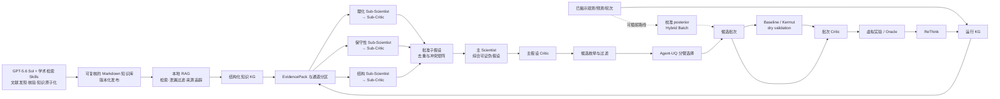

# 面向 GB1 结合能力定向进化的科学智能体

## 1. 问题定义

### 1.1 任务定义与系统架构

本项目选择实验标签覆盖充分的 GB1 作为当前系统的测试对象。该 assay 测量 GB1 与 IgG-Fc 的结合能力，系统任务随之定义为在固定实验预算下最大化结合 fitness。优化位点为 `V39/D40/G41/V54`，WT 四位点序列为 `VDGV`。[1][2][I1]

系统以当前已测变体为起点，每轮分析实验结果、形成突变假设、选择候选，并通过虚拟实验 oracle 获得新标签，构成“数据分析—假设生成—候选选择—实验反馈”的迭代闭环。

实验知识图谱（KG）构成统一知识管理层。KG 持续记录变体、突变、实验 fitness、科学假设、证据来源和轮次关系；RAG 从外部定向进化与结合知识库检索相关条目，并将带来源信息的检索结果接入结构化 KG。Scientist 与 Critic 通过 KG 工具获得实验记录、理化性质、结构信息和外部知识。当前配置使用实验观测支持数值选择，外部知识用于假设形成与候选解释。[I2]

### 1.2 GB1 数据集选择

数据集选择关注 fitness 定义、实验标签覆盖、组合突变结构和闭环评估成本。丰富的实测标签可以将候选标签隐藏在 oracle 中，并在统一数据折和查询预算下比较不同方法。[I5] ProteinGym 与 FLIP 汇集多种蛋白和 assay，适合数据标准化与跨蛋白评估；当前实验从中选择一个标签覆盖充分、fitness 定义统一的具体 assay。[2][3]

GFP 的多点景观为稀疏采样，AAV 涉及较长突变区段、高阶变体和 indel，β-lactamase 数据以单点 DMS 为主。这些数据分别适合大空间外推、复杂序列工程和跨蛋白活性评估，均未形成接近完整的多点组合 fitness 景观。[2][3][I5] GB1 四位点空间为 $20^4=160{,}000$，其中 149,361 个变体已有实验标签。该景观兼具显著上位性、可枚举候选空间和低成本 oracle 封装，可直接检验智能体从低阶观测搜索高阶优良组合的能力。GB1 的实验读出为 IgG-Fc 结合 fitness，数据集选择最终确定了本项目的结合能力优化目标。[1][2]

实验评价分为两部分：最终测试集衡量模型的排序与头部识别能力；闭环轨迹衡量固定查询预算下的最佳已测 fitness、命中率和 regret。不同方法使用相同数据折、初始观测和查询预算进行比较。

### 1.3 适应度预测模型选择

GB1 闭环从 96 条已测变体启动，预测模型需要在少量标签下学习四个位点的组合效应，并为候选排序提供可用的不确定性。Kermut 以 ESM-2 表征、ProteinMPNN 位点条件概率和残基空间距离构造复合核，再用高斯过程输出 assay fitness 的后验均值与标准差。该结构同时覆盖序列、局部结构和多突变关系，精确 GP 的计算规模也适合当前标签预算。[4][I6]

模型选择采用同一 GB1 assay 的直接结果。ProteinGym 监督式基准中，Kermut 在 random、contiguous 和 modulo 切分上的 Spearman 分别为 0.781、0.778 和 0.778；ProteinNPT 为 0.858、−0.322 和 −0.322，ESM-1v embedding 为 0.731、0.310 和 0.259，one-hot 为 0.710、−0.222 和 −0.222。[9][I9] Kermut 在不同突变分布下保持稳定排序，更契合由低阶观测搜索高阶组合的闭环任务。

其他模型承担补充角色：零样本蛋白语言模型提供进化先验，FSFP 适合资源充足时增加少样本排序头，Pythia-PPI 和 AlphaFold 类模型用于结合能或界面可信度复核，one-hot 异质集成保留为透明基线。当前系统将 Kermut 用作任务特异预测与 dry validation；实验或密封 oracle 提供 fitness 真值。[I6][I7][I9]

## 2. 数据与无泄漏评估协议

数据来自 FLIP GB1 `four_mutations_full_data.csv`，记录四位点变体、突变深度、蛋白序列和实验 fitness。[2][I1] 当前 `GB1-AL96-5CV-v1` 协议采用五折闭环划分，每折包含以下四类数据：[I3]

| 数据角色 | 规模 | 用途与可见性 |
|---|---:|---|
| `initial_observed` | 96 | WT 1 条、单点 76 条、双点 19 条；序列与 fitness 对智能体可见 |
| `benchmark_validation` | 384 | 控制器用于模型选择与评估；智能体不可访问 |
| `candidate_pool` | 约 119,400 | 智能体可见序列；oracle 在候选被选中后返回 fitness |
| `final_test` | 约 29,400 | 高阶突变外层测试集；闭环结束后由评测器读取 |

五个 `final_test` 由全部三点和四点突变按突变深度分层、稳定哈希分配，折间互斥。初始集固定为低阶突变，验证集和最终测试集的成员选择不读取 fitness。数据写入器按 agent、controller、oracle 和 evaluator 分别生成能力视图，manifest 记录划分与文件哈希；agent 视图不包含候选、验证和测试标签。[I3]

oracle 仅接受候选池内、未查询且未超预算的变体。每轮新标签在下一轮开始时进入观测历史。全部轮次完成后，系统使用已揭示数据拟合最终模型，完成测试集预测，再一次性读取 `final_test` 标签。[I4] RAG 检索采用目标数据泄漏过滤与来源追踪，外部知识以证据上下文进入 KG，实验 fitness 仍由当前折的可见观测和 oracle 查询提供。[I2]

## 3. 预测模型、Agent/KG 与主动学习架构

### 3.1 智能体思考与调度框架

当前系统采用**合同驱动的分层 DAG，并在局部加入有界自适应修订**。`CampaignRunner` 预注册每轮的任务顺序、角色权限、输入输出合同和终止条件；三个证据分支并行执行，分支内按“Sub-Scientist—Sub-Critic—修订”串行运行，主 Scientist 汇总后再经过主 Critic。实验结果揭示后，ReThink 将假设检验结果送入下一轮。[I10]

ReAct 的自主“思考—工具—观察”循环和 LLM 规划型 Plan-and-Execute 均未进入主控制面。[10] GB1 的任务分解、实验预算和可见数据边界在运行前已经确定，固定 DAG 可保持折间流程一致，并让每次查询、修订和拒绝都能审计。自适应性集中在证据可用性、Critic 修订、候选选择和跨轮反馈，适合小样本、强约束的实验闭环。

### 3.2 Multi-Agent 分层设计

| Agent 角色 | 核心功能 | 系统与算法意义 |
|---|---|---|
| 主 Scientist | 汇总基础 KG/RAG 上下文和已批准子假设，形成统一的可证伪假设、位点偏好及简洁解释 | 执行跨通道证据融合，将局部分析转换为候选生成可消费的决策对象 |
| Sub-Scientist | 理化、保守性和结构三个角色分别读取独立 `EvidencePack`，输出方向性子假设、正反证与不确定性 | 隔离不同证据语义，压缩主 Agent 上下文，并支持按通道消融与并行计算 |
| Sub-Critic | 在单一通道内检查引用、适用范围、因果越界和证据缺口，返回批准、修订或拒绝 | 阻止错误子假设进入汇总层，将错误定位到具体知识通道 |
| 主 Critic | 主假设 Critic 检查跨通道冲突与可证伪性；批次 Critic 检查候选资格、多样性、UQ/OOD 语义和提交条件 | 分离提出与审批权限，为假设和实验批次设置独立决策门禁 |
| ReThink | 在标签揭示后对照假设、dry prediction 与 wet observation，记录支持、反驳和模型分歧 | 完成跨轮信用分配，使失败证据、验证结果和修订方向进入后续 KG 上下文 |

单一 Agent 需要同时处理原始特征、外部文献、跨通道冲突、候选选择和自我审查，容易形成上下文拥塞与证据语义混用。分层 Multi-Agent 将科学解释、证据审查、全局综合和事后学习拆成可验证节点，使失败可定位、角色可替换、权限可限制。[I10] 当前实现已通过离线分层闭环测试；其 fitness 增益仍需在相同 fold、seed 和预算下与 single-Agent 路线比较。

### 3.3 预测模型与闭环

预测层提供两类实现：轻量基线使用 one-hot、位点交互特征与 Ridge/ExtraTrees 集成；Kermut 将 ESM-2、ProteinMPNN 和结构信息组合到高斯过程核中，输出预测均值、后验不确定性、置信区间与 OOD 指标。[4][I6] 当前 KG–LLM 主路线先由 Scientist 生成结构化假设，再由 Agent-UQ 按假设靶向、证据/历史先验、覆盖探索和匹配对照选择候选；预测器随后执行 dry validation，结果进入 Critic、ReThink 和后续轮次知识。[I7]

### 3.4 主动学习设计

主动学习利用每轮新增的 wet fitness 更新代理模型，并把下一批实验分配到高预测值、高认知不确定性和知识支持区域。利用分支提高当前预算内发现高 fitness 变体的概率，探索分支补充模型信息缺口，知识分支保留 Scientist/KG 提出的机制方向；批次多样性减少近重复实验。[5][I12] 这条路径直接作用于 `best@budget`、AULC 和 regret，也可能通过更有信息量的标签改善最终模型覆盖。

当前路线采用 `lightweight_calibrated_hybrid`，需要同时启用 `selection_driver: active_learning` 与 `active_learning.enabled: true`。实验设置为 3 轮、每轮 16 个候选，从 256 个候选中选择；`visible_holdout_ensemble` 只读取当轮开始前已揭示的 wet 标签，使用 20% 可见数据校准偏差、方差尺度和 90% conformal 区间，再用全部可见数据重拟合。[I12]

| 层次 | 当前输入 | 是否拟合 fitness | 选择依据 |
|---|---|---:|---|
| 序列主效应 | 四个位点各 20 种氨基酸的 one-hot 特征 | 是 | 精确表示 GB1 离散突变身份，适合少量标签和快速逐轮更新 |
| 位点交互 | 六个位点对的氨基酸组合特征 | 是 | 显式表达 GB1 强上位性和组合突变效应 |
| Posterior 信号 | 均值、模型分歧标准差、置信区间与 OOD | 否，来自预测与校准 | 分别支持 fitness 利用、认知探索和风险控制 |
| 知识信号 | KG evidence score 与历轮 validation prior | 否，作为 soft prior | 保留机制假设和已验证实验方向，不改变 fitness 标签语义 |
| 批次结构 | 候选间 Hamming 距离 | 否，作为多样性惩罚 | 扩大单批序列覆盖，降低重复测量的信息浪费 |

`hybrid_batch` 当前按 50% 利用、25%探索和25%知识分配配额，三路原始评分依次为 `μ+σ−0.25×OOD`、`σ−0.25×OOD` 和 `K+0.25μ−0.25×OOD`，再施加 `0.10` 多样性惩罚；预算 16 对应 8/4/4 个候选。当前 posterior 仅加载 one-hot/pairwise 基线，以较低计算成本隔离主动学习策略的效果；Kermut 保留在独立预测与验证路线，后续可在同折校准通过后加入 posterior 模型集合。[I12] Agent-UQ、主动学习、预测器直接选择和随机选择共享数据折、初始观测与总查询预算，用于配对比较。

### 3.5 双向 KG 与本地 RAG

KG 汇聚两条知识流。实验知识流把 `Observation`、`Prediction`、`Hypothesis`、Critic 决策、`Validation` 和 ReThink 结果按轮次写入运行图与结构化图，形成可重放的实验记忆；外部知识流把本地文献与操作知识经 RAG 转换为 `Document—Chunk—Claim—CitationSupport—Publication—Evidence` 关系，形成可复用的科学知识层。[I8][I11] KG 主要服务于 Agent 上下文、Critic 审查、跨轮反馈和选择先验，无需承载完整模型特征或全文。

外部知识先在实验闭环之外生产。GPT-5.6 Sol 调用学术检索、引文核验和结构化写作 Skills，围绕目标、assay 与作用机制搜索文献，将实验操作、适用条件、可观察读数、决策边界和来源整理为原子化 Markdown。[I13] 原始论文与 PDF 保留为引用和逐条核验依据，版本化 Markdown 作为 RAG 直接索引的知识服务层。

该流程在入库前完成跨文献聚合、去重和主张原子化，使检索单元围绕高密度、可执行知识组织。RAG 无需在每轮重新解析长篇 PDF，也能减少按页面或固定窗口切分产生的零散片段。Markdown 支持逐行复核、引用纠错、版本比较和局部更新，审核通过的知识快照才进入索引。

运行日志只能还原事件顺序，结构化 KG 还能表达变体、assay、条件、证据、反证和来源之间的语义关系。LLM 获取的是按任务和轮次裁剪的相关子图，证据类型与权限在进入提示词前已经确定；这种约束使外部知识能够引导假设方向，同时保留实验观测的最高权威等级。[7][8][I8]

KG 负责知识表示、查询和跨轮持久化；LangGraph 负责节点调度、状态流转与恢复。[11] 当前 `CampaignRunner` 和 `HypothesisReviewGraph` 已实现类型化状态、并行分支、有界重试和审批门禁，接入 LangGraph 只会替换工作流运行层，无法替代实验知识模型。现阶段保留项目内控制器，可减少依赖迁移并维持既有 oracle、预算和审批状态机。

当前 RAG 路线从版本化本地原子知识库建立 SQLite 索引，每轮经过查询清洗、目标泄漏过滤、词法或混合召回、top-k/token 限制和 no-answer 门禁；命中内容携带来源并按 `retrieved_only` 写入结构化 KG，再以只读 `EvidencePack` 提供给对应 Agent。[6][I11] 未经 GB1 校准的检索证据保持 context-only，不直接形成 fitness 分数。

Agentic RAG 与 Deep Research 涵盖的文献发现、反证搜索和引用核验能力由上述离线流程承担。[12] 同步实验循环采用本地 RAG，可固定语料版本、查询预算和延迟，保证不同折与消融条件读取同一知识快照，并降低联网内容变化、提示注入和来源状态漂移。新增外部知识经过审核后发布为下一版本地语料，再进入后续实验。

## 参考文献

[1] Wu, N. C., Dai, L., Olson, C. A., Lloyd-Smith, J. O., & Sun, R. (2016). *Adaptation in protein fitness landscapes is facilitated by indirect paths*. **eLife, 5**, e16965. [https://doi.org/10.7554/eLife.16965](https://doi.org/10.7554/eLife.16965)

[2] Dallago, C., Mou, J., Johnston, K. E., Wittmann, B. J., Bhattacharya, N., Goldman, S., Madani, A., & Yang, K. K. (2021). *FLIP: Benchmark tasks in fitness landscape inference for proteins*. **Advances in Neural Information Processing Systems, 34**, 26601–26622. [https://doi.org/10.1101/2021.11.09.467890](https://doi.org/10.1101/2021.11.09.467890)

[3] Notin, P. et al. (2023). *ProteinGym: Large-Scale Benchmarks for Protein Fitness Prediction and Design*. **NeurIPS 36, Datasets and Benchmarks**. [论文](https://proceedings.neurips.cc/paper_files/paper/2023/file/cac723e5ff29f65e3fcbb0739ae91bee-Paper-Datasets_and_Benchmarks.pdf)

[4] Groth, P. M., Kerrn, M. H., Olsen, L., Salomon, J., & Boomsma, W. (2024). *Kermut: Composite kernel regression for protein variant effects*. **NeurIPS 37**. [https://doi.org/10.52202/079017-0929](https://doi.org/10.52202/079017-0929)

[5] Yang, J. et al. (2025). *Active learning-assisted directed evolution*. **Nature Communications, 16**, 714. [https://doi.org/10.1038/s41467-025-55987-8](https://doi.org/10.1038/s41467-025-55987-8)

[6] Lewis, P. et al. (2020). *Retrieval-Augmented Generation for Knowledge-Intensive NLP Tasks*. **NeurIPS 33**. [论文](https://proceedings.neurips.cc/paper/2020/hash/6b493230-Abstract.html)

[7] Soman, K., Rose, P. W., Morris, J. H., & Baranzini, S. E. (2024). *Biomedical knowledge graph-optimized prompt generation for large language models*. **Bioinformatics, 40**(9), btae560. [https://doi.org/10.1093/bioinformatics/btae560](https://doi.org/10.1093/bioinformatics/btae560)

[8] Luo, L., Li, Y.-F., Haffari, G., & Pan, S. (2024). *Reasoning on Graphs: Faithful and Interpretable Large Language Model Reasoning*. **ICLR 2024**. [论文](https://openreview.net/forum?id=ZGNWW7xZ6Q)

[9] ProteinGym. *Supervised DMS benchmark: SPG1_STRSG_Wu_2016*. [Random split](https://raw.githubusercontent.com/OATML-Markslab/ProteinGym/main/benchmarks/DMS_supervised/substitutions/Spearman/DMS_substitutions_Spearman_DMS_level_fold_random_5.csv)、[Contiguous split](https://raw.githubusercontent.com/OATML-Markslab/ProteinGym/main/benchmarks/DMS_supervised/substitutions/Spearman/DMS_substitutions_Spearman_DMS_level_fold_contiguous.csv)、[Modulo split](https://raw.githubusercontent.com/OATML-Markslab/ProteinGym/main/benchmarks/DMS_supervised/substitutions/Spearman/DMS_substitutions_Spearman_DMS_level_fold_modulo_5.csv)。

[10] Yao, S. et al. (2023). *ReAct: Synergizing Reasoning and Acting in Language Models*. **ICLR 2023**. [论文](https://openreview.net/forum?id=WE_vluYUL-X)

[11] LangChain. *Custom workflow, Subgraphs and Persistence*. [Custom workflow](https://docs.langchain.com/oss/python/langchain/multi-agent/custom-workflow)、[Subgraphs](https://docs.langchain.com/oss/python/langgraph/use-subgraphs)、[Persistence](https://docs.langchain.com/oss/python/langgraph/persistence)。

[12] Shao, Y. et al. (2024). *Assisting in Writing Wikipedia-like Articles From Scratch with Large Language Models*. **NAACL 2024**. [论文](https://aclanthology.org/2024.naacl-long.347/)

## 实现依据

[I1] [GB1 数据配置](../configs/data/splits/gb1.yaml)与[任务配置](../configs/task/gb1_binding_al96.yaml)。

[I2] [KnowledgeEngine](../src/fitness_agents/knowledge/engine.py)、[KG–RAG 配置](../configs/knowledge/gb1_local_rag.yaml)与[闭环编排器](../src/fitness_agents/loop/orchestrator.py)。

[I3] [AL96 五折划分](../src/fitness_agents/data/splitting/al96.py)、[能力视图写入](../src/fitness_agents/data/splitting/writer.py)与[角色加载器](../src/fitness_agents/data/loader.py)。

[I4] [Oracle 状态机](../src/fitness_agents/loop/backends.py)与[隐藏标签测试](../tests/leakage/test_hidden_labels.py)。

[I5] [测试数据集的优化目标与任务选择策略](fitness-agents-测试数据集目标与任务选择.md)。

[I6] [轻量基线配置](../configs/model/baseline.yaml)、[Kermut 配置](../configs/model/kermut.yaml)、[集成预测器](../src/fitness_agents/models/ensemble.py)与[Kermut 后端](../src/fitness_agents/models/backends/kermut.py)。

[I7] [KG–LLM 主路线配置](../configs/experiments/knowledge_agent_al96_rag.yaml)、[主动学习路线配置](../configs/experiments/knowledge_agent_active_learning.yaml)、[闭环编排器](../src/fitness_agents/loop/orchestrator.py)、[Agent-UQ 分臂选择](../src/fitness_agents/mutation/quota_acquisition.py)与[主动学习模块](../src/fitness_agents/active_learning/module.py)。

[I8] [KnowledgeEngine](../src/fitness_agents/knowledge/engine.py)、[EvidencePack 契约](../src/fitness_agents/kg_interaction/contracts.py)、[KG 交互控制器](../src/fitness_agents/kg_interaction/controller.py)与[原子 RAG–KG 架构记录](english-atomic-rag-kg-production-architecture.md)。

[I9] [适应度预测模型调研与 GB1 评估策略](fitness-agents-适应度预测模型调研与GB1评估策略.md)与[Predictor 插件说明](predictor-plugins.md)。

[I10] [分层 Scientist–Critic 设计与实施记录](hierarchical-scientist-critic-and-llm-resilience-plan.md)、[HypothesisReviewGraph](../src/fitness_agents/agents/hypothesis_graph.py)、[分层实验配置](../configs/experiments/hierarchical_scientist.deepseek.yaml)与[闭环编排器](../src/fitness_agents/loop/orchestrator.py)。

[I11] [原子 RAG–KG 生产架构](english-atomic-rag-kg-production-architecture.md)、[当前 RAG 执行审计](current-rag-execution-and-agentic-kg-entry-architecture-analysis.md)、[本地 RAG 配置](../configs/knowledge/gb1_local_rag.yaml)与[KnowledgeEngine](../src/fitness_agents/knowledge/engine.py)。

[I12] [主动学习与强化学习优化策略](active-learning-and-reinforcement-learning-optimization-strategy.md)、[低计算开销模块与实现记录](low-compute-active-learning-rl-module-prioritization.md)、[主动学习实验配置](../configs/experiments/knowledge_agent_active_learning.yaml)、[可见标签 posterior](../src/fitness_agents/active_learning/posterior.py)、[Hybrid Batch 采集](../src/fitness_agents/active_learning/acquisition.py)与[GB1 one-hot/pairwise 特征](../src/fitness_agents/features/gb1.py)。

[I13] [定向进化本地知识库说明](../resources/local_knowledge/directed_evolution/README.md)、[结合能力本地知识库说明](../resources/local_knowledge/binding/README.md)与本项目离线知识生产约定：GPT-5.6 Sol 调用学术检索、引文核验和结构化写作 Skills，输出经人工复核的版本化 Markdown。
