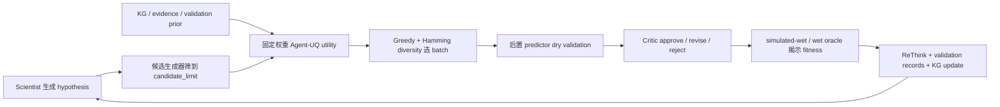
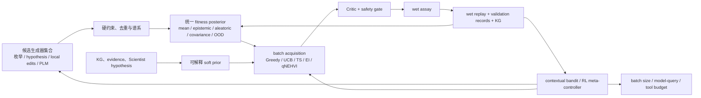

# 主动学习与强化学习驱动的蛋白质适应度优化：系统审计、文献复用与实施路线图

> 日期：2026-08-18  
> 适用仓库：`D:\fitness-agents`  
> 文档性质：面向当前实现的技术决策报告；定向多源证据综述，不是系统综述，也不是新增实验结果。  
> 证据标签：`[仓库事实]` 表示由当前代码/artifact 直接支持；`[外部证据]` 表示由论文或固定源码快照支持；`[建议]` 表示尚待实验验证的工程方案。

## 1. 执行结论

### 1.1 核心判断

1. **当前系统已经具备闭环、知识 Agent、coverage-UQ、dry/wet validation、Critic 和 ReThink，但默认 `knowledge_agent` 还不是典型的“fitness-surrogate 驱动主动学习”。** `[仓库事实]` 默认初选使用 `agent_uq`，fitness predictor 被明确排除在生成选择之外；所谓 GP 只输出候选相对于已观测序列的覆盖不确定性，不预测 fitness。[`GenerationConfig`](../src/fitness_agents/config.py#L413)、[`AgentUncertaintySelector`](../src/fitness_agents/mutation/uncertainty.py#L73)、[`CampaignRunner`](../src/fitness_agents/loop/orchestrator.py#L967)
2. **近期最值得做的是主动学习/批量贝叶斯优化，而不是立即做端到端强化学习。** 最近 artifact 只有 3 轮、每轮 32 个 simulated-wet/oracle query，且三折仅完成 2 折、没有 same-fold baseline；这不足以稳定训练高维 PPO/序列级 RL，却足以比较经校准的 surrogate、Greedy、UCB、Thompson sampling 和多样性批量选择。[`fold_results.json`](../artifacts/fold-campaigns-20260816T140055Z/fold_results.json)
3. **现有 `onehot_heterogeneous_ensemble` 与 Kermut 是可复用资产，不应重复造 predictor。** `[仓库事实]` 前者已有 Ridge bootstrap、ExtraTrees、可选 GP 和 conformal radius；Kermut 已作为当前 dry validator。第一步是把 predictor 在选择前拟合并暴露可信 posterior，而不是另写一套孤立模型。[`ensemble.py`](../src/fitness_agents/models/ensemble.py)、[`predictor-plugins.md`](predictor-plugins.md)
4. **RL 的第一落点应是“高层策略控制器”，不是直接逐 token 改蛋白。** `[建议]` 让 contextual bandit/RL 在每轮选择 generator、acquisition、探索比例、batch size 和资源预算；Scientist 继续产生可解释假设，Critic 保留否决权，wet truth 保持最高权威。
5. **任何上线结论都必须由同折、同初始集、同 wet 预算的基线与消融支持。** 当前两折 final-test 90% 区间覆盖率约为 96.7% 与 48.8%，说明不确定性跨折不稳定；且 fold 0 因 LLM 输出缺失 `hypothesis_id` 失败。现在不能声称现有 Agent-UQ 优于 Random、fitness-direct 或其他 AL 策略。[`三折结果审计`](fold-campaigns-20260816-three-fold-results-and-word-gap-analysis.md)

### 1.2 推荐顺序

| 阶段 | 推荐方法 | 目的 | 进入下一阶段的必要条件 |
|---|---|---|---|
| P0 | 可靠性修复 + paired baselines + transition 日志 | 让结果可归因、可复现 | 计划折全部完成；Random/Greedy/UCB/TS/Agent-UQ 同折可比 |
| P1 | 校准 surrogate + batch AL/BO | 提高单位 wet query 收益 | UQ 校准合格，且 AL 在预注册主指标上优于最佳简单基线 |
| P2 | 多目标、成本感知和自适应 batch | 同时优化 fitness、风险、多样性与成本 | Pareto/hypervolume 与成本指标稳定改善 |
| P3 | Contextual bandit 策略控制器 | 学习“何时探索、何时利用、用哪个策略” | 跨蛋白/跨折 transition 足够，离线回放无泄漏 |
| P4 | 受约束 offline/model-based RL | 学习非短视的生成或搜索轨迹 | 在相同 wet 预算下稳定超过 P3，且无 proxy exploitation/OOD 失控 |

## 2. 研究问题与范围

### 2.1 主问题

在保持 wet truth、证据 provenance、数据可见性和 Critic 安全门禁不被削弱的前提下，如何把当前 `fitness-agents` 从固定权重的 Agent-UQ 闭环升级为可校准、可比较、能随实验反馈改进的主动学习系统，并在数据充分后安全引入强化学习？

### 2.2 子问题

1. 当前实现哪些部分已经属于自适应闭环，哪些部分仍是固定启发式？
2. 蛋白质主动学习与 RL 文献中哪些模块有 wet-lab 或高质量 benchmark 支持？
3. 哪些外部源码可直接复用、适配复用或只能借鉴思想？
4. 应优化哪些参数，哪些参数必须保持为不可学习的安全约束？
5. 用什么实验和统计门槛决定是否从 AL 进入 bandit/RL？

### 2.3 范围边界

**纳入：** 蛋白质/生物序列的 iterative active learning、Bayesian optimization、model-based/off-policy RL、实验反馈对齐、多目标序列优化，以及有公开代码的工作。  
**排除：** 仅做静态 variant-effect prediction、没有反馈闭环的通用生成模型、只针对小分子且没有可迁移序列模块的 RL，以及未核实出处的二手报道。  
**与相邻报告的关系：** [`open-mutation-designer-plan.md`](open-mutation-designer-plan.md) 重点解决“如何产生候选池之外的新序列”；本文重点解决“如何从 round feedback 学习选择策略”。两者应共享同一个 posterior service、candidate contract 与评估协议。

## 3. 当前系统审计：已经有什么、还缺什么

### 3.1 当前闭环

### 3.2 关键事实与后果

| 模块 | 当前实现 | 对 AL/RL 的含义 |
|---|---|---|
| Selection driver | `knowledge_agent.yaml` 固定 `agent_uq`，`use_fitness_predictors=false` | 当前不是 fitness-posterior 驱动的 AL；predictor 对初选没有因果作用 |
| Agent utility | `hypothesis/evidence/prior/coverage uncertainty` 线性加权 | 权重是专家设定，不随观察到的收益更新；各分量量纲也未统一校准 |
| Coverage GP | RBF(Hamming) 只计算 posterior variance，`length_scale=1`、`noise=1e-6` | 只回答“这个序列离已测区域多远”，不回答“它可能有多高 fitness” |
| Candidate pool | generator 先排序/保留 `candidate_limit`；AL96 配置为 64，batch 为 32 | acquisition 只能看到 64 个候选；生成器排序可能成为决定性瓶颈 |
| Batch selection | Greedy 逐个选，`diversity_lambda=0.1`；相似度除以硬编码 `4.0` | 只对 GB1 四位点编码语义正确；全长或其他 mutable-site 数量需参数化 |
| Acquisition | Random、Greedy、UCB、TS 已存在 | 可作为基线复用；还没有 EI/PI、qEI/qNEHVI、DPP/k-center 或 cost-aware acquisition |
| Predictor | `onehot_heterogeneous_ensemble`、Kermut 和外部 predictor 插件已存在 | 可直接升级为 posterior provider；不需要另写基础模型注册系统 |
| Calibration | ensemble 可使用 validation residual conformal radius；fold manifest 路径目前不传 validation set | 必须明确 calibration split/rolling calibration，否则 nominal interval 不可信 |
| GP in ensemble | 可选 sklearn GP 的 mean 进入 ensemble，但 GP std 被丢弃 | `include_gaussian_process=true` 不等于使用了 GP posterior UQ |
| Dry/wet memory | wet 权重 1.0；dry cap 默认 0.20；reliability 由历史 dry-wet RMSE 与 OOD 衰减 | 这是很好的“可信度加权 replay”基础，但需置信区间与最小样本门槛 |
| Validation prior | 把历史 residue effect 按位点加和后取均值/tanh | 在 GB1 的 sign epistasis 场景中可能丢失组合效应，应加入 interaction posterior |
| Critic | 可用预测、evidence、OOD 等审查并重选，但 OOD/disagreement 阈值为 `null` | Critic 框架可保留；门槛应由 calibration 数据决定，而非手工空置 |
| Metrics | 有相关性、RMSE、NDCG、top-k、regret@k、coverage、NLL；loop 仅报告 best/mean/rank | 缺 AULC、累计 regret、success@budget、hypervolume、diversity、cost 与 policy regret |
| Learnable parameter contract | KG 已有 `LearnableParameterSpec`、bounds、transform、`round_boundary_only`、`min_evidence` | 可扩展到 AL/RL policy 参数，避免 LLM 在轮内任意改权重 |

### 3.3 两个容易误改的地方

1. **不要只把 `acquisition: greedy` 改成 `ucb`。** `AgentUncertaintySelector` 已把 `uncertainty_beta × coverage_uncertainty` 加入 utility，再用 UCB 会把同一 uncertainty 通过 `fitness_std` 再奖励一次，形成双重计数。应先把 `fitness posterior`、`knowledge prior` 与 `acquisition` 分成独立合同。
2. **不要把 dry prediction 当成 wet reward。** dry evidence 可训练 surrogate 或提供低权重 prior，但 RL 的主 reward 与成功判定必须来自 wet measurement；否则策略会学习利用 predictor 缺陷。

### 3.4 三个容易混淆的“Agent/学习”概念

- **LLM Agent**：Scientist、Critic、ReThink 负责提出假设、解释证据、审查和反思；存在这些角色不等于系统已经用了 RL。
- **主动学习/BO policy**：根据 surrogate posterior 和 acquisition 选择下一批实验。若目标是提高全局预测准确率，偏向 uncertainty/information gain；若目标是找到最高 fitness，偏向 BO/UCB/TS/EI；当前任务应以优化收益为主、保留显式探索配额。
- **RL policy Agent**：必须有版本化的 state、action、reward、transition、behavior policy 和权限边界。只让 LLM 根据文字反思调整建议，不构成可验证的 RL。

## 4. 文献证据：可借鉴模块与反证

### 4.1 定向检索方法

- 检索日期：2026-08-18。
- 主题词：`protein active learning directed evolution`、`protein Bayesian optimization uncertainty`、`reinforcement learning biological sequence design`、`experimental feedback protein language model`、方法名与 `GitHub` 组合。
- 来源层：OpenAlex 定向检索、网页搜索、出版社/会议正式页面、DOI 页面、GitHub 固定提交。
- 纳入结果：10 项核心工作，其中 8 项为期刊或正式会议论文，2 项为 arXiv/bioRxiv 或 workshop/preprint；2020 年工作仅作为奠基方法或 benchmark。
- 去重：优先 DOI；无 DOI 时用规范化标题与第一作者。
- 来源核验：10/10 核心工作的存在性、题名、年份和正式页面已逐项核对；主要方法判断来自出版社/会议摘要、正文方法/结果页面或对应源码。没有对每篇全文做逐页复现实验审计。
- 降级说明：Windows 控制台首次输出 OpenAlex 结果时发生编码错误，设置 UTF-8 后恢复；Google/Bing/DuckDuckGo/Brave 直达搜索页被当前网页工具的 safe-URL 校验拒绝，因此未把它们误报为“零命中”。本报告不是 PRISMA 系统综述，工具未提供的总命中数不做虚构。
- 源码审计：只做固定提交的静态结构、关键文件和许可证检查；未安装或运行外部训练栈，不能把论文结果视为已在本仓库复现。

证据等级为本报告针对计算蛋白工程定义的 claim-fitness 分级：`T1` = peer-reviewed 且包含直接实验反馈/验证；`T2` = peer-reviewed 计算 benchmark 或方法研究；`T3` = preprint/arXiv 或仅有开源 benchmark。等级不代表期刊声望，也不替代逐项方法学审查。

### 4.2 核心工作矩阵

| 工作 | 等级 | 证据类型 | 可借鉴模块 | 对当前系统的判断 |
|---|---:|---|---|---|
| ALDE | T1 | 同时包含 wet-lab 迭代与已有 landscape 模拟；peer-reviewed | batch BO、UCB/TS、模型/encoding/acquisition 消融、ensemble bootstrap | 最接近当前有限候选池场景；适合 P1 基线与 batch loop。([Yang et al., 2025](https://www.nature.com/articles/s41467-025-55987-8)) <!--ref:yang2025alde--><!--anchor:section:Abstract--> |
| EVOLVEpro | T1 | 多蛋白 wet-lab；peer-reviewed | PLM embedding cache、轻量 RF top layer、low-N round ingestion、多目标、diverse initial set | 表明轻量模型在其 low-N 任务中可以实用；也说明简单 top-n 仍是必须击败的强基线。([Jiang et al., 2025](https://doi.org/10.1126/science.adr6006)) <!--ref:jiang2025evolvepro--><!--anchor:section:Structured%20Abstract--> |
| Protein-UQ | T2 | 多 landscape UQ/AL/BO benchmark；peer-reviewed | UQ calibration、uncertainty-error correlation、coverage/width/NLL、AL strategies | 关键反证：没有单一 UQ 方法普遍最好，BO 在其测试中未超过 greedy；不能把“用了 UQ”当作改进证据。([Greenman et al., 2025](https://journals.plos.org/ploscompbiol/article?id=10.1371%2Fjournal.pcbi.1012639)) <!--ref:greenman2025proteinuq--><!--anchor:section:Author%20summary--> |
| AdaLead / FLEXS | T3 | 模拟 benchmark；preprint + 开源 sandbox | `Landscape/Model/Explorer/Evaluator` 分层、wet/model query 双预算、robustness/efficiency/adaptivity | 最适合作为本仓库评估合同参考；AdaLead 应列为强简单搜索基线。([Sinai et al., 2020](https://arxiv.org/abs/2010.02141)) <!--ref:sinai2020adalead--><!--anchor:section:Abstract--> |
| LaMBO | T2 | 多目标离线/模拟；ICML | 多任务 GP、EI/EHVI/NEHVI、Pareto frontier、hypervolume、feasibility/dedup、latent edits | P2 多目标与候选过滤最有价值；完整 latent stack 对当前 MVP 过重。([Stanton et al., 2022](https://proceedings.mlr.press/v162/stanton22a.html)) <!--ref:stanton2022lambo--><!--anchor:section:Abstract--> |
| DyNA-PPO | T2 | 生物序列模拟；ICLR | 动态选择 surrogate 的 model-based PPO、count-based visitation bonus、按轮 retraining | 适合作为 RL 设计原则；当前 3 轮数据不足以直接复现 PPO。([Angermueller et al., 2020](https://openreview.net/forum?id=HklxbgBKvr)) <!--ref:angermueller2020dynappo--><!--anchor:section:Abstract--> |
| LatProtRL | T1 | AAV/GFP + in vitro 结果；ICML | latent continuous action、PPO、mutation-depth/episode/step 约束 | 说明 RL 可放在生成器内部；当前仓库应先实现 action constraint，不应直接迁移其硬编码任务栈。([Lee et al., 2024](https://proceedings.mlr.press/v235/lee24x.html)) <!--ref:lee2024latprotrl--><!--anchor:section:Abstract--> |
| δ-Conservative Search | T2 | DNA/RNA/蛋白/肽 benchmark；ICML | 从高分离线序列启动、根据 proxy uncertainty 自适应 trust radius `δ` | 对防止 reward hacking/OOD 最有直接价值；适合先做一个小的“最大编辑半径”策略。([Kim et al., 2025](https://proceedings.mlr.press/v267/kim25q.html)) <!--ref:kim2025deltacs--><!--anchor:section:Abstract--> |
| RLXF | T3 | 多蛋白 family + 实验反馈；bioRxiv v2，尚属预印本 | reward-model ensemble、PPO + KL、PLM functional alignment、10–100 样本分析 | 可借鉴 reward 合同与 ensemble；大模型微调不是当前 P1 路线。([Blalock et al., 2026 version](https://www.biorxiv.org/content/10.1101/2025.05.02.651993v2)) <!--ref:blalock2026rlxf--><!--anchor:section:Abstract--> |
| ORI | T1 | 多类酶 wet-lab；peer-reviewed | ontology-conditioned generation、PDA/PGM/USM 分工、wet-feedback preference update、多目标约束 | 与当前 KG/Agent 最相容；应借鉴 ontology→constraint contract，而不是整体引入 3B 生成模型。([He et al., 2026](https://www.nature.com/articles/s41467-026-69855-6)) <!--ref:he2026ori--><!--anchor:section:Abstract--> |

### 4.3 文献之间的关键张力

| 张力 | 综合判断 |
|---|---|
| ALDE 支持 batch UQ/BO，而 Protein-UQ 中 BO 未胜 greedy | 不矛盾：landscape、representation、UQ 质量、初始集、acquisition 和目标不同。结论不是“UQ 无用”，而是 **UQ 必须校准并与 greedy 同预算比较**。 |
| EVOLVEpro 的 top-n 很强，而 RL 工作强调长程探索 | 在 low-N 和浅 mutation 场景，简单 greedy 可更稳；只有发现 sign epistasis、局部最优或多步 delayed reward 后，RL 才可能有净收益。 |
| RLXF/ORI 展示 experimental feedback 对齐，而 δ-CS 强调 proxy 失配 | feedback 本身不消除 reward hacking。任何 RL 都需 OOD/trust-region、KL、wet-only 主 reward 与独立 final-test。 |
| Latent RL 可生成远距离序列，而当前知识系统强调可解释 evidence | 两者可分层：RL proposer 只生成；统一 feasibility/knowledge/critic 门禁审查；最终选择与证据合同仍由项目原生代码控制。 |

## 5. GitHub 源码审计与复用边界

### 5.1 固定快照

| 仓库 | 审计提交 | 许可证 | 重点文件 | 建议复用级别 |
|---|---|---|---|---|
| [jsunn-y/ALDE](https://github.com/jsunn-y/ALDE/tree/d0b3593dd17987c9864830d36f5976b1ad04a619) <!--ref:alde-code--><!--anchor:section:src/acquisition.py--> | `d0b3593` | MIT | `src/acquisition.py`, `src/optimize.py` | **适配复用**：acquisition API、bootstrap ensemble、round loop 与测试；不复制整套 CLI |
| [microsoft/protein-uq](https://github.com/microsoft/protein-uq/tree/5e7b2b9cd219805eaabe73b21d4d9955cf882448) <!--ref:protein-uq-code--><!--anchor:section:src/models/evals.py--> | `5e7b2b9` | MIT | `src/active_learning/active_learning.py`, `src/models/evals.py` | **优先适配**：UQ 指标、AL replay benchmark；禁止把使用真实 oracle error 的回顾性策略带入在线路径 |
| [samsinai/FLEXS](https://github.com/samsinai/FLEXS/tree/dd409167b5575b51967d325b4e48aef3577a505f) <!--ref:flexs-code--><!--anchor:section:flexs/explorer.py--> | `dd40916` | Apache-2.0 | `flexs/explorer.py`, `landscape.py`, `baselines/explorers/dyna_ppo.py` | **接口/测试复用**：双预算、Explorer/Evaluator；Python 3.7 时代依赖与旧 pandas 代码不整包导入 |
| [samuelstanton/lambo](https://github.com/samuelstanton/lambo/tree/ac62e8e86c2068f8ac3c60fea4e356773291b6ec) <!--ref:lambo-code--><!--anchor:section:lambo/acquisitions--> | `ac62e8e` | Apache-2.0 | `lambo/acquisitions/*`, `models/base_surrogate.py`, `optimizers/lambo.py` | **选择性移植**：qNEHVI/hypervolume/feasibility/dedup；不先引入 Hydra+W&B+pymoo+latent 全栈 |
| [hyeonahkimm/delta_cs](https://github.com/hyeonahkimm/delta_cs/tree/08cf991f80a53da9fdfc6225ae97cef1a87deec6) <!--ref:delta-code--><!--anchor:section:flexs/algorithm/gfn.py--> | `08cf991` | Apache-2.0 | `flexs/algorithm/gfn.py`, `BioSeq-GFN-AL/lib/acquisition_fn.py` | **移植小公式**：uncertainty→trust radius、offline parent sampling；GFlowNet 主体后置 |
| [RomeroLab/RLXF](https://github.com/RomeroLab/RLXF/tree/ce50b6e786ad25fe9495b85f5074038c3524bfaa) <!--ref:rlxf-code--><!--anchor:section:PPO_ESM2.py--> | `ce50b6e` | Apache-2.0 | `Training_Ensemble_of_reward_models.py`, `PPO_ESM2.py` | **思想/小模块复用**：reward ensemble、KL/entropy/reward logging；脚本含 CreiLOV/ESM2/GPU 硬编码，不直接并入 |
| [TencentAI4S/ori](https://github.com/TencentAI4S/ori/tree/d85ea772109e585056fa8436430a90fff1887d93) <!--ref:ori-code--><!--anchor:section:projects/rlwf/rlwf_update.py--> | `d85ea77` | PolyForm Noncommercial 1.0.0 | `projects/rlwf/rlwf_update.py` | **概念复用/非商用限制**：发布路径使用 TRL `DPOTrainer` + LoRA + chosen/rejected wet pairs；商业或再分发前需单独审查 |
| [mat10d/EvolvePro](https://github.com/mat10d/EvolvePro/tree/1c77697d0c09bf6989a1562a55da99301a12e2cd) <!--ref:evolvepro-code--><!--anchor:section:evolvepro/src/model.py--> | `1c77697` | Internal Research EULA | `evolvepro/src/model.py`, `evolvepro/src/evolve.py` | **仅借鉴流程**：embedding cache、K-medoids 初始设计、round 文件摄取；未经许可不复制、改写、再分发 |
| [haewonc/LatProtRL](https://github.com/haewonc/LatProtRL/tree/e1350afffc3b83d6ac1143dfa6eb2ead21af7351) <!--ref:latprotrl-code--><!--anchor:section:net/envr.py--> | `e1350af` | 根目录未发现许可证 | `net/envr.py`, `net/ppo.py`, `config.py` | **no-copy**：只能借鉴 latent action、step/mutation cap；没有许可证不能默认复制 |

### 5.2 最值得直接吸收的代码模块

1. **Protein-UQ 的评估函数与实验命令结构**：补 `miscalibration area`、interval width/range、uncertainty-error Spearman，并把所有策略统一到同一 replay harness。
2. **ALDE 的 acquisition/round-loop 解耦**：把 predictor uncertainty 与 acquisition 分开，使同一 posterior 可跑 Greedy/UCB/TS/EI。
3. **LaMBO 的 feasibility、dedup、Pareto/hypervolume**：先移植小而稳定的多目标工具，不引入完整 latent optimizer。
4. **FLEXS 的 wet-query 与 model-query 双预算**：避免用无限 predictor 调用掩盖实际搜索成本。
5. **δ-CS 的 adaptive radius**：把允许的 mutation depth 或父本距离设为 uncertainty 的函数，作为 RL 前的安全探索层。
6. **RLXF/ORI 的 feedback data contract**：保存 reward model version、wet pair、KL/trust penalty、update round 和回退点；不要直接复制其任务专用训练脚本。

### 5.3 依赖策略

- 当前项目已有 NumPy、scikit-learn、Torch、GPyTorch；P1 可在现有依赖内完成 ensemble、UCB/TS、sequential greedy、k-center/DPP 近似。
- `botorch` 不在当前主依赖中。只有进入 qEI/qNEHVI 后再作为可选 extra 引入，并用相同 posterior contract 包装。
- `stable-baselines3`、TRL、Transformers 等应保持 RL 可选依赖；不得让核心离线测试依赖大模型 checkpoint 或 GPU。

## 6. 推荐目标架构

### 6.1 三个必须分开的合同

1. **Posterior contract**：`mean`、`epistemic_std`、`aleatoric_std`、`interval`、`ood_score`、可选 covariance/sample、model/data version。
2. **Acquisition contract**：输入 posterior、成本、知识 prior 与已选 batch；输出 acquisition value 及分量。不得把 acquisition value 命名为 `fitness_mean`。
3. **Policy-controller contract**：只能在 allowlist 内选择 generator/acquisition/budget 参数；所有 action 在 round boundary 生效并写入 transition log。

### 6.2 推荐的主动学习效用

对候选 `x`：

\[
u(x)=w_\mu\,\hat\mu(x)+w_I\,I(x)+w_K\,K(x)+w_D\,D(x,B)-w_C\,C(x)-w_O\,\mathrm{OOD}(x)
\]

- `μ`：预测 fitness；`I`：信息价值或 epistemic uncertainty；`K`：有 provenance 的知识 prior；`D`：相对已选 batch 的多样性；`C`：实验/计算成本；`OOD`：代理模型不可信惩罚。
- 单点效用只用于预筛。最终 batch 应最大化联合 acquisition，至少用 sequential conditioning/local penalization，不能只取 top-k 独立分数。
- 所有分量先按训练/validation 可见数据归一化；权重采用非负 simplex 或明确 transform，避免量纲变化导致某一分量独占。

### 6.3 推荐的 RL 定义

**状态 `s_t`：** round、wet budget、观测样本数、fitness 分布、best/top-quantile、UQ calibration、OOD/模型分歧、candidate funnel、历史策略收益、KG/Scientist/Critic 状态、资源与失败率。  
**动作 `a_t`：** 选择 generator、acquisition、探索比例、`ucb_beta`/trust radius、batch size、model-query budget；后期才允许 latent edit action。  
**奖励 `r_t`：**

\[
r_t=w_b\Delta\mathrm{best}+w_q\Delta\mathrm{topQuantile}+w_h\Delta\mathrm{HV}
 +w_d\mathrm{diversity}-w_c\mathrm{cost}-w_o\mathrm{OOD}-w_f\mathrm{failure}
\]

主奖励只读取新 wet batch。`best_seen` 稀疏且天然单调，不能单独充当 reward；reward 权重与主指标必须在运行前冻结，不能看到 final-test 后调整。

## 7. 应优化的参数变量

### 7.1 P0/P1：最优先参数

下表的范围是**工程起始搜索空间**，不是论文给出的普适常数；正式值要用 nested validation、同折 replay 或 paired campaign 确定。

| 参数 | 当前值/状态 | 建议搜索或更新 | 优化目标与方法 |
|---|---|---|---|
| `selection_driver` | `agent_uq` | `agent_uq`, `predictor`, 新增 `active_learning` | 作为独立 arm，不在同一 run 内偷偷切换 |
| `acquisition` | `greedy` | Greedy/UCB/TS/EI；P2 再加 qEI/qNEHVI | 固定 posterior 比较 AULC、success@budget、regret |
| `ucb_beta` | `1.5` | `{0, 0.5, 1, 1.5, 2, 4}` 或随 round 衰减 | 注意本项目是 `μ+βσ`；不能直接照搬其他仓库不同公式的数值 |
| `candidate_limit` | 64 | `{64, 256, 1024, full}`；同时记录 model-query cost | 判断瓶颈在生成器还是 acquisition；避免只在 64 个候选上宣称全局优化 |
| `budget_per_round × rounds` | `32 × 3`，总 96 | 固定总 96，比较 `16×6`、`32×3`、`48×2` | 学习频率与 batch 并行性的权衡 |
| `diversity_lambda` | 0.10 | 归一化后 `[0, 0.5]`；另比较 k-center/DPP | 同时报告 fitness 与 batch diversity，不能只看 best hit |
| `uncertainty_beta` | 0.75 | `[0, 2]`，或由 bandit 选离散档 | 在 Agent utility 内只用于 coverage；接入 fitness UCB 后避免双计数 |
| `predictor_weight` | 0 | `{0, 0.25, 0.5, 1}`，前提是 predictor 已校准 | 对照“知识 Agent”与“知识+fitness posterior”，不要改变原基线定义 |
| `hypothesis/evidence/prior` weights | `1.0/0.65/0.80` | 非负、归一化权重；先单因素和消融，再做 constrained BO | 主指标 wet AULC，辅以可解释性与失败率 |
| `hypothesis_recency_decay` | AL96 默认继承 1.0；显式配置为 0.85 的另一配置 | `{0.70, 0.85, 0.95, 1.0}` | 检查旧 hypothesis 是积累知识还是持续误导 |
| `dry_weight_cap` | 0.20 | `{0, .05, .10, .20, .40}` | 同折 no-dry 对照；dry 绝不覆盖 wet |
| `recency_decay` | 0.85 | `{.70, .85, .95, 1}` | 适配 assay drift；稳定 landscape 不一定需要衰减 |
| `dry_reliability_floor` | 0.05 | `{0, .01, .05, .10}`；样本不足时输出区间 | 防止少量 dry-wet pair 让错误模型获得固定信用 |

### 7.2 Surrogate 与 UQ 参数

| 类别 | 变量 | 建议 |
|---|---|---|
| Representation | one-hot/pairwise、Kermut、PLM embedding、结构/evolution features | 先比较 one-hot 与 Kermut；PLM embedding 作为可选 arm，不让 feature 成本混入 acquisition 收益 |
| Ensemble | `ridge_members=5`、`extra_trees_estimators=160` | 测 `{5,10,20}` members、`{160,320}` trees；记录 CPU/内存与边际收益 |
| Bootstrap | `bootstrap_fraction=0.85` | `{.60,.75,.85,1.0}`；按 round 固定 seed，区分数据噪声与重采样分歧 |
| Regularization | `ridge_alpha=10`、tree leaf/features | nested validation；不要在 final-test 上挑模型 |
| Conformal | `conformal_alpha=0.10` | calibration set 或 rolling/prequential conformal；报告 coverage 与 width，不允许用无限宽区间“刷 coverage” |
| GP | kernel、length scale、noise、prior mean、是否输出 covariance | 用 marginal likelihood/validation 学习；把 sklearn GP std 与 Kermut posterior 真正传出 |
| Uncertainty decomposition | epistemic、aleatoric、ensemble disagreement、OOD | acquisition 主要消费 epistemic；assay noise 进入 aleatoric/cost，不应被当作探索机会 |
| Calibration stratification | mutation depth、nearest-neighbor distance、round、protein/fold | 当前两折 90% coverage 差异巨大，必须分层报告而非只报总体平均 |
| Aggregation | member mean/median、variance scaling、model weights | model weights 只能用过去可见 wet batch 更新，并写 model version |

### 7.3 Candidate、知识与 Critic 参数

| 类别 | 变量 | 改进方式 |
|---|---|---|
| Initial design | random、K-medoids/k-center、knowledge-stratified | 比较覆盖型初始集；所有策略共用同一初始集做 paired evaluation |
| Generator mixture | enumeration、hypothesis、knowledge、local edits、PLM | 每类保留最小配额，避免一个错误 hypothesis 把候选池截断 |
| Mutation action | mutable positions、allowed residues、exact depth、parent pool、radius | 把 exact depth 与结构/assay hard constraints 编码，不交给 LLM 自由文本决定 |
| Search budget | model queries、beam width、parents、offspring、temperature/top-p | 与 wet query 分开计费；采用 successive halving 或 bandit 分配 |
| KG parameters | shrinkage pseudocount、confidence base/gain/cap | 复用 `LearnableParameterSpec`；只在 round boundary 且达到 `min_evidence` 后更新 |
| KG tool budget | `max_tool_calls=3`、`max_rows=12`、`stop_when_sufficient=false` | 比较 `{1,3,5}`、`{6,12,24}` 与 early stop；目标含 LLM 成本、延迟和 wet 收益 |
| Critic | OOD/disagreement 阈值、`min_batch_distance`、counterevidence required | 阈值来自 validation 分位数；对照 no-Critic/rule/remote，统计实际 revise/reject 和候选级收益 |
| Evidence memory | wet/dry weights、recency、reliability CI、epistasis statistics | 增加 pair/higher-order interaction posterior；保留 provenance 与 unavailable fail-closed |

### 7.4 P3/P4 才优化的 RL 参数

| 变量 | 建议起点 | 约束 |
|---|---|---|
| Policy granularity | 每轮选 strategy/budget；后期才选 latent edit | 先把 action space 控制在小型 allowlist |
| Context features | UQ、OOD、round、budget、ruggedness proxy、past reward、failure | 只使用当前轮开始时可见数据，防止未来标签泄漏 |
| Trust radius `δ` | 离散 mutation-depth 档或 uncertainty-adaptive radius | OOD 越高，允许编辑半径越小；Critic 可硬拒绝 |
| Discount `γ` | 3 轮时近似无意义；episode 变长后再比较 `0.9–0.99` | 不为“看起来像 RL”而调无辨识度参数 |
| PPO clip/entropy/KL | 仅在 token/latent policy 阶段引入 | KL 对基模型、entropy 对多样性，二者都需独立日志 |
| Learning rate/epochs/minibatch | 离线 replay 上选择 | 不允许在一次 live wet campaign 中临时网格搜索 |
| Replay | wet-only 主 buffer；dry auxiliary buffer；按 protein/fold/round 分层 | 防止 dry reward 污染；保存 behavior policy propensity 以支持 off-policy evaluation |
| Offline/online ratio | 先 100% offline/digital twin，再小流量 shadow/online | 必须有 rollback checkpoint 与 safe baseline |
| Reward weights | 预注册、版本化；主 reward 为 wet improvement/cost | 不允许 LLM 或 policy 在看见结果后改定义 |
| Termination | budget、连续无改进、UQ/安全失效、资源不足 | stop 也是动作，但失败/资源不足不得伪装成策略成功 |

### 7.5 不应被优化掉的硬约束

- wet measurement 高于 dry prediction；dry 不能覆盖 wet truth。
- final-test 对策略、reward、calibration、early stopping 全程不可见。
- `quality_status=unavailable` 的科学资源零置信度且不进入选择。
- 蛋白/assay allowlist、最大 mutation depth、biosafety 与资源上限由代码强制。
- evidence、model、prompt、action、reward、override、rollback 的 provenance 必须完整。
- Critic/人工审批可以否决 RL action；RL 不能自行扩大权限。
- 第三方许可证是发布约束，不能由性能收益覆盖。

## 8. 具体改造方案

### 8.1 P0：先修复可归因性

1. 修复 `hypothesis_id` 合同，重跑 fold 0；任何 LLM schema 失败都保存原始响应摘要和 deterministic fallback，不得让单字段缺失终止整个 campaign。
2. 固定每个 fold 的初始可见集、oracle、seed、总 wet budget 与 candidate stream，运行 Random、predictor-Greedy、UCB、TS、Agent-UQ。
3. 新增 `policy_transition.jsonl`：记录 `state_id`、visible-data hash、action、action probability/score、parameter-set version、候选漏斗、Critic outcome、wet reward 与 next state。
4. 新增 active-loop 指标：AULC、simple/cumulative regret、success@budget、batch hit rate、diversity、cost、failure。
5. 把 AL96 未显式配置的 generation/validation 默认值写入 resolved config artifact，避免配置漂移。

### 8.2 P1：真正接入主动学习

1. 在选择前拟合 `FitnessPredictor`，新增独立 `active_learning` driver；保留现有 `agent_uq` 作为不可变基线。
2. 扩展 posterior：真实输出 epistemic/aleatoric/GP std、interval、OOD 和可选 covariance；不再把 design utility 映射成 `fitness_mean`。
3. 实现 calibration adapter：split conformal、rolling/prequential calibration，并按 mutation depth/OOD 分层。
4. 把 point score 与 batch selector 分开：Greedy/UCB/TS/EI + sequential diversity/local penalization；相似度除数使用 mutable-site 数而非 `4.0`。
5. 候选生成器从“先截断 64 个”改成 stratified reservoir：hypothesis、knowledge、random/explore、high posterior 四个来源都有配额，再由统一 acquisition 选择。
6. 把 knowledge utility 作为可审计 soft prior/constraint，不与 fitness mean 混成同一预测量。

### 8.3 P2：多目标与成本感知

1. 把活性、稳定性、表达、结构风险、novelty、assay cost 定义成显式 objective/constraint。
2. 引入 Pareto frontier、hypervolume 与 qNEHVI；无 BoTorch 时先用 scalarization ensemble + Pareto-filtered sequential selection。
3. 实现两级预算：wet query budget 与 model/LLM/tool query budget；每轮可自适应 batch，但总 wet budget固定。
4. 用 δ-CS 思路实现 uncertainty-adaptive mutation radius，作为所有生成器共用的 trust region。

### 8.4 P3：Contextual bandit

1. action 仅选择 `{generator_mix, acquisition, beta_bucket, batch_bucket, tool_budget}`。
2. 用 LinUCB/Thompson contextual bandit 或小型 Bayesian policy optimizer；先在历史 replay、FLEXS-style digital twin 和多个 fold/protein 上训练。
3. live 模式先 shadow：bandit 给建议，仍执行 P1 最佳安全策略；累计足够证据后再小比例接管。
4. 对 behavior policy 记录 propensity，支持 doubly robust/off-policy evaluation；没有 propensity 时不夸大 counterfactual 结论。

### 8.5 P4：受约束 RL

1. 优先 model-based/offline RL；environment 使用版本化 surrogate ensemble，并定期用 held-out wet residual 检查模拟偏差。
2. 采用高分 wet 序列作为起点、adaptive trust radius、KL-to-base-policy、invalid-action mask 和 Critic veto。
3. RL proposer 只提交 `SequenceProposal`；统一 feasibility/dedup/posterior/acquisition 仍复核完整序列。
4. 每次更新保存 base model、reward model、policy、data hash、超参数和 rollback checkpoint。
5. 只有同预算超过 contextual bandit 且 OOD/失败率不过线，才允许进入 live wet control。

## 9. 按现有文件的实施映射

| 文件/模块 | 建议修改 |
|---|---|
| `contracts/interfaces.py` / `schemas.py` | 新增 `PosteriorBatch`、`AcquisitionDecision`、`PolicyState/Action/Transition`、objective/constraint 与 provenance 字段 |
| `models/ensemble.py` | 暴露每类 uncertainty、GP std/covariance、calibration state；移除 OOD 与长度 `4` 的硬编码 |
| `models/backends/kermut.py` | 统一 posterior contract；增加 joint samples/covariance 与按 depth/OOD calibration |
| `acquisition/policies.py` | point acquisition 与 batch selector 解耦；增加 EI/PI、通用距离、sequential conditioning、cost/constraint |
| `mutation/generators.py` | stratified reservoir、generator quotas、lineage、trust radius；避免 deterministic prefix 截断 |
| `loop/orchestrator.py` | 新增 selection-before-validation 的 AL driver、round-boundary policy controller、shadow/rollback、transition writer |
| `knowledge/engine.py` / `graph.py` | wet/dry 双 replay、reliability CI、pair/higher-order effect、policy/parameter-set provenance |
| `config.py` | 让 acquisition、reward、controller 参数使用 `LearnableParameterSpec`；安全参数保持 `learnable=false` |
| `evaluation/metrics.py` | AULC、累计 regret、success@budget、calibration error/width、UQ-error correlation、hypervolume、diversity、cost |
| `agents/critic.py` 与 profile | 用 calibration 产生 OOD/disagreement threshold；检查 reward hacking、约束、证据与批次多样性 |
| `tests/` | label-leakage、double-count uncertainty、dry/wet precedence、off-policy split、generic distance、reward invariants、license attribution |

## 10. 实验设计与上线门槛

### 10.1 主实验矩阵

固定每个 fold/seed 的初始集、候选可见性、总 wet budget 和 assay oracle，至少比较：

1. Random；
2. predictor Greedy；
3. predictor UCB；
4. predictor Thompson sampling；
5. 当前 Agent-UQ；
6. calibrated batch AL（P1）；
7. contextual bandit（P3，达到数据门槛后）；
8. constrained RL（P4，达到数据门槛后）。

至少使用全部可用 folds 与 5 个以上 seed；报告 paired bootstrap 95% CI、效应量和预注册的 paired test。若 fold 数仍少，明确称为探索性结果。

### 10.2 必做消融

- no-KG、no-hypothesis、no-UQ、no-predictor；
- no-ReThink、no-Critic、rule Critic、remote Critic；
- no-dry 及 `dry_weight_cap` 档位；
- fixed vs adaptive exploration、fixed vs adaptive trust radius；
- full candidate pool vs `candidate_limit`；
- Hamming diversity vs embedding/k-center/DPP；
- single-objective vs Pareto multi-objective；
- RL reward 中逐项删除 improvement/diversity/cost/OOD/KL。

### 10.3 指标

| 维度 | 主指标 |
|---|---|
| Query efficiency | area under best-fitness-vs-wet-query curve、success@budget、达到阈值所需 wet queries |
| Optimization | best/median/top-quantile fitness、simple/cumulative regret、batch hit rate |
| Prediction | Spearman、NDCG、top-k recall、RMSE；按 round/depth/OOD 分层 |
| UQ | nominal coverage gap、interval width、NLL、miscalibration area、uncertainty-error Spearman |
| Batch | normalized pairwise distance、embedding/lineage diversity、duplicate/invalid rate |
| Multi-objective | hypervolume、Pareto recall、constraint-feasible rate |
| Cost/operations | wet/model/LLM/tool queries、wall time、GPU/CPU hours、失败与回退次数 |
| Agent/RL | policy regret、action entropy、KL、trust-radius violations、Critic revise/reject 的实际收益 |

### 10.4 阶段门禁

| Gate | 通过条件 |
|---|---|
| G0 可靠性 | 所有计划折完成；schema/fallback 可测；resolved config、data hash 与 artifact 完整 |
| G1 UQ | 90% interval 在预注册容差内且 width 不退化；mutation-depth/OOD 分层无灾难性失准 |
| G2 AL | 在同预算下，预注册主指标的 paired CI 相对最佳简单基线为正；不是只赢 Random |
| G3 Bandit | replay/shadow 中优于固定 P1 策略；无未来标签泄漏，policy action 可解释可回退 |
| G4 RL | 离线与 digital twin 中超过 bandit；live 小流量仍改善，且 OOD、invalid、failure、cost 均不过线 |

## 11. 风险、反方论证与缓解

| 风险/最强反方论证 | 影响 | 缓解 |
|---|---|---|
| 96 个 wet 标签和 3 轮不足以证明 RL 的长程优势 | PPO 方差大、易过拟合 surrogate | 先 AL/bandit；跨蛋白 meta-training；offline/shadow 后再 live |
| predictor 被 policy 利用，产生高预测低 wet 的 adversarial sequence | reward hacking，实验浪费 | ensemble disagreement、OOD/trust radius、KL、Critic、wet-only reward、rollback |
| UQ 看似校准但 acquisition 不增益 | calibration 与决策价值不是同一件事 | 同时检验 coverage 与 AULC；Protein-UQ 式 greedy 反证基线 |
| candidate generator 先截断导致“好 acquisition、坏候选池” | 错把生成器偏差归因给选择策略 | generator quotas、full-pool audit、model-query budget 与 funnel 指标 |
| 固定线性权重在不同 round/蛋白不可迁移 | policy drift/量纲支配 | 分量归一化、版本化 simplex、round-boundary 更新、contextual bandit |
| dry prediction 循环强化自身错误 | confirmation loop | wet/dry 分库、dry cap、reliability CI、no-dry arm、wet truth precedence |
| 只看 best_seen | 累积最大值天然单调，可能是偶然命中 | AULC、batch distribution、regret、paired baseline、多个 seeds |
| RL/PLM 生成远离自然序列 | 合成/表达/安全风险 | hard constraints、mutation cap、structure/assay validation、biosafety allowlist |
| 外部代码许可不兼容 | 无法发布或商用 | MIT/Apache 代码保留 attribution；EvolvePro/ORI/无许可证仓库只借鉴概念或先获许可 |

## 12. 推荐首批 PR 顺序

1. **PR-1 — AL evaluation contract**：新增 transition、AULC/regret/diversity/calibration 指标和 paired replay harness；不改现有选择行为。
2. **PR-2 — Calibrated posterior service**：统一 ensemble/Kermut 输出、GP std/covariance、OOD 与 conformal；补深度/OOD 分层测试。
3. **PR-3 — Active-learning driver**：选择前 fit、Greedy/UCB/TS/EI、batch selector、generic distance、stratified candidate reservoir。
4. **PR-4 — Same-fold benchmark and ablations**：修复 fold 0 后运行 Random/Greedy/UCB/TS/Agent-UQ/AL，形成可归因报告。
5. **PR-5 — Multi-objective and cost-aware acquisition**：Pareto/hypervolume、constraint/cost、optional BoTorch extra。
6. **PR-6 — Contextual bandit shadow controller**：round-boundary allowlisted actions、propensity、offline evaluation、rollback。
7. **PR-7 — Constrained offline RL research path**：adaptive radius、reward model ensemble、KL、digital twin；默认不接管 live wet loop。

## 13. Definition of Done

- 当前 Agent-UQ 作为稳定基线保留，新增 AL/RL 不改变其语义。
- posterior、knowledge prior、acquisition 和 reward 是四个独立且版本化的对象。
- 每个策略在同 fold、seed、初始集、候选可见性和 wet 预算下可重复比较。
- UQ 同时报告 calibration 与 decision utility，且按 OOD/mutation depth 分层。
- wet/dry 数据权威性、final-test 隔离、证据 provenance 和 unavailable fail-closed 均有测试。
- batch 选择支持通用序列长度、联合价值、多样性、成本和约束。
- bandit/RL 只能执行 allowlisted action；Critic/人工审批和 rollback 可实际阻止错误 action。
- 外部代码的提交、许可证、attribution、改写范围与依赖均记录。
- 未通过 G2 前不宣称主动学习优于简单基线；未通过 G4 前不让 RL 控制 live wet campaign。

## 14. 参考文献与代码

1. Yang, J., Lal, R. G., Bowden, J. C., et al. (2025). Active learning-assisted directed evolution. *Nature Communications, 16*, 714. [DOI](https://doi.org/10.1038/s41467-025-55987-8) <!--ref:yang2025alde--><!--anchor:section:About%20this%20article-->；[GitHub](https://github.com/jsunn-y/ALDE/tree/d0b3593dd17987c9864830d36f5976b1ad04a619) <!--ref:alde-code--><!--anchor:section:README.md-->。
2. Jiang, K., Yan, Z., Di Bernardo, M., et al. (2025). Rapid in silico directed evolution by a protein language model with EVOLVEpro. *Science, 387*(6732), eadr6006. [DOI](https://doi.org/10.1126/science.adr6006) <!--ref:jiang2025evolvepro--><!--anchor:section:Information%20and%20Authors-->；[GitHub](https://github.com/mat10d/EvolvePro/tree/1c77697d0c09bf6989a1562a55da99301a12e2cd) <!--ref:evolvepro-code--><!--anchor:section:README.md-->。
3. Greenman, K. P., Amini, A. P., & Yang, K. K. (2025). Benchmarking uncertainty quantification for protein engineering. *PLOS Computational Biology, 21*(1), e1012639. [DOI](https://doi.org/10.1371/journal.pcbi.1012639) <!--ref:greenman2025proteinuq--><!--anchor:section:Author%20summary-->；[GitHub](https://github.com/microsoft/protein-uq/tree/5e7b2b9cd219805eaabe73b21d4d9955cf882448) <!--ref:protein-uq-code--><!--anchor:section:README.md-->。
4. Sinai, S., Wang, R., Whatley, A., Slocum, S., Locane, E., & Kelsic, E. D. (2020). AdaLead: A simple and robust adaptive greedy search algorithm for sequence design. *arXiv*. [Paper](https://arxiv.org/abs/2010.02141) <!--ref:sinai2020adalead--><!--anchor:section:Abstract-->；[FLEXS GitHub](https://github.com/samsinai/FLEXS/tree/dd409167b5575b51967d325b4e48aef3577a505f) <!--ref:flexs-code--><!--anchor:section:README.md-->。
5. Stanton, S., Maddox, W., Gruver, N., Maffettone, P., Delaney, E., Greenside, P., & Wilson, A. G. (2022). Accelerating Bayesian optimization for biological sequence design with denoising autoencoders. *ICML/PMLR 162*. [Paper](https://proceedings.mlr.press/v162/stanton22a.html) <!--ref:stanton2022lambo--><!--anchor:section:Abstract-->；[GitHub](https://github.com/samuelstanton/lambo/tree/ac62e8e86c2068f8ac3c60fea4e356773291b6ec) <!--ref:lambo-code--><!--anchor:section:README.md-->。
6. Angermueller, C., Dohan, D., Belanger, D., Deshpande, R., Murphy, K., & Colwell, L. (2020). Model-based reinforcement learning for biological sequence design. *ICLR*. [Paper](https://openreview.net/forum?id=HklxbgBKvr) <!--ref:angermueller2020dynappo--><!--anchor:section:Abstract-->。
7. Lee, M., Vecchietti, L. F., Jung, H., Ro, H. J., Cha, M., & Kim, H. M. (2024). Robust optimization in protein fitness landscapes using reinforcement learning in latent space. *ICML/PMLR 235*, 26976–26990. [Paper](https://proceedings.mlr.press/v235/lee24x.html) <!--ref:lee2024latprotrl--><!--anchor:section:Abstract-->；[GitHub](https://github.com/haewonc/LatProtRL/tree/e1350afffc3b83d6ac1143dfa6eb2ead21af7351) <!--ref:latprotrl-code--><!--anchor:section:README.md-->。
8. Kim, H., Kim, M., Yun, T., et al. (2025). Improved off-policy reinforcement learning in biological sequence design. *ICML/PMLR 267*, 30290–30315. [Paper](https://proceedings.mlr.press/v267/kim25q.html) <!--ref:kim2025deltacs--><!--anchor:section:Abstract-->；[GitHub](https://github.com/hyeonahkimm/delta_cs/tree/08cf991f80a53da9fdfc6225ae97cef1a87deec6) <!--ref:delta-code--><!--anchor:section:README.md-->。
9. Blalock, N., Seshadri, S., Nakamura, K., et al. (2026, version 2). Functional alignment of protein language models via reinforcement learning. *bioRxiv*. [Preprint](https://doi.org/10.1101/2025.05.02.651993) <!--ref:blalock2026rlxf--><!--anchor:section:Abstract-->；[GitHub](https://github.com/RomeroLab/RLXF/tree/ce50b6e786ad25fe9495b85f5074038c3524bfaa) <!--ref:rlxf-code--><!--anchor:section:README.md-->。
10. He, B., Qin, C., Zhao, Y., et al. (2026). Functional protein design and enhancement with ontology reinforcement iteration. *Nature Communications, 17*, 4158. [DOI](https://doi.org/10.1038/s41467-026-69855-6) <!--ref:he2026ori--><!--anchor:section:About%20this%20article-->；[GitHub](https://github.com/TencentAI4S/ori/tree/d85ea772109e585056fa8436430a90fff1887d93) <!--ref:ori-code--><!--anchor:section:README.md-->。

## 15. 局限、复现与 AI 披露

- 本报告对外部仓库做了固定提交的静态审计，但没有安装依赖、训练模型或复现实验；“可复用”表示接口/代码层适配判断，不表示结果已复现。
- 最近三折 campaign 是使用 oracle 模拟 wet truth 的历史 artifact，并非三轮真实湿实验：2/3 完成、1 折失败，且没有 same-fold baseline；所有性能判断都保持为建议或待验证。
- 文献覆盖集中于 2020–2026 的英文计算蛋白设计工作，地域维度通常不是算法论文的报告对象；没有声称穷尽全部 AL/RL 文献。
- GitHub 许可证状态按 2026-08-18 审计提交记录；未来更新、模型权重许可证和数据集条款仍需逐项复核。
- 本任务不涉及人类受试者；若未来对医疗/病原体相关蛋白运行开放生成或 wet loop，需额外的机构生物安全与双重用途审查。

**AI 披露：** 本报告由 Codex 辅助完成仓库检索、文献发现、来源核对、源码静态审计、证据综合与 Markdown 撰写。论文结论尽量回查出版社/会议/DOI 页面，源码结论回查固定 Git 提交；用户或项目负责人仍需对科学设计、许可证适用性、wet-lab 安全和最终实施决策承担人工复核责任。
