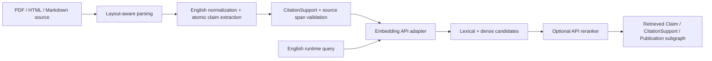

# API embedding、reranker 与科学文档切块决策

日期：2026-08-18  
范围：英文科学知识库、远程向量服务、候选重排、RAG → KG 入口

## 结论

本项目应同时保留两个 profile：

1. **可复现本地 profile**：继续使用固定 revision 的
   `BAAI/bge-small-en-v1.5`。它适合当前 20 条、每条约几十 token 的英文原子事实，也适合
   CPU 和离线 campaign。
2. **高质量 API profile**：首选 Qwen `text-embedding-v4`，以 1024 维、英文科学检索
   instruction、`text_type=query/document` 运行。Jina v5 text small 是主要 challenger；
   BGE-M3 和 E5 应通过自有/托管 TEI endpoint 使用，而不是假设存在“BAAI API”或“E5 API”。

不要仅凭公开 MTEB 总分替换生产模型。最终切换条件是同一项目数据集上的 Recall@K、MRR/nDCG、
hard-negative、no-answer false-positive、延迟、成本和索引稳定性共同通过。



## 模型与 API 的实际边界

| 选择 | 当前官方能力 | 本项目判断 |
|---|---|---|
| Qwen / DashScope `text-embedding-v4` | Qwen3-Embedding 系列；8,192 token；64–2,048 维；原生 API 支持 query/document 区分和英文 instruction；官方配套 `qwen3-rerank` | **默认 API profile**。中国区部署和配套 reranker 最完整；1024 维足够。模型别名由服务商管理，不能当作权重 commit |
| Open-weight Qwen3-Embedding | 0.6B/4B/8B，32K，上限维度 1024/2560/4096，支持 Matryoshka 和 instruction | 适合 TEI/HF dedicated endpoint；0.6B 仍明显慢于现有 33M 级 BGE small，不作为快速 CPU 默认 |
| Jina v5 text small | 677M，32K，1024 维，retrieval/text-matching 等 task adapter；Jina 原生 embedding API | **首要 challenger**。英文检索质量和 API task contract 很强；自托管权重为 CC BY-NC 4.0，商业使用需单独核对许可 |
| Jina v5 text nano | 239M，8K，768 维 | 比 small 更适合边缘/CPU challenger；仍需项目集实测，不能由厂商榜单直接替换 BGE small |
| BGE-M3 | 0.6B，8,192 token，1024 维，同时支持 dense、sparse、multi-vector | 适合自有 TEI/HF endpoint和未来 multilingual/hybrid；当前代码只消费 dense，不能把“支持 sparse/ColBERT”写成已接入能力 |
| BGE small en v1.5 | 英文、512 token、384 维、查询 instruction；小型 encoder | **本地 CPU 默认不变**。当前原子语料没有长上下文需求 |
| E5 base v2 | 约 0.1B、512 token、768 维；必须使用 `query:` / `passage:` | 可靠、轻量、MIT baseline，但不是前沿首选；短上下文且绝对 cosine 分数不可直接解释，阈值必须重标定 |
| multilingual-E5-large-instruct | 0.6B、512 token；query 需要自然语言任务 instruction | 多语言 baseline；对本项目英文短事实没有明显的成本优势 |

官方资料：

- [Alibaba Cloud text-embedding-v4 API](https://www.alibabacloud.com/help/en/model-studio/text-embedding-synchronous-api)
- [Alibaba Cloud qwen3-rerank API](https://help.aliyun.com/en/model-studio/rerank)
- [Qwen3 Embedding model family](https://github.com/QwenLM/Qwen3-Embedding)
- [Jina Embedding API and model matrix](https://jina.ai/en-US/embeddings/)
- [Jina v5 text small model card](https://huggingface.co/jinaai/jina-embeddings-v5-text-small)
- [BGE-M3 model card](https://huggingface.co/BAAI/bge-m3)
- [BGE reranker v2 M3 model card](https://huggingface.co/BAAI/bge-reranker-v2-m3)
- [E5 base v2 model card](https://huggingface.co/intfloat/e5-base-v2)
- [Hugging Face Text Embeddings Inference](https://github.com/huggingface/text-embeddings-inference)

## 已实现的抽象

`EmbeddingAPIConfig` 把下列信息放在独立 YAML 中：

- 托管协议 `provider` 与模型语义 `model_family` 分离；
- endpoint、环境变量 key placeholder、model、model/deployment revision；
- dimension、max input、batch、timeout、retry；
- query/document task、instruction、prefix；
- 可选的固定本地 tokenizer。

继承层级为：

```text
APIEmbeddingBackend
├── DashScopeEmbeddingBackend
├── JinaEmbeddingBackend
└── OpenAICompatibleEmbeddingBackend  (TEI / dedicated endpoint)

APIRerankerBackend
├── DashScopeRerankerBackend
├── JinaRerankerBackend
└── TEIRerankerBackend
```

API key 在 backend 初始化时从 `${ENV_VAR}` 解析，未设置即失败。模型 fingerprint 记录 endpoint
哈希但不记录 endpoint 原文或 key。每批返回值必须完整覆盖输入索引，并通过 shape、finite、nonzero
和 L2 normalization 检查。API 配置变化会改变 backend name/fingerprint，使既有向量索引触发重建。

远程 SaaS 的 `model_revision=provider-managed:*` 仍然不能证明权重未变化。生产上至少应保存供应商
公告日期、响应 model ID、项目评测结果，并在供应商升级后强制重建索引。需要严格 bit-level
可复现时，应使用固定 HF commit 的专属 TEI endpoint。

## 是否添加 reranker

代码已支持，但当前默认仍是 `reranker_backend: none`，原因如下：

- 当前语料只有 20 个原子 chunk，既有 8-query smoke benchmark 的 hybrid hit@3 为 1.00；
- reranker 增加一次远程调用、成本、尾延迟和新的阈值；
- reranker 会改变哪些 claim 被物化进 KG，因此错误重排不是单纯的展示顺序问题。

当语料扩大到论文摘要、方法段、表格说明或数千个原子事实，初检返回 20–100 个相关性混杂的候选
时，应启用 reranker。Alibaba 的官方说明也把 20–100+ 混合候选视为 reranking 价值较高的区间。

推荐顺序：

1. Qwen API profile：`text-embedding-v4` + `qwen3-rerank`。
2. Jina challenger：`jina-embeddings-v5-text-small` + `jina-reranker-v3`。
3. 自托管：BGE-M3 + `bge-reranker-v2-m3` through TEI。
4. E5 没有必须绑定的同家族 reranker，可使用 BGE/Jina cross-encoder，但必须重新评测。

上线前使用 source-level split 的 query set，至少报告 Recall@20、MRR@10/nDCG@10、最终 Precision@5、
no-answer AUROC/FPR、每种 `knowledge_type` 的表现、p50/p95 延迟和每千 query 成本。Qwen/Jina 的
0–1 relevance score 是模型内评分，不能假设跨模型或跨请求绝对可比；阈值必须在项目数据上校准。

## 前沿 embedding 是否取消 chunking

**不能取消。** 长 context 只降低“因为模型上限不得不切”的压力，不解决以下问题：

- 整篇论文的单向量会平均掉局部机制、条件和反例；
- RAG 需要可返回、可引用、可预算的最小证据单元；
- KG 需要稳定的 Claim、CitationSupport 和 Publication 边，而不是一整篇模糊文本；
- reranker 和远程 LLM 的成本仍随输入长度增长；
- 精确 citation locator、撤回单条错误事实和 leakage quarantine 都依赖细粒度单元。

当前 `scientific-atomic-claim:v1` 已经是语义 chunk：**一份 Markdown = 一个 claim = 一个 chunk**。
对这些文件不要再用 Unstructured、RAGFlow 或固定 token 窗口二次切分，只做模型 token 上限验证。

对于新进入系统的 PDF、DOCX、HTML 和复杂表格，应把 Unstructured/RAGFlow 放在上游 ingestion：

1. layout/OCR/table/heading extraction；
2. 保留 page、bbox、section、table/figure 和原 element provenance；
3. 在 section/paragraph/table row 边界形成候选 evidence span；
4. 从 span 提取英文原子 claim，并绑定 Publication/CitationSupport；
5. 通过 schema、来源和 prompt-injection 校验后才向量化。

Unstructured 的官方 chunker先 partition 为 document elements，再尽量保持完整 element；`by_title`
还会强制保留 section 边界。RAGFlow/DeepDoc 更适合需要 OCR、表格结构识别、版面分析和人工检查
chunk 的大型文档平台。当前项目已经有 corpus/overlay/KG/manifest，因此建议先接入轻量的
Unstructured/Docling parser adapter；只有在需要多人上传、可视化 chunk 干预、多租户数据集和完整
服务平台时再引入 RAGFlow。资料见 [Unstructured chunking](https://docs.unstructured.io/open-source/core-functionality/chunking)
与 [RAGFlow dataset parsing](https://github.com/infiniflow/ragflow/blob/main/docs/guides/dataset/configure_knowledge_base.md)。

Jina v3 的 late chunking 能在先编码长文后生成 chunk 表示，适合作为长文实验 profile，但它也不
替代 claim/citation 边界。当前 API adapter未声明 late chunking 支持，避免把未接入功能当成生产能力。

## Tokenizer 策略

embedding 模型必须使用训练时对应的 tokenizer；不能在 Qwen/BGE/Jina/E5 前随意换一个“更先进”
的 tokenizer。Unstructured/RAGFlow 负责文档结构解析，不负责替换模型 token IDs。

- 最严格方案：在 API config 指定与远程部署相同、固定 revision 的本地 tokenizer 路径；索引前
  精确计数，超限拒绝。
- 默认示例：使用 `conservative_utf8_bytes:v1`，按 UTF-8 byte 加 special-token margin 上界计数。
  它会过度保守，但不会像字符/空格估算那样把长输入静默送给 API 截断。
- API payload 显式设置 Jina `truncate=false`；其他 provider 也在发送前执行长度检查。

对于当前几十 token 的英文原子事实，保守计数不会影响 chunk 边界。对于长论文段落，生产配置应
下载并固定准确 tokenizer，同时由 parser 在语义边界切块。

## 配置与运行

示例位于 `configs/knowledge/api/`。默认 Qwen config 中的 key 是
`${DASHSCOPE_API_KEY}`，endpoint 中的 workspace ID 也是占位符，未替换时 backend 会立即失败。

```powershell
$env:DASHSCOPE_API_KEY = "<YOUR_API_KEY>"

.\.venv\Scripts\python.exe scripts\rag_api_embeddings.py probe `
  --embedding-config configs\knowledge\api\embedding.default-qwen.example.yaml `
  --prompt "Which evidence constrains high-order combinatorial variants?" `
  --document "Screening capacity limits the reliable evaluation of high-order libraries."

.\.venv\Scripts\python.exe scripts\rag_api_embeddings.py index `
  --experiment-config configs\experiments\knowledge_agent.yaml `
  --embedding-config configs\knowledge\api\embedding.default-qwen.example.yaml `
  --reranker-config configs\knowledge\api\reranker.qwen3.example.yaml `
  --index-path artifacts\local_knowledge\corpus\directed_evolution-qwen-v4.sqlite
```

未发表序列、实验结果或受许可限制的全文在发送到 SaaS 前还必须经过数据出境、保密和供应商留存
政策审查。若不允许外发，使用本地 BGE small 或内网 TEI endpoint。

## 验证状态

离线 contract tests 覆盖：

- DashScope query/document 的 `text_type` 与 instruction；
- Jina `retrieval.query` / `retrieval.passage` 和 `truncate=false`；
- TEI/OpenAI-compatible 的 E5 prefix 与响应索引顺序；
- API key placeholder、超长输入、维度/零向量/finite 校验；
- Jina reranker 将按相关度排序的响应恢复成原 document 顺序；
- provider 与 model family 分离并进入 fingerprint。

这些测试验证代码和 payload contract，不代表真实账号、配额、网络、模型质量或阈值已经通过。
首次生产启用仍需用真实 key 执行 `probe`、构建新索引，并跑同一 gold-query benchmark；不要覆盖本地
BGE 索引，以便 A/B 比较和回滚。
