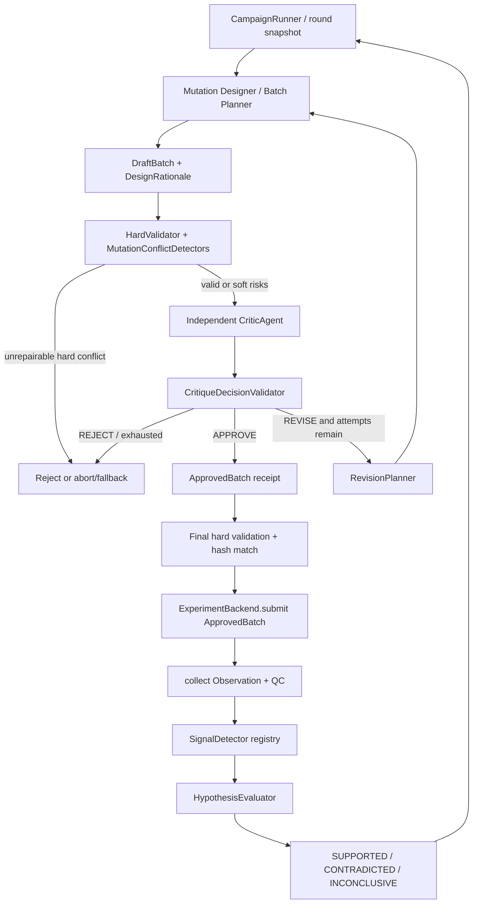

# Independent Scientific Critic、突变冲突检测与假设判定：代码改进 PLAN

## Material Passport

- Origin Skill: academic-research-suite / experiment-agent
- Origin Mode: plan
- Origin Date: 2026-08-15
- Verification Status: ANALYZED（已审计仓库、现有运行产物与相关一手资料；尚未实施本 PLAN）
- Version Label: critic_control_plan_v1
- Scope: `fitness-agents` 的 Critic 控制权、有限修订循环、突变冲突检测、falsification 与 LLM 角色边界

> 状态：Implementation-ready plan  
> 依赖文档：[开放式 Mutation Designer PLAN](./open-mutation-designer-plan.md) 与 [KG–LLM 交互策略](../KG-LLM交互策略优化与可插拔实现.md)  
> 非目标：本文件不直接修改运行时代码，不把系统改造成无边界的多 Agent 自由对话。

## 0. 执行结论

建议采用以下设计决策：

1. **把当前 `ScientistAgent.critique()` 拆掉。** 它位于 batch 已选定之后，只返回说明字符串，不能批准、修订或阻止提交；目标实现必须增加独立 `CriticAgent`、`CritiqueDecision` 和提交前的 Review Gateway。
2. **Critic 采用 manager-owned bounded specialist 模式。** `CampaignRunner` 始终拥有状态和最终控制权；Critic 是一个输入、工具和输出都受限的专门能力，不接管 campaign，也不直接调用实验 backend。
3. **提交对象由裸 `variant_ids` 升级为不可变的 `ApprovedBatch`。** 它绑定 draft hash、hard-validation receipt 和 Critic decision，避免 review 后替换候选的 TOCTOU 问题。
4. **修订循环默认最多 2 次。** `REVISE` 返回机器可执行的 `RequiredChange[]`，由 `RevisionPlanner` 调整约束、重新生成/重选、重新预测和重新验证；Critic 不直接手写最终序列。
5. **规则与 LLM 分权。** 规范氨基酸、参考残基、exact depth、重复、预算、已测/pending、引用存在性等由确定性验证器负责；证据冲突、机制外推、评估深度和 batch 科学性由 LLM Critic 负责。LLM 不能降低 hard error 的严重度。
6. **residue-level 与 sequence-level 冲突必须采用不同策略。** 前者主要是局部、离散、可确定验证的编辑冲突，应尽早拒绝或修复；后者包含完整背景、epistasis、OOD、结构/模型分歧和 batch 相互关系，必须对完整序列重新评估，不能由单残基分数相加推出。
7. **“解释”分成三种所有权。** Mutation Designer 只输出“为什么提出这个实验”的结构化 `DesignRationale`；Critic 输出“为什么批准/要求修改/拒绝”的独立 `CritiqueDecision`；实验后的最终科学解释由 Reporter 基于 `HypothesisAssessment` 生成。Designer 不能兼任最终解释者或审批者。
8. **Skill 可以定义审查视角，但不能成为控制边界。** 推荐把 evidence auditor、epistasis skeptic、batch design reviewer 和 falsification auditor 固化为版本化 Critic Profile，并可选镜像成 `SKILL.md` bundle；权限、schema、循环次数、hard gate 和状态转移必须继续由代码控制。
9. **不要把 `supported / contradicted / inconclusive` 放进预提交 `CritiqueDecision`。** 实验前 Critic 只能输出 `falsification_readiness`；实验结果回传后，由非 LLM `HypothesisEvaluator` 执行预注册规则并生成独立 `HypothesisAssessment`。
10. **把“避免事后合理化”实现为数据和时间边界。** 假设、比较对象、阈值、目标变换、信号检测器版本和判定策略在提交前冻结并哈希；实验后不能原地改写，只能创建 superseding hypothesis。

## 1. 当前代码审计与缺口

### 1.1 当前控制流

当前 `CampaignRunner` 的顺序是：

```text
predict
  -> generate hypothesis
  -> filter eligible candidates
  -> acquisition selects selected_ids
  -> ScientistAgent.critique() produces a string
  -> backend.submit(selected_ids)
  -> collect observations
```

已确认的具体缺口：

| 位置 | 当前行为 | 必须改变的原因 |
|---|---|---|
| `agents/scientist.py` | 只有一个 `ScientistAgent`；静态 `critique()` 返回固定格式字符串，`variant` 参数甚至不参与判断 | 没有独立视角，也没有控制权 |
| `loop/orchestrator.py` | `selected_ids` 先生成，`critique()` 只写入 `SelectionRecord.reason`，随后立即 `backend.submit()` | 典型事后说明，不是 approval gate |
| `contracts/schemas.py` | 没有 draft batch、review verdict、issue、required change、approval receipt 或 hypothesis assessment | 无法表达修订和审计状态 |
| `contracts/interfaces.py` | `LLMClient` 只有 `generate_hypothesis()`；`ExperimentBackend.submit()` 只收 ID | 无 Critic 协议，也无法强制“仅 approved batch 可提交” |
| `agents/llm.py` | 默认是规则化 mock；远程路径只有 hypothesis structured output | 当前默认实验不是独立 LLM Critic |
| `evaluation/scientific_thinking.py` | 主要检查字段存在、证据 ID 非空、parent ID 和干预下 batch 变化 | 规则系统可以形式化通过，不能证明真正审查或 falsification |
| `kg_interaction/*` | 已有 EvidencePack、counterevidence、bounded controller 和 proposal gateway，但明确未接入默认 Orchestrator | 可以复用，不应再造平行工具层 |
| `docs/open-mutation-designer-plan.md` | 已定义完整序列重评分、joint posterior 和 epistasis；尚未实现 | Critic 冲突检测应消费这些契约，而不是复制模型逻辑 |

### 1.2 当前 schema 的关键语义缺口

现有 `Hypothesis` 的 `expected_outcome` 与 `falsification_criterion` 都是自由文本。当前代码：

- 不记录用哪个 detector 执行判据；
- 不记录 comparator、effect threshold、目标变换、最小样本量和不确定性规则；
- 不区分“证据支持”与“统计上没有反驳”；
- 新 Observation 到来后不执行判据；
- 只通过 `parent_hypothesis_id` 判断“发生了更新”。

因此必须保留人类可读描述，但新增可执行、预注册的结构化 falsification contract。

## 2. 设计原则与调研结论

### 2.1 为什么采用外部反馈而不是纯自我反思

- [CRITIC](https://arxiv.org/abs/2305.11738) 的核心是让模型使用外部工具检查初始输出，再基于检查结果修订；这支持本项目将结构、KG、预测、冲突检测器作为 Critic 的外部证据源。
- [Self-Refine](https://papers.neurips.cc/paper_files/paper/2023/hash/91edff07232fb1b55a505a9e9f6c0ff3-Abstract-Conference.html) 说明有限反馈—修订循环可以改善一次性生成，但它并不证明同模型自审在科学任务中可靠。
- [Large Language Models Cannot Self-Correct Reasoning Yet](https://arxiv.org/abs/2310.01798) 报告了缺少外部反馈时自我纠错可能无效甚至退化。因此本 PLAN 不把“再问同一个 LLM 一遍”视为独立 Critic，而要求确定性 detector、独立 context 和证据查询。
- OpenAI 当前的 [orchestration guidance](https://developers.openai.com/api/docs/guides/agents/orchestration) 区分 handoff 与 manager-controlled specialist；本系统需要稳定外层状态机，适合后者。
- OpenAI [Structured Outputs](https://developers.openai.com/api/docs/guides/structured-outputs) 能约束 JSON schema，但 schema adherence 不等于领域语义正确；证据引用、hard gate、状态转移和数值阈值仍需本地验证。

### 2.2 为什么 residue 与 sequence 冲突不能混用一种检测器

蛋白突变效应依赖序列背景。GB1 的大规模单/双突变实验显示，组合效应可能偏离单点加和，并出现 sign epistasis；一些在 WT 背景中不利的突变会在其他背景中转为有利。参见 [Olson et al. 的 GB1 pairwise epistasis 研究](https://pmc.ncbi.nlm.nih.gov/articles/PMC4254498/) 以及 [Starr & Thornton 的综述](https://pmc.ncbi.nlm.nih.gov/articles/PMC4918427/)。

由此得到两个工程结论：

1. 局部编辑是否合法，通常可以只看 position、reference residue、allowed set 和编辑历史；
2. 组合是否冲突，必须看完整 sequence context、所用 fitness scale、完整序列 posterior、结构/进化证据和已测组合；缺少组合信息时应返回 `UNKNOWN`，不能默认无冲突。

### 2.3 解释责任的拆分

| 组件 | 可以解释什么 | 不可以做什么 |
|---|---|---|
| Mutation Designer | proposal 由哪个假设、约束、父本和 evidence 产生；计划检验什么 | 宣告 proposal 正确、忽略风险、批准自己的 batch |
| CriticAgent | draft 的证据缺口、冲突、OOD、batch 设计问题和必要修改 | 直接改预测值、直接写最终序列、读取 oracle、提交实验 |
| HardValidator | 可重复计算的合法性和安全约束 | 用自然语言猜测机制 |
| HypothesisEvaluator | 实验后执行预注册 detector，产生状态 | 修改预注册阈值、写科研叙事 |
| Reporter | 把设计、批评、结果与状态连接成可读说明 | 覆盖 detector 的状态或把 prediction 写成 observation |

## 3. 目标架构



### 3.1 控制权不变量

必须在代码中保证：

1. 没有 `ApprovedBatch` 就不能走到 backend；
2. `ApprovedBatch.batch_hash` 必须等于最终提交内容的 hash；
3. 任一 unresolved hard conflict 都覆盖 LLM 的 `APPROVE`；
4. Critic 不持有 backend 引用，也没有任意文件、SQL、Cypher 或 oracle 工具；
5. `REVISE` 必须产生新的 `draft_batch_id` 和 hash；旧 draft append-only；
6. 修订后的候选必须重新预测、重新取 evidence、重新做 hard validation；
7. 修订次数达到上限后不能静默批准；按配置中止本轮或执行明确记录的安全 fallback；
8. experiment collect 前不得生成 hypothesis outcome；collect 后不得修改 pre-registered falsification spec。

## 4. 新增领域契约

建议保留当前 dataclass science objects；对所有 LLM-facing contracts 使用 Pydantic v2 或等价的单一 schema 源，以避免“手写 JSON schema”和本地解析规则漂移。若引入 Pydantic，应把它作为核心依赖，因为 mock/rule Critic 同样需要本地验证，而不仅是远程 LLM 可选依赖。

### 4.1 Review 枚举

```python
class ReviewVerdict(str, Enum):
    APPROVE = "approve"
    REVISE = "revise"
    REJECT = "reject"

class IssueScope(str, Enum):
    RESIDUE = "residue"
    INTERACTION = "interaction"
    SEQUENCE = "sequence"
    BATCH = "batch"
    EVIDENCE = "evidence"
    HYPOTHESIS = "hypothesis"
    SYSTEM = "system"

class IssueSeverity(str, Enum):
    INFO = "info"
    WARNING = "warning"
    ERROR = "error"
    BLOCKER = "blocker"

class FalsificationReadiness(str, Enum):
    READY = "ready"
    NEEDS_REVISION = "needs_revision"
    UNTESTABLE = "untestable"
```

`ERROR/BLOCKER` 是否属于 hard conflict 由 detector 类型和配置决定，不能由 LLM 自己降级。

### 4.2 DraftBatch 与不可变提交凭证

```python
class DraftBatch(BaseModel):
    draft_batch_id: str
    parent_draft_batch_id: str | None
    round_id: int
    review_attempt: int
    candidate_ids: tuple[str, ...]
    hypothesis_ids: tuple[str, ...]
    prediction_snapshot_id: str
    evidence_snapshot_id: str
    acquisition_snapshot_id: str
    design_rationales: tuple[DesignRationale, ...]
    batch_hash: str

class ApprovedBatch(BaseModel):
    draft_batch_id: str
    round_id: int
    candidate_ids: tuple[str, ...]
    batch_hash: str
    hard_validation_report_id: str
    critique_decision_id: str
    approval_policy_version: str
```

`batch_hash` 至少覆盖：有序 candidate IDs、完整 sequence/edits、round、prediction/evidence snapshot IDs、hypothesis/falsification versions。这样 review 后不能只保留 decision ID 而替换内容。

### 4.3 CritiqueDecision

在用户给出的字段基础上，建议补齐可执行关联字段：

```text
CritiqueDecision
├─ decision_id
├─ draft_batch_id
├─ round_id
├─ review_attempt
├─ verdict: APPROVE | REVISE | REJECT
├─ falsification_readiness: READY | NEEDS_REVISION | UNTESTABLE
├─ candidate_issues[]
│  ├─ issue_id, candidate_id, scope, severity, code
│  ├─ claim, evidence_ids[], conflict_ids[]
│  └─ suggested_action
├─ batch_level_risks[]
├─ evidence_conflicts[]
│  ├─ topic, supporting_ids[], opposing_ids[]
│  ├─ source_independence, unresolved_reason
│  └─ impact
├─ unsupported_claims[]
│  ├─ claim_id, reason, missing_evidence_type
│  └─ required_action
├─ required_changes[]
│  ├─ action, target_ids[], parameters
│  ├─ rationale, evidence_ids[]
│  └─ priority
├─ cited_evidence_ids[]
├─ confidence
└─ summary
```

推荐的 `RequiredChange.action` 枚举：

- `EXCLUDE_CANDIDATE`
- `REPLACE_CANDIDATE`
- `REQUEST_EVIDENCE`
- `ADD_COUNTEREVIDENCE_SEARCH`
- `ADD_CONTROL`
- `INCREASE_DIVERSITY`
- `ADD_EXPLORATION_QUOTA`
- `REDUCE_MUTATION_DEPTH`
- `RELAX_SOFT_PRIOR`
- `REGENERATE_WITH_CONSTRAINTS`
- `MAKE_FALSIFICATION_EXECUTABLE`
- `ABORT_ROUND`

自由文本 `required_changes` 无法稳定驱动程序，不应作为唯一字段。

### 4.4 DecisionValidator 语义规则

Structured Outputs 只保证形状；本地 `CritiqueDecisionValidator` 还必须检查：

- `draft_batch_id/round_id/review_attempt` 与当前请求一致；
- candidate、conflict、evidence、hypothesis IDs 都属于输入快照；
- `APPROVE` 时没有未解决 hard conflict；
- `APPROVE` 时 `required_changes` 为空且 falsification 是 `READY`；
- `REVISE` 至少包含一个机器可执行 change；
- `REJECT` 包含 blocker、不可修复原因或明确 `ABORT_ROUND`；
- 所有引用都存在且在当前轮可见；
- confidence 在 `[0, 1]`，但不能覆盖规则 verdict；
- refusal、截断、空输出、未知 enum、额外字段和语义冲突都进入 retry/fallback，而不是隐式批准。

### 4.5 ReviewAttempt 与审计

每次审查保存：

```text
ReviewAttempt
  run_id, round_id, attempt
  input draft/evidence/prediction/conflict hashes
  critic provider/model/profile/skill version
  prompt template/hash
  tool calls and query receipts
  raw response hash
  parsed decision
  schema/semantic validation result
  retry count, tokens, latency, cost
  resulting draft or terminal action
```

不要保存隐藏 chain-of-thought；只保存结构化结论、简短 rationale 和外部证据引用。

## 5. CriticAgent 的独立性设计

### 5.1 独立性不等于换一个类名

MVP 至少满足：

- 独立 `CriticAgent` 类和独立 `CriticClient` protocol；
- 与 Hypothesis Generator 分开的 system prompt、profile version、temperature 和 trace；
- 不共享 Designer 的可变对话历史；
- 输入来自冻结的 artifact snapshot，而不是 Designer 临场讲述；
- 只读工具白名单：`explain_variant`、`compare_variants`、`find_counterevidence`、`get_history`、结构/进化检索；
- 无 backend、oracle、任意 shell/数据库写入权限；
- 默认只看结构化 `DesignRationale`，不接收长篇说服性文案或隐藏推理过程；
- 可以使用同一基础模型作为成本基线，但必须与不同模型/规则 Critic 做消融，不能把“同模型不同 prompt”宣传成完全独立判断。

### 5.2 是否增加 Skill

结论是：**可以增加，但应将其定位为版本化审查方法，不是安全或状态机实现。**

OpenAI 的 [Skills](https://developers.openai.com/api/docs/guides/tools-skills) 是可版本化的指令与文件 bundle，适合固化领域 rubric、工具说明和示例。当前仓库的 `OpenAICompatibleLLMClient` 尚未装载 Skill，因此单独新建 `SKILL.md` 不会自动改变运行时行为。

建议两阶段实现：

1. 先增加 provider-neutral `CriticProfile`：

```text
src/fitness_agents/agents/critic_profiles/scientific_v1/
  profile.md
  rubric.yaml
  decision_examples.jsonl
  version.json
```

2. 若以后使用支持 Skill 的 hosted runtime，再镜像为：

```text
skills/scientific-critic/
  SKILL.md
  references/evidence-audit.md
  references/epistasis-review.md
  references/batch-design.md
  references/falsification.md
```

每次调用记录 `profile_hash`，使用 hosted Skill 时额外记录 `skill_id/version`。无论是否使用 Skill，输出仍必须经过同一 `CritiqueDecisionValidator`。

### 5.3 推荐的四个审查视角

不必默认启动四个自由对话 Agent；一个 Critic 可以按固定顺序执行四个 review lenses：

1. **Evidence Auditor**：引用是否存在、来源是否独立、支持与反证是否对称、是否越过 assay/background 范围；
2. **Epistasis Skeptic**：是否把 residue-level 偏好错误外推到组合、是否缺少完整序列重评分、是否有 sign/reciprocal sign epistasis 风险；
3. **Batch Design Reviewer**：exploitation/exploration/control/diversity 配额、mode collapse、过高 OOD、候选间冗余；
4. **Falsification Auditor**：假设是否有可执行 detector、明确 comparator/threshold/缺失数据规则，以及本 batch 是否真的能检验它。

高风险运行可把四个 lens 变成独立调用再确定性合并；默认先使用单调用、分节输出，控制成本。

## 6. 有上限的 revise loop

### 6.1 推荐伪代码

```python
draft = batch_planner.create_draft(round_context)

for attempt in range(critic.max_revision_attempts + 1):
    hard_report = hard_validator.validate(draft, round_context)
    write(hard_report)

    if hard_report.has_unrepairable_blocker:
        return rejection_policy.handle(draft, hard_report)

    if hard_report.has_repairable_errors:
        if attempt == critic.max_revision_attempts:
            return exhaustion_policy.handle(draft, hard_report)
        directive = revision_policy.from_hard_report(hard_report)
        draft = revision_planner.revise(draft, directive, round_context)
        continue

    decision = critic.review(
        draft=draft,
        validation=hard_report,
        context=critic_context_builder.build(round_context),
    )
    decision = decision_validator.validate(decision, draft, hard_report)
    write(decision)

    if decision.verdict is APPROVE:
        approved = approval_gateway.issue(draft, hard_report, decision)
        break

    if decision.verdict is REVISE and attempt < critic.max_revision_attempts:
        draft = revision_planner.revise(draft, decision.required_changes, round_context)
        continue

    return rejection_or_exhaustion_policy.handle(draft, decision)

final_report = hard_validator.validate(approved, round_context)
approval_gateway.assert_unchanged(approved, final_report)
experiment_id = backend.submit(approved, round_id)
```

### 6.2 RevisionPlanner 的权限

`RevisionPlanner` 可以：

- 从 eligible/search set 中排除指定 candidate；
- 增加 soft/hard constraint 后重新调用 Mutation Designer；
- 调整 exploration、control、diversity 配额；
- 请求 KG/structure/evolution/counterevidence 后重新生成 evidence snapshot；
- 对新增或改变的完整序列重新调用 predictor；
- 重新运行 acquisition 和 batch selector。

它不能：

- 修改 predictor 的原始输出；
- 手工伪造 evidence；
- 改写已经冻结的 observation；
- 为了凑满预算而静默降低 hard constraints；
- 在看过同轮 oracle 结果后继续修改 draft。

### 6.3 终止与 fallback

建议配置：

```yaml
critic:
  enabled: true
  mode: rule_then_llm          # off | rule_only | rule_then_llm
  max_revision_attempts: 2
  on_reject: abort_round       # abort_round | deterministic_fallback
  on_exhausted: abort_round
  fallback_policy: fitness_direct
  require_counterevidence_search: true
  rationale_visibility: structured_claims_only
```

- 真实实验默认 `abort_round`，需要人工处理；
- 离线 benchmark 可显式使用 deterministic fallback，但报告必须标记 `critic_fallback_used=true`；
- fallback 也必须通过 hard validation，且不能伪造 `APPROVE` decision；
- 空有效 batch 应明确结束本轮，不能自动提交低质量填充项。

## 7. 两级突变冲突检测

### 7.1 统一冲突对象

```text
MutationConflict
  conflict_id
  scope: RESIDUE | INTERACTION | SEQUENCE | BATCH
  code
  severity
  is_hard
  proposal_id / candidate_id
  positions[]
  detector_name/version
  observed_values{}
  threshold/config_version
  evidence_ids[]
  message
  suggested_action
```

`HardValidationReport` 汇总所有确定性冲突；LLM 只能引用它，不能删除或改级。所有 detector 在缺少输入时返回 `NOT_APPLICABLE` 或 `UNKNOWN`，不能把缺失等价为通过。

### 7.2 Residue-level 检测：局部、早期、确定性优先

| 冲突 | 检测方式 | 默认处理 |
|---|---|---|
| 非规范氨基酸、self substitution | canonical AA set 与 `from != to` | hard reject |
| `from_residue` 与 reference/parent 不一致 | 从固定 reference/parent 重放 edits | hard reject |
| 同一 proposal 对同一位置多次给出不同目标残基 | position-keyed edit map | hard reject；禁止用“最后一个覆盖”修复 |
| position 不在允许集合 | task/designer config | hard reject |
| mutation depth 与 single/double/multi 不一致 | 相对固定 reference 重算 Hamming/edit count | hard reject |
| residue 属于显式 forbidden/immutable set | versioned task constraint | hard reject |
| 违反可自动 repair 的 allowed-residue constraint | constraint engine | REVISE，并回到 proposer |
| conservation、结构或知识对某 residue 给出相反方向 | 按同一 assay/background/scope 聚合 Evidence polarity | soft evidence conflict，交给 Critic |
| 低支持 residue preference 被当成硬规则 | 比较 support count/source groups 与 policy | REVISE，降为 soft prior |

Residue-level detector 不判断多突变 fitness，也不根据一个位置的“beneficial”标签批准完整序列。

### 7.3 Sequence-level 检测：完整背景与联合模型

| 冲突/风险 | 检测方式 | 默认处理 |
|---|---|---|
| 完整序列无法由 reference + edits 重建、长度变化 | canonical reconstruction | hard reject |
| 重复、已测、pending、同批重复 | stable sequence ID + campaign state | hard reject |
| 模型与结构/PLM/进化信号方向冲突 | component score/evidence polarity comparison | soft conflict；要求披露或 REVISE |
| 高 mean 同时高 OOD/未校准 uncertainty | task-calibrated thresholds | batch risk；增加 control/exploration 或 defer |
| 完整组合 posterior 与单点加和强烈不一致 | epistasis detector | interaction conflict/risk |
| sign/reciprocal sign epistasis | 比较同一 mutation 在不同 background 的效应符号 | 禁止使用单点外推；完整序列重评估 |
| 结构 clash、关键 motif/界面/二硫键/糖基化约束 | task-specific structure/motif detectors | 显式 hard constraint 才 hard reject；否则 warning |
| predictor components 强烈分歧 | rank/sign disagreement、posterior diagnostic | high uncertainty；不能静默平均掉 |
| batch mode collapse | sequence/embedding/lineage distance 与 quota | REVISE batch |
| batch 无法检验 hypothesis | planned contrasts/controls coverage | falsification `NEEDS_REVISION` |

Sequence-level 的输入必须是完整 sequence，而不是 residue preference 列表。开放式 Designer 实现后直接消费 `SequenceProposal.edits_from_reference`；在当前 closed-pool 兼容期，通过 `MutationViewAdapter` 从 `Variant.variant`、`wild_type_sites` 和 `mutable_positions` 重建统一视图。

### 7.4 Epistasis 的检测语义

首先固定目标尺度 `g(fitness)` 和 null model。epistasis 对尺度敏感，不能在未声明的 raw、ratio、log 或 normalized fitness 间混用。建议在 `TaskConfig` 增加：

```yaml
fitness_semantics:
  scale: raw                  # raw | log | normalized | custom
  transform_version: identity_v1
  epistasis_null_model: additive_on_transformed_scale
```

双突变：

```text
epsilon_ab = g(f_ab) - g(f_a) - g(f_b) + g(f_wt)

delta_a_wt = g(f_a) - g(f_wt)
delta_a_given_b = g(f_ab) - g(f_b)
```

- `sign(delta_a_wt) != sign(delta_a_given_b)` 表示 mutation A 对 B background 存在 sign epistasis；
- A、B 两个方向都翻转才是 reciprocal sign epistasis；
- 三突变使用 inclusion–exclusion 分解，但最终选择仍使用完整 sequence posterior；
- 预测期从 joint posterior samples 计算 epsilon 分布和 sign-flip probability，不能把边际 std 当独立量相加；
- 实验期优先使用真实 WT、single、combination observation；缺少必要 constituent 或 QC 不通过时输出 `UNKNOWN/INCONCLUSIVE`；
- `epsilon` 是诊断量，不是直接的 hard reject 规则。强负 epistasis 可以触发 REVISE/defer，但仍需结合目标、uncertainty 和实验探索价值。

### 7.5 冲突聚合策略

建议使用确定性的 verdict lattice：

```text
unresolved BLOCKER/HARD ERROR -> REJECT
repairable HARD ERROR         -> REVISE
soft conflict + missing test  -> REVISE
soft conflict but explicitly covered by controls/exploration -> Critic may APPROVE with risk
no conflict and falsification READY -> APPROVE candidate/batch
missing detector input        -> UNKNOWN, never auto-pass
```

Critic 的 confidence 只用于后续 calibration，不参与覆盖该 lattice。

## 8. 避免事后合理化的机制

### 8.1 Pre-registration

在 `backend.submit()` 前冻结：

- hypothesis version 与 statement；
- expected outcome；
- candidate/test/control IDs；
- comparator；
- metric、aggregation、direction、effect threshold；
- fitness transform/null model；
- min observations/replicates、QC 要求；
- uncertainty/CI 或 posterior probability 规则；
- missing-data 与 conflicting-signal policy；
- detector/version；
- Critic decision、draft/approved batch hash。

生成 `FalsificationSpec.pre_registration_hash`。collect 后对任何这些字段的修改都必须失败；修订只能创建新 hypothesis version，且新版本不能追溯替换旧实验的判据。

### 8.2 输入盲化与理由分离

- Designer 不向 Critic传递隐藏思维过程；只传 proposal lineage、结构化 claim、evidence IDs 和 intended test；
- Critic 首先审查 candidate facts、predictions、conflicts、evidence 和 batch composition；
- `unsupported_claims` 审计针对结构化 claim，不让流畅 prose 成为批准理由；
- Critic decision 在实验结果可见前写入 append-only trace；
- Reporter 只能引用原 decision 与 assessment，不得把后来发现的理由写成当时已知理由；
- 增加 rationale perturbation test：只改 Designer 文案、不改结构化事实时，hard validation 和主要 Critic verdict 不应系统性漂移。

### 8.3 Evidence 防自证循环

- LLM 生成的 claim/hypothesis 不能被计作支持自身的独立 evidence；
- evidence 按 source group 去重，同一原始实验被多个数据库转载不能重复增信；
- supporting 与 opposing evidence 分字段保存；
- `counterevidence_search_performed` 必须显式；“没有找到”与“没有搜索”不能混淆；
- fabricated/stale/out-of-round evidence ID 由本地 validator 拒绝；
- evidence statement 视为不可信数据，不能携带改变工具权限或系统 prompt 的指令。

## 9. Falsification 与下游信号检测

### 9.1 实验前与实验后必须拆成两个对象

预提交 Critic 无法知道实验结果，因此：

- `CritiqueDecision.falsification_readiness` 只判断判据是否可执行、当前 batch 是否包含必要对照；
- `HypothesisAssessment.status` 在 collect 后由确定性 evaluator 产生。

推荐 lifecycle：

```text
PROPOSED
  -> TEST_READY
  -> TESTING
  -> SUPPORTED | CONTRADICTED | INCONCLUSIVE
  -> SUPERSEDED（可选，由新 hypothesis 版本取代）
```

`SUPPORTED` 的语义必须是“受当前可见证据支持”，不是“已证明”。

### 9.2 FalsificationSpec

```text
FalsificationSpec
  spec_id, hypothesis_id, version
  registered_at_round, pre_registration_hash
  criteria[]
    criterion_id
    detector_name/version
    target_variant_ids[] / cohort_rule
    comparator_variant_ids[] / comparator_rule
    metric, aggregation, fitness_transform
    expected_direction
    support_threshold
    contradiction_threshold
    min_observations / min_replicates
    confidence_level / posterior_probability
    qc_requirements[]
    missing_data_policy = INCONCLUSIVE
    primary: bool
  reduction_policy/version
  human_readable_description
```

不能只提供一句“若 batch median 没提高则反驳”。至少要明确 median 相对谁、提高多少、最少多少 observation、数据缺失怎么办，以及 fitness 在什么尺度上比较。

### 9.3 SignalDetector registry

建议在 `evaluation/signals.py` 增加：

```python
class SignalDetector(Protocol):
    name: str
    version: str

    def evaluate(
        self,
        criterion: FalsificationCriterion,
        observations: Sequence[FitnessObservation],
        context: EvaluationContext,
    ) -> CriterionResult: ...
```

首批 detector：

| Detector | 用途 | 必要输入 |
|---|---|---|
| `ThresholdDetector` | 单候选是否跨过预注册阈值 | target observation、阈值 |
| `DirectionDetector` | 相对 WT/parent/control 的方向 | target + comparator |
| `BatchMedianLiftDetector` | batch 相对预注册 baseline 的整体提升 | batch + baseline；必要时 bootstrap/noise model |
| `MatchedVariantContrastDetector` | preferred-residue 与 matched alternative 比较 | 预注册配对/匹配规则 |
| `ResiduePreferenceDetector` | 某 residue 在受控 background 中是否表现一致 | 多个 matched backgrounds |
| `EpistasisSignalDetector` | epsilon/sign/reciprocal sign epistasis | WT、singles、combination；明确 scale |
| `ConflictResolutionDetector` | 结构/模型冲突是否被实验结果区分 | competing predictions + observations |

每个 detector 返回：

```text
CriterionResult
  criterion_id
  signal: SUPPORT | CONTRADICT | UNRESOLVED
  metric_value, comparator_value, effect_size
  uncertainty_interval / posterior_probability
  observation_ids[]
  qc_status
  detector_name/version
  reason_code
```

没有 replicate 或可靠 noise model 时不得伪造置信区间。当前单值 GB1 benchmark 可以执行明确的 point-threshold 判据，但 assessment 必须标记 evidence quality；需要统计置信结论的规则应返回 `UNRESOLVED`。

### 9.4 HypothesisEvaluator reduction policy

默认保守策略：

```text
any decisive primary CONTRADICT -> CONTRADICTED
all required primary SUPPORT and no decisive contradiction -> SUPPORTED
otherwise -> INCONCLUSIVE
```

输出：

```text
HypothesisAssessment
  assessment_id
  hypothesis_id, falsification_spec_id
  round_id
  status: SUPPORTED | CONTRADICTED | INCONCLUSIVE
  criterion_results[]
  observation_ids[]
  decisive_criterion_ids[]
  unresolved_criterion_ids[]
  evaluator_version
  assessment_hash
  assessed_at
```

Assessment append-only 写入 state/KG；LLM 可随后生成 interpretation，但不能修改 status。下一轮 Hypothesis Generator 必须接收 assessment，而不只是 `previous_hypothesis_id`。

## 10. 配置设计

建议新增 `CriticConfig`：

```yaml
critic:
  enabled: true
  mode: rule_then_llm
  provider: openai
  model: null                    # null 表示使用环境默认，但实际 model 必须写入 trace
  temperature: 0.0
  max_revision_attempts: 2
  max_model_retries: 2
  on_reject: abort_round
  on_exhausted: abort_round
  fallback_policy: fitness_direct
  require_counterevidence_search: true
  rationale_visibility: structured_claims_only
  profile: scientific_v1
  review_lenses:
    - evidence_audit
    - epistasis_skeptic
    - batch_design
    - falsification
  hard_validation:
    require_unique_sequences: true
    forbid_observed: true
    forbid_pending: true
    require_exact_depth: true
    require_valid_evidence_ids: true
  soft_risk:
    ood_warning_threshold: task_calibrated
    min_batch_distance: task_calibrated
    model_disagreement_threshold: task_calibrated
```

不要在通用默认配置中写一个未经校准的固定 OOD/epistasis 阈值。阈值属于 task/model calibration artifact，并记录版本。

## 11. 按文件实施清单

| 文件/模块 | 计划变更 |
|---|---|
| `contracts/schemas.py` | 新增 review、issue、conflict、draft/approved batch、falsification、criterion result、assessment 枚举与对象；扩展 CampaignState 记录 review/assessment IDs |
| `contracts/interfaces.py` | 新增 `CriticClient`、`BatchValidator`、`MutationConflictDetector`、`RevisionPlanner`、`SignalDetector`、`HypothesisEvaluator`；逐步把 backend submit 改为 `ApprovedBatch` |
| `agents/critic.py` | 独立 `CriticAgent`、context builder、tool allow-list、mock/rule/remote adapters |
| `agents/critic_profiles/*` | 版本化 rubric、prompt、examples、hash；可选 Skill adapter |
| `agents/llm.py` | 将 hypothesis 与 critique 客户端接口拆开；使用严格 structured output、本地语义校验、refusal/截断/retry/fallback |
| `validation/batch.py` | hard validation、decision validation、approval gateway、batch hash/TOCTOU 校验 |
| `mutation/conflicts.py` | residue、interaction、sequence、batch detectors 与统一 ConflictReport |
| `mutation/adapters.py` | 当前 closed-pool `Variant` 到统一 MutationView；未来 `SequenceProposal` 直接适配 |
| `loop/review.py` | 有界 review/revision loop，终止和 fallback policy |
| `loop/orchestrator.py` | 在 `backend.submit()` 前调用 review loop；collect 后调用 HypothesisEvaluator；增加明确 phase/event |
| `loop/backends.py` | 增加 approval-enforcing adapter；最终让 submit 接受 `ApprovedBatch`/sequence proposal，而非裸 ID |
| `evaluation/signals.py` | detector registry 与首批 deterministic signal detectors |
| `evaluation/hypotheses.py` | pre-registration freeze、assessment reduction、append-only status history |
| `kg_interaction/operators.py` | 接入 `find_counterevidence/get_history`；Critic 复用 EvidencePack，不新增任意查询旁路 |
| `kg_interaction/writeback.py` | HypothesisAssessment/状态变更 proposal 验证；Observation 仍只允许 backend 写入 |
| `config.py` + `configs/critic/*.yaml` | `CriticConfig`、conflict profiles、falsification policies、校验规则 |
| `utils/artifacts.py` | `draft_batch.json`、`hard_validation.json`、`critique_attempt_*.json`、`approved_batch.json`、`hypothesis_assessment.json` |
| `evaluation/scientific_thinking.py` | 从字段存在性升级为 veto/revision/falsification/引用语义和行为效用指标 |
| `README.md` | 明确 mock、rule-only、LLM Critic 的区别和真实控制权 |

### 11.1 建议增加的 Campaign phase/event

可扩展 `CampaignPhase`，或增加单独 `ReviewPhase`，至少要能追踪：

```text
DRAFTED
HARD_VALIDATED
CRITIQUE_REQUESTED
REVISION_REQUESTED
APPROVED
SUBMITTED
MEASURED
HYPOTHESIS_EVALUATED
ROUND_ABORTED
```

事件至少包括：

- `batch_drafted`
- `hard_validation_completed`
- `critique_completed`
- `batch_revised`
- `batch_approved`
- `critic_fallback_used`
- `round_aborted`
- `falsification_registered`
- `hypothesis_assessed`

## 12. 测试计划

### 12.1 Unit tests

- `CritiqueDecision` enum、extra field、非法 ID、空 required change、confidence 范围；
- LLM 返回 `APPROVE` 但存在 hard conflict 时，DecisionValidator 强制拒绝；
- 同一 position 两个目标 residue 被 hard reject；
- `from_residue` 与 reference/parent 不符；
- exact-depth、invalid AA、allowed/forbidden position；
- 重复、observed、pending 和 batch duplicate；
- residue evidence polarity conflict 保留正反证，不静默平均；
- additive、positive/negative、sign、reciprocal sign epistasis synthetic fixtures；
- 缺 WT/single/combination 时 epistasis 返回 UNKNOWN；
- joint covariance sampling 与错误的 independent-std 实现可被测试区分；
- supported、contradicted、inconclusive 三类 detector/reduction fixture；
- collect 后修改 falsification spec 被拒绝；
- assessment append-only，supersession 不覆盖旧记录。

### 12.2 Integration tests

1. `APPROVE`：backend 恰好 submit 一次，提交 hash 与 reviewed draft 一致；
2. `REVISE`：第一次 draft 不提交，第二次 candidate set/hash 变化并重新预测/验证；
3. `REJECT`：backend submit 次数为 0；
4. loop exhaustion：严格停在配置上限，执行明确 abort/fallback；
5. Critic timeout/schema failure：最多结构化重试 2 次，再进入配置的 rule fallback；
6. fake/stale evidence ID：本地拒绝，不进入 backend；
7. review 后篡改 candidate：approval hash 校验失败；
8. hidden oracle labels 不进入 Critic context、trace、error 或 Skill/Profile 输入；
9. 新 Observation 只影响 collect 后的 assessment 和下一轮，不反向改变已存 decision；
10. closed-pool legacy 关闭 Critic 时结果与当前 baseline 完全一致。

### 12.3 Anti-rationalization tests

- 保持结构化事实不变，只替换 Designer 的流畅文案；hard verdict 不变，LLM verdict 漂移率被记录；
- 给 selected candidate 注入看似可信但无 evidence ID 的理由，必须进入 `unsupported_claims`；
- 给 preferred residue 提供与 KG/observations 冲突的文本，Critic 必须列出 opposing IDs 或要求 counterevidence；
- 把高 model mean 与高 OOD 同时注入，Critic 不能只复述 mean；
- 在实验结果揭示后尝试放宽 threshold，pre-registration hash 必须阻止；
- Reporter 生成文本不能改变 HypothesisAssessment status。

### 12.4 Security/leakage tests

- Evidence statement 中包含 prompt injection 指令时仍只被当作数据；
- Critic 的工具参数拒绝 `sql/cypher/sparql/oracle/final_test/raw_fitness`；
- out-of-round Observation/Evidence 被拒绝；
- Critic 不能调用 backend、打开 final test 或写 Observation；
- hosted Skill/Profile 中不包含 API key、oracle path 或隐藏 variant IDs。

## 13. 评估与消融

### 13.1 最低对照组

在相同 dataset split、seed、predictor、candidate/search budget、acquisition 和实验预算下比较：

1. no Critic；
2. deterministic hard validator only；
3. current-style rule explanation；
4. same-model independent-prompt Critic；
5. independent-model Critic；
6. Critic without counterevidence；
7. Critic without sequence-level detector；
8. one vs two revision attempts。

只有 Critic 相对 hard-validator baseline 带来可重复的行为或发现效率增益，才能声称 LLM Critic 有独立价值。

### 13.2 指标

| 维度 | 指标 |
|---|---|
| 控制权 | veto rate、revision rate、backend prevented-submit count、approval hash violations |
| 审查质量 | injected-conflict recall、false veto rate、unsupported-claim precision/recall、fabricated citation rate |
| 修订效用 | revision success rate、draft-to-approved batch change、修订后 invalid/risk reduction |
| 科学设计 | counterevidence coverage、control coverage、falsification readiness、hypothesis assessment completion |
| 突变冲突 | residue conflict recall、sequence conflict recall、sign-epistasis detection、UNKNOWN calibration |
| 优化结果 | best-so-far、simple regret、hit rate、query efficiency；必须同时报告 Critic 过度保守造成的机会损失 |
| 稳定性 | paired-seed verdict agreement、rationale perturbation sensitivity、provider/model drift |
| 工程 | token、latency、cost、tool calls、retry/fallback/exhaustion rate |

OpenAI 当前建议通过完整 trace 与结构化 graders 定位工作流错误；参见 [agent workflow evaluation guidance](https://developers.openai.com/api/docs/guides/agent-evals)。本项目仍应以本地可重复 evaluator 为主，外部 LLM grader 只能作为辅助信号。

## 14. 分阶段 PR 计划

### PR-1 — Review 与 falsification contracts

交付：所有 enum/schema、semantic validators、artifact serialization、config skeleton。

退出条件：

- schema 有唯一生成源，严格拒绝 extra/unknown fields；
- mock objects 可离线 round-trip；
- 当前 `Hypothesis` 可通过 adapter 产生 legacy `FalsificationSpec`，但标记 `non_executable_legacy`；
- 关闭新功能时现有测试不回归。

### PR-2 — Hard validation、两级基础冲突与 approval receipt

交付：residue/sequence deterministic validators、ConflictReport、DraftBatch/ApprovedBatch hash、approval-enforcing backend adapter。

退出条件：

- invalid/duplicate/observed/pending/exact-depth 错误无法到达 backend；
- review 后篡改 batch 被拒绝；
- closed-pool 与未来 open-design 共用 MutationView。

### PR-3 — Independent CriticAgent 与 bounded revise loop

交付：rule/mock Critic、DecisionValidator、RevisionPlanner、最多两次循环、abort/fallback policy。

退出条件：

- APPROVE/REVISE/REJECT 三条 integration path 全部通过；
- REVISE 后重新预测、取证和验证；
- REJECT/loop exhaustion 不提交；
- trace 能完整重放每次 draft 和 decision。

### PR-4 — Remote LLM Critic 与 Critic Profile/Skill adapter

交付：独立 provider/model 配置、structured output、refusal/timeout/retry、profile hash、只读 tools；可选 hosted Skill adapter。

退出条件：

- 所有 remote 输出通过本地语义验证；
- model/profile/prompt/schema/tool/token/cost 均可追踪；
- remote failure 按配置进入 rule fallback，不能 fail-open；
- 同模型与独立模型 Critic 可直接消融。

### PR-5 — Sequence-context、epistasis 与 evidence conflict

交付：完整序列重评分接口适配、model/evidence disagreement、joint epistasis detector、batch risk 与 counterevidence 查询。

退出条件：

- synthetic sign/reciprocal sign fixtures 全部识别；
- 缺 constituent 时输出 UNKNOWN；
- 多突变排序不使用单点简单相加；
- detector 使用明确 fitness scale 与 model version。

### PR-6 — Falsification signal chain 与动态 Hypothesis 状态

交付：pre-registration、SignalDetector registry、HypothesisEvaluator、Assessment 写入 state/KG、下一轮 context。

退出条件：

- supported/contradicted/inconclusive 都能由固定 fixture 产生；
- 每个状态可追溯到 criterion、observation 和 evaluator version；
- LLM 只能解释状态，不能改状态；
- 新假设通过 `SUPERSEDES` 创建版本，不覆盖历史。

### PR-7 — 行为评估、消融与文档迁移

交付：Critic metrics、anti-rationalization suite、paired-seed ablation、README/配置迁移。

退出条件：

- 能区分 no Critic、hard validator、rule Critic 和 LLM Critic；
- 报告 false veto 与机会损失，不只报告发现的问题数；
- 默认配置清楚标记 mock/rule/remote 模式；
- 不再将规则说明器描述为完整 Scientific Critic。

## 15. 主要风险与缓解

| 风险 | 后果 | 缓解 |
|---|---|---|
| Critic 过度保守 | 排除高风险但可能高收益的 sign-epistatic 组合 | exploration quota、soft risk 不自动 hard reject、报告 false veto/opportunity cost |
| 同模型错误相关 | Designer 与 Critic 互相附和 | 独立 context、外部 detectors、counterevidence、不同模型消融 |
| LLM 输出 schema 正确但语义错误 | fabricated ID、verdict 与 issues 矛盾 | 本地 DecisionValidator、引用存在性、verdict lattice |
| revise loop 震荡 | 成本与延迟不可控 | 固定上限、stable required-action enums、draft hash、exhaustion policy |
| fitness 尺度造成假 epistasis | 错误判断 mutation conflict | pre-registered transform/null model、尺度敏感性分析 |
| 缺少 singles/controls | 把未知当作无冲突或支持 | UNKNOWN/INCONCLUSIVE、Critic 要求 control 或 matched test |
| pre-registration 被结果后修改 | 事后合理化与 p-hacking | freeze/hash、append-only version、collect 后写保护 |
| real-lab 自动 fallback | 未经批准提交低质量 batch | 真实 backend 默认 abort/human approval，fallback 仅离线显式启用 |
| Prompt/Skill 漂移 | 结果不可重现 | profile/skill/model/prompt/schema hashes 与 replay fixtures |

## 16. Definition of Done

只有同时满足以下条件，Scientific Critic 才算真正进入控制流：

- `backend.submit()` 只接受 hash 匹配的 `ApprovedBatch`；
- Critic 可以造成 APPROVE、REVISE 或 REJECT 三种可观察状态转移；
- REJECT 确实阻止提交，REVISE 确实改变 draft 并重新评估；
- 所有 hard constraints 都由确定性代码执行，LLM 无法覆盖；
- residue-level 和 sequence-level 冲突有独立 detector、独立 reason code 和分层测试；
- 多突变始终基于完整 sequence posterior，epistasis 使用明确 scale 和 joint uncertainty；
- Critic 的证据、反证、unsupported claim 和 required change 都是结构化、可引用、可执行的；
- review loop 有明确最大次数、超时、retry、fallback/abort 和 fail-closed 语义；
- falsification 在提交前注册，实验后由非 LLM detector 生成 supported/contradicted/inconclusive；
- 下一轮 Agent 接收真实 assessment，而不只接收 parent hypothesis ID；
- Designer、Critic、Evaluator、Reporter 的解释权限分离；
- mock/rule/remote Critic 在配置、trace 和报告中明确区分；
- paired-seed 消融显示 Critic 的净效用，并同时量化 false veto、成本与机会损失；
- 隐藏 oracle/final-test 标签在 Critic、Skill/Profile、trace 和错误路径中均不可见。

达到这些条件后，系统才从“选择完成后的规则化说明”升级为“具有真实否决、修订和证据闭环能力的独立 Scientific Critic”。
