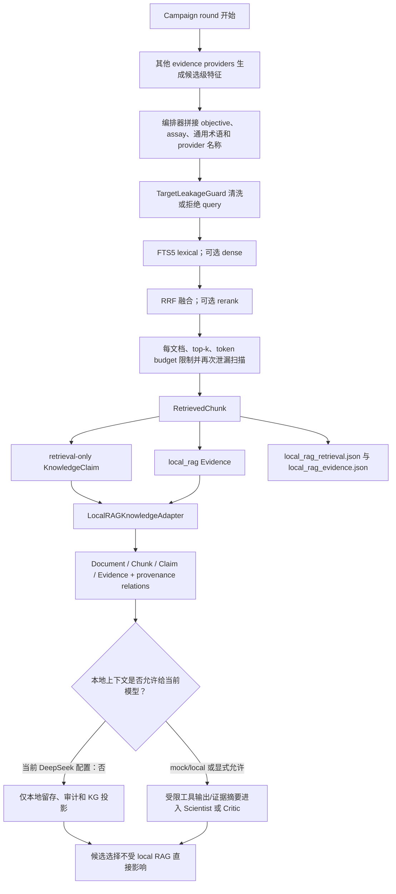
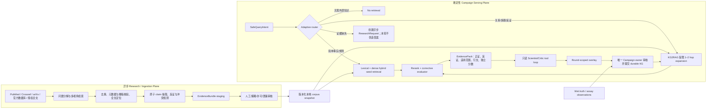

# 当前 RAG 执行逻辑、外挂知识库合规性与 Agentic KG 入口架构分析

> 状态：这是修复前的架构基线。当前英文原子语料、dense hybrid 检索、Publication/CitationSupport
> 规范和 corpus/overlay 拆分见
> [`english-atomic-rag-kg-production-architecture.md`](english-atomic-rag-kg-production-architecture.md)。

> 审计日期：2026-08-18  
> 代码基线：`9e3207aa4f4ae809a7133d40ac8e210831564ee5`  
> 范围：当前默认 GB1 配置、`resources/local_knowledge/directed_evolution` 简略知识库、Local RAG → structured KG → Scientist/Critic/selection 的真实调用链，以及面向科学文献的外部知识入口方案。  
> 本报告是静态代码审计、索引实查、离线检索探针、测试和公开架构资料的综合结果；没有改动运行时代码或用户已有文件。

## 1. 执行摘要

当前项目已经实现了一个**本地优先、可审计、按轮次物化的轻量 RAG**：启动时扫描外挂目录、解析和分块、建立 SQLite FTS5 索引；每轮用固定模板形成查询，执行泄漏检查、词法/可选稠密检索和 RRF 融合；把命中的 chunk 转为 `RetrievedChunk`、`KnowledgeClaim`、`Evidence`，保存检索审计文件，并通过 `LocalRAGKnowledgeAdapter` 写入 structured KG。

但是，当前生产配置并不是“RAG 驱动的 Agent”：

- `allow_remote_context: false`，而 Scientist/Critic 使用远程 DeepSeek，因此本地证据不会进入它们的提示上下文，本地 RAG KG 查询工具也不会注册给远程模型。
- `local_knowledge.contributes_to_selection: false`，而候选打分链路只消费候选级 provider evidence，所以 RAG 不会直接改变选择分数。
- 每轮的 KG interaction 是编排器预设的固定调用计划，不是模型自行规划、观察和再检索；已有 `LocalAgentLoop`/`RoundScopedToolExecutor` 目前主要是已测试的能力骨架，没有接入默认生产循环。
- 现有运行目录中没有发现 GB1 正式 campaign 的 `local_rag_retrieval.json`，现有 SQLite 索引也有 `retrieval_events=0`。因此可以确认“能力存在且测试通过”，但不能宣称“当前正式 campaign 已经实际依赖 RAG 做决策”。

对简略知识库的结论是：**符合当前 MVP 的输入与传输契约，尚不符合生产级科学 RAG 和事实型 KG 的语义规范。** 它适合作为“通用、低风险、人工整理的设计规则种子库”，不应直接视为“可计算、可验证、可冲突推理的权威知识图谱”。

建议不直接用完整 GraphRAG 替换现有实现，而是在现有 structured KG 前增加一个**双速、证据门控的 Adaptive KG²-RAG**：

1. 异步研究面负责多源发现、全文解析、元数据核验、矛盾与反证搜索，生成待审查 `EvidenceBundle`；
2. campaign 在线面保持确定性和轮次隔离，按查询复杂度在“不检索 / 单步混合检索 / KG 多跳扩展 / 发起异步研究请求”间路由；
3. 用 chunk 作为语义种子，在项目自身 KG 中做 1–2 跳受限扩展和重排，而不是另建一套权威图；
4. 外部结果只能进入 staging/overlay，持久化提交仍由唯一 campaign owner 控制，wet truth 与文献证据严格分层。

## 2. 当前系统实际上有三类知识存储

| 层 | 主要内容 | 当前实现 | 是否权威 | 主要消费者 |
|---|---|---|---|---|
| 外挂原始库 | Markdown/文本/JSON/YAML/CSV，以及可选 rich document | `resources/local_knowledge/directed_evolution/`，由 `LocalKnowledgeBase` 扫描 | 原始来源，不等于事实真值 | Local RAG 索引器 |
| Local RAG 索引 | document、chunk、FTS5、可选 embedding、retrieval audit | SQLite，默认 `artifacts/local_knowledge/gb1.sqlite` | 检索层，不应当承担科学置信度 | 检索器、审计、Local RAG adapter |
| Structured KG | Document、DocumentChunk、Claim、Evidence 及 provenance/round relations | `StructuredKnowledgeGraph` + adapters/operators | 受范围、轮次和 evidence policy 约束；wet truth 仍需单独保留 | KG 工具、Scientist/Critic 的受控上下文 |

这三个层次已经在代码中分开，是正确的基础。需要修正的是“检索排名如何变成 claim/evidence 语义”，而不是把三个层合并。

## 3. 当前 RAG 的具体执行逻辑

### 3.1 启动与索引

1. `load_experiment_config` 解析 `configs/knowledge/gb1.yaml`，将语料根目录、SQLite 索引和本地模型路径解析为本机路径。
2. `CampaignRunner` 构造 `KnowledgeEngine`。
3. `KnowledgeEngine` 构造 `LocalKnowledgeBase`、`TargetLeakageGuard`、可选 embedding/reranker、SQLite index，并立即调用 `refresh()`。
4. 扫描配置 root：
   - 内置支持 Markdown/纯文本/JSON/YAML/CSV；rich document 依赖可选 Docling；
   - 读取 Markdown front matter；
   - 计算文件哈希、document ID、chunk ID；
   - 对目标序列/受保护术语执行入库前泄漏检查；
   - 按标题/段落分块；
   - 写入 SQLite documents/chunks/FTS5，并在启用时写 embeddings；
   - 生成 manifest hash，支持增量刷新和策略变更检测。

主要入口：

- `src/fitness_agents/knowledge/engine.py:212-233`
- `src/fitness_agents/local_knowledge/service.py:30-82`
- `src/fitness_agents/local_knowledge/parsers.py:89-153`
- `src/fitness_agents/local_knowledge/index.py:127-291`

### 3.2 每轮检索、证据化与 KG 物化



每轮实际步骤如下：

1. `prefetch_local_knowledge()` 用 objective、assay 条件、默认通用词和 provider 名称生成一个宽查询。它不是 LLM query rewrite，也没有按当前候选、失败模式或不确定性自适应分解问题。
2. `LocalRetriever.retrieve()` 执行：query 安全检查 → lexical/dense 召回 → RRF → 可选 reranker → 文档与 token 配额 → 返回前再次安全扫描。
3. 每个命中 chunk 被转为：
   - `RetrievedChunk`；
   - 一个 `retrieval-only` 的 `KnowledgeClaim`；
   - 一个 `channel=local_rag`、`quality_status=unverified`、`contributes_to_selection=false` 的 `Evidence`。
4. 编排器保存每轮 JSON 审计工件。
5. pre-design KG sync 把当前轮命中物化为 Document、DocumentChunk、Claim、Evidence，以及 `HAS_CHUNK`、`ASSERTS`、`SUPPORTED_BY_SOURCE`、`DERIVED_FROM` 等关系。
6. `_run_kg_interaction()` 执行固定计划：先 `hypothesis_context`，然后在权限允许时固定调用 `query_local_knowledge`，再执行观测变体解释/比较。配置中虽然列出了 `query_structured_claims`，当前固定计划并没有调用它。
7. Scientist/Critic 仅在本地上下文策略允许时接收这些证据；选择器仍以候选级 evidence 和 validation prior 为主要输入。
8. 轮末再将 staged local retrieval/evidence 与验证结果同步到 KG。

主要入口：

- `src/fitness_agents/local_knowledge/retriever.py:33-188`
- `src/fitness_agents/knowledge/engine.py:382-505`
- `src/fitness_agents/loop/orchestrator.py:288-405,834-925,1401-1402,1834`
- `src/fitness_agents/kg_knowledge/adapters.py:544-750`
- `src/fitness_agents/kg_interaction/operators.py:250-360`

### 3.3 当前默认配置的真实效果

`configs/knowledge/gb1.yaml` 当前关键值为：

| 配置 | 当前值 | 实际后果 |
|---|---:|---|
| `allow_remote_context` | `false` | 远程 DeepSeek Scientist/Critic 不能看到本地 RAG/KG 内容；相应本地知识工具不向远程模型注册 |
| `retrieval.mode` | `lexical` | 使用 FTS5 词法召回 |
| `dense_enabled` | `false` | 不生成/使用向量；当前索引 embeddings 为 0 |
| `top_k` | `8` | 最多返回 8 个命中，仍受每文档和 token 配额约束 |
| `token_budget` | `5000` | 限制每次预取总文本量 |
| `materialization` | `retrieved_only` | 只有本轮实际命中的内容进入 KG，不把整个外挂库灌入图中 |
| `contributes_to_selection` | `false` | local RAG evidence 不直接计入候选选择评分 |

这意味着：**当前 RAG 会“建索引、每轮预取、落审计工件、写 structured KG”，但默认不会影响远程 Agent 的推理或候选排序。** 这不是代码 bug，而是隐私/策略配置造成的保守行为；需要产品层明确选择“本地模型消费”还是“经过批准的受限远程上下文”。

## 4. 外挂知识库如何被使用

### 4.1 接入方式

外挂知识库由配置中的一个或多个 root 声明。新增合规文件后，下一次构造 `KnowledgeEngine` 或显式 refresh 会增量更新索引。系统使用文件 hash 和 manifest 判断新增、修改、删除与策略变化；检索命中才会按 `retrieved_only` 投影到 KG。

当前流程不包含联网发现、文献下载或自动更新。换言之，“外挂”指**本地受控目录**，不是一个在线 Search API。在线 Deep Research 应作为独立 ingestion plane，经过核验后再发布成可索引快照，而不是在 campaign 每轮直接抓网并写权威 KG。

### 4.2 当前知识库实查

`resources/local_knowledge/directed_evolution/` 当前包含 9 个 Markdown 文档（1 个 corpus guide + 8 类知识），共 14 个 chunk、49 条显式规则；front matter 一致包含 `title`、`knowledge_type`、`language`、`version`、`evidence_level`、`rule_scope`、`topics`、`citation_keys`、`applies_to`、`excludes`。

当前 GB1 SQLite 实查结果：

| 项目 | 数值 |
|---|---:|
| documents | 9 |
| chunks | 14 |
| embeddings | 0 |
| quarantined | 0 |
| retrieval_events | 0 |
| knowledge types | 9 |

22 个唯一 citation key 对应 19 个 DOI 链接；本次通过 Crossref、PubMed 或其他出版元数据入口逐项解析，没有发现明显的悬空 DOI。这里的“可解析”只证明书目信息存在，不等于每条规则都已完成“原文句级支持强度”核验。

本次用独立临时索引执行了四类探针：宽泛预取、英文类型过滤、中文规则查询、上位性/组合查询。四类均能返回预期知识类型，说明中文词法匹配、类型过滤和 RAG→KG 基础链路可运行；但宽查询容易重复召回通用材料，也暴露出当前缺少 gold query 和检索阈值的问题。

## 5. 简略版知识库是否符合 RAG 与后续 KG 规范

### 5.1 合规矩阵

| 要求 | 当前状态 | 判断 |
|---|---|---|
| 文档可解析、可增量索引 | 9 文档均可正常建库 | 符合 MVP |
| 类型化知识与适用范围 | front matter 已含类型、scope、applies/excludes | 符合 MVP；枚举尚未封闭 |
| 检索 provenance | file hash、path、chunk span、query、round、manifest 可追踪 | 基本符合 |
| 目标泄漏控制 | 入库、query、返回结果三处检查；0 quarantine | 符合当前安全设计，但仍需 adversarial test |
| 当前轮可见性 | adapter 拒绝跨轮 retrieval，KG 带 `valid_from_round` | 符合 |
| 原子化事实 | 整个 chunk 被包装成一个 neutral claim，S/P/O 为空 | 不符合生产 KG |
| 引文到 claim 的精确支持 | citation key 在文档级，缺少 claim→文献→原文 span 和支持类型 | 不符合 |
| 科学置信度语义 | 用 `RRF score × 60` 形成 claim confidence | 不符合；检索排名不能等同证据可信度 |
| 实体/本体规范化 | 无 UniProt/GO/SO/ECO 等统一 ID；蛋白、残基、assay 条件未结构化 | 不符合生产 KG |
| 反证、冲突和来源独立性 | 无显式 contradicts/limits/independent-source 关系 | 不符合 |
| 稠密/混合召回 | 默认 lexical，embeddings=0 | 可运行，但召回质量尚未证明 |
| 可移植 ID | document ID 由绝对路径 + file hash 生成，manifest 记录绝对路径 | 不符合跨机器可复现性最佳实践 |
| 模态标注一致性 | chunk 在 KG 中总带 `TEXT, EMBEDDING`，即使没有向量 | 存在语义偏差 |
| 正式 campaign 使用证据 | 当前索引 retrieval_events=0，未发现正式 RAG round artifact | 未证明 |

### 5.2 最重要的四个语义问题

1. **检索分数与科学可信度混淆。** RRF 只能表示“对当前 query 的相对召回排序”，不能代表论文质量、实验可重复性或对具体 protein/assay 的可迁移性。必须拆成 `retrieval_score`、`rerank_score`、`extraction_confidence`、`scientific_evidence_grade` 和 `selection_weight`。
2. **chunk 不是事实。** 当前每个 chunk 形成一个大粒度 neutral claim，`subject/predicate/object=null`。这能满足传输接口，却无法可靠支持图查询、冲突检测、多跳推理或细粒度引文。
3. **引文粒度不足。** 文档头部 citation key 不能证明其中每条规则分别受哪篇论文的哪一段支持；还需要 `Publication`、`CitationSupport` 和精确 source span。
4. **当前配置行为上是“惰性的”。** 本地知识完成了索引和 KG 投影，但远程 Scientist/Critic 看不到，selection 也不消费。若不明确改变消费路径，继续扩充文献数量不会自然改善决策。

### 5.3 当前可接受的用途边界

- 适合：通用 directed-evolution 安全规则、查询提示、候选设计的约束清单、Critic 检查项、人工策展的低风险背景知识。
- 不适合：直接断言某个变体对当前 assay 的效应、作为 wet truth、直接生成候选加分、自动形成权威因果边、替代目标蛋白的真实结构/MSA/测定数据。

## 6. 热门 RAG、Deep Research 与 Agentic RAG 的适配性

| 架构/模式 | 核心机制 | 对本项目价值 | 主要风险 | 建议定位 |
|---|---|---|---|---|
| 经典 RAG | dense/lexical 检索后生成 | 基线清晰，便于离线与审计 | 单步检索、弱多跳 | 保留为最低成本路径；原始论文见 [Lewis et al.](https://arxiv.org/abs/2005.11401) |
| Microsoft GraphRAG | 实体关系图、社区摘要、local/global query | 适合“整个语料的主题/全局问题” | 索引昂贵、LLM 抽取噪声、与现有 KG 重复 | 暂不作为主入口；需要时只做实验后端。官方也提示其是演示性质且索引成本较高，见 [GraphRAG repository](https://github.com/microsoft/graphrag) 与 [query modes](https://github.com/microsoft/graphrag/blob/main/docs/query/overview.md) |
| KG2RAG | 先取语义 seed chunks，再用 KG 扩展和组织邻域 | 与现有 Document→Chunk→Claim→Evidence 最匹配；可受限多跳 | 依赖 claim/entity 质量 | **推荐作为在线主干**；见 [NAACL 2025 KG2RAG](https://aclanthology.org/2025.naacl-long.449/) |
| HippoRAG | KG + Personalized PageRank 的长期关联记忆 | 图变大后可提高多跳召回 | 当前 9 文档太小，PPR 收益未必抵过复杂度 | P2/P3 候选；见 [NeurIPS 2024](https://proceedings.neurips.cc/paper_files/paper/2024/hash/6ddc001d07ca4f319af96a3024f6dbd1-Abstract-Conference.html) |
| Adaptive-RAG | 按问题复杂度选择无检索、单步或多步 | 避免每轮固定宽查询，控制延迟和噪声 | 路由器需要 gold set | **推荐作为入口路由层**；见 [NAACL 2024](https://aclanthology.org/2024.naacl-long.389/) |
| Self-RAG / CRAG | 自我反思、检索质量判断和纠错/补检 | 可在低质量命中时拒答、换源或找反证 | LLM judge 也需校准；不可赋予写权威 KG 的权限 | **推荐引入确定性阈值 + 受限 evaluator**；见 [Self-RAG](https://proceedings.iclr.cc/paper_files/paper/2024/file/25f7be9694d7b32d5cc670927b8091e1-Paper-Conference.pdf) 和 [CRAG](https://arxiv.org/abs/2401.15884) |
| ReAct / Agentic RAG | 模型在推理和工具调用之间循环 | 可利用已有 tool executor，按假设主动查证 | 循环失控、提示注入、成本和不可复现 | 接入 Scientist 的只读、按轮次、有预算工具层；见 [ReAct](https://research.google/blog/react-synergizing-reasoning-and-acting-in-language-models/) |
| STORM-style Deep Research | 多视角提问、迭代检索、组织长报告 | 适合知识库增量建设和找遗漏观点 | 不适合放入每轮同步 campaign | 异步 ingestion/research plane；见 [STORM](https://aclanthology.org/2024.naacl-long.347.pdf) |
| PaperQA2 / OpenScholar | 学术全文、元数据、迭代检索、带引文答案、自反馈 | 最贴合科学外部知识发现和引文核验 | 需要合法全文、版本/撤稿管理，仍不能直接写真值 KG | **推荐作为异步科学研究网关的参考实现**；见 [PaperQA2](https://github.com/Future-House/paper-qa) 和 [OpenScholar](https://www.nature.com/articles/s41586-025-10072-4) |
| LightRAG | 文本与图的 local/global/hybrid/mix 查询 | 易做轻量图增强实验 | 会形成第二套图和第二套真值语义 | 仅置于 `KnowledgeSource` adapter 后进行离线 benchmark，见 [LightRAG](https://github.com/HKUDS/LightRAG) |

现有旧文档若把 GraphRAG 描述为“maintenance mode”，不应继续沿用该判断；截至本次审计，官方仓库仍有活跃发布。真正的取舍依据应是**是否需要全局社区摘要、索引成本以及与本项目权威 KG 的边界**，而不是维护状态标签。

## 7. 推荐架构：双速、证据门控的 Adaptive KG²-RAG

### 7.1 总体结构



### 7.2 为什么比直接采用完整 GraphRAG 更合适

1. 项目已经有 structured KG、round visibility、source scope 和受控 operators；KG2RAG 可以复用它们，而不是再维护一个 LLM 抽取图。
2. 当前语料仅 9 个文档，社区发现和层级摘要的投入收益比低；更急迫的是 claim 原子化、引用精确化和检索评估。
3. directed evolution 的关键问题多为“某条件下某规则是否适用、哪些证据支持/反对、与已观测变体有何关系”，适合 seed retrieval + typed neighborhood expansion，不主要是全库主题总结。
4. campaign 需要确定性、可复现和泄漏安全；Deep Research 的联网、迭代和长时延更适合作为异步知识生产线。
5. Adaptive routing 允许简单规则走便宜的词法路径，复杂关系走 KG 扩展，缺证据时明确发起研究任务，避免每轮固定塞入 5000 token 的泛化材料。

### 7.3 外部知识进入 KG 前的目标契约

建议新增或严格化以下对象；名称可适配现有 contract，但语义应保持分离：

**`SourceRecord / Publication`**

- DOI、PMID、arXiv ID、UniProt/数据库记录 ID；
- 标题、作者、年份、venue、版本、撤稿/更正状态；
- license/access policy、获取时间、内容 hash、解析器版本。

**`Document / Chunk`**

- `corpus_id + relative_uri + content_hash`，避免绝对路径进入稳定 ID；
- 页/段/表/图/字符 span；
- parser、chunker、embedding、reranker 版本；
- 实际存在向量时才标注 `EMBEDDING` modality。

**`AtomicClaim`**

- `subject / predicate / object / polarity`；
- protein、parent sequence/version、organism、assay、condition、mutation、position numbering、unit 等 qualifier；
- `applies_to / excludes / valid_from / valid_to`；
- extraction method 与 extraction confidence。

**`CitationSupport`**

- claim 到 publication/chunk 的精确 span；
- `support_type = strong | partial | background | limiting | contradictory | metadata_only`；
- source independence、study type、sample size/assay relevance（可用时）。

**独立评分字段**

- `retrieval_score`：query 相关性；
- `rerank_score`：重排相关性；
- `extraction_confidence`：结构化抽取置信度；
- `scientific_evidence_grade`：证据等级/可信度；
- `applicability_score`：对当前 protein/assay 的适用性；
- `selection_weight`：经过策略批准后才允许非零。

**`EvidenceBundle`**

- research question、query plan、数据源与失败源、去重策略、搜索时间窗；
- 支持与反证 claim、未解决冲突、引用核验结果；
- corpus snapshot、policy version、leakage decision；
- `status = staged | reviewed | rejected | published`，外部 Agent 只能产生 `staged`。

## 8. 实施优先级与验收标准

### P0：先修语义和评估，不先扩大语料

1. 将每个 `规则 XXX` 解析为原子 claim；建立 Publication/CitationSupport 结点和 `SUPPORTS/LIMITS/CONTRADICTS` 关系。
2. 拆开 retrieval、rerank、extraction、scientific evidence 和 selection 分数，禁止 `RRF × 常数` 充当科学 confidence。
3. document ID 改为 corpus ID + 相对路径/内容 hash；修正无向量 chunk 的 modality。
4. 建立 30–50 条 gold queries，覆盖 8 种知识类型、中文/英文、适用/排除条件、反证和无答案问题。
5. 对 lexical、local multilingual dense、hybrid、reranker 做同一 gold set 基准，不根据流行度直接选 embedding 模型。

验收：Recall@k、MRR/nDCG、knowledge-type accuracy、citation precision、claim groundedness、no-answer accuracy、leakage violations、p95 latency 和成本均有版本化报告；泄漏违规必须为 0。

### P1：让在线检索真正成为受控 Agent 工具

1. 增加 Adaptive router；按需执行 no retrieval、one-shot hybrid 或 KG2RAG 1–2 hop。
2. 加入 corrective evaluator：低相关或冲突证据不得进入摘要，必须允许返回 unavailable/needs-research。
3. 将 `LocalAgentLoop`/`RoundScopedToolExecutor` 接入 Scientist 的真实生产路径；模型可选择只读工具，但受 `max_tool_calls/max_rows/token/time` 和 round scope 限制。
4. 记录“检索了什么、模型引用了什么、最终决策是否因此改变”，而不只记录 tool call。

验收：真实模型调用 trace 能证明工具选择、EvidencePack 引用和决策差异；越权、跨轮和写操作 fail closed。

### P2：建设异步科学 Deep Research 网关

1. 多源发现路由：PubMed/Crossref/arXiv/官方数据库优先，授权全文单独管理。
2. 采用 PaperQA2/OpenScholar/STORM 类模式进行 query decomposition、多视角检索、全文定位、引文和反证核验。
3. 输出 `EvidenceBundle` 到 staging；只有策展/策略通过后发布为新 corpus snapshot。
4. 保留失败源、查询式、检索日期、版本和许可信息；不得把搜索摘要当全文事实。

验收：每个发布 claim 都有可定位 source span、已核验元数据和明确支持类型；撤稿/更正可传播失效状态。

### P3：用同折、同预算消融决定是否升级 GraphRAG/HippoRAG

比较：no-RAG、lexical、hybrid、KG2RAG、agentic tool loop、Deep Research snapshot；在相同 folds、seeds、wet budget 下报告检索指标、Agent groundedness、候选多样性、命中率和 wet outcome。可使用 claim-level 诊断思路定位“检索失败还是生成失败”，参考 [RAGChecker](https://github.com/amazon-science/RAGChecker)。只有当“全库 global question”或多跳 benchmark 显示稳定增益时，再引入 GraphRAG community summaries 或 HippoRAG/PPR。

## 9. 本次验证证据与限制

执行了以下仓库测试：

```text
tests/unit/test_local_knowledge.py
tests/unit/test_local_rag_kg.py
tests/unit/test_local_agent_loop.py
tests/integration/test_local_knowledge_campaign.py
tests/integration/test_directed_evolution_knowledge_base.py

结果：12 passed in 4.87s
```

目标模块 lint 通过。测试覆盖增量索引、类型过滤、泄漏 guard、当前轮物化、operator EvidencePack、mock campaign 和 local agent loop 骨架；它们没有证明当前远程 DeepSeek 配置会消费本地知识，也没有测 Recall@k/MRR 或最终 wet outcome。

学术检索采用多源流程；PubMed、Crossref 可用，arXiv API 预检失败，OpenAlex 回退有两条查询遇到 Windows 输出编码问题。因此架构比较优先引用论文页、会议页、官方仓库和官方文档，未把二手搜索摘要当作结论依据。

## 10. 直接回答四个问题

1. **RAG 如何实现？** 本地目录解析 → SQLite FTS5/可选 dense 索引 → 三段泄漏防护 → RRF/可选重排 → top-k/token budget → chunk/claim/evidence → 按轮次审计工件 → retrieved-only 写入 structured KG。
2. **具体执行逻辑？** 每轮由编排器固定生成宽查询并预取，随后固定执行有限 KG plan；当前不是模型自主分解问题、调用工具并迭代观察的 Agentic RAG。
3. **如何使用外挂知识库？** 通过配置 root 加载版本化本地文件，refresh 增量索引；只有本轮命中内容进入 KG。当前不联网自动补库，且默认不把本地内容发送给远程 DeepSeek。
4. **简略库是否合规？** 对 MVP RAG 输入、泄漏控制、provenance、轮次物化和 KG 传输接口基本合规；对生产科学 RAG/KG 的原子事实、精确引文、实体规范、冲突/反证、置信度语义、可移植 ID 和检索评估不合规。

最终建议：**把现有库保留为已策展 seed corpus；先完成 P0 语义修复和 gold-set 评估，再以 Adaptive router + KG2RAG + corrective evaluator 接入现有 KG；把 PaperQA2/OpenScholar/STORM 类 Deep Research 放在异步外部知识生产线上。**
