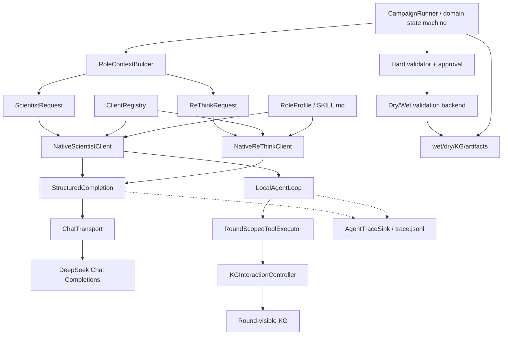

# 零 Agents SDK 的原生 Client 合同化重构执行 PLAN

> 日期：2026-08-17  
> 审计基线：`main@10c15ac`  
> 目标：彻底移除 OpenAI Agents SDK 代码、配置、依赖和测试，将可借鉴的工程能力全部实现为项目原生 Client 模块  
> 执行对象：可直接交给下游代码 Agent，按阶段修改、测试和提交

## 实施状态（2026-08-17）

本 PLAN 已在 `main@10c15ac` 工作区实施。生产路径已删除 Agents SDK 依赖、adapter、配置、
Runner 分支、KG session、baseline 脚本和专属测试，统一为项目原生 Chat Completions Client。
保留的 `agents_sdk` 字符串仅存在于旧配置 fail-fast 迁移保护及其单元测试中，不对应可运行
runtime。原生实现包括 typed/frozen role context、Pydantic contextual retry、Client registry、
Chat transport、round-scoped KG executor、本地有界 tool loop、Scientist/ReThink profiles 和
映射到现有 trace 的 run/round/profile/schema/context/tool 元数据。

验证结果：相关 unit/integration/e2e 与 Ruff 均通过；全量测试没有新增失败。唯一失败仍是
既有 `SPIKE_SARS2` MVP assay 清单问题，另有一个依赖本地 ESM checkpoint 的测试跳过；未执行
付费 DeepSeek live smoke。

## 1. 最终决策

本项目不保留 OpenAI Agents SDK，包括 optional extra、experimental adapter 或备用 runtime。

所有模型角色统一采用项目自有 Client：

- DeepSeek：自研 Chat Completions Client；
- 其他 OpenAI-compatible provider：复用同一原生 transport/client 合同；
- 如未来使用 OpenAI 原生模型，也通过项目自有 Chat Completions Client 接入，不引入 Agents SDK；
- mock/offline：实现同一 Client Protocol，用于测试和无网络运行。

允许继续使用 `openai` Python 基础客户端调用 `client.chat.completions.create()`，因为它只是 HTTP/API transport；必须删除的是 `openai-agents`、`agents.Agent`、`agents.Runner`、SDK tracing、SDK tool wrapper 和 SDK session/runtime。

不可变边界：

1. `CampaignRunner` 独占科研状态机、round visibility、候选选择、dry/wet validation、hard validation、审批、oracle reveal、KG 写入和 artifact 恢复。
2. Scientist/ReThink 只执行当前轮的认知任务，输入是强类型 sanitized context，输出是强类型领域对象。
3. Client 不直接读取 `CampaignState`、fold 文件、oracle、final-test、backend、database connection 或 batch submission。
4. DeepSeek 使用 Chat Completions + `json_object`；schema 遵循由本地 Pydantic 和上下文验证保证。
5. KG 查询只通过项目自有 tool registry、round-scoped executor 和 `KGInteractionController`。
6. skills/profile 负责角色行为和科学程序，不承担权限控制。
7. trace 是只追加观测副本；wet/dry/KG/artifact 仍是唯一科研状态源。

## 2. 为什么必须彻底移除 SDK

OpenAI 官方把 Agents SDK 的核心定义为 SDK Runner 持有 model/tool loop；需要应用自行控制 loop 时，应用应拥有该循环：[Agents SDK](https://developers.openai.com/api/docs/guides/agents)、[Running agents](https://developers.openai.com/api/docs/guides/agents/running-agents)。

官方 provider 文档也说明，标准 SDK 路径以 OpenAI provider 为默认，非 OpenAI 模型需要额外 provider/adapter，且部分高级能力依赖 Responses 路径：[Models and providers](https://developers.openai.com/api/docs/guides/agents/models)。DeepSeek 对 Chat Completions endpoint 的兼容不能外推为对 SDK agent loop、output conversion、tool replay 或 tracing 生命周期的兼容。

此外，JSON Mode 只保证合法 JSON，不保证 schema 遵循：[Structured model outputs](https://developers.openai.com/api/docs/guides/structured-outputs)。因此当前真正解决 Fold0 缺 `hypothesis_id` 的机制是本地 Pydantic + contextual validation + retry，而不是 SDK。

本项目已有确定性的领域循环，再叠加 SDK Runner 会产生第二套 turn/state/error 语义。彻底移除比长期维护两套路由更干净。

## 3. 当前 Git 能力的保留与删除

### 3.1 保留

| 提交 | 能力 | 处理 |
|---|---|---|
| `0e45898` | `HypothesisOutput` / `ReThinkOutput`、Pydantic 校验进入重试边界 | 保留并泛化为原生 typed completion |
| `82f5a24` | Scientist `SKILL.md`、profile hash | 保留，增加 ReThink profile 和 manifest |
| `01faa85` | KG operator 行数上限、round-scoped query budget | 保留语义，删除 SDK 命名 |
| `05ea9ed` 及更早 | dry/wet/ReThink/KG/artifact 状态链 | 完整保留 |

### 3.2 外科式删除

| 提交 | SDK 耦合 | 处理 |
|---|---|---|
| `370e688` | `runtime=agents_sdk`、SDK Scientist/ReThink、SDK tool loop、SDK tracing/config | 按文件删除，不直接整提交 revert |
| `10c15ac` | SDK AL96 configs、SDK baseline harness、SDK tests | harness 改成原生 Client；SDK 资产删除 |

不要执行 `git reset` 或整体 `git revert 370e688`。后续提交修改了相同文件，且其中混有应保留的合同能力。必须按本文文件清单小步修改。

### 3.3 当前测试基线

在 `main@10c15ac`、项目 `.venv` 下：

```powershell
.\.venv\Scripts\python.exe -m pytest `
  tests/unit/test_llm_output_contracts.py `
  tests/unit/test_sdk_agents.py `
  tests/unit/test_kg_sdk_tools.py `
  tests/unit/test_kg_interaction_modules.py `
  tests/unit/test_scientist.py -q
# 21 passed

.\.venv\Scripts\python.exe -m pytest -q
# 116 passed, 1 failed, 1 skipped
```

既有唯一失败：

```text
tests/unit/test_download_script.py::test_mvp_assay_list_excludes_out_of_scope_receptor_binding_assays
configs/data/proteingym_mvp_assays.txt 含 SPIKE_SARS2
```

该失败与本重构无关。下游 Agent 不得为了全绿而修改 assay 列表；验收标准是没有新增失败，并单独报告该已知问题。

## 4. 将 SDK 可借鉴能力映射为原生模块

| 可借鉴思想 | 不保留的 SDK 实现 | 项目原生实现 |
|---|---|---|
| Agent 定义模块化 | `agents.Agent` | `NativeRoleClient` + role-specific Client |
| provider/model 可插拔 | SDK model/provider adapter | `ClientRegistry` + `ChatTransport` Protocol |
| 结构化输入 | SDK run context | Pydantic `ContextEnvelope[T]` 和 role input schema |
| 结构化输出 | SDK `output_type` | `complete_structured[T]` + Pydantic + contextual validator |
| function tools | `@function_tool` | `ToolSpec` + `ToolRegistry` + `RoundScopedToolExecutor` |
| tool loop | SDK Runner | `LocalAgentLoop`，只存在于认知层 |
| tool guardrail | SDK tool guardrail | `KGInteractionController` + `ToolPolicy` |
| max turns/budget | SDK `max_turns` | `AgentLoopPolicy` + round query budget |
| instructions/profile | SDK Agent instructions | 版本化 `SKILL.md` + `profile.yaml` |
| tracing | SDK trace/span | `AgentTraceSink` 写入现有 `trace.jsonl` |
| run context metadata | SDK trace metadata | `AgentTraceContext(run/round/variant/request)` |
| result/state | SDK run result/session | 原生 typed result；科研状态仍由 artifact/KG 持有 |
| handoff | SDK handoff | `CampaignRunner` 的显式、确定性角色调用 |
| guardrails | SDK input/output guardrail | context policy、Pydantic、hard validator、approval gateway |

核心原则：借鉴的是合同和模块边界，不复制 SDK runtime。

## 5. 目标架构



### 5.1 领域层与认知层的界线

| 能力 | 所有者 | Client 是否可见 |
|---|---|---|
| round/phase 状态 | `CampaignRunner` | 只见序列化后的当前 round ID |
| fold/oracle/final-test | data/backend 层 | 不可见 |
| visible observation | `RoleContextBuilder` | 只见当前轮允许字段 |
| hypothesis 生成 | `NativeScientistClient` | 可见 sanitized input、只读 KG tools |
| ReThink | `NativeReThinkClient` | 只见本轮 selected wet/dry context |
| KG 查询权限 | `ToolPolicy`/controller | 仅 allow-listed read tools |
| batch selection/approval | Runner/validator | 不可调用 |
| wet reveal/KG write | Runner/backend | 不可调用 |
| trace | `AgentTraceSink` | Client 只发事件，不读取作为状态 |

## 6. 原生 Client 标准

### 6.1 Transport 与 Client 分离

新增低层 transport Protocol：

```python
class ChatTransport(Protocol):
    provider_name: str

    def complete(self, request: ChatCompletionRequest) -> ChatCompletionResponse:
        ...
```

`ChatCompletionRequest` 只包含 API 层字段：

- model；
- messages；
- temperature/max tokens；
- `response_format={"type":"json_object"}`；
- provider-specific extra body；
- transport timeout/retry metadata。

`ChatCompletionResponse` 只包含：

- message content；
- finish reason；
- usage；
- provider request ID；
- 不包含领域状态。

实现：

```text
OpenAICompatibleChatTransport
MockChatTransport
```

DeepSeek 由 `OpenAICompatibleChatTransport` 使用基础 `openai.OpenAI(...).chat.completions.create()` 调用。transport 不解析 Hypothesis/ReThink，不加载 skill，不执行 KG tool。

### 6.2 Role Client Protocol

```python
class ScientistClient(Protocol):
    provider_name: str

    def generate_hypothesis(self, request: ScientistRequest) -> Hypothesis:
        ...


class ReThinkClient(Protocol):
    provider_name: str

    def reflect_round(self, request: ReThinkRequest) -> tuple[ReThinkReflection, ...]:
        ...
```

原生实现：

```text
NativeScientistClient
NativeReThinkClient
MockScientistClient
MockReThinkClient
```

Client 组合 transport、profile、structured completion、trace sink 和可选 tool executor，不继承或包装任何第三方 Agent runtime。

### 6.3 可插拔注册表

新增显式 allow-listed `ClientRegistry`，禁止通过 YAML arbitrary import path 加载代码：

```python
registry.register("mock", create_mock_client_bundle)
registry.register("deepseek", create_deepseek_client_bundle)
registry.register("openai_compatible", create_openai_compatible_client_bundle)
registry.register("openai", create_openai_chat_client_bundle)
```

统一工厂返回：

```python
@dataclass(frozen=True)
class RoleClientBundle:
    scientist: ScientistClient
    rethink: ReThinkClient
```

`CampaignRunner` 只请求一个 `RoleClientBundle`，不根据 client 类型、SDK 标志或 `supports_kg_tools` 分支。

未来新增 provider 的步骤必须是：

1. 实现 `ChatTransport` 或显式 role client；
2. 注册 factory；
3. 通过通用 contract test suite；
4. 添加配置 schema；
5. 不修改 Runner 科研主循环。

### 6.4 能力声明

每个原生 Client 声明不可变能力：

```python
@dataclass(frozen=True)
class ClientCapabilities:
    roles: frozenset[str]
    supports_local_tools: bool
    structured_mode: Literal["json_object_local_schema"]
    trace_version: str
```

能力声明用于 factory 启动时校验，不用于 Runner 在每轮动态分支。若配置要求 `model_directed` KG，而 client 不支持 local tools，应在启动时 fail fast。

### 6.5 错误体系

新增稳定错误类型：

```text
AgentClientError
├── ContextPolicyError
├── TransportError
│   ├── TransientTransportError
│   └── PermanentTransportError
├── StructuredOutputError
│   ├── JSONExtractionError
│   ├── OutputContractError
│   └── StructuredOutputExhausted
├── ToolPolicyError
├── ToolBudgetExhausted
└── AgentTurnLimitExceeded
```

禁止用一个 `except Exception` 同时处理模型合同错误、网络错误和编程错误。

## 7. 标准化输入与上下文管控

### 7.1 不再把裸 `dict` 作为正式 Client 输入

在 `src/fitness_agents/contracts/agent_io.py` 定义 Pydantic 输入合同：

```text
AgentTraceContext
ContextEnvelope[T]
VisibleObservationInput
EvidenceInput
KGInteractionInput
ScientistContextInput
ScientistRequest
DryValidationInput
ReThinkCandidateInput
ReThinkContextInput
ReThinkRequest
```

全部模型使用：

```python
model_config = ConfigDict(extra="forbid", strict=True, frozen=True)
```

推荐 envelope：

```python
class ContextEnvelope(BaseModel, Generic[T]):
    contract_version: Literal["agent-context/v1"]
    run_id: str
    round_id: int
    role: Literal["scientist", "rethink"]
    request_id: str
    payload: T
```

### 7.2 RoleContextBuilder

新增：

```text
ScientistContextBuilder
ReThinkContextBuilder
```

它们位于领域到认知的边界，职责是：

- 从 `CampaignState` 复制允许字段；
- 只选择当前 round 可见记录；
- 把 dataclass/enum 转换为纯数据；
- 构造 Pydantic context；
- 执行 allowlist 和 forbidden-key 双重检查；
- 施加记录数、行数和序列化字节预算；
- 生成稳定 request ID 和 context hash；
- 返回 frozen context，不把原状态对象引用传给 Client。

### 7.3 上下文 allowlist

Scientist 允许：

- run/mode/current round；
- expected hypothesis ID；
- previous hypothesis ID/assessment 的公开字段；
- current visible observations；
- visible evidence；
- controller 已批准的 KG tool results。

ReThink 允许：

- run/current round；
- selected variant IDs 与 mutation notation；
- selection reason、hypothesis/evidence IDs；
- 本轮已 reveal wet value；
- 本轮 dry validation 值、uncertainty、OOD、model version；
- pre-round visible baseline。

所有角色禁止：

- oracle path/data object；
- final-test IDs/labels；
- future round records；
- raw/normalized hidden fitness；
- backend、approval gateway、filesystem Path、callable、database handle；
- API key、environment snapshot；
- 未过滤的 trace/history。

### 7.4 上下文预算

增加 `ContextPolicy`：

```python
@dataclass(frozen=True)
class ContextPolicy:
    max_observations: int
    max_evidence_items: int
    max_kg_rows: int
    max_serialized_bytes: int
    allowed_fields: frozenset[str]
```

截断必须确定性排序，并在 trace 中记录原数量、保留数量和截断策略；不能让 Client 自己读取更多数据。

### 7.5 输入测试

- forbidden key 在任意嵌套深度被拒绝；
- extra field 被 Pydantic 拒绝；
- round mismatch 被拒绝；
- context 超预算被确定性截断或 fail fast；
- Client 无法从 request object graph 到达 backend/oracle/path/callable；
- context hash 对同一规范化输入稳定；
- ReThink expected variant set 与 candidates 精确相等。

## 8. 标准化结构化输出

### 8.1 `complete_structured[T]`

新增 `src/fitness_agents/agents/structured_completion.py`：

```python
T = TypeVar("T", bound=BaseModel)

def complete_structured(
    *,
    transport: ChatTransport,
    request: ChatCompletionRequest,
    output_type: type[T],
    contextual_validator: Callable[[T], T],
    trace_context: AgentTraceContext,
    output_retries: int,
) -> T:
    ...
```

处理顺序必须固定：

```text
Chat response
  -> finish_reason/incomplete check
  -> JSON extraction
  -> Pydantic model_validate
  -> contextual validation
  -> typed model
  -> domain conversion
```

DeepSeek 请求使用：

```python
response_format={"type": "json_object"}
```

Pydantic schema 作为本地合同和 prompt 说明；不宣称 DeepSeek 服务端执行 `json_schema`。

### 8.2 重试分类

输出修复重试只捕获：

- JSON decode/extraction；
- Pydantic `ValidationError`；
- `OutputContractError`；
- incomplete/length finish reason。

transport retry只捕获显式 transient API error。`KeyError`、`AssertionError`、`TypeError` 等编程错误不得被吞掉并转成模型重试。

纠错消息只包含安全的字段位置、错误类型和简短 message，不回显完整输入或 hidden data。

### 8.3 Scientist 输出

保留并加强 `HypothesisOutput`：

- 所有字段 required；
- `extra="forbid"`；
- `hypothesis_id == context.expected_hypothesis_id`；
- parent ID 精确匹配；
- sites 恰好为 39/40/41/54；
- residue 为 canonical one-letter code；
- evidence ID 只能来自当前 input 或本轮真实 tool result。

Fold0 缺 `hypothesis_id` 的稳定保证来自：

1. skill 明确复制 expected ID；
2. Pydantic required field；
3. contextual validator exact match；
4. 三者位于同一输出修复重试边界。

skill 只能提高首次成功率，不能代替 schema。

### 8.4 ReThink 输出

`ReThinkOutput.validate_for_context()` 必须在输出修复重试内部验证：

- variant ID 无重复；
- output variant set 精确等于 selected set；
- 不缺 variant；
- 不多 variant；
- verdict 为枚举；
- summary/reason/advice 非空。

只有输出修复重试耗尽后，Runner 才允许使用现有 deterministic mock fallback。

## 9. 原生工具系统与本地 Agent Loop

该模块是本次目标的一部分，不保留为“未来 SDK adapter”。生产默认可继续选择 deterministic precomputed KG，但工具合同和本地 loop 必须作为原生能力实现并测试。

### 9.1 模块重命名

```text
src/fitness_agents/kg_interaction/sdk_tools.py
    -> src/fitness_agents/kg_interaction/tool_runtime.py

KGToolSession
    -> RoundScopedToolExecutor
```

删除全部 `sdk_` event/type/file 命名。

### 9.2 ToolSpec 与 ToolRegistry

新增 provider-neutral tool contract：

```python
@dataclass(frozen=True)
class ToolSpec(Generic[ArgsT, ResultT]):
    name: str
    description: str
    arguments_type: type[ArgsT]
    result_type: type[ResultT]
    read_only: bool
```

注册：

```text
hypothesis_context
explain_variant
compare_variants
```

每个 tool arguments/result 都使用 Pydantic `extra="forbid"`。模型不得直接构造 `KGQueryPlan`、`QueryIntent`、SQL、Cypher 或 controller context。

### 9.3 RoundScopedToolExecutor

必须持有：

- `KGInteractionController`；
- run ID、round ID；
- allowed variant IDs；
- max rows；
- max attempts/max successful calls；
- used call IDs；
- returned query IDs；
- returned evidence IDs；
- tool event sink。

每次调用顺序：

```text
Pydantic parse arguments
  -> tool allowlist
  -> duplicate call ID check
  -> attempt budget
  -> forbidden nested key check
  -> round/variant/row scope
  -> KGInteractionController.execute
  -> result schema validation
  -> sanitized result
  -> evidence/query ID accumulation
  -> trace/artifact event
```

非法/越权调用也消耗 attempt budget，防止模型无限探测 scope。

### 9.4 本地 tool-call envelope

不依赖 provider function-calling strict mode。模型在 JSON Mode 中返回本地 discriminated union：

```json
{
  "kind": "tool_call",
  "call_id": "call-01",
  "tool_name": "explain_variant",
  "arguments": {"variant_id": "var:visible"}
}
```

或：

```json
{
  "kind": "final",
  "output": {
    "hypothesis_id": "hyp:run:r1",
    "statement": "...",
    "preferred_residues": {"39": ["W"], "40": ["D"], "41": ["G"], "54": ["V"]},
    "evidence_ids": [],
    "expected_outcome": "...",
    "falsification_criterion": "...",
    "parent_hypothesis_id": null
  }
}
```

Pydantic types：

```text
HypothesisContextCall
ExplainVariantCall
CompareVariantsCall
ScientistToolCallOutput
ScientistFinalOutput
ScientistTurnOutput
```

### 9.5 LocalAgentLoop

`LocalAgentLoop` 位于认知层，不能进入 `CampaignRunner.run()`：

```python
messages = client.build_initial_messages(request)
for turn in range(loop_policy.max_turns):
    action = complete_structured(
        transport=client.transport,
        request=build_turn_request(messages),
        output_type=ScientistTurnOutput,
        contextual_validator=validate_turn,
        trace_context=request.trace,
        output_retries=loop_policy.output_retries,
    )

    if action.kind == "final":
        allowed_evidence_ids = (
            request.initial_evidence_ids
            | request.tools.returned_evidence_ids
        )
        return validate_final(action.output, allowed_evidence_ids).to_hypothesis()

    result = request.tools.execute(action)
    messages.extend(build_tool_exchange(action, result))

raise AgentTurnLimitExceeded(...)
```

tool error 返回模型时只包含稳定 code，例如：

```text
unknown_tool
invalid_arguments
out_of_scope_variant
row_limit_exceeded
query_budget_exhausted
```

不得返回 stack trace、文件路径、database error 或内部对象。

### 9.6 配置

工具策略属于 `kg_interaction`，不属于 LLM runtime：

```yaml
kg_interaction:
  planning: precomputed       # 稳定生产默认
  # planning: model_directed  # 使用 LocalAgentLoop
  max_tool_calls: 3
  max_tool_attempts: 4
  max_rows: 12
  max_agent_turns: 5
```

启动时由 config + ClientCapabilities 校验组合合法性；Runner 每轮不探测 client 类型。

### 9.7 工具安全测试

- 未注册 tool 拒绝；
- out-of-round/out-of-scope variant 拒绝；
- limit/returned rows 超限拒绝；
- nested oracle/final-test/sql/cypher key 拒绝；
- rejected attempt 消耗预算；
- duplicate call ID 拒绝；
- tool call 和 agent turn 两种预算分别生效；
- result 必经 Pydantic 和 sanitizer；
- final evidence IDs 只能来自真实可见 input/tool result；
- loop 失败不会写 KG、提交 batch、reveal wet 或改变 phase；
- precomputed 与 model-directed 都产生相同 artifact 合同。

## 10. 原生 skills/profile 系统

### 10.1 目录结构

```text
src/fitness_agents/agents/profiles/
├── scientist/
│   └── scientific_v2/
│       ├── SKILL.md
│       └── profile.yaml
└── rethink/
    └── scientific_v1/
        ├── SKILL.md
        └── profile.yaml
```

不需要运行外部 skill runtime；profile loader 读取本地静态资产。

### 10.2 profile manifest

`profile.yaml` 示例：

```yaml
role: scientist
version: scientific_v2
instruction_file: SKILL.md
input_contract: ScientistContextInput/v1
output_contract: HypothesisOutput/v1
allowed_tools:
  - hypothesis_context
  - explain_variant
  - compare_variants
require_counterevidence: true
max_tool_calls: 3
```

ReThink profile 的 `allowed_tools` 默认空列表。

### 10.3 RoleProfileLoader

加载时校验：

- role 与目标 Client 一致；
- version 非空且可记录；
- instruction file 位于 profile 目录内；
- input/output contract 名称与代码注册表一致；
- allowed tools 是代码 policy allowlist 的子集；
- profile 不能提高 config/controller 预算；
- 计算 instruction hash + manifest hash；
- package data 包含 Scientist/ReThink profile assets。

### 10.4 skill 内容要求

Scientist：

- 复制 expected hypothesis ID；
- 区分 observation、prediction、KG fact 和 uncertainty；
- 查找支持与反证；
- sites 39/40/41/54 全覆盖；
- 输出可证伪 criterion；
- 只引用可见 evidence ID；
- 只调用允许的只读工具；
- 不提交实验、不审批、不 reveal、不写 KG。

ReThink：

- 只使用本轮 supplied context；
- wet 权威，dry 为较低权重证据；
- selected variants 精确覆盖；
- 不虚构数值或 evidence；
- 不调用 tool/backend；
- 输出完整 `ReThinkOutput`。

### 10.5 安全原则

skill/profile 只影响模型行为和可审计性。以下约束必须继续由代码强制：

- context visibility；
- tool allowlist；
- row/query/turn budget；
- output required keys；
- evidence/variant ID scope；
- hard validation/approval；
- KG write 和 wet reveal 权限。

## 11. 原生 trace 与可观测性

### 11.1 TraceSink Protocol

```python
class AgentTraceSink(Protocol):
    def emit(self, event: AgentTraceEvent) -> None:
        ...
```

实现：

```text
ArtifactAgentTraceSink -> 现有 trace.jsonl
NullAgentTraceSink     -> unit/offline tests
InMemoryTraceSink      -> assertions
```

### 11.2 统一事件

```text
agent_context_built
agent_request_started
agent_request_retry
agent_request_completed
agent_request_failed
agent_output_validated
agent_tool_call_requested
agent_tool_call_rejected
agent_tool_call_completed
agent_loop_completed
agent_loop_exhausted
```

字段：

- run/round/role/request ID；
- selected variant IDs 或 expected hypothesis ID；
- provider/model/api surface；
- context/profile/schema hash；
- attempt/turn/tool call ID；
- query ID、remaining budget；
- finish reason、latency、usage；
- sanitized error type/path/message。

禁止记录：

- API key/header；
- raw prompt/full response；
- hidden chain-of-thought；
- oracle/final-test；
- 未经过 sanitizer 的 tool result。

### 11.3 trace 不参与恢复

保持单向关系：

```text
scientific state/artifact -> emit trace
trace -X-> rebuild scientific state
```

删除 `trace.jsonl` 后，campaign 的状态判定、恢复和最终结果必须不变。

## 12. 推荐配置

`configs/llm/deepseek.yaml` 目标：

```yaml
provider: deepseek
profile: scientific_v2
rethink_profile: scientific_v1
model: deepseek-v4-flash
base_url: https://api.deepseek.com
api_key: env:DEEPSEEK_API_KEY
temperature: 0.0
max_tokens: 16384
reasoning_effort: high
thinking: enabled
transport_retries: 2
structured_retries: 2
timeout_seconds: 180
```

不允许出现：

```text
runtime
agents_sdk
sdk_tracing_enabled
sdk_max_turns
sdk_model_retries
```

当前 `_dataclass_from_mapping()` 会静默忽略未知 key，因此必须增加严格 LLM config parsing：

```python
def _parse_llm_config(raw: Mapping[str, Any]) -> LLMConfig:
    removed = sorted(set(raw).intersection(REMOVED_SDK_KEYS))
    if removed:
        raise ValueError(f"Removed Agents SDK settings: {removed}")
    unknown = sorted(set(raw).difference(LLM_CONFIG_FIELDS))
    if unknown:
        raise ValueError(f"Unknown LLM settings: {unknown}")
    return LLMConfig(**raw)
```

旧 `runtime: agents_sdk` 必须 fail fast，不能静默变成 Chat Completions。

## 13. 下游 Agent 执行阶段

每个阶段独立 commit。当前阶段新增失败未修复前，不进入下一阶段。

### Phase 0：冻结基线

执行：

```powershell
git status --short
git log --oneline --decorate -10
.\.venv\Scripts\python.exe -m pytest `
  tests/unit/test_llm_output_contracts.py `
  tests/unit/test_sdk_agents.py `
  tests/unit/test_kg_sdk_tools.py `
  tests/unit/test_kg_interaction_modules.py `
  tests/unit/test_scientist.py -q
```

要求：

- 保留用户已有 Word/artifact/data 变更；
- 不 reset/revert 整个提交；
- 记录 `10c15ac` 与测试基线；
- 后续删除 SDK 测试前，把其中仍有效的行为断言迁移到原生 Client 测试。

### Phase 1：彻底删除 Agents SDK

删除：

```text
src/fitness_agents/agents/sdk_agents.py
requirements/agents-sdk.txt
configs/llm/deepseek_sdk.yaml
configs/llm/deepseek_agents_sdk.yaml
configs/experiments/knowledge_agent_al96_sdk.yaml
tests/unit/test_sdk_agents.py
```

改名并去 SDK 语义：

```text
configs/experiments/llm_agent_al96_sdk.yaml
    -> configs/experiments/llm_agent_al96.yaml

scripts/run_sdk_baselines.py
    -> scripts/run_agent_baselines.py

tests/unit/test_kg_sdk_tools.py
    -> tests/unit/test_kg_tool_runtime.py
```

修改：

- `pyproject.toml` 删除 `[agents-sdk]` extra 和 `dev` 中的 `openai-agents`；
- 删除 pytest `experimental_sdk` marker（若存在）；
- `LLMConfig` 删除 runtime/sdk 字段；
- Scientist/ReThink factory 删除 SDK import/分支；
- `CampaignRunner` 删除 `_new_sdk_kg_tool_session()`、`supports_kg_tools` 和 SDK session 分支；
- README/harness 只描述原生 Client；
- 历史文档标记 superseded，不能作为当前运行说明。

验收：

```powershell
rg -n "openai-agents|from agents|import agents|AgentsSDK|agents_sdk|sdk_agents|sdk_tracing|sdk_max_turns|sdk_model_retries" `
  src tests configs scripts requirements pyproject.toml README.md
```

结果必须为零。`docs` 可保留历史分析文字，但必须明确 superseded。

建议 commit：

```text
refactor: remove openai agents sdk from the project
```

### Phase 2：建立原生 Client/Transport/Registry 骨架

新增：

```text
src/fitness_agents/agents/errors.py
src/fitness_agents/agents/client_registry.py
src/fitness_agents/agents/transports.py
src/fitness_agents/contracts/agent_io.py
```

实现：

- `ChatTransport`；
- `OpenAICompatibleChatTransport`；
- `MockChatTransport`；
- `ScientistClient`/`ReThinkClient` Protocol；
- `RoleClientBundle`；
- allow-listed `ClientRegistry`；
- `ClientCapabilities`；
- 标准错误类型。

把当前 `create_llm_client()` / `create_rethink_client()` 迁移为 registry 的兼容 façade；Runner 改用 bundle factory。完成后可在后续 commit 删除 façade。

测试：

- 每个注册 provider 都能创建两个 role clients；
- unknown provider fail fast；
- duplicate registration 拒绝；
- provider-specific参数只进入 transport；
- Runner 不按 client 类型分支；
- fake transport 可完全离线运行。

建议 commit：

```text
refactor: add native role client registry and chat transport
```

### Phase 3：标准化输入、输出和重试

新增/修改：

```text
src/fitness_agents/agents/context.py
src/fitness_agents/agents/structured_completion.py
src/fitness_agents/agents/output_contracts.py
src/fitness_agents/agents/scientist.py
src/fitness_agents/agents/rethink.py
```

实现：

- Pydantic input context/envelope；
- `RoleContextBuilder`；
- `ContextPolicy`；
- `complete_structured[T]`；
- transport/output retry 分离；
- Hypothesis/ReThink contextual validators；
- ReThink exact selected coverage 进入输出重试内部。

测试至少覆盖：

- missing/wrong hypothesis ID；
- missing/extra/duplicate ReThink variant；
- extra input/output key；
- invalid residue/sites/evidence ID；
- incomplete JSON/length；
- context forbidden field/round mismatch/budget；
- 编程错误不被作为模型重试吞掉。

建议 commit：

```text
refactor: enforce typed agent input and output contracts
```

### Phase 4：实现原生工具系统与 LocalAgentLoop

新增/改名：

```text
src/fitness_agents/kg_interaction/tool_runtime.py
src/fitness_agents/agents/tool_contracts.py
src/fitness_agents/agents/local_agent_loop.py
```

实现：

- typed `ToolSpec`/arguments/result；
- allow-listed `ToolRegistry`；
- `RoundScopedToolExecutor`；
- tool-call/final discriminated union；
- `LocalAgentLoop`；
- query/attempt/turn budgets；
- tool evidence ID accumulation；
- safe tool error codes。

默认 `planning=precomputed`，但 `model_directed` 路径必须完整可测试；两者共用相同 controller 和 artifact 合同。

建议 commit：

```text
feat: add bounded native kg tool loop
```

### Phase 5：完善 roles skills/profile

新增：

```text
src/fitness_agents/agents/profiles/scientist/scientific_v2/SKILL.md
src/fitness_agents/agents/profiles/scientist/scientific_v2/profile.yaml
src/fitness_agents/agents/profiles/rethink/scientific_v1/SKILL.md
src/fitness_agents/agents/profiles/rethink/scientific_v1/profile.yaml
src/fitness_agents/agents/profile_loader.py
```

把现有 Scientist profile 迁移到统一目录，不保留第二套 loader/path：

```text
src/fitness_agents/agents/scientist_profiles/scientific_v1/SKILL.md
    -> src/fitness_agents/agents/profiles/scientist/scientific_v2/SKILL.md
```

迁移时把输入合同、工具 envelope 和上下文边界升级为 `scientific_v2`；所有配置和测试切换后删除旧目录。修改 `pyproject.toml` package data，确保两个角色的 `.md`/`.yaml` 被安装。

实现 RoleProfileLoader、manifest/schema/tool subset 验证和 profile hash。测试 role mismatch、unknown contract、越权 tool、预算提高和 path escape。

建议 commit：

```text
feat: add versioned native scientist and rethink profiles
```

### Phase 6：原生 trace 与 artifact 映射

新增：

```text
src/fitness_agents/agents/tracing.py
```

实现 `AgentTraceSink`、typed events、hash/usage/latency/tool metadata，并接入现有 writer。测试 secret/raw prompt/hidden data 不落盘，删除 trace 不影响恢复。

建议 commit：

```text
feat: add native agent tracing contracts
```

### Phase 7：Runner 集成、harness 与三折回归

- `CampaignRunner` 只构造 context、tool executor 和 role requests；
- 使用 `RoleClientBundle`；
- 无 provider/client-type/runtime 分支；
- `scripts/run_agent_baselines.py` 比较 random、fitness_direct、llm_agent、knowledge_agent；
- schedule 记录 provider/model/profile/schema/context hashes 和 KG planning；
- README 更新为原生 Client 架构；
- `docs/scientist-contract-and-agents-sdk-pilot.md` 与 `docs/openai-agents-sdk-standardization-analysis.md` 标为 historical/superseded 并链接本文；
- 用同 fold/seed/budget 做至少一个离线三折回归；真实 DeepSeek smoke 单独人工触发。

建议 commit：

```text
refactor: integrate native clients into campaign runner
```

## 14. 文件级最终变更表

### 删除

```text
src/fitness_agents/agents/sdk_agents.py
requirements/agents-sdk.txt
configs/llm/deepseek_sdk.yaml
configs/llm/deepseek_agents_sdk.yaml
configs/experiments/knowledge_agent_al96_sdk.yaml
tests/unit/test_sdk_agents.py
```

### 重命名

```text
src/fitness_agents/kg_interaction/sdk_tools.py -> tool_runtime.py
KGToolSession -> RoundScopedToolExecutor
scripts/run_sdk_baselines.py -> run_agent_baselines.py
tests/unit/test_kg_sdk_tools.py -> test_kg_tool_runtime.py
configs/experiments/llm_agent_al96_sdk.yaml -> llm_agent_al96.yaml
src/fitness_agents/agents/scientist_profiles/scientific_v1/SKILL.md -> src/fitness_agents/agents/profiles/scientist/scientific_v2/SKILL.md
```

### 新增

```text
src/fitness_agents/contracts/agent_io.py
src/fitness_agents/agents/errors.py
src/fitness_agents/agents/context.py
src/fitness_agents/agents/transports.py
src/fitness_agents/agents/client_registry.py
src/fitness_agents/agents/structured_completion.py
src/fitness_agents/agents/tool_contracts.py
src/fitness_agents/agents/local_agent_loop.py
src/fitness_agents/agents/profile_loader.py
src/fitness_agents/agents/tracing.py
src/fitness_agents/agents/profiles/scientist/scientific_v2/SKILL.md
src/fitness_agents/agents/profiles/scientist/scientific_v2/profile.yaml
src/fitness_agents/agents/profiles/rethink/scientific_v1/SKILL.md
src/fitness_agents/agents/profiles/rethink/scientific_v1/profile.yaml
```

### 重点修改

```text
src/fitness_agents/config.py
src/fitness_agents/contracts/interfaces.py
src/fitness_agents/agents/llm.py
src/fitness_agents/agents/remote_llm.py
src/fitness_agents/agents/output_contracts.py
src/fitness_agents/agents/scientist.py
src/fitness_agents/agents/rethink.py
src/fitness_agents/kg_interaction/__init__.py
src/fitness_agents/loop/orchestrator.py
configs/llm/deepseek.yaml
pyproject.toml
README.md
```

## 15. 测试矩阵

| 层 | 必测内容 | 网络 |
|---|---|---|
| packaging | 无 `openai-agents` dependency/extra/import | 无 |
| registry | provider/role factory、capabilities、unknown provider | 无 |
| transport | request mapping、DeepSeek extra body、usage/error mapping | fake |
| input schema | extra/forbidden/round/context budget/object graph | 无 |
| output schema | required keys、sites、evidence、ReThink exact coverage | 无 |
| structured retry | malformed/missing/wrong/incomplete/exhaustion | fake |
| profiles | role/version/contracts/tools/hash/package data | 无 |
| tool registry | allowlist、argument/result schema | 无 |
| tool executor | scope/rows/query/attempt/evidence IDs | 无 |
| local loop | tool/final union、turn limit、safe errors | fake |
| trace | run/round/variant/hash/usage，无 secret/raw CoT | 无 |
| leakage | oracle/final-test/backend 不可达 | 无 |
| campaign | precomputed/model-directed、hard validation、wet/ReThink/KG | mock |
| DeepSeek smoke | Chat Completions/json_object/Pydantic/tool loop | 人工 staging |

核心命令：

```powershell
.\.venv\Scripts\python.exe -m pytest `
  tests/unit/test_llm_output_contracts.py `
  tests/unit/test_client_registry.py `
  tests/unit/test_agent_context.py `
  tests/unit/test_scientist.py `
  tests/unit/test_rethink.py `
  tests/unit/test_kg_interaction_modules.py `
  tests/unit/test_kg_tool_runtime.py `
  tests/unit/test_local_agent_loop.py `
  tests/unit/test_agent_profiles.py `
  tests/unit/test_agent_tracing.py `
  tests/leakage -q

.\.venv\Scripts\python.exe -m pytest tests/integration/test_campaign.py -q
.\.venv\Scripts\ruff.exe check src tests scripts
.\.venv\Scripts\python.exe -m pytest -q
```

如果目标测试文件尚不存在，下游 Agent 必须按对应 phase 新建，不能从命令中删除验收项。

## 16. DeepSeek 受控 smoke

全部离线测试通过后，才允许使用已配置的环境变量执行一次 staging smoke。不得把 key 写入命令、YAML、trace 或 artifact。

验证：

1. 请求实际命中 Chat Completions；
2. `response_format` 为 `json_object`；
3. Hypothesis/ReThink 都通过本地 Pydantic/contextual validation；
4. 缺 `hypothesis_id` 的 recorded/fake response 会进入修复重试；
5. model-directed KG call 只能访问当前 round/variant；
6. trace 可按 run/round/request 对齐；
7. Client 没有 oracle/backend/batch/KG-write capability。

真实 provider 调用不进入普通 CI；CI 使用 fake transport 和固定响应。

## 17. Definition of Done

- [x] `src/tests/configs/scripts/requirements/pyproject/README` 无可运行的 Agents SDK import、dependency、runtime、config 或 adapter；旧值只用于 fail-fast 测试。
- [x] `openai-agents` 不在 core、llm、dev 或任何 optional extra 中。
- [x] DeepSeek、OpenAI-compatible、OpenAI 原生模型均只通过项目自有 Chat Completions Client 接入。
- [x] `CampaignRunner` 没有 SDK/provider/client-type/tool-loop 动态分支。
- [x] Client/transport/registry/context/output/tools/profiles/trace 均为项目原生合同。
- [x] 正式 Client 输入是 Pydantic frozen context envelope。
- [x] JSON Mode 后必经 Pydantic + contextual validation。
- [x] 缺 `hypothesis_id` 不会在边界外触发 `KeyError`。
- [x] ReThink selected coverage 位于输出修复重试边界内。
- [x] KG tool arguments/results、scope、rows、attempts、queries、turns 均有代码约束。
- [x] final evidence IDs 只能来自本轮可见 input 或真实 tool result。
- [x] Scientist/ReThink 均有版本化 SKILL/profile manifest 和 hash。
- [x] skill 不能提高 tool/context/budget 权限。
- [x] trace 包含 run/round/variant/profile/schema/context/tool 元数据，但不含 secret/raw CoT/hidden data。
- [x] wet/dry/KG/artifact 是唯一科研状态源；trace 不参与恢复。
- [x] oracle、final-test、backend、batch submission、KG write 从未暴露给 Client。
- [x] unit/integration/leakage tests 通过。
- [x] 全量测试没有新增失败；既有 `SPIKE_SARS2` 失败单独报告且未误改。

## 18. 停止条件

出现以下情况必须停止并报告，不得扩大修改范围：

- 需要修改 fold manifest、oracle/final-test 或 assay 数据才能让 Agent 重构测试通过；
- 需要让 Client 直接访问 backend、batch submission、approval gateway 或 KG write；
- 需要把 trace/chat history 作为科研恢复真值；
- 需要重新引入 Agents SDK、Responses runtime 或服务端 session 才能完成 DeepSeek 路径；
- 发现目标文件存在来源不明且与本任务重叠的用户改动；
- live smoke 需要未授权凭证、费用或外部写操作。

最终交付报告必须包含：实际修改文件、删除的 SDK 资产、各 phase 测试结果、全量测试结果、已知无关失败、是否执行 live smoke，以及 SDK 引用零残留扫描结果。
