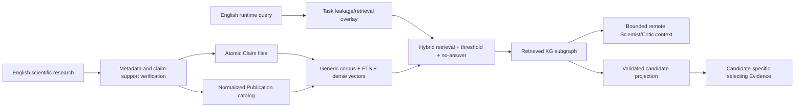

# English atomic RAG → KG production architecture

Date: 2026-08-18  
Scope: local scientific knowledge, vector retrieval, KG materialization, remote-agent
context, and candidate-selection boundaries

## Decision

The project now uses an **English-only, evidence-gated atomic hybrid RAG** as the
external scientific-knowledge entrance to the KG.

The key boundary is that retrieval relevance is not a fitness effect. Retrieved
chunks enter the graph as literature context. Only a separately validated,
candidate-specific calibration may convert a retrieved claim into an `Evidence`
record with `contributes_to_selection=true`.



## Implemented data contracts

### Generic corpus and vector index

The generic database is
`artifacts/local_knowledge/corpus/directed_evolution-v4.sqlite`. It stores only:

- target-independent documents and atomic chunks;
- English FTS5 index entries (`porter unicode61`);
- model-fingerprinted dense embeddings;
- a content/config/model manifest.

It does not store a target name, target quarantine flag, query history, round ID, or
selection result. The former `artifacts/local_knowledge/gb1.sqlite` is a legacy
artifact and is no longer referenced by current configuration.

### Task-specific overlay

`artifacts/local_knowledge/overlays/gb1.sqlite` stores:

- document allow/quarantine decisions derived from GB1 aliases and sequence;
- protected-term hashes;
- sanitized English queries and result IDs;
- the corpus manifest hash used for each decision.

This split lets several tasks share one read-mostly vector corpus while retaining
independent leakage policies and audit histories.

### Atomic scientific records

The searchable corpus contains 20 English files under
`resources/local_knowledge/directed_evolution/claims/`. Each file has exactly one
`scientific-atomic-claim:v1` statement with:

- stable `claim_id`, subject, predicate, object, and polarity;
- claim kind, confidence, applicability, and selection eligibility;
- one or more CitationSupport records;
- no repeated bibliography and no target labels.

Nineteen publications are normalized once in
`resources/local_knowledge/directed_evolution/catalog/publications.yaml`.

The RAG → KG conversion is:

```text
Document --HAS_CHUNK--> DocumentChunk --ASSERTS--> Claim
Claim --SUPPORTED_BY_CITATION--> CitationSupport
CitationSupport --CITES_PUBLICATION--> Publication
CitationSupport --DERIVED_FROM--> DocumentChunk
Claim --SUPPORTED_BY_SOURCE--> Evidence (context-only)
```

`CitationSupport` is deliberately distinct from `Publication`: DOI metadata can be
correct while a proposed claim is unsupported or applies only under narrower
conditions.

## Runtime retrieval logic

1. Runtime prefetch and KG-tool queries are constructed in English. With strict
   language mode, a CJK query is rejected and audited instead of silently searching
   the English corpus.
2. The target overlay sanitizes target identifiers and blocks target-derived corpus
   documents without changing the generic index.
3. FTS5 supplies lexical candidates. BGE supplies dense candidates. Hybrid RRF ranks
   their union, and production requires a dense match above the calibrated threshold.
4. The dense threshold is `0.50`. If no chunk clears it, retrieval returns no chunks
   and the explicit warning `no_answer_above_retrieval_threshold`.
5. Optional reranking occurs only on the bounded candidate set. It is not enabled in
   the default 20-claim corpus because no scientific-domain reranker threshold has yet
   been calibrated.
6. Token and per-document budgets are applied after task-policy filtering.
7. Atomic front matter becomes a typed `Claim`; citation links resolve against the
   Publication catalog. Missing publications fail graph construction.
8. With `allow_remote_context=true`, only the bounded, policy-approved retrieved
   evidence is appended to Scientist/Critic prompts, explicitly marked as untrusted
   quoted evidence.

Raw RAG Evidence retains `variant_id=context:<protein>`, `score=0.0`, and
`contributes_to_selection=false`. This is intentional. When selection contribution is
enabled, `CandidateEvidenceProjector` requires a versioned calibration file with
`status: validated`, a dataset-manifest hash and validation metrics, and a
source-verified eligible claim. It then matches that claim to a concrete candidate
feature and emits a different candidate-specific Evidence ID, score, confidence, and
calibration hash. A draft, unverified source, or missing calibration fails closed.

## Chunking and vector reliability

The old character approximation has been replaced by the selected embedding model's
own tokenizer.

- An atomic claim is one chunk. It is rejected if it exceeds the model limit; it is
  never silently truncated.
- Non-atomic documents use token-aware boundary search and token-aware overlap.
- The configured budget is 384 tokens; the BGE model limit is 512.
- Document and query encoders are separate so asymmetric model profiles can be added.
- BGE queries use `Represent this sentence for searching relevant passages:` while
  documents do not receive that prefix.
- Vectors are L2 normalized; retrieval computes cosine similarity.

Cosine similarity is a learned semantic relevance estimate, not scientific truth,
causal similarity, or fitness similarity. Hybrid lexical matching helps identifiers
and exact scientific terms, while the dense gate handles paraphrase and provides the
no-answer boundary. Confidence is derived from dense/reranker margin, not RRF rank.

## Model and tokenizer research

The tokenizer must always be the tokenizer packaged with the chosen embedding model.
A standalone “better scientific tokenizer” cannot safely be substituted after model
training because token IDs and embeddings are jointly learned. SciBERT's scientific
WordPiece vocabulary shares only 42% of its tokens with BERT's base vocabulary,
illustrating domain vocabulary differences, but SciBERT is a language encoder rather
than a ready-made passage retrieval model ([SciBERT paper](https://aclanthology.org/D19-1371/)).
SentencePiece is useful when training a new raw-text, language-independent subword
model, not as a runtime replacement for a pretrained retriever's tokenizer
([SentencePiece paper](https://aclanthology.org/D18-2012/)).

| Model | Intended use here | Size/context/dimension | CPU assessment | Decision |
|---|---|---|---|---|
| BAAI `bge-small-en-v1.5` | English atomic passage retrieval | 384 dimensions, 512 tokens; the official card reports 51.68 MTEB retrieval average | Smallest well-established option evaluated here; actual CPU query test passed | **Default** ([model card](https://huggingface.co/BAAI/bge-small-en-v1.5)) |
| NASA/IBM INDUS 38M | Multi-domain scientific retrieval where a smaller science-specific encoder is desired | Distilled scientific embedding family | Likely CPU-friendly, but narrower and less independently validated for this protein claim set | Experimental challenger ([INDUS paper](https://aclanthology.org/2024.emnlp-industry.9/)) |
| NCBI MedCPT | Biomedical query-to-article retrieval plus cross-encoder reranking | Paired retriever/reranker trained from 255M PubMed query-article pairs; combined system reported as 330M | CPU-capable but materially heavier and asymmetric | Optional biomedical profile, especially for PubMed abstract retrieval ([MedCPT paper](https://academic.oup.com/bioinformatics/article/39/11/btad651/7335842)) |
| SPECTER2 | Related-paper discovery from title/abstract and citation structure | Scientific document representation with task-format adapters | Reasonable for offline paper indexing, but not trained as atomic claim QA | Use only in a separate publication-discovery index ([SciRepEval/SPECTER2](https://aclanthology.org/2023.emnlp-main.338/)) |
| `gte-modernbert-base` | Long scientific passages that cannot be atomized | 149M parameters, 8,192 tokens, 768 dimensions | CPU use is possible but slower and unnecessary for current 40-token claims | Long-context fallback ([model card](https://huggingface.co/Alibaba-NLP/gte-modernbert-base)) |
| Qwen3-Embedding-0.6B | High-capacity multilingual/long-context retrieval | 0.6B parameters, 32K context, 1,024 dimensions | Too large for the project's “fast CPU default” objective | Do not use as default ([official release](https://qwenlm.github.io/zh/blog/qwen3-embedding/)) |

The present recommendation is therefore BGE small for the online first stage, with an
optional MedCPT article encoder/cross-encoder profile when the corpus expands into
biomedical abstracts. SPECTER2 should index papers, not atomic facts.

## Architecture comparison

| Architecture | Strength | Mismatch or role in this project |
|---|---|---|
| Fixed top-k vector RAG | Simple and fast | Rejected: it always returns something and cannot safely enter selection |
| Self-RAG | Learns when to retrieve and critiques generations | Requires a specially trained generator and reflection tokens; use its retrieval/critique principle, not its model dependency ([ICLR 2024 paper](https://openreview.net/pdf?id=hSyW5go0v8)) |
| Corrective RAG | Evaluates retrieval quality and triggers corrective search | Strong match for the external research skill: no-answer can route to verified web/literature research rather than inventing context ([CRAG paper](https://arxiv.org/abs/2401.15884)) |
| Microsoft GraphRAG | Community summaries improve corpus-wide global questions | Useful for literature landscape reports, but community summaries are lossy and should not become selecting evidence ([GraphRAG paper](https://arxiv.org/abs/2404.16130)) |
| HippoRAG | KG + Personalized PageRank supports efficient multi-hop integration | Best future retrieval layer after enough normalized Claim/Publication/entity edges exist; unnecessary for the present 20-claim corpus ([NeurIPS 2024 paper](https://proceedings.neurips.cc/paper_files/paper/2024/hash/6ddc001d07ca4f319af96a3024f6dbd1-Abstract-Conference.html)) |
| Deep-research agent | Iterative search, source reading, contradiction checks, synthesis | Best as an asynchronous ingestion process, not in the latency-sensitive campaign loop |

The recommended evolution path is:

1. Keep the current atomic hybrid retriever as the deterministic first-stage gateway.
2. Route no-answer or low-confidence questions to the scientific ingestion skill.
3. Stage new findings; verify Publication metadata and CitationSupport before indexing.
4. Add a corpus-level evidence graph when enough cross-claim entities exist.
5. Add HippoRAG-style graph traversal for multi-hop queries and GraphRAG community
   summaries only for corpus-wide literature synthesis.
6. Keep the task overlay, round KG, and candidate calibration separate from the
   immutable corpus graph.

## Blocker remediation status

| Previous issue | Current status |
|---|---|
| Dense off, empty model, zero embeddings | Fixed: pinned BGE model, hybrid default, 20/20 embeddings |
| Lexical index did not backfill when dense was enabled | Fixed: incomplete/model-mismatched embeddings force a rebuild; tested 0 → 20 |
| All chunks truncated | Fixed: model-token chunking; 0/20 truncated, maximum 40/512 tokens |
| Selection flag rejected unconditionally | Fixed safely: accepted only with validated candidate projection; draft/missing calibration rejected |
| Context Evidence had zero score and context variant | Preserved as non-selecting context; selecting projection now creates candidate-specific Evidence |
| KG adapter hardcoded a conflicting selection flag | Fixed: local chunks remain context-only; candidate Evidence flows through the ordinary inference adapter |
| Fixed backend name | Fixed: model ID, pinned revision, full local weight/config hash, dimension, prefixes, and limit are fingerprinted |
| Stale manifest possible with same dimension | Fixed: manifest includes full embedding fingerprint and verifies actual chunk/embedding counts |
| No threshold/no-answer | Fixed: dense threshold 0.50 and explicit no-answer |
| Chinese FTS/query mismatch | Fixed by an English-only corpus/query contract and English stemming tokenizer |
| Python row-by-row dense scoring | Improved to vectorized NumPy exact search and capped at 50,000 chunks; ANN remains required beyond that cap |
| Reranker absent | Provisioning supports pinned MedCPT cross-encoder; activation remains pending domain threshold calibration |
| Prompt-like content only warned | Fixed: default ingestion and retrieval policy rejects it |
| GB1 corpus database mixed generic and target state | Fixed: generic corpus/index and GB1 overlay are separate SQLite files |

## Executed evidence

The strict diagnostic artifact is
`artifacts/rag-diagnostics/english-atomic-bge-v6/diagnostic.json`.

- 20 documents → 20 atomic chunks → 20 finite, unit-normalized 384-D vectors.
- 0 truncated chunks; maximum model input was 40 tokens out of 512.
- Dense, lexical, and hybrid hit@3 were all 1.00 on eight English typed queries.
- An unrelated tax/parking query returned explicit no-answer.
- Lexical-only → dense migration backfilled 0 → 20 embeddings.
- KG output contained `Document`, `DocumentChunk`, `Claim`, `CitationSupport`,
  `Publication`, and `Evidence`, with all normalized citation relations.
- On this Windows CPU and 20-chunk corpus, mean dense query time was approximately
  12 ms and mean hybrid time approximately 14 ms; these are smoke timings, not scale
  benchmarks.

The bundle validator reported zero errors. It also correctly reported that all 20
claim-support links remain `verified_against_source=false`: publication metadata was
verified through Crossref, but full-text locators were not independently audited in
this change. Those claims must remain limited-confidence scientific priors until that
verification is completed.

## Remaining production work

- Build a larger positive/negative query set and calibrate threshold, top-k, and
  reranker by knowledge type; eight queries are only a smoke benchmark.
- Verify each CitationSupport against abstract/full text and record a precise locator.
- Benchmark BGE small, INDUS 38M, and MedCPT on project queries before changing the
  default.
- Replace exact NumPy search with sqlite-vec, HNSW, Qdrant, pgvector, or another ANN
  backend before the corpus exceeds the configured 50,000-chunk cap.
- Validate a candidate-effect calibration using visible folds before enabling
  `contributes_to_selection=true` in the production YAML.

## Research method and disclosure

Searches were conducted in English on 2026-08-18 using multiple web/search routes,
official model cards, ACL Anthology, OpenReview, NeurIPS proceedings, arXiv, Crossref,
and publisher pages. Model-card benchmark numbers are self-reported unless tied to a
peer-reviewed benchmark paper. AI assisted source discovery, code changes, and report
drafting; local execution, manifest inspection, tokenizer checks, and test results are
reported from repository artifacts.
