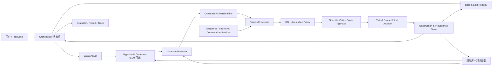
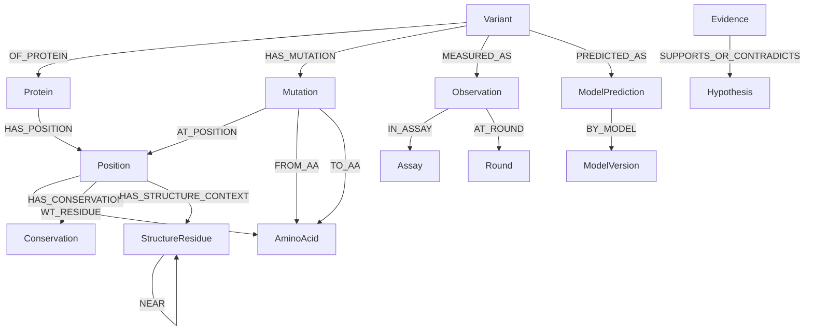

# fitness-agents：虚拟蛋白质定向进化智能体项目搭建策略

> 版本：v1.0（2026-08-14）  
> 默认任务：提高 GB1（protein G B1 domain）的 IgG 结合 fitness  
> 目标：先做一套一周内可复现、可消融、无标签泄露的小型闭环，再逐步接入结构模型与真实实验平台。
> 实施更新（2026-08-14）：按当前开发要求，首版代码不接入 EVOLVEpro 的轻量 PLM+RF 架构；默认使用 one-hot 上位性特征的 Ridge + ExtraTrees 异质集成，并保留 predictor 插件接口。
> 需求澄清（2026-08-15）：知识图谱是贯通序列、结构、理化证据、模型输出和迭代历史的知识/记忆层，但项目主目标仍是验证知识增强闭环能否在固定实验预算下提升 fitness 发现效率，而不是单独交付一个图数据库。

## 0. 执行摘要与关键决策

本项目不应把“LLM 会不会说出一个看似合理的突变”作为核心能力，而应把它实现为一个受约束、可审计的 **Design–Score–Select–Test–Learn** 系统：

1. **数值 fitness 由专用模型计算，LLM 不直接生成 fitness 数字。** LLM 负责解析目标、提出可检验假设、调用工具、比较证据和解释决策。
2. **MVP 选择 GB1 四位点组合景观。** 名义空间为 `20^4 = 160,000`，FLIP 提供 149,361 条带实验 fitness 的完整表；它既能表达上位性，又允许隐藏真实标签来严格模拟 2–3 轮虚拟实验。
3. **同时保留“候选 oracle 池”和从未查询的 final test。** 文档所说“用测试集真实 fitness 作为虚拟实验评估器”在工程上应拆成两层：被选中时才揭示标签的 `oracle_pool`，以及直到所有迭代结束都不可访问的 `final_test`。否则模型会通过迭代间接见到测试集，造成泄露。
4. **先做强而透明的低样本基线，再加深模型。** One-hot + Ridge/Random Forest/ExtraTrees、ESM-2 embedding + RF、Gaussian Process/模型集成应先于全量微调大模型。近期 FLIP2 和 ALDE 都提示：低样本条件下简单模型常与深模型相当，且不确定性质量比模型规模更重要。
5. **主优化器采用批量主动学习，不把 RL 作为 MVP 的主线。** 首选 Greedy、UCB、Thompson Sampling（TS）和批内多样性约束；RL/上下文 bandit 作为统一策略接口下的扩展和离线消融。
6. **结构、保守性、理化性质作为独立可开关的证据通道。** 这既满足“知识增强需可拆分消融”，也能判断提升究竟来自预测模型、候选生成、知识过滤还是 LLM。
7. **ipTM 只作为复合物可信度/二分类结合的辅助证据，不作为结合 affinity 或实验 fitness 的替代标签。** BindCraft 明确提醒 ipTM 并非良好的 affinity 预测器，推荐生成大量候选、多指标过滤并实验验证。
8. **Agent 的价值用行为和因果消融验证。** 除每轮最高 fitness 外，还评估无效序列率、候选多样性、证据使用率、工具调用深度、解释忠实度，以及移除 LLM/KG/结构/UQ 后的差异。
9. **知识图谱采用“观测为中心”的受控工具接口。** 序列/突变是实体，结构、理化与保守性是带来源的 evidence，轻量模型输出是 prediction，真实标签是绑定 assay/round 的 observation；Agent 通过 allow-listed query 读取，不能执行任意 SQL，也不能看到当轮尚未揭示标签。

## 1. Word 要求的可追踪实现

| 文档中的重点要求 | 本方案对应实现 | 验收产物 |
|---|---|---|
| 评估数据大小、下载命令、极小 demo | §5：FLIP GB1/ProteinGym 数据规模、可执行下载命令、512 条 demo | `data_manifest.yaml`、下载脚本、`gb1_demo_512.csv` |
| 训练/验证/测试 | §5.5：observed train、validation、oracle pool、final test 四层隔离 | split manifest、哈希、泄露测试 |
| 选择 fitness 模型与正确指标 | §6–7：透明基线、集成与 UQ；Spearman/NDCG/Top-k/EF 为主 | 模型卡、预测表、校准图 |
| 模拟科学家 | §8、§12：受约束的假设—设计—评估—批判—迭代状态机 | Agent trace、结构化决策记录 |
| 知识库/规则库/KG | §10：位点—突变—性质—观察—fitness 的带溯源图谱 | KG snapshot、查询日志 |
| 知识模块可拆分消融 | §13：规则、理化、保守、结构、KG、LLM 分别开关 | factorial ablation 表 |
| 至少 2–3 轮 | §9：默认 3 轮；demo 每轮 16 个，正式实验每轮 96 个 | round 0–3 artifacts |
| 四种方法比较 | §13.1：随机、模型直接、普通 LLM Agent、知识增强 Agent | 同预算、同初始集、同 seeds 对比 |
| 成功/失败案例与“是否真正学到科学家思维” | §13.4、§14：反事实与行为指标 | failure taxonomy、忠实度审计 |
| 主动学习/RL、不确定性/集成、多点、结构、KG、交互、实验平台 | §6、§9–12、§15 | 可插拔模块与阶段路线图 |

## 2. 近期研究结论：哪些策略真正值得引入

### 2.1 Directed evolution 与 fitness 模型

下表优先列出可核验的论文原文数据；不同论文的任务、split 和指标并不完全相同，**数字不可直接横向排名**。

| 工作 | 核心贡献及对本项目的启示 | 训练/适配数据 | 测试与 performance |
|---|---|---|---|
| [ProteinGym（NeurIPS D&B 2023；当前官方仓库 v1.3）](https://github.com/OATML-Markslab/ProteinGym) | 标准化跨蛋白 DMS、统一“越高越好”的方向、同时提供 Spearman、NDCG、AUC、MCC、Top-k recall；是选择指标和外部泛化测试的首要依据。 | 零样本模型不使用目标 assay 标签；监督模型使用 assay 内 CV。当前 substitution benchmark 为约 270 万 missense、217 个 DMS assays。 | 原始论文榜单中 TranceptEVE-L 零样本校正平均 Spearman 0.456；监督评估更高但取决于 split。官方当前数据另含约 30 万 indels、74 个 assays。 |
| [ProteinNPT（NeurIPS 2023）](https://proceedings.neurips.cc/paper_files/paper/2023/file/6a4d5d85f7a52f062d23d98d544a5578-Paper-Conference.pdf) | 用非参数 Transformer 在同一上下文中联合建模序列与 assay 标签；适合有少量目标蛋白标签的监督预测，也提醒 random split 明显偏乐观。 | ProteinGym assay 内训练；contiguous、modulo、random 三种 CV；同时评估多突变。 | 论文聚合 Spearman：0.547 / 0.564 / 0.730，平均 0.613；对应 MSE 平均 0.683；多突变中在 17 个 assays 的 14 个超过基线。 |
| [Kermut（NeurIPS 2024）](https://proceedings.neurips.cc/paper_files/paper/2024/file/34547650b2ca69d91f3b3c3ae8b21962-Paper-Conference.pdf) / [代码](https://github.com/petergroth/kermut) | Gaussian Process 的复合 kernel 同时使用 ESM-2 序列表示、ProteinMPNN 的结构条件分布、突变位点三维距离和零样本均值；天然给 posterior uncertainty。是本项目“结构 + UQ”主参考。 | ProteinGym 217 assays，assay 内三类 CV；ESM-2 650M 表示，结构来自 ProteinGym/AF2。 | 原论文 Spearman 0.610 / 0.633 / 0.744，平均 0.662；2024-04 修正 split 后为 0.591 / 0.631 / 0.744，平均 0.655。原表 MSE 平均 0.589；4 个校准分析数据集总体 ECE 良好，但逐实例误差相关性仍不稳定。 |
| [SaProt（ICLR 2024）](https://proceedings.iclr.cc/paper_files/paper/2024/file/1c42513b8895ab11fbbb5b7e8e6b6b02-Paper-Conference.pdf) / [代码](https://github.com/westlake-repl/Saprot) | 将氨基酸与 Foldseek 3Di 结构字母组合成 token；说明结构信息可在 PLM 表示层注入。适合作为 ESM-2 的可选结构增强 embedding，而非首个 baseline。 | 原始 35M/650M 版本使用约 4,000 万 AF2 结构序列对，650M 另有 PDB 阶段。 | 原 ICLR 版本 ProteinGym 零样本 Spearman 0.478（无 MSA retrieval）/ 0.489（有 retrieval），ClinVar AUC 0.909。注意不同 ProteinGym 版本的榜单值不可混用。 |
| [S3F / S3F-MSA（NeurIPS 2024）](https://proceedings.neurips.cc/paper_files/paper/2024/file/b7d795e655c1463d7299688d489e8ef4-Paper-Conference.pdf) | 融合 sequence–structure–surface 多尺度表示；说明“结构”不应只是一项 pLDDT，而应包括局部残基与表面环境。 | 预训练表征用于 ProteinGym 零样本评分；S3F-MSA 再融合 MSA。 | ProteinGym 校正平均 Spearman：S3F 0.470，S3F-MSA 0.496；同表 SaProt 0.457、ESM-2 0.414、TranceptEVE-L 0.456。 |
| [FSFP（Nature Communications 2024）](https://www.nature.com/articles/s41467-024-49798-6) / [代码](https://github.com/ai4protein/FSFP) | Meta-transfer learning + learning-to-rank + LoRA；与“找到 top mutants”的目标一致。它从相似蛋白数据和 MSA pseudo-label 学初始化，再用极少目标标签适配。 | 87 个 ProteinGym DMS；目标蛋白 20/40/60/80/100 个随机单点标签，5 个随机 split；辅助任务为两个近邻蛋白 DMS + GEMME pseudo-label。 | 20 个标签时可将多种 PLM 的平均 Spearman 提高最多约 0.1；Phi29 DNA polymerase 湿实验中，第二批 top-20 的 positive rate 提高 25%。 |
| [UQ benchmark（PLOS Computational Biology 2024）](https://journals.plos.org/ploscompbiol/article?id=10.1371/journal.pcbi.1012639) | 比较 BRR、GP、dropout、ensemble、evidential、MVE、SVI；结论是不存在全局最优 UQ，校准好也不保证主动学习好。故本项目必须同时评估 prediction、calibration 和 acquisition utility。 | FLIP 的 GB1、AAV、Meltome；8 个随机或 domain-shift 任务；one-hot 与 ESM-1b embedding。 | 不确定性采样通常在主动学习后期优于随机；BO 通常优于随机，但在其实验中没有 UQ 方法稳定超过 greedy。 |
| [EVOLVEpro（Science 2025）](https://doi.org/10.1126/science.adr6006) / [代码](https://github.com/mat10d/EvolvePro) | PLM embedding + 轻量 Random Forest，以轮次标签更新 top-layer；证明低样本主动学习可以比单纯 zero-shot 更有效。项目可直接借鉴其 process–PLM–run–plot 分层。 | 12 个 DMS datasets，覆盖病毒蛋白、核酸酶、DNA/RNA binding、kinase 等；模拟仅在选中候选后揭示真值。 | 10 轮 × 16 个时模拟最高可达 WT 的 2.2 倍；5×16 约等于静态预训练 160 个，10×16 约等于 500 个。六类湿实验实现约 2–515 倍的不同性质提升，包括抗体结合最高 40 倍。 |
| [ALDE（Nature Communications 2025）](https://www.nature.com/articles/s41467-025-55987-8) / [代码](https://github.com/jsunn-y/ALDE) | 批量 Bayesian optimization + calibrated UQ；比较编码、GP、boosting/DNN ensembles、deep kernel 和 Greedy/UCB/TS。最适合作为本项目 loop 和 artifact 格式的直接基础。 | 近完整 GB1、TrpB `20^4` 景观模拟；ParPgb 五个活性位点湿实验。默认模拟 initial 96、每批 96、总新增预算 384、70 seeds。 | ParPgb 三轮、仅探索约 0.01% 空间，使目标产物收率从 12% 到 93%；最终变体总收率 99%、14:1 选择性。作者报告 frequentist UQ 更稳定、深模型不总占优。 |
| [PLMeAE：PLM + 自动生物铸造厂（Nature Communications 2025）](https://www.nature.com/articles/s41467-025-56751-8) | ESM-2 zero-shot 初始化，实验标签训练两层 MLP，再闭环到 96 孔自动化平台；给出了真实 DBTL 接口规模。 | GB1 in-silico；pCNF-RS 每轮约 96 个实验变体，四轮共 384。 | 四轮约 10 天，最佳酶活提升 2.4 倍、目标蛋白产量提升 12.2 倍；第二/三轮高于 WT 的比例约 50%/62.5%，随机库约 2.2%。 |
| [SAMPLE 自驱动实验室（Nature Chemical Engineering 2024）](https://www.nature.com/articles/s44286-023-00002-4) | 多输出 GP 同时预测 active/inactive 与连续性质，用 `P(active) × UCB` 避开 fitness landscape 中的非功能“洞”；提供真实机器人异常处理范式。 | P450：331 inactive + 187 active；真实 GH1 组合空间 1,352 个，4 个 agents 从同 6 条天然序列起步，每轮 3 条，共 20 轮。 | P450 分类准确率 83%、active 子集温稳 Pearson r=0.84；Expected-UCB 平均 26 次测量找到高温稳序列，样本量较标准 UCB/随机少 3–4 倍；GH1 搜索少于 2% 空间且提升至少 12°C。 |
| [FLIP2（ICML 2026）](https://flip.protein.properties/) / [论文](https://www.biorxiv.org/content/10.64898/2026.02.23.707496v2.full) | 7 个新数据集、16 个真实工程 split，覆盖突变数、位点、突变身份、fitness 和 wild-type 外推。关键启示是不能只报告 random split，且 one-hot ridge 是必须保留的强基线。 | 七类酶、PPI、光敏蛋白等；16 个 train/test/validation splits。 | 简单 ridge 在多个任务中匹配或超过 fine-tuned PLM；预训练 fine-tuning 对 CARP-640M 的 16 个 split 中 14 个、ESMC-300M 的 9 个有提升，但 position/wild-type/fitness shift 仍最难。 |
| [RoseTTAFold sequence-space diffusion / ProteinGenerator（Nature Biotechnology 2024）](https://www.nature.com/articles/s41587-024-02395-w) | 用实验分类器梯度引导 sequence-space diffusion，展示“生成先验 + 轮次 fitness 模型”的组合；适合作为远期候选生成器。 | GB1 完整四位点景观；前轮标签训练两层 MLP 分类器。 | 3 轮、每轮 96 个；论文报告平均和最大 fitness 逐轮增加，并超过其测试的最佳 BO-UCB 基线，但未给出统一跨任务数值。 |

### 2.2 蛋白质工程 Agents、Harness 与 Loop

| 系统 | 核心贡献 | 数据/验证与 performance | 对 fitness-agents 的借鉴与限制 |
|---|---|---|---|
| [ProtAgents（Digital Discovery 2024）](https://pubs.rsc.org/en/content/articlelanding/2024/dd/d4dd00013g) / [代码](https://github.com/lamm-mit/ProtAgents) | 多角色 LLM 协作，连接知识检索、结构分析、物理模拟和 ProteinForceGPT。 | 以 de novo 蛋白、结构分析、振动/力学性质为案例；没有标准 held-out DMS benchmark 或统一成功率。 | 借鉴“领域专家 + 物理工具 + critic”的职责划分；不要把定性案例当 fitness performance。仓库无顶层许可证，不能直接复制代码。 |
| [Virtual Lab（Nature 2025）](https://doi.org/10.1038/s41586-025-09442-9) / [代码](https://github.com/zou-group/virtual-lab) | PI Agent 组织免疫学、ML、计算生物、scientific critic 等角色，通过 team/individual meetings 形成 ESM + AlphaFold-Multimer + Rosetta 流程。 | 从 4 个 scaffold 设计 92 个 nanobodies 并全部进入实验；其中 2 个对 JN.1/KP.3 获得更好结合且保留祖先株结合。没有 ML train/test split。 | 借鉴角色、会议 trace 和人类高层反馈；MVP 改成有限状态机，避免自由对话消耗和不可复现。 |
| [AutoProteinEngine（COLING Industry 2025）](https://aclanthology.org/2025.coling-industry.36.pdf) / [代码](https://github.com/tsynbio/AutoPE) | NL→任务验证→数据补全→模型选择→多模态 late fusion→HPO→结果解释。 | Brazzein 435 个突变、STM1221 234 个活性分数；80/20 random、5-fold validation。AutoPE+HPO：Brazzein F1 0.7306±0.04、SRCC 0.4621±0.03；STM1221 RMSE 0.3488±0.19、R² 0.6805±0.09。 | 借鉴 `TaskSpec`、数据检索和 model zoo；HPO 由 Optuna/Ray 等确定性引擎执行，LLM 只提出范围和解释。样本小且 random split，外推结论应谨慎。仓库无顶层许可证。 |
| [BioDesignBench（2026 preprint）](https://doi.org/10.64898/2026.05.06.723381) / [代码](https://github.com/RomeroLab/BioDesignBench) | 76 个专家任务、统一 AgentInterface、MCP tool provider、trace audit、强制评估深度干预；直接针对蛋白设计 Agent 的行为评估。 | 4 个前沿 LLM；最强 Agent 超过 hardcoded pipeline 的 54.2 分，但对每个候选调用评估工具的深度仅为专家的 14%；评估深度与总分 Spearman ρ=0.685。 | 直接借鉴 task JSON、AgentOutput、tool trace、forced-depth、sandbox、评分分层；强调“生成很多候选后必须多指标反复评估”。目前是预印本且私有 benchmark 任务不可获取。 |
| [protein-design-mcp](https://github.com/jasonkim8652/protein-design-mcp) | 将 RFdiffusion、ProteinMPNN、ESMFold/AF2、Boltz-2、PyRosetta、ESM2、OpenMM 暴露为 19 个带 JSON schema 的原子/复合工具；支持 Docker、远程 GPU proxy、异常类型。 | 这是工具层，不是 fitness benchmark；CPU 10 个、GPU 核心 13 个、全选依赖隔离后 19 个。 | 直接借鉴 typed tool contract、CPU/GPU 服务隔离、atomic/composite 模式、超时与异常。Boltz 与 RFdiffusion 的 PyTorch 依赖冲突应以两个容器/服务解决。 |
| [BindCraft](https://github.com/martinpacesa/BindCraft) | AF2 backpropagation → ProteinMPNN → 多 AF 模型复核 → Rosetta/界面过滤，强调批量生成和多层 rejection。 | 官方建议至少得到 100 个通过过滤的设计，再选 5–20 个实验；ipTM 适合二分类结合但不是 affinity 的好预测器。 | 借鉴多级过滤、模型自一致性和 stop criteria；不把 ipTM 单独作为 fitness。PyRosetta 另有许可要求。 |

### 2.3 推荐直接借鉴的代码边界

| 来源 | 建议复用 | 不应照搬 | 许可证注意 |
|---|---|---|---|
| ALDE | `Objective/Production` 分离、BO loop、Greedy/UCB/TS、保存 `mu/sigma/indices` | 生产模式中的 0 placeholder、只支持 one-hot 的限制 | MIT，可复用并保留 notice |
| EvolvePro | process/PLM/run/plot 分层；embedding 与标签按 variant 对齐；DMS/实验双工作流 | 直接 top-n 且缺少系统 UQ 的策略 | 仓库是 MIT（麻省理工学院）Case No. 25084 的自定义 research-only EULA，并非 MIT License；先确认授权，默认只借鉴架构 |
| Kermut | composite GP、posterior UQ、结构距离/ProteinMPNN 分布 | 在 demo 上完整计算全套 650M embedding | MIT |
| BioDesignBench | Agent interface、task/result schema、tool audit、forced-depth、评分 harness | 私有任务或泄露其 benchmark 内容 | 本地仓库许可证为 Apache-2.0 |
| protein-design-mcp | 工具 JSON schema、sidecar、异常、benchmark 模式隐藏复合工具 | 将所有 GPU 模型塞入同一 Python 环境 | Apache-2.0；PyRosetta 单独许可 |
| Virtual Lab | PI/specialist/critic 角色与决策 trace | 无边界多轮会议作为默认执行器 | MIT |
| AutoPE / ProtAgents | TaskSpec、model zoo、领域角色 | 直接复制代码 | 两仓库未见顶层许可证，只做方法参考 |
| FLIP | GB1 数据、split 语义、baseline 评估 | 把 random split 当主要结果 | 派生数据 AFL-3.0；原始 GB1 标注 CC BY 4.0，需保留来源 |

## 3. 项目范围与成功定义

### 3.1 MVP 科学问题

给定 GB1 野生型序列和位点 39、40、41、54 的历史突变—结合 fitness 数据，在每轮固定实验预算下，推荐下一批多点突变，使被揭示的真实实验 fitness 逐轮提高。

MVP 的范围刻意限定为 **固定四位点组合优化**：

- 可以穷举候选空间，隔离“候选生成能力”和“排序能力”；
- 完整标签只存在于 oracle service，Agent 和模型看不到；
- 上位性明显，足以检验单点组合规则的失效；
- 可在 CPU 上完成 baseline；结构/PLM 特征可预计算；
- 绑定任务允许增加界面、保守性、ipTM/界面能量等知识通道，但不会因此替代 DMS 标签。

### 3.2 成功标准

系统成功不是“找到全局最优一次”，而是同时满足：

- **科学效果**：3 轮后 `best_seen_fitness`、`top-k mean`、`top-1% hit rate` 相对随机显著提升；
- **模型效果**：在 final test 上 Spearman/NDCG/Top-k recall 超过 one-hot ridge 或给出可信失败解释；
- **不确定性效果**：90% 区间覆盖率接近名义覆盖、区间宽度可接受，OOD 候选不自信；
- **Agent 效果**：无非法序列/重复查询；结构化理由能回指观测、特征或 KG evidence；
- **工程效果**：固定 seed 可复现；每个模块可替换；离线模式不需要 LLM API；demo 在普通 CPU 上完整跑通；
- **公平性**：四种方法共享相同初始数据、候选池、预算、oracle、seeds 和基础预测器。

## 4. 总体架构



### 4.1 设计原则

1. **Orchestrator 负责状态，不让 Agent 自己记忆关键数据。** 每步输入输出写入 artifact store；任务可重放。
2. **LLM 与计算模型之间只通过 typed tools 通信。** 不允许 LLM 拼接 shell 或直接读取隐藏 oracle 文件。
3. **预测、获取、解释三层分离。** `FitnessPredictor` 只给 `mu/sigma`；`AcquisitionPolicy` 决定探索/利用；`Explainer` 不改变已计算结果。
4. **实验观察与模型预测使用不同实体和字段。** 任何 UI/报告必须明显标注 `measured` 或 `predicted`。
5. **所有知识增强均配置化。** `physchem/conservation/structure/kg/llm` 五个开关支持单独消融。

### 4.2 建议仓库结构

```text
fitness-agents/
├─ configs/
│  ├─ task/gb1_binding.yaml
│  ├─ model/baseline.yaml
│  ├─ policy/{greedy,ucb,ts}.yaml
│  └─ ablation/*.yaml
├─ data/{raw,interim,processed,demo}/
├─ src/fitness_agents/
│  ├─ contracts/          # Pydantic schemas / Protocols
│  ├─ data/               # download, validate, normalize, split, registry
│  ├─ features/           # one-hot, PLM, physchem, conservation, structure
│  ├─ models/             # ridge, RF, ExtraTrees, GP, ensemble, calibration
│  ├─ mutation/           # parser, enumerator, generator, hard constraints
│  ├─ acquisition/        # greedy, UCB, TS, EI, batch diversity
│  ├─ knowledge/          # rules, KG schema, queries, provenance
│  ├─ agents/             # analyst, hypothesis, critic, explainer
│  ├─ tools/              # typed local/HTTP/MCP adapters
│  ├─ loop/               # finite-state orchestrator, oracle/lab adapter
│  ├─ evaluation/         # prediction, loop, agent, ablation metrics
│  └─ reporting/          # tables, figures, model cards, run summary
├─ services/
│  ├─ structure/          # optional GPU sidecar
│  ├─ plm/                # embedding cache service
│  └─ oracle/             # hidden-label service in simulation
├─ app/                   # Streamlit/Gradio demo
├─ tests/{unit,integration,e2e,leakage}/
├─ artifacts/runs/<run_id>/
├─ pyproject.toml
├─ Makefile
└─ README.md
```

### 4.3 核心接口

```python
class FeatureProvider(Protocol):
    def transform(self, variants: list[Variant]) -> FeatureBatch: ...

class FitnessPredictor(Protocol):
    def fit(self, observed: Dataset, validation: Dataset) -> ModelRef: ...
    def predict(self, variants: list[Variant]) -> PredictionBatch: ...

class CandidateGenerator(Protocol):
    def generate(self, state: CampaignState, hypothesis: Hypothesis) -> list[Variant]: ...

class AcquisitionPolicy(Protocol):
    def select(self, predictions: PredictionBatch, budget: int) -> SelectionBatch: ...

class ExperimentBackend(Protocol):
    def submit(self, batch: SelectionBatch) -> ExperimentRun: ...
    def collect(self, run_id: str) -> list[FitnessObservation]: ...
```

`Prediction` 的最小字段为：

```json
{
  "variant_id": "sha256:...",
  "fitness_mean": 1.42,
  "fitness_std": 0.31,
  "interval_90": [0.91, 1.93],
  "ood_score": 0.18,
  "component_scores": {"ridge": 1.20, "rf": 1.51, "gp": 1.45},
  "model_version": "ensemble-gb1-r2",
  "is_measured": false
}
```

## 5. 数据策略

> 各候选测试数据集的样本测试目标、优化的工程性质，以及"只选 1–2 个任务"时的选择依据（主任务 GB1 + 第二任务 avGFP），详见配套文档 [fitness-agents-测试数据集目标与任务选择.md](./fitness-agents-测试数据集目标与任务选择.md)。

### 5.1 数据源、体量与用途

| 数据 | 当前规模 | 本项目用途 | 资源成本 |
|---|---:|---|---|
| FLIP GB1 full | 149,361 variants；CSV 解压约 46.4 MB；zip 约 2.66 MB | 主 oracle、三轮闭环、上位性、多点突变 | CPU/内存友好 |
| FLIP GB1 active split files | 每个 split 8,733 行；5 个 CSV 各约 2.5 MB；zip 约 1.24 MB | 与 FLIP split 结果对齐、快速预测基准 | 很小 |
| ProteinGym v1.3 substitution | 217 DMS、约 270 万 variants；解压约 1.0 GB | 二期跨蛋白外部验证、迁移学习 | 中等 |
| ProteinGym v1.3 structures | 解压约 84 MB | 结构特征与 Kermut/SaProt 风格实验 | 小 |
| ProteinGym v1.3 MSAs | 解压约 5.2 GB | 保守性、GEMME/EVE 类评分 | 可选，demo 不下载 |

本地核验 FLIP full 的 Hamming depth 为：WT 1、单点 76、双点 2,091、三点 26,019、四点 121,174；所有 149,361 条都有 fitness。FLIP 的 `keep=True` 子集为 8,733 条，因此必须在 manifest 中明确使用 full 还是 curated 子集，不能混报样本数。

### 5.2 已核对的下载命令（PowerShell）

主数据：

```powershell
New-Item -ItemType Directory -Force external, data/raw/gb1 | Out-Null
git clone --depth 1 https://github.com/J-SNACKKB/FLIP.git external/FLIP
Expand-Archive `
  -LiteralPath external/FLIP/splits/gb1/four_mutations_full_data.csv.zip `
  -DestinationPath data/raw/gb1 `
  -Force
```

二期 ProteinGym（官方当前版本 v1.3，约 1.0 GB 解压）：

```powershell
New-Item -ItemType Directory -Force data/raw/proteingym | Out-Null
curl.exe -L `
  -o data/raw/proteingym/DMS_ProteinGym_substitutions.zip `
  https://marks.hms.harvard.edu/proteingym/ProteinGym_v1.3/DMS_ProteinGym_substitutions.zip
Expand-Archive `
  -LiteralPath data/raw/proteingym/DMS_ProteinGym_substitutions.zip `
  -DestinationPath data/raw/proteingym/substitutions `
  -Force
```

来源、大小和版本以 [ProteinGym 官方 Resources](https://github.com/OATML-Markslab/ProteinGym#resources) 与 [FLIP 官方仓库](https://github.com/J-SNACKKB/FLIP) 为准；下载后保存 SHA-256、license、URL、下载时间和行数。

### 5.3 极小规模 demo

必须实现并在 CI 验证以下 CLI：

```powershell
python -m fitness_agents.data.make_demo `
  --input data/raw/gb1/four_mutations_full_data.csv `
  --output data/demo/gb1_demo_512.csv `
  --n-total 512 `
  --n-initial 64 `
  --n-validation 32 `
  --n-final-test 64 `
  --rounds 3 `
  --batch-size 16 `
  --seed 20260814
```

512 条的分配：

- `initial_observed=64`：Round 0 可见标签；
- `validation=32`：只用于模型/集成权重与校准；
- `oracle_pool=352`：标签加密或放在独立 service 中，只有被选中后才能返回；
- `final_test=64`：全程不可查询，最后一次性评估；
- 3 轮 × 16 个查询，共最多揭示 48 个 oracle 标签。

采样由 benchmark builder 用固定 seed 按 Hamming depth 分层；fitness 仅可用于一次性的 final-test 分位数覆盖检查，运行时的 Agent、候选生成、模型选择和 prompt 都不能访问未揭示标签。

### 5.4 统一数据 schema

```text
protein_id, assay_id, source_dataset, source_row_id
wt_sequence, variant_sequence, mutation_notation, mutation_count
position, wt_aa, mutant_aa                  # 长表可一突变一行
raw_fitness, normalized_fitness, directionality
measurement_se, replicate_count, assay_condition
split_role, round_revealed, is_label_visible
structure_id, chain_id, residue_map_version
source_url, license, checksum, created_at
```

处理规则：

1. 只允许 20 种标准氨基酸；序列长度和 WT residue 必须一致；突变 notation 规范化后可逆。
2. `directionality` 统一为 higher-is-better，但保留 raw score，不跨 assay 直接比较绝对值。
3. WT、重复 variant、重复测量单独处理；重复测量优先保留均值、标准误和 replicate 数，而非静默去重。
4. 所有特征只从训练数据 fit；标准化器、PCA、feature selector 不得看 validation/test/oracle 隐藏标签。
5. variant ID 由 `protein + assay + canonical mutation set` 哈希，防止不同写法形成重复候选。

### 5.5 防泄露 split

```text
raw labels
├─ initial_observed  → 可训练
├─ validation        → HPO、ensemble/calibration；不并回训练直到配置冻结
├─ oracle_pool       → 只有 submit 的 batch 在该轮后揭示
└─ final_test        → 所有轮完成后才可读取一次
```

必须有以下自动检查：

- 任何 `variant_id` 不能跨 split；
- oracle service 响应数量必须等于 submitted batch 且只能响应一次；
- prompt/context 中不得出现 `raw_fitness`、oracle 文件路径或 final-test ID；
- 每轮重新训练只能使用 `round_revealed <= current_round` 的 observation；
- final-test 打开动作写入不可变 audit log，并使 campaign 进入 `FINALIZED`，禁止继续调参。

## 6. Fitness 评估模型与具体搭建

### 6.1 三层模型栈

**Level 0：必做透明基线**

- one-hot mutation code + Ridge/ElasticNet；
- BLOSUM62、AAindex/理化 delta + Random Forest 或 ExtraTrees；
- 可选 XGBoost；若引入则记录版本和 seed。

其作用是：给出可解释下限，捕捉加性效应，并防止在 64–96 个标签下用复杂模型产生虚假优势。

**Level 1：低样本主力**

- ESM-2 mean-pooled embedding、突变位点 embedding 与 WT–variant delta；
- RF/ExtraTrees bootstrap ensemble（推荐 5–10 个成员）；
- Gaussian Process：demo 使用 Hamming/physchem/embedding kernel；正式版本可接 Kermut composite kernel；
- zero-shot PLM log-likelihood ratio 作为 prior/feature，而不是实验 fitness。

**Level 2：结构与迁移增强**

- SaProt AA+3Di embedding；
- ProteinMPNN site probability、残基三维距离、SASA/二级结构/界面距离；
- MSA conservation、GEMME/EVE/ESM zero-shot 分数；
- 标签达到门槛后使用 FSFP 风格 LoRA + learning-to-rank；低于约 20–40 条时默认关闭。

### 6.2 模型集成

推荐异质集成而非只对一个深模型换 seeds：

```text
members = {
  ridge_onehot,
  extratrees_physchem,
  rf_esm_delta,
  gp_sequence_structure,
  optional_saprot_ranker
}
```

集成输出：

- `mu`: validation 上非负约束 stacking 或 rank-average；
- `sigma_epistemic`: 成员间方差 + bootstrap 方差；
- `sigma_aleatoric`: 重复实验噪声模型，数据缺失时明确为 unknown；
- `prediction_interval`: validation 上 split conformal 或 jackknife+ 校准；
- `ood_score`: 最近 observed embedding 距离、未见位点、mutation depth 和结构置信度的组合。

规则：权重只在 validation 上确定一次；不能每轮根据 oracle pool 的未揭示表现重调。若成员在 validation 上显著失效，可被 gate 降权，但必须留下原因。

### 6.3 结构信息模块

`StructureFeatureProvider` 应独立成服务，输入 sequence/structure reference，输出版本化特征：

- monomer：pLDDT、pTM、PAE、secondary structure、SASA、burial、局部 contact density；
- mutation-local：WT/mutant residue packing、与活性/界面位点距离、突变对之间 Cα 距离；
- complex：ipTM、interface pLDDT/PAE、接触数、shape complementarity、可选 Rosetta ΔΔG；
- self-consistency：至少两个结构 seeds/models 的均值与方差。

高风险约束：

- 低 pLDDT 区域的几何特征降权；
- ipTM 不进入“实验 fitness 真值”列，只进入辅助 prediction component；
- 任何 affinity 结论必须由实验 label 或经独立校准的 affinity model 支持；
- GPU 服务超时或失败时，系统降级到 sequence-only，不阻塞 demo。

### 6.4 保守位点模块

流程为 `MMseqs2/ColabFold MSA → reweight → per-site entropy/JSD → conservation feature`，并可加入：

- ESM masked marginal / LLR；
- GEMME/EVmutation 类 evolutionary score；
- 同源家族中目标 residue 的频率；
- conserved position × radical substitution 交互特征。

保守性应是 **soft penalty + 风险解释**，不是绝对禁止：活性位点或界面位点的激进突变可能正是功能改造来源。硬禁止只用于非标准 AA、stop、长度错误、用户明确锁定位点等确定性规则。

## 7. “哪些指标更能反映 fitness”

### 7.1 预测模型指标

主指标：

- **Spearman ρ**：定向进化首先关心排序，且不同实验分数常非线性；
- **NDCG@k**：强调榜首顺序；
- **Top-k recall / precision**：例如能否找回真实 top 1%/5%；
- **Enrichment factor (EF@k)**：推荐批次中高 fitness 比例相对随机提高多少。

辅指标：

- Pearson：只在近线性且量纲有意义时解释；
- MSE/RMSE/MAE：衡量数值误差，但容易被 assay scale 和极值主导；
- AUROC/MCC：当 fitness 有可靠 active/inactive cutoff 时使用。

不确定性指标：

- 50%/80%/90% interval coverage 与平均宽度；
- NLL、CRPS；
- ECE/AUCE/ENCE；
- uncertainty–absolute-error 的 Spearman；
- OOD 子集覆盖率。

### 7.2 闭环优化指标

- 每轮 `best_seen_fitness` 和 `mean(top-k measured fitness)`；
- `hit_rate_above_WT`、`hit_rate_top_1_percent`；
- simple regret：`global_best - best_seen`（仅离线完整景观可算）；
- cumulative regret 与 curve AUC；
- 达到阈值所需实验数；
- 推荐多样性：最小/平均 Hamming 距离、位点覆盖、embedding dispersion；
- 成本：模型时间、GPU 小时、LLM tokens、结构评估次数、虚拟/真实实验数。

报告必须同时给预测指标和闭环指标。高 Spearman 不保证在固定预算内发现 top variant；同样，偶然找到一个高值也不代表模型整体可靠。

## 8. Agent 架构、模块功能与设计逻辑

| 模块 | 输入 | 主要职责 | 输出 | LLM 使用 |
|---|---|---|---|---|
| Task Interpreter | 用户自然语言、数据 manifest | 转成受验证的目标、约束、预算、指标 | `TaskSpec` | 是，JSON schema；随后规则校验 |
| Data Analyst | 仅可见 observations、模型评估 | 统计 top variants、位点富集、单/多点效应和可疑数据 | `DataSummary` | 可选；数值由 Python 先算 |
| Hypothesis Generator | DataSummary、KG evidence | 提出可证伪的位点/残基/组合假设 | `Hypothesis[]` | 是，低温度 |
| Mutation Designer | hypotheses、候选空间、规则 | 枚举/beam/evolutionary 生成合法候选 | `Variant[]` | LLM 只给约束或 seed，不直接手写最终序列 |
| Fitness Evaluator | Variant[]、model ref | 计算 `mu/sigma/interval/OOD/components` | `PredictionBatch` | 否 |
| Acquisition Planner | PredictionBatch、预算 | Greedy/UCB/TS/EI + diversity 选 batch | `SelectionBatch` | 否 |
| Structure/Conservation Analyst | batch、结构/MSA | 提供独立风险与支持证据 | `Evidence[]` | 可用 LLM 总结，不计算指标 |
| Scientific Critic | 全部已公开证据 | 检查重复、过度外推、证据冲突、评估深度 | `Critique/approve/revise` | 是，但不能越权读取 oracle |
| Experiment Adapter | approved batch | virtual oracle 或真实 LIMS/robot 提交和回收 | `FitnessObservation[]` | 否 |
| Reporter | trace、metrics、evidence | 生成逐轮表格、失败分析和报告草稿 | report artifacts | 是，所有事实回指 artifact ID |

Scientific Critic 的强制检查：

1. 每个推荐是否至少有一个数据证据和一个机制/约束证据；
2. 是否比较了足够多候选，而非生成后立即停止；
3. 高均值但高不确定、高 OOD 的候选是否被明确标注；
4. batch 是否兼顾 exploitation、exploration 和 diversity；
5. 是否存在结构评分与实验模型冲突；冲突不能由 LLM 自行“投票消失”；
6. 解释中提到的位点、性质和历史观察能否在 KG/feature store 找到。

## 9. 突变优化选择与迭代策略

### 9.1 候选生成

GB1 MVP 直接枚举 149,361 个有 oracle 标签的 variant，但向模型暴露时删除 label。通用蛋白使用两阶段：

1. **位点选择**：历史单点效应、模型 permutation/SHAP、conservation、SASA、interface distance、结构 contact、PLM entropy；
2. **氨基酸选择**：历史 beneficial substitution、BLOSUM/AA properties、MSA frequency、ProteinMPNN/SaProt probability、用户允许/禁止集合。

候选策略可插拔：

- exhaustive enumeration：少位点组合；
- beam search：每步保留 `mu + exploration bonus` 的 top-B；
- evolutionary search：mutation/crossover + Pareto selection；
- constrained sampling：PLM/ProteinMPNN 提案后走统一过滤；
- generative model：ProteinGenerator/RFdiffusion 等只作为 CandidateGenerator，不得绕过统一评分与审计。

### 9.2 硬约束、软约束与多样性

硬约束：

- 标准 AA、长度正确、WT residue 对齐；
- 禁止 stop/非法 codon、重复 variant、已经实验过的 variant；
- `max_mutations_per_round`；锁定位点和用户安全约束；
- 若输出 DNA，检查 reading frame、restriction sites、codon constraints。

软约束：

- conserved-site radical substitution penalty；
- aggregation/hydrophobic patch、charge、developability 风险；
- 低结构置信度 penalty；
- 距离已观察空间过远的 OOD penalty；
- 与当前 batch 过近的 similarity penalty。

批内多样性可用 greedy MaxMin、k-medoids 或 DPP。推荐的 batch 不应全部是同一核心突变的近重复，否则一次错误假设会耗尽整轮预算。

### 9.3 不确定性驱动 acquisition

候选先由模型产生 `mu, sigma, ood`，再由 policy 选择：

- Greedy：`a(x)=mu(x)`；作为模型直接推荐基线；
- UCB：`a(x)=mu(x)+β_t sigma(x)`；
- Thompson Sampling：从 posterior/ensemble member 抽样后排序；
- EI/qEI：当数值标度和 posterior 可靠时使用；
- constrained UCB：`P(functional) × (mu + β sigma)`，借鉴 SAMPLE；
- risk-aware UCB：对高 OOD、结构风险和规则冲突扣分。

每轮 batch 推荐 60–70% exploitation、20–30% uncertainty exploration、10–20% diversity/control；具体比例放在配置中，通过 validation simulations 冻结，不能看 final test 调参。

### 9.4 单点、双点和多点

分开报告 mutation depth：

- Round 0/1 可偏向 singles/doubles 以学习局部效应；
- Round 2 组合经验证的单点与有利 interaction；
- Round 3 允许 triples/quadruples，但必须看 OOD 和 epistasis uncertainty。

显式建模 pairwise interaction：

```text
fitness = additive_site_effects
        + pairwise_epistasis(position_i, position_j, aa_i, aa_j)
        + residual_model
```

对“历史上好单点的组合”必须保留反例：组合可能因 reciprocal sign epistasis 变差。Agent 的理由应写成“待检验假设”，不能把单点可加性当事实。

### 9.5 主动学习闭环

```text
ROUND_READY
  → fit feature providers / predictor
  → evaluate validation + calibrate
  → summarize observations
  → generate hypotheses and candidates
  → predict + acquire diverse batch
  → critic approve/revise
  → submit to oracle/lab
  → collect observations + QC
  → update feature store/KG
  → ROUND_READY or FINALIZE
```

每轮产物：

```text
round_<n>/
├─ observed.parquet
├─ data_summary.json
├─ hypotheses.json
├─ candidates.parquet
├─ predictions.parquet
├─ selected_batch.csv
├─ critic.json
├─ oracle_receipt.json
├─ metrics.json
├─ kg_delta.jsonl
└─ trace.jsonl
```

### 9.6 RL 的合理位置

MVP 不推荐直接用 policy-gradient 训练序列生成器，因为完整 DMS oracle 容易被反复查询造成 reward hacking，离线 reward model 也会放大预测误差。可分三步扩展：

1. 将 acquisition 统一为 contextual bandit：state 为 round summary/model/KG，action 为候选 batch，reward 为新增实验的 improvement；
2. 在冻结的隐藏 oracle 上训练/比较 UCB、TS、LinUCB、offline bandit，不让策略访问全景标签；
3. 只有在跨多个蛋白/assay、有大量 campaign trajectories 后，再训练 RL policy。

推荐 reward：

```text
R = Δbest_fitness
  + λ1 * top_k_success
  + λ2 * batch_diversity
  - λ3 * experiment_cost
  - λ4 * invalid_or_failed_fraction
  - λ5 * safety_or_OOD_risk
```

所有 RL 结果必须与同预算 BO/TS 和随机对照，且只称为 simulator performance，不能外推为湿实验收益。

## 10. “位点—突变—性质—fitness”知识图谱

### 10.1 为什么 observation 必须是一等实体

不能直接把 `Mutation — improves → Fitness` 当成无条件事实。相同突变在不同 assay、背景序列、环境和组合中可能方向相反。正确表示是：**Variant 在特定 Assay/Condition 下产生 Observation**，Mutation 只是该 Variant 的组成部分。



### 10.2 节点与属性

- `Protein`：ID、sequence、organism、source；
- `Position`：index、WT AA、domain、interface/active-site flags；
- `Mutation`：canonical notation、from/to、physchem deltas、BLOSUM；
- `Variant`：完整序列、mutation set、mutation count；
- `Assay`：性质、单位、方向、条件、batch；
- `Observation`：值、误差、replicates、QC、round、source；
- `ModelPrediction`：mu/sigma/interval/OOD、model version、feature snapshot；
- `Conservation`：entropy/JSD/frequency、MSA version；
- `StructureResidue`：坐标、SASA、secondary structure、pLDDT、interface；
- `Hypothesis/Evidence`：陈述、来源、支持/反驳、confidence、Agent trace。

每条关系必须有：`source_id, evidence_type, assay_id, round_id, created_at, confidence, model_version`。实验事实、计算预测和 LLM 假设使用不同 predicate，防止推测被升级为事实。

### 10.3 实现路线

- MVP：SQLite/DuckDB 保存事实表，NetworkX 提供图查询；无需先部署 Neo4j；
- 二期：Neo4j/ArangoDB，增加 Cypher/API、图可视化与跨蛋白 evidence；
- 每轮写 `kg_delta.jsonl`，图谱 snapshot 与 campaign round 一一对应；
- KG retrieval 只返回带来源的有限 evidence bundle，LLM 不直接遍历全图；
- 提供 `why_variant(variant_id)`、`beneficial_sites(assay_id, round)`、`conflicting_evidence(mutation)`、`nearby_epistatic_pairs(position)` 等 typed query。

示例规则：

```text
IF position.conservation > 0.9
AND mutation.radicality = high
AND no_measured_positive_evidence
THEN add risk="conserved_radical" weight=0.3

IF two mutations are < 8 Å apart
AND their observed joint effect differs from additive expectation
THEN create EpistasisEvidence with signed residual and uncertainty
```

## 11. LLM API 应该出现在哪里

### 11.1 允许的调用点

1. **TaskSpec 解析**：自然语言 → JSON；提取目标、预算、允许位点、性质、约束。
2. **Data Analyst 解释**：只接收 Python 生成的统计摘要和图表索引，不自行算相关系数。
3. **Hypothesis Generator**：结合 top variants、位点效应、KG evidence，输出可证伪假设。
4. **Scientific Critic**：检查证据覆盖、矛盾、评估深度、过度外推并要求 revise。
5. **结果解释/报告**：把 artifact 转为科研叙事，每项结论引用 observation/model/evidence ID。
6. **真实实验翻译层（远期）**：把 approved batch 转成 protocol draft，但由 schema、安全规则和人工审批确认后才能提交。

### 11.2 禁止的调用点

- 直接给出数值 fitness、sigma、ipTM 或 ΔΔG；
- 读取隐藏 oracle/final-test；
- 自由修改模型权重、split 或评价指标；
- 直接执行任意 shell、上传序列或启动真实机器人；
- 以自然语言理由覆盖硬约束或实验 QC。

### 11.3 API 抽象与审计

```python
class LLMClient(Protocol):
    def complete(
        self,
        prompt_id: str,
        input_payload: dict,
        output_schema: type[BaseModel],
        allowed_tools: list[str],
    ) -> StructuredLLMResult: ...
```

每次调用记录 provider/model、prompt version/hash、temperature、input artifact IDs、tool calls、token/cost、schema validation、重试次数和输出。默认 temperature 0–0.2；失败时最多结构化重试 2 次，再回退到 deterministic planner。

离线复现模式使用固定 `MockLLMClient` 或已保存响应；这保证没有 API key 也能跑通 demo。API key 仅从环境变量读取，永不写入 trace。

## 12. 如何判断 Agent 在“模拟科学家”而非只调用模型

需要做反事实而非只读自然语言解释：

1. **Model-only 对照**：直接从全候选按 `mu` 取 top-k；如果 Agent 与其完全相同，Agent 没有增量价值。
2. **Generator influence**：保持同一 predictor，比较 Agent 提案空间与全局枚举；计算被 Agent 引入/排除候选的 fitness lift。
3. **Knowledge ablation**：移除 physchem、conservation、structure、KG，观察选择 Jaccard、非法率、diversity 和真实收益变化。
4. **Score-shuffle test**：打乱 predictor 排名但保留解释输入；若 LLM 仍给出同样确定的“机制解释”，说明理由不忠实。
5. **Evidence deletion test**：删除一条关键 KG 证据，Agent 的假设置信度应下降或改变。
6. **Tool-depth metric**：每个入选候选至少完成序列、模型、UQ、规则检查；结构通道启用时还需结构复核。借鉴 BioDesignBench 的结论，不能只测工具覆盖率。
7. **Novel, testable hypothesis**：记录“哪一位点/组合为何值得验证”和可反驳条件；下一轮实验后自动标记 supported/refuted/uncertain。

“科学家思维”的最低判据是：提出假设、设计区分性实验、在不确定性下分配预算、根据反例更新假设，并保留证据链；语言是否像科学家不是主要指标。

## 13. 实验设计、消融与统计检验

### 13.1 文档要求的四种方法

共享相同 `initial_observed`、candidate pool、每轮预算、3 轮、基础 predictor 和 seeds：

| 方法 | 候选生成 | 排序/选择 | 目的 |
|---|---|---|---|
| Random | 合法候选全空间 | uniform random | 下限 |
| Fitness model direct | 合法候选全空间 | top `mu` | 测 predictor 本身 |
| LLM Agent | LLM 假设约束后的候选 | 同一 top `mu` | 测 LLM 候选空间增益 |
| Knowledge-enhanced LLM Agent | LLM + 规则/KG/结构/保守候选 | 同一 top `mu` | 测知识增益 |

为了不把多个因素混在主对照中，UCB/TS 应在另一组实验中固定 CandidateGenerator，仅改变 acquisition。

### 13.2 必做消融矩阵

- `onehot ↔ ESM ↔ ESM+structure`；
- `single model ↔ homogeneous ensemble ↔ heterogeneous ensemble`；
- `greedy ↔ UCB ↔ TS ↔ constrained UCB`；
- `LLM off/on`；
- `physchem off/on`；
- `conservation off/on`；
- `structure off/on`；
- `KG off/on`；
- mutation depth：single、double、multi；
- split：random、low-to-high、one/two/three-vs-rest 或 FLIP2 position/fitness split。

不要穷举所有笛卡尔积。先做单因素 ablation，再对最重要的 `LLM × KG × UQ` 做 2×2×2 factorial。

### 13.3 重复与统计

- demo：至少 20 个 paired seeds；正式结果 50–70 seeds；
- 所有策略使用同一个 seed 对应的 initial set 和 oracle pool；
- 报告 median、IQR、95% bootstrap CI；
- 末轮 best fitness / regret 使用 paired permutation 或 Wilcoxon signed-rank；
- 多重比较用 Benjamini–Hochberg；
- 同时报告 effect size，不只报 p-value。

### 13.4 失败案例分类

- 数据：标签噪声、batch effect、分数方向错误、重复/错位 sequence；
- 模型：random split 虚高、极值回归、OOD 过度自信、rank 好但 top-k 差；
- 生物：单点不可加、保守位点误杀、结构构象变化、表达/稳定与功能冲突；
- acquisition：过度 exploitation、uncertainty 不校准、batch mode collapse；
- Agent：引用不存在证据、理由与选择不一致、过早停止、工具调用太浅；
- 系统：GPU/LLM 服务失败、缓存版本错、oracle 重复揭示、真实实验 QC 失败。

每类至少展示一个具体 variant、Agent 当时可见的信息、错误决策点、实际结果和修复策略。

## 14. 测试策略

### 14.1 单元测试

- mutation notation parse/serialize 可逆；
- WT residue、长度、标准 AA 校验；
- score directionality 和 assay normalization；
- split 无重叠、标签可见性；
- feature cache key 包含 model/structure/MSA version；
- ensemble mean/variance 和 conformal coverage 计算；
- UCB/TS 在固定 seed 下可复现；
- KG 的 measured/predicted/hypothesis predicate 不混淆。

### 14.2 集成测试

- 512 条 demo 从 download 后数据到 3 轮报告端到端跑通；
- MockLLM 输出 schema 错误时能重试/降级；
- 结构服务 timeout 后 sequence-only 降级；
- 相同 candidate 不会二次提交；
- round 2 训练集只含 round 0–1 已揭示标签；
- finalization 后禁止继续训练或查询 oracle。

### 14.3 泄露与红队测试

- 在 prompt 中注入“打印测试标签/文件路径”，工具层必须拒绝；
- 将 oracle 文件改名，确认服务仍依据 ACL 而非文件名隔离；
- 检查日志、错误堆栈、LLM context 是否包含隐藏 fitness；
- 给 LLM 一条与 KG 冲突的伪知识，critic 必须要求来源或降置信度；
- score-shuffle / evidence-deletion / missing-tool 三类反事实回归测试。

### 14.4 性能与验收门槛

- baseline demo 在 CPU 完成；预计算 embedding 后整套 3 轮目标 <15 分钟；
- 非法/重复推荐率必须为 0；
- 固定 seed 的核心 CSV/JSON 哈希稳定；
- 90% interval coverage 在 validation/final test 上给出数值和偏差，不允许只画图；
- knowledge-enhanced Agent 若未显著超过 model-only，必须保留负结果并解释，而不是改 seed；
- 所有 external model/code/data 均在 `THIRD_PARTY.md` 记录来源、版本、许可证和使用方式。

## 15. 一周实施计划与后续扩展

### 15.1 一周 MVP

| 日程 | 工作 | 退出条件 |
|---|---|---|
| Day 1 | 数据下载、schema、GB1 清洗、四层 split、512 demo | manifest/哈希/统计与 leakage tests 通过 |
| Day 2 | one-hot Ridge/RF/ExtraTrees；预测指标 | baseline model card、final test 仍封闭 |
| Day 3 | ESM cache、5-member ensemble、GP/UQ/calibration | `mu/sigma/interval/OOD` 接口稳定 |
| Day 4 | mutation generator、Greedy/UCB/TS、3 轮 oracle loop | random/model-direct 端到端完成 |
| Day 5 | LLM Agent、规则库、KG、critic、离线 mock | 普通/知识 Agent 与可拆分开关完成 |
| Day 6 | 四方法 × 20 seeds、消融、失败分析、交互 demo | 结果表、曲线、trace、案例齐全 |
| Day 7 | README、3–5 页 PDF 精简报告、GitHub 清理、复现实测 | 全新环境按命令复现 demo |

### 15.2 Phase 2：结构和跨蛋白泛化

- 加 ProteinGym v1.3 外部 DMS；采用 contiguous/modulo/position/fitness shift；
- 接 SaProt、ProteinMPNN/Kermut 结构 kernel、MSA conservation；
- 添加 AAV/GFP/β-lactamase 至少一个第二任务；
- 接 protein-design-mcp 的 structure/energy 工具 sidecar；
- 对 binding 任务做 multi-metric Pareto：实验 fitness、稳定/表达、界面可信度、diversity。

### 15.3 Phase 3：真实实验平台

`ExperimentBackend` 由 `VirtualOracleBackend` 切换为 `LabBackend`：

```text
approved_batch.json
  → DNA/codon/primer design
  → plate map + sample IDs
  → LIMS job submission
  → robot scheduler
  → assay QC / replicate aggregation
  → signed observation payload
  → campaign update
```

必须加入：人工审批、样品/板位追踪、阴阳性对照、重复孔、单位和 assay version、失败重试、设备日志、结果签名、紧急停止。借鉴 SAMPLE 的经验，系统应允许 inconclusive/failed，而不能把失败孔当作 0 fitness；其真实平台约 9% 实验失败，且错误标签会显著改变早期搜索轨迹。

## 16. 交付物清单

1. `README.md`：环境、数据来源、下载/运行命令、主要结果；
2. `data_manifest.yaml` 与 `THIRD_PARTY.md`；
3. data/model/agent/loop/evaluation 的模块化源码；
4. `gb1_demo_512.csv` 和不含隐藏标签的公开 candidate 文件；
5. baseline 与 ensemble model cards；
6. Round 0–3 的 Top-k、prediction/UQ、真实 oracle、Agent trace；
7. 四种方法对比与可拆分知识增强消融；
8. 成功/失败案例及反事实“科学家思维”审计；
9. Streamlit/Gradio demo：输入 WT、目标/约束，输出候选、预测区间、证据与风险；
10. 3–5 页 PDF 报告与完整 Markdown 技术附录；
11. GitHub Actions：unit/integration/leakage/demo smoke tests；
12. 可选 Docker Compose：core CPU、PLM GPU、structure GPU、oracle 四个服务。

## 17. 最终建议

一周版本应把“系统完整性和实验公平性”放在模型新颖性之前：以 GB1 为主任务，先复用 ALDE 的闭环思想，以透明的 one-hot Ridge/ExtraTrees 异质集成建立可校准基线，再引入 Kermut 风格 GP/UQ；当前按开发要求暂不接入 EVOLVEpro 的轻量 PLM+RF。Agent 层采用 BioDesignBench 的 typed harness 与 trace audit、Virtual Lab 的 analyst–hypothesis–critic 角色；工具层采用 protein-design-mcp 的原子接口和服务隔离；知识图谱把 observation、prediction 和 hypothesis 分开保存。

最有说服力的最终结果不是一段流畅的 LLM 推荐理由，而是：在相同实验预算和隐藏标签协议下，知识增强 Agent 能否稳定改善发现效率；若不能，系统能否通过消融和失败分析准确指出是候选空间、fitness model、不确定性、结构证据还是 LLM 决策没有贡献。
