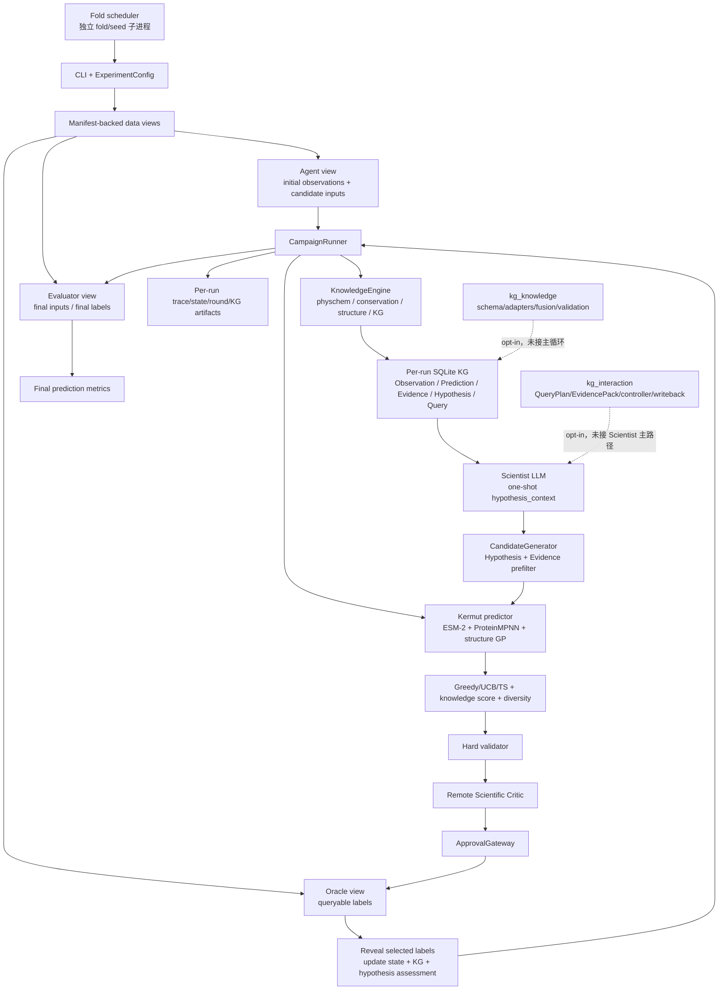

# 1 折运行结果、系统架构、Word 目标覆盖与 KG 改进路线

> 分析日期：2026-08-16  
> 代码范围：当前工作区 `fitness-agents`  
> 运行产物：[`fold-campaigns-20260816T101446Z`](../artifacts/fold-campaigns-20260816T101446Z/)  
> 需求基线：当前代码库（见 [README](../README.md)、实验配置与 `src` 主循环实现）  
> 说明：验收与差距分析以当前代码版本为准，不作为本次分析之外的新执行指令。

## 0. 结论先行

当前系统已经完成了一个**能够真实运行的、具备隐藏标签隔离、三轮闭环、Kermut 预测、LLM Scientist、独立 Critic、规则/KG 证据、审批门禁和最终留出集评估的工程 MVP**。本次 fold 0、seed 42 运行正常退出，3 轮共查询 96 个变体，没有中止，最终在 29,439 个留出变体上完成预测评估。

但当前证据还不足以证明以下科学结论：

1. Knowledge-enhanced LLM Agent 优于随机、fitness 模型直推或无知识 LLM Agent；
2. KG、LLM、结构、保守性或不确定性中的任一模块产生了独立增益；
3. Agent 真正在进行“科学家式”的候选设计，而不是由 Python 预筛选和预测器完成主要决策；
4. 当前提升能够跨 fold、跨 seed 稳定复现；
5. 当前 KG 已经是外挂、多模态、可多步查询和可动态演化的知识图谱。

因此，最准确的状态判断是：

| 维度 | 当前结论 |
|---|---|
| 工程闭环 | **已完成并有 1 折运行证据** |
| 数据泄漏防护 | **代码、定向测试和运行元数据均有证据，但随附 split 原文件缺失，不能独立重算审计** |
| 预测模型 | **真实 Kermut 已运行；预测相关性偏弱，区间明显过宽，验证校准未闭环** |
| LLM Scientist / Critic | **均真实调用并完成 3 轮；Agent 的候选打分和逐候选理由只部分实现** |
| 知识增强 | **轻量规则 + 当前运行 Observation KG 已参与预筛选/加权；独立贡献未验证** |
| 外挂结构化 KG | **schema、adapter、fusion、controller 等骨架存在并通过单测，但未接入本次主循环** |
| Word 最低任务 | **主体功能部分完成，比较实验、结果展示、失败分析和 PDF 报告未完成** |
| Word 加分项 | **UQ/结构/KG 有代码基础；主动学习策略、单/双/多点对照、交互 demo 和实验平台仍未形成结果** |

一句话概括：**系统已经证明“能跑”，尚未证明“为什么有效、是否稳定有效、KG 是否带来净增益”。**

## 1. 分析口径与证据等级

为避免把“代码存在”误判为“目标完成”，本文使用三类证据：

- **A 级：本次运行证据**——来自随附 `schedule.json`、`fold_results.json`、日志和聚合指标；
- **B 级：代码/配置/测试证据**——当前工作区具备相应实现，本次复核的 KG、交互、泄漏和 fold 调度定向测试共 **17 passed**；
- **C 级：设计骨架或计划**——接口、配置或文档已经存在，但没有接入本次运行或没有结果产物。

需要特别注意两个可复现性边界：

1. 本次产物来自 Linux 路径 `/data1/dhuang/fitness-agents/...`，当前分析在 Windows 工作区进行；
2. fold campaign 目录没有保存 Git commit、完整 experiment config、依赖清单和 split 文件快照，因此本文将“当前代码”和“本次输出”视为同一版本进行架构映射，但现有产物本身不能证明二者完全一致。

这也是下一轮首先应修复的 provenance 缺口。

## 2. 本次 1 折到底运行了什么

### 2.1 运行配置快照

从 [`schedule.json`](../artifacts/fold-campaigns-20260816T101446Z/schedule.json) 和当前 [`knowledge_agent_al96.yaml`](../configs/experiments/knowledge_agent_al96.yaml) 可还原出：

| 项目 | 本次设置 |
|---|---:|
| fold / seed | fold 0 / seed 42 |
| 模式 | `knowledge_agent` |
| 数据协议 | `al96_closed_loop` / `GB1-AL96-5CV-v1` |
| 初始可见 Observation | 96 |
| 迭代轮次 | 3 |
| 每轮预算 | 32 |
| 总新增查询 | 96 |
| 每轮候选预筛上限 | 64 |
| acquisition | `greedy` |
| 知识软权重 | 0.20 |
| 批内多样性惩罚 | 0.10 |
| predictor | Kermut，CPU，GP 优化 150 steps/轮 |
| Scientist / Critic | DeepSeek `deepseek-v4-flash` |
| 知识通道 | physchem、conservation、structure、KG 均开启 |
| 最终留出评估 | 29,439 个变体 |

日志显示每一轮都对“已观测 + 未观测”的固定 119,538 个变体生成四类知识 Evidence，但 Kermut 只对 LLM/KG 预筛后的 64 个候选进行当轮预测，再从中选择 32 个。

### 2.2 运行状态

[`fold_results.json`](../artifacts/fold-campaigns-20260816T101446Z/fold_results.json) 给出的状态为：

- `status=completed`，`returncode=0`；
- `queries_used=96`；
- `hypotheses_generated=3`；
- `critique_decisions=3`；
- `hypothesis_assessments=3`；
- `rounds_aborted=0`；
- `finalized=true`。

从日志首尾时间估算，总运行约 **14 分 55 秒**。6 次远程 LLM 调用累计约 **529.5 秒**，约占端到端时间的 **59.2%**；其中 3 次 Scientist 和 3 次 Critic 均成功，无重试失败。唯一明显环境告警是 NVIDIA driver 与 PyTorch CUDA 版本不匹配，但配置本身使用 CPU，所以没有导致任务失败。

### 2.3 三轮优化结果

| 指标 | Round 1 | Round 2 | Round 3 | 观察 |
|---|---:|---:|---:|---|
| best seen fitness | 4.4857 | 4.4857 | **5.7720** | R3 刷新 best；相对 R1 +28.7% |
| visible mean fitness | 1.0136 | 1.2333 | **1.4705** | 相对 R1 +45.1% |
| batch best fitness | 4.4857 | 4.3877 | **5.7720** | R2 回落，R3 提升 |
| batch mean fitness | 2.2654 | 2.1119 | **2.6569** | R2 比 R1 -6.8%，R3 比 R2 +25.8% |
| batch median fitness | **2.6339** | 2.1674 | 2.3046 | R3 中位数仍低于 R1，提升受高值样本影响 |
| mean selected model rank | 16.53 | 16.56 | 16.50 | 基于 64 个已评分候选，不是全局 119k 排名 |

可以确认的正面结论是：第三轮找到更高的 best variant，累计可见样本均值也在上升。

不能直接下的结论是“Agent 逐轮稳定变好”。原因是 Round 2 的 batch mean、median 和 batch best 都下降；Round 3 的 median 仍低于 Round 1。当前更像是第三轮发现了少数高值候选，而不是整个推荐批次单调改善。

### 2.4 最终预测指标

| 指标 | 数值 | 解读 |
|---|---:|---|
| n | 29,439 | 已完成较大留出集评估 |
| Spearman | 0.1929 | 排序相关性较弱 |
| Pearson | 0.2214 | 线性相关性较弱 |
| RMSE | 0.6354 | 缺少同折 baseline 和量纲参照，不能单独判断好坏 |
| NDCG | 0.7066 | 有一定排序集中度，但需要 random/direct baseline 和 Top-k 指标共同解释 |
| 90% interval coverage | 0.9862 | 比目标 90% 高 8.6 个百分点，区间明显偏保守/过宽 |
| Gaussian NLL | 0.3331 | 需与同折模型、区间宽度和校准曲线对比 |

预测模型已经完成真实评估，但不能称为“性能已达标”：

- Spearman/Pearson 只有约 0.2；
- `use_validation_conformal=false`，manifest fold 模式也没有把 controller validation 交给 predictor，因此 98.6% coverage 不是良好校准的充分证据；
- 当前输出没有 MSE、Top-k recall/hit rate、precision@k、regret、interval width 或 calibration error；
- 没有同 fold 的模型 baseline，无法判断 Kermut 是否优于更简单模型。

### 2.5 一个容易误读的排名指标

`mean_selected_model_rank_fraction≈0.258` 看起来像是在全局候选中选到了前 25.8%，实际不是。主循环在 `candidate_limit=64` 时先由 Hypothesis + Evidence 选出 64 个候选，再只对这 64 个候选计算 Kermut 排名；32 个入选项的平均名次自然约为 16.5。

因此该指标回答的是“在预筛后的 64 个候选里，选择批次处在什么位置”，而不是“在 119,442 个未知候选中处在什么位置”。后续报告必须把它重命名为 `rank_within_scored_pool`，并同时记录：

- 全部未测池大小；
- stage-1 预筛池大小和策略；
- stage-2 预测池大小；
- stage-1 对真实 top variants 的 recall；
- 如采用全池预计算特征，再提供真正的 global predictor/acquisition rank。

## 3. 当前系统架构

### 3.1 实际运行主链



主协调器位于 [`orchestrator.py`](../src/fitness_agents/loop/orchestrator.py#L66)。其关键安全边界包括：

- 按 consumer role 读取 agent、oracle 和 evaluator 文件；
- manifest、fold assignment 和协议 hash 校验；
- Agent prompt 屏蔽 final/oracle 字段；
- 只有通过 hard validation、Critic `APPROVE` 和 approval receipt 的 batch 才能提交；
- final test 只在闭环结束后打开。

### 3.2 组件功能和成熟度

| 组件 | 当前功能 | 本次运行证据 | 成熟度判断 |
|---|---|---|---|
| 数据拆分/加载 | AL96 五折协议、角色隔离、hash、泄漏审计 | schedule 中有协议/hash；本次只运行 fold 0 | 运行链可用；随附 split 文件缺失 |
| Kermut predictor | ESM-2 表征、zero-shot mean、ProteinMPNN 条件概率、结构复合核 GP、均值/std/OOD | 3 轮 fit/predict + final test | 已运行；校准和排序能力需加强 |
| Scientist Agent | 读取可见 Observation、KG 固定摘要，输出结构化 Hypothesis | 3 次远程调用，3 个 hypothesis ID | 已运行；不是完整工具调用型 Agent |
| Mutation Designer | 按 LLM preferred residues、Evidence 和 ID 排序已有枚举空间 | 每轮预筛 64 个 eligible | 确定性筛选器可用；LLM 不直接生成候选序列 |
| Acquisition | Random/Greedy/UCB/TS、知识加权、批内多样性 | 本次为 greedy + knowledge weight | 已运行；本次未使用不确定性主动学习 |
| Scientific Critic | 证据、上位性、批设计、可证伪性审查 | 3 次远程调用，全部 attempt 0 APPROVE | 主链可用；选择性和失败路径未验证 |
| Oracle/backend | 查询预算、重复/终局保护、审批 receipt | 96 次查询，0 abort | 已运行 |
| Hypothesis evaluator | 预注册 batch median lift，并输出 supported/contradicted/inconclusive | 3 次均 SUPPORTED | 有自动状态评估，但检验与具体生物学主张绑定不足 |
| 当前 SQLite KG | 保存 Variant/Mutation/Observation/Prediction/Evidence/Hypothesis/AgentQuery，按轮可见 | 日志确认 Evidence；详细 KG 文件未随附 | 运行内记忆/审计层可用，当前 run 无法细查 |
| `kg_knowledge` | 分层 schema、adapter、fusion、validation、ablation | 单测通过；配置明确为 opt-in | C 级骨架，未形成主循环能力 |
| `kg_interaction` | 有限 QueryPlan、EvidencePack、compare、反证开关、proposal gateway | 单测通过；未接 Scientist | C 级骨架，未形成主循环能力 |
| reporting | summary、fold status、aggregate CSV/JSON、日志 | 本次目录中存在 | 汇总可用；详细科学报告和图表缺失 |

### 3.3 Agent 当前并未完成的两个关键闭环

#### 先生成假设，后计算当前候选预测

主循环先生成全体 Evidence，再让 LLM 产生 Hypothesis，之后才预筛候选并调用 Kermut。虽然 KG schema 支持返回“当前轮 prediction”，但调用顺序导致 Scientist 在提出当前轮假设时还没有当前轮候选预测可看。

这意味着 Word 中“Agent 调用适应度模型对候选打分、再根据结果选择 Top-k”只在**系统整体**层面实现，未在 LLM Agent 的观察—工具—修正循环中实现。

#### 推荐理由是批级摘要，不是逐候选解释

当前 `SelectionRecord.reason` 对同一批的所有候选都使用同一个 Critic summary；draft rationale 也是统一的 “Candidate selected by the configured acquisition policy”。仓库中的 `ScientistAgent.critique()` 没有进入主循环。

所以当前可以审计“哪些候选被选、用了哪些 evidence IDs”，但尚不能充分回答：

- 为什么在位点 39 选择这个残基而不是另一个；
- 为什么把这些替换组合在一起；
- 哪条支持证据、哪条反证决定了选择；
- 某个候选失败后，应如何修正下一轮假设。

## 4. 对照 Word：完成了哪些目标

状态说明：**完成**表示本次产物直接证明；**部分完成**表示代码或单次运行覆盖，但未达到验收强度；**未完成**表示当前随附结果没有对应输出。

| Word 目标 | 状态 | 当前证据与判断 |
|---|---|---|
| 选择公开蛋白质定向进化数据集 | **完成** | 使用 GB1 / FLIP 来源、IgG binding 任务，四个位点 39/40/41/54 |
| 评估数据规模、给出下载和 demo 命令 | **部分完成** | README 有下载/拆分/运行说明；本次 artifact 未保存原始数据版本、许可、下载 receipt 和 demo 数据快照 |
| 整理 WT、变体、位点和 fitness | **完成** | `Variant`、mutation notation、Observation、完整四位点 code 已进入主循环和 KG |
| 训练/验证/测试隔离并避免泄漏 | **部分完成** | 角色隔离、hash 和泄漏测试已实现；本次 split 文件及 audit report 未随附，benchmark validation 未进入 predictor 校准 |
| 建立 baseline fitness predictor | **完成** | 真实 Kermut 复合核 GP 已完成三轮和 final test |
| Spearman、Pearson、MSE、Top-k 等评估 | **部分完成** | 有 Spearman、Pearson、RMSE、NDCG、coverage、NLL；无 MSE、Top-k hit/recall、regret 和同折 baseline |
| 识别高-fitness 变体 | **部分完成** | R3 发现 5.7720；没有 percentile/top-k 命中率或相对全局 optimum 的 regret |
| Agent 读取当前实验数据和 top variants | **完成** | Scientist context 包含可见 Observation；KG 提供 top visible observations |
| Agent 总结关键位点/提出下一轮假设 | **完成** | 每轮产生 1 个结构化 hypothesis，并影响预筛候选 |
| Agent 生成候选序列 | **部分完成** | LLM 生成 preferred residues；Python 对既有完整枚举空间排序，LLM 不直接输出并修订具体候选集 |
| Agent 调用 predictor 给候选打分 | **部分完成** | orchestrator 调用 Kermut；Scientist 提假设时还看不到当前轮预测，也不能主动调用 predictor tool |
| Agent 选择 Top-k 并说明理由 | **部分完成** | Python acquisition + Critic 选出 32 个；理由为批级摘要，缺逐候选因果链/反证 |
| Data Analyst / Hypothesis / Designer / Evaluator / Critic 模块 | **部分完成** | 功能边界存在，Scientist 与 Critic 独立；Data Analyst/Designer/Evaluator 主要由固定 Python 流程承担 |
| 小型规则库：理化、保守/激进、突变数、异常氨基酸、突变上限 | **部分完成** | physchem、conservation、合法残基/位置/数量和 batch hard validation 已有；“优先历史优良单点”没有作为独立可审计规则完成 |
| 简单 KG：位点—突变—性质—fitness | **完成（轻量版）** | 当前 SQLite KG 区分 mutation、observation、evidence、prediction 和 hypothesis；并用 residue aggregate 影响选择 |
| 比较有/无知识增强 | **未完成** | 本次只有 1 个 `knowledge_agent` 条件，无 `no_kg/no_knowledge` 同折对照 |
| 至少 2–3 轮虚拟进化 | **完成** | 3 轮 × 32，96 次新增查询 |
| 观察推荐 fitness 是否逐轮提升 | **部分完成** | best/visible mean 最终提升，但 Round 2 回落、batch median 非单调 |
| 比较随机、模型直推、LLM、知识 LLM | **未完成** | aggregate 只有 1 行，无法进行方法比较 |
| 分析成功与失败案例 | **未完成** | 当前随附目录没有具体 selection、hypothesis、critique、KG query；3 轮均 APPROVE/SUPPORTED，也没有负例 |
| 讨论 Agent 是否具有科学思维 | **未完成** | 有 preregistration/critic/assessment 架构，但没有 score-shuffle、evidence deletion、反事实或行为消融结果 |
| 3–5 页 PDF 实验报告 | **未完成** | 未提供 PDF |
| GitHub 链接和可复现代码 | **部分完成** | 仓库 remote 存在；artifact 未保存 commit SHA、dirty status、environment 和配置快照 |
| 展示 WT、每轮 Top-k、表格/曲线、推理过程 | **未完成（随附产物）** | per-run 代码本可写 `round_XX/selection.csv`，但本次 `run_dir` 未复制到随附 campaign 目录 |

## 5. Word 加分项完成情况

| 加分项 | 当前状态 | 判断 |
|---|---|---|
| 主动学习 / 强化学习 | **部分完成** | UCB/TS 接口已有；本次使用 greedy，未利用 std 做 acquisition；无 RL |
| 不确定性估计 / 集成 | **部分完成** | Kermut 输出 std、interval、OOD；本次 coverage 过高且没有 sharpness/calibration curve |
| 单点、双点、多点效果比较 | **未完成** | 数据包含不同 mutation count，但没有分层结果或公平预算实验 |
| 蛋白结构或保守位点 | **部分完成** | Kermut 使用坐标/ProteinMPNN；KnowledgeEngine 的 structure/conservation 仍是固定 site profile，不是可查询的真实结构/进化 KG |
| KG 表示关系 | **部分完成** | 运行 KG 已有；外挂分层 KG 仅有骨架和单测 |
| 简单交互 demo | **未完成** | 没有输入 WT 后自动输出变体的 UI/CLI 展示产物 |
| 连接真实自动化实验平台 | **未完成** | backend 有替换接口，但没有 LIMS/robot adapter、QC/重试/idempotency 的真实演示 |
| PG-LLM / ProteinGym 外部评测 | **未完成** | 有研究与架构文档，尚无 endpoint/benchmark 结果 |

## 6. 当前输出产物的完整性缺口

本次 fold campaign 目录只有 7 个文件：schedule、fold status、stdout/stderr、report 和 aggregate CSV/JSON。`fold_results.json` 指向的详细 run 目录是 Linux 绝对路径，未包含在当前工作区对应位置。

因此无法从随附结果复核：

- 每轮 32 个具体变体、顺序、预测值、uncertainty、OOD 和 knowledge score；
- 每个 hypothesis 的 statement、preferred residues、evidence IDs 和 parent；
- 每轮 Critic 的结构化审查和置信度；
- hard conflict 明细；
- hypothesis assessment 的 criterion 细节；
- KG edges、KG queries 和 query result；
- trace 中完整事件时间线；
- config snapshot 和状态快照。

这不是主循环未生成，而是**fold campaign 打包没有把 per-run artifacts 纳入交付目录**。在补齐这些文件前，当前结果只能做指标级分析，不能完成 Word 要求的 Top-k 展示、推理链和失败案例分析。

建议每个 fold campaign 至少包含或复制：

```text
provenance/
  git.json                 commit SHA、dirty status、remote
  environment.json         Python、CUDA、torch、gpytorch、ESM 版本
  config.resolved.yaml     完整解析后配置及 config hash
  manifest.public.json     或只读 snapshot + hash
  fold_manifest.json       当前 fold 分配与 audit report
runs/<run_id>/
  config.json
  state.json
  summary.json
  trace.jsonl
  round_01..03/
    selection.csv
    draft_batch*.json
    hard_validation*.json
    critique*.json
    approved_batch.json
    metrics.json
    hypothesis_assessment.json
  knowledge_graph.sqlite
  knowledge_graph_edges.json
  knowledge_graph_queries.json
report/
  metrics.csv
  figures/*.png
  report.md
  report.pdf
```

## 7. 当前 KG 的准确定位

### 7.1 已经做对的部分

当前 KG 不是简单把所有字段塞进 prompt，而是具备以下重要基础：

1. Observation、Prediction、Evidence、Hypothesis 分类型存储，避免把预测升级为实验事实；
2. Observation 绑定完整 Variant、assay、round 和 source；
3. Agent 只能使用 allow-listed 查询，不能执行任意 SQL；
4. `as_of_round` 控制测量可见性，查询有审计记录；
5. KG residue evidence 有 support 和 shrinkage，并明确提示上位性混杂；
6. `kg_knowledge` 已定义 P0–P2 实体分层、provenance-aware fusion 和独立消融；
7. `kg_interaction` 已定义有限 QueryPlan、EvidencePack、反证开关、充分性早停和受控 writeback proposal。

这些设计使系统具备从“运行内实验记忆”升级到“外挂结构化知识库”的正确边界。

### 7.2 当前 KG 的主要限制

#### 运行 KG 仍然是单任务、单 run、固定模式

- WT、位点和 residue aggregate 仍高度 GB1 专用；
- 跨 run/fold 的稳定实体 ID、snapshot 和知识复用没有进入主循环；
- Assay/Condition 语义较薄，没有 replicate、QC、单位、实验协议和测量误差；
- logical edges 多由外键/JSON 隐式表达。

#### KG 对 LLM 是一次固定注入，不是 Agentic 查询

- Scientist 只自动调用一次 `hypothesis_context`；
- `explain_variant` 虽存在，但没有进入主循环；
- `compare_variants`、counterevidence、history 等只存在于未接线的 `kg_interaction`；
- LLM 不能根据证据不足主动追问，也没有 query cost/utility 学习。

#### 当前 KG 数值证据容易被上位性混杂

`residue_statistics` 把完整多突变变体的 fitness 平均值归因到其中每个突变残基。对于 GB1 这种强 epistasis landscape，某个 residue 的高均值可能来自共现背景，而不是该 residue 的独立贡献。当前 `count/(count+3)` 只缓解小样本，不消除背景混杂。

#### 当前融合不是经过验证的证据融合

- 当前主循环把四个 channel 按 confidence 做简单加权平均，再乘固定 `soft_weight=0.20`；
- physchem、conservation、structure 的置信度是人工常数；
- 相关来源可能重复增信；
- 没有用 validation 或离线 counterfactual 学习/校准各 channel 的方向和权重。

#### Hypothesis 状态写回不完整

主循环会生成 `HypothesisAssessment`，但当前 SQLite `hypotheses.status` 在插入时是 `active`，assessment 没有正式更新图中的 supported/contradicted/inconclusive 状态，也没有 `supersedes/retracts/tested_by` 历史关系。

#### 静态证据重复计算和重复存储

physchem、固定 conservation profile 和固定 structure risk 对同一 variant 跨轮不变，但当前每轮仍对 119,538 个变体重新生成、按 round 重新写入 Evidence。应把静态知识缓存为版本化 artifact，把动态 Observation/KG 证据增量更新。

## 8. KG 应该往哪些方向改进

### 8.1 P0：先让 KG 的贡献可测，而不是先扩图

在引入更多实体前，先完成公平对照：

- 同一 fold、seed、initial set、query budget 和 predictor；
- Random、Fitness Direct、LLM、Knowledge LLM 四种方法；
- `no_kg`、`no_knowledge`、`no_structure`、`no_conservation`、`no_uq`；
- 保持候选计算预算可比。

候选预筛公平性建议拆成两个实验：

1. **Decision-only 对照**：四种方法收到相同的 64 个候选，测 LLM/KG rerank 是否有效；
2. **End-to-end 对照**：各方法使用自己的候选生成器，测完整系统净增益。

否则，知识 Agent 先看 119k Evidence 再挑 64 个、fitness direct 只取输入顺序前 64 个，会把 candidate recall 差异混入 Agent/KG 效果。

### 8.2 P0：把现有两套 KG 骨架正式接入主循环

不要先更换 Neo4j。建议在现有 SQLite 上采用双写/适配方式：

```text
Current ObservationKnowledgeGraph
        -> CampaignObservationAdapter / InferenceKnowledgeAdapter
        -> Normalize
        -> ProvenanceAwareFusion
        -> Validate
        -> SQLiteSnapshotSink
        -> immutable kg_snapshot_id
```

每轮建立冻结 snapshot，并把以下 ID 写入 Hypothesis、Decision、Critic 和 Selection：

- `kg_snapshot_id`；
- `model_run_id` / training snapshot hash；
- `query_plan_id` / query IDs；
- `evidence_snapshot_id`；
- `policy_version`；
- `config_hash` / code commit。

P0 schema 先覆盖：Protein、Sequence、ResiduePosition、Variant、Mutation、Assay、Condition、Observation、CampaignRound、Prediction、ModelRun、Evidence、Hypothesis、Decision。当前 catalog 中有 Decision，但 adapter 尚未把 selection/approval/assessment 转为图实体，应优先补齐。

### 8.3 P1：调整 Agent 与 predictor/KG 的调用顺序

建议将当前单次调用改成有限两步：

```text
可见 Observation
  -> 初步 predictor / 共享 stage-1 retriever
  -> top-N candidate predictions 写入冻结 KG snapshot
  -> Scientist 生成 QueryPlan
  -> context + compare + counterevidence（最多 2–3 次）
  -> 输出 Hypothesis + candidate constraints + evidence IDs
  -> acquisition 选 batch
  -> Critic 审查正证、反证、OOD、批设计和可证伪性
```

优先接入三个 operator：

1. `compare_variants`：比较完整序列背景、prediction、uncertainty 和 evidence；
2. `find_counterevidence`：查找负分 evidence、相反 Observation、失败组合和高 OOD；
3. `hypothesis_history`：返回历轮状态、被否证条件和 supersession 链。

对 high predicted mean + high OOD、强 KG score + 低 support、以及多突变组合，强制进行 counterevidence search。Critic 配置中的 `require_counterevidence_search` 应在对照实验中开启，而不是始终为 false。

### 8.4 P1：把 residue 平均值升级为上下文感知效应

建议将当前 `AVG(fitness) by position,residue` 分为三层：

1. **描述性关联**：保留当前均值、support 和 caveat；
2. **背景匹配效应**：在相同其余位点背景下做成对 contrast；
3. **交互效应**：显式估计 pairwise/selected higher-order epistasis。

每条效应至少携带：

- assay/condition；
- sequence background / mutation count；
- n、effect、SE/CI；
- source IDs 和计算版本；
- `association`、`contrast` 或 `interaction` 类型；
- 有效轮次和 snapshot。

小样本时使用 hierarchical shrinkage 或 bootstrap，而不是只用固定 `count/(count+3)`。数值 KG score 应在 benchmark validation 上校准，并报告 channel 单独 AUC/recall、weight stability 和消融差值。

### 8.5 P1：补齐真实 Evolution 与 Structure 知识

当前 structure/conservation channel 更像固定规则。下一步高价值 adapter 是：

- **EvolutionProfileAdapter**：MSA 数据库版本、Neff、position entropy、PSSM、co-evolution summary；
- **StructureAdapter**：PDB/AlphaFold 结构版本、残基映射、pLDDT/实验分辨率、SASA、secondary structure、interface distance；
- **ResidueEnvironmentAdapter**：突变位点邻域、接触、氢键/盐桥、局部 packing；
- **KermutArtifactAdapter**：把 ProteinMPNN conditional probs、coords、ESM checkpoint 和 feature hash 纳入 provenance。

所有坐标映射都应有 alignment artifact、coverage、错位率和低置信标记。大型坐标、MSA、embedding 不直接塞入图属性，只保存 URI、checksum、版本和可查询摘要。

文献 Claim、GO、跨蛋白大图应放在这些层之后；当前 GB1 单任务最需要的是实验上下文、进化和局部结构，不是大而全的 biomedical KG。

### 8.6 P1：实现安全的动态 KG，而不是让 LLM 直接写事实

写回权限建议保持：

- Observation：只能由可信实验/oracle backend 写；
- Prediction：只能由版本化 model run 写；
- computed Evidence：只能由确定性 provider 写；
- LLM：只能提交 Hypothesis、AgentAssertion、EvidenceLink、status change proposal。

正式接入现有 `ProposalGateway`，采用：

```text
propose -> schema/provenance/visibility validation -> dry-run -> commit
```

所有记录 append-only；更正通过 `supersedes`、`retracts`、`valid_to_round` 表达。每次实验后自动：

1. 写 Observation；
2. 执行 preregistered criterion；
3. 更新 Hypothesis 状态；
4. 生成反证/失败模式；
5. 将下一轮查询优先级与不确定性绑定。

### 8.7 P2：增加 KG 自身的质量和价值指标

KG 不能只按“节点数/边数”验收。建议至少记录：

| 类别 | 指标 |
|---|---|
| schema/构建 | P0 coverage、dangling edge、duplicate/alias error、coordinate mapping coverage |
| provenance | source coverage、independent source count、artifact checksum coverage |
| 时间/泄漏 | as-of-round 违规数、final/oracle leakage、snapshot reproducibility |
| 查询 | success/empty rate、rows、hops、latency、token、cache hit、early-stop rate |
| 证据 | supporting/counterevidence coverage、citation validity、conflict rate、support distribution |
| 决策 | batch Jaccard change、candidate recall、selection lift、OOD/rejection rate |
| 最终价值 | best-so-far AUC、top-p hit、regret、queries-to-threshold、paired fold gain |

只有当 KG ablation 在相同预算下稳定改善最后一类指标，才能说 KG 对 fitness 优化有效。

### 8.8 性能优化方向

本次运行的主要耗时来自 LLM，其次是重复 Evidence 扫描和最终 Kermut 预测。建议：

1. 静态 physchem/conservation/structure Evidence 按 variant + provider version 缓存；
2. KG residue/interaction statistics 只在新增 32 个 Observation 后增量更新；
3. QueryPlan 使用证据充分早停，避免固定执行所有工具；
4. 保存 LLM request fingerprint、attempt、latency、token 和 cost，支持可恢复执行；
5. Critic 可先用 rule/hard validator 处理显然安全批次，把远程 Critic 留给高 OOD、冲突或新假设；
6. 为 GB1 全空间预计算 ESM/Kermut feature store，允许更公平的全池或大池排名；
7. 将 evidence progress 从每 256 条降采样，避免日志膨胀。

## 9. 下一步建议与验收顺序

### P0-A：先修复结果交付完整性

**工作**：让 fold scheduler 把 per-run 目录、resolved config、split audit、commit/environment 一并归档。  
**验收**：单个 campaign 目录可离线重建每轮 Top-k、Hypothesis、Critic、KG query 和最终报告；所有路径为相对路径或可重定位 URI。

### P0-B：完成 fold 0 的公平四方法对照

**工作**：在 fold 0、seed 42、相同 96 初始样本、3×32 预算下运行 Random、Fitness Direct、LLM Agent、Knowledge Agent，并增加 `no_kg/no_knowledge`。同时做 fixed candidate pool 和 native generator 两组。  
**验收**：输出逐轮 best/mean/median、best-so-far AUC、top-p hit、regret、diversity、invalid/reject、query cost 和 paired 差值；能回答 KG/LLM 是否改变候选以及是否提高真实 fitness。

### P0-C：补齐模型验证与 UQ 校准

**工作**：让 predictor service 在不向 Agent 暴露标签的前提下使用 controller validation；增加 conformal calibration、Top-k metrics、interval width 和 calibration error。  
**验收**：validation 与 final 指标分离；90% coverage 接近目标且区间不过宽；与简单 baseline 同折比较。

### P1-A：五折 × 至少 3 个 paired seeds

**工作**：先做 5 folds × 3 seeds；结论稳定后再扩到 5 seeds。  
**验收**：以 fold 为一级重复，报告 paired difference、bootstrap CI 或配对置换/Wilcoxon，并对多重消融做校正。单折结果只作为案例，不再作为主结论。

### P1-B：接线 `kg_knowledge` 和 `kg_interaction`

**工作**：实现 SQLiteSnapshotSink、Decision/Assessment adapter、snapshot ID；把 bounded QueryPlan/EvidencePack 接入 Scientist；加入 compare/counterevidence/history。  
**验收**：每个选择能追溯到 snapshot、prediction、support、counterevidence、hypothesis、policy 和 Critic；关闭任一 operator/layer 后基线可复现。

### P1-C：升级 KG 效应模型

**工作**：加入 matched-background contrast、interaction effect、CI 和 source-aware calibration。  
**验收**：能区分 association 与 interaction；小 support 不产生高置信因果措辞；对 top candidate 的 false-positive rate 低于当前 residue aggregate。

### P2：真实结构/进化知识与外部评测

**工作**：接入 MSA、结构残基环境、Kermut artifact provenance；随后实现 PG-LLM read-only endpoint 和 ProteinGym 外部排序切片。  
**验收**：no-evolution/no-structure 配对消融；坐标映射可审计；外部 benchmark 不写回 KG、不接触隐藏标签。

### P3：交互 demo 与真实实验 backend

**工作**：提供 WT/assay 输入、候选/理由/反证输出的简单 demo；实现 LIMS/robot backend 的幂等提交、QC、重复测量和重试。  
**验收**：同一 batch 重试不重复提交；失败样本保留；final gate 不可逆；UI 明确区分 measured/predicted/asserted。

## 10. 最终验收清单

在宣布 Word 目标完成前，至少应满足：

- [ ] 本次 run 的完整 per-round artifacts、KG 和 provenance 已归档；
- [ ] 随附 manifest/fold audit 可独立验证无泄漏；
- [ ] 四种方法在相同 fold/seed/budget 下完成；
- [ ] `no_kg/no_knowledge/no_structure/no_conservation/no_uq` 配对消融完成；
- [ ] 五折 × 多 seed 统计完成；
- [ ] 模型 validation、final、Top-k 和 UQ 校准指标齐全；
- [ ] 每轮 Top-k、WT、预测/实测、理由、正证/反证和失败案例可展示；
- [ ] Hypothesis 检验与具体 residue/combination claim 对齐，而不只是 generic batch-median lift；
- [ ] KG QueryPlan/EvidencePack 正式进入 Scientist 主循环；
- [ ] KG 的 Decision/Assessment/status/supersession 写回完整；
- [ ] 输出 3–5 页 PDF 报告、表格/曲线和 GitHub commit 链接；
- [ ] 结论明确区分“虚拟 oracle 结果”和“真实湿实验证据”。

## 11. 总体建议

当前最值得保留的是：严格的数据角色隔离、真实 Kermut、typed Observation/Prediction/Evidence/Hypothesis、审批门禁、可证伪性接口和独立 Critic。这些已经构成高质量工程底座。

下一步不应以“换 Neo4j、导入更大 KG、加入更多 LLM”作为主线，而应按以下顺序推进：

1. **先补全产物与 provenance**，让本次结果可审计；
2. **再做公平 baseline/ablation**，证明 Agent/KG 是否有净增益；
3. **随后把现有 KG 骨架接入主循环**，实现预测后查询、候选比较和反证；
4. **再升级上下文感知效应、结构和进化知识**；
5. **最后扩展动态写回、外部 benchmark 和真实实验平台**。

当系统能够在严格配对实验中回答“哪条知识、通过哪次查询、改变了哪个候选、带来了多少真实 fitness 增益，并在哪些情况下失败”时，KG 才从解释性装饰升级为可验证的科学决策组件。

