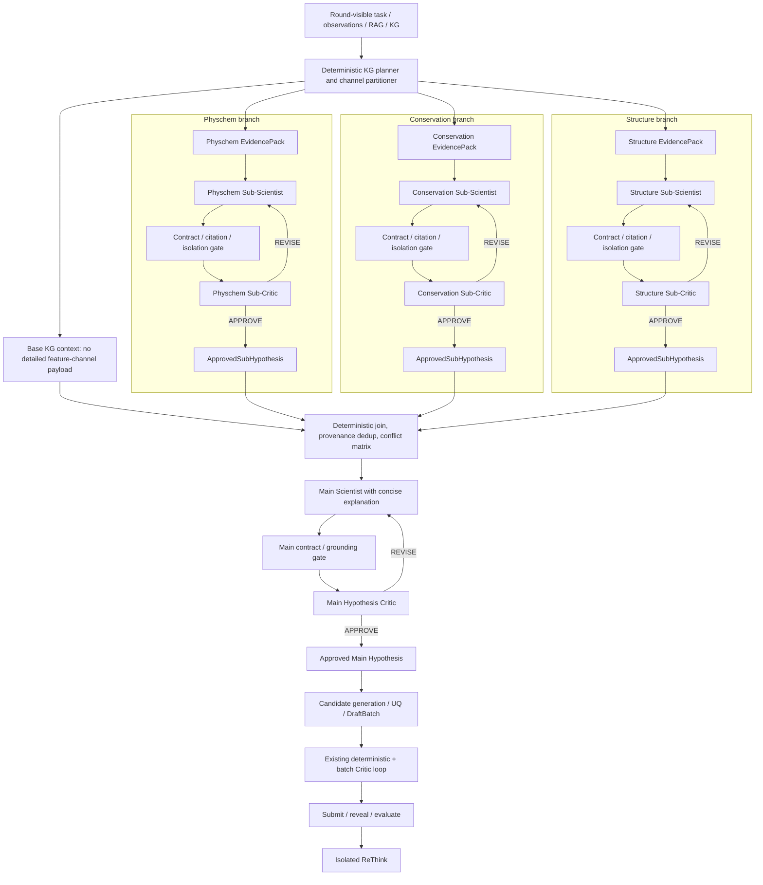

# 分层 Scientist–Critic 与 LLM 运行韧性改进 PLAN

> 状态：核心改造已实施并完成离线测试；真实 DeepSeek 正式运行与消融实验待执行  
> 日期：2026-08-19  
> 范围：三通道 KG 子 Scientist、分层 Critic/ReThink、上下文隔离、长思维链/输出截断防护、LLM 异常捕获、运行完成门禁  
> 关联文档：[LLM Agent Runtime 与结构化 Prompt PLAN](./llm-agent-runtime-and-structured-prompt-plan.md)、[KG–LLM 主循环优化 PLAN](./kg-llm-validation-main-loop-optimization-plan.md)

## 0. 实施记录（2026-08-19）

本轮已经将 PLAN 的核心安全路径落入代码；没有调用真实 LLM API，也没有保存用户提供的
API key。DeepSeek 仍只通过 `env:DEEPSEEK_API_KEY` 读取，RAG 的 Qwen embedding/reranker
配置未改动。

| 阶段 | 实施状态 | 主要结果 |
|---|---|---|
| Phase 1 | 完成 | SDK retry=0；HTTP/finish reason 分类；`length` 硬失败；不再补闭合截断 JSON；正式 citation 异常不再静默 strip；completion manifest 防 false pass |
| Phase 2 | 完成 | `KGContextPartitioner`、三通道 typed input、evidence 去重、foreign-channel gate、三个子 Scientist profiles |
| Phase 3 | 完成 | 三个子 Scientist–Sub-Critic 分支并行；分支内串行；结构化最高优先级 retry control；required unavailable channel fail-closed |
| Phase 4 | 完成 | 主 Scientist 仅接收 non-feature base context、批准子假设和冲突矩阵；主 Hypothesis Critic；主输出 explanation |
| Phase 5 | 完成 | 保留 Batch Critic；移除其双层 model retry；ReThink 最小上下文；fallback 降级记账；completion audit |
| Phase 6 | 待实验 | checkpoint/resume、跨进程 durable graph、真实 API 压测、相同 fold/seed 的 single-vs-hierarchical 消融尚未执行 |

正式运行采用以下上限；各预算独立记账，但不会再由多个 runtime 层相乘：

| 层级 | 配置上限 | 最多次数 |
|---|---:|---:|
| OpenAI-compatible SDK 隐式重试 | 0 | 1 次由项目 runtime 发起的单次 SDK call |
| retryable transport/API（408/409/425/429/5xx/timeout/connection） | 2 retries | 单类故障最多 3 次外部请求 |
| JSON/schema/citation output repair | 1 retry | 单类故障最多 2 次外部请求 |
| 单次逻辑调用混合 transport + output 故障 | 2 + 1 | 最坏 4 次外部请求；每次均入账 |
| 每个子 Scientist 科学修订 | 1 revision | 初稿 + 1 次修订 |
| 主 Scientist 科学修订 | 1 revision | 初稿 + 1 次修订 |
| 现有 Batch Critic 批次修订 | 2 revisions | 初稿 + 最多 2 次确定性批次修订 |
| ReThink 科学修订 | 0 | 仅 runtime repair；失败则显式 fallback/degraded，正式 pass 失效 |

`400/401/402/403/404/405/422`、`content_filter`、意外 `tool_calls`、未知 finish reason、
required branch 缺失、Critic REJECT、科学修订耗尽均为 terminal failure。`length` 可消耗一次
output repair，但上轮内容完全丢弃；DeepSeek retry 会关闭 thinking 并不再发送
`reasoning_effort`。这些上限优先控制重试风暴和正式运行成本；后续只有在真实故障统计表明
恢复率显著不足时才应调高，且不得超过代码硬上限。

离线验收结果：分层 mock Campaign 端到端通过；本次相关 focused suite 为 **72 passed**；
全 `tests/` 套件排除一个已知且未改动的 ProteinGym assay-list 范围冲突后为
**252 passed、3 skipped、1 deselected**。真实 LLM 稳定性测试因未启用
`FITNESS_AGENTS_LIVE_LLM=1` 而跳过。独立的旧 `scripts/module_tests` runner 为 3/8 通过，
其余失败来自缺失 ESM-2 checkpoint、旧 fixture 缺少 versioned KG 参数或 task context，
不应误报为本轮分层 Agent 验收通过，也未在本任务中越界修改。

## 1. 结论先行

1. **建议引入三个通道级子 Scientist，但采用显式 DAG 的 fan-out/fan-in，而不是共享群聊。** 三个分支分别处理氨基酸理化性质、保守性和结构特征；每个分支内部按“子 Scientist → 对应子 Critic → 有界重试”串行执行，三个分支之间并行。
2. **主 Scientist 不再接收三个特征通道的完整 KG 详情。** 它只接收原有的任务/可见观测/基础 KG 或 RAG 上下文、三个经 Critic 批准的结构化子假设、去重后的来源清单和跨通道冲突矩阵。
3. **保留 `CampaignRunner` 对确定性状态、候选生成、选择、提交和测量揭示的所有权。** 借鉴 LangGraph 的 typed state、subgraph、checkpoint、per-node retry 和并行 join，不在第一阶段整体替换当前 orchestrator。
4. **把 Critic 拆成三个层次。** 第一层是无 LLM 的契约/引用/泄漏/截断门禁；第二层是通道级或主假设级科学 Critic；第三层保留现有候选批次 Critic。三层不得共用重试预算。
5. **`finish_reason=length` 必须无条件视为失败。** 不允许通过补闭合括号、截取第一个 JSON 对象或字段看似齐全而继续下游。重试时先关闭 thinking、压缩输入，再调整输出预算。
6. **`finalized` 只表示运行产物已关闭，绝不表示实验成功。** `run_status`、`experiment_status`、`evaluation_status/passed` 必须分开；任一必需 Agent 节点未完成、Critic 未批准、重试耗尽、轮次中止或实验计划未跑完时，均不得标记 `passed`。
7. **模型分工按用户要求固定。** Scientist、各层 LLM Critic 和 ReThink 使用 `deepseek-v4-flash`；RAG embedding/reranker 继续走现有 Qwen/DashScope 配置。API secret 只通过 `env:DEEPSEEK_API_KEY` 解析，PLAN、YAML、日志和 artifact 均不得保存明文 key。

## 2. 改造前基线实现审计

### 2.1 PLAN 编写时的真实控制流

当前每轮的主要路径是：

```text
KnowledgeEngine / structured KG
  -> CampaignRunner._run_kg_interaction()
  -> 一个包含多类 operator pack 的 KGInteractionResult
  -> ScientistAgent.propose_hypothesis()
  -> 候选生成、预测/Agent-UQ、DraftBatch
  -> BatchHardValidator
  -> CriticAgent 审查候选批次
  -> APPROVE / 批次 REVISE / 间接请求主 Scientist 重提 / REJECT
  -> 实验提交与测量揭示
  -> ReThink
```

对应代码事实：

- `src/fitness_agents/loop/orchestrator.py:1331-1382` 先完成整包 KG interaction，再一次性调用主 Scientist；当前没有通道级子 Scientist。
- `src/fitness_agents/loop/orchestrator.py:1989-2130` 的 Critic 审查发生在候选批次已经构建之后；只有 `REGENERATE_WITH_CONSTRAINTS`、`REQUEST_EVIDENCE`、`ADD_COUNTEREVIDENCE_SEARCH` 或 `RELAX_SOFT_PRIOR` 等动作才间接触发主 Scientist 重提。
- `src/fitness_agents/loop/review.py:125-212` 已有有界候选批次 review loop，但它不是独立的“假设生成后即审查”回路。
- `src/fitness_agents/loop/orchestrator.py:2422-2435` 的 ReThink 位于测量揭示之后，并在远程异常时静默降级到 mock；这种降级需要明确改变运行状态，不能仍被正式实验视为通过。

### 2.2 Prompt 膨胀不是假设问题，而是已有 artifact 事实

- 已检查的最大 `kg_interaction.json` 为 **124,063 bytes**。其中既有三个通道的单独查询，也有 `query_feature_bundle`，还包括 truncation audit、variant explanation 和 variant comparison；不同 pack 之间存在重复特征和重复 provenance 的可能。
- 已有真实 Qwen 模拟记录显示，完整 Scientist user message 曾达到 **106,119 characters**；压缩投影后仍为 **53,411 characters**。参见 [Qwen RAG→KG→Scientist 运行模拟](./qwen-rag-hypothesis-runtime-simulation.md)。
- 因此，仅提高上下文窗口或 `max_tokens` 不能解决问题。需要在 **查询规划、通道分区、去重、上下文选择和主/子 Agent 分层** 五处同时处理。

### 2.3 已有可靠性机制

当前代码已经具备值得保留的基础：

- Pydantic 严格输出合同和动态 position/evidence ID 校验；
- `EmptyLLMOutputError`、`OutputTruncatedError`、未知 evidence ID 处理；
- Scientist/Critic/ReThink 独立 Skill/Profile；
- hidden-label sanitizer、round-visible EvidencePack、只读 KG 工具；
- Critic 的 `APPROVE/REVISE/REJECT`、hard validation、审批 receipt 和 abort/fallback；
- reasoning route auditor 已检查 `rounds_aborted == 0` 和完成轮数。

### 2.4 需要优先修复的缺口

| 优先级 | 当前缺口 | 风险 |
|---|---|---|
| P0 | `finish_reason=length` 时，若补闭合括号或截取后得到可解析 JSON，当前路径仍可能接受 | 被截断的语义输出进入候选选择或审批 |
| P0 | `complete_json()` 捕获所有异常后按同一方式重试；没有区分 400/401/402/422 与 429/500/503 | 无效重试、成本膨胀、认证问题被掩盖 |
| P0 | Critic 存在外层 `CriticAgent.max_retries`、内层 `complete_json(retries=2)`，SDK retry 也未显式归零 | 配置为 2 时理论上可出现 3×3 甚至更多实际请求，账本不准确 |
| P0 | `summary["finalized"] = True` 即使存在 `rounds_aborted` 仍会写出 | 下游把“已收口”误当“已完成/已通过” |
| P1 | Critic 不是假设生成后的独立 gate，而是批次 gate | 不合理假设可先影响候选生成和排序，再到 Critic 才被发现 |
| P1 | Scientist 接收整个 `kg_interaction`；主 Critic 也可接收宽泛 context evidence | 上下文拥塞、证据重复、角色隔离不足 |
| P1 | Critic 模型失败重试与 Scientist 科学修订共用模糊的 retry 语义 | 无法区分 API retry、格式 repair 和科学 revision |
| P1 | ReThink 远程失败直接 mock fallback | 正式运行可能产生“看似完整”的反思结果 |
| P2 | DeepSeek Critic 配置写 `reasoning_effort: low`，但 DeepSeek V4 官方兼容规则把 `low/medium` 映射为 `high` | 配置意图与真实推理成本不一致 |
| P2 | thinking 模式仍传 `temperature`；DeepSeek 官方说明这些采样参数在 thinking 模式无效 | effective config 和真实行为不一致 |

## 3. 借鉴成熟 Agent 系统时采用的原则

### 3.1 采用图式工作流，不采用自由群聊

LangGraph 的 custom workflow 支持确定性节点、条件分支、循环和并行；subgraph 可通过 wrapper 映射不同的输入/输出 state schema。其 per-invocation subgraph 适合一次性、互相隔离且可并行的子任务。[Custom workflow](https://docs.langchain.com/oss/python/langchain/multi-agent/custom-workflow)、[Subgraphs](https://docs.langchain.com/oss/python/langgraph/use-subgraphs)

本项目应采用相同结构语义：

- manager/orchestrator 拥有图和状态；
- 每个子 Agent 只拥有本次调用的 typed input；
- Agent 返回 typed decision，不能直接写 campaign state；
- fan-out 分支并行，fan-in 只接收批准后的 envelope；
- 每个 loop 有显式退出条件、最大尝试次数和 terminal state。

不建议把三个专家和 Critic 放入共享消息历史的 round-robin 群聊。共享上下文会破坏通道隔离，也会让 token 随轮次累积。AutoGen 同样要求通过 max message/token/timeout 等 termination condition 防止团队无限运行；本项目应把这些条件固化为代码状态，而不是依赖模型输出某个终止词。[AutoGen termination](https://microsoft.github.io/autogen/stable/user-guide/agentchat-user-guide/tutorial/termination.html)

### 3.2 借鉴 runtime 能力，不急于更换现有控制器

LangGraph 提供 checkpoint、失败后从上一个成功节点恢复、并行 super-step 的 pending writes，以及 per-node retry/timeout/error handler。[Persistence](https://docs.langchain.com/oss/python/langgraph/persistence)、[Fault tolerance](https://docs.langchain.com/oss/python/langgraph/fault-tolerance)

第一阶段建议：

- 保留 `CampaignRunner`；
- 新建项目自有的 `HypothesisReviewGraph`；
- 用 typed state、节点 receipt、幂等 key、显式 edge 和 checkpoint artifact 实现 LangGraph-style 行为；
- 单独做一个 LangGraph spike，只有在恢复、并行和可观测性收益明确高于新增依赖成本时再迁移该子图。

### 3.3 Context engineering 是控制面，不是 Prompt 文案优化

LangChain 把 model context、tool context 和 life-cycle context 分开，并提供 summarization、model/tool call limit、model fallback、retry 和 context editing middleware。[Context engineering](https://docs.langchain.com/oss/python/langchain/context-engineering)、[Prebuilt middleware](https://docs.langchain.com/oss/python/langchain/middleware/built-in)

本项目对应关系：

- model context：角色 Skill、当前任务、被允许的 evidence、输出 schema；
- tool context：KG operator 的只读权限、round scope、row/tool budget；
- life-cycle context：token preflight、上下文投影、异常分类、retry、checkpoint、账本和 completion gate。

## 4. 目标架构



重要拓扑约束：

- 三个分支可并行；同一分支中的 Scientist 和 Critic 有依赖，**不能同时执行**。
- 一个分支失败时，不取消另外两个已经成功的分支；成功 receipt 应持久化，恢复时只重跑失败分支。
- join 不能读取未批准的 child draft。
- 主 Scientist 和主 Critic 不能访问子 Agent 的 reasoning、消息历史或失败原文。
- 批次 Critic 继续审查候选批次，不能被主假设 Critic 取代。

## 5. 图状态与节点合同

### 5.1 推荐状态对象

新增 `HypothesisPipelineState`，只保存引用和小型结构对象，不嵌入完整 Prompt：

```text
run_id / round_id / pipeline_version
base_context_ref / base_context_sha256
channel_evidence_refs[channel]
channel_evidence_sha256[channel]
branch_status[channel]
approved_subhypothesis_refs[channel]
cross_channel_conflict_ref
main_hypothesis_ref
main_critic_decision_ref
node_receipts[]
fatal_failures[] / degradations[]
```

### 5.2 节点状态

每个 Agent/validator 节点使用统一状态：

```text
PENDING
RUNNING
SUCCEEDED
RETRYABLE_FAILED
TERMINAL_FAILED
SKIPPED_UNAVAILABLE
DEGRADED_FALLBACK
CANCELLED
```

### 5.3 NodeReceipt

每次调用写出不可变 receipt：

- `node_id`、role、channel、attempt；
- input/prompt/profile/schema/config hash；
- provider、requested model、returned model、system fingerprint；
- start/end、latency、finish reason；
- input/cache-hit/cache-miss/reasoning/visible-output token；
- output hash、schema validation、grounding validation、Critic decision；
- failure category、retry disposition、fallback marker；
- artifact references，不保存 secret。

只有 `finish_reason=stop`、输出合同通过、context grounding 通过且相应 Critic 批准，节点才是 `SUCCEEDED`。

## 6. KG 查询与上下文分区

### 6.1 先分区，再渲染 Prompt

新增 `KGContextPartitioner`：

1. `base`：任务/assay、可见 observation KG、RAG 结构化 claims、通用 counterevidence；
2. `physchem`：只包含 `channel=physchem` 的 feature facts/evidence/warnings；
3. `conservation`：只包含 `channel=conservation`；
4. `structure`：只包含 `channel=structure`；
5. `audit_only`：完整 provenance、backend fingerprint、truncation audit、raw metadata，只写 artifact，不进入任何 LLM Prompt。

当前同时存在单通道 query 和 `query_feature_bundle` 时，必须按 `evidence_id` 加 provenance fingerprint 去重。建议 hierarchical route 中只选择一种 LLM-visible 表达：

- 要么执行三个单通道 operator；
- 要么执行一次 bundle 后确定性拆分；
- 另一份结果仅供 audit，不再次放进 Prompt。

### 6.2 主 Scientist 保留什么“原始 KG 信息”

主 Scientist 可以接收：

- objective、assay/measurement contract、allowed positions；
- 当前轮可见 observations；
- observation KG 的紧凑 `hypothesis_context`；
- 经 policy 允许的 RAG claim 摘要和 evidence ID；
- 三个 `ApprovedSubHypothesis`；
- 确定性生成的 provenance 去重/冲突矩阵；
- channel unavailable/degraded 状态。

主 Scientist不得接收：

- 三个通道的完整 feature rows、raw provider payload；
- `query_feature_bundle` 与单通道 query 的重复内容；
- 子 Scientist/Critic 对话、hidden reasoning、失败输出全文；
- artifact path 中可能携带的敏感环境信息；
- final-test/oracle/未揭示 fitness。

## 7. 三个子 Scientist 的角色与 Skill

### 7.1 共同权限

三个子 Scientist 均：

- 每次调用全新上下文，不继承主 Scientist 或其他通道消息；
- 只读其对应的 `ChannelEvidencePack`；
- 不调用工具、不修改 KG、不做候选选择、不产生数值 fitness；
- 不输出长解释或 chain-of-thought；
- 只提出可被主 Scientist 消费的结构化通道子假设；
- 必须同时保留 supporting、opposing、uncertainty 和 unavailable 信息。

### 7.2 Physchem Sub-Scientist

Skill 路径建议：

```text
src/fitness_agents/agents/profiles/subscientist/physchem_v1/
  SKILL.md
  profile.yaml
  rubric.yaml
  examples.jsonl
```

推理约束：

- 只解释电荷、极性、疏水性、体积、芳香性、AAIndex 等描述符变化；
- 明确 descriptor 不是 fitness，不能把相似性或某个 delta 称为活性提升；
- 对照 WT 和允许位置，不把全局氨基酸规则覆盖位点背景；
- 多突变只提出相容性/冲突风险，不做未经验证的可加性假设；
- 若 provider `quality_status=unavailable`，由 runtime 跳过调用，不让模型猜测。

### 7.3 Conservation Sub-Scientist

推理约束：

- 只使用 MSA depth、coverage、gap、entropy、residue frequency、mapping 和 provider warning；
- 明确 conservation 是 evolutionary prior，不是 assay fitness 或因果效应；
- 检查 alignment coverage、低深度、系统发育/采样偏差和位点 mapping；
- 允许“保守位点变异可能风险较高”和“非保守不等于有益”同时存在；
- 不引用结构或理化通道信息。

### 7.4 Structure Sub-Scientist

推理约束：

- 只使用坐标 mapping、SASA/RSA、contact/interface、粗粒度 secondary structure 和 interaction candidate；
- 明确静态 PDB/mmCIF 没有模拟 mutant side-chain relaxation，不是 folding/affinity 预测；
- 优先处理 mapping/coverage/structure quality warning；
- 不把接触数量、暴露度或碰撞候选直接叫作 fitness；
- 不引用 conservation 或 physchem 通道内容。

### 7.5 子假设输出合同

建议新增 `ChannelHypothesisOutput`：

```json
{
  "sub_hypothesis_id": "subhyp:<run>:r<round>:<channel>:a<attempt>",
  "channel": "physchem | conservation | structure",
  "directional_claim": "<=240 chars",
  "preferred_residues": {"39": ["W"]},
  "supporting_evidence_ids": [],
  "opposing_evidence_ids": [],
  "assumptions": [],
  "uncertainty_tags": [],
  "testable_prediction": "<=240 chars"
}
```

约束：

- 不含 `explanation`、自由长文或自报 probability/confidence；
- supporting/opposing ID 分开，且必须来自本通道 allow-list；
- preference 只能是 allowed positions 的 canonical residue；
- `directional_claim` 和 `testable_prediction` 不能声称测得 fitness；
- runtime 根据 evidence quality 产生 categorical quality tag，不能让 LLM 自评数值置信度。

批准后再由 runtime 包装为 `ApprovedSubHypothesis`，附加 Critic decision ID、approval hash、input/output/profile hash 和 channel status。

## 8. 主 Scientist 输出合同

主 Scientist 继续输出现有 hypothesis 核心字段，同时新增**简洁的决策解释**，但不是 chain-of-thought：

```json
{
  "hypothesis_id": "...",
  "statement": "...",
  "preferred_residues": {},
  "evidence_ids": [],
  "expected_outcome": "...",
  "falsification_criterion": "...",
  "parent_hypothesis_id": null,
  "explanation": {
    "channel_contributions": [
      {"channel": "physchem", "sub_hypothesis_id": "...", "role": "support|oppose|uncertain"}
    ],
    "conflicts_resolved": [],
    "unresolved_gaps": [],
    "decision_summary": "<=400 chars"
  }
}
```

解释只允许引用批准的子假设 ID 和主 Agent 可见的 base evidence ID；不得复述三个通道的完整 feature details。

## 9. Critic 分层设计

### 9.1 Layer 0：确定性 Output/Context Gate

在调用任何 LLM Critic 前检查：

- finish reason、空内容、JSON syntax、Pydantic schema；
- expected ID/parent ID、allowed positions、canonical residues；
- citation allow-list、unknown/duplicate ID、support/opposition 重叠；
- channel isolation：输出中不得出现其他 channel 的 evidence ID、字段或 tool name；
- forbidden fitness/causality claim pattern 与 provider capability；
- required warnings/unavailable 语义；
- input/output/profile hash 和 stale result；
- Prompt/response 是否包含 secret、oracle/final-test key。

这些错误直接产生结构化 `ContractFailure`，不浪费 LLM Critic 调用。

### 9.2 Layer 1A：通道级 Sub-Critic

每个 Sub-Critic 只看：

- immutable task/measurement contract；
- 本通道 EvidencePack 和 evidence allow-list；
- 本通道 child draft；
- Layer 0 report；
- 本角色的 channel rubric。

它不看其他通道、主 Scientist、候选批次、预测、wet outcome、其他 Critic 反馈或历史对话。

建议输出 `SubHypothesisReviewDecision`：

```json
{
  "decision_id": "...",
  "sub_hypothesis_id": "...",
  "verdict": "APPROVE | REVISE | REJECT",
  "issue_codes": [],
  "invalid_fields": [],
  "required_changes": [
    {"action": "...", "target_field": "...", "priority": 0, "constraint": "..."}
  ],
  "cited_evidence_ids": [],
  "terminal": false
}
```

不要求长篇解释；`required_changes` 必须来自 allow-listed action enum。

### 9.3 Layer 1B：Main Hypothesis Critic

主假设 Critic 只看：

- task/measurement/design contract；
- 主 hypothesis draft；
- 三个批准子假设 envelope；
- base KG/RAG 的紧凑 evidence registry；
- provenance dedup 和 cross-channel conflict matrix；
- deterministic main output report。

它不看 raw channel feature packs、子 Agent reasoning 或失败输出全文。

### 9.4 Layer 2：现有 Batch Critic

现有 `DraftBatch → hard validation → Critic → ApprovedBatch` 保留，职责限定为：

- 候选资格、序列/位点/突变深度、完整序列风险；
- prediction/UQ/OOD 与 evidence 的正确区分；
- batch diversity/control/exploration；
- final approved hypothesis 与候选 rationale 的一致性；
- executable falsification readiness；
- submit gate。

主假设 Critic 批准不等于 Batch Critic 批准。

## 10. Critic 可以质疑或否决什么

### 10.1 通用异常与动作

| Issue code | 说明 | 默认动作 |
|---|---|---|
| `OUTPUT_TRUNCATED` | finish reason 或响应结构显示截断 | 重新调用；不得 salvage |
| `EMPTY_OUTPUT` | 空/纯空白内容 | 重新调用；第二次仍空则 terminal |
| `SCHEMA_INVALID` | 缺字段、extra 字段、类型/长度错误 | 精确字段 repair |
| `CITATION_UNKNOWN` | 引用了不可见 evidence ID | 删除或替换；不得自动把未知 ID 当支持 |
| `CITATION_SCOPE_MISMATCH` | ID 可见但不支持该 claim/channel | 重写 claim 或更换引用 |
| `CHANNEL_LEAKAGE` | 子 Agent 使用其他通道信息 | 清空该信息并重跑本分支 |
| `POSITION_OUT_OF_SCOPE` | 使用未授权位点 | 删除并重跑 |
| `NONCANONICAL_RESIDUE` | 非 canonical residue | 修复字段 |
| `MEASUREMENT_PREDICTION_CONFUSION` | 把 descriptor/prior/prediction 称为测量 | REVISE；重复则 REJECT |
| `UNAVAILABLE_AS_NEGATIVE` | 把 unavailable 当负证据或中性 0.5 | REVISE |
| `COUNTEREVIDENCE_IGNORED` | 忽略可见反证/警告 | 加入 opposing/caveat 后重跑 |
| `UNSUPPORTED_CAUSALITY` | 由静态/相关性特征声称因果 fitness 改善 | REVISE；严重重复则 REJECT |
| `UNTESTABLE_HYPOTHESIS` | 无可执行比较、指标或失败条件 | REVISE |
| `CONTRADICTORY_FIELDS` | statement、preferred residues、expected outcome 冲突 | REVISE |
| `DUPLICATED_EVIDENCE` | bundle 与单通道来源被重复计作独立支持 | 去重后重跑主 Scientist |
| `CHILD_APPROVAL_MISSING` | 主 Scientist 使用未批准/缺失子假设 | terminal，join 失败 |
| `CONFLICT_NOT_RESOLVED` | 主 Scientist 对通道冲突无解释 | REVISE |
| `CRITIC_OUTPUT_INVALID` | Critic 自身合同失败 | Critic runtime repair；不得自动 APPROVE |

### 10.2 通道特有否决点

- Physchem：把 hydropathy/charge/AAIndex delta 称为 fitness；忽略位点背景；多突变线性相加。
- Conservation：低深度/低 coverage MSA 仍强结论；把 conserved 直接等同功能必需；把 variable 直接等同有益。
- Structure：忽略 residue mapping/quality warning；把 static contact/SASA 当 mutant stability/affinity；声称模拟了侧链 relaxation。
- Main：把三个子假设简单投票；重复计算共享来源；未处理反向 channel；解释引用 raw feature 而非批准子假设。
- Batch：批准有 hard conflict 的 batch；预测被称为 wet truth；缺少可执行 falsification；无法安全执行的 REVISE 动作。

## 11. 重试 Prompt 结构

### 11.1 原则

- API retry、format repair、scientific revision 是三个独立 budget。
- Critic 的自由文本不能直接成为高权限指令；先由代码校验并映射到 allow-listed action。
- `retry_control` 是 protected Prompt item，token 压缩时不能删除。
- 不回传 previous chain-of-thought、完整无效输出或其他 Agent 对话。
- 原任务/evidence 保持 immutable，避免 Critic feedback 偷换科学输入。

### 11.2 推荐 PromptItem 顺序

```text
system.role_and_authority.v1
system.channel_boundary.v1
system.output_contract.v1

user.retry_control.v1                 # 最高优先、不可截断；仅 retry 时存在
user.task_identity_and_measurement.v1 # 不可截断
user.design_and_visibility.v1         # 不可截断
user.channel_evidence.v1              # 子角色，仅对应通道
user.approved_subhypotheses.v1        # 主角色
user.counterevidence_and_warnings.v1  # 受保护
user.previous_output_digest.v1        # 仅失败字段/摘要，不是全文
user.output_schema.v1                 # 不可截断
```

### 11.3 `retry_control` 示例

```json
{
  "control_type": "SCIENTIFIC_REVISION",
  "decision_id": "crit:...",
  "attempt": 2,
  "max_attempts": 3,
  "failed_output_id": "subhyp:...:a1",
  "issue_codes": ["CITATION_SCOPE_MISMATCH", "UNSUPPORTED_CAUSALITY"],
  "invalid_fields": ["directional_claim", "supporting_evidence_ids"],
  "required_changes": [
    {
      "action": "REWRITE_CLAIM_WITHIN_CHANNEL_SCOPE",
      "target_field": "directional_claim",
      "priority": 0,
      "constraint": "Describe descriptor direction only; do not claim measured fitness."
    }
  ],
  "forbidden_repeats": ["reuse_failed_claim", "cite_non_channel_evidence"],
  "original_task_sha256": "...",
  "evidence_pack_sha256": "..."
}
```

Renderer 必须先验证 hash 和 action enum；hash 不匹配说明反馈已过期，拒绝继续 retry。

## 12. 思维链过长、Prompt 膨胀和输出截断防护

### 12.1 先区分四类预算

| 预算 | 典型异常 | 对策 |
|---|---|---|
| 输入 context | KG/RAG/历史过大，超过 context 或挤压输出 | 分区、去重、top-k、deterministic digest、token preflight |
| hidden reasoning | thinking 占用过多生成预算，最终 JSON 来不及输出 | 关闭 thinking 或降低复杂度；不可要求可见 CoT |
| visible output | explanation/schema 太长 | 小合同、字段长度、列表上限、主/子输出分层 |
| agent loop | 多次 retry/revision 令总 token 失控 | 独立 attempt/token/time/cost termination gate |

DeepSeek V4 Flash 官方支持 1M context 和最高 384K output，但总输入+生成仍受 context 限制；大窗口不等于应发送所有原始 KG。[DeepSeek Models & Pricing](https://api-docs.deepseek.com/quick_start/pricing/)、[Create Chat Completion](https://api-docs.deepseek.com/api/create-chat-completion)

### 12.2 调用前 preflight

新增 `PromptBudgetPlanner`：

1. 使用 model-specific tokenizer；无法获得时使用偏保守估算并记录 `estimate_method`；
2. 预留 `visible_output_reserve + reasoning_reserve + safety_margin`；
3. required/protected item 不可删除；
4. 压缩顺序：raw backend metadata → 重复 provenance → 低优先 supporting evidence → 历史摘要；
5. counterevidence、provider warning、task/visibility/schema/retry_control 不得被静默压缩掉；
6. 仍超预算则 `INPUT_BUDGET_EXCEEDED`，不发 API 请求。

### 12.3 不保存或传递可见 chain-of-thought

- Prompt 只要求“内部推理，输出结构化结论”；
- artifact 保存 decision rationale，不保存 reasoning content；
- 普通多轮不把 previous `reasoning_content` 拼回下一轮；
- 工具调用型 thinking 若未来启用，必须遵循 DeepSeek 对 tool-call turn 回传 reasoning content 的协议，但当前三类子 Scientist 不应拥有工具调用。

DeepSeek 官方说明 thinking 默认启用，`low/medium` 会映射到 `high`，且 thinking 模式下 temperature/top_p 等参数无效。[Thinking Mode](https://api-docs.deepseek.com/guides/thinking_mode/)

### 12.4 分角色 thinking 策略

建议起始配置，最终以离线 fixture 和小规模真实 API benchmark 校准：

| 角色 | thinking | reasoning effort | 可见 output cap 目标 |
|---|---|---|---|
| 三个子 Scientist | enabled | high | 2K–4K；合同本身应远小于上限 |
| 通道 Sub-Critic | disabled 起步 | 不发送 | 1K–2K |
| 主 Scientist | enabled | high | 4K–8K |
| 主 Hypothesis Critic | enabled | high | 2K–4K |
| Batch Critic | enabled | high | 4K–8K |
| format repair | disabled | 不发送 | 原合同上限 + 小余量 |
| ReThink | disabled 或 high 的对照实验 | 不使用 `low` | 2K–4K |

若第一次因 truncation 失败，第二次固定：`thinking=disabled`、输入使用更紧凑投影、输出预算保持或有限上调。不能只把 `max_tokens` 无限放大。

### 12.5 响应完成 gate

只接受：

- HTTP/transport 完成；
- `choices` 恰当；
- `finish_reason == "stop"`；
- non-empty content；
- JSON 完整且 schema-valid；
- contextual/grounding validation 通过；
- returned model identity 与配置允许项匹配。

DeepSeek 官方列出的 `length`、`content_filter`、`tool_calls`、`insufficient_system_resource` 必须分别处理；JSON mode 也可能返回空内容，且 `length` 可能产生部分内容。[Create Chat Completion](https://api-docs.deepseek.com/api/create-chat-completion/)、[JSON Output](https://api-docs.deepseek.com/guides/json_mode/)

处理规则：

| finish reason | 处理 |
|---|---|
| `stop` | 继续 schema/grounding gate |
| `length` | `OUTPUT_TRUNCATED`；丢弃该结果，按 truncation 策略重试 |
| `insufficient_system_resource` | transient；backoff 后重试 |
| `content_filter` | terminal/policy review；不得当作普通格式错误 |
| `tool_calls` | 只有明确 tool node 允许；假设/批评 JSON 节点一律异常 |
| null/unknown | fail closed，记录 raw metadata |

`json_salvage` 只能处理 markdown fence 或 trailing comma 等**非截断格式瑕疵**；一旦 finish reason/brace state 表明截断，禁止补齐后放行。

## 13. 统一 LLM 异常捕获模块

沿用既有 [LLM Agent Runtime PLAN](./llm-agent-runtime-and-structured-prompt-plan.md) 的 `LLMRuntime.invoke()`，本次补充以下 failure taxonomy：

### 13.1 Transport / HTTP

- DNS/connect/TLS/read timeout；
- 400 invalid format、401 auth、402 balance、422 invalid parameters：默认不重试；
- 429 rate limit：尊重 `Retry-After`，指数 backoff + jitter；
- 500/503：有界 backoff retry；
- cancellation/deadline/circuit open。

DeepSeek 官方错误码明确区分 400/401/402/422、429、500 和 503。[Error Codes](https://api-docs.deepseek.com/quick_start/error_codes/)

### 13.2 Provider response

- no choices / multiple unexpected choices；
- empty/whitespace；
- finish reason 异常；
- requested/returned model mismatch；
- missing/invalid usage；
- JSON mode whitespace runaway；
- content filter / system resource interruption。

### 13.3 Contract / scientific grounding

- JSON syntax/schema/field length；
- citation、position、residue、ID、parent relationship；
- channel leakage；
- hidden-label/secret leak；
- unavailable/measurement/prediction 语义混淆；
- unsupported causality、counterevidence ignored；
- cross-channel conflict unresolved；
- Critic action 不可执行或越权。

### 13.4 State / orchestration

- stale input hash；
- duplicate invocation/idempotency conflict；
- checkpoint write failure；
- branch join 缺失；
- approval receipt/hash mismatch；
- retry/revision/time/token/cost budget exhausted。

### 13.5 Retry disposition

每类错误明确为：

```text
RETRY_SAME_INPUT
RETRY_WITH_COMPACTION
REPAIR_OUTPUT_CONTRACT
SCIENTIFIC_REVISION
FALLBACK_DEGRADED
TERMINAL_FAIL
```

SDK 隐式 retry 必须关闭，所有外部请求由 runtime 单一计数；`max_retries=N` 始终表示最多 `N+1` 次外部请求。

## 14. Critic 与 ReThink 的上下文隔离

| 内容 | 子 Critic | 主 Hypothesis Critic | Batch Critic | ReThink |
|---|---:|---:|---:|---:|
| task/measurement/allowed positions | 是 | 是 | 是 | 精简版 |
| 当前轮可见 observations | 仅必要摘要 | 是 | 是 | 仅已选择候选相关 |
| 本通道 raw/digest evidence | 是 | 否 | 否 | 否 |
| 其他通道 evidence | 否 | 否；只看批准子假设 | 否 | 否 |
| 三个批准子假设 | 否 | 是 | ID/摘要即可 | ID/摘要即可 |
| 主 hypothesis | 否 | draft | approved | approved |
| 全候选池 | 否 | 否 | 仅 DraftBatch candidates | 否 |
| predictions/UQ/OOD | 否 | 否 | 仅 draft candidates | 仅 selected candidates |
| wet outcome | 否 | 否 | 否 | 是，且明确 authoritative |
| dry validation | 否 | 否 | 可见时作为 prediction | 是，明确非 measurement |
| deterministic conflict report | Layer 0 子报告 | Layer 0 主报告 | 完整 batch report | 否 |
| Critic feedback | 不看其他 Critic | 仅自己上轮 allow-listed retry control | 当前 review loop | 仅最终 decision code/summary |
| Scientist/Critic reasoning history | 否 | 否 | 否 | 否 |
| raw KG/provenance/backend fingerprint | 否 | 否 | 否 | 否 |
| hidden labels/final test/oracle path | 否 | 否 | 否 | 否 |

ReThink 的最小输入为：final approved hypothesis、preregistered falsification、selected candidates、selection rationale、对应 evidence ID、dry prediction/UQ、已揭示 wet observation、可见 baseline、最终 Critic decision 和 route activation state。它不需要重新获取完整 KG，也不需要任何被拒绝的 child/main draft。

## 15. 并行执行与并发控制

实现建议：

- 使用 async I/O 的三个 branch task；
- `gather(return_exceptions=True)` 保留成功分支结果；
- per-provider semaphore 和 per-role semaphore 分开；
- 第一阶段 `max_parallel_branches=3`，每分支同一时刻最多一个 Scientist/Critic call；
- RAG/Qwen 预取在 fan-out 前完成，避免三个分支重复 embedding/rerank；
- DeepSeek context cache 只能作为成本优化，不能作为正确性依赖。重复调用应尽量保持稳定 prefix，并记录 cache hit/miss token；官方说明 cache 是 best effort。[Context Caching](https://api-docs.deepseek.com/guides/kv_cache/)
- idempotency key：`<run>/<round>/<role>/<channel>/<attempt>/<input_hash>`；
- 恢复时跳过已有 `SUCCEEDED` receipt 的节点；
- 若一个 required channel 因 LLM 故障失败，join 失败；不能静默变成双通道正式实验。

DeepSeek V4 Flash 官方账号并发上限很高，但项目仍应主动限制到业务需要，避免重试风暴和跨 fold 争用。[Rate Limit & Isolation](https://api-docs.deepseek.com/quick_start/rate_limit)

## 16. Channel unavailable 与 fallback 政策

必须区分：

1. `SKIPPED_UNAVAILABLE`：运行前 provider 已声明资源不可用；这是科学数据状态，不是 LLM 错误。
2. `TERMINAL_FAILED`：provider 本应 ready，但查询/Agent/Critic 失败。
3. `DEGRADED_FALLBACK`：显式允许 smoke/demo 用 deterministic fallback；不是正式等价结果。

建议配置两种 policy：

- formal route：`required_channels` 由实验矩阵声明；required channel 失败即 round/run failed，remote Critic fallback 不能获得 formal pass。
- smoke route：允许 `min_approved_channels` 或 rule/mock fallback，但 `run_status=completed_with_degradation`、`evaluation_status=not_eligible_for_pass`。

## 17. 完成状态与 passed 门禁

### 17.1 拆分三个概念

```text
artifact_finalized: true/false
run_status: in_progress | completed | completed_with_degradation | partial | failed | cancelled
experiment_status: not_started | partial | completed
evaluation_status: not_evaluated | passed | failed | ineligible
```

- `artifact_finalized=true` 只说明文件、连接和事件流已收口。
- 单个 campaign completed 不代表多 fold/multi-seed experiment completed。
- `passed` 只能由 auditor 根据 completion manifest 计算，orchestrator 不直接乐观写入。

### 17.2 Round completion gate

一个正式 round 完成必须同时满足：

- 所有 expected KG/RAG/provider 节点状态符合 route；
- 每个 required child branch 有 `ApprovedSubHypothesis` receipt；
- main hypothesis contract 和 main Critic approval 通过；
- DraftBatch hard validator、Batch Critic、ApprovalGateway 通过；
- submit/reveal 节点按实验类型完成；
- ReThink 若配置为 required 则远程输出通过；若 fallback 则 round degraded；
- expected artifacts、hash、事件数量完整；
- 无 unresolved P0/P1 failure。

### 17.3 Run/experiment pass gate

正式 `evaluation_status=passed` 还需：

- `rounds_aborted == 0`；
- completed round 数等于 config；
- 无 required node 的 `TERMINAL_FAILED/CANCELLED/DEGRADED_FALLBACK`；
- 所有 fold/seed/condition 与 manifest 完整；
- assignment hash 和 final-test isolation 正确；
- 指标和报告来自完整 artifact，不从部分 stdout 推断；
- 若这是 dry/smoke run，只能标 `completed`，不能标成 wet experiment passed 或 biological effectiveness passed。

### 17.4 CompletionManifest

新增原子写出的 `completion_manifest.json`：

```json
{
  "schema_version": "agent-completion:v1",
  "artifact_finalized": true,
  "run_status": "completed",
  "expected_nodes": [],
  "successful_nodes": [],
  "failed_nodes": [],
  "fallback_nodes": [],
  "expected_rounds": 3,
  "completed_rounds": 3,
  "pass_eligible": true,
  "manifest_sha256": "..."
}
```

只在所有 expected node receipt 已验证后生成；出现异常也应收口 failure manifest，但 `pass_eligible=false`。

## 18. 推荐配置结构

```yaml
llm:
  provider: deepseek
  model: deepseek-v4-flash
  base_url: https://api.deepseek.com
  api_key: env:DEEPSEEK_API_KEY
  sdk_max_retries: 0
  runtime:
    request_timeout_s: 120
    max_inflight: 3
    circuit_breaker: true
    ledger: true

hierarchical_hypothesis:
  enabled: true
  execution_mode: explicit_dag
  required_channels: [physchem, conservation, structure]
  max_parallel_branches: 3
  formal_fail_closed: true
  base_context:
    include_observation_kg: true
    include_rag_claims: true
    include_raw_feature_channels: false
  children:
    physchem:
      profile: physchem_v1
      thinking: enabled
      reasoning_effort: high
      max_output_tokens: 4096
    conservation:
      profile: conservation_v1
      thinking: enabled
      reasoning_effort: high
      max_output_tokens: 4096
    structure:
      profile: structure_v1
      thinking: enabled
      reasoning_effort: high
      max_output_tokens: 4096
  child_critics:
    model: deepseek-v4-flash
    thinking: disabled
    max_output_tokens: 2048
    max_scientific_revisions: 2
  main_scientist:
    profile: synthesis_v1
    thinking: enabled
    reasoning_effort: high
    max_output_tokens: 8192
  main_critic:
    profile: hypothesis_critic_v1
    thinking: enabled
    reasoning_effort: high
    max_output_tokens: 4096
    max_scientific_revisions: 2

rag:
  embedding: qwen_text_embedding_v4
  reranker: qwen3_rerank
```

配置中不保存明文 key。当前 `configs/llm/deepseek.yaml` 和 `configs/critic/deepseek_remote.yaml` 已使用 `deepseek-v4-flash` 与 `env:DEEPSEEK_API_KEY`；Qwen RAG 也已有独立 API catalog。后续工作是角色级拆分和 runtime 统一，不是把 RAG 改成 DeepSeek。

## 19. 文件级改造清单

| 文件/目录 | 计划变更 |
|---|---|
| `src/fitness_agents/contracts/hypothesis_pipeline.py` | Graph state、ChannelEvidencePack、ChannelHypothesis、review decision、receipt、completion manifest |
| `src/fitness_agents/agents/hypothesis_graph.py` | fan-out/fan-in、branch loop、main loop、checkpoint/resume |
| `src/fitness_agents/agents/context_projection.py` | PromptItem、channel allow-list、base/channel partition、token preflight、protected items |
| `src/fitness_agents/agents/subscientist.py` | 三类子 Scientist 共享执行器与通道合同 |
| `src/fitness_agents/agents/subcritic.py` | 通道 Critic、allow-listed issue/action、独立 retry |
| `src/fitness_agents/agents/main_hypothesis_critic.py` | 主假设独立审查 |
| `src/fitness_agents/agents/llm.py` | 主 Scientist 适配新 input/output；停止直接接收完整 feature packs |
| `src/fitness_agents/agents/critic.py` | 保留 batch Critic；迁移到统一 runtime，移除双层 retry |
| `src/fitness_agents/agents/rethink.py` | 最小 context projection；fallback 状态显式化 |
| `src/fitness_agents/agents/output_guards.py` | truncation fail-closed；salvage 与 truncation 解耦 |
| `src/fitness_agents/agents/remote_llm.py` | 迁移统一 runtime；finish reason/error classification/backoff/usage |
| `src/fitness_agents/llm/*` | provider adapter、retry/error/usage/ledger/runtime（与既有 PLAN 对齐） |
| `src/fitness_agents/loop/orchestrator.py` | 接入 `HypothesisReviewGraph`；保留 campaign 决策权；新的状态门禁 |
| `src/fitness_agents/kg_interaction/*` | channel partition、provenance fingerprint、prompt-visible 去重 |
| `src/fitness_agents/agents/profiles/subscientist/*` | 三个英文 Skill/Profile/Rubric/Examples |
| `src/fitness_agents/agents/profiles/subcritic/*` | 三个逻辑 Critic profile；共享 base rubric，通道 manifest 强制隔离 |
| `src/fitness_agents/agents/profiles/scientist/synthesis_v1/*` | 主 Scientist 综合 Skill 与 explanation contract |
| `src/fitness_agents/agents/profiles/critic/hypothesis_v1/*` | 主 hypothesis Critic Skill |
| `configs/hypothesis_graph/*` | hierarchical/single-agent、formal/smoke、role budget 配置 |
| `scripts/audit_agent_completion.py` | completion manifest、node receipt、fold/seed pass gate 审计 |
| `tests/unit/*` | 合同、隔离、retry、truncation、parallel、status gate |
| `tests/integration/*` | mock/fake transport 图执行、checkpoint resume、formal vs smoke |

`build/` 为构建产物，不直接编辑。

## 20. 分阶段实施计划

### Phase 0 — 冻结基线与量化 Prompt

- 对当前 single Scientist route 记录每个 Prompt item 的字符/token/provenance 重复率；
- 固定至少一个三个通道均 ready 的 artifact fixture；
- 记录当前 Scientist/Critic 请求数、重试数、延迟和完成率；
- 增加 `finish_reason=length + 可补齐 JSON` 的失败回归测试。

退出条件：已有行为和风险可以用 artifact 复现，不依赖真实 API。

### Phase 1 — 统一 runtime 与 fail-closed 输出

- 单一外部 request loop，SDK retry=0；
- HTTP/provider/contract/state 分类；
- backoff、deadline、circuit、usage/attempt ledger；
- `length` 永不 salvage；
- `finalized` 与 run/evaluation status 分离。

退出条件：最大外部请求数与配置完全一致；异常注入不产生 false pass。

### Phase 2 — Context partition 与三个子角色合同

- KGContextPartitioner、provenance dedup、PromptBudgetPlanner；
- 三个 ChannelEvidencePack 和子 Scientist Skills；
- deterministic isolation/citation/semantic gate；
- 单分支 mock tests。

退出条件：改变其他通道输入不改变本通道 prompt hash/output fixture。

### Phase 3 — 三个子 Critic 与并行 branch loop

- 每通道对应 Critic profile；
- allow-listed issue/action；
- protected retry control；
- 三分支并行、分支内串行、checkpoint/resume。

退出条件：一个分支失败不重跑成功分支；required branch 失败不能 join。

### Phase 4 — 主 Scientist + 主 Hypothesis Critic

- ApprovedSubHypothesis join；
- deterministic conflict matrix；
- 主 output explanation；
- 主假设有界 review loop；
- 主批准后才进入 candidate generation。

退出条件：未批准子假设无法影响主 hypothesis 或 candidate score。

### Phase 5 — Batch Critic/ReThink 接入与完成门禁

- 保留现有 batch hard gate；
- 使 batch Critic 接收 final approved hypothesis；
- ReThink 使用最小 context；
- formal/smoke fallback 状态；
- CompletionManifest 和 experiment aggregate gate。

退出条件：任何 required node incomplete/fallback/abort 均无法得到 formal pass。

### Phase 6 — 消融与是否引入 LangGraph 的决策

- 对比项目自有 DAG 与 LangGraph spike 的恢复、并行、trace 和维护成本；
- single Scientist vs hierarchical；
- no child Critic / child Critic；
- raw feature detail vs approved subhypothesis；
- thinking on/off；
- sequential vs parallel；
- 相同 fold/seed/candidate budget 下比较。

只有在 artifact 证明可恢复性或可观测性显著改善且不破坏现有安全边界时，才把 hypothesis 子图迁移到 LangGraph runtime。

## 21. 测试与验收矩阵

### 21.1 输出与截断

- `finish_reason=length` + 完整 JSON：仍失败；
- `length` + 可补闭合 JSON：失败；
- empty/whitespace JSON mode：有界 retry 后失败；
- fence/trailing comma 且 `finish_reason=stop`：允许保守 repair 后再 schema gate；
- missing field/extra field/too-long text；
- unknown evidence、wrong position、noncanonical residue；
- returned model mismatch；
- Critic 自身 invalid output 不会自动批准。

### 21.2 Error/retry

- 400/401/402/422 不重试；
- 429 使用 Retry-After/backoff；
- 500/503/timeout 有界 retry；
- `max_retries=0/1/2` 对应最多 1/2/3 次真实请求；
- API retry、format repair、scientific revision 分账；
- retry exhaustion、deadline、token/cost limit；
- circuit open 后不继续轰炸 provider。

### 21.3 上下文隔离

- 修改 structure pack 不改变 physchem/conservation prompt hash；
- 子 Agent 输出其他 channel evidence ID 时 fail；
- 子 Critic 无法读取其他 branch state；
- 主 Scientist 看不到 raw channel rows；
- Batch Critic 看不到 child reasoning；
- ReThink 看不到未选择候选和 hidden labels；
- evidence 中的 prompt injection 不改变角色、schema 或工具权限。

### 21.4 图执行

- 三 branch 并行时间和最大并发受 semaphore 限制；
- branch 内 Scientist 完成后才调用对应 Critic；
- REVISE 只重跑对应 branch；
- checkpoint 恢复不重复成功 API 调用；
- receipt/hash stale 时拒绝 join；
- child/main/batch 三种 revision budget 互不消耗。

### 21.5 科学语义

- descriptor、conservation、static structure 均不能被称为 measured fitness；
- unavailable 不是 negative/neutral；
- supporting/counterevidence 都保留；
- 重复 provenance 只算一个来源；
- main explanation 覆盖冲突和 unresolved gap；
- falsification 包含 target、comparator、metric/rule、最小可用观测和 missing-data policy。

### 21.6 完成与 passed

- round abort 但 artifact finalized：run failed，不 passed；
- child fail、main Critic fail、ReThink required fail：不 passed；
- rule/mock fallback：smoke completed_with_degradation，formal ineligible；
- 少 fold/seed/condition：experiment partial；
- 只有所有 expected receipt、round、fold、seed 和 artifact 完整时 auditor 才可输出 passed。

## 22. 评估指标与消融

### 22.1 运行可靠性

- per-role success/retry/repair/revision/fallback/failure rate；
- truncation、empty、schema、citation、channel leakage rate；
- p50/p95 latency、并行 speedup；
- actual external attempts 与 configured attempts；
- checkpoint resume 重复调用数；
- false-pass count（目标必须为 0）。

### 22.2 Token 与成本

- main Scientist input token 降幅；
- 三子 Agent 总 input/reasoning/output token；
- cache hit/miss；
- retry/failure token；
- raw KG → channel digest → subhypothesis 的压缩率；
- 单轮/角色/fold/run 成本。

### 22.3 科学质量

- citation precision/coverage；
- unsupported causal claim rate；
- counterevidence retention；
- cross-channel conflict resolution coverage；
- hypothesis falsifiability；
- downstream batch diversity/control；
- 在相同 fold/seed/budget 下的 fitness/UQ/Top-tail 指标。

LLM 稳定性提升不能被表述为 fitness 改善；层级架构是否值得保留，必须同时通过可靠性、成本和相同实验协议下的决策表现消融。

## 23. 主要风险与缓解

| 风险 | 缓解 |
|---|---|
| 三个子 Agent 使总 token/成本上升 | 通道 digest、并行、small output contract、显式消融；不能只看主 Prompt 变短 |
| 同一 DeepSeek 模型的三个角色被误称独立科学证据 | 只声明上下文/合同/trace 独立；不是统计独立模型 |
| 子假设压缩丢失反证 | supporting/opposing 分栏、warnings protected、主 Critic 检查 conflict matrix |
| 通道重复来源造成“多方一致”假象 | provenance fingerprint 和 deterministic dedup |
| 自动 fallback 让运行看似完整 | formal fail-closed；fallback 强制 degraded/ineligible |
| 多层 loop 引发 retry storm | 三类独立预算、全局 token/time/cost/call termination、circuit breaker |
| 并行写 artifact 冲突 | branch namespace、原子写、content-addressed receipt |
| 大 context window 诱导继续塞原始信息 | PromptBudgetPlanner 和角色 allow-list，不以 provider 上限当目标 |
| Critic feedback prompt injection | action enum、hash、sanitizer；自由文本按不可信数据处理 |
| Skill 仅靠文字不能保证权限 | channel allow-list、schema、state transition 和 tool permissions 全部代码强制 |

## 24. 最终验收清单

- [ ] 三通道各有独立 input schema、Skill/Profile、output contract、Critic 和 artifact namespace；
- [ ] 三分支并行、分支内 Scientist→Critic 串行；
- [ ] 其他通道内容不会改变当前 branch prompt hash；
- [ ] 主 Scientist 不接收三通道详细 KG payload，只接收批准子假设和 base context；
- [ ] 子假设无长解释，主 hypothesis 有简洁结构化 explanation；
- [ ] 每个 child/main hypothesis 在影响候选生成前已通过独立 Critic；
- [ ] Batch Critic 和 ReThink 接入新路径且上下文最小化；
- [ ] `finish_reason=length` 永不 salvage/放行；
- [ ] HTTP/provider/contract/scientific/state 异常均有稳定 code 与 disposition；
- [ ] SDK retry 关闭，真实 attempt 数与配置一致；
- [ ] retry control 是结构化、allow-listed、hash-bound、protected Prompt item；
- [ ] API/format/scientific revision budget 分离；
- [ ] `finalized`、run status、experiment status、evaluation status 分离；
- [ ] required node 未完成、fallback、abort 或实验矩阵不完整时不能 `passed`；
- [ ] DeepSeek 只通过 `env:DEEPSEEK_API_KEY` 读取，artifact/日志无明文 key；
- [ ] RAG embedding/reranker 继续使用 Qwen 配置；
- [ ] single-agent 与 hierarchical route 可显式消融；
- [ ] 不把运行稳定性、结构特征、保守性或 descriptor 结果称为 fitness 提升证据。

## 25. 官方参考

- [LangChain context engineering](https://docs.langchain.com/oss/python/langchain/context-engineering)
- [LangChain prebuilt middleware](https://docs.langchain.com/oss/python/langchain/middleware/built-in)
- [LangChain structured output](https://docs.langchain.com/oss/python/langchain/models#structured-output)
- [LangGraph custom workflows](https://docs.langchain.com/oss/python/langchain/multi-agent/custom-workflow)
- [LangGraph subgraphs and per-invocation isolation](https://docs.langchain.com/oss/python/langgraph/use-subgraphs)
- [LangGraph fault tolerance](https://docs.langchain.com/oss/python/langgraph/fault-tolerance)
- [LangGraph persistence](https://docs.langchain.com/oss/python/langgraph/persistence)
- [LangGraph functional API and idempotency](https://docs.langchain.com/oss/python/langgraph/functional-api)
- [AutoGen termination conditions](https://microsoft.github.io/autogen/stable/user-guide/agentchat-user-guide/tutorial/termination.html)
- [DeepSeek V4 release](https://api-docs.deepseek.com/news/news260424/)
- [DeepSeek Chat Completion API](https://api-docs.deepseek.com/api/create-chat-completion)
- [DeepSeek JSON Output](https://api-docs.deepseek.com/guides/json_mode/)
- [DeepSeek Thinking Mode](https://api-docs.deepseek.com/guides/thinking_mode/)
- [DeepSeek Error Codes](https://api-docs.deepseek.com/quick_start/error_codes/)
- [DeepSeek Context Caching](https://api-docs.deepseek.com/guides/kv_cache/)
- [DeepSeek Rate Limit & Isolation](https://api-docs.deepseek.com/quick_start/rate_limit)
- [DeepSeek Models & Pricing](https://api-docs.deepseek.com/quick_start/pricing/)
