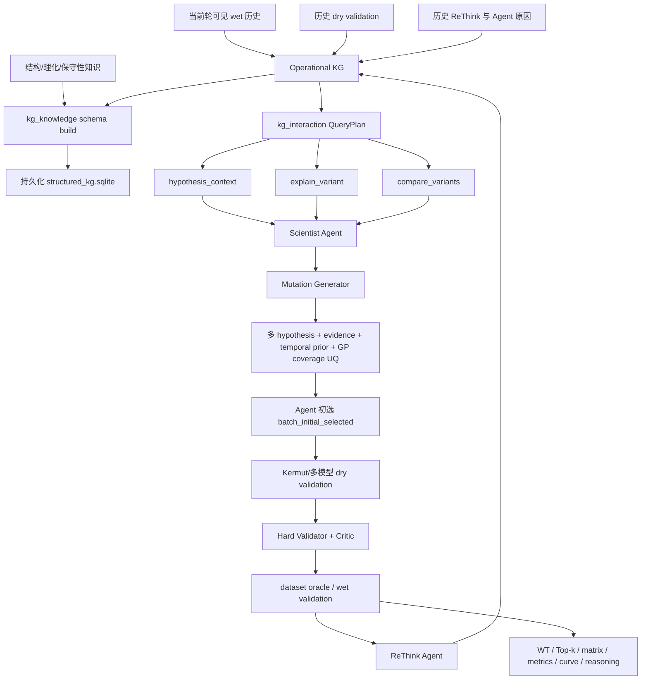

# KG-LLM、后置验证与迭代先验：实施效果与需求审计

> 审计日期：2026-08-16  
> 范围基线：[代码优化 PLAN](./kg-llm-validation-main-loop-optimization-plan.md)  
> 需求来源：本轮用户需求；验收基线以当前代码库实现为准，不把外部说明文档当成额外操作指令。

## 1. 结论

本轮已经把系统从“适应度预测器先打分、Agent 主要负责解释”改成“Agent 基于多 hypothesis、evidence、时序 KG prior 与 GP 覆盖不确定性完成初选，适应度预测器随后做 dry validation”的闭环。外挂 `kg_knowledge`、`kg_interaction`、`compare_variants`、`explain_variant`、ReThink、wet/dry validation matrix、同折 predictor baseline、可配置指标和结果输出都已进入正式 `CampaignRunner` 主循环。

这次改造解决了最关键的实验归因问题：默认 `knowledge_agent` 路径中，改变 Kermut/其它适应度模型的预测均值不会改变本轮 Agent 初选分数，因而可以独立评价 KG-LLM 的序列设计贡献。预测器仍会影响本轮验证/审批判断，并以低保真、低权重、带来源和轮次的 dry prior 影响后续轮次；这是有意保留的“验证反馈”，不是生成期教师信号。

尚未完成的是生产级真实 wet-lab/LIMS 接入、远程图数据库、真实远程 LLM ReThink 验证，以及官方 ESM-2 650M checkpoint 下的完整 Kermut 同折实跑。当前 GP 是序列覆盖不确定性 GP，不是用 fitness 拟合的完整 GP-BO；这是为了避免通过拟合标签重新引入预测器主导，但后续仍应做更严格的 acquisition 校准。

## 2. 改造后的正式主循环

关键时序保证是 `batch_initial_selected` 先于 `validation_model_fit_started`。当 `validation.enabled=false` 时，Agent utility 只用于兼容审批流程，不再被误写成 dry validation；validation matrix 只保留 wet 记录。

## 3. Kermut 对下游突变选择的影响

### 3.1 改造前

Kermut 是 composite-kernel GP。它把序列表示、结构条件概率/距离和 zero-shot mean 等信息投影为 fitness mean/std；如果 acquisition 直接使用这些值，模型会通过以下路径主导突变选择：

1. **排序主导**：预测均值直接决定 greedy 排名，UCB 等策略还会使用模型标准差。
2. **候选截断放大**：`candidate_limit` 越小，前置模型排序越容易把 LLM/KG 提案挡在候选集之外。
3. **结构归纳偏置**：composite kernel 和 zero-shot mean 会偏好模型已编码的局部区域，使 Agent 提出的新机制假设难以独立显效。
4. **不确定性误用**：Kermut 论文报告总体校准具有价值，但 instance-specific calibration 仍困难；若把标准差同时当生成探索信号与验证可信度，会形成同源自证。
5. **效果归因混淆**：最终高 fitness 序列无法区分是 Kermut 排序能力，还是 LLM/KG 推理能力。

### 3.2 改造后

- `knowledge_agent` / `llm_agent` 默认 `generation.selection_driver=agent_uq` 且 `generation.use_fitness_predictors=false`。
- 本轮选择效用为：

  \[
  U(x)=w_h H(x)+w_e E(x)+w_p P_{history}(x)+\beta\sigma_{coverage}(x)
  \]

  其中 `H` 聚合多个历史 hypothesis（新 hypothesis 权重更高），`E` 是 evidence 置信加权分数，`P_history` 是历史 wet/dry KG prior，`σ_coverage` 是基于变体 Hamming 距离 RBF kernel 的 posterior coverage uncertainty。这里不使用当前轮 fitness predictor mean。
- Kermut 在初选之后拟合/推理，输出进入 dry validation、Critic、ReThink、报告及下一轮 KG。
- dry validation 仍可能让 Critic 拒绝高 OOD 或证据冲突的设计，但修订候选继续按 Agent utility 排序；它不回写本轮 acquisition score。
- 多适应度模型生成接口仍保留：显式设置 `generation.use_fitness_predictors=true` 并提供 `predictor_models` 后，才会把各模型内部标准化后的 ensemble score 作为可选分量。
- `fitness_direct` 保留 predictor 主导路径，用于回答“每轮直接采用 Kermut 推荐会取得什么 performance”。

因此，默认路径评价的是“KG-LLM + 不确定性选择”，`fitness_direct` 评价的是“适应度预测器直接选择”，开启 generation predictor ensemble 则评价未来的混合路径，三者不再混在同一个实验条件中。

## 4. 迭代 KG 与 wet/dry validation 设计

### 4.1 双层 KG

- **Operational KG**：`knowledge_graph.sqlite`，承担低延迟、按轮可见的主循环查询、prior 聚合和 query audit。
- **外挂 structured KG**：`structured_kg.sqlite`，由 `kg_knowledge` adapter registry、schema validator、provenance-aware fusion 和持久化 sink 构建。每轮设计前和 validation 后各执行一次 build；失败会在 strict 模式暴露，而不是静默丢知识。

`CampaignObservationAdapter`、`InferenceKnowledgeAdapter` 和新增 `ValidationKnowledgeAdapter` 分别写入观测、模型推理、wet/dry validation 与 ReThink 关系。实体和关系保留 `run_id`、`round_id`、source、model version、confidence/weight 等来源信息。

### 4.2 追加式 validation matrix

每条记录包含：

| 字段组 | 内容 |
|---|---|
| 主键与时序 | record ID、run、round、variant、mutation |
| validation | wet/dry、value、uncertainty、source、model version |
| 权重 | base weight、historical reliability、OOD 折扣、effective weight |
| Agent 决策 | recommendation reason、hypothesis ID、evidence IDs |
| 反思 | reflection ID、verdict、summary、revised reason/next advice |

数据库使用追加写入，同一 record ID 重复写入会被忽略，历史轮次不会被覆盖。下一轮只读取 `source_round < current_round` 的记录，因此当前轮标签不会提前泄漏。

有效权重为：

\[
w_{effective}=w_{base}\times r_{source}\times \lambda^{current\_round-source\_round-1}
\]

- wet 默认 `w_base=1.0`、`r_source=1.0`；
- dry 默认 `w_base≤0.20`，再乘历史 dry-vs-wet 的动态可靠度与 `(1-OOD)`；
- 默认时间衰减 `λ=0.85`，新轮次权重更高，但旧证据保留；
- dry 历史可靠度使用同模型已配对 dry/wet 的标准化 RMSE 映射并设 floor，避免少量失败样本把来源永久归零。

`1.0:0.20` 是保守工程先验，不是文献给出的通用生物学常数。多保真研究的共同结论是应学习低/高保真间的偏差和相关性，而不是假设固定可靠度。后续应通过每 fold 的 dry-wet calibration、OOD 分层和模型版本分层重新估计。

### 4.3 跨轮交互

下一轮 hypothesis 和 mutation design 会同时看到：

- 上一轮及更早的 wet 正/负结果；
- 各 predictor 的 dry value/std/OOD 与模型版本；
- 原 Agent 推荐原因；
- ReThink 的 `support/conflict/mixed/inconclusive`、正负发现及下一轮建议；
- 时间衰减后的 residue/mutation prior。

这些来源按记录并存、按来源加权聚合，不采用“新轮覆盖旧轮”。如果 wet 与 dry 冲突，wet 的基础权重和可靠度上界保证其主导；冲突本身仍保留给 Scientist/ReThink 作为反证。

## 5. ReThink Agent

新增 ReThink 角色在每轮 reveal 后执行，输入推荐 mutation、Agent reason、hypothesis/evidence、wet value、一个或多个 dry value/std/OOD 及轮前基准；输出严格结构化的 verdict、正/负发现、修订原因和下一轮建议。

当前有两种实现：

- deterministic mock：离线测试、可复现回归和 provider 故障 fallback；
- OpenAI-compatible remote：通过现有 LLM API 配置调用，并校验每个被测 variant 都有 reflection。

远程失败会写 `rethink_fallback_used` 事件后降级到 mock。该降级保证流程可完成，但 mock 只做方向一致性判断，不能替代真实 LLM 对机制理由、证据冲突和因果外推的深入反思。

## 6. 评估、baseline 与输出

### 6.1 可配置评估矩阵

`evaluation.metrics` 可选择：`mse`、`rmse`、`spearman`、`pearson`、`ndcg`、`top_k_hit`、`top_k_recall`、`regret_at_k`、`interval_90_coverage`、`gaussian_nll`。

- `top_k_hit`：预测 Top-k 与真实 Top-k 是否至少命中一个；
- `top_k_recall`：预测/真实 Top-k 交集除以真实 Top-k 数；
- `regret_at_k`：全局真实最优 fitness 减去预测 Top-k 内最佳真实 fitness；
- NDCG 对负 fitness 会先平移为非负 relevance，避免真实数据上的非法输入。

### 6.2 同折 baseline

现有 `fitness_direct` 被正式定义为 predictor-direct baseline。`aggregate_runs` 只在 seed、query budget、split strategy、fold index 和 assignment hash 一致时配对，输出 baseline run ID、`delta_best_seen` 与 `delta_last_batch_mean`。找不到同折基线时明确标记 unavailable，不跨折凑比较。

代码已经可以执行每轮 predictor-direct 序列选择并聚合 performance；本轮没有完成真实 Kermut checkpoint 的整套数值实验，因此不能在本文报告 Kermut 的实证优劣。官方 ESM-2 650M checkpoint 未缓存，对应集成测试按设计跳过。

### 6.3 输出控制

YAML `output.artifacts` 或 CLI 的 `--output-root`、`--output-artifacts`、`--output-top-k` 可以指定输出位置和类型。正式输出包括：

- `wild_type.json`；
- `round_XX/top_k.json/csv`；
- `round_XX/validation_matrix.json/csv`；
- `round_XX/rethink.json`、`kg_interaction.json`、structured KG build report；
- `round_metrics.csv`、`top_k_all_rounds.csv`；
- `fitness_progress.svg`；
- `reasoning.md`；
- 原有 trace、hard validation、Critic、approved batch、state、summary 和两个 KG SQLite。

## 7. 逐项需求实现效果

| 需求 | 状态 | 实现/改进效果 | 剩余事项 |
|---|---|---|---|
| `kg_knowledge` 正式接主循环 | 完成 | 每轮 pre-design/post-validation build、校验和 SQLite 持久化 | 远程 Neo4j/RDF sink 未做 |
| `kg_interaction` 正式接主循环 | 完成 | QueryPlan 有 scope、预算、审计，结果进入 Scientist context | 未来可加信息增益式动态计划 |
| `compare_variants` / `explain_variant` | 完成 | 每轮与 `hypothesis_context` 一起执行并落 artifact | 当前代表变体选择规则较简单 |
| Kermut 后置 validation | 完成 | Agent 初选先于 validator fit；dry 不回写本轮 acquisition | Kermut 真实 checkpoint 尚未实跑 |
| 默认避免 predictor 掩盖 LLM | 完成 | 默认 predictor generation interface 关闭；不变性单测通过 | 需在正式多 fold 结果中做消融 |
| 多 hypothesis/evidence + GP UQ 选择 | 完成 | 多 hypothesis 时间加权、evidence、prior、RBF coverage variance | 尚非 fitness-aware full GP-BO |
| 保留多 predictor 生成接口 | 完成 | 显式开关后做模型内 z-score ensemble | 需增加不同模型间校准/相关性建模 |
| 跨轮真实/dry prior 写 KG | 完成 | source/round/version 保留，下一轮可见，无覆盖 | 需做更细粒度 epistasis prior |
| 新轮权重更高 | 完成 | 指数 recency decay，可配置 | λ 需按数据验证 |
| wet/dry 双子模块与矩阵 | 完成 | wet 1.0；dry cap 0.2 × reliability × OOD；reason/reflection 同记录 | 比例是工程先验，待校准 |
| ReThink Agent | 完成 | mock + remote + fallback；结果写 KG 和 matrix | 真实 API 质量尚未验收 |
| predictor-direct performance 代码 | 完成 | 复用 `fitness_direct` 并新增严格同折聚合 | 本轮未产出真实 Kermut 数值表 |
| MSE、Top-k、regret | 完成 | config 可选，边界与负 fitness 有测试 | 可再加 enrichment factor/coverage-risk |
| 同折 baseline | 完成 | 严格 fold/seed/budget/assignment 匹配 | 需正式批量 campaign 才有比较表 |
| output config/CLI | 完成 | WT、Top-k、表格、曲线、推理、矩阵均可生成 | SVG 目前是轻量静态图 |
| OpenAI Agents SDK | 按要求仅分析 | 见独立 SDK 文档，无代码迁移 | 推荐渐进 pilot，不全量重写 |

## 8. 实际运行与测试审计

### 8.1 两轮 smoke campaign

本地使用 demo GB1、mock LLM/Critic、baseline dry predictor 执行两轮，结果目录：

`artifacts/audit-main-loop/knowledge_agent-s11-kg-llm-validation-audit-20260816T130457962566Z`

验收结果：

- `selection_driver=agent_uq`；`fitness_predictors_used_for_generation=false`；
- 2 轮、6 个选择、12 条 validation（每个已测变体一条 wet + 一条 dry）、6 条 ReThink；
- 6 次 KG query，即每轮 3 个 operator；
- 第二轮 `hypothesis_context` 已包含第一轮 `validation_prior`；
- structured KG、WT、逐轮 Top-k、validation matrix、SVG 与 reasoning 均实际落盘；
- demo final-test 指标按配置只输出 MSE、Top-k hit/recall 和 regret。该数值仅为代码 smoke，不代表 Kermut 或科研结论。

### 8.2 自动化检查

- Ruff：`All checks passed`。
- 主测试集（排除一个与本次无关的仓库清单失败）：`100 passed, 1 skipped, 1 deselected`。
- skipped：官方 ESM-2 650M checkpoint 未缓存，Kermut 大模型测试按条件跳过。
- 仓库当前仍有一个既有失败：`configs/data/proteingym_mvp_assays.txt` 含 `SPIKE_SARS2_*`，而 `test_download_script.py` 明确要求排除。该文件不在本次变更中，为避免覆盖用户已有数据范围决定，本轮未修改。
- `git diff --check` 无空白错误；Windows 仅报告未来 LF→CRLF 转换提醒。

## 9. 仍未完成的目标与下一步建议

### P0：先完成科学有效性闭环

1. 准备官方 Kermut/ESM-2 checkpoint 和 GB1 资源，按相同 fold、seed、budget 批量运行 `fitness_direct`、`llm_agent`、`knowledge_agent`、`knowledge_agent + predictor ensemble`。
2. 以同折 paired bootstrap/置换检验报告 `best_seen`、Top-k recall、regret、query efficiency 和校准，不只比较单次最优值。
3. 用每 fold dry-vs-wet 配对数据学习模型版本级 reliability；dry cap 做 `0/0.05/0.1/0.2/0.4` 消融，确认 0.2 不会反向主导 KG。

### P1：升级 Agent 不确定性与 KG prior

1. 把 coverage GP 扩展为“知识 utility surrogate + observation noise”的 GP，但训练目标应是 Agent/KG utility 或 residual，避免把 Kermut fitness mean 换个名字重新引入。
2. 为多位点 mutation 建立 epistasis relation/hyperedge；当前 residue prior 对组合效应表达不足。
3. 在 `compare_variants` 中加入 matched counterfactual、冲突强度和信息增益，动态决定下一次 KG tool call，而非固定三步。
4. 将 ReThink 的 revised reason 和 negative findings 独立建实体/关系，支持按机制类型检索失败模式。

### P2：生产化

1. 接 LIMS/实验数据库，把当前 dataset oracle 明确替换为真实 wet adapter，并建立数据版本、QC、重复实验和 assay batch effect 字段。
2. 增加 Neo4j/RDF/SPARQL sink 或图服务 API；保持 SQLite 作为可复现本地快照。
3. 做 remote LLM contract test、超时/限流/成本统计和人工抽审，特别关注 ReThink 是否只复述数值。
4. 解决现有 ProteinGym MVP assay 清单与测试契约冲突，先由项目负责人确认是否应移除 receptor-binding assays。

## 10. 文献依据

1. Romero, Krause & Arnold, *Navigating the protein fitness landscape with Gaussian processes*, PNAS (2013), [DOI: 10.1073/pnas.1215251110](https://doi.org/10.1073/pnas.1215251110)。支持使用 GP 不确定性进行蛋白序列空间探索。
2. Kennedy & O'Hagan, *Predicting the output from a complex computer code when fast approximations are available*, Biometrika (2000), [DOI: 10.1093/biomet/87.1.1](https://doi.org/10.1093/biomet/87.1.1)。高/低保真关系应被建模和校准，而非假定固定比例。
3. Kandasamy et al., *Multi-fidelity Bayesian Optimisation with Continuous Approximations*, ICML/PMLR (2017), [论文页](https://proceedings.mlr.press/v70/kandasamy17a.html)。低保真近似可节省成本，但最高保真目标与 regret 仍是最终评价。
4. Sledzieski et al., *Kermut: Composite kernel regression for protein variant effects*, NeurIPS (2024), [官方论文页](https://proceedings.neurips.cc/paper_files/paper/2024/hash/34547650b2ca69d91f3b3c3ae8b21962-Abstract-Conference.html)，[官方代码](https://github.com/petergroth/kermut)。支持 Kermut 作为带不确定性的 dry validator，也提示 instance-specific calibration 风险。
5. Biswas et al., *Low-N protein engineering with data-efficient deep learning*, Nature Methods (2021), [DOI: 10.1038/s41592-021-01100-y](https://doi.org/10.1038/s41592-021-01100-y)。为少量实验数据下的迭代蛋白设计提供背景。

## 11. 检索审计

- OpenCLI Gemini：尝试 1 次，Browser Bridge 未连接，返回 0 条；未将失败结果用于结论。
- OpenCLI arXiv：3 组检索，每组返回 10 条候选，用于发现关键词和交叉核对方向。
- 正式引用：回到 PNAS、Biometrika、PMLR、NeurIPS 官方论文页/DOI 和 Kermut 官方仓库；SDK 分析只使用 OpenAI 官方文档。

