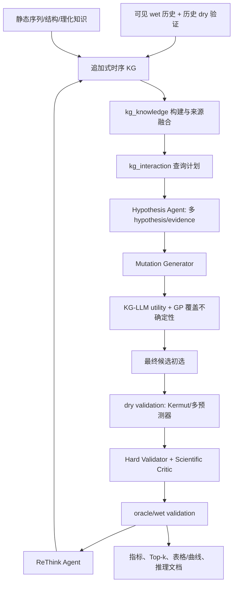

# KG-LLM、验证后置与不确定性突变设计：代码优化 PLAN

> 状态：实施前基线，2026-08-16。本文先于本轮代码改造创建，是后续执行与审计的唯一范围基准。
>
> 执行状态：已按本 PLAN 完成实现与审计；逐项结果见[实施效果与需求审计](./kg-llm-validation-main-loop-implementation-audit.md)。

## 1. 目标与不可破坏约束

本轮目标是把现有的“预测器主导候选排序”改造为可审计的“KG-LLM 生成与不确定性选择 + 预测器后置验证”闭环，同时把外挂结构化 KG、KG 交互、ReThink、评估和结果输出正式接入主循环。

必须保持以下约束：

1. Agent 只能看到当前轮允许可见的真实观测，不能读取 final-test 或尚未揭示的 oracle 标签。
2. 对 `llm_agent`、`knowledge_agent`，默认选择路径不得使用 Kermut 或其它适应度预测器的预测均值；预测器只在候选生成/初选完成后进入 dry validation。
3. 保留多适应度预测器的生成期接口，但默认关闭；显式配置后方可用于模型集成路径。
4. `fitness_direct` 继续作为“每轮直接采用适应度模型推荐”的独立同折基线。
5. wet 与 dry 记录必须追加、版本化、带轮次与来源，禁止覆盖历史轮次。
6. wet 为权威高保真观测；dry 是带不确定性和可靠度折扣的低保真证据，不能伪装成实验测量。
7. 现有硬验证、Critic 审批、提交许可和 final-test 隔离保持有效。

## 2. 当前代码基线与差距

当前 `CampaignRunner` 每轮首先拟合 `config.model`，随后对候选进行预测，最后由 acquisition 使用预测均值/标准差选择批次。因此即使 Scientist Agent 生成了 hypothesis，Kermut 仍然是最终推荐的主要排序器，Agent 的独立贡献会被掩盖。

已有可复用能力：

- `kg_knowledge` 已有统一实体/关系 schema、观测与推理 adapter、来源感知融合、校验器和消融配置；但未接主循环，sink 仅有内存实现。
- `kg_interaction` 已有受限 QueryPlan、`hypothesis_context`、`explain_variant`、`compare_variants` 和查询审计；但主循环只直接调用一次 `hypothesis_context`。
- `ObservationKnowledgeGraph` 已区分 measurement、prediction、evidence、hypothesis，并实施按轮次的观测可见性。
- `FitnessPredictor` 注册接口已经支持 Kermut 与外部预测器；`fitness_direct` 已存在。
- 当前预测指标含 Spearman、Pearson、RMSE、NDCG、区间覆盖率和 Gaussian NLL，但缺显式 MSE、Top-k hit/recall、regret 及同折基线差值。
- 当前输出含 JSON/CSV/trace，但缺统一的 WT、逐轮 Top-k 汇总、曲线和推理/反思 Markdown。

## 3. 目标主循环

其中 `fitness_direct` 走单独基线路径：候选池 -> 适应度预测器 -> 预测均值/配置 acquisition -> Top-k -> oracle；其结果与 Agent 路径按相同 fold、seed、预算比较。

## 4. 详细实施项

### P1. 配置合同

新增并向后兼容以下配置：

- `generation`：选择驱动、GP 不确定性参数、知识/假设权重、是否允许生成期预测器、可选多预测器接口。
- `validation`：是否启用 dry validation、验证预测器列表、wet/dry 基础权重、dry 上限、时间衰减、ReThink 开关。
- `evaluation`：允许的指标清单、Top-k 值、regret 定义。
- `output`：输出根目录、启用的 artifact 类型、逐轮 Top-k 数量、是否输出推理文档和曲线。
- `kg_interaction`：是否接入、operator 白名单、查询预算、是否提前停止。

验收：旧 YAML 不修改也能加载；新配置会写入运行目录的 `config.json`；CLI 可覆盖 output root 与 artifact 类型。

### P2. Agent 不确定性选择器

新增 `AgentUncertaintySelector`：

- exploitation 仅来自 hypothesis 匹配、证据置信加权分数和跨轮 validation prior；
- exploration 使用 GP kernel 在已观测序列上的 posterior variance/coverage uncertainty；
- 默认不接收适应度预测均值；
- 预留 `predictor_predictions` 多模型输入，只有 `generation.use_fitness_predictors=true` 时才融合；
- 返回独立的 design score、uncertainty、组成项和可审计 reason。

验收：单元测试证明在默认配置下改变预测器均值不会改变 Agent 选择分数；启用接口后可融合多模型。

### P3. Kermut 后置为 dry validation

重排 Agent 模式的轮次顺序：

1. KG 查询与 hypothesis；
2. 生成候选并用 Agent-UQ 完成初选；
3. 之后才拟合 Kermut/验证预测器并产生 dry validation；
4. dry 结果供 validator、Critic、ReThink 和报告使用，但不回写本轮 acquisition score。

`fitness_direct` 保持预测器主导，以便测量“若每轮直接采用 Kermut 推荐会怎样”。

验收：trace 中 Agent 模式的 `batch_initial_selected` 早于 `validation_model_fit_started`；selection artifact 同时标明 selection driver 与 validation model。

### P4. 外挂结构化 KG 正式接入

- 在主循环创建 `CampaignObservationAdapter` 与 `InferenceKnowledgeAdapter` registry。
- 每轮把当前可见 variants/observations、dry predictions、evidence、hypotheses 构造成 schema-first snapshot。
- 新增持久化 sink，把规范化实体和关系写入独立 SQLite，保留来源、置信度和有效轮次。
- 构建报告与 snapshot 摘要按轮输出，构建失败在 strict 模式下阻断，避免静默知识损坏。
- 运行时 Observation KG 继续承担低延迟、安全查询；structured KG 是规范化外挂层，两者通过相同记录 ID/round/source 对齐。

验收：每轮均产生 structured KG build report；SQLite 含实体/关系；不是只在测试中实例化。

### P5. `kg_interaction`、`compare_variants`、`explain_variant`

主循环每轮执行受限 QueryPlan：

- `hypothesis_context`：历史观测、先验与 prior hypotheses；
- `explain_variant`：解释当前可见的代表性高 fitness 变体；
- `compare_variants`：比较至少两个当前可见代表性变体；
- 所有查询必须经过 allow-list、variant scope 和轮次可见性校验，并写入 trace/query audit。

InteractionResult 作为 Scientist Agent 的结构化上下文，而不是仅写日志。

验收：每轮 query artifact 显示三个 operator 被执行或给出明确跳过原因；LLM payload 中含 EvidencePack 的事实、预测、反证和 caveat。

### P6. wet/dry validation 矩阵与时序先验

新增追加式 `validation_records`：

- 分区：`wet`（真实 fitness）与 `dry`（模型预测）。
- 每条记录：run/round、variant、mutation、value、uncertainty、source/model、base/effective weight、Agent 推荐原因、hypothesis/evidence、ReThink 结论。
- wet 默认基础权重 `1.0`；dry 默认最高 `0.20`，且再乘模型历史可靠度与 OOD/不确定性折扣。
- 跨轮使用指数时间衰减，越新轮次有效权重越高，但历史记录永久保留。
- 下一轮 KG 按来源独立聚合，wet 与 dry 不直接覆盖；同一变体/突变可以保留多个模型和多个轮次的证据。

权重依据采用多保真建模原则，而非声称存在通用固定比例：Kennedy 与 O'Hagan 的层级 GP 将高/低保真间关系作为需要估计的偏差/相关性；Kandasamy 等的多保真 BO 将低保真视为有成本优势但有偏差的近似。工程默认 `wet:dry_cap = 1.0:0.2` 是保守先验，不是文献常数，必须根据同折 dry-vs-wet 校准表现动态下调。

### P7. ReThink Agent

新增离线可复现 mock 与 OpenAI-compatible 实现。每轮 oracle reveal 后，输入：

- 推荐 mutation、Agent 原因、hypothesis/evidence；
- wet value；
- 一个或多个 dry value/std/OOD；
- 可见历史基准。

输出结构化 `support / conflict / mixed / inconclusive`、正样本总结、负样本总结、原因修订与下一轮建议。结果写入 wet/dry validation matrix，并进入下一轮 KG context。

验收：每个已测候选都有 reflection；远程失败按配置使用 deterministic fallback，且记录 fallback。

### P8. 指标与同折基线

预测指标支持由 config 选择：

- `mse`、`rmse`、`spearman`、`pearson`、`ndcg`；
- `top_k_hit`：预测 Top-k 与真实 Top-k 是否至少相交；
- `top_k_recall`：交集大小 / 真实 Top-k 大小；
- `regret_at_k`：真实全局最优 fitness 减去预测 Top-k 中的最佳真实 fitness；
- calibration 指标继续可选。

`aggregate_runs` 在相同 fold + seed + 预算中寻找 `fitness_direct`，写入 baseline run id 与 Agent 相对差值；若缺对应基线则明确标记缺失，禁止跨折比较。

验收：指标单测覆盖完美排序、反向排序、k 大于样本数与缺失对齐；聚合测试覆盖同折匹配和无基线场景。

### P9. 结果输出

依据 output config 生成：

- `wild_type.json`；
- 每轮 `top_k.json/csv`，含 sequence、mutation、Agent score、uncertainty、dry/wet validation；
- `round_metrics.csv` 与汇总表；
- `fitness_progress.svg`；
- `reasoning.md`，包含 hypothesis、KG 查询摘要、推荐原因、dry/wet 结果、ReThink 和失败案例；
- 现有 `trace.jsonl`、审批 artifacts 和状态文件继续保留。

验收：关闭某种 artifact 后不生成该文件；默认正式配置生成全部要求项。

### P10. 审计与文档

- 新增/更新单元、集成、泄漏测试。
- 运行相关测试、Ruff 和最小 campaign smoke test。
- 新建实施审计 Markdown，逐项报告“完成/部分完成/未做”、证据文件、测试和剩余风险。
- OpenAI Agents SDK 仅做架构分析，不安装、不迁移代码。

## 5. 文献与设计边界

- Romero、Krause 与 Arnold 证明 GP 的显式不确定性可以支持蛋白序列空间的高效搜索，适合作为 Agent 选择中的 exploration 信号：[PNAS, 2013](https://doi.org/10.1073/pnas.1215251110)。
- Kennedy 与 O'Hagan 使用层级 GP 融合昂贵高保真输出和廉价近似，核心是估计跨保真关系而非固定权重：[Biometrika, 2000](https://doi.org/10.1093/biomet/87.1.1)。
- Kandasamy 等的 BOCA 说明低保真近似可降低优化成本，但目标仍是最高保真函数及其 regret：[ICML/PMLR, 2017](https://proceedings.mlr.press/v70/kandasamy17a.html)。
- Kermut 是带 composite kernel 的 GP，整体不确定性校准有价值，但论文同时指出 instance-specific calibration 更困难。因此它适合 dry validation 和对照，不应在本实验默认路径中同时充当“生成老师”和“效果裁判”：[NeurIPS, 2024](https://proceedings.neurips.cc/paper_files/paper/2024/hash/34547650b2ca69d91f3b3c3ae8b21962-Abstract-Conference.html)。

## 6. 不在本轮实施范围

- 不迁移到 OpenAI Agents SDK；仅给出规范化收益、迁移代价、guardrail 边界和渐进迁移建议。
- 不接真实 wet-lab/LIMS，不把 oracle 模拟结果描述成真实实验结果。
- 不把 dry prediction 写成 `Observation`，不允许 dry 覆盖 wet。
- 不宣称默认 `0.20` dry cap 是生物学通用常数；它必须可配置并由校准数据更新。

## 7. 完成定义

本轮只有在以下条件同时满足时才算完成：

1. PLAN 已先写入 docs；
2. Agent 模式选择默认与适应度预测均值解耦；
3. Kermut/多模型 dry validation、wet validation 和 ReThink 进入主循环；
4. structured KG 与三个 KG operator 进入主循环并有 artifact；
5. 新指标、同折 baseline 和完整输出可配置；
6. 测试与最小运行通过；
7. docs 中有 SDK 分析和逐需求实施审计。
