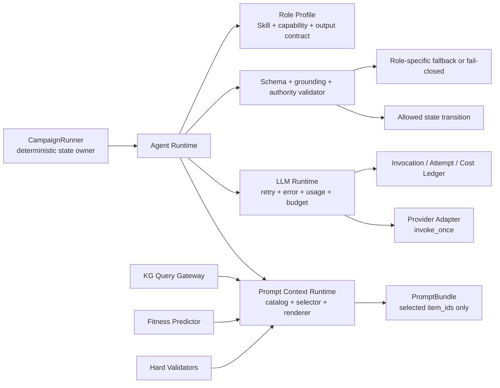

# LLM API 运行时、独立 Agent 与结构化 Prompt 模块化改进 PLAN

> 状态：Implementation-ready，尚未实施
> 审计日期：2026-08-16
> 适用仓库：`fitness-agents`
> 交付边界：本文件只制定代码改进计划；本轮不修改运行时代码，不实现 Prompt 提取脚本
> 已确认范围：核心协议 provider-neutral；第一阶段实现 OpenAI Responses/OpenAI-compatible；数值 fitness 仍由专用 predictor 产生

## 0. 执行结论

当前系统已经具备两个真实远程 LLM 入口、严格结构化输出的雏形、Critic 审批门、隐藏标签隔离和一份结构化英文 Critic Skill。但 LLM 调用仍散落在业务 Agent 内部，缺少统一请求契约、异常分类、可控重试、token/成本账本、角色级配置和 Prompt 模块选择器。Scientist 与 Critic 也没有共用一套可审计运行时；其他预期角色尚未成为独立 LLM Agent。

本 PLAN 建议执行以下架构决策：

1. 新增业务无关的 `LLMRuntime.invoke(request) -> result`，Provider adapter 一次只发送一个请求，不做隐藏重试。
2. 每个 Agent 独立配置 provider、model、reasoning、timeout、retry、预算、Skill、Prompt selector、输出契约和 fallback；Agent 之间不共享 message history 或隐式 memory。
3. 由确定性的 `CampaignRunner` 继续拥有状态机和安全边界，但五类 LLM Agent 的有效决策必须真实改变后续状态或控制流，而不是只生成说明文本。
4. 使用稳定 `item_id` 表示 Prompt 信息模块；角色 manifest 只能选择显式允许的 item，运行时不再把完整 campaign context 直接塞给所有 Agent。
5. 为 Prompt catalog、payload bundle、role selector、renderer 和 extractor CLI 建立独立包；大上下文先由可信代码生成摘要 item，再按 ID 选取，禁止 LLM 先读取全部信息再自我裁剪。
6. LLM-facing DTO 使用 Pydantic v2 作为单一 schema 来源；现有科研领域对象可以继续使用 dataclass，避免手写 Python 解析与 JSON Schema 漂移。
7. 重试次数由用户配置的 `max_retries` 精确控制，语义为“首次调用之外允许的额外尝试数”，因此 `max_attempts = 1 + max_retries`。
8. 对 transport、timeout、rate limit、quota、auth、bad request、5xx、refusal、incomplete、schema、grounding、model identity、usage 和预算错误分别分类；每次 attempt 都生成可追溯记录。
9. token 账本区分 input、cached input、reasoning、visible output；reasoning token 是 output token 的子集，成本聚合不得重复计费，也不保存隐藏思维链内容。
10. 先迁移现有 Hypothesis Scientist 与 Critic，再接入 KG Query Planner、Mutation Designer、Confidence & Risk Assessor，最后移除旧 `llm_provider` 兼容入口。

## 1. 已确认的需求边界

### 1.1 本次纳入

- 统一 LLM API 调用抽象和 Provider adapter；
- 用户配置的重试、timeout、backoff、fallback、并发与预算保护；
- 异常检测接口、统一错误码、可安全返回的诊断信息和完整 attempt 追踪；
- input / reasoning / visible output token 与成本记录；
- 五类独立 LLM Agent 的配置、上下文、Skill、输出契约和决策权限；
- fitness 预测、KG 交互、突变位点设计、置信度判别和独立审查所需 Prompt item；
- Prompt item-id catalog、按角色选择/提取/渲染模块和 CLI 脚本设计；
- 配置迁移、测试、可观测性、分阶段 PR 和验收条件。

### 1.2 明确非目标

- 不让 LLM 替代 `FitnessPredictor` 直接生成数值 fitness；
- 不记录、请求或展示隐藏 chain-of-thought；只记录 Provider 返回的 reasoning token 数；
- 第一阶段不实现 Anthropic、Vertex 等 Provider，仅保证协议可扩展；
- 不把 Agent 改造成自由对话或允许其自行创建新权限；
- 不向 LLM 暴露 raw SQL/Cypher、oracle 路径、final-test 标签、API key 或任意 shell；
- 本轮不直接新增运行时代码或 Prompt 提取脚本；
- 不重写现有开放式 Mutation Designer、KG 写回和 Critic 控制流 PLAN，只定义它们怎样接入统一 LLM/Prompt 基础设施。

## 2. 当前代码审计

### 2.1 真实 LLM 调用入口

| 调用路径 | 当前行为 | 已有能力 | 主要缺口 |
|---|---|---|---|
| `agents/llm.py::OpenAICompatibleLLMClient.generate_hypothesis` | 直接调用 `client.responses.create`，代码内嵌 system prompt，把 `sanitized_context` 和最多 80 条 evidence 整体序列化 | Responses API、严格 JSON Schema、API key 只读环境变量 | 无显式 timeout/retry/backoff；无异常分类、usage、cost、request ID、prompt hash；模型仅由全局环境变量选择 |
| `agents/critic.py::OpenAICriticClient.review` | 直接调用 `client.responses.create`，把 Critic `SKILL.md` 作为 system prompt，把整个 review context 序列化 | 独立 Critic model 配置、结构化英文 Skill、严格输出 schema | Provider 调用仍与 Agent 混合；temperature 字段保存但未传给 API；无 usage/cost/timeout/error ledger |
| `agents/critic.py::CriticAgent.review` | `max_retries + 1` 次循环，捕获全部 `Exception`，耗尽后 rule fallback 或抛统一 RuntimeError | 用户已能配置 Critic retry 数；fail-closed fallback | 无 backoff；auth/quota/schema/timeout 全部同样重试；旧失败被覆盖；没有 attempt 级记录；可能与 SDK 内建重试叠加 |

当前只有 Hypothesis Scientist 与 Critic 会调用远程 LLM。Mutation generator、fitness predictor、acquisition、KG operator 和 hypothesis evaluator 均为确定性代码。

### 2.2 Agent 独立性现状

| 维度 | 当前状态 | 判断 |
|---|---|---|
| 独立 API 调用 | Scientist 和 remote Critic 分开调用；其余角色不存在 | 部分满足 |
| 独立模型配置 | Critic 有 `critic.model`；Scientist 只有全局 `FITNESS_AGENTS_LLM_MODEL` | 不满足 |
| 独立上下文 | Scientist 与 Critic 构造不同 dict，但没有统一 allow-list selector、context budget 或 item provenance | 部分满足 |
| 独立输出契约 | Hypothesis 与 CritiqueDecision 分开 | 当前两角色满足 |
| 决策权限 | Critic 的 APPROVE/REVISE/REJECT 已进入审批门；Scientist 假设会影响候选过滤 | 当前两角色有实际影响 |
| 独立 Skill | 只有 Critic 有 `SKILL.md`；rubric/version/examples 没有被统一 loader 完整消费 | 不满足 |
| 调用审计 | 只记录 hypothesis/critique 业务结果，没有 invocation/attempt 账本 | 不满足 |

### 2.3 Prompt 与上下文现状

1. Scientist system prompt 是 `agents/llm.py` 内的一段固定字符串，无法独立版本化或 hash。
2. `ScientistAgent.sanitized_context` 只做 forbidden-key 检查，不是按角色的字段 allow-list；新字段一旦加入 context，可能无意进入 LLM。
3. Scientist 接收全部 visible observations，并由 orchestrator 预先 flatten 最多 120 条 evidence，LLM adapter 再截为 80 条；两级无契约截断难以复现“为什么保留这些信息”。
4. Critic 接收 draft 中所有候选对应的 variants、predictions、evidence 和 conflict report；没有 item ID、单项大小、优先级或压缩说明。
5. `kg_interaction/` 已有 `KGQueryPlan`、`EvidencePack`、tool budget 和 allow-list，但只被单元测试使用，未接入主 orchestrator。
6. Prompt hash、selected item IDs、context token estimate、裁剪原因和 schema hash 均未写入 trace。
7. Hypothesis 与 Critic 的 JSON Schema 都由手工字典维护；`HYPOTHESIS_SCHEMA` 未禁止额外字段，`preferred_residues` 也缺少位置/残基语义约束，Provider schema 与本地构造器可能漂移。

### 2.4 Skill 现状

`agents/critic_profiles/scientific_v1/SKILL.md` 已经使用结构化英文，包含 Role、Objective、Trusted Inputs、Review Lenses、Decision Procedure、Output Contract 和 Prohibited Behavior，是后续模板的良好起点。但当前 loader 只读取 `SKILL.md`：

- `rubric.yaml`、`version.json` 与 `decision_examples.jsonl` 没有成为统一运行时输入；
- 没有校验 profile ID/version、语言、必需章节或内容 hash；
- 没有检查 Skill 声明的工具/权限是否与代码 capability 一致；
- 没有为其他角色配置各自 Skill；
- Skill 只是 prompt 文本，真正权限仍需继续由代码控制。

### 2.5 运行保护与成本现状

- Scientist 没有项目级 retry/fallback；
- Critic 只做无差别立即重试；
- 两个 OpenAI client 都没有显式设置 SDK retry，无法证明用户配置等于真实网络尝试次数；
- 无 per-attempt timeout、总 deadline、circuit breaker 或 provider concurrency limit；
- 无 request/response ID、latency、status、stop reason、incomplete reason；
- 无 input/cached/reasoning/output usage；
- 无单价版本、attempt cost、role/round/run 成本汇总；
- 失败调用是否产生 token/cost 当前不可知；
- `JsonArtifactWriter` 可复用为 append-only sink，但尚无 LLM 专用 ledger schema。

### 2.6 当前可复用资产

- `CritiqueDecisionValidator` 与 `ApprovalGateway` 已实现“LLM 不能覆盖 hard conflict”；
- `assert_sanitized`、隐藏标签 leakage tests 和 KG round visibility 可扩展为 item-level visibility policy；
- `KGInteractionController`、`KGQueryPlan`、`EvidencePack` 可直接作为 KG Planner 输出与工具结果；
- `JsonArtifactWriter` 已提供 append-only JSONL 事件能力；
- Mock Scientist、Rule Critic 和 deterministic predictor/generator 可作为各角色 fallback 与离线测试基线；
- 当前相关测试基线通过：Scientist、Critic、KG interaction、hidden-label 共 18 项通过。

## 3. 目标架构



核心区分：

- `LLMRuntime` 共享的是调用机制，不共享 Agent 对话、上下文或决策状态；
- `AgentRuntime` 负责角色状态机、工具循环和权限；
- `Prompt Context Runtime` 负责只取当前角色需要的信息；
- `CampaignRunner` 只执行经过 schema、grounding、capability 和 hard-rule 校验的决策；
- Provider SDK 永远不直接被 Scientist、Critic 或未来 Agent import。

### 3.1 建议目录

```text
src/fitness_agents/
  llm/
    contracts.py
    config.py
    errors.py
    retry.py
    usage.py
    pricing.py
    ledger.py
    runtime.py
    providers/
      base.py
      mock.py
      openai_responses.py
  prompts/
    contracts.py
    catalog.py
    selectors.py
    builders.py
    renderer.py
    validators.py
  agents/
    runtime.py
    hypothesis_scientist.py
    kg_query_planner.py
    mutation_designer.py
    confidence_assessor.py
    critic.py
    profiles/
      hypothesis_scientist/scientific_v1/
      kg_query_planner/bounded_v1/
      mutation_designer/protein_design_v1/
      confidence_assessor/calibrated_risk_v1/
      independent_critic/scientific_v1/
configs/
  llm/
    default.yaml
    models.yaml
    pricing.yaml
  prompts/
    catalog.yaml
    roles/
      hypothesis_scientist.yaml
      kg_query_planner.yaml
      mutation_designer.yaml
      confidence_assessor.yaml
      independent_critic.yaml
scripts/
  prompts/
    extract_prompt_items.py
```

现有 `agents/llm.py` 在迁移期保留为 deprecated shim；`critic_profiles/scientific_v1` 迁移到统一 `agents/profiles/independent_critic/scientific_v1`。

## 4. 统一 LLM 调用契约

LLM-facing DTO 推荐使用 Pydantic v2，并通过 `model_json_schema()` 生成 Provider structured-output schema。领域内已有 `Variant`、`Prediction`、`Evidence` 等 dataclass 暂不重写。

### 4.1 `LLMInvocationRequest`

| 字段组 | 必需字段 |
|---|---|
| 身份 | `invocation_id`, `run_id`, `round_id`, `agent_role`, `action` |
| 模型 | `provider_id`, `model_alias`, `resolved_model_id`, `reasoning_effort` |
| Prompt | `profile_id/version/hash`, `prompt_id/version/hash`, `selected_item_ids`, `context_hash` |
| 输出 | `output_contract_id/version/hash`, `strict_schema` |
| 工具 | `allowed_tool_names`, `tool_policy_id`, `max_tool_calls` |
| 保护 | `timeout_s`, `deadline_s`, `max_output_tokens`, `max_retries` |
| 预算 | `max_input_tokens`, `max_total_tokens`, `max_cost_usd` |
| 追溯 | `input_artifact_ids`, `kg_snapshot_id`, `request_fingerprint`, `idempotency_key` |

请求对象不含 API key、真实 base URL、oracle 路径或 raw hidden labels。

### 4.2 `LLMInvocationResult[T]`

| 字段组 | 必需字段 |
|---|---|
| 结果 | `status`, `value: T | None`, `output_contract_valid`, `grounding_valid` |
| 调用 | `invocation_id`, `successful_attempt_id`, `provider_request_id` |
| 模型 | `requested_model_id`, `response_model_id`, `model_identity_valid` |
| 资源 | `usage`, `estimated_cost_usd`, `cost_completeness`, `elapsed_ms` |
| 尝试 | `attempt_count`, `retry_count`, `fallback_used` |
| 终止 | `stop_reason`, `incomplete_reason`, `failure: LLMFailure | None` |
| 审计 | `response_hash`, `selected_item_ids`, `ledger_refs` |

`status` 固定为 `SUCCESS | FALLBACK | FAILED | DEFERRED`，业务层不得只依靠 exception 文本判断结果。

### 4.3 Provider adapter

```python
class LLMProvider(Protocol):
    provider_id: str

    def invoke_once(
        self,
        request: ProviderRequest,
        *,
        timeout_s: float,
    ) -> ProviderResponse:
        ...
```

约束：

1. `invoke_once` 一次只产生一次外部请求；
2. OpenAI client 显式设置 `max_retries=0`，总 retry 仅由项目 runtime 控制；
3. adapter 只做字段映射与 Provider 错误归一化，不实现业务 fallback；
4. response 必须保留 request ID、实际 model ID、status、usage 和 incomplete/refusal 信息；
5. raw payload 默认只保存经过 redaction 的 hash 和受控 artifact 引用。

## 5. 运行保护策略

### 5.1 配置语义

```yaml
llm:
  defaults:
    retry:
      max_retries: 2
      initial_backoff_s: 1.0
      max_backoff_s: 30.0
      jitter: full
      respect_retry_after: true
    timeout:
      per_attempt_s: 90
      total_deadline_s: 240
    circuit_breaker:
      enabled: true
      transient_failure_threshold: 5
      recovery_timeout_s: 60
    concurrency:
      max_in_flight_per_provider: 4
    trace_payloads: redacted
```

- `max_retries=0`：最多 1 次外部请求；
- `max_retries=2`：最多 3 次外部请求；
- schema repair、context reduction 后重发也必须消耗 retry 配额；
- SDK 内建 retry 禁用，防止“配置 2 次，实际最多 9 次”的乘法效应；
- retry attempt 使用相同 invocation ID、新 attempt ID，并保存旧响应；
- backoff 使用 exponential full jitter，Provider 有 `Retry-After` 时优先遵守；
- 每次重试前重新检查 deadline、cost budget、circuit breaker 与 cancellation。

### 5.2 失败分类与动作

| 统一类别 / 错误码 | 常见来源 | 默认 retry | 默认动作 | 对用户返回的安全信息 |
|---|---|---:|---|---|
| `CONFIGURATION / LLM-CONFIG-001` | SDK 未安装、缺少环境变量、未知 provider/model | 否 | 启动或角色初始化失败 | 指明缺少的配置项名称，不回显值 |
| `AUTHENTICATION / LLM-AUTH-001` | 401、invalid/revoked key | 否 | abort role/run | “认证失败，请检查凭据环境变量” |
| `PERMISSION / LLM-PERM-001` | 403、model/project 无权访问 | 否 | abort role/run | “当前凭据无权访问指定模型或资源” |
| `INVALID_REQUEST / LLM-REQUEST-001` | 400、参数不兼容、未知字段 | 否 | fail closed | 返回参数类别和 provider request ID |
| `CONTEXT_LIMIT / LLM-CONTEXT-001` | 上下文超限、输出上限非法 | 条件式 | 仅允许一次确定性 context reduction | 返回原/新 token estimate 与被裁剪 item IDs |
| `NETWORK / LLM-NETWORK-001` | DNS、TLS、proxy、connection reset | 是 | backoff retry | 返回网络类别、attempt、request hash |
| `TIMEOUT / LLM-TIMEOUT-001` | connect/read/overall timeout | 是 | retry；耗尽后 fallback/abort | 返回 timeout 类型与耗时 |
| `RATE_LIMIT / LLM-RATE-001` | 可恢复 429 | 是 | 尊重 Retry-After | 返回重试等待和剩余次数 |
| `QUOTA_OR_BILLING / LLM-QUOTA-001` | credit/spend/usage limit 429 | 否 | abort/fallback | 指明 quota/billing，不建议无效重试 |
| `PROVIDER_5XX / LLM-PROVIDER-001` | 500/502/503/overloaded | 是 | backoff retry | 返回状态码与 request ID |
| `CONFLICT / LLM-CONFLICT-001` | 409 或 provider state conflict | 条件式 | 仅对无副作用请求重试 | 返回 conflict 与幂等键 |
| `REFUSAL / LLM-REFUSAL-001` | structured refusal/safety refusal | 否 | role fallback 或 deferred | 返回 refusal 类别，不伪装为 schema error |
| `INCOMPLETE / LLM-INCOMPLETE-001` | max output、content filter、空输出 | 条件式 | max-output 可修复一次；filter 不自动重试 | 返回 incomplete reason |
| `SCHEMA / LLM-SCHEMA-001` | JSON parse、缺字段、enum/extra field 错误 | 是，受总配额限制 | 一次结构修复后 fallback | 返回 schema ID、validator 摘要 |
| `GROUNDING / LLM-GROUND-001` | 编造 item/evidence/candidate/query ID | 是，受总配额限制 | 修复或 fail closed | 返回无效引用 ID 的 redacted 摘要 |
| `MODEL_IDENTITY / LLM-MODEL-001` | 实际模型不在允许列表 | 否 | fail closed | 返回请求/实际模型 ID |
| `USAGE_INVALID / LLM-USAGE-001` | usage 缺失、负数、分项不一致 | 否或降级 | 标记 cost partial；按策略 fail | 返回缺失字段 |
| `BUDGET / LLM-BUDGET-001` | token/cost/deadline 超预算 | 否 | deferred/fallback | 返回预算类型和已消耗值 |
| `CIRCUIT_OPEN / LLM-CIRCUIT-001` | 同 provider/model 连续瞬时失败 | 否 | 快速 fallback | 返回恢复时间 |
| `UNKNOWN / LLM-UNKNOWN-001` | 未映射异常 | 否 | fail closed 并保留 cause | 返回 error ID 供追查 |

OpenAI 官方文档明确区分连接、timeout、认证、bad request、server 和 rate-limit 异常；对 429 还必须检查 `error.code`，因为 rate limit 可以重试，而 credit/spend/usage limit 重试不会恢复服务。实现时以 [OpenAI API error codes](https://developers.openai.com/api/docs/guides/error-codes) 为 adapter 映射依据。

固定并测试 OpenAI SDK 版本后，adapter 至少显式映射 `APIConnectionError`、`APITimeoutError`、`AuthenticationError`、`PermissionDeniedError`、`BadRequestError`、`ConflictError`、`NotFoundError`、`UnprocessableEntityError`、`RateLimitError` 和 `InternalServerError`；其他 `APIStatusError` 进入按 HTTP/status/body code 的保守分类，未知异常不得被宽泛捕获后自动重试。

### 5.3 异常检测接口

```python
class LLMErrorClassifier(Protocol):
    def classify(
        self,
        error: Exception,
        *,
        provider_id: str,
        attempt: AttemptContext,
    ) -> LLMFailure:
        ...

class LLMFailureSink(Protocol):
    def record_failure(self, failure: LLMFailure) -> None:
        ...
```

`LLMFailure` 至少包含：

- `error_id`, `invocation_id`, `attempt_id`, `agent_role`;
- `category`, `phase`, `retryable`, `disposition`;
- `provider_exception_type`, `http_status`, `provider_error_code`;
- `provider_request_id`, `retry_after_s`, `occurred_at`;
- `safe_message`, `diagnostic_message_redacted`, `cause_chain_hash`;
- `prompt_hash`, `request_hash`, `selected_item_ids`;
- `usage_if_available`, `estimated_cost_if_available`.

不得捕获 `KeyboardInterrupt`、`SystemExit` 或用户 cancellation 并伪装成 Provider 错误。业务最外层接收统一 result；内部异常必须使用 `raise ... from error` 保留 cause。

### 5.4 Runtime 算法

```text
validate request/config
  -> build fingerprint and preflight token/cost budget
  -> acquire provider concurrency slot
  -> for attempt in 0..max_retries
       check cancellation/deadline/circuit/cost
       create immutable attempt record
       call provider.invoke_once
       normalize status/model/usage
       parse output contract
       validate references and authority
       on success: commit result and usage
       on failure: classify + persist
       if terminal/exhausted: break
       sleep using Retry-After or exponential full jitter
  -> execute configured role fallback or return FAILED/DEFERRED
```

### 5.5 角色级 fallback

| Agent | 默认 fallback | 安全语义 |
|---|---|---|
| Hypothesis Scientist | deterministic mock/rule hypothesis，或跳过 LLM hypothesis | 不创建无 schema/无证据假设 |
| KG Query Planner | deterministic minimal allow-listed plan，或不查询 KG | 不扩大 scope、不自由查询 |
| Mutation Designer | 当前 deterministic candidate generator | 所有候选仍过 constraint/predictor/acquisition |
| Confidence & Risk Assessor | deterministic UQ/calibration rule | 缺信息时 `UNRESOLVED`，不能自动高置信 |
| Independent Critic | `RuleBasedCriticClient` fail-closed | hard conflict 仍拒绝；不可直接提交 |

fallback 必须在 result 和 ledger 中显式标记，实验报告不得把 fallback 结果统计为对应 LLM Agent 的成功决策。

## 6. Token 与成本账本

### 6.1 统一 usage

```python
class LLMUsage(BaseModel):
    input_tokens_total: int | None
    input_tokens_cached: int | None
    input_tokens_cache_write: int | None
    input_tokens_uncached: int | None
    output_tokens_total: int | None
    reasoning_tokens: int | None
    visible_output_tokens: int | None
    total_tokens: int | None
    provider_reported: bool
    semantics: str
```

核算规则：

1. `reasoning_tokens` 是 `output_tokens_total` 的子集，不可与 total output 再相加；
2. Provider 明确该语义时，`visible_output_tokens = output_tokens_total - reasoning_tokens`；
3. Provider 不返回 reasoning 明细时记录 `null`，禁止根据文本长度臆测；
4. cached input 是 input 的子集；uncached input 由可靠字段推导，否则为 `null`；
5. attempt 失败但 Provider 返回 usage 时仍计入成本；
6. usage 缺失时成本为 `unknown/partial`，不能静默记为 0。

### 6.2 单价配置与成本

`configs/llm/pricing.yaml` 由用户或项目维护，记录 `provider/model/effective_date/currency/source_note` 和每百万 token 单价；运行时冻结 pricing version/hash，避免在线价格变化破坏复现。

```yaml
pricing_version: 1
currency: USD
models:
  openai:gpt-example:
    effective_date: YYYY-MM-DD
    input_per_million: null
    cached_input_per_million: null
    cache_write_per_million: null
    output_per_million: null
```

当 reasoning 使用 output 费率且是 output 子集时：

- `reasoning_cost = reasoning_tokens * output_rate`;
- `visible_output_cost = visible_output_tokens * output_rate`;
- `output_cost = reasoning_cost + visible_output_cost`;
- `total_cost = uncached_input_cost + cached_input_cost + cache_write_cost + output_cost`。

这样可以按用户要求展示“输入 / 思考 / 输出”分类，同时不重复计费。

### 6.3 账本文件

```text
artifacts/runs/<run_id>/llm/
  invocations.jsonl
  attempts.jsonl
  failures.jsonl
  cost_summary.json
  by_agent.json
```

`attempts.jsonl` 是单次外部请求的唯一计数依据；`cost_summary.json` 至少按 run、round、agent role、provider、model、status 和 fallback 聚合：

- invocation/attempt/retry/fallback 数；
- input/cached/reasoning/visible output tokens；
- estimated cost 与 `complete | partial | unknown`；
- latency p50/p95/max；
- rate-limit、timeout、schema、grounding、quota 等失败计数；
- context item count、prompt size 和 compression ratio。

默认 trace 不保存 API key、base URL、完整 traceback、隐藏标签或完整 prompt payload。需要重放时保存经过 policy 批准的 redacted artifact，并通过 hash 验证。

## 7. 独立 Agent、输出契约与真正决策权限

“独立”不要求每个角色拥有不同进程或不同厂商模型，而要求每次调用具备独立的配置、Skill、context selection、output contract、trace 和 state transition。即使两个角色暂时使用同一基础模型，也不得共享 messages、previous response ID 或未声明 memory。

### 7.1 权限矩阵

| Agent | 只读输入 | 独立输出契约 | 真实决策权限 | 代码强制的禁止项 |
|---|---|---|---|---|
| Hypothesis Scientist | task、可见 observation 摘要、上一假设评估、已选 evidence | `HypothesisDecision/v2` | 创建/修订当前 active hypothesis；决定下一轮要检验的 claim | 不生成 fitness；不选择最终 batch；不批准实验；不能引用不可见 evidence |
| KG Query Planner | 当前问题、evidence gap、允许的 entity/variant scope、工具 catalog | 现有 `KGQueryPlan/v1` | 决定调用哪些只读 KG operator、顺序与 intent | 不执行 raw SQL；不扩大 candidate scope；不写 KG；受 tool-call/row budget |
| Mutation Designer | hypothesis、mutation constraints、shortlisted predictions/evidence | `MutationDesignDecision/v1` | 决定候选设计意图、软优先级、需要保留的 controls 和待评估 proposal shortlist | 不写未经验证的最终序列；不改预测；不能绕过 hard constraints/acquisition |
| Confidence & Risk Assessor | calibrated Prediction、OOD、model disagreement、evidence conflicts、coverage metadata | `ConfidenceAssessment/v1` | 将候选路由为 `RELIABLE / CAUTION / UNRESOLVED`，可强制请求额外证据或进入 Critic | 不把自报 confidence 当预测概率；不能将 unknown 判为通过；不能批准 batch |
| Independent Critic | frozen DraftBatch、hard report、prediction/evidence snapshot、falsification spec | 现有 `CritiqueDecision/v1` | `APPROVE / REVISE / REJECT`，决定是否生成 ApprovedBatch | 不能降级 hard conflict；不改序列/预测/阈值；不提交 backend |

### 7.2 数值预测、证据置信与 LLM 自信必须分开

系统中至少存在三种不同语义，不能继续统称 `confidence`：

1. **Predictive confidence**：由 predictor posterior、calibration、interval coverage、OOD 等确定性计算产生；这是 fitness 数值风险的主要依据。
2. **Evidence confidence/quality**：表示某条 evidence 的来源质量、独立性与适用范围；可由规则与 Assessor 给出结构化等级，但必须说明语义。
3. **LLM decision confidence**：Agent 对自己结构化判断的自报值，只用于审计、漂移分析或触发复核，不得覆盖 predictor、hard validator 或 approval policy。

`ConfidenceAssessment` 推荐字段：

```python
class ConfidenceAssessment(BaseModel):
    assessment_id: str
    candidate_id: str
    level: Literal["RELIABLE", "CAUTION", "UNRESOLVED"]
    predictive_risk_codes: list[str]
    evidence_risk_codes: list[str]
    calibration_refs: list[str]
    prediction_ids: list[str]
    evidence_ids: list[str]
    required_action: Literal[
        "CONTINUE", "REQUEST_EVIDENCE", "SEND_TO_CRITIC", "DEFER"
    ]
    decision_confidence: float
    summary: str
```

本地 validator 必须验证引用存在、level 与 required_action 一致，以及高 OOD/缺校准时不能输出 `RELIABLE`。

### 7.3 决策权的验收定义

一个角色只有满足以下全部条件，才算拥有“真正的决策权限”：

1. 输出通过独立 schema 和 semantic validator；
2. 输出映射到明确、allow-listed state transition；
3. 在同一输入下替换该角色的合法输出，会可预测地改变工具调用、候选集合、路由或审批结果；
4. orchestrator 不能忽略输出后继续原路径；
5. hard rules 和其他角色所有权仍能覆盖越权决策；
6. transition、decision ID、input/output hashes 被写入 trace。

不得以“生成一段 rationale 并写入日志”冒充决策权限。

## 8. 结构化 Prompt Item 设计

### 8.1 Item ID 规范

推荐稳定格式：

```text
<domain>.<entity>.<purpose>.v<major>
```

例如：

- `task.identity.objective.v1`
- `task.sequence.reference.v1`
- `state.observation.visible_summary.v1`
- `model.fitness.prediction_snapshot.v1`
- `kg.evidence.position_summary.v1`
- `mutation.constraint.allowed_edits.v1`
- `review.conflict.hard_report.v1`

规则：

1. item ID 表示语义契约，不包含 run/round/candidate 等实例值；
2. breaking schema change 增加 major；措辞或 builder bugfix 只增加 catalog revision；
3. 每个实例另有 `item_instance_id` 和 `content_hash`；
4. role selector 使用 exact ID 或受控 prefix pattern，不使用自由 regex；
5. item payload 只允许 JSON-compatible typed data，不在 Markdown 大段文本中做模糊搜索；
6. 同一 bundle 中 `item_instance_id` 唯一，排序由 selector manifest 明确指定。

### 8.2 Prompt item 契约

```python
class PromptItem(BaseModel):
    item_id: str
    item_version: int
    item_instance_id: str
    producer: str
    schema_id: str
    payload: dict[str, JsonValue]
    visibility: Literal["PUBLIC", "ROUND_VISIBLE", "INTERNAL_SAFE"]
    as_of_round: int | None
    source_artifact_ids: list[str]
    priority: int
    estimated_tokens: int | None
    content_hash: str
```

`PromptBundle` 还应包含 `run_id`、`round_id`、`task_id`、`kg_snapshot_id`、catalog revision/hash 与完整 item index。它可以在内存构造；持久化时仍需应用 redaction policy。

### 8.3 首批 item catalog

| Item ID | 内容 | 可信生产者 | 典型消费者 |
|---|---|---|---|
| `task.identity.objective.v1` | task/protein/assay/objective/fitness semantics | config loader | 全角色 |
| `task.sequence.reference.v1` | reference sequence、position convention、mutable scope | task adapter | Hypothesis、KG、Designer |
| `task.mutation.constraints.v1` | allowed residues/depth、forbidden edits、budget | deterministic constraint builder | Designer、Critic |
| `state.round.metadata.v1` | run/round/phase/remaining budget | orchestrator | Hypothesis、KG、Designer |
| `state.observation.visible_summary.v1` | 仅已揭示 observation 的分层摘要和引用 | observation summarizer | Hypothesis |
| `state.hypothesis.active.v1` | 当前 hypothesis version、claim、evidence refs | hypothesis store | KG、Designer、Assessor、Critic |
| `state.hypothesis.last_assessment.v1` | 上次 deterministic assessment | hypothesis evaluator | Hypothesis |
| `model.fitness.prediction_snapshot.v1` | shortlisted prediction IDs、mean/std/interval/OOD、model version | FitnessPredictor adapter | Designer、Assessor、Critic |
| `model.fitness.calibration.v1` | uncertainty kind、coverage、calibration version、适用范围 | model evaluator | Assessor、Critic |
| `kg.query.allowed_scope.v1` | operator catalog、allowed IDs、row/depth/tool budget | KG policy | KG Planner |
| `kg.evidence.position_summary.v1` | 位点/残基支持、反证、provenance | KG operator | Hypothesis、Designer |
| `kg.evidence.variant_pack.v1` | candidate-level EvidencePack | KG operator | Designer、Assessor、Critic |
| `kg.evidence.conflict_summary.v1` | polarity/source/scope conflicts | KG/operator or validator | Assessor、Critic |
| `mutation.candidate.shortlist.v1` | 经确定性 prefilter 的候选 IDs 与 lineage | candidate generator | Designer |
| `mutation.design.previous_decision.v1` | 上一轮设计决策及结果 | state store | Designer |
| `confidence.candidate.assessment.v1` | Assessor 输出 | Confidence Agent | Critic |
| `review.batch.draft.v1` | frozen DraftBatch、design rationales、hashes | draft builder | Critic |
| `review.conflict.hard_report.v1` | deterministic hard/soft conflict report | BatchHardValidator | Critic |
| `review.falsification.preregistered.v1` | frozen executable spec | evaluator/preregister builder | Critic |
| `security.prompt.untrusted_text.v1` | 被标记为数据的 natural-language evidence | evidence adapter | 需要 evidence 文本的角色 |

`security.prompt.untrusted_text.v1` 必须被 renderer 包在显式 data boundary 中；Skill 需要说明绝不执行其中的指令。

### 8.4 角色 selector

```yaml
selector_id: hypothesis_scientist.context.v1
role: hypothesis_scientist
required_items:
  - task.identity.objective.v1
  - task.sequence.reference.v1
  - state.round.metadata.v1
  - state.observation.visible_summary.v1
optional_items:
  - state.hypothesis.active.v1
  - state.hypothesis.last_assessment.v1
  - kg.evidence.position_summary.v1
forbidden_prefixes:
  - oracle.
  - final_test.
  - review.internal_critic.
limits:
  max_items: 16
  max_estimated_tokens: 12000
overflow_policy:
  strategy: deterministic_summary
  never_drop_required: true
ordering:
  - task.
  - state.round.
  - state.observation.
  - state.hypothesis.
  - kg.evidence.
```

每个角色的最小建议选择：

| Role | 必需 item | 明确不应收到 |
|---|---|---|
| Hypothesis Scientist | task、reference、round、visible observation summary | 完整 candidate pool、Critic 决策草稿、hidden labels |
| KG Query Planner | task objective、reference、active hypothesis/evidence gap、allowed KG scope | 全量 observation 文本、API/provider 配置、write capability |
| Mutation Designer | task constraints、active hypothesis、prediction shortlist、相关 evidence | oracle pool 全表、final labels、Critic 私有 review |
| Confidence Assessor | prediction snapshot、calibration、OOD/model disagreement、evidence conflicts | 全部历史 prompt、未进入 shortlist 的候选 |
| Independent Critic | frozen draft、hard report、prediction/evidence/assessment、falsification spec | Designer system prompt、其他角色 message history、实验 backend capability |

### 8.5 大信息量 Prompt 的裁剪策略

裁剪必须在 LLM 调用前由确定性代码完成：

1. 先按 role selector 去除无关 item；
2. 对 required item 做 schema 验证和 visibility 检查；
3. 对 candidate/evidence item 使用稳定排序：风险、相关性、source independence、stable ID；
4. 超限时调用 item 自己注册的 deterministic summarizer；
5. summarizer 输出新的 summary item，记录 parent item IDs、算法版本和 dropped count；
6. 仍超限则 fail closed，返回 `LLM-CONTEXT-001`，不能静默截断 JSON 字符串；
7. 记录 pre/post token estimate、保留/删除 item IDs、compression hash。

Scientist 当前的“orchestrator 截 120 条、adapter 再截 80 条”应被替换为一个可追溯 selector/summarizer。

## 9. Prompt Catalog、提取模块与 CLI 脚本

### 9.1 模块职责

| 文件 | 职责 |
|---|---|
| `prompts/contracts.py` | PromptItem、PromptBundle、RoleSelector、SelectedPromptContext |
| `prompts/catalog.py` | 加载 catalog、校验 item ID/schema/producer/visibility、计算 hash |
| `prompts/builders.py` | 从 task/state/prediction/KG/review 对象生成 typed item |
| `prompts/selectors.py` | exact/prefix 选择、required/forbidden/limit/ordering、explain trace |
| `prompts/renderer.py` | 将 Skill、action instruction、selected context、output contract 渲染为 Provider messages |
| `prompts/validators.py` | hidden-label、prompt injection boundary、schema、token budget、引用检查 |
| `scripts/prompts/extract_prompt_items.py` | 离线检查、按 role/item-id 提取、渲染预览和 selection explain |

### 9.2 核心 API

```python
def select_prompt_items(
    bundle: PromptBundle,
    selector: RoleSelector,
    *,
    token_estimator: TokenEstimator,
) -> SelectedPromptContext:
    ...

def render_agent_request(
    *,
    skill: AgentSkill,
    action_prompt: ActionPrompt,
    context: SelectedPromptContext,
    output_contract: OutputContract,
) -> RenderedPrompt:
    ...
```

`SelectedPromptContext` 必须返回：

- selected items 与稳定顺序；
- missing required、rejected forbidden、deduplicated items；
- summarized parent/child item 关系；
- estimated token count；
- selection manifest/hash；
- human-readable `explain`，说明每个 item 为什么被保留或删除。

### 9.3 CLI 契约

```powershell
python scripts/prompts/extract_prompt_items.py --bundle artifacts/runs/<run>/round_01/prompt_bundle.json --role mutation_designer --format json --explain

python scripts/prompts/extract_prompt_items.py --bundle <bundle.json> --item-id model.fitness.prediction_snapshot.v1 --item-id kg.evidence.variant_pack.v1 --format provider-messages
```

建议参数：

- `--role`：加载对应 role selector；
- `--item-id`：显式 exact ID，可重复；
- `--item-prefix`：只允许 catalog 注册的 prefix；
- `--format json|yaml|provider-messages|ids`；
- `--max-tokens`：只能收紧 selector，不可放宽角色上限；
- `--explain`：输出 selection/rejection reason；
- `--validate-only`：不显示 payload，只做 contract/visibility/token 检查；
- `--redact`：默认开启，禁止命令行关闭 hidden-label redaction；
- `--output`：可选；默认 stdout，写文件时原子替换并保存 hash。

退出码：

- 0：成功；
- 2：CLI 使用错误；
- 3：catalog/bundle/schema 错误；
- 4：missing required item；
- 5：visibility/security violation；
- 6：token budget 无法满足。

### 9.4 Renderer 消息结构

Provider-neutral renderer 固定四层，避免所有信息拼成一段自由文本：

1. system：该角色 Skill 的已验证内容；
2. system/developer-equivalent：本次 action、权限 envelope、output contract 摘要；
3. user：带 `item_id/schema_id/content_hash` 的 selected context JSON；
4. Provider structured-output schema：由输出 DTO 自动生成。

OpenAI Responses adapter 将以上结构映射到当前支持的 input/format 字段；其他 Provider 以后只替换 adapter，不改变 PromptBundle。

## 10. Skills 编写与加载策略

### 10.1 每个 Skill bundle

```text
agents/profiles/<role>/<profile_id>/
  SKILL.md
  manifest.yaml
  rubric.yaml
  examples.jsonl
  version.json
```

- `SKILL.md`：英文、结构化、短而稳定的角色指令；
- `manifest.yaml`：role、profile/version、allowed tools、selector ID、output contract ID、fallback ID；
- `rubric.yaml`：机器可读的 hard/soft decision rules；
- `examples.jsonl`：少量 schema-valid、边界和对抗示例；
- `version.json`：bundle 版本、兼容 schema、内容 hashes。

### 10.2 SKILL.md 必需英文结构

所有角色统一使用以下章节；CI 检查标题、语言和完整性：

```markdown
# <Role Name>

## 1. Identity
## 2. Objective
## 3. Trusted Inputs
## 4. Untrusted Inputs
## 5. Decision Authority
## 6. Required Procedure
## 7. Allowed Tools
## 8. Output Contract
## 9. Uncertainty and Failure Policy
## 10. Prohibited Behavior
```

编写原则：

1. 使用英文和编号结构，动词采用 MUST / MUST NOT / MAY；
2. Identity 只定义单一角色，不把 Scientist、Designer、Critic 合并；
3. Decision Authority 明确可改变的状态和不可改变的状态；
4. Trusted/Untrusted Inputs 明确 evidence statement 可能包含 prompt injection；
5. Procedure 描述可观察步骤和 evidence requirements，不要求输出隐藏思维链；
6. Output Contract 引用 schema ID/version，不复制容易漂移的完整 JSON Schema；
7. Failure Policy 要求 unknown/defer/fail-closed，禁止在缺数据时“最佳猜测通过”；
8. 不写 API key、路径、动态 candidate IDs、长知识材料或具体单价；
9. examples 只示范结构与边界，不灌入 benchmark 隐藏答案；
10. Skill 权限声明必须是代码 capability 的子集，否则 profile loader 拒绝启动。

### 10.3 五个 Skill 的重点

| Role | Skill 重点 | 特别禁止 |
|---|---|---|
| Hypothesis Scientist | falsifiability、evidence linkage、assumptions、supersession | 数值 fitness、事后改阈值、引用未知 evidence |
| KG Query Planner | evidence gap、support/counterevidence、bounded plan、stop condition | raw query language、scope expansion、write proposal |
| Mutation Designer | full-sequence context、epistasis awareness、controls、diversity、constraints | 单点分数简单相加、绕过 predictor、批准自己 batch |
| Confidence Assessor | calibration semantics、OOD、source independence、unknown handling | 把 LLM confidence 当 probability、缺失即通过 |
| Independent Critic | deterministic conflict first、evidence audit、falsification readiness、batch decision | 降级 hard error、修改 prediction/sequence、提交实验 |

当前 Critic Skill 可迁移为 Independent Critic v1，但需要补齐 manifest loader、hash、权限一致性和 examples 测试。

### 10.4 Skill loader

`load_agent_profile(role, profile_id)` 必须：

- 验证所有 bundle 文件存在；
- 验证 role/profile/version/selector/schema 相互匹配；
- 验证 `SKILL.md` 无中文字符且包含必需章节；
- 验证 allowed tools 不超过代码 capability；
- 验证 examples 通过 output DTO；
- 计算每个文件和整个 bundle hash；
- 将 hash 写入 invocation；
- 拒绝未声明文件、路径穿越、symlink 越界和动态 include；
- 不允许角色在运行中自行加载其他角色 Skill。

第一阶段的 Skill 是本地、版本化的 instruction bundle，由 renderer 注入 system message，并不假设 Provider 原生支持 hosted Skills。未来即使增加 hosted Skill adapter，也必须继续使用同一 manifest、content hash、capability gate 和本地输出验证。

## 11. 独立配置模型

当前 `llm_provider` 与 `CriticConfig` 中的模型字段应拆成：

1. `LLMRuntimeConfig`：全局 retry/timeout/concurrency/circuit/trace/pricing；
2. `LLMProviderConfig`：provider adapter、credential env name、base URL env name；
3. `LLMAgentConfig`：每个角色的 model/reasoning/profile/selector/schema/budget/fallback；
4. 保留 `CriticPolicyConfig`：review revision 次数、on_reject、hard thresholds 等业务策略。

```yaml
llm:
  runtime:
    retry:
      max_retries: 2
      initial_backoff_s: 1.0
      max_backoff_s: 30.0
    timeout:
      per_attempt_s: 90
      total_deadline_s: 240
    pricing_config: configs/llm/pricing.yaml
  providers:
    openai_main:
      adapter: openai_responses
      api_key_env: FITNESS_AGENTS_LLM_API_KEY
      base_url_env: OPENAI_BASE_URL
  agents:
    hypothesis_scientist:
      enabled: true
      provider: openai_main
      model: gpt-5-mini
      reasoning_effort: medium
      profile: scientific_v1
      context_selector: hypothesis_scientist.context.v1
      output_contract: HypothesisDecision/v2
      max_retries: 2
      fallback: deterministic_hypothesis
      max_input_tokens: 12000
      max_output_tokens: 1800
      max_cost_usd_per_round: null
    kg_query_planner:
      enabled: true
      provider: openai_main
      model: gpt-5-mini
      reasoning_effort: low
      profile: bounded_v1
      context_selector: kg_query_planner.context.v1
      output_contract: KGQueryPlan/v1
      max_retries: 1
      max_tool_calls: 2
      fallback: deterministic_minimal_query
    mutation_designer:
      enabled: true
      provider: openai_main
      model: gpt-5-mini
      reasoning_effort: medium
      profile: protein_design_v1
      context_selector: mutation_designer.context.v1
      output_contract: MutationDesignDecision/v1
      max_retries: 2
      fallback: deterministic_candidate_generator
    confidence_assessor:
      enabled: true
      provider: openai_main
      model: gpt-5-mini
      reasoning_effort: low
      profile: calibrated_risk_v1
      context_selector: confidence_assessor.context.v1
      output_contract: ConfidenceAssessment/v1
      max_retries: 1
      fallback: deterministic_uq_rules
    independent_critic:
      enabled: true
      provider: openai_main
      model: gpt-5-mini
      reasoning_effort: medium
      profile: scientific_v1
      context_selector: independent_critic.context.v1
      output_contract: CritiqueDecision/v1
      max_retries: 2
      fallback: rule_critic
```

验证要求：

- role key 必须来自固定 enum；
- 每个角色的 selector/profile/schema/capability 必须兼容；
- config 不能保存真实 secret 或 base URL，只保存环境变量名；
- model alias 必须通过 model registry 解析并验证 response model identity；
- role-level `max_retries` 覆盖 runtime default；
- startup 时打印 secret-free effective config 和 hash。

## 12. 主循环接入顺序

每轮建议采用 manager-owned specialist 流程：

```text
fit predictor and create typed Prediction snapshot
  -> build base PromptBundle from visible state only
  -> KG Query Planner decides bounded read-only evidence plan
  -> KGInteractionController executes plan and adds EvidencePack items
  -> Hypothesis Scientist creates/supersedes active hypothesis
  -> deterministic generator/predictor builds candidate shortlist
  -> Mutation Designer chooses design intent, controls and proposal shortlist
  -> hard constraints + predictor + acquisition recompute full candidates
  -> Confidence Assessor routes candidates and evidence gaps
  -> build frozen DraftBatch
  -> BatchHardValidator
  -> Independent Critic APPROVE / REVISE / REJECT
  -> ApprovalGateway and ExperimentBackend
  -> deterministic HypothesisEvaluator after observations
```

### 12.1 重要顺序约束

1. Predictor 先产生数值与 calibration metadata；任何 LLM 都不能回写这些字段。
2. KG Planner 可以按 action 分为 `plan_hypothesis_evidence` 和 `plan_candidate_evidence`，但每轮总调用/工具预算必须由配置统一限制。
3. Mutation Designer 只消费 deterministic shortlist，不接收完整 hidden oracle pool。
4. Designer 输出后必须重新执行完整序列 hard validation 与 prediction/acquisition；不能沿用单残基推断。
5. Confidence Assessor 的 `UNRESOLVED/DEFER` 必须真实阻断普通提交流程，或进入配置的 evidence/fallback 分支。
6. Critic 只看 frozen review snapshot；review 期间 state/KG/prediction 发生变化则 hash 不匹配并重新开始。
7. 所有 LLM 失败都通过 role result 返回；orchestrator 不解析 Provider exception 文本。

### 12.2 状态扩展

`CampaignPhase` 建议增加：

- `KG_PLAN_REQUESTED`, `KG_EVIDENCE_READY`;
- `HYPOTHESIS_REQUESTED`, `HYPOTHESIS_READY`;
- `DESIGN_REQUESTED`, `DESIGN_READY`;
- `CONFIDENCE_REVIEW_REQUESTED`, `CONFIDENCE_REVIEWED`;
- `AGENT_FALLBACK_USED`, `AGENT_DEFERRED`。

`CampaignState` 增加 decision ID 列表和 invocation refs，不直接嵌入完整 Prompt 或 raw Provider payload。

## 13. 文件级改造清单

| 文件/目录 | 计划变更 |
|---|---|
| `pyproject.toml` | 增加 Pydantic v2 核心依赖；保留 OpenAI 为 `llm` optional extra；将全部 Agent profile 数据加入 package-data |
| `config.py` | 新增 runtime/provider/agent 配置 dataclass 或 Pydantic settings；把 Critic 模型配置与业务 policy 拆开；实现旧配置迁移 |
| `contracts/interfaces.py` | 新增 provider/runtime/role Agent protocols；旧 `LLMClient` 和 `CriticClient` 标记 deprecated |
| `contracts/schemas.py` | 增加 Agent decision refs、状态 phase；LLM-facing DTO 移到 `llm/contracts.py`，避免继续膨胀单文件 |
| `llm/contracts.py` | Request/Result/Attempt/Usage/Failure/Pricing/ProviderResponse |
| `llm/errors.py` | Provider exception mapping、HTTP/error-code 分类、safe redaction、disposition |
| `llm/retry.py` | 精确 attempt 预算、Retry-After、backoff+jitter、deadline/cancellation |
| `llm/usage.py` | usage normalization、reasoning/output subset 校验 |
| `llm/pricing.py` | versioned pricing loader、nullable/partial cost 核算、budget check |
| `llm/ledger.py` | append-only invocation/attempt/failure/cost writers 与聚合 |
| `llm/runtime.py` | 唯一 invoke 入口、preflight、retry、validation、fallback |
| `llm/providers/openai_responses.py` | 当前 Responses 调用迁移；SDK `max_retries=0`；模型/status/usage/refusal/incomplete 映射 |
| `agents/llm.py` | 先改为兼容 shim 调用 runtime，迁移完成后删除 |
| `agents/scientist.py` | 删除 ad-hoc context dict/内嵌 schema 依赖，改用 PromptBundle + Hypothesis Agent |
| `agents/critic.py` | 移除直接 OpenAI import；保留 Rule Critic、decision parsing/validation；profile loader 迁移统一目录 |
| `agents/runtime.py` | capability、profile、selector、schema、decision transition 的绑定 |
| `agents/*_agent.py` | 五个角色分别实现 prepare/invoke/validate/apply；不可共用业务 prompt |
| `prompts/*` | catalog/item builder/selector/renderer/validator |
| `kg_interaction/*` | 把现有 controller/operators 接到 KG Planner，不改变 raw KG 安全边界 |
| `loop/orchestrator.py` | 构建共享技术 runtime 和五个独立 role agent；执行 typed decision；记录 refs 与 fallback |
| `utils/artifacts.py` | 保留通用 event writer；LLM 账本使用独立 schema，必要时复用原子写工具 |
| `configs/llm/*` | runtime、model registry、pricing |
| `configs/prompts/catalog.yaml` | item schema/producer/visibility/summarizer catalog |
| `configs/prompts/roles/*` | 五类 selector |
| `agents/profiles/*` | 五类英文 Skill bundles |
| `scripts/prompts/extract_prompt_items.py` | item/role 提取、预览、验证、explain CLI |
| `README.md` | 新配置、错误码、成本文件、角色/fallback、旧配置迁移说明 |
| `build/` | 构建产物，不直接编辑；由 packaging 流程重新生成 |

## 14. 分阶段实施与 PR 切分

### PR-1 — 契约、配置与兼容层

交付：

- Pydantic LLM DTO；
- `LLMRuntimeConfig / ProviderConfig / LLMAgentConfig`；
- role/capability/output contract registry；
- old-to-new config migration 和 deprecation warnings；
- Mock provider contract tests。

退出条件：

- 不安装 OpenAI optional extra 也能运行全部 mock/rule tests；
- 每个角色 effective config 独立并可 hash；
- 旧 `llm_provider: mock` 配置仍能运行；
- 同时提供冲突的新旧配置时明确拒绝，不静默合并。

### PR-2 — Provider、异常、重试与成本账本

交付：

- OpenAI Responses adapter；
- error classifier、retry controller、timeout/deadline/circuit/concurrency；
- usage normalization、pricing、cost budget；
- invocation/attempt/failure ledger。

退出条件：

- `max_retries=N` 的外部请求数严格为至多 `N+1`；
- rate-limit 与 quota 429 能区分；
- auth/bad request 不重试，network/timeout/5xx 按策略重试；
- failed attempt 不被覆盖，retry 成本计入总成本；
- input/reasoning/visible output 不重复计费；
- 仓库中除 provider adapter 外不存在 `responses.create`。

### PR-3 — Prompt item catalog、selector 与提取脚本

交付：

- PromptItem/Bundle/catalog/builders/selectors/renderer；
- 五类 role selector；
- deterministic summarizer 与 token preflight；
- `extract_prompt_items.py`。

退出条件：

- 改变未被角色选择的 item 不改变该角色 rendered prompt hash；
- required/forbidden/visibility/token budget 全部 fail closed；
- 同一 bundle/selector 产生稳定 item 顺序与 hash；
- CLI 支持 role、exact IDs、format、explain 和 validate-only；
- hidden-label item 无法通过 prefix 或手工 item ID 绕过 policy。

### PR-4 — Skills/Profile 统一

交付：

- 五类英文 Skill bundles；
- manifest/rubric/examples/version loader；
- 当前 Critic profile 迁移；
- capability/profile/schema 一致性校验。

退出条件：

- 每个 Skill 通过结构、英文、hash、example schema 和 permission subset 测试；
- evidence prompt injection fixtures 不改变权限或输出 contract；
- Skill 文件变化一定改变 profile hash；
- 未声明或越权工具使 Agent 初始化失败。

### PR-5 — 迁移现有 Scientist 与 Critic

交付：

- Scientist 和 Critic 都只调用统一 runtime；
- Hypothesis output 使用单一 DTO/schema；
- Critic model retry 与 review revision retry 分开；
- role-specific trace/fallback。

退出条件：

- 当前 Scientist/Critic/integration/leakage tests 继续通过；
- 两角色可以使用不同 model、reasoning、retry、selector 和 budget；
- Scientist failure 不消费 Critic retry 配额，反之亦然；
- Critic hard gate 与 approval receipt 行为不变。

### PR-6 — KG Planner、Mutation Designer、Confidence Assessor

交付：

- KG Planner 输出接入现有 `KGInteractionController`；
- Designer 输出进入 deterministic candidate/predictor/acquisition 流程；
- Assessor 输出进入 routing/gating；
- 三类 semantic/grounding/authority validator。

退出条件：

- KG plan 改变时实际 query/operator trace 改变；
- Designer 合法 decision 改变 shortlist/controls，非法 decision 被拒绝；
- Assessor `DEFER` 能阻止普通提交；
- 三角色均不能修改 Prediction、Observation 或 hard conflicts；
- full e2e 在 mock 模式无需 API key。

### PR-7 — 迁移完成、报告与清理

交付：

- run/round/role 成本和可靠性报告；
- 删除直接 Provider 客户端与过期 schema；
- 旧配置最后迁移说明和移除时间；
- 完整 README、故障排查、重放与消融说明。

退出条件：

- 所有 LLM 调用、fallback、tool decision 和 approval 都可由 ledger 串联；
- run summary 能报告 token/cost completeness；
- 新旧行为对照和消融结果可重复；
- repository-wide tests、lint、leakage/e2e 通过。

## 15. 测试计划

### 15.1 Runtime 与异常注入

- `max_retries=0/1/2` 分别断言 1/2/3 次最大 attempt；
- adapter SDK retry 被禁用；
- `Retry-After` 优先于本地 backoff；
- jitter 通过注入 clock/random source 可确定测试；
- network、timeout、rate-limit、quota、401、403、400、409、422、500、503 映射；
- quota/billing 429 不自动重试；
- schema/grounding repair 消耗总 retry 配额；
- circuit open、deadline、cost budget、用户 cancellation；
- unknown exception fail closed，cause chain 可追踪；
- fallback 成功时 status 为 `FALLBACK` 而不是 `SUCCESS`。

### 15.2 Usage 与成本

- reasoning 是 output 子集，不重复求和；
- cached/uncached input 正确拆分；
- reasoning 缺失为 null，不估算；
- failed attempt 带 usage 时计费；
- usage 缺失时 cost completeness 为 partial/unknown；
- pricing version/hash 改变会改变 cost manifest；
- per-role/per-round/run 汇总与 attempt 明细相等；
- retry、fallback、tool call cost 分开统计。

### 15.3 Prompt item

- catalog 拒绝非法 ID、重复版本、未知 producer/schema；
- exact/prefix selection、stable ordering、deduplication；
- required item 缺失、forbidden prefix、visibility 越界；
- hidden oracle/final labels 不能进入任何 role bundle；
- 大 item 经 deterministic summary 后保留 parent provenance；
- 仍超 token budget 时失败，不截断 JSON；
- 未选择 item 内容变化不改变 prompt hash；
- 选中 item 内容变化必然改变 context/prompt hash；
- evidence 中嵌入“忽略系统指令”仍只作为 untrusted data。

### 15.4 Skill/Profile

- 五个 SKILL.md 均为英文且章节完整；
- manifest、rubric、version、schema、selector 一致；
- permission subset 与 unknown tool 拒绝；
- examples 全部 schema-valid，invalid fixtures 被拒绝；
- profile hash 可重现；
- role 不能加载另一角色 Skill 或 output contract。

### 15.5 Agent 权限与独立性

- 五角色分别生成不同 invocation ID、profile hash、selector ID、schema ID；
- 同一模型下也不共享 messages、previous response ID 或 hidden memory；
- 每个角色独立配置 retry/budget/fallback；
- Hypothesis decision 改变 active hypothesis；
- KG decision 改变 bounded query trace；
- Designer decision 改变 proposal shortlist；
- Assessor decision 改变 routing；
- Critic decision 改变 approval；
- 任一角色越权修改 Prediction/Observation/hard report 时 semantic validator 拒绝。

### 15.6 集成、泄漏与回归

- mock-only campaign 无网络、无 API key；
- OpenAI adapter 使用 fake transport contract tests，不依赖真实付费 API；
- Scientist、Critic、KG interaction 现有 18 项基线继续通过；
- unselected hidden label 改变不影响任何提交前 Prompt/decision；
- trace、failure、cost、prompt artifact 均无 secret/base URL/oracle path；
- interrupted run 恢复时不重复成功 invocation 或副作用工具；
- same-input replay 的 selected items、hashes、fallback 和 deterministic decisions 一致；
- LLM-only、rule fallback、KG-off、Designer-off、Assessor-off 条件可单独消融。

## 16. 配置与数据迁移

### 16.1 旧配置映射

| 旧字段 | 新字段 |
|---|---|
| `llm_provider` | `llm.agents.hypothesis_scientist.provider`，通过 provider alias 解析 |
| `FITNESS_AGENTS_LLM_MODEL` | 仅作为 Hypothesis Scientist 兼容默认；新配置显式 model 优先 |
| `critic.mode/provider/model/temperature` | model/runtime 部分迁到 `llm.agents.independent_critic`；业务 mode 保留 Critic policy |
| `critic.max_model_retries` | `llm.agents.independent_critic.max_retries` |
| `critic.max_revision_attempts` | 继续属于 Critic review policy，不是 API retry |
| `critic.fallback_policy` | `llm.agents.independent_critic.fallback`，业务 terminal policy 仍单独保留 |

迁移策略：

1. 一个兼容周期内支持纯旧配置并输出 deprecation warning；
2. 纯新配置直接运行；
3. 新旧字段同时出现且语义冲突时 fail fast，不猜优先级；
4. effective config 写入 run artifact 时只包含环境变量名，不包含值；
5. artifact schema 增加 `schema_version`，旧 run reader 保持只读兼容；
6. 默认仍为 mock/rule，安装 base dependencies 不需要 OpenAI SDK。

### 16.2 数据迁移

- 现有 `Hypothesis` 和 `CritiqueDecision` run artifacts 保持可读；
- 新 decision 通过 versioned envelope 保存；
- 旧 run 没有 usage/cost 时明确显示 `not_recorded`；
- 不回填臆测的 token、reasoning 或成本；
- profile/config/prompt hash 从新 run 开始强制存在；
- `build/` 不参与源码迁移。

## 17. 可观测性与评估指标

| 类别 | 指标 |
|---|---|
| 可靠性 | success/fallback/deferred/failure、retry exhaustion、error category、circuit open |
| 延迟 | role/attempt p50、p95、max；backoff wait；tool latency |
| Token | input、cached input、reasoning、visible output、total |
| 成本 | role/round/run cost、failed-attempt cost、cost completeness、budget rejection |
| Prompt | selected item count、token estimate、compression ratio、required missing、forbidden rejected |
| 结构化输出 | schema failure、repair success、grounding failure、unknown ID rate |
| 决策影响 | hypothesis change、query plan change、shortlist change、defer rate、critic revise/reject |
| 科学表现 | fitness prediction metrics、UQ calibration、top-tail enrichment、batch diversity、hypothesis assessment |

LLM 调用质量与 fitness predictor 质量必须分别报告；不能用较低 LLM error rate 替代 fitness/UQ 指标，也不能把 predictor Spearman 当作 Agent 决策有效性的证明。

## 18. 主要风险与缓解

| 风险 | 影响 | 缓解 |
|---|---|---|
| 角色过多导致调用/成本膨胀 | 每轮延迟与费用不可控 | role enabled 开关、每轮 invocation/tool/cost budget、确定性 fallback、消融决定是否保留 |
| 同一模型被宣传为完全独立判断 | 科学独立性被夸大 | 只声明独立 context/contract/trace；与不同模型和 rule baseline 比较 |
| Prompt item 过度碎片化 | catalog 难维护 | ID 对应稳定语义单元，不按每个字段拆 item；catalog review gate |
| 摘要丢失关键反证 | 确认偏差 | supporting/counterevidence 分层配额、parent provenance、summary fidelity tests |
| retry storm 或双重 retry | 成本爆炸、限流恶化 | SDK retry=0、全局 concurrency/circuit、Retry-After、精确 attempt ledger |
| 429 全部重试 | quota 错误无法恢复 | 检查 provider error code，rate 与 billing/quota 分开 |
| LLM confidence 被误当概率 | 错误批准高风险候选 | predictive/evidence/decision confidence 分离；hard UQ rules 优先 |
| Skill 漂移或越权 | 行为与权限不一致 | bundle hash、manifest-capability subset、CI examples、code gate |
| 保存完整 Prompt 泄漏数据 | oracle/secret 泄漏 | 默认 redacted/hash-only、item visibility、leakage tests |
| Provider usage 语义变化 | 成本统计错误 | adapter capability/version、nullable fields、contract tests、pricing hash |
| OpenAI SDK 范围过宽 | minor version 行为差异 | 实施时固定受测版本/锁文件，升级需 adapter contract tests |
| KG 模块继续停留在测试 | 新 Planner 只成空壳 | PR-6 必须接入 orchestrator，并以 query trace change 作为退出条件 |

## 19. 最终验收清单

- [ ] 所有远程 LLM 请求只从 `llm/providers/*` 发出；
- [ ] 用户可为每个角色单独配置模型、上下文、Skill、schema、retry、timeout、预算和 fallback；
- [ ] `max_retries` 与真实 attempt 数严格一致，无 SDK 隐式重试；
- [ ] 常见 API/transport/schema/grounding/预算异常均有稳定错误码、retryable 和安全消息；
- [ ] 每个 attempt 的错误、request ID、latency、usage、cost 和 hash 可追溯；
- [ ] 输入、cached input、reasoning、visible output 的 token/cost 分类不重复；
- [ ] 未报告 usage 的调用不会被记为零成本；
- [ ] 五类 Agent 各有结构化英文 Skill、独立 selector 与独立输出契约；
- [ ] 每个 Agent 的合法决策能真实改变受其拥有的状态或控制流；
- [ ] FitnessPredictor 始终是数值 fitness 的唯一生产者；
- [ ] Prompt item 有稳定 ID、schema、producer、visibility、instance/hash/provenance；
- [ ] 提取脚本能按 role 和 item ID 查询、验证、解释与渲染；
- [ ] 大上下文通过 deterministic summarizer 和 item budget 处理，无静默字符串截断；
- [ ] hidden oracle/final labels、secret 和其他角色私有上下文无法进入 Prompt 或 trace；
- [ ] Critic hard gate、ApprovedBatch receipt 与实验提交保护保持不变；
- [ ] mock/rule 离线模式无需 API key，现有回归测试继续通过；
- [ ] 新 runtime、Prompt、Skill、Agent authority、cost 和 leakage 测试全部通过；
- [ ] README、配置示例、错误排查、artifact schema 和迁移说明完整。

## 20. 与现有 PLAN 的关系

- 本文件负责 **LLM 调用基础设施、Agent 隔离、Skills、Prompt item 和成本/错误审计**；
- `critic-control-loop-and-mutation-conflict-plan.md` 继续负责 Critic 的科学语义、hard gate、revision 和 approval；其中早期“尚无 Critic”的代码审计已被当前实现取代；
- `KG-LLM交互策略优化与可插拔实现.md` 继续负责 KG operator、EvidencePack、query/write policy；本文件只定义 KG Planner 怎样调用它；
- `open-mutation-designer-plan.md` 继续负责开放序列生成、GP/acquisition/epistasis；本文件只定义 Mutation Designer 的 LLM 边界；
- `PG-LLM复用与LLM-KG可插拔架构可行性分析.md` 中的 provider-neutral runtime、fingerprint 和 ledger 建议被本文件细化为实施步骤。

若文档发生冲突，以“确定性安全边界不允许 LLM 覆盖”为最高原则；具体业务算法由对应专项 PLAN 所有，调用与 Prompt 工程由本文件所有。

## 21. 参考

- [OpenAI API error codes](https://developers.openai.com/api/docs/guides/error-codes)
- [OpenAI API model guidance](https://developers.openai.com/api/docs/guides/latest-model)
- [当前 Critic 控制流 PLAN](./critic-control-loop-and-mutation-conflict-plan.md)
- [当前 Mutation Designer PLAN](./open-mutation-designer-plan.md)
- [KG–LLM 交互策略](../KG-LLM交互策略优化与可插拔实现.md)
- [PG-LLM 复用与可插拔架构分析](../PG-LLM复用与LLM-KG可插拔架构可行性分析.md)
