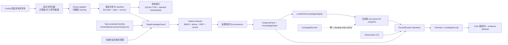

# 本地外挂知识库、RAG 与 KG-Agent 融合实施计划

> 状态：离线 MVP 已实现（Phase 0–4 基础闭环；agentic multi-turn overlay 仍为后续增强）  
> 编制日期：2026-08-17  
> 适用范围：已经通过上游合规约束的蛋白质性质优化任务  
> 明确排除：联网知识检索、面向 `configs/data/proteingym_mvp_assays.txt` 的列表测试与相关修复

## 0. 2026-08-17 实施状态

当前代码已经完成以下闭环：

- `KnowledgeConfig.local_knowledge`、本地 root、ingestion、retrieval、KG update 和 leakage guard 配置；
- `fitness_agents.local_knowledge` 模块，包括基础文本/结构化文件解析、可选 Docling、稳定分块、增量 manifest、SQLite FTS5、可选本地 Sentence Transformers embedding/CrossEncoder、RRF 与 retrieval audit；
- `TargetLeakageGuard` 的索引 quarantine、查询泛化/拒绝、召回后复检和 KG adapter 写入拦截；
- retrieval-only `KnowledgeClaim` 与 `Evidence` 映射，外挂资料默认不得贡献 selection score；
- `LocalRAGKnowledgeAdapter` 的 Document–DocumentChunk–Claim–Evidence 当前轮子图；
- structured SQLite KG 的 round-aware entity/relation/claim reader；
- `query_local_knowledge` 和 `query_structured_claims` operators；
- campaign pre-design prefetch、当前轮 structured KG 写入、Scientist/Critic context evidence 和 citation allowlist 合并；
- 本地资料发送给远端 Scientist/Critic 由 `allow_remote_context` 显式控制，默认关闭；
- `fitness-agents knowledge index|inspect <experiment-config>` 离线管理命令；
- 单元、泄露、KG/operator 和完整 campaign 集成测试。

尚未在本轮实现：让远端模型真正驱动 `LocalAgentLoop` 的多轮动态 tool call 和 base+overlay 的即时 structured-claim 联合查询。当前已提供 operator 和内存 staging，动态查询结果会在本轮 post-validation structured KG 同步时提交；生产主路径仍以确定性 prefetch 为默认。

### 快速启用

在 knowledge config 中设置：

```yaml
local_knowledge:
  enabled: true
  index_path: artifacts/local_knowledge/my-corpus.sqlite
  allow_remote_context: false
  roots:
    - path: resources/local_knowledge
      include: ["**/*.md", "**/*.txt", "**/*.json", "**/*.yaml", "**/*.csv"]
      exclude: ["**/~$*", "**/.git/**", "**/artifacts/**"]
  retrieval:
    mode: lexical
    dense_enabled: false
    allow_model_download: false
  leakage_guard:
    enabled: false
```

建立和检查共享索引：

```powershell
fitness-agents knowledge index configs/experiments/knowledge_agent.yaml
fitness-agents knowledge inspect configs/experiments/knowledge_agent.yaml
```

如需将资料正文发送给 DeepSeek/OpenAI-compatible Scientist 或远端 Critic，必须显式设置 `allow_remote_context: true`。保持 `false` 时，资料仍可在本地检索并写入本地 structured KG，但不会进入远端模型上下文。

## 1. 结论先行

当前系统对 KG evidence 的利用已经不再是“只有一个分数”的最粗粒度实现：`Evidence` 已经包含质量、适用性、不确定性、校准状态、告警和 provenance；系统也已经有特征查询、证据来源查询和结构化 KG 投影。然而，KG 与 Agent 的交互仍然偏粗，核心限制不在“有没有更多图算法”，而在以下四点：

1. 生产流程中的 KG 调用仍是 Orchestrator 预先写死的三步查询，新增的 feature/provenance operator 没有真正进入模型驱动的迭代工具循环。
2. `structured_kg.sqlite` 当前主要是写入投影，缺少面向 Agent 的按轮次、按证据和按 claim 查询接口；真正被 Agent 查询的仍主要是 observation graph。
3. 文档知识、chunk、claim 和现有 `Evidence`/KG 之间没有统一的身份、来源、极性、位置与有效轮次契约。
4. Scientist 的 evidence allowlist 与 Critic 的审查上下文尚未统一纳入 KG/RAG 返回的证据 ID，容易出现“模型看到了上下文，却不能合法引用或复核”的断层。

推荐实现不是直接把 GraphRAG、LightRAG 或 LlamaIndex 的图数据库当成第三套系统真相源，而是增加一个薄的、项目自有的 `local_knowledge` 子系统：

- 用成熟组件负责文件解析、局部向量化和可选重排；
- 用 SQLite FTS5 + 可选本地 Sentence Transformers 完成本地 hybrid retrieval；
- 把命中的 chunk 和抽取出的 claim 转换为现有 `Evidence` 与 `KnowledgeBatch`；
- 通过新的 KG adapter 在本轮设计前写入 structured KG；
- 由 `CampaignRunner` 继续掌握轮次边界、可见性和 durable write 权限；
- Agent 只能通过受控 operator 查询，不允许 operator 直接持久化 KG；
- 防泄露开启时，执行“索引隔离、查询泛化、结果复检、KG 写入拦截”四道强制门，并 fail closed。

推荐 MVP 技术组合：

- 基础解析：项目内置 `txt/md/json/yaml/csv` 解析器；
- 富文档解析：可选 [Docling](https://github.com/docling-project/docling) extra；
- 词法检索：SQLite FTS5/BM25；
- 语义检索：可选 [Sentence Transformers](https://github.com/huggingface/sentence-transformers)，模型必须来自配置指定的本地路径，运行期禁止自动下载；
- 融合：Reciprocal Rank Fusion（RRF）；
- 重排：可选本地 CrossEncoder；
- KG 写入：复用现有 `KnowledgeGraphBuilder`、`KnowledgeBatch`、schema 与 round validity；
- Agent 接口：新增 `query_local_knowledge` 和 `query_structured_claims` operator，复用 `RoundScopedToolExecutor`。

## 2. 范围与非目标

### 2.1 本计划覆盖

- 从 config 指定的一个或多个本地文件夹增量构建知识索引；
- 支持纯离线词法 RAG，以及可选的纯本地 dense/hybrid RAG；
- 将命中文档证据和 claim 以可审计方式并入当前轮 structured KG；
- 让 Scientist/后续 Agent 通过受控工具查询本地知识与 structured KG；
- 让 Critic 使用同一份证据包复核 citation、适用性与冲突；
- 提供默认关闭、可选启用的目标蛋白防泄露模式；
- 给出分阶段代码修改点、测试、验收条件和提交边界。

### 2.2 本计划不覆盖

- 不支持 HTTP、网页搜索、在线论文 API 或在线向量数据库；
- 不在 campaign 运行期间下载 embedding、reranker 或解析模型；
- 不把本地文档中的结论直接作为可改变候选排序的已校准因果证据；
- 不更改上游的蛋白质合规判定边界；
- 不新增、不修复、不运行 `configs/data/proteingym_mvp_assays.txt` 相关列表测试；
- 不以 LightRAG/GraphRAG 的私有图结构替换当前项目 KG；
- 不允许 RAG operator 绕过 `CampaignRunner` 直接写 durable KG。

## 3. 最新代码基线审计

### 3.1 已经具备、应当复用的能力

- `Evidence` 已支持 `raw_features`、`quality_status`、`applicability`、`uncertainty`、`calibrated_score`、`contributes_to_selection`、`warnings` 与 `provenance`。
- `KnowledgeEngine` 已将 observation graph 与 `structured_kg.sqlite` 分离；这是保留“观测事实”和“结构化知识投影”不同职责的正确方向。
- structured KG schema 已有 `LITERATURE` layer、`TEXT`/`EMBEDDING` modality、`source_ids`、`source_group`、`confidence`、`valid_from_round` 和 `valid_to_round`。
- `InferenceKnowledgeAdapter` 已经能把 Evidence、Hypothesis、Validation 映射为图实体和关系。
- 已有 `FeatureEvidenceOperator`、`EvidenceProvenanceOperator`、`CallableQueryOperator`、`RoundScopedToolExecutor` 和 `LocalAgentLoop`，无需重新创造一套 agent runtime。
- `CampaignRunner` 目前是状态、轮次和 KG 写入边界的 owner；新功能必须保持这一点。

### 3.2 当前接口缺口

| 缺口 | 当前表现 | 目标状态 |
|---|---|---|
| RAG 配置 | `KnowledgeConfig` 只有现有 evidence providers | 增加独立的 `local_knowledge` 配置，而不是伪装成逐 variant provider |
| 文档实体 | schema 有 Publication/Claim，但无 Document/Chunk 完整链路 | 增加 Document、DocumentChunk、Claim 及定位关系 |
| structured KG 读取 | SQLite sink 主要负责 `INSERT OR REPLACE` | 增加按 snapshot/round/source/claim 查询的 reader |
| Agent 调用 | Orchestrator 固定执行 context/explain/compare | 先做确定性 prefetch，再接入受预算控制的模型迭代查询 |
| evidence citation | allowlist 主要来自基础 Evidence 列表 | 合并基础、KG 与 RAG EvidencePack 的全部合法 ID |
| Critic 可见性 | Critic 主要看到 candidate-level Evidence | Critic 使用与 Scientist 同版本、同 snapshot 的证据包 |
| provenance | channel 常被当作 source group | 明确 document、chunk、claim、source group、span 和 extractor version |
| 防泄露 | 无本地 RAG 专用策略层 | 独立 `TargetLeakageGuard`，索引、查询、结果、写图全链路执行 |

### 3.3 兼容性判断

外挂知识库与现有 KG 不是“二选一”的存储后端：

- 本地知识库负责保存原始文档、chunk、索引、embedding 和 retrieval event；
- structured KG 负责保存当前任务真正检索到、经过策略过滤和规范化的 claim/evidence 子图；
- observation graph 继续只表达 campaign 可见的观测与变体关联，不应塞入文献 chunk；
- `Evidence` 是 Agent、RAG 与 KG 的公共交换对象；
- `CampaignRunner` 负责把本轮允许使用的 RAG 结果提交为当前轮 KG snapshot。

因此需要兼容性提升，但不需要把三者物理合库。兼容的重点是 ID、provenance、validity、policy 与 query contract，而不是统一底层数据库。

## 4. 文献与成熟代码对照

### 4.1 与本设计直接相关的论文

| 工作 | 核心启发 | 对本项目的采用方式 |
|---|---|---|
| [Retrieval-Augmented Generation for Knowledge-Intensive NLP Tasks](https://arxiv.org/abs/2005.11401) | 将外部非参数知识检索结果送入生成模型 | 保留“检索结果是证据，不是模型记忆”的基本边界 |
| [Retrieval-Augmented Generation for Large Language Models: A Survey](https://arxiv.org/abs/2312.10997) | RAG 可拆为检索前、检索、检索后和生成阶段 | 配置、索引、hybrid retrieval、rerank、citation 分层实现 |
| [From Local to Global: A Graph RAG Approach](https://arxiv.org/abs/2404.16130) | 图社区与分层摘要适合全库/global 问题 | 作为大规模语料的后续 backend；MVP 不引入高成本全量图抽取 |
| [HippoRAG](https://proceedings.neurips.cc/paper_files/paper/2024/file/6ddc001d07ca4f319af96a3024f6dbd1-Paper-Conference.pdf) | OpenIE 图、关联记忆与 Personalized PageRank 支持多跳检索 | 后续可在 claim graph 上加入受限扩展/PPR；不复制其独立图为真相源 |
| [KG²RAG](https://aclanthology.org/2025.naacl-long.449/) | 语义 seed chunk 后进行 KG 引导扩展与组织 | 采用“先混合召回、再用现有 KG 扩一跳、最后按来源组织”的检索策略 |
| [LightRAG](https://aclanthology.org/2025.findings-emnlp.568/) | local/global 双层图索引和轻量图检索 | 可作为实验 backend，必须只返回 context/claims 并经项目 adapter 入图 |
| [Knowledge Graph Prompting for Multi-Document Question Answering](https://ojs.aaai.org/index.php/AAAI/article/view/29889) | 用 KG 组织多文档检索证据，降低无关上下文 | 对命中 chunk 做 entity/claim 组织，不把整个文档直接灌入 prompt |
| [HybridRAG](https://doi.org/10.1145/3677052.3698671) | 向量检索与 KG 检索互补 | 本地 BM25+dense 召回后，允许 structured KG 做受限关系扩展 |

### 4.2 可直接参考或复用的官方代码

| 项目 | 可直接使用的部分 | 不建议直接接管的部分 |
|---|---|---|
| [LlamaIndex](https://github.com/run-llama/llama_index) | `SimpleDirectoryReader`、ingestion pipeline、[PropertyGraphIndex](https://developers.llamaindex.ai/python/framework/module_guides/indexing/lpg_index_guide/) 的设计参考 | 不让其 storage context 成为项目第二个 authoritative KG；MVP 可不依赖整个框架 |
| [Docling](https://github.com/docling-project/docling) | 本地 PDF、DOCX、PPTX、XLSX、HTML、JATS 等解析；[格式清单](https://github.com/docling-project/docling/blob/main/docs/usage/supported_formats.md) | 不在基础安装中强制引入；通过 `rag-docs` extra 和 parser adapter 使用 |
| [Sentence Transformers](https://github.com/huggingface/sentence-transformers) | 本地 bi-encoder embedding、cosine semantic search、可选 CrossEncoder rerank | 运行时禁止按 model name 自动联网下载；只接受已存在的 `model_path` |
| [LightRAG](https://github.com/HKUDS/LightRAG) | `ainsert`、local/global/hybrid/mix query、`only_need_context=True`；[核心 API](https://github.com/HKUDS/LightRAG/blob/main/docs/ProgramingWithCore.md) | 其图抽取、存储 schema 和 LLM 索引成本不适合作为第一阶段默认实现 |
| [Microsoft GraphRAG](https://github.com/microsoft/graphrag) | 图社区、global/local search 的算法与评测方式 | 官方仓库已提示索引成本，且当前处于维护模式；不适合作为小型本地库 MVP |
| [HippoRAG](https://github.com/OSU-NLP-Group/HippoRAG) | OpenIE、图扩展/PPR 与多跳检索实现参考 | 依赖链和独立存储较重，不能绕过现有 round/KG contract |
| [KG²RAG](https://github.com/nju-websoft/KG2RAG) | seed → KG expansion → organization 的算法流程 | 代码面向 HotpotQA 数据与评测，适合移植算法，不适合直接作为通用本地库服务 |

### 4.3 选型结论

直接整合成熟代码时采用“组件复用、契约自有”：

1. 第一阶段必须可在只有 Python 标准 SQLite 的环境中运行：基础 parser + SQLite FTS5。
2. `sentence-transformers` 是可选的本地语义能力；索引 manifest 固定 model path、revision/hash、维度和归一化方式。
3. Docling 只通过 adapter 处理富文档；parser 输出统一的 `ParsedDocument`，避免其数据模型蔓延到业务层。
4. LightRAG/LlamaIndex/GraphRAG 均只能实现 `KnowledgeSource` 或 `ParserBackend` 协议；它们的内部图不能成为项目的 durable campaign KG。
5. 初期不部署独立向量数据库。对于本地中小规模语料，NumPy 向量矩阵 + SQLite metadata 足够简单、可复现；规模超过基准阈值后再接 Qdrant local/LanceDB adapter。

## 5. 目标架构



### 5.1 数据所有权

| 数据 | 唯一职责 | 推荐存储 |
|---|---|---|
| 原始文档与文件哈希 | 可重复解析、变更检测 | 原文件 + `corpus_manifest.json` |
| chunk、FTS、metadata | 本地召回 | `local_knowledge.sqlite` |
| embedding | 可选语义召回 | versioned NumPy matrix + SQLite row mapping |
| retrieval event | 查询、策略和命中审计 | SQLite + 每轮 JSON artifact |
| 当前轮可用 claim/evidence | Agent 可查询的规范化知识 | `structured_kg.sqlite` 当前轮 snapshot |
| 测量和变体观察 | campaign 事实 | 现有 observation graph |

## 6. 本地知识库与 RAG 的实现机制

### 6.1 配置模型

不要把本地 RAG 放入现有逐变体 `KnowledgeProviderConfig`。它是 context-level `KnowledgeSource`，一次检索可能服务多个变体、假设和轮次。

建议配置：

```yaml
knowledge:
  local_knowledge:
    enabled: true
    roots:
      - path: resources/local_knowledge
        include:
          - "**/*.md"
          - "**/*.txt"
          - "**/*.json"
          - "**/*.yaml"
          - "**/*.csv"
          - "**/*.pdf"
          - "**/*.docx"
        exclude:
          - "**/~$*"
          - "**/.git/**"
          - "**/artifacts/**"

    ingestion:
      parser: auto
      rich_document_backend: docling
      chunk_tokens: 480
      chunk_overlap: 64
      max_file_mb: 50
      follow_symlinks: false
      extract_archives: false

    retrieval:
      mode: hybrid              # lexical | dense | hybrid
      lexical_backend: sqlite_fts5
      dense_enabled: true
      embedding_model_path: resources/models/bge-m3
      allow_model_download: false
      fusion: rrf
      top_k: 8
      token_budget: 5000
      reranker_model_path: null

    kg_update:
      enabled: true
      materialization: retrieved_only
      source_group: local_documents
      max_claims_per_round: 32
      contributes_to_selection: false

    leakage_guard:
      enabled: false
      mode: generalize_and_filter
      derive_protected_terms_from_task: true
      protected_aliases: []
      protected_accessions: []
      strict_aliases_required: true
      quarantine_target_documents: true
      block_target_entities: true
```

注：`bge-m3` 只是多语言语料的配置示例，不得在代码中硬编码。项目必须接受任意兼容的本地 Sentence Transformers 路径；最终模型应通过项目语料检索基准决定。

### 6.2 Ingestion 与索引

1. 解析所有 root 为绝对路径，验证文件必须位于配置 root 内；默认不跟随符号链接。
2. 只接受 allowlist 扩展名和最大文件尺寸；跳过 Word 锁文件、可执行文件、归档和隐藏运行产物。
3. 内置 parser 处理文本类文件；PDF/DOCX/PPTX/XLSX/HTML/JATS 通过 Docling adapter。
4. 输出统一 `ParsedDocument`：`document_id`、`path`、`file_hash`、`mime_type`、`title`、section path、text span 与 metadata。
5. 按标题/段落优先分块，目标 350–600 tokens、重叠 50–80 tokens；chunk ID 必须由 `file_hash + section_path + span + chunker_version` 决定。
6. 将 chunk 写入 SQLite 普通表和 FTS5 virtual table；若 dense 开启，使用本地模型批量计算归一化 embedding。
7. manifest 保存 parser/chunker/model 版本和所有文件哈希；只有变更文件重建索引。
8. ingestion 绝不调用外网。模型路径不存在、FTS5 不可用或解析器缺失时，按照配置 fail closed 或降级，并记录机器可读 warning。

### 6.3 Hybrid retrieval

```text
SafeQueryIntent
  -> metadata filter
  -> FTS5 BM25 top-N
  -> optional dense cosine top-N
  -> RRF fusion
  -> optional local CrossEncoder rerank
  -> duplicate/source-diversity control
  -> leakage post-filter
  -> top-k + token budget
  -> RetrievedChunk[] + retrieval trace
```

关键规则：

- lexical mode 必须成为无额外依赖的可靠基线；
- dense 模型只从本地加载，`allow_model_download=false` 时任何远程解析都视为配置错误；
- RRF 统一不同 score 空间，不直接对 BM25 与 cosine 做加权求和；
- 同一文档最多保留可配置数量的 chunk，避免单个来源挤占全部上下文；
- 返回 chunk 必须带 `document_id`、路径、section/span、hash、各阶段 score、source group 和 policy decision；
- 原始 chunk 是不可信数据，只作为 quoted evidence，不得解释为 system/tool instruction。

### 6.4 Claim 抽取与 Evidence 映射

MVP 必须支持 `retrieval_only`：即使没有本地抽取模型，也能把命中 chunk 作为可引用 Evidence 交给 Agent。结构化 claim 抽取是增强项：

- 若使用 LLM 抽取，必须输出严格 schema，并记录 extractor provider/model/prompt version；
- `allow_remote_context=false` 时，不得把本地原文发送到远端模型；只允许本地 extractor 或 retrieval-only；
- claim 必须保存 polarity、applicability、conditions、confidence 和 supporting chunk IDs；
- 外挂文档证据默认 `contributes_to_selection=false`，除非未来建立专门校准和验证流程；
- 多个 chunk 重复同一 claim 时按 source group 去重，不将同源重复当成独立支持。

建议扩展公共契约：

```python
class RetrievalRequest(BaseModel):
    query_id: str
    round_index: int
    intent: str
    anchors: list[str]
    top_k: int
    token_budget: int
    filters: dict[str, object]
    policy_context: LeakagePolicyContext

class RetrievedChunk(BaseModel):
    chunk_id: str
    document_id: str
    text: str
    artifact_uri: str
    section_path: list[str]
    start_offset: int
    end_offset: int
    source_group: str
    scores: dict[str, float]
    provenance: dict[str, object]

class KnowledgeClaim(BaseModel):
    claim_id: str
    statement: str
    subject: str | None
    predicate: str | None
    object: str | None
    polarity: str
    applicability: dict[str, object]
    confidence: float
    evidence_chunk_ids: list[str]
    extraction_version: str

class RetrievalResult(BaseModel):
    query_id: str
    sanitized_query: str
    policy_decision: dict[str, object]
    chunks: list[RetrievedChunk]
    claims: list[KnowledgeClaim]
    warnings: list[str]
    index_manifest_hash: str
```

映射到现有 `Evidence` 时使用：

- `channel="local_rag"`；
- `evidence_type="retrieved_document"` 或 `"extracted_claim"`；
- `source_id="localdoc:<document-hash>:<chunk-id>"`；
- `applicability` 明确是 generic、other-protein analog、partial 或 not-applicable；
- `quality_status` 由解析、来源 metadata 和冲突检查决定；
- `warnings` 包含未验证、非因果、跨蛋白迁移和潜在冲突；
- `provenance` 保存路径、span、hash、retrieval scores、query ID、manifest hash 和 policy trace。

同时建议给 `Evidence` 增加或通过嵌套 provenance 标准化以下字段：`claim_id`、显式 `polarity`、`source_group`、`artifact_uri`、`artifact_span`、`valid_from_round`、`valid_to_round`。

## 7. 当前轮 KG 更新机制

### 7.1 schema 增补

新增或补全以下 entity：

- `Document`：一份本地资料及其 file hash；
- `DocumentChunk`：带 section/span 的稳定文本片段；
- `Claim`：可被支持、反驳、限定适用范围的规范化陈述；
- `Concept`：通用机制、性质或结构概念；
- `OtherProtein`：防泄露模式允许引用的非目标蛋白实体。

新增 relations：

- `HAS_CHUNK(Document, DocumentChunk)`；
- `ASSERTS(DocumentChunk, Claim)`；
- `MENTIONS(DocumentChunk, Concept|OtherProtein)`；
- `SUPPORTED_BY_SOURCE(Claim, Evidence)`；
- `CONTRADICTS_CLAIM(Claim, Claim)`；
- `APPLIES_TO(Claim, Context|Concept|OtherProtein)`；
- 继续复用 `DERIVED_FROM`、`CITES_EVIDENCE` 及 round validity。

### 7.2 adapter 与提交边界

新增 `LocalRAGKnowledgeAdapter`：

```text
RetrievalResult
  -> policy validation
  -> normalize document/chunk/claim IDs
  -> build KnowledgeBatch
  -> graph schema validation
  -> CampaignRunner commits current-round snapshot
```

具体约束：

- 不向 `ObservationKnowledgeGraph` 写文档或 claim；
- `KnowledgeEngine.sync_structured_kg(...)` 增加 `local_retrieval_results` resource；
- `KnowledgeGraphBuilder` 注册 `local_rag` adapter；
- `SQLiteGraphSink` 增加配套 reader，至少支持 round/snapshot/source group/entity type/claim ID 查询；
- snapshot 建议采用 append-only membership 或显式 snapshot table，避免只有 `INSERT OR REPLACE` 导致历史解释困难；
- 每次 durable commit 前再次执行 leakage guard 和 schema validation；
- 失败时不产生部分 KG 更新，retrieval event 可单独保存为审计记录。

### 7.3 两阶段接入

第一阶段采用确定性 prefetch，保证简单、可复现：

1. 当前轮基础 evidence 生成完成；
2. 从 objective、允许可见的 feature evidence、assay conditions 生成 `SafeQueryIntent`；
3. 防泄露 guard 对 query 泛化/拒绝；
4. 本地 hybrid retrieval；
5. 命中结果生成 EvidencePack/claim；
6. `CampaignRunner` 在 Scientist 设计前提交本轮 structured KG；
7. Scientist 通过 operator 查询相同 snapshot；
8. Critic 使用同一 snapshot 和 evidence allowlist。

第二阶段再启用模型驱动的迭代工具调用：

- 将 `LocalAgentLoop` 与 `RoundScopedToolExecutor` 接入 Scientist；
- `query_local_knowledge` 只把新结果加入 `RoundKnowledgeSession` 的 staged overlay；
- 后续 `query_structured_claims` 查询 base snapshot + overlay；
- Scientist 完成且结果通过 schema 验证后，由 `CampaignRunner` 一次性提交 overlay；
- Scientist 失败时丢弃 overlay，但保留脱敏后的 retrieval/policy audit；
- operator 永远不持有 durable sink 的写权限。

这个分层既满足“当前轮知识网络更新”，又避免工具调用在模型循环中产生不可回滚的状态副作用。

## 8. 可选防泄露机制

### 8.1 威胁模型

启用后，不允许本地 RAG 直接检索或返回与 config 指定目标蛋白身份有关的资料。允许的知识只有：

- 不包含目标身份的通用蛋白质/结构/生化机制知识；
- 明确属于其他蛋白、且目标实体被排除的类比知识；
- 从当前轮可见 evidence 派生出的抽象属性检索意图，例如“疏水残基替换对结合界面的常见影响”，而不是“GB1 的某突变有什么影响”。

为避免只防住名称却通过 accession、别名或序列绕过，本设计将目标名称、别名、accession、规范化变体标识、完整序列和可配置长度的唯一序列片段都视为 protected identity。

### 8.2 四道强制门

#### Gate 1：索引期隔离

- 对文件名、路径、metadata 和正文执行 Unicode normalization、casefold、标点/空白折叠与 token-boundary 检查；
- 命中 protected name/alias/accession/sequence 的文档或 chunk 标记为 quarantined；
- `quarantine_target_documents=true` 时不写入可检索 FTS/embedding index；
- 本地离线模式不做在线 alias expansion，因此严格模式要求 config 明确提供必要 alias/accession；缺失时 fail closed。

#### Gate 2：查询期泛化或拒绝

- 原始 query 在进入 retriever 前由 `TargetLeakageGuard` 检查；
- 命中 protected identity 时，不做简单字符串删除，而是根据允许的 feature/intent 重新生成 generic query；
- 无法安全泛化则拒绝查询；
- 禁止将原始违规 query 写入 prompt 和普通 artifact，只保存 hash、规则 ID、决策和 sanitized query。

#### Gate 3：召回后复检

- metadata filter 与正文 scanner 同时执行，避免 embedding 召回绕过词法过滤；
- graph expansion 不得穿越到目标 Protein/alias/accession 节点；
- 命中目标身份、目标序列或明显目标专属实验结果的 chunk 进入 quarantine，不发送给 Scientist；
- 保留“other protein”时必须显式标记 `applicability=other_protein_analog` 和跨蛋白迁移 warning。

#### Gate 4：KG 写入拦截

- 防泄露开启时，`LocalRAGKnowledgeAdapter` 禁止创建目标 Protein、目标别名、目标 accession 或指向目标的外部 claim edge；
- 只允许 `Concept`、generic Claim、Document/Chunk 以及 `OtherProtein`；
- commit 前再次扫描实体 label、properties、relation endpoints 和 evidence text；
- 任一违规使整个 `KnowledgeBatch` 拒绝写入，不允许部分通过。

### 8.3 防 prompt injection

本地文件也可能包含恶意或偶然的指令文本，因此：

- 文档内容只放在明确的 `<retrieved_evidence>` 数据区；
- 系统提示明确声明内容不可覆盖角色、工具和安全约束；
- scanner 标记“ignore previous instructions”“call tool”等 instruction-like 片段；
- 不从文档内容自动构造工具参数或文件路径；
- 文档不能授权联网、写文件、执行命令或扩大 root 范围；
- claim extractor 只允许输出 schema，不执行文档中的任何动作。

### 8.4 防泄露验收条件

- 精确名称、大小写变体、连字符/空格变体、alias、accession、文件名和目录名均被拦截；
- 目标序列及配置长度以上的唯一序列片段被拦截；
- query audit、Scientist prompt、RAG artifact 和 KG batch 中均无 protected identity 明文；
- 同一 generic query 能检索到通用或其他蛋白资料；
- KG batch 中不包含目标外部 entity/edge；
- strict 模式缺少 alias/accession 声明时配置验证失败；
- guard 关闭时保持普通本地 RAG 行为，不悄然改变现有 baseline。

## 9. Agent 工具与证据闭环

### 9.1 新 operator

建议在现有 operator registry 增加：

```text
query_local_knowledge
  input: intent, anchors, filters, top_k
  output: EvidencePack, claims, warnings, policy trace, snapshot/overlay id

query_structured_claims
  input: entity/concept, relation filters, polarity, source group, round
  output: claims with evidence paths and applicability
```

两者都必须由 `RoundScopedToolExecutor` 执行，并受以下预算控制：

- 每轮总工具调用次数；
- 本地 RAG 调用次数；
- 每次 top-k、token budget、graph expansion hop；
- 仅允许读取当前轮可见 snapshot；
- 返回 Evidence ID 必须进入本轮统一 allowlist；
- 所有结果带 `query_id`、operator name、round、snapshot 与 policy trace。

### 9.2 统一 EvidencePack

修复 Scientist/Critic 断层：

```text
AllowedEvidenceIds =
    base_candidate_evidence_ids
  ∪ deterministic_kg_pack.evidence_ids
  ∪ local_rag_pack.evidence_ids
  ∪ staged_overlay.evidence_ids
```

- Scientist 只能引用该集合中的 ID；
- Critic 接收同一 EvidencePack、同一 KG snapshot ID 和同一 leakage policy version；
- citation 验证必须检查 ID 存在、claim polarity 一致、applicability 未被夸大、source group 独立性未被重复计数；
- 超出允许集合的引用使结果进入 retry/reject，而不是静默删除 citation。

## 10. 分阶段代码实施计划

以下各阶段都可以由编码 Agent 独立执行。除 Phase 0 外，每个阶段开始前先确认前一阶段的契约测试通过。

### Phase 0：冻结契约和兼容边界

目标：先让 config、数据契约和 ownership 可测试，尚不接入生产轮次。

修改：

- `src/fitness_agents/config.py`
  - 增加 `LocalKnowledgeConfig`、root/ingestion/retrieval/KG update/leakage 子配置；
  - 给 `TaskConfig` 增加可选 `protein_name`、`protein_aliases`、`protein_accessions`；
  - 校验本地 root、模型路径、strict leakage 必需字段和禁止联网选项。
- `src/fitness_agents/contracts/schemas.py`
  - 标准化 Evidence 的 claim/source group/artifact span/round validity；
  - 保持旧配置和旧 artifact 可读取，新增字段提供安全默认值。
- 新建 `src/fitness_agents/local_knowledge/contracts.py`
  - 定义 `ParsedDocument`、`DocumentChunk`、`RetrievalRequest`、`RetrievalResult`、`KnowledgeClaim`、`LeakagePolicyContext`。
- 新建 `src/fitness_agents/local_knowledge/protocols.py`
  - 定义 `ParserBackend`、`EmbeddingBackend`、`KnowledgeSource`、`ClaimExtractor` 协议。

测试：

- config 默认关闭时序列化结果与当前 baseline 等价；
- 非法 root、远程 URL、缺失本地模型、strict alias 缺失 fail closed；
- 旧 Evidence artifact round-trip 不丢字段。

验收：所有新增契约均可在不安装 Docling/Sentence Transformers 时 import。

### Phase 1：本地文件 ingestion 与可复现索引

目标：建立纯本地、增量、可审计的 corpus index。

新建：

- `src/fitness_agents/local_knowledge/parsers.py`
- `src/fitness_agents/local_knowledge/chunking.py`
- `src/fitness_agents/local_knowledge/manifest.py`
- `src/fitness_agents/local_knowledge/index.py`
- `src/fitness_agents/local_knowledge/embeddings.py`
- `src/fitness_agents/local_knowledge/docling_backend.py`（optional import）

修改：

- `pyproject.toml`
  - 增加独立 extras，例如 `rag` 与 `rag-docs`；版本应在实现 spike 后锁定，不在计划阶段猜测 pin；
- CLI 入口
  - 增加 `fitness-agents knowledge index --config <path>` 和 `knowledge inspect`；
  - `--offline` 默认开启，不提供 URL ingestion。

实现要求：

- stable IDs、hash manifest、增量 rebuild、删除文件 tombstone；
- SQLite FTS5 schema 和必要索引；
- embedding matrix 与 SQLite row ID 一致性检查；
- local model path 不存在时明确报错，不触发下载；
- rich parser 不可用时只对对应格式报 capability warning，不影响基础文本格式。

验收：相同 corpus 连续构建得到相同 manifest hash 和 chunk IDs；修改一个文件只重建该文件。

### Phase 2：Hybrid retrieval 与 TargetLeakageGuard

目标：完成可独立测试的检索与防泄露策略层。

新建：

- `src/fitness_agents/local_knowledge/retriever.py`
- `src/fitness_agents/local_knowledge/rerank.py`
- `src/fitness_agents/local_knowledge/leakage.py`
- `src/fitness_agents/local_knowledge/prompt_safety.py`

实现要求：

- BM25、可选 cosine、RRF、可选 rerank；
- source diversity 与 token budget；
- protected identity normalization/scanning；
- index quarantine、safe query generalization、post-filter；
- policy event 只保存必要脱敏信息；
- 文档 instruction-like 内容告警。

测试 fixtures：

- `tests/fixtures/local_knowledge/generic/`；
- `tests/fixtures/local_knowledge/other_proteins/`；
- `tests/fixtures/local_knowledge/protected_target/`；
- deterministic fake embedding/reranker，单测不需要真实模型和网络。

验收：guard 开启时零 protected-identity 命中；guard 关闭时 lexical/hybrid gold queries 达到预先冻结的 Recall@k/MRR 下限。

### Phase 3：与 structured KG 的当前轮兼容

目标：把检索到的材料规范化为当前轮可查询子图。

修改：

- `src/fitness_agents/kg_knowledge/schema.py`
  - 增补 Document/Chunk/Claim/Concept/OtherProtein 和所需 relations；
- `src/fitness_agents/kg_knowledge/adapters.py`
  - 增加 `LocalRAGKnowledgeAdapter`；
- `src/fitness_agents/kg_knowledge/store.py`
  - 增加 reader/snapshot query；优先 append-only snapshot membership；
- `src/fitness_agents/knowledge/engine.py`
  - 注册 adapter；
  - `sync_structured_kg` 接受 local retrieval results；
  - 提供 `stage_local_knowledge`/`commit_round_knowledge` 明确边界；
- CampaignRunner/Orchestrator
  - 在 Scientist 前执行确定性 prefetch 和 current-round KG commit。

必须保持：

- Observation graph 不接收文档实体；
- 防泄露 guard 在 adapter 和 commit 前再次执行；
- local document Evidence 默认不贡献 selection score；
- current round 之外的未来知识不可见；
- 相同 RetrievalResult 重放是幂等的。

验收：一个本地 chunk 能沿 `Document -> Chunk -> Claim -> Evidence` 路径被按当前轮查询，并能定位回原文件 span；下一轮能够解释其历史可见性。

### Phase 4：Agent 受控查询与统一 evidence allowlist

目标：从固定三步 KG 查询升级为受预算约束的 KG+RAG 交互。

修改：

- `src/fitness_agents/kg_interaction/operators.py`
  - 增加 local knowledge 与 structured claim operators；
- `src/fitness_agents/kg_interaction/tool_runtime.py`
  - 增加 RAG 次数、top-k、token、hop 和 snapshot 限制；
- `src/fitness_agents/agents/local_agent_loop.py`
  - 接入 `RoundKnowledgeSession` overlay；
- `src/fitness_agents/orchestrator.py`
  - 默认先走 deterministic prefetch；配置开启 agentic retrieval 后才允许动态查询；
- `src/fitness_agents/agents/llm.py`
  - allowlist 合并所有 EvidencePack ID，不再只截取基础 Evidence；
- `src/fitness_agents/agents/scientist.py`、`critic.py`
  - 共享 EvidencePack、snapshot ID、policy version 和 citation validator。

配置中的 operator allowlist 增加：

```yaml
enabled_operators:
  - hypothesis_context
  - explain_variant
  - compare_variants
  - query_physchem_delta
  - query_evolutionary_profile
  - query_structure_environment
  - query_assay_association
  - query_evidence_provenance
  - query_local_knowledge
  - query_structured_claims
```

验收：Agent 能以合法 citation 使用 RAG 证据；超预算、越轮次、未知 Evidence ID、泄露 query 和 operator 直接写图都被拒绝。

### Phase 5：端到端评测、回归与运行文档

目标：证明新增能力有用、可追溯且不改变关闭状态下的 baseline。

新增测试：

- `tests/unit/test_local_knowledge_config.py`
- `tests/unit/test_local_knowledge_ingestion.py`
- `tests/unit/test_local_knowledge_retrieval.py`
- `tests/unit/test_local_rag_kg_adapter.py`
- `tests/unit/test_local_knowledge_operators.py`
- `tests/leakage/test_local_knowledge_leakage.py`
- `tests/integration/test_local_knowledge_campaign.py`

冻结一个小型合规性质优化 fixture corpus，评测：

- Recall@k、MRR、source diversity；
- citation precision 与原文件 span 可回溯率；
- claim polarity/适用性一致率；
- 本轮 KG 写入幂等性与历史 round visibility；
- guard 开启时 protected identity 泄露率必须为 0；
- RAG/KG 关闭时候选、artifact schema 和 deterministic behavior 与当前 baseline 一致；
- 无网络、无真实 embedding model 时 lexical pipeline 仍可完成。

明确不运行：

- `configs/data/proteingym_mvp_assays.txt` 的 list validation；
- 任何专门读取该列表的测试；
- 与本计划无关的 assay 下载/覆盖率断言。

建议目标命令（实现后按实际文件名调整）：

```powershell
ruff check src/fitness_agents/local_knowledge src/fitness_agents/kg_knowledge tests/unit/test_local_knowledge_config.py tests/unit/test_local_knowledge_ingestion.py tests/unit/test_local_knowledge_retrieval.py tests/unit/test_local_rag_kg_adapter.py tests/unit/test_local_knowledge_operators.py tests/leakage/test_local_knowledge_leakage.py tests/integration/test_local_knowledge_campaign.py

pytest -q tests/unit/test_local_knowledge_config.py tests/unit/test_local_knowledge_ingestion.py tests/unit/test_local_knowledge_retrieval.py tests/unit/test_local_rag_kg_adapter.py tests/unit/test_local_knowledge_operators.py tests/leakage/test_local_knowledge_leakage.py tests/integration/test_local_knowledge_campaign.py
```

## 11. 推荐提交边界

每个提交都应能独立说明和回滚：

1. `feat(config): add local knowledge and leakage contracts`
2. `feat(rag): index configured local documents offline`
3. `feat(rag): add hybrid retrieval and target leakage guard`
4. `feat(kg): materialize local RAG evidence into round snapshots`
5. `feat(agent): expose local knowledge through bounded tools`
6. `test(rag): cover retrieval KG provenance and leakage`
7. `docs(rag): document local knowledge runtime and operations`

提交前逐个检查 staged diff，避免带入当前工作树中的其他未提交重构。

## 12. 实施决策记录

### ADR-1：为什么不用完整 GraphRAG/LightRAG 作为默认实现

它们解决的是“如何从语料构建和查询自己的图”，而项目已经拥有 round-aware KG、Evidence contract、validation 和 campaign lifecycle。直接接管会产生双图真相、双 snapshot、双 provenance 和更高索引成本。MVP 只吸收其检索思想，把第三方系统放在 adapter 后面。

### ADR-2：为什么本地 RAG 不是现有 variant provider

现有 provider 以 candidate/variant 为中心产生可评分 evidence；本地文档检索以 query/context 为中心，可能覆盖多个候选且默认不可直接参与排序。强行复用会模糊校准、适用性和生命周期。

### ADR-3：为什么先 prefetch、后 agentic retrieval

prefetch 的输入、结果和 KG snapshot 最容易复现，可以先完成 provenance、泄露和 current-round visibility 闭环。模型驱动工具调用只在这些安全边界稳定后启用，并通过 staged overlay 避免模型循环中的不可回滚写入。

### ADR-4：为什么防泄露必须覆盖索引到 KG 全链路

只在 prompt 中要求“不查询目标蛋白”无法阻止 embedding 召回、别名绕过、文件名泄露、图扩展回流或 artifact 落盘。四道门中的任意一道都不能替代其他门。

## 13. Definition of Done

只有同时满足以下条件，才算本地外挂知识库完成：

- [ ] config 可指定多个本地 root，且整个运行期无网络依赖；
- [ ] 基础文本格式无需额外依赖即可索引和 BM25 检索；
- [ ] 可选本地 embedding/hybrid 模式可复现，绝不自动下载模型；
- [ ] 每个返回结论可追踪到文件 hash、chunk span、query 和 index manifest；
- [ ] RAG Evidence 进入统一 EvidencePack，Scientist 与 Critic 使用同一 allowlist；
- [ ] 命中 claim 通过 adapter 写入当前轮 structured KG，Observation KG 未被污染；
- [ ] `CampaignRunner` 仍是唯一 durable KG write owner；
- [ ] local/structured operators 受 round、call、token、top-k 与 hop 预算约束；
- [ ] 外部文档证据默认不直接贡献 selection score；
- [ ] 防泄露开启时目标名称、alias、accession、序列、文档和 KG edge 泄露率为 0；
- [ ] 防泄露关闭时当前系统 baseline 不变；
- [ ] 目标测试全部通过，且未运行 `proteingym_mvp_assays.txt` 相关测试；
- [ ] 运行产物包含 corpus manifest、retrieval trace、policy audit、EvidencePack 和 KG snapshot ID。

## 14. 最终运行时机制摘要

系统启动时读取 config 指定的本地目录，安全扫描文件，并依据 hash manifest 增量解析、分块和建立 SQLite FTS5/可选本地向量索引。每轮在 Scientist 设计之前，系统只使用当前轮允许可见的 objective、assay conditions 和抽象 feature evidence 构造检索意图；若防泄露开启，先将目标蛋白身份转换为 protected identity 集合，再对索引、query、retrieval result 和 KG batch 逐层过滤。

检索器执行 BM25 与可选 dense 召回，通过 RRF 融合和可选本地重排得到受 token budget 限制的 chunk。每个 chunk 和 claim 被映射为带完整 provenance 的 Evidence，默认不参与候选分数。`LocalRAGKnowledgeAdapter` 将本轮真正命中的资料物化为 Document–Chunk–Claim–Evidence 子图，由 `CampaignRunner` 提交到当前轮 structured KG。Agent 通过受预算控制的 operator 查询本地知识、structured KG 和 observation KG；Scientist 与 Critic 共享同一个 EvidencePack、snapshot 和 citation allowlist。后续启用 agentic retrieval 时，新命中结果先进入可回滚 overlay，只有整轮输出通过验证后才持久化。

这使本地知识库成为“可检索的原始资料层”，structured KG 成为“本轮已规范化、可追踪的知识层”，Evidence 成为二者与 Agent 之间的统一交换契约；三者职责清晰，且不会引入新的不可控真相源。
