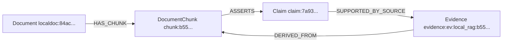

# 本地 RAG 向量检索、Chunk→KG 模拟与生产完整性审计

> 状态：这是修复前的基线审计。列出的阻断项已在后续实现中处理；当前状态与新证据见
> [`english-atomic-rag-kg-production-architecture.md`](english-atomic-rag-kg-production-architecture.md)。

> 审计日期：2026-08-18  
> 代码基线：`9e3207aa4f4ae809a7133d40ac8e210831564ee5`  
> 实测工件：`artifacts/rag-diagnostics/real-minilm-20260818-v3/`  
> 模拟模型：`sentence-transformers/paraphrase-multilingual-MiniLM-L12-v2`，384 维，仅作为真实向量 smoke test，不作为生产选型结论。

## 1. 最终判断

### 1.1 当前默认运行状态

当前 GB1 配置没有进行向量检索：

```yaml
retrieval:
  mode: lexical
  dense_enabled: false
  embedding_model_path: null
```

现有 `artifacts/local_knowledge/gb1.sqlite` 中：

```text
documents = 9
chunks = 14
embeddings = 0
```

因此，“项目目前已经在使用 embedding 相似搜索”不成立。当前相似目标内容由 SQLite FTS5 的词法匹配取得。

### 1.2 代码是否存在真实向量实现

存在，而且不是伪向量或随机占位：

1. `SentenceTransformerEmbeddingBackend` 从本地目录加载真实 SentenceTransformer；
2. `encode()` 执行模型前向推理并生成归一化 `float32` 向量；
3. index build 把每个 chunk 向量写入 SQLite `embeddings.vector` BLOB；
4. 查询时使用同一模型编码 query；
5. 从 SQLite 恢复 chunk 向量，逐条计算 cosine similarity；
6. 按 cosine 降序返回 dense candidates；
7. hybrid 模式用 RRF 合并 lexical 与 dense 排名。

本次真实模型模拟验证了这条路径：14/14 chunk 生成了 384 维有限向量，范数为 0.99999994–1.0，cosine 检索可以返回目标知识类型。

### 1.3 是否达到生产可信

**没有。** 问题不在于“没有真实矩阵乘法”，而在于真实模型接收到的文本、索引迁移和评分语义尚不可靠：

- 14 个 chunk 中 9 个超过配置声称的 480 tokens，最大为 965 个项目自估 token；
- smoke 模型最大长度只有 128 subword tokens，14/14 chunk 都会截断，最严重的 chunk 最多只有约 10.8% token 能进入向量；
- 从已有 lexical 索引开启 dense 后，增量刷新把文档判断为 unchanged，向量仍为 0；
- embedding backend 名称不含模型身份，不同模型可能共用同一 `sentence-transformers-local` 标识；
- hybrid 没有相似度阈值和 no-answer gate；dense 总会给所有向量排序；
- 中文 FTS5 词法召回较弱，本次 hit@3 只有 0.25；
- 当前 Claim 是整个 chunk，而不是原子化事实；RRF 排名还被乘以 60 当作 Claim confidence；
- `contributes_to_selection=true` 当前会被配置校验拒绝，不能按假设直接开启。

结论应表述为：**真实 dense 检索能力已经实现并可运行，但默认没有启用；当前 chunk、模型上下文、索引迁移、模型标识、拒答阈值和 selection 语义使它尚未形成生产闭环。**

## 2. Markdown chunk 当前如何划分

实现位于 `src/fitness_agents/local_knowledge/chunking.py`，版本为：

```text
section-char-v1
```

实际算法不是 tokenizer-aware 或真正按 Markdown section 切分，而是字符窗口：

```python
max_chars = max(256, chunk_tokens * 4)
overlap_chars = chunk_overlap * 4
```

当前配置：

```text
chunk_tokens = 480
chunk_overlap = 64
max_chars = 1920
overlap_chars = 256
```

每个窗口在后半段向前寻找：

1. 双换行；
2. 单换行；
3. 英文句号加空格；
4. 找不到则按字符硬切。

`section_path` 只是根据 chunk 起始 offset 之前最后见到的 Markdown headings 计算标签；它不会保证一个 chunk 只包含该 heading 的内容。当前长 chunk 经常包含一个文档内的多条 `## 规则` 和参考文献。

### 2.1 token 估算不一致

`approximate_token_count()` 的规则是：

```text
ASCII word 数 + CJK 字符数
```

但切块窗口却固定使用 `chunk_tokens × 4` 个字符。对于英文，“约 4 chars/token”可作为粗估；对于中文，一个汉字常对应一个或多个 tokenizer token，不能继续乘 4。

实测：

| 指标 | 结果 |
|---|---:|
| chunk 数 | 14 |
| 配置上限 | 480 |
| 最大自估 token | 965 |
| 超过 480 的 chunk | 9 |
| 超限比例 | 0.6429 |

这说明 `chunk_tokens=480` 当前并不是有效约束。

### 2.2 对实际 embedding 的影响

smoke 模型的真实 tokenizer 审计结果：

| 指标 | 结果 |
|---|---:|
| 模型最大序列长度 | 128 |
| 会被截断的 chunk | 14/14 |
| 最大 tokenizer token 数 | 1180 |
| 最低保留比例上界 | 0.1085 |

SentenceTransformer 会静默截断超长输入。SQLite 中保存的确实是真实向量，但该向量可能只表示 chunk 前部，后部规则和引用没有参与编码。

因此，当前 chunk ID、文本和向量三者虽然在数据结构上对应，**语义上不能认为向量完整代表整个 chunk。**

## 3. 当前如何判断文本相似性

### 3.1 Lexical

`SQLiteLocalKnowledgeIndex._fts_query()` 从 query 提取：

```regex
[A-Za-z0-9_]+|[\u3400-\u9fff]+
```

最多取 32 个 token，用 `OR` 连接，再由 SQLite FTS5 `unicode61` tokenizer 和 BM25 排序。

问题：连续中文字符容易成为长字符串，`unicode61` 并不是中文分词器。改写、同义词和词序变化通常无法得到稳定召回。本次 8 个 gold queries 中 lexical hit@1/hit@3 都只有 0.25。

### 3.2 Dense

文档与 query 都调用：

```python
model.encode(
    texts,
    convert_to_numpy=True,
    normalize_embeddings=True,
)
```

查询相似度为：

```text
cos(q, d) = dot(q, d) / (norm(q) × norm(d))
```

因为向量已归一化，该值等价于 dot product。cosine 是 SentenceTransformers 支持的标准语义相似度方法，见其[官方相似度说明](https://sbert.net/docs/sentence_transformer/usage/semantic_textual_similarity.html)。数学实现是正确的；“是否真实符合项目相似性”取决于模型训练任务、语言、chunk 完整性和项目 gold queries，而不是 cosine 公式本身。

### 3.3 Hybrid

lexical 和 dense 的每个名次被转换为：

```text
1 / (60 + rank)
```

然后求和，即 Reciprocal Rank Fusion。当前融合只使用排名，不使用原始 BM25/cosine 的绝对大小。因此：

- cosine 0.78 和 0.20 如果同为 rank 1，会得到相同 RRF 贡献；
- 没有 minimum similarity threshold；
- 没有“所有候选都不相关”的 no-answer 结果；
- 只有一个通道命中时，所谓 hybrid 实际退化为该单通道排名。

## 4. 真实模型模拟结果

### 4.1 模拟模型定位

本次使用 `paraphrase-multilingual-MiniLM-L12-v2`，因为它可以在 CPU 上快速验证真实 SentenceTransformer 路径。官方模型卡说明它覆盖 50 种语言、输出 384 维向量，并可用于 semantic search：[model card](https://huggingface.co/sentence-transformers/paraphrase-multilingual-MiniLM-L12-v2)。

它是通用 sentence/paraphrase 模型，且本地实例 `max_seq_length=128`，所以只应作为 smoke test，不应直接写入生产配置。

### 4.2 Gold-query 结果

8 条查询覆盖 epistasis、简并密码子、结构环境、mutation burden、保守替换、理化性质、定向进化闭环和证据适用性。

| 指标 | Lexical | Dense | Hybrid |
|---|---:|---:|---:|
| hit@1 | 0.250 | 0.750 | 0.750 |
| hit@3 | 0.250 | 0.875 | 0.875 |

逐项结果：

| Query | 期望类型 | Lexical rank | Dense rank | Hybrid rank |
|---|---|---:|---:|---:|
| epistasis combination | `history_guided_combination` | — | 1 | 1 |
| NNK/NNS stop | `sequence_safeguards` | 1 | 1 | 1 |
| core/surface/interface | `structure_context` | — | 3 | 3 |
| combination space/screen capacity | `mutation_burden` | — | 1 | 1 |
| conservative substitution | `substitution_conservativeness` | — | 5 | 5 |
| physicochemical changes | `amino_acid_properties` | — | 1 | 1 |
| evolution cycle | `directed_evolution_strategy` | — | 1 | 1 |
| evidence applicability | `evidence_applicability` | 1 | 1 | 1 |

这证明“符合目标类型的 chunk 可以从真实向量状态中被检索出来”；但它不是生产质量证明：查询集只有 8 条，expected label 只是文档类型，不包含 no-answer、hard negative、跨语言改写、反证、精确规则定位和 citation-level relevance，并且全部向量都受截断影响。

## 5. 被向量检索到的 chunk 如何进入 KG

### 5.1 实测 example

查询：

```text
为什么多个单点有益突变组合后仍可能降低适应度？
```

向量 top-1：

```yaml
chunk_id: chunk:b55ffeb82a3a96d7af540d80
document_id: localdoc:84acccc5e91597d0b89630ba
knowledge_type: history_guided_combination
dense_similarity: 0.7768516540527344
dense_rank: 1
rrf: 0.01639344262295082
artifact_uri: resources/local_knowledge/directed_evolution/07_history_guided_combinations_and_epistasis.md
section_path:
  - 历史单点优先、组合验证与突变互作
```

命中文本开头是“好单点相加不一定更好，epistasis 会随遗传背景改变”，符合查询意图。

### 5.2 KG 格式

`LocalRAGKnowledgeAdapter` 对 policy-approved、当前 round 的 `RetrievalResult` 生成：

| 节点 | ID example | layer | 主要属性 |
|---|---|---|---|
| Document | `localdoc:84ac...` | literature | URI、file hash、knowledge type、front matter、manifest hash |
| DocumentChunk | `chunk:b55...` | literature | 完整文本、span、section、dense/RRF score、query ID、policy decision |
| Claim | `claim:7a93...` | literature | 整个 chunk 作为 statement；S/P/O 为空；neutral；verified=false |
| Evidence | `evidence:ev:local_rag:b55...` | agent | channel、statement、claim ID、round、selection flag |

关系：



全部节点/边带 `valid_from_round=1`，关系带检索 `query_id` 作为 `context_id`。实测写入 `structured_kg.sqlite` 后，当前轮可查询到 `epistasis` Claim，早一轮不可见。

### 5.3 当前格式的生产缺口

- KG 不保存 embedding BLOB，只在 `DocumentChunk.modalities` 标注 `embedding` 并保存 dense score；真实向量仍留在 RAG index。这一分层是合理的。
- 但 adapter 即使 lexical 模式也总给 chunk 标注 `TEXT + EMBEDDING`，会产生错误模态声明。
- Claim 是整个长 chunk，`subject/predicate/object=null`，不能算真正 KG 原子事实。
- `SUPPORTED_BY_SOURCE` 的 object 是项目生成的 Evidence 节点，不是规范化 Publication/Citation 节点。
- Claim/Evidence confidence 当前是 `RRF × 60`，它表示检索排名，不是科学证据可信度。

## 6. 生产流程中的占位、简易替代和阻断项

| 严重度 | 项目 | 判断 |
|---|---|---|
| 阻断 | 默认 dense 关闭、模型路径为空、原索引 embeddings=0 | 当前运行不是向量 RAG |
| 阻断 | 从 lexical index 开启 dense 不回填向量 | 实测 14 chunks，开启前后均为 0 embeddings；必须修复迁移判定 |
| 阻断 | 模型输入全部截断 | smoke 模型 14/14 截断，向量不代表完整 chunk |
| 阻断 | `contributes_to_selection=true` 被配置校验拒绝 | 当前无法按用户假设直接开启 |
| 高 | Local RAG Evidence 的 `score=0.0` 且 `variant_id=context:<protein>` | 即使允许 selection，也没有候选级正/负效应值可排序 |
| 高 | KG local adapter 硬编码 `contributes_to_selection: false` | 与未来开启配置冲突；与 inference adapter 融合时可能出现 `_conflicts` |
| 高 | backend name 固定为 `sentence-transformers-local` | 不区分模型、revision、权重 hash 和 prompts |
| 高 | manifest 只记录 backend name/dimension | 同维度模型替换可能继续使用陈旧向量；本次升级模拟甚至出现 manifest 声称 dense backend、实际 0 embeddings |
| 高 | 无 minimum similarity/no-answer/校准 | 不相关语料也会产生 top-k 和高 RRF-derived confidence |
| 高 | 中文 lexical 使用 unicode61，无中文分词 | 同义改写和中文短语召回弱；实测 hit@3=0.25 |
| 中 | dense search 在 Python 中逐条扫全表 | 14 chunks 合理；大规模文献库需要 ANN/vector DB 或 SQLite vector extension |
| 中 | reranker 可选但未配置 | 当前没有 cross-encoder 二阶段精排 |
| 中 | prompt-like 内容只产生 warning | 虽有上层“证据不可信”提示，生产仍应隔离/拒绝注入指令 |

`SentenceTransformerEmbeddingBackend` 本身不是占位；真正的“简易替代”主要是字符切块、统一 encode contract、暴力 cosine、RRF confidence 和未实现的迁移/校准流程。

## 7. embedding 是否需要替换

严格说，当前没有“正在使用的 embedding”可替换；只有一个未启用的通用 SentenceTransformer 接口。本次 MiniLM 是诊断模型。

推荐先修接口，再比较模型：

1. chunk 改成 Markdown heading/rule-aware，优先一条规则或一个紧密段落，使用目标模型 tokenizer 控制约 180–350 tokens，参考文献独立分块并通过边关联；
2. embedding backend 分开 `encode_queries()` 与 `encode_documents()`，支持模型要求的 prompt/prefix；
3. manifest 写入模型 repo、固定 revision、权重 hash、tokenizer hash、max sequence length、prompt template、pooling 和 normalization；
4. 模型或 chunker 变化时强制全量 re-embed，并验证 embeddings count == eligible chunks；
5. dense top-20/50 后增加 multilingual cross-encoder reranker；
6. 用至少 50–100 条项目 gold queries 决定模型，而不是根据通用榜单直接上线。

### 候选模型

| 模型 | 优点 | 接入注意 | 建议 |
|---|---|---|---|
| MiniLM multilingual（本次） | CPU 快、384 维、50 语言 | 本地实例 max length 128，通用 paraphrase 目标 | 仅 smoke/低算力 baseline |
| `intfloat/multilingual-e5-base` | 768 维、多语种、成熟 retrieval 模型 | 官方要求 query/passages 都加对应前缀，且最长 512；当前统一 `encode()` 不满足，见[官方模型卡](https://huggingface.co/intfloat/multilingual-e5-base) | 修复双编码接口后作为中等算力 baseline |
| `BAAI/bge-m3` | 多语种、1024 维、最长 8192，并支持 dense/sparse/multi-vector，见[官方模型卡](https://huggingface.co/BAAI/bge-m3) | 约 0.6B 级别，CPU/内存成本更高；仍需项目 benchmark | 推荐的高质量候选，不是未经测试的默认值 |
| `Alibaba-NLP/gte-multilingual-base` | 305M、768 维、75+ 语言、8192 token，见[官方模型卡](https://huggingface.co/Alibaba-NLP/gte-multilingual-base) | 当前 backend 禁止/未声明 `trust_remote_code`；应做离线供应链审查后适配 | 可作为长文本候选 |
| `BAAI/bge-reranker-v2-m3` | 多语种 query-passage 精排，直接输出 relevance，见[官方模型卡](https://huggingface.co/BAAI/bge-reranker-v2-m3) | 是 reranker，不替代 embedding；成本高于 cosine | 推荐用于 dense/lexical 候选的二阶段精排 |

优先建议：**先修 chunking 和模型身份/迁移，再在 `multilingual-e5-base`、`bge-m3`、`gte-multilingual-base` 上运行同一 gold set；资源足够时以 BGE-M3 + BGE reranker 作为高质量候选，MiniLM 只保留为 smoke baseline。**

## 8. `gb1.sqlite` 是否写死成 GB1 专用知识库

没有在代码中写死。唯一显式名称在：

```yaml
# configs/knowledge/gb1.yaml
index_path: artifacts/local_knowledge/gb1.sqlite
```

代码支持任意 `index_path`；CLI 在未配置时也会按 `task_id` 生成文件名。当前 SQLite 的文档内容来自通用 `resources/local_knowledge/directed_evolution`，并不是 GB1 专属规则库。

但直接把它改名为一个全任务共享的 `general.sqlite` 也不安全，因为当前同一 SQLite 同时保存：

- 通用 documents/chunks/embeddings；
- 根据当前 task 的 protein name/aliases/accessions/reference sequence 产生的 quarantine policy；
- `protected_terms_hash`；
- 带 round ID 的 retrieval events。

因此目前采用 `gb1.sqlite` 作为 task-scoped cache 有合理性。更好的生产设计是拆成：

```text
通用、不可变 corpus index
  key = corpus snapshot + chunker + embedding model fingerprint

任务/运行 overlay
  key = task/run + leakage policy + query/round
  保存 quarantine decision、retrieval event、staged Evidence 和 KG materialization
```

这样通用文献向量不必为每个蛋白重复计算，同时不同目标的泄漏策略和审计记录不会混在一起。

## 9. 假设开启两个开关后的真实影响

### `allow_remote_context=true`

该开关可以让远程 Scientist/Critic 收到经过 policy、top-k、token budget 和泄漏 guard 限制的本地检索内容，也会注册 local knowledge/KG claim operators。它能打通“模型可见性”。

### `contributes_to_selection=true`

当前代码不能直接开启：`LocalKnowledgeKGUpdateConfig.__post_init__()` 会抛出：

```text
Local document evidence cannot contribute to selection before calibration
```

即使未来允许，还需要解决：

1. local RAG Evidence 当前 `score=0.0`；
2. `variant_id=context:<protein>`，不是候选 variant；
3. 缺少“通用规则如何映射为具体候选的正负 effect”模型；
4. local adapter 的 KG Evidence 仍硬编码 false；
5. RRF confidence 不能作为 selection 权重；
6. 需要可见数据校准和同折消融，防止文献先验盖过 target-specific wet evidence。

合理流程应为：

```text
检索规则/文献
  → 原子 Claim + applicability
  → 对具体候选生成 candidate-claim relation
  → 独立 Critic/规则验证
  → 可见历史数据校准 effect 与 uncertainty
  → 才允许 contributes_to_selection=true
```

## 10. 本次新增的可运行诊断

文件：

- `scripts/rag_diagnostics/simulate_local_rag_to_kg.py`
- `configs/diagnostics/local_rag_gold_queries.yaml`
- `tests/integration/test_local_rag_real_embedding_to_kg.py`

运行：

```powershell
.\.venv\Scripts\python.exe -m pip install -e ".[rag]"
$env:PYTHONIOENCODING = "utf-8"
$env:FITNESS_RAG_TEST_MODEL = "C:\path\to\local-sentence-transformer"

.\.venv\Scripts\python.exe scripts\rag_diagnostics\simulate_local_rag_to_kg.py `
  --embedding-model $env:FITNESS_RAG_TEST_MODEL `
  --output-dir artifacts\rag-diagnostics\manual-run `
  --strict

.\.venv\Scripts\python.exe -m pytest -q `
  tests\integration\test_local_rag_real_embedding_to_kg.py
```

输出：

```text
diagnostic.json                   全量 chunk、tokenizer、vector、排名和 KG example
summary.md                        人类可读摘要
local_knowledge.sqlite            真实 hybrid 索引
lexical-to-dense-upgrade.sqlite   索引迁移模拟
structured_kg.sqlite              检索结果物化后的 KG
```

`--strict` 的设计目的就是在“向量真实生成但文本被截断”等情况下返回非零，而不是把接口可运行误报成生产可信。
