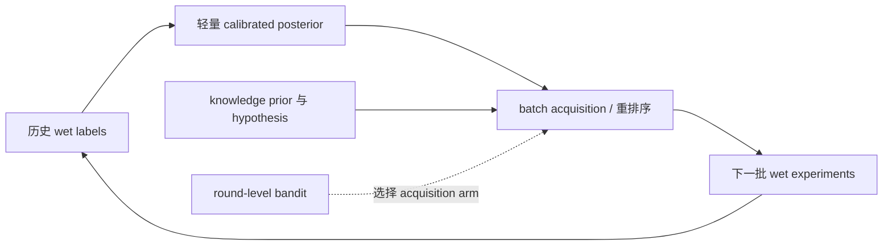

# 低计算开销主动学习 / 强化学习模块优先级分析

> 日期：2026-08-18
>
> 范围：当前 `fitness-agents` 蛋白质适应度优化闭环
>
> 目标：从现有系统中筛选 1–3 个计算开销小、但可能显著提升全局预测准确率或 fitness 感知/优化能力的模块，并给出最小改造和验证方案。
>
> 上位分析：[`active-learning-and-reinforcement-learning-optimization-strategy.md`](active-learning-and-reinforcement-learning-optimization-strategy.md)

## 1. 结论先行

最值得考虑的模块只有三个，且推荐顺序如下：

| 优先级 | 模块 | 学习形式 | 新增计算开销 | 对全局预测准确率 | 对 fitness 感知与优化 | 当前建议 |
|---:|---|---|---|---|---|
| 1 | 轻量 fitness posterior 校准与模型融合 | 每轮监督更新；为 AL 提供 posterior | 低 | **直接、中高潜力** | **间接但关键、中高潜力** | 立即实施 |
| 2 | 候选池 batch acquisition / 重排序 | 主动学习、batch BO | 很低 | **间接、中等潜力** | **直接、高潜力** | 与模块 1 成套实施 |
| 3 | round-level 策略选择器 | contextual bandit，属于 RL-lite | 极低 | **间接、低至中等潜力** | **条件性中高潜力** | 先 offline/shadow，不接管 live loop |

综合判断：

1. **若只能做一个最小工程包，应把模块 1 和模块 2 视为不可拆分的组合。** 模块 1 产生可信的 fitness posterior，模块 2 才能用该 posterior 选择更有价值的实验。只做模型但不参与选择，不能改善下一轮实验；只做 acquisition 但输入未校准，容易被错误 uncertainty 误导。
2. **模块 2 的单位计算成本/fitness 收益潜力最高。** 它直接改变每轮实际测量哪些候选，而不是只改变报告指标。
3. **模块 1 对“全局预测准确率”的作用最直接。** 但 conformal 校准本身只改善区间可信度，不一定改善预测均值；必须同时学习非负 stacking 权重或偏差校正，才可能直接改善 RMSE、Pearson 和 Spearman。
4. **模块 3 的策略计算几乎免费，但当前数据量不支持真正 online RL。** 当前可用历史只有两个完成 fold、每个 3 轮，即约 6 个完整 round transition；这不足以辨识一个上下文策略。应先积累跨蛋白、跨 fold 的离线 replay，并让 bandit 只输出 shadow recommendation。
5. **不推荐在当前阶段训练 token-level PPO、微调蛋白语言模型、端到端优化 LLM Agent 或每轮在线重算 ESM-2/Kermut 特征。** 这些路线的计算、数据和归因成本都明显高于本报告前三项。

## 2. 判断标准与当前系统事实

### 2.1 两个目标不是同一个目标

- **全局预测准确率**：在固定、隐藏且不参与策略更新的 final-test landscape 上，提高 Spearman、Pearson，降低 RMSE/NLL，并获得合理的区间覆盖率。
- **fitness 感知/优化能力**：在固定 wet budget 下，更快找到高 fitness 变体；核心指标应为 AULC、best@budget、regret@budget、top-k recall、success@budget 和 OOD/失败率。

纯 exploitation 可能提升 best fitness，却让采样集中在局部区域，从而降低全局预测能力。因此，不能用一个 `best_seen` 指标同时代表上述两个目标。推荐将每个 batch 明确拆成 exploitation、information/diversity 和 knowledge-guided 三部分。

### 2.2 当前闭环的关键限制

1. 当前 `knowledge_agent` 默认使用 `selection_driver=agent_uq` 且 `use_fitness_predictors=false`。[`knowledge_agent.yaml`](../configs/experiments/knowledge_agent.yaml)
2. [`AgentUncertaintySelector`](../src/fitness_agents/mutation/uncertainty.py#L73) 的 GP 是 Hamming coverage uncertainty，不预测 fitness；固定 utility 由 hypothesis、evidence、validation prior、coverage 和可选 predictor 分量线性组合。
3. 当前 [`acquisition/policies.py`](../src/fitness_agents/acquisition/policies.py) 已有 Random、Greedy、UCB 和 Thompson policy；在 `candidate_limit=64`、`batch=32` 时，选择器只是在 2 倍 batch 大小的池中重排，acquisition 的发挥空间受候选池截断限制。[`knowledge_agent_al96.yaml`](../configs/experiments/knowledge_agent_al96.yaml)
4. [`OneHotHeterogeneousEnsemble`](../src/fitness_agents/models/ensemble.py#L26) 已有 5 个 bootstrap Ridge、160 棵 ExtraTrees、可选 GP 和 conformal radius，是低成本 posterior 的现成基础。
5. predictor selection 会在选 batch 前拟合；而当前 Agent-UQ 默认不会让 fitness predictor 影响初选。dry predictor 主要在 `batch_initial_selected` 之后参与验证、Critic、ReThink 和后续 prior。[`CampaignRunner`](../src/fitness_agents/loop/orchestrator.py#L967)
6. 历史三折结果只有 fold 1、2 完成，fold 0 因 `KeyError: 'hypothesis_id'` 失败，且没有 same-fold baseline。因此本文只能给出“潜力判断”，不能声称已经获得某个百分比的真实提升。[`fold_results.json`](../artifacts/fold-campaigns-20260816T140055Z/fold_results.json)

## 3. 本地计算开销量级

为避免只凭直觉判断，使用当前项目虚拟环境做了一个只读 CPU 微基准。输入为 192 个合成可见标签、64 个四位点候选、batch 32；重复 5 次取中位数。模型使用当前 `GB1OneHotPairwiseProvider` 和默认 `OneHotHeterogeneousEnsemble`，不包含文件 I/O、LLM、wet experiment、ESM-2、ProteinMPNN、结构模型或 Kermut 在线特征生成。

| 操作 | 中位耗时 | 说明 |
|---|---:|---|
| 轻量 ensemble 拟合：192 labels | 0.165 s | 5 Ridge + 160 ExtraTrees；one-hot/pairwise 共 2,480 维 |
| ensemble 预测：64 candidates | 0.020 s | 已完成特征构造和模型拟合后 |
| UCB + diversity：64 选 32 | 0.0127 s | 当前 batch selector 实现 |
| Agent-UQ coverage score：64 对 192 observed | 0.0472 s | hypothesis/evidence 为空的计算量级 |
| LinUCB：6 arms、12 context features | 0.064 ms/round | 合成策略更新，用于估算模块 3 的纯控制器成本 |

这些数值是当前机器上的工程量级，不是跨硬件性能承诺，也不能证明模型有效。它们说明：**前三个候选模块的策略和轻量训练成本远低于一次远程 LLM 调用或在线 PLM/结构特征生成；真正昂贵的仍是特征、LLM、外部模型和 wet experiment，而不是小型 AL/bandit 控制器。**

## 4. 模块 1：轻量 fitness posterior 校准与模型融合

### 4.1 为什么它低成本

当前系统已经有 one-hot/pairwise 特征、Ridge、ExtraTrees、bootstrap disagreement 和 conformal 代码。最小改造不训练新的蛋白语言模型，只在每轮新增 wet labels 后更新少量参数：

- 非负、和为 1 的模型权重：`w_ridge`、`w_tree`、可选 `w_kermut`；
- 全局或按 mutation depth 分层的均值偏差校正；
- variance scaling `tau`；
- rolling/prequential conformal radius；
- 最小样本门槛和 model version。

如果 Kermut/ESM 特征已缓存，可把 Kermut prediction 当成一个固定输入列，只学习融合权重；不要为了更新权重重新编码全部序列。

### 4.2 能否提升全局预测准确率

**有中高潜力，但要区分两类改动：**

- 只调整 conformal radius：通常改善 coverage/NLL，不改变 `fitness_mean`，因此不应期待 RMSE、Pearson 或 Spearman 自动提高。
- 学习 stacking 权重、偏差项或 depth-aware correction：可直接改变 `fitness_mean`，因而可能改善全局准确率。

潜力较大的原因是当前 fold 1、2 的 90% interval coverage 差异约为 96.7% 对 48.8%，说明 uncertainty 至少存在明显跨 fold 失配；同时 Ridge、ExtraTrees、Kermut 的归纳偏置不同，固定等权平均未必最优。但是否真正提高点预测，必须由隐藏 final-test 验证。

### 4.3 能否提升 fitness 感知能力

**有中高潜力，但作用主要通过模块 2 实现。** 更准确且可校准的 posterior 可以：

- 区分“高预测、高可信”与“高预测、高 OOD”；
- 让 acquisition 使用 epistemic uncertainty，而不是把 assay noise 当作探索奖励；
- 避免错误 predictor 在 Agent utility 中获得过高权重；
- 用 calibrated disagreement 触发 Critic 或 trust-radius 收缩。

如果仍保持 `use_fitness_predictors=false` 且没有新的 active-learning driver，模块 1 只会改善最终报告或 dry validation，**不会因果性地改善下一轮选择**。

### 4.4 最小实现

1. 在 [`models/ensemble.py`](../src/fitness_agents/models/ensemble.py) 暴露 member prediction、epistemic std、calibration state 和 model weights。
2. 所有权重只用当前 round 之前可见的 wet records 拟合；dry records 只能作为单独的低权重 auxiliary feature。
3. 采用非负 simplex stacking，参数量保持在 3–6 个；不要在 96–192 个标签上训练新的深层网络。
4. 输出统一 `PosteriorPrediction`：`mean`、`epistemic_std`、`aleatoric_std`、`interval`、`ood_score`、`model_version`。

## 5. 模块 2：候选池 batch acquisition / 重排序

### 5.1 为什么它低成本且最接近任务目标

该模块只消费已经得到的 posterior、knowledge prior、距离和成本，不新增 PLM forward 或 LLM 请求。当前 64 选 32 的 UCB + diversity 微基准约 12.7 ms。即使把 candidate pool 从 64 提到 256，在 batch 固定时主要也是候选数近线性增长，策略计算仍通常是亚秒级；需要单独记录 predictor/feature query 成本，不能把昂贵特征计算藏在 acquisition 内。

该模块直接决定哪些候选获得 wet label，因此对 `best@budget`、AULC 和 regret 的因果路径最短：



### 5.2 能否提升全局预测准确率

**可以，但不是所有 acquisition 都会提高。**

- 纯 Greedy/top-mean：容易集中采样高分局部，可能提高 best fitness，却降低 landscape coverage 和全局准确率。
- 纯 uncertainty：可能探索大量低 fitness/OOD 候选，改善覆盖但浪费 wet budget。
- hybrid batch：同时保留 exploitation、epistemic information 和 diversity，最可能兼顾两个目标。

建议 batch 32 的首个工程起点为：

- 16 个：calibrated fitness exploitation / conservative UCB；
- 8 个：epistemic uncertainty + k-center diversity；
- 8 个：knowledge/hypothesis-guided，但仍接受 OOD、feasibility 和 Critic 门禁。

这是待验证的起始配额，不是固定最优值。正式实验应比较 `16/8/8`、`20/6/6` 和固定 Greedy/UCB 基线。

### 5.3 能否提升 fitness 感知与优化

**三个模块中潜力最高，且是直接提升。** 当前 `candidate_limit=64`、batch 32 的 oversampling ratio 只有 2；只要生成器的前 64 截断有偏，任何 acquisition 都无法挽回被提前丢弃的高 fitness 候选。因此最小改造应同时：

1. 将候选来源改成 stratified reservoir，而不是 deterministic prefix；
2. 在不增加昂贵在线特征计算的前提下，优先试 `candidate_limit=256`；
3. 分离 `fitness posterior`、`knowledge prior`、`coverage uncertainty` 和最终 acquisition，避免 uncertainty 双重计数；
4. 先比较 Greedy、UCB、Thompson 和 hybrid batch，不立即引入 qNEHVI 或大型 BoTorch 栈；
5. 保存每个候选的 arm、score 分量、selection probability/propensity 和未选择原因。

优先参数应控制在很小的离散空间：

| 参数 | 首轮建议空间 | 备注 |
|---|---|---|
| acquisition arm | Greedy、UCB、Thompson、Hybrid | 保留当前 Agent-UQ 为独立基线 |
| `ucb_beta` | 0.5、1.0、1.5、2.0 | 只作用于 fitness epistemic std |
| `diversity_lambda` | 0、0.10、0.25 | 距离除数改为可变 mutable-site 数 |
| exploration quota | 0.20、0.25、0.33 | 固定总 batch，不额外消耗 wet budget |
| `candidate_limit` | 64、256 | 单独记录 feature/model-query 成本 |

## 6. 模块 3：round-level contextual bandit 策略选择器

### 6.1 为什么只做 RL-lite

真正的 token/latent PPO 需要大量 episode、reward-model 训练、GPU、KL/entropy 调参和可靠 digital twin，不属于当前的低开销路线。相反，round-level bandit 只在每轮边界从少量安全策略中选择一个 arm，参数和动作空间都很小。

推荐最多 6 个固定 arm：

1. 当前 Agent-UQ；
2. calibrated posterior + Greedy；
3. calibrated posterior + conservative UCB；
4. calibrated posterior + exploratory UCB；
5. calibrated posterior + Thompson；
6. posterior + knowledge + hybrid quota。

context 控制在约 8–12 维：round、可见 wet 数、最近 improvement、calibration error、model disagreement、OOD rate、candidate funnel、failure rate、剩余预算等。LinUCB 或 Bayesian Thompson bandit 即可；不需要神经策略网络。

### 6.2 对全局准确率和 fitness 的影响

- **全局准确率：低至中等、间接。** bandit 不拟合 fitness landscape，只选择当前更合适的 AL 策略；只有被选策略带来更有信息的 wet labels，posterior 才会改善。
- **fitness 优化：条件性中高。** 当不同 round、蛋白或数据稀疏程度确实需要不同探索强度时，bandit 可优于固定 `beta`/固定 Greedy；如果任务始终由同一个 arm 占优，bandit 只会增加方差。
- **当前阶段不一定提升。** 现有约 6 个完整 transition 远小于可靠 policy comparison 所需的数据量。策略更新计算虽极低，但样本复杂度并不低。

### 6.3 最小安全实现

1. action 只能选择上面的 allowlisted arm，不允许直接改任意连续参数或绕过 Critic。
2. reward 只读取新 wet batch，例如：`normalized top-quantile gain + AULC gain - cost - OOD/failure penalty`；dry prediction 不得作为主 reward。
3. 先在历史 replay 和多个 protein/fold digital twin 上训练；live 阶段先 shadow，只记录“建议 arm”和 propensity，仍执行模块 2 的最佳固定策略。
4. 只有 offline policy value 的保守下界和 shadow policy regret 都优于最佳固定 arm，才允许小流量接管。
5. 所有 action 在 round boundary 生效，保存 policy version、context、arm、propensity、reward、数据 hash 和 rollback point。

## 7. 为什么没有选择其他模块

| 未进入前三的模块 | 原因 |
|---|---|
| token/latent PPO 或 PLM 微调 | GPU、episode 和 reward-model 成本高；当前 wet/round 数据远不足 |
| 每轮在线 ESM-2/Kermut 表征重算 | 特征计算和模型加载可能主导总成本；应优先缓存，而不是把它当低成本 learner |
| 端到端 LLM Scientist/Critic RL | 单次调用已有数十秒至分钟量级，reward 归因困难，输出合同失败也会污染 transition |
| RAG/KG 文档权重端到端学习 | 数值更新本身便宜，但当前公共/本地知识默认不直接贡献 selection score，且来源—候选—wet reward 的归因链过长；应先作为模块 3 的离散 arm/soft prior 做消融 |
| 大规模 qNEHVI/GFlowNet/全序列生成 | 可扩展性和多目标能力强，但不符合当前小候选池、少轮次和低新增依赖的约束 |
| 只优化 `dry_weight_cap`/`recency_decay` | 计算很低，但 `validation_prior_scores` 当前主要是逐位置加性统计，无法表达强 epistasis；单独调权重的上限低于前三项，且容易形成 dry confirmation loop |

## 8. 推荐最小实验矩阵

保持相同 fold、seed、初始观测集、候选可见性和总 wet budget；先修复 fold 0，再运行：

| 试验 | Posterior | Selection | 目的 |
|---|---|---|---|
| B0 | 当前路径 | Agent-UQ | 原始基线 |
| B1 | 轻量 calibrated stacking | Greedy | 判断 posterior 均值本身是否有效 |
| B2 | 同 B1 | UCB + diversity | 判断 uncertainty 是否有决策价值 |
| B3 | 同 B1 | hybrid `16/8/8` | 兼顾全局预测与 fitness 优化的主候选 |
| B4 | 同 B1 | B3 实际执行；bandit shadow | 只评估策略建议，不改变 wet batch |

必须分开报告：

- **全局预测**：final-test Spearman、Pearson、RMSE、NLL、90% coverage 与 interval width；
- **fitness 优化**：AULC、best@32/64/96、regret@budget、top-k recall、success@budget；
- **安全与成本**：OOD rate、invalid/rejected rate、candidate/model queries、CPU/GPU/LLM 时间和 wet cost；
- **统计**：paired seeds/folds、每个 fold 的方向一致性和 paired bootstrap interval，不只报告跨折均值。

### 8.1 判断“确实提升”的门槛

1. 模块 1：在隐藏 final-test 上，Spearman/Pearson 的方向为正、RMSE 方向为负，且 interval coverage 接近 nominal 目标；不能用更宽区间换取虚假的 coverage 改善。
2. 模块 2：在相同 wet budget 下，AULC 提高、regret 降低，并且 OOD/失败率没有明显恶化；同时与 Greedy 比较，避免把模型改进误归因给 UQ。
3. 模块 3：先证明 shadow/off-policy value 优于最佳固定 arm；若固定 arm 始终占优，就不应上线 bandit。
4. 任一结论都需要修复三折完整性并加入 same-fold baseline。当前证据不足以报告具体百分比收益。

## 9. 推荐落地顺序

### Step 1：低成本 posterior

- 使用 one-hot/pairwise ensemble 和缓存的 Kermut outputs；
- 加非负 stacking、variance scaling、rolling conformal；
- 只读过去可见 wet labels；
- 补 calibration 和 hidden final-test 指标。

### Step 2：低成本 acquisition

- 新增独立 `active_learning` selection driver；
- 分离 posterior、knowledge prior 和 acquisition contract；
- 实现 hybrid batch、通用距离和 stratified reservoir；
- 在固定总 budget 下跑 B0–B3。

### Step 3：RL-lite shadow controller

- 仅实现离散 arm 的 LinUCB/Thompson bandit；
- 保存 transition 和 propensity；
- 跨 fold/protein replay 后再 shadow；
- 不引入 PPO、TRL 或在线大模型训练依赖。

## 10. 最终建议

**当前最优的成本—收益组合是：轻量 calibrated posterior + hybrid batch acquisition。** 它们复用现有 scikit-learn/NumPy 代码，额外 CPU 成本在当前候选规模下约为毫秒到亚秒级，同时分别作用于“预测是否可信”和“下一批测什么”两个关键因果节点。

round-level contextual bandit 的计算成本更小，但真正瓶颈是 transition 数量而非 FLOPs。因此它应作为第三优先级，只做可回放、可审计、可回滚的 shadow controller。完整 RL 暂不具备足够的数据收益比。

## 11. 2026-08-18 实现落地

上述前两个模块现已作为默认关闭的插件式主循环路径实现：

| 合同 | 当前实现 |
|---|---|
| Active-learning module | `lightweight_calibrated_hybrid`，通过注册表创建 |
| Posterior plugin | `visible_holdout_ensemble`，只读取当前轮之前可见的 wet observations |
| Calibration | 确定性 visible holdout、非负 simplex stacking、bias、variance scaling、finite-sample conformal radius |
| Acquisition plugin | `hybrid_batch`，按 exploitation / exploration / knowledge 配额交错选取，并统一施加 diversity penalty |
| 配置入口 | [`knowledge_agent_active_learning.yaml`](../configs/experiments/knowledge_agent_active_learning.yaml) |
| 每轮产物 | `active_learning_posterior.json`、`active_learning_acquisition.json` 和 trace events |

进入主循环必须同时显式配置：

```yaml
generation:
  selection_driver: active_learning

active_learning:
  enabled: true
  module: lightweight_calibrated_hybrid
  posterior:
    plugin: visible_holdout_ensemble
  acquisition:
    plugin: hybrid_batch
```

若只设置其中一项，配置加载会 fail closed。原 `agent_uq`、`predictor` 和 `random` 路径的默认语义不变。可使用以下命令运行示例配置：

```powershell
.\.venv\Scripts\python.exe -m fitness_agents.cli configs/experiments/knowledge_agent_active_learning.yaml
```
