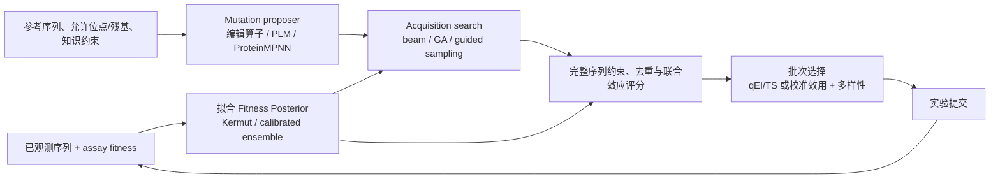

# 开放式 Mutation Designer：研究分析与系统完善 PLAN

> 状态：Implementation-ready plan  
> 形成日期：2026-08-15  
> 适用仓库：`fitness-agents`  
> 核心目标：把当前“从既有候选池筛选”升级为“在约束下主动生成从未列入候选池的新突变序列，并用校准后的不确定性完成评估、搜索和批次选择”。

## 1. 执行结论

建议采用以下技术路线：

1. **保留当前候选池模式作为 `closed_pool` 基线，同时新增真正的 `open_design` 模式。** 新模式不接收待筛选候选池，而是接收参考序列、允许突变位点/残基、已观测数据、实验约束和预算，输出带完整序列与谱系信息的新提案。
2. **Gaussian Process 应归属于“突变评估与不确定性”模块，但其后验同时服务于生成搜索和最终选择。** 也就是“模型只维护一份，生成与选择两处消费”，而不是在生成器和评估器里各实现一套 GP。
3. **MVP 采用 LaMBO/BOSS 启发的局部编辑 + acquisition-guided beam/GA 搜索，而不是直接引入大型生成模型。** 当前项目已有固定到官方提交的 Kermut Exact GP 后端，足以先建立可验证、低数据、可解释的闭环。
4. **单点、双点、多点是“每条生成序列相对固定参考序列的突变数”，不是每轮实验的序列数。** 单点为默认；双点必须恰好 2 个不同位点；多点默认恰好 3 个，也允许显式配置为 `3..max_mutations`。每轮实验批量大小仍由 `budget_per_round` 独立控制。
5. **双点/多点不能把高分单点突变简单拼接。** 必须构造完整组合序列后重新预测，并报告组合效应和 epistasis；批量选择还应考虑候选间的后验相关性与多样性。
6. **优先复用源码的顺序为：当前 Kermut → LaMBO 编辑/过滤抽象 → BOSS acquisition optimizer → ALDE 的 UQ/采集基线 → MODIFY 的库多样性优化。** FAST-HIT/BO-EVO 与目标架构最接近，但审计快照缺少根许可证，只能作为算法和对照参考。ProteinGuide/ProteinGen、EvoDiff、ProteinMPNN 作为后续可插拔生成器。EVOLVEpro 只可作架构参考，其仓库许可证禁止常规改写、衍生和再分发，不能把代码直接移入本项目。

## 2. 需求语义与边界

### 2.1 三种突变模式

| 模式 | 约束 | 默认行为 | 禁止行为 |
|---|---|---|---|
| `single` | 每条提案与 `reference_sequence` 的 Hamming 距离恰为 1 | 系统默认 | 把“单点”误解为只返回 1 条序列 |
| `double` | 恰为 2，两个编辑位点互异 | 对完整双突变序列重新打分 | 按两个单突变分数求和后直接组合 |
| `multi` | 默认恰为 3；可配置 `mutation_count >= 3` | 分层扩展并在每层重算联合分数 | 在同一位点重复编辑；只使用独立位点效应 |

`reference_sequence` 必须在一次 campaign 内保持不变。生成器可以从 WT 或已测量 elite 作为搜索父节点开始，但最终 `mutation_count` 一律相对固定参考序列计算；否则“从双突变父本再加 1 个编辑”会被错误记录成单点设计。

### 2.2 “置信度最高”需要拆成可计算目标

高不确定性并不等于高置信度。现有 UCB 为 `mean + beta × std`，会主动奖励不确定区域，适合探索，却不能在 UI 或报告中称为“置信度最高”。建议提供三种清晰目标：

| `design_goal` | 建议效用 | 含义 |
|---|---|---|
| `confident_improvement` | `P(f(x) > f_best + delta)` 或 LCB | 优先选择有较高概率真实改进的序列 |
| `balanced` | EI/qEI 或 UCB | 在期望收益与不确定探索间折中；建议作为主动学习 campaign 默认 |
| `explore` | Thompson sampling、posterior variance | 主动采集能降低模型不确定性的序列 |

因此本 PLAN 只把 **`mutation_mode=single`** 设为无条件默认；获取目标要在配置和报告中显式记录。若产品文案要求“最高置信度”，应默认映射为 `confident_improvement`，不能静默映射为 UCB。

### 2.3 非目标

- 第一版不做无约束 de novo 全蛋白设计、插入或删除；只做固定长度的氨基酸替换。
- 不让 LLM 直接输出未经约束和数值评估的最终序列；LLM/知识模块只提供位点、残基先验、禁用项和可解释假设。
- 不把隐藏 oracle、完整 fitness landscape 或 final-test 标签暴露给生成器。
- 不以“接入了 GP”作为完成标准；后验方差、校准、OOD 和闭环查询效率都必须验证。

## 3. 当前系统审计

### 3.1 已确认的主要缺口

| 位置 | 当前行为 | 对开放式设计的影响 |
|---|---|---|
| [`mutation/generators.py`](../src/fitness_agents/mutation/generators.py#L19) | `EnumeratingCandidateGenerator` 原样返回输入候选；hypothesis/knowledge 生成器也只对输入候选排序、过滤和截断 | 名为 generator，实际是 pool filter，不会产生新序列 |
| [`contracts/interfaces.py`](../src/fitness_agents/contracts/interfaces.py#L42) | `CandidateGenerator.generate(candidates, ...)` 是 pool-in/pool-out；没有参考序列、编辑算子、约束、评分回调和生成谱系 | 接口从根本上绑定有限候选池 |
| [`loop/orchestrator.py`](../src/fitness_agents/loop/orchestrator.py#L233) | campaign 从 `oracle_pool` 构造 `remaining`，每轮只在其中预测和选择 | 新序列无法进入闭环；全局排名还会依赖完整 pool |
| [`loop/backends.py`](../src/fitness_agents/loop/backends.py#L82) | `submit()` 只接收 ID，并拒绝不在 oracle pool 中的 ID | 即使前面生成新序列，也不能提交实验 |
| [`contracts/schemas.py`](../src/fitness_agents/contracts/schemas.py#L15) | `Variant` 没有 reference、parent、edit 列表、generation engine、约束审计等字段 | 无法可靠重现、审计和追踪新序列来源 |
| [`acquisition/policies.py`](../src/fitness_agents/acquisition/policies.py#L11) | acquisition 只给已预测池打分；批次多样性使用 GB1 专用、长度固定为 4 的 Hamming penalty | acquisition 不能反向驱动序列搜索，且不能泛化到全长序列 |
| [`models/ensemble.py`](../src/fitness_agents/models/ensemble.py#L139) | sklearn GP 虽调用 `return_std=True`，但丢弃 GP std；最终 std 主要来自模型成员分歧和 conformal radius | 当前默认模型的 `include_gaussian_process` 不是严格的 GP 后验 UQ |
| [`features/gb1.py`](../src/fitness_agents/features/gb1.py#L19) | GB1 one-hot provider 已包含全部二阶 pairwise 特征 | 这是现有可复用资产，可用于验证显式二阶联合效应 |

### 3.2 已有可复用能力

- [`models/backends/kermut.py`](../src/fitness_agents/models/backends/kermut.py#L47) 已实现 Kermut Exact GP，返回 likelihood posterior mean/std；[`kermut_core.py`](../src/fitness_agents/models/backends/kermut_core.py#L1) 固定官方提交 `7e9e2e62a59773f6cc8291d85e6d6006a41a6862` 并保留 MIT 许可证。
- Kermut 的 `live_esm2` 特征模式可对运行时新序列计算特征，适合 `open_design`；`precomputed` 模式只能用于固定 benchmark。
- 当前 UCB、Thompson、模型注册表、知识证据和实验轮次状态机都可以保留，只需解除有限池假设。
- Kermut 当前公开的是逐点均值/标准差，还没有面向 qEI、联合 Thompson 或 epistasis 置信区间的**候选联合协方差接口**；这是 GP 相关改造的重点。

## 4. 文献与开源程序调研

### 4.1 方法

本次采用目标明确的技术型文献综述，而非声称穷尽全部蛋白设计研究的系统综述。

- 检索日期：2026-08-15。
- 检索主题：protein mutation/sequence generation、directed evolution、Bayesian optimization、Gaussian process、uncertainty quantification、epistasis、guided diffusion、combinatorial library design。
- 证据优先级：同行评审论文与官方论文页 > 作者官方仓库及固定提交 > arXiv/bioRxiv 预印本。博客、二手介绍和搜索摘要不作为算法结论的主要依据。
- 源码审计：检查候选表示、生成/优化主循环、acquisition、联合突变处理、依赖和许可证；未在本次工作中复现实验训练结果。
- 重要局限：SGPO 仍是预印本；ProteinGuide 虽已同行评审，但截至检索日仅发表约两周，工程成熟度需要单独压测；开源许可证判断不构成法律意见。

### 4.2 程序策略与可借鉴性

| 程序/论文 | 序列生成或搜索策略 | UQ/联合突变特点 | 与本项目关系 | 结论 |
|---|---|---|---|---|
| [Romero et al., 2013](https://doi.org/10.1073/pnas.1215251110) | 用序列/结构距离核建立 GP fitness landscape，以实验设计选择新变体 | 给出 GP 均值、方差和集合信息设计；强调结构接触 | 奠定“GP 属于 surrogate，实验设计消费后验”的原则 | 方法依据；不是可直接集成的现代代码包 |
| [BOSS](https://arxiv.org/abs/2010.00979) / [GitHub](https://github.com/henrymoss/BOSS) | 用 string kernel GP 建模字符串空间，用遗传算法直接优化 acquisition | 支持 one-hot、n-gram、subsequence string kernel；GA 通过 mutation/crossover 产生未枚举字符串 | 正好解决“acquisition 如何进入生成搜索” | **借鉴 GA acquisition optimizer**；Apache-2.0，但旧 Emukit/GPy/Python 3.7 栈不应整包引入 |
| [BO-EVO](https://doi.org/10.1093/bib/bbac570) / [FAST-HIT](https://github.com/hury07/fasthit) | 从测量批次按 fitness/Thompson 选择父本，随机施加局部 mutation/recombination 产生子代，再由 GP-UCB/EI/PI/TS 逐步选择 | GPR 提供不确定性；以 model-query budget 和 experiment-query budget 分开控制搜索 | 在已报道程序中与本需求的“生成新子代 + GP acquisition + 实验闭环”最直接对应 | **作为核心算法基线和接口参考**；其 mutation 数近似随机而非 exact-depth，Python 3.7/GPyTorch 1.5 已旧，且审计提交无根许可证，暂不复制源码 |
| [LaMBO](https://proceedings.mlr.press/v162/stanton22a.html) / [GitHub](https://github.com/samuelstanton/lambo) | 从活跃/Pareto 父本执行 substitution/insertion/deletion；DAE latent space 中优化 acquisition，并过滤不可行、重复和已测序列 | 多任务 GP + qEI/qNEHVI；完整候选重新评估 | 与本项目需要的提案对象、编辑谱系和 acquisition-guided generation 最接近 | **MVP 最重要的源码参考**；Apache-2.0。先移植精简 substitution 抽象与过滤流程，不引入完整训练栈 |
| [Regularized BO](https://pmc.ncbi.nlm.nih.gov/articles/PMC8246133/) | 在 BO acquisition 中加入 PLM 或结构能量正则，限制 adversarial/非天然序列 | 实验适应性 surrogate 与固定生物先验分离 | 支持把知识/PLM 作为约束或 prior，而不是替代实验 GP | 借鉴正则化效用与安全过滤接口 |
| [ALDE](https://www.nature.com/articles/s41467-025-55987-8) / [GitHub](https://github.com/jsunn-y/ALDE) | 对预先枚举的组合空间执行多轮 active learning | GP/DKL/ensemble + UCB/TS；明确处理 epistatic landscape | 与当前系统同属“有限池 + UQ 筛选”，不是开放生成 | 保留为闭池基线，并借鉴 UQ/acquisition 测试；**不能当作开放生成器** |
| [MODIFY](https://www.nature.com/articles/s41467-024-50698-y) / [GitHub](https://github.com/luo-group/MODIFY) | 对指定残基的组合库学习位点级 categorical distribution，优化预测 fitness + entropy/diversity | 用全序列预测值评价采样库，但库分布本身近似因子化 | 适合“设计一批可合成的多样化库”，不适合作为首个逐序列闭环搜索器 | MIT；第二阶段可移植库分布/多样性目标，并补充 epistasis-aware scorer |
| [EVOLVEpro](https://doi.org/10.1126/science.adr6006) / [GitHub](https://github.com/mat10d/EvolvePro) | PLM embedding + 少样本 RF 等模型，对预生成 single/multi mutant embedding 排序 | 官方代码的 GP 选项没有把 posterior std 送入选择；多点组合来自已筛单突变的组合生成 | 与当前候选池架构相似，可用于比较但不是开放优化 | **只参考流程，不复制/修改源码**；其 Internal Research EULA 禁止常规改写、衍生、再分发与商业使用 |
| [Kermut](https://papers.nips.cc/paper_files/paper/2024/hash/34547650b2ca69d91f3b3c3ae8b21962-Abstract-Conference.html) / [GitHub](https://github.com/petergroth/kermut) | ESM-2 prior mean + 序列/结构/ProteinMPNN 复合 mutation kernel 的 Exact GP | 原生 posterior UQ，可接收多个 substitution；论文也指出 instance-level calibration、固定结构和 O(N³) 限制 | 当前项目已经完成官方源码适配 | **作为首选 GP/UQ 后端**；新增 joint posterior 和 epistasis 验证，不再另写重复 GP |
| [EvoDiff](https://github.com/microsoft/evodiff) | OADM/D3PM 离散扩散；支持无条件序列、MSA 条件、inpainting 和 motif scaffolding | 自身提供 sequence prior，不根据本 assay 的 GP 不确定性主动优化 | 可大幅扩展 proposal manifold，但计算和依赖重 | MIT；只作为可选生成器插件，生成后仍由统一 posterior/acquisition 筛选 |
| [ProteinMPNN](https://github.com/dauparas/ProteinMPNN) | 给定蛋白骨架进行 inverse folding；可固定位置、限制残基和调温采样 | 结构先验强，但本身不是 assay-specific UQ | 有可靠结构时非常适合生成可折叠局部变体 | MIT；作为可选 structure-conditioned proposer，不替代 fitness surrogate |
| [SGPO](https://arxiv.org/abs/2505.15093) / [GitHub](https://github.com/jsunn-y/SGPO) | 用 classifier guidance、DAPS、NOS 或 DPO 引导扩散/语言模型；迭代实验中用 ensemble + Thompson 式指导 | 能把实验小数据用于生成过程，覆盖整个序列分布 | 证明“生成过程中消费不确定预测”可行，但 H100 依赖、预训练与预印本状态不适合 MVP | Apache-2.0；作为高级 guided generator 研究路线 |
| [ProteinGuide](https://www.nature.com/articles/s41587-026-03207-z) / [GitHub](https://github.com/junhaobearxiong/proteinguide) | 通过 Bayes rule 在采样每一步以 property predictor 引导 MLM、ProteinMPNN、离散扩散/flow；无需重训生成模型 | 支持 TAG/DEG、实验属性、多属性 Pareto 和湿实验闭环 | 是“统一 predictor 指导多种 generator”的最新直接证据 | MIT；**高级路线优先使用作者推荐的 [ProteinGen](https://ishangaur.com/proteingen/) 适配，而非复制论文实验仓库** |
| [NOS/LaMBO-2](https://arxiv.org/abs/2305.20009) / [GitHub](https://github.com/ngruver/NOS) | 在离散扩散去噪过程中进行优化引导 | 适合高维属性引导生成 | 与 SGPO/ProteinGuide 重叠 | 作为研究对照，不进入 MVP 依赖 |

### 4.3 固定源码快照与许可证记录

本次源码级分析使用以下快照，便于实现时复核差异：

| 仓库 | 审计提交 | 许可证 | 计划中的使用方式 |
|---|---:|---|---|
| `petergroth/kermut` | `7e9e2e62a59773f6cc8291d85e6d6006a41a6862` | MIT | 已适配；继续扩展 posterior 接口 |
| `samuelstanton/lambo` | `ac62e8e` | Apache-2.0 | 移植/改写 substitution candidate、lineage、feasibility/duplicate filter；保留 attribution |
| `henrymoss/BOSS` | `f19eaf7` | Apache-2.0 | 将 string GA acquisition optimizer 改写为项目原生接口，不引入 Emukit/GPy |
| `hury07/fasthit` | `0f9c51aa7caaab0b4618b0cab4f3107e7251091b` | 审计快照未发现根许可证 | 仅研究 BO-EVO 父本选择、随机子代、模型/实验双预算与 Explorer 契约；许可澄清前不复制 |
| `jsunn-y/ALDE` | `d0b3593` | MIT | 作为有限域 UCB/TS/GP 基线和测试参考 |
| `luo-group/MODIFY` | `31d1ce1` | MIT | 可选库级 fitness-diversity optimizer |
| `mat10d/EvolvePro` | `1c77697` | 限制性 Internal Research EULA | 不移植代码，只做行为对照 |
| `microsoft/evodiff` | `33206e9` | MIT | 隔离环境中的可选 proposer adapter |
| `dauparas/ProteinMPNN` | `8907e66` | MIT | 可选 structure proposer adapter |
| `jsunn-y/SGPO` | `290fa8a` | Apache-2.0 | 高级 guided generation 研究，不作为核心依赖 |
| `junhaobearxiong/proteinguide` | `93a962c03aff0c73f31e63cf82b4574e24750023` | MIT；底层模型另受各自许可约束 | 优先通过 ProteinGen 做可选集成 |

若实现时实际复制或实质改写第三方代码，必须增加 `THIRD_PARTY_NOTICES.md`、文件头 attribution、上游提交和许可证全文；仅借鉴论文算法并独立实现时，也应在模块文档中引用论文与仓库。

## 5. GP 放置决策

### 5.1 三种方案比较

| 方案 | 优点 | 缺点 | 决策 |
|---|---|---|---|
| GP 只用于最终评估/选择 | 模块清晰，容易在有限池上实现 | 生成器仍盲目；大空间中先随机生成再打分会浪费绝大多数计算 | 不足以完成开放式 designer |
| GP 内嵌序列生成模块 | 能用不确定性引导搜索 | 训练数据、校准、模型版本和 selection 逻辑重复；难以替换 Kermut/ensemble/未来模型 | 不采用 |
| 一个 posterior service，生成搜索与批次选择共同调用 | 单一事实源；生成可最大化 acquisition；选择可做 q-acquisition；所有提案共享同一校准和模型版本 | 需要扩展 predictor protocol，搜索器要接受 callback | **推荐** |

### 5.2 推荐的数据流



接口上，GP 不出现在 `mutation/` 目录。`mutation/search.py` 只依赖一个 `AcquisitionEvaluator` 或 `PosteriorProvider` protocol；底层可以是 Kermut、默认 ensemble 或未来的稀疏 GP。

### 5.3 对当前两个 GP 路径的具体处理

1. **Kermut：首选。** 保留 Exact GP、ESM-2 prior mean 和结构复合核；增加 `posterior(variants)`，返回同批候选的 mean、covariance、noise、model version 和可复现 posterior samples。
2. **默认 heterogeneous ensemble：继续作为轻量基线。** 修复 sklearn GP std 被丢弃的问题；明确组合 ensemble spread、GP posterior variance 和 conformal residual 的方法，避免把不同含义的方差直接相加。若无法证明组合后的概率校准，应把其标为 `heuristic_uncertainty`，禁止用于声称严格 PoI/qEI 的结果。
3. **扩展规模。** Exact GP 随标签数近似 O(N³)。到达经 benchmark 确认的资源阈值后，新增 inducing-point/variational GP 后端；阈值不能写死为未经测量的经验数字。
4. **校准。** 除总体 interval coverage 外，必须按 mutation depth、到最近训练点距离和 fitness quantile 分层检查。Kermut 论文已明确提醒 instance-specific uncertainty 仍具挑战，不能只看一张总体 reliability plot。

## 6. 目标架构与契约

### 6.1 新领域对象

建议在 `contracts/schemas.py` 增加：

```python
class MutationMode(str, Enum):
    SINGLE = "single"
    DOUBLE = "double"
    MULTI = "multi"

@dataclass(frozen=True)
class MutationEdit:
    position: int              # 明确 0/1-based；推荐内部 0-based
    from_residue: str
    to_residue: str

@dataclass(frozen=True)
class SequenceProposal:
    proposal_id: str           # task + reference + full sequence 的稳定 hash
    sequence: str
    reference_sequence: str
    parent_id: str | None
    edits_from_reference: tuple[MutationEdit, ...]
    edits_from_parent: tuple[MutationEdit, ...]
    generation_engine: str
    generation_round: int
    generation_seed: int
    constraint_audit: dict[str, bool | float | str]
    provenance: dict[str, str | float | int]

@dataclass(frozen=True)
class PosteriorBatch:
    variant_ids: tuple[str, ...]
    mean: ndarray
    covariance: ndarray | None
    epistemic_std: ndarray
    aleatoric_std: ndarray | None
    model_version: str
    uncertainty_kind: str      # posterior / ensemble_heuristic / deterministic
```

不建议立即删除 `Variant`。第一阶段由 `SequenceProposal.to_variant()` 产生兼容对象，保证现有 feature provider、predictor、writer 和指标代码可逐步迁移。

### 6.2 新协议

```python
class MutationProposer(Protocol):
    def propose(self, context: ProposalContext, limit: int) -> list[SequenceProposal]: ...

class AcquisitionSearch(Protocol):
    def optimize(
        self,
        context: ProposalContext,
        proposer: MutationProposer,
        evaluator: AcquisitionEvaluator,
        limit: int,
    ) -> list[ScoredProposal]: ...

class ProbabilisticFitnessPredictor(FitnessPredictor, Protocol):
    def posterior(self, variants: Sequence[Variant]) -> PosteriorBatch: ...

class ExperimentBackend(Protocol):
    def submit(self, proposals: Sequence[SequenceProposal], round_id: int) -> str: ...
```

`CandidateGenerator` 暂时保留为 `closed_pool` adapter；不能让新 `MutationProposer` 继续接收 oracle candidates，否则只是换名不换行为。

### 6.3 建议配置

```yaml
designer:
  space: open_design
  mutation_mode: single          # 默认
  mutation_count: 1              # double=2；multi 默认=3
  proposal_engine: local_edit
  search_engine: acquisition_beam
  parent_policy: wt_plus_diverse_elites
  allowed_positions: [39, 40, 41, 54]
  allowed_residues: canonical_20
  proposals_per_round: 512       # 计算候选预算，不是湿实验预算
  beam_width: 64
  max_search_evaluations: 5000
  design_goal: balanced
  acquisition: expected_improvement
  diversity_metric: full_sequence_hamming
  forbid_observed: true
  forbid_duplicate_sequences: true
```

配置校验必须满足：`single => mutation_count=1`、`double => 2`、`multi => >=3`；允许位点数不得小于突变数；所有残基为规范氨基酸；参考序列与任务长度一致；搜索计算预算和实验预算分别记录。

## 7. MVP 生成与选择算法

### 7.1 父本集合

每轮建立搜索起点：

1. WT/reference 始终存在；
2. 加入已测量的 top-k elite；
3. 从高 fitness 的已测量序列中用 max-min distance 选一组 diverse elite；
4. 只允许使用当前轮之前已揭示的标签；同轮 pending 和隐藏 oracle 不得参与。

知识/LLM 输出转换为软先验或硬约束：`preferred_residues` 可提高 proposal probability 或 acquisition regularizer，但不得绕过 scorer。所有硬过滤必须产生 `constraint_audit` 记录。

### 7.2 单点模式

1. 对所有允许位点应用 `from -> to` substitution；若空间小则全枚举，否则按知识/PLM prior 分层采样。
2. 删除 WT、自替换、已测、重复、禁用残基和违反任务约束的序列。
3. 对**完整单突变序列**求 posterior 和 acquisition。
4. 根据选定 `design_goal` 排序，再做批次联合选择。

这是第一条竖向可交付路径：即使只实现 `local_edit + Kermut posterior + PoI/EI`，也已经从既有 pool filtering 变为真正的新序列设计。

### 7.3 双点模式

采用分层 beam，而非先取两个“最佳单突变”直接相加：

1. 生成全部或采样单点节点，按 acquisition 保留 beam；
2. 从每个节点扩展第二个不同位置的 substitution；
3. 统一转换为相对 reference 的两个编辑，去重；
4. 对完整双突变序列重新编码、重新求 posterior 和 acquisition；
5. 可保留少量来自低分单点的探索支路，避免 sign epistasis 导致 beam 过早剪枝。

### 7.4 多点模式

默认深度 3，重复“扩展一个不同位置 → 去重/约束 → 完整序列重评估 → beam 截断”。为避免多突变 OOD 被虚假高分吸引：

- beam 中同时保留 acquisition top、diverse top 和 posterior sample top 三类配额；
- 设置相对 reference 的精确 mutation depth；
- 对 OOD、PLM naturalness、结构可行性使用可审计 penalty/constraint；
- 报告每层 `generated/evaluated/valid/deduplicated/pruned` 数量；
- 若所有有效提案不足实验预算，应明确返回不足，不得降低约束后静默补齐。

### 7.5 联合效应与 epistasis

必须区分两个“联合”：

1. **同一序列内部的联合突变效应。** predictor 输入必须是完整双/多突变序列；GB1 基线可使用现有 pairwise one-hot，Kermut/PLM 使用全序列表示。双突变的交互诊断为：

   `epsilon_12 = mu(12) - mu(1) - mu(2) + mu(WT)`

   三突变可用 inclusion-exclusion 分解二阶与三阶残差。`epsilon` 用于审计和解释，最终排序仍使用完整序列的 posterior，不把分解值当作独立真值。

2. **同一实验批次内候选之间的联合价值。** 如果 predictor 提供 covariance，使用 qEI、joint Thompson/fantasies 或 sequential conditioning；否则退化为 greedy acquisition + local penalization，并在结果中标记为近似。现有简单 Hamming penalty 可作为基线，但要去掉 GB1 长度 `4` 的硬编码。

对 `epsilon` 的置信区间不能把四个边际标准差独立相加。应从 `posterior([WT, single1, single2, double])` 的联合多元分布采样后计算 epsilon；三突变同理。这也是 `posterior covariance` 接口必须优先于“再加一个 std 字段”的原因。

### 7.6 搜索器实现优先级

1. `acquisition_beam`：结合 BO-EVO 的父本/模型查询预算思想和 LaMBO 的候选过滤流程，项目原生实现；确定性强、适合精确 1/2/3 点替换，是 MVP 默认。
2. `acquisition_ga`：基于 BOSS `StringGeneticAlgorithmAcquisitionOptimizer` 改写；mutation/crossover 后强制 exact-depth repair，适合位点数增加时避免全枚举。
3. `lambo_latent`：实验性插件，复用 LaMBO 的 candidate/lineage/过滤思想；只有在需要更长序列和连续 latent 优化时才引入其重型依赖。
4. `proteingen_guided`：高级插件，通过 ProteinGen 将 assay predictor 与 ProteinMPNN/ESM3/DPLM 等生成器组合；先做独立环境/进程 adapter，避免污染核心依赖。

## 8. 实验后端与防泄漏改造

开放生成会使当前 ID-only `CsvOracleBackend` 失效。建议分成：

- `PoolOracleBackend`：保留当前逻辑，只服务 `closed_pool` 回归测试。
- `SequenceOracleBackend`：接收完整提案，在内部隐藏表中按规范化 sequence 查找标签。生成器只知道 reference、允许空间和已揭示结果，不得获得隐藏表的 ID 列表或 fitness。
- `LabQueueBackend`：接收完整序列/突变 notation/元数据，返回 pending run；后续由外部测量文件或 API collect。

必须新增泄漏测试：在同一已观测数据和 seed 下，改变未查询 oracle fitness 的排列，不应改变提交前的 proposal 生成；只有 collect 后的下一轮可以变化。

开放模式下不再计算“在全部 oracle pool 中的真实全局 rank”作为在线字段。报告应改为：

- `search_evaluated_count`
- `proposal_rank_within_search`
- `acquisition_value`、posterior mean/std/PoI
- `novelty_to_observed`、`distance_to_reference`
- `interaction_mean/std`
- `generation_engine/version/seed/parent`

只有离线 benchmark 结束后，才可由独立 evaluator 追加 exhaustive-landscape rank。

## 9. 按文件实施清单

| 文件/模块 | 计划变更 |
|---|---|
| `contracts/schemas.py` | 增加 `MutationMode`、`MutationEdit`、`SequenceProposal`、`PosteriorBatch`、`ScoredProposal`；为旧 `Variant` 提供兼容转换 |
| `contracts/interfaces.py` | 新增 proposer/search/posterior 协议；ExperimentBackend 改为 proposal payload；保留 legacy adapters |
| `config.py` + `configs/designer/*.yaml` | 新增 `DesignerConfig`、模式/深度/位置/残基/父本/搜索预算/目标/约束校验 |
| `mutation/operators.py` | 基于 LaMBO 抽象实现 substitution、apply、canonicalize、relative edits、stable ID；记录 Apache attribution |
| `mutation/constraints.py` | 规范残基、固定长度、exact depth、allowed positions/residues、重复/已测、任务特定硬约束 |
| `mutation/proposers.py` | `LocalEditProposer`；后续 `ProteinMPNNProposer`、`ProteinGenProposer` 插件 |
| `mutation/search.py` | beam search；随后加入基于 BOSS 思路的 GA acquisition optimizer |
| `models/backends/kermut.py` | 增加联合 posterior/covariance/sampling；复用 live feature cache；补充按 depth 的 calibration 输出 |
| `models/ensemble.py` | 不再丢弃 GP std；区分 posterior 与 heuristic uncertainty；移除 WT=`VDGV` 和长度 4 的模型内硬编码 |
| `acquisition/policies.py` | 将 point score 与 batch selector 拆分；增加 PoI/EI/LCB；支持 posterior callback、q/conditional selector 和通用距离 |
| `loop/orchestrator.py` | 分离 `closed_pool` 与 `open_design` 路径；open path 不创建 `remaining oracle_pool`；先 fit posterior，再运行 search |
| `loop/backends.py` | 增加 sequence-aware oracle 和 lab queue adapter；保留 PoolOracleBackend |
| `reporting/*` | 新 proposal artifact、谱系、约束审计、搜索漏斗、联合效应、模型/UQ 类型；取消开放模式在线全局 rank |
| `tests/unit/*` | exact-depth、edit round-trip、stable ID、去重、joint posterior、epistasis、acquisition 语义、许可证 attribution |
| `tests/integration/*` | 新序列端到端闭环、oracle 防泄漏、单/双/三点、legacy closed-pool 不回归、固定 seed 可复现 |

## 10. 分阶段交付与验收

### Phase 0：契约与兼容层

交付：领域对象、配置校验、`closed_pool/open_design` 显式开关、旧 generator/backend adapter。

验收：

- 现有测试与报告不改变语义；
- 任一 proposal 可从 reference + edits 无损重建完整序列；
- ID 对相同 task/reference/sequence 稳定，对不同序列不冲突；
- 所有模式错误配置在 campaign 启动前失败。

### Phase 1：开放式单点 MVP

交付：`LocalEditProposer`、约束/去重、Kermut 或默认 predictor 评分、PoI/EI/UCB 搜索、SequenceOracleBackend。

验收：

- 在输入不含 candidate pool 时生成此前不存在的合法序列；
- 每条 proposal 相对 reference 恰有 1 个 substitution；
- oracle 未查询标签对 proposal 无影响；
- 同 seed、同观察数据、同模型版本得到相同提案与排序；
- `single` 为默认配置。

### Phase 2：可信 posterior 与联合采集

交付：Kermut `PosteriorBatch`、covariance/posterior sampling、PoI/EI/qEI 或 sequential fantasies、分层 calibration。

验收：

- posterior covariance 对称且数值半正定（容许数值公差）；
- 边际 std 与当前 Kermut `predict()` 一致；
- observed-near/OOD 分层 coverage、NLL、rank calibration 可报告；
- `confident_improvement` 与 UCB 在人工高不确定样例中表现出预期差异。

### Phase 3：双点与多点联合效应

交付：exact-depth beam、interaction report、探索配额、通用 batch diversity。

验收：

- double 全部恰为 2 点；multi 默认全部恰为 3 点；
- 使用具有人工 sign epistasis 的 synthetic landscape 时，系统能找到“单点不优、组合变优”的序列；
- 排序使用完整组合 posterior，不等于单点分数简单求和；
- interaction uncertainty 使用联合样本，测试能检测错误的独立方差相加实现。

### Phase 4：源码启发的可扩展搜索与生成插件

交付：BOSS-style GA、可选 MODIFY library optimizer、ProteinGen/ProteinGuide 或 ProteinMPNN proposer adapter；需要时再评估 EvoDiff/SGPO。

验收：

- 插件进程失败不会破坏核心 campaign，且有明确依赖/设备错误；
- 相同搜索计算预算下，与 beam/random proposal 比较 hit rate 与 wall time；
- 第三方许可证、提交、模型权重和 attribution 完整；
- 高级生成器产生的序列仍通过统一约束、posterior 和实验 backend，不拥有旁路。

### Phase 5：benchmark、文档和上线门槛

交付：GB1 exhaustive 离线 benchmark、消融、迁移文档、运行手册。

上线门槛：开放模式在至少一个固定 benchmark/seed 集合上，相比随机局部突变提高 query efficiency；不存在标签泄漏；校准和 OOD 退化已量化；legacy 模式测试全部通过。

## 11. 评估设计

### 11.1 基准与切分

- 首选 GB1 四位点 exhaustive landscape：隐藏完整 landscape 作为 SequenceOracle，designer 只接收 WT、允许位点/残基和已揭示数据。
- 除随机切分外，必须做 mutation-depth 外推：single 训练 → double/triple 测试，以及跨位点组合留出。
- 后续加入更长蛋白/更多位点 benchmark，避免对 GB1 四字符编码过拟合。

### 11.2 基线与消融

- random local edits；
- 当前 closed-pool greedy/UCB/TS；
- ALDE-style finite-domain active learning；
- FAST-HIT/BO-EVO-style local random mutation + GP-UCB；
- open beam：mean-only、PoI、EI、UCB、TS；
- Kermut vs ensemble；
- generator blind sampling + post hoc rank vs acquisition-guided search；
- additive single-effect ranking vs full-sequence joint scoring；
- 无/有 knowledge prior；无/有 diversity；无/有 PLM/structure constraint。

### 11.3 指标

| 维度 | 指标 |
|---|---|
| 优化效率 | best-so-far、simple regret、达到阈值所需 queries、top-k hit rate、每轮改进概率 |
| UQ | NLL、90% coverage、interval width、Brier/PoI calibration、按 depth/OOD 分层结果 |
| 开放生成 | 新颖序列比例、有效率、重复率、search funnel、每个有效提案的计算成本 |
| 联合突变 | epistasis prediction error、sign-epistasis hit rate、double/triple regret |
| 批次 | 序列距离、embedding diversity、lineage diversity、q-acquisition value |
| 工程 | wall time、峰值内存/GPU、cache hit、可复现性、插件失败恢复 |

不要只报告 Spearman 或预测 RMSE。一个 predictor 可以有较好的全局相关，却在 top-tail、OOD 或 acquisition 所依赖的 uncertainty 上失败。

## 12. 主要风险与缓解

| 风险 | 后果 | 缓解 |
|---|---|---|
| GP 方差未校准 | UCB/PoI/qEI 选择失真 | depth/OOD 分层校准；标注 uncertainty kind；与 ensemble/随机基线比较 |
| 多突变远离训练分布 | surrogate exploitation，生成虚假高分 | exact-depth curriculum、OOD penalty、PLM/structure constraints、探索/多样性配额、湿实验闭环 |
| Kermut 固定结构假设随突变数增加变弱 | 多点结构变化未被捕获 | 设置结构适用性审计；可选结构重算/ProteinMPNN；用显式 pairwise/全序列模型消融 |
| beam 过早剪掉 sign-epistatic 路径 | 找不到需要“先降后升”的组合 | 随机/Thompson 支路、从多个父本出发、GA 对照、保留低单点高不确定组合 |
| 生成模型自然性与 assay 目标不一致 | 序列看似天然但功能不提升 | 生成 prior 与 assay posterior 分离；实验数据决定 property guidance；报告两种分数 |
| 开放 backend 泄漏完整 landscape | benchmark 虚高 | sequence-only hidden oracle、不可访问标签索引、标签置换泄漏测试 |
| 第三方源码/模型许可冲突 | 无法发布或商用 | 固定提交、逐项许可证清单、隔离可选依赖；不移植 EVOLVEpro 限制性源码 |
| 重型生成插件污染核心环境 | 安装冲突、GPU 不可用 | 外部进程/独立环境 adapter、lazy load、明确 device 与 fallback，不设核心依赖 |

## 13. 推荐的首批 PR 顺序

1. **PR-1 — Open design contracts and single-edit proposer**：完成 Phase 0，并让 proposer 在无候选池条件下生成合法单点新序列。
2. **PR-2 — Sequence backend and leak-free loop**：打通开放式单点端到端实验闭环，保留 legacy 路径。
3. **PR-3 — Kermut joint posterior and calibrated acquisitions**：补全 posterior covariance、PoI/EI/q/TS 语义和 UQ 报告。
4. **PR-4 — Exact-depth beam for double/multi + epistasis**：实现双点、默认三点、联合效应和 synthetic sign-epistasis 测试。
5. **PR-5 — BOSS-style GA and advanced proposer plugins**：只有前四个 PR 的 benchmark/防泄漏/校准门槛通过后再引入。

这一顺序先解除系统最根本的“候选池锁定”，再增加 GP 联合能力和多突变复杂度。它也使每个 PR 都可独立验收和回滚。

## 14. 最终定义（Definition of Done）

Mutation Designer 只有在同时满足以下条件时才算从筛选器升级为开放式设计器：

- 不读取待选候选池也能根据 reference 和约束生成此前未登记的完整序列；
- 默认单点，并能严格生成双点及默认三点/可配置多点；
- 多突变按完整序列预测，能够报告带联合不确定性的 epistasis，而非相加单点分数；
- 同一 posterior 模型同时指导 proposal search 和 batch selection；
- 新序列可以通过 sequence-aware backend 进入实验闭环；
- 任何未查询 oracle/final-test 标签都不能影响提案；
- 所有序列均有 reference、parent、edits、模型版本、生成器版本、seed、约束审计和选择原因；
- 在公开 benchmark 上完成 query efficiency、UQ calibration、OOD、联合突变和消融评估；
- legacy closed-pool 模式保持可复现且测试不回归；
- 所有复用源码和模型都有固定来源、许可证与 attribution。

满足这些条件后，系统才真正具备“提出新实验序列”的能力，而不只是对已知列表做更复杂的排序。
