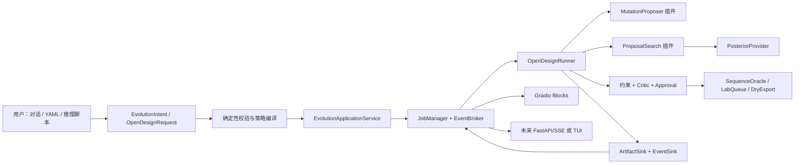

# 开放全序列定向进化模块与轻量交互平台代码优化 PLAN

> 状态：`open_design` 单点开放设计、一致性 hard validation、predictor capability gate、`EvolutionIntent` 和本地 Gradio MVP 已于 2026-08-19 实现；多点搜索、真实实验后端、取消/恢复和异步事件服务仍按本 PLAN 后续实施  
> 审计基线：`D:\fitness-agents` 当前工作区，2026-08-19  
> 当前交付边界：完整序列单替换、posterior/知识/结构/不确定性排序、唯一 resolved design space、Critic/Approval、CLI/脚本/UI 入口；不声称多点联合后验或湿实验优化结果  
> 关联设计：[`open-mutation-designer-plan.md`](open-mutation-designer-plan.md)

## 0. 2026-08-19 实施落点与剩余边界

本轮已经落地以下可执行竖切：

- 新增 `DesignerConfig`；默认 `space: closed_pool`，只有显式配置 `space: open_design`、`position_policy: all` 和 active-learning posterior 时才切换路径；
- 新增独立 `OpenDesignRunner`。主入口仍是 `run_campaign(config)`，但开放模式不实例化 `CampaignRunner`、不创建 oracle backend，也不把 candidate pool 传给 proposer；
- 新增可注册的 `AllPositionSubstitutionProposer`，从完整参考序列对每个开放位置枚举 19 个非 WT 标准氨基酸，使用稳定序列哈希并输出完整序列；
- 新增 `FullSequenceOneHotProvider`，让现有可校准 ensemble 能对动态生成的固定长度完整序列编码；ensemble 的 OOD 距离也改为使用 provider 声明的序列表示，不再固定按四位点分母计算；
- `TaskConfig.initial_observations_path` 可直接指向只含已测序列与 `fitness`/`target` 的独立 measurement CSV；manifest 模式使用只读 observed-only role。legacy public/oracle 仍可兼容，但返回契约不含候选池；
- 复用 `VisibleHoldoutCalibratedPosterior` 与 `HybridBatchAcquisition`，联合 posterior mean、校准不确定性、OOD、可选择知识证据、Scientist 软先验和静态结构风险惩罚选择位置与残基；结构描述符仍明确为 constraint/risk，而不是 fitness；
- Scientist profile 升级到 v2：closed-pool 仍要求覆盖全部配置位点，open-design 则输出不超过 `max_preferred_positions` 的稀疏偏好。未列位置仍参与全空间 posterior 搜索，因此 LLM 不再隐式决定搜索区域；
- 新增可直接运行的 [`knowledge_agent_open_design.yaml`](../configs/experiments/knowledge_agent_open_design.yaml) 和 [`full_sequence_onehot.yaml`](../configs/model/full_sequence_onehot.yaml)。

当前可用命令：

```powershell
.venv\Scripts\python.exe -m fitness_agents.cli `
  configs/experiments/knowledge_agent_open_design.yaml
```

仓库 GB1 smoke run 的执行证据：完整参考序列长度 56，原始空间为 `56 × 19 = 1064` 个单替换；排除 1 条已观测序列后实际评分 1063 条，posterior 状态为 `calibrated`，输出 16 条完整序列。结果中包含 E56W、E15R、F30V、V21C 等原四个配置位点之外的替换，证明选择未被 `[39, 40, 41, 54]` 或原候选池限制。该 smoke 配置没有提供结构文件，因此结构通道正确报告 unavailable，不能据此宣称结构约束已经产生了有效生物学增益。

仍未完成、不能混同为本轮已实现的部分：

- 双点/多点 beam search 及组合级 posterior 重新评分；
- 只给 reference、没有任何可见 assay 标签时的 pretrained zero-shot 冷启动；当前校准 posterior 至少需要 4 条可见观测；
- 面向新序列的真实实验 submission backend、Critic/Approval 闭环与湿实验 reveal；
- `EvolutionApplicationService`、自然语言 `EvolutionIntent`、事件服务和 Gradio/FastAPI 交互平台；
- 结构资源充分时的效用验证。当前实现只完成有资源即启用、无资源即显式不可用的工程接线。

验证状态：新增 open-design 测试与相关模型/Agent/closed-pool 回归共 `36 passed`；全套为 `222 passed, 3 skipped, 1 failed`。唯一失败是仓库既有的 `SPIKE_SARS2` assay-list 期望冲突，与本轮修改无关，未擅自修改该数据范围决策。

## 1. 执行结论

后续实现应同时完成两条相互解耦、通过稳定契约连接的主线：

1. 将现有 pool-in/pool-out 的 `CandidateGenerator` 保留为 `closed_pool` 回归基线，新增真正的 `open_design` 路径。新路径只接收参考全长序列、已观测实验、约束、知识/假设和预算，不接收待筛选候选池；默认在参考序列的**所有允许位置**考虑 19 种非自身标准氨基酸替换，并输出完整序列。
2. 在科学计算主循环之外增加 `EvolutionApplicationService` 和结构化事件协议。首个界面用可选依赖 Gradio Blocks 实现本地浏览器对话框、参数预览、确认、进度和结果下载；后续才增加 FastAPI/SSE 或 TUI 客户端。所有界面共用同一服务，不能直接调用 `CampaignRunner` 私有方法。

推荐的实施顺序是“契约与防泄漏 → 单点开放设计竖切 → sequence-aware 实验后端 → posterior/多点搜索 → 应用服务 → Gradio 界面”。不要先做聊天页面再把现有候选池流程包进去；那样只会得到一个更好看的 closed-pool 启动器。

## 2. 术语、目标与非目标

### 2.1 本计划中的“完全从头进化”

本计划将用户需求解释为：给定一条参考蛋白序列，不预先指定候选突变 pool，也不要求用户预先挑选热点位点；系统可以在配置允许的整个参考序列范围内生成、评分、选择并记录新的替换突变序列。

首个可交付版本是 `open_design + fixed_length_substitution`，不是以下更大的问题：

- 不是从随机噪声生成任意长度、任意拓扑的新蛋白；
- 不包含 insertion、deletion、chain redesign 或 backbone generation；
- 不把语言模型直接输出的序列当作可提交实验；
- 不在没有湿实验或可信 assay 标签时声称已经完成适应度优化。

未来的 ProteinMPNN、扩散模型或任意长度生成器只能作为高级 `MutationProposer` 插件接入，仍须通过相同的约束、posterior、Critic、审批和实验后端。

### 2.2 核心成功条件

`open_design` 只有同时满足以下条件才算实现：

- 在不加载 `oracle_pool`/`candidate_pool` 的情况下产生此前未登记的完整序列；
- `position_policy: all` 时，每个参考序列位置都有被考虑的机会；单点穷举模式应产生 `19 × 可变位置数` 个原始替换，再经过显式约束过滤；
- 所有 proposal 都包含参考序列、父本、完整序列、相对参考编辑、相对父本编辑、稳定 ID、随机种子、生成器版本和约束审计；
- 双点/多点必须对完整组合序列重新编码和评分，不能把单点分数相加；
- 未揭示的 oracle/final-test 标签、ID 列表和 fitness 排序不能影响 proposal；
- config、推理脚本和交互界面三种入口最终调用同一 `OpenDesignRunner`；
- UI 中由 Agent 理解的自然语言必须先变成结构化、可校验的 `EvolutionIntent`，不能直接拼成 shell 参数或任意配置覆盖。

## 3. 当前代码证据与根因

### 3.1 当前系统仍被候选池锁定

| 当前位置 | 已核实行为 | 对开放设计的阻塞 |
|---|---|---|
| [`mutation/generators.py`](../src/fitness_agents/mutation/generators.py) | 三个 generator 的输入和输出都是 `Sequence[Variant]`；只排序、过滤、截断传入 candidates | 名称是 generator，实际是 pool filter |
| [`contracts/interfaces.py`](../src/fitness_agents/contracts/interfaces.py) | `CandidateGenerator.generate(candidates, state, ...)` 强制要求外部候选列表 | 接口本身无法表达“从参考序列生成” |
| [`loop/orchestrator.py`](../src/fitness_agents/loop/orchestrator.py) | `remaining = list(self.bundle.oracle_pool)`，后续证据、生成、预测、验证和提交均围绕 `remaining` | 整个运行时以未观测 oracle pool 为中心 |
| [`loop/backends.py`](../src/fitness_agents/loop/backends.py) | `CsvOracleBackend.submit()` 只接受预先存在于 `_pool_ids` 的 variant ID | 新序列即使生成也无法提交 |
| [`config.py`](../src/fitness_agents/config.py) | `TaskConfig` 强制要求 split manifest 或 public/oracle 文件；没有 designer/measurement 配置 | 真实实验或纯 sequence 输入无法启动 |
| [`protein_features/context.py`](../src/fitness_agents/protein_features/context.py) | `mutable_positions` 与 `wild_type_sites` 必须等长；未提供全长序列时退化为 compact sites | “所有位置”不能从参考序列自动解析 |
| [`models/registry.py`](../src/fitness_agents/models/registry.py) | predictor 注册表没有声明是否能实时处理未见全长序列、所需最小标签数或 joint posterior 能力 | config 无法在启动前拒绝不兼容模型 |
| [`models/ensemble.py`](../src/fitness_agents/models/ensemble.py) | 默认路径依赖 GB1 one-hot/pairwise 特征，OOD 距离中仍有固定分母语义 | 不能默认推广为任意全长蛋白设计器 |
| [`models/backends/kermut.py`](../src/fitness_agents/models/backends/kermut.py) | live sequence 特征可以处理新固定长度序列，但当前 fit 至少需要 4 条已测非 WT 序列，且依赖结构资源 | 能作为开放模式后端，但不能解决零标签冷启动，也尚无 joint covariance 契约 |
| [`cli.py`](../src/fitness_agents/cli.py) | 主入口只能加载 experiment YAML 后同步运行；`ChatTransport` 只是模型供应商 HTTP 边界 | 当前不存在面向用户的会话、任务、状态和取消服务 |
| [`utils/artifacts.py`](../src/fitness_agents/utils/artifacts.py) | 已有 append-only `trace.jsonl` 和覆盖式 `status.json` | 这是 UI 事件源的良好基础，但不能让 UI 轮询并解析内部文件作为唯一协议 |

### 3.2 必须避免的伪修复

- 把 `candidate_limit` 设置为 0：这只会对完整已知 pool 打分，不会生成新序列。
- 把 `mutable_positions` 配成更多位置，但仍从 CSV 读取 candidates：仍是 closed pool。
- 让 LLM 输出一组 mutation notation，再绕过统一 scorer：不可复现、不可校准，也无法保证合法序列。
- 在 `CampaignRunner._run_campaign()` 中堆一个巨大 `if open_design`：会继续扩大当前单体编排器，难以单测、回滚和插入 UI。
- 让 Gradio 回调直接调用 `run_campaign()` 并 tail `trace.jsonl`：会把界面、运行生命周期和文件实现绑死，无法安全处理恢复、取消或第二种客户端。

## 4. 外部开源项目可借鉴内容与取舍

本节只把外部项目作为架构证据。除 Gradio 作为可选依赖外，MVP 不复制或嵌入 OpenCode、Zagens、DeepSeek-TUI 的实现。

### 4.1 OpenCode

OpenCode 当前的 TUI 拆分规范明确要求 TUI 通过 SDK 获取领域数据和操作，不导入后端 session/provider/server 私有实现；其 SDK 提供 session prompt、abort、messages 和 SSE event subscription。这一边界适合本项目：交互界面只依赖 `EvolutionApplicationService`/公开事件，不依赖 `CampaignRunner` 内部对象。[OpenCode TUI package spec](https://github.com/anomalyco/opencode/blob/dev/specs/tui-package.md)；[OpenCode SDK docs](https://github.com/anomalyco/opencode/blob/dev/packages/web/src/content/docs/sdk.mdx)

可借鉴：

- 一个运行内核，多种客户端；
- 稳定的 request/response/event wire schema；
- UI 负责呈现与本地状态，服务端负责领域操作；
- 未知事件/工具类型应可容错显示；
- transport 创建、配置发现和进程生命周期留在 host 层。

不建议直接复用：

- OpenCode 是 TypeScript/Bun 的通用编码 Agent，领域对象和本项目科学流程不同；
- 直接嵌入其 server/TUI 会引入第二套会话、权限、插件和构建系统；
- 本项目只需复用架构原则，不需要通用 shell/file tool surface。

OpenCode 根仓库为 MIT，但如果未来复制任何实质源码，必须固定 commit 并保留许可声明；当前计划不复制源码。[OpenCode LICENSE](https://github.com/anomalyco/opencode/blob/dev/LICENSE)

### 4.2 “DeepSeek harness” 的边界

`deepseek-ai/DeepSeek-V3` 是官方模型/推理仓库，不是本需求所需的交互 harness。检索到的 Zagens 和 DeepSeek-TUI 均为第三方项目，并非 DeepSeek 官方产品；PLAN 中不能把它们写成官方 DeepSeek 架构。[DeepSeek-V3 official repository](https://github.com/deepseek-ai/DeepSeek-V3)；[DeepSeek-TUI repository](https://github.com/Hmbown/DeepSeek-TUI)

Zagens 可借鉴的模式是：Desktop/TUI/CLI 共用一个运行内核，桌面端通过 loopback HTTP+SSE sidecar 消费 event-sourced turn log，并将可恢复/可审计事件视为一等对象。[Zagens repository and architecture](https://github.com/didclawapp-ai/zagens)

可借鉴：

- `one engine, multiple surfaces`；
- 本地 sidecar 与事件流；
- log-first 的恢复与重放；
- 用户批准、运行状态和产物引用是结构化事件，而不是自由文本；
- UI 不接触运行时 token。

不建议直接复用：

- Rust/Tauri/ratatui 对当前纯 Python 项目过重；
- 编码 Agent 的 shell sandbox、diff、MCP 等能力超出本项目需要；
- 这些仓库仍在快速变化。任何未来代码复用都必须重新核对固定 commit、根许可证、NOTICE 和第三方 lineage。

### 4.3 轻量 UI 方案比较

| 方案 | 优点 | 主要问题 | 结论 |
|---|---|---|---|
| Gradio Blocks | 纯 Python；有 Chatbot、文件上传、表格、队列、generator streaming 和停止按钮；Apache-2.0 | 不应承担长期领域 API；复杂恢复/鉴权需要额外服务层 | **MVP 选择**，只做可替换 adapter |
| Streamlit | chat input/message、status、stream API 完整，原型速度快 | rerun 状态模型与长时后台任务/严格事件重放整合成本更高 | 备选，不作为首选 |
| Textual | Python TUI，worker/message 模式适合终端 | 不是浏览器界面；跨线程 UI 更新有额外约束 | 后续可作为第二客户端 |
| FastAPI + 小型 SPA | 最清晰的 HTTP/SSE/OpenAPI 边界，适合多用户/远程 | 首次交付代码和前端测试更多 | Phase 2 服务化，不阻塞本地 MVP |
| 直接嵌入 OpenCode/DeepSeek harness | 已有完整会话/TUI | 技术栈、领域、权限面和依赖规模均不匹配 | 拒绝 |

Gradio 官方文档确认 `ChatInterface` 支持 generator 停止、并发限制，queue 默认可串行化重任务；本项目应使用更灵活的 Blocks，而不是只有文本输出的最小 ChatInterface。[Gradio ChatInterface](https://gradio.app/docs/gradio/chatinterface)；[Gradio queue](https://gradio.app/guides/queuing)；[Gradio LICENSE](https://github.com/gradio-app/gradio/blob/main/LICENSE)

FastAPI 的 `StreamingResponse`/SSE 可作为后续稳定网络适配器，但取消只能在执行到可让出控制权的边界发生，因此底层 campaign 仍必须有显式 `CancellationToken` 检查点。[FastAPI streaming responses](https://fastapi.tiangolo.com/advanced/custom-response/)

## 5. 目标架构



必须形成以下单向依赖：

```text
interaction adapters -> application service -> design/campaign protocols -> domain core
                                                   -> artifact/event protocols

domain core -X-> Gradio/FastAPI/Textual
mutation proposer -X-> oracle pool/final labels
intent agent -X-> raw filesystem/backend credentials
```

## 6. 开放全序列设计模块

### 6.1 新领域对象

建议在 `contracts/design.py` 新增，而不是继续扩大 `schemas.py`：

```python
class DesignSpace(str, Enum):
    CLOSED_POOL = "closed_pool"
    OPEN_DESIGN = "open_design"

class OperatorKind(str, Enum):
    SUBSTITUTION = "substitution"

@dataclass(frozen=True)
class MutationEdit:
    sequence_index: int          # 内部永远 0-based
    display_position: int        # 按任务 numbering 显示
    from_residue: str
    to_residue: str

@dataclass(frozen=True)
class SequenceProposal:
    proposal_id: str
    reference_id: str
    parent_id: str | None
    sequence: str
    sequence_sha256: str
    edits_from_reference: tuple[MutationEdit, ...]
    edits_from_parent: tuple[MutationEdit, ...]
    round_id: int
    proposer: str
    proposer_version: str
    seed: int
    constraint_audit: tuple[ConstraintResult, ...]
    provenance: dict[str, JsonValue]

@dataclass(frozen=True)
class ProposalContext:
    task: ProteinTaskContext
    observed_variants: tuple[Variant, ...]
    observations: tuple[FitnessObservation, ...]
    pending_sequence_hashes: frozenset[str]
    hypothesis: Hypothesis | None
    evidence_pack_ids: tuple[str, ...]
    round_id: int
    seed: int
```

`SequenceProposal.proposal_id` 应由 `task_id + reference_sha256 + full_sequence + operator_version` 产生稳定 hash；不得包含 oracle ID 或 fitness。相同任务/参考/完整序列必须去重为同一 proposal。

第一阶段保留 `Variant`，通过唯一的 `proposal_to_variant()` adapter 兼容现有 predictor/evidence/reporting。不要在多个模块重复从 mutation notation 重建序列。

### 6.2 新协议与插件注册

```python
class MutationProposer(Protocol):
    name: str
    version: str
    def propose(self, context: ProposalContext) -> Iterable[SequenceProposal]: ...

class ProposalConstraint(Protocol):
    name: str
    def evaluate(self, proposal: SequenceProposal, context: ProposalContext) -> ConstraintResult: ...

class ProposalSearch(Protocol):
    name: str
    def search(
        self,
        context: ProposalContext,
        proposals: Iterable[SequenceProposal],
        posterior: PosteriorProvider,
        budget: SearchBudget,
    ) -> list[ScoredProposal]: ...

class PosteriorProvider(Protocol):
    capabilities: PredictorCapabilities
    def posterior(self, proposals: Sequence[SequenceProposal]) -> PosteriorBatch: ...

class SequenceExperimentBackend(Protocol):
    def submit(self, batch: ApprovedSequenceBatch) -> str: ...
    def collect(self, experiment_run_id: str) -> list[FitnessObservation]: ...
```

复用现有 `PluginRegistry`，新增四个独立 registry：`mutation_proposer`、`proposal_constraint`、`proposal_search`、`sequence_backend`。`CandidateGenerator` registry 继续服务 closed pool，不要让新 proposer 继承其接口。

### 6.3 位置和氨基酸空间

`DesignerConfig.position_policy` 支持：

- `all`：默认，自动从 reference sequence 派生所有位置；
- `include`：显式 allowlist；
- `all_except`：全长减 denylist；
- `structure_mask`：未来插件，由结构可解析性/界面区域产生位置集合。

`allowed_residues` 默认标准 20 氨基酸。对每个位置排除当前 residue，因此单点原始空间为 `19L`。必须报告：

- `positions_considered`；
- `raw_expansions`；
- `invalid_residue`、`forbidden_position`、`duplicate`、`observed`、`pending`、其他 constraint 的过滤计数；
- `valid_proposals`、`posterior_evaluated`、`search_pruned`。

当 `single_enumeration: exhaustive` 且预算小于 `19L` 时应在启动前失败或明确改成 `stratified`；不能静默只看序列前若干位置。`stratified` 必须保证位置覆盖并记录未评估比例。

### 6.4 单点、双点和多点搜索

#### 单点 MVP

1. 从 reference 和多样化已测 elite 建立父本集合；reference 永远存在。
2. 对允许位置生成所有合法 `from -> to` substitution。
3. 按完整 sequence hash 去重并执行硬约束。
4. 分块调用 sequence-capable posterior；不得一次把超大空间全部放入内存。
5. 根据 configured acquisition 排序，再执行批次多样性选择。

#### 双点/多点

使用 acquisition-guided beam：

1. 扩展一个未编辑位置；
2. canonicalize 为相对 reference 的 edits；
3. 执行 exact-depth、重复和序列约束；
4. 对完整组合序列重新编码、重新求 posterior；
5. beam 同时保留 exploitation、uncertainty/Thompson 和 diversity 配额；
6. 直到精确 mutation depth，而不是“最多 N 点”。

必须保留少量低单点均值但高不确定路径，避免 sign epistasis 被早期 beam 剪掉。双突变交互可审计为：

`epsilon_12 = mu(AB) - mu(A) - mu(B) + mu(WT)`

epsilon 的区间必须来自 `[WT, A, B, AB]` 的联合 posterior 样本。没有 covariance 时只能标记为 `marginal_heuristic`，不能声称 qEI 或联合 epistasis uncertainty。

### 6.5 predictor 能力声明与冷启动

为 predictor registry 增加显式能力元数据：

```python
@dataclass(frozen=True)
class PredictorCapabilities:
    supports_unseen_sequences: bool
    supports_full_length: bool
    fixed_length_only: bool
    supports_joint_covariance: bool
    supports_posterior_sampling: bool
    minimum_observations: int
    requires_structure_resources: bool
    uncertainty_kind: str
```

启动前的 capability gate 必须拒绝：

- `open_design` + 只支持预计算 candidate ID 的特征库；
- full-length 任务 + GB1 compact-only feature provider；
- qEI/joint Thompson + 无 covariance/sampling 的 predictor；
- 缺结构资源却启用 Kermut structure kernel；
- 未达到最小观测量却直接 fit。

冷启动策略必须显式配置：

- `require_initial_observations`：最严格；不足时只解释缺口，不运行；
- `prior_diverse_batch`：用 zero-shot/PLM/结构/理化先验与多样性生成第一批，所有分数标为 `dry_prior_only`；
- `random_stratified_batch`：作为科学基线；
- 禁止默认用 LLM 主观评分替代 assay posterior。

当前 Kermut live feature 路径可作为有足够观测后的优先开放后端，但需新增 joint posterior/covariance/sampling；当前至少 4 条已测非 WT 的要求必须出现在预检和 UI 中。零标签输入只能做“首批实验设计/干式排序”，不能在 UI 中显示“优化成功”。

### 6.6 sequence-aware 实验与审批

新增三种 backend：

1. `SequenceOracleBackend`：离线 benchmark。隐藏表按规范化完整 sequence 索引，generator 不能访问其 key 集合；只在 submit 后 reveal。
2. `LabQueueBackend`：真实实验。写出待测 FASTA/CSV、mutation notation、板位建议和 approval receipt，返回 pending；用户之后导入测量结果。
3. `DryExportBackend`：只导出 proposal，不产生 `FitnessObservation`；summary 必须标记 `design_only`。

新增 `ApprovedSequenceBatch`，审批 hash 至少覆盖：proposal ID、完整 sequence hash、round、prediction snapshot、evidence snapshot、constraint report 和 Critic decision。现有 `ApprovalEnforcingBackend` 的 fail-closed 语义必须保留，不能因为 backend 接收完整序列而绕过批准。

开放 benchmark 的硬性泄漏测试：在所有已观测内容和 seed 不变时，任意置换未提交 oracle fitness，提交前 proposal 和排序必须逐字节相同；只有 collect 后的下一轮可以变化。

## 7. 配置设计与定向激活

### 7.1 单一真值来源

不要用 `mode` 同时表达 Agent 类型和序列空间。现有 `mode: knowledge_agent`/`llm_agent` 继续表示推理策略；新增 `designer.space` 表示候选来源：

```yaml
mode: knowledge_agent
designer_config: configs/designer/open_substitution_beam.yaml

designer:
  space: open_design
  operator: local_substitution
  position_policy: all
  allowed_residues: canonical_20
  mutation_depth: 1
  parent_policy: reference_plus_diverse_elites
  proposals_per_round: 2048
  max_search_evaluations: 20000
  search:
    plugin: acquisition_beam
    beam_width: 64
    single_enumeration: exhaustive
  cold_start:
    policy: require_initial_observations
  constraints:
    forbid_observed: true
    forbid_pending: true
    exact_depth: true

measurement:
  backend: lab_queue       # sequence_oracle | lab_queue | dry_export
```

`designer.space` 默认 `closed_pool`，保证现有实验不回归。`open_design` 下 `candidate_limit` 应被拒绝或明确忽略并发出配置错误，不能让用户误以为它控制开放搜索预算；开放空间使用 `proposals_per_round` 和 `max_search_evaluations`。

### 7.2 TaskConfig 分离

将 task 的生物学定义与数据源分开：

- `TaskConfig`：protein/assay/objective/reference sequence/numbering/structure；
- `DataSourceConfig`：manifest fold、legacy pool、initial observations；
- `MeasurementConfig`：sequence oracle、lab queue、dry export；
- `DesignerConfig`：空间、算子、约束、搜索。

验证规则：

- `closed_pool` 必须有 manifest/legacy pool；
- `open_design` 必须有 reference sequence，可选 initial observations，不要求 public/oracle pool；
- `sequence_oracle` 只允许 benchmark profile，且其 path 不进入 Agent prompt/artifact public config；
- `lab_queue`/`dry_export` 不允许 final-test 自动打开；
- `position_policy: all` 从 full sequence 自动派生 wild-type residue，不要求用户重复填写 `wild_type_sites`。

### 7.3 推理脚本激活

新增 `scripts/run_open_design.py`，用于非 UI 推理：

```text
.venv\Scripts\python.exe scripts\run_open_design.py \
  --experiment configs/experiments/knowledge_agent_open_design.example.yaml \
  --fasta path/to/reference.fasta \
  --objective "提高目标底物上的催化活性" \
  --measurement-backend dry_export
```

脚本必须通过 `load_experiment_config()` + typed override 构造 `OpenDesignRequest`，并强制断言 `designer.space == open_design`。不得通过临时把 `candidate_limit=0` 或替换 oracle CSV 来模拟开放设计。

CLI 同时新增显式入口：

```text
fitness-agents design <config> --fasta ... --objective ...
fitness-agents serve <config> --host 127.0.0.1 --port 7860
```

保留现有 `fitness-agents <config>` 作为 closed-pool 兼容入口，直到迁移完成。

## 8. Agent 自然语言理解层

### 8.1 结构化意图

新增 Pydantic `EvolutionIntent`：

```python
class EvolutionIntent(BaseModel):
    action: Literal["design", "explain", "status", "cancel"]
    objective_text: str | None
    assay_description: str | None
    desired_direction: Literal["maximize", "minimize"] | None
    sequence_source: Literal["message", "attachment", "configured"] | None
    requested_depth: int | None
    requested_rounds: int | None
    constraints: UserConstraintIntent
    missing_fields: tuple[str, ...]
    confirmation_summary: str
```

`reference_sequence` 不应由 LLM 重写。消息/FASTA 先由 deterministic parser 提取、规范化和 hash；传给 Intent Agent 的是长度、hash、可选截断摘要与用户目标。Agent 只解释目标和约束，不能改动序列字符。

### 8.2 权限与配置编译

`IntentPolicyCompiler` 只允许覆盖：objective、允许/禁止位置、mutation depth、rounds、实验预算和用户可选的 backend 枚举，并应用系统 cap。以下字段永不从 prompt 设置：

- API key/base URL；
- 任意文件路径或 output root；
- oracle/final-test 路径；
- Python import path、plugin factory、shell 命令；
- `designer.space`（交互入口固定为 `open_design`）；
- leakage、Critic、approval 等安全开关。

LLM 输出经过 Pydantic strict validation、序列/编号 contextual validation 和策略 cap 后生成 `OpenDesignRequestPreview`。用户确认的必须是结构化 preview，不是原始模型文字。

### 8.3 多轮对话状态机

```text
NEW -> NEEDS_SEQUENCE -> NEEDS_OBJECTIVE -> NEEDS_MEASUREMENT_MODE
    -> READY_FOR_CONFIRMATION -> QUEUED -> RUNNING
    -> WAITING_FOR_MEASUREMENTS | COMPLETED | FAILED | CANCELLED
```

示例输入：

> 希望对下面序列进行定向进化，提高与目标受体 X 的结合：MKT...

系统应：

1. 解析并显示 sequence length/hash，不回显超长序列全文；
2. 将目标解析为可读 objective，但不凭空生成 assay 数值；
3. 明确本次使用 `open_design/all positions/substitution`；
4. 如果没有历史测量或 lab backend，询问选择 initial-data、dry export 或 prior-diverse first batch；
5. 显示预算、模型能力、证据等级和约束后等待确认；
6. 确认后才创建运行目录并启动 job。

Agent 失败、超时或输出不合法时，界面退化为结构化表单，不应自动落回 closed pool。

## 9. 应用服务、事件和运行生命周期

### 9.1 应用服务

新增 `interaction/service.py`：

```python
class EvolutionApplicationService:
    def interpret(message, attachments, session_id) -> IntentResult: ...
    def preview(intent, trusted_config) -> OpenDesignRequestPreview: ...
    def submit(confirmed_preview) -> JobHandle: ...
    def events(job_id, after_seq=0) -> Iterator[RunEvent]: ...
    def status(job_id) -> JobStatus: ...
    def cancel(job_id) -> CancelResult: ...
    def artifacts(job_id) -> tuple[ArtifactRef, ...]: ...
```

所有入口——Gradio、未来 FastAPI、CLI 和脚本——只调用这一服务或更低层 `OpenDesignRunner` 公共 API。

### 9.2 事件协议

将 `JsonArtifactWriter` 拆为组合式 sink：

- `ArtifactSink`：JSON/CSV/FASTA/Markdown；
- `EventSink`：append-only audit event；
- `StatusSink`：最新状态快照；
- `CompositeRunObserver`：同时写文件和发布内存事件。

`RunEvent` 至少包含：

```text
event_id, job_id, sequence_number, timestamp, type, phase,
round_id, level, public_message, progress, artifact_refs, payload_schema_version
```

禁止放入事件：raw chain-of-thought、完整 system prompt、API key、隐藏 oracle path/label、未发布最终测试数据。UI 显示 `public_message` 和结构化指标，不显示思维 token。

MVP 采用单进程、单 job worker（Gradio shared queue concurrency=1），每个 job 独立 writer。断线恢复先从 `trace.jsonl` 按 sequence number 重放，再订阅内存 queue。不要让多个线程共享同一个 `JsonArtifactWriter`。

### 9.3 取消与恢复

新增 `CancellationToken` 并在以下边界检查：每轮开始、proposal 分块、predict 分块、Critic 前后、submit 前。对于不可中断的 GP fit/远程调用，UI 显示 `cancellation_requested`，直到安全检查点才显示 `cancelled`；不能把关闭浏览器等同于终止实验。

恢复最小范围：

- MVP 支持已完成/失败运行的事件和 artifact 查看；
- Phase 2 支持从 round checkpoint 恢复；
- 不从 `SUBMITTED` 状态自动重复 submit；必须读取 approval receipt 和 backend pending ID。

## 10. Gradio Blocks MVP

### 10.1 页面结构

使用 `gr.Blocks` 而不是单一 `ChatInterface`：

- 左侧：会话历史、prompt/FASTA 上传；
- 中间：解析后的任务卡、reference hash/length、目标、开放设计模式、预算、模型能力和确认按钮；
- 右侧：阶段、轮次、搜索漏斗、posterior/约束警告和取消按钮；
- 下方：proposal 表格、mutation notation、预测均值/不确定性/证据等级、FASTA/CSV/报告下载。

安全默认：

- `server_name=127.0.0.1`；
- `share=False`；
- 默认并发 1；GPU scorer 使用共享 `concurrency_id`；
- 上传只允许 `.fasta/.fa/.txt/.csv`，有大小和序列长度上限；
- 下载只暴露该 job allowlist 中的 artifact；
- API key 仅从环境/可信配置读取，不出现在 component state。

### 10.2 可选依赖

在 `pyproject.toml` 增加独立 extra，例如 `ui = ["gradio>=6,<7"]`，并增加 `requirements/ui.txt`。核心安装不得被迫安装 Gradio、FastAPI 前端资产或 Node/Rust 工具链。执行 Agent 在落地时应以项目支持的 Python 3.10–3.13 跑兼容测试，再确定更精确的版本窗口。

### 10.3 不由 Gradio 承担的职责

- 不保存领域真值；
- 不直接改 ExperimentConfig dataclass；
- 不读取隐藏 oracle；
- 不负责生成 proposal ID/constraint report；
- 不把 generator yield 的聊天文本当作 audit event；
- 不实现第二套队列、审批或取消状态机。

## 11. 按文件实施清单

| 文件/目录 | 后续修改 |
|---|---|
| `src/fitness_agents/contracts/design.py` | `DesignSpace`、edit/proposal/context/score/posterior/batch/capability 契约 |
| `src/fitness_agents/contracts/interaction.py` | `EvolutionIntent`、preview、job、event、artifact ref 契约 |
| `src/fitness_agents/contracts/interfaces.py` | 新增 proposer/search/posterior/sequence backend/event sink protocols；旧 CandidateGenerator 保留 |
| `src/fitness_agents/config.py` | `DesignerConfig`、`DataSourceConfig`、`MeasurementConfig`、`InteractionConfig`；模式相关校验 |
| `configs/designer/open_substitution_beam.yaml` | 所有位点、标准 20 AA、exact-depth、搜索预算默认值 |
| `configs/experiments/knowledge_agent_open_design.example.yaml` | config 激活示例，不含真实密钥/隐藏标签 |
| `src/fitness_agents/mutation/operators.py` | apply/revert/canonicalize edits、稳定 ID、notation |
| `src/fitness_agents/mutation/constraints.py` | residue/position/length/depth/duplicate/observed/pending/任务硬约束 |
| `src/fitness_agents/mutation/proposers.py` | `LocalSubstitutionProposer`；后续高级插件 adapter |
| `src/fitness_agents/mutation/search.py` | chunked exhaustive single、acquisition beam、搜索漏斗 |
| `src/fitness_agents/mutation/registry.py` | proposer/constraint/search 注册和构造 |
| `src/fitness_agents/models/registry.py` | predictor capability registry 与启动前兼容检查 |
| `src/fitness_agents/models/backends/kermut.py` | joint posterior/covariance/sampling；保留 live/precomputed 明确区分 |
| `src/fitness_agents/acquisition/` | point acquisition 与 batch selector 分离；通用 sequence distance |
| `src/fitness_agents/loop/open_design.py` | 新 `OpenDesignRunner`，不读取 candidate pool |
| `src/fitness_agents/loop/orchestrator.py` | 只负责选择 closed/open runner 或抽公共 round services；避免继续膨胀 |
| `src/fitness_agents/loop/backends.py` | `SequenceOracleBackend`、`LabQueueBackend`、`DryExportBackend` 和 typed approval dispatch |
| `src/fitness_agents/utils/artifacts.py` | sink/observer 拆分、event sequence number、公开 payload 过滤 |
| `src/fitness_agents/interaction/intent.py` | deterministic sequence parser + structured Intent Agent |
| `src/fitness_agents/interaction/compiler.py` | allowlisted intent → trusted request/config overlay |
| `src/fitness_agents/interaction/jobs.py` | 单 worker job manager、cancel token、event replay |
| `src/fitness_agents/interaction/service.py` | UI/CLI 共用 application service |
| `src/fitness_agents/interaction/gradio_app.py` | 纯 adapter 和组件布局 |
| `src/fitness_agents/cli.py` | `design`/`serve` 子命令，保留旧调用兼容 |
| `scripts/run_open_design.py` | 强制 open-design 的推理入口 |
| `pyproject.toml`、`requirements/ui.txt` | 可选 UI extra，不污染核心依赖 |
| `tests/unit/test_open_design_*.py` | contracts、operators、constraints、search、config、intent、events |
| `tests/integration/test_open_design_campaign.py` | 无 candidate pool 的端到端单/双点流程 |
| `tests/leakage/test_open_design_hidden_labels.py` | oracle keys/fitness 置换不变性 |
| `tests/e2e/test_interactive_open_design.py` | prompt → preview → confirm → events → artifacts，全部用 mock LLM/backend |
| `docs/`、`README.md` | 安装、config、脚本、UI、证据等级、故障恢复说明 |

不要编辑 `build/lib/`；它是构建副本，不是源码真值。

## 12. 分阶段 PR 计划

### PR-0：特征刻画与契约冻结

交付：

- 为当前 closed-pool 行为写 characterization tests；
- 新 domain contracts 和 config schema；
- predictor capabilities；
- `designer.space` 默认 closed pool。

验收：

- 现有 unit/integration/leakage 测试通过；
- 错误组合在创建 run directory 前失败；
- 相同 full sequence 得到稳定 proposal ID；
- config round-trip 不丢字段。

优化原因：先冻结旧语义，才能把开放路径拆出而不悄悄改变现有 benchmark。

### PR-1：开放式单点竖向 MVP

交付：

- all-position local substitution proposer；
- constraints、chunked enumeration、proposal-to-Variant adapter；
- `OpenDesignRunner` 的设计/干式排序路径；
- config 和推理脚本激活。

验收：

- L 个无禁用位点产生 `19L` 个原始单点；
- 每条完整序列仅 1 个 substitution；
- 测试将 legacy pool loader 替换为“调用即失败”，open path 仍可运行；
- 同 seed/config/observations 输出顺序完全一致。

优化原因：这是解除 candidate pool 锁定的最小科学闭环，应先于复杂多点和 UI。

### PR-2：sequence backend、审批与防泄漏

交付：

- `ApprovedSequenceBatch`；
- SequenceOracle/LabQueue/DryExport；
- pending/import measurement；
- 隐藏标签置换测试。

验收：

- 新 sequence 可提交而无需预存 ID；
- hash 不匹配、未批准或重复提交 fail closed；
- 未揭示标签改变不影响 proposal；
- lab queue 产物可由独立 importer 读回。

优化原因：没有 sequence-aware backend，开放 proposer 只能做一次性 demo，不能进入 Design→Test→Learn 循环。

### PR-3：可信 posterior、冷启动和多点 beam

交付：

- Kermut joint posterior 或明确的近似 fallback；
- cold-start policies；
- exact-depth double/multi beam；
- epistasis joint sampling report。

验收：

- covariance 对称、数值半正定且边际与 `predict()` 一致；
- synthetic sign-epistasis landscape 能保留组合路径；
- 无 covariance 后端不会标记 qEI；
- dry-prior-only 与 calibrated posterior 在 artifact/UI 中可区分。

优化原因：生成空间扩大后，错误不确定性会比候选池模式更容易被 acquisition 利用，必须把能力和证据等级前置。

### PR-4：应用服务与事件协议

交付：

- Intent Agent、policy compiler、preview/confirm；
- application service、job manager、event observer、cancel token；
- CLI/script 改为消费公共服务。

验收：

- prompt 不能覆盖密钥、路径、plugin factory 或 safety config；
- event 可从序号重放，无 thinking/token/hidden label；
- 取消在安全检查点生效；
- closed/open job 不共享 writer/state。

优化原因：先稳定应用边界，后续 UI 才是可替换的展示层，而不是第二个编排器。

### PR-5：Gradio Blocks 本地界面

交付：

- `[ui]` extra；
- prompt/FASTA、preview、confirm、timeline、proposal table、downloads；
- `fitness-agents serve`；
- mock e2e 和人工 smoke checklist。

验收：

- 默认只绑定 loopback、不开公网 share；
- 一条中文 prompt 可进入 `open_design` preview 并运行 mock workflow；
- 刷新页面后可重放已持久事件；
- UI 关闭不会重复 submit；
- 核心安装和现有 CLI 不依赖 Gradio。

优化原因：Gradio 能快速验证科学工作流的人机交互，但领域服务已经独立，未来可平滑替换。

### PR-6：FastAPI/SSE、多客户端与 benchmark（可选上线阶段）

只有本地 MVP 被真实使用并暴露明确需求后再做：

- typed REST/SSE adapter、auth、multi-process jobs；
- Textual/独立 Web client；
- round checkpoint resume；
- GB1 exhaustive + 长序列 benchmark 与消融。

不要在 PR-1 至 PR-5 期间引入 Tauri、Rust TUI、Node SPA 或 OpenCode server。

## 13. 测试矩阵与上线门槛

### 13.1 单元测试

- FASTA/sequence 规范化：大小写、空白、非法字符、空序列、长度上限；
- 0-based internal 与 display numbering round-trip；
- all positions × 19 residues；
- apply/revert/canonicalize edits；
- stable ID 和 sequence hash；
- exact mutation depth；
- duplicate/observed/pending/denylist；
- config 互斥和 capability fail-fast；
- intent strict schema、context validator、policy cap；
- public event redaction 和 monotonic sequence number。

### 13.2 集成/泄漏测试

- 无 pool loader 的 open single campaign；
- sequence oracle 完整闭环；
- lab queue submit/import；
- hidden key/fitness permutation invariance；
- multi-depth complete-sequence rescoring；
- Critic revise/reject/approval receipt；
- cancel before submit 与 cancel after submit 的不同语义；
- existing closed-pool campaign 不回归。

### 13.3 UI e2e

- 中文 prompt + inline sequence；
- 中文 prompt + FASTA attachment；
- 缺目标/缺序列时只澄清、不启动；
- mock LLM invalid JSON 时退化表单；
- preview 未确认时不存在 run directory；
- timeline event 顺序、下载 allowlist、失败提示、刷新重放；
- prompt injection 不能设置 oracle path、关闭 approval 或启用公网 share。

### 13.4 科学评估

- 与 random stratified local edits、当前 closed-pool、mean-only、UCB/PoI/EI/TS 比较；
- best-so-far、simple regret、top-tail hit/query、达到阈值所需湿实验数；
- NLL、coverage、PoI/Brier calibration，并按 mutation depth/OOD 分层；
- proposal validity、novelty、duplicate、position coverage、search funnel、每个有效 proposal 成本；
- sign-epistasis hit、double/triple regret、batch diversity；
- 报告 GPU/CPU 时间、峰值内存、cache hit 和 seed 可复现性。

上线门槛不能只看 RMSE/Spearman；开放搜索更关心 top-tail、OOD 和 acquisition 使用的不确定性。任何“提高适应度/效率”的结论必须由固定 benchmark 或湿实验 artifact 支持。

## 14. 风险与缓解

| 风险 | 影响 | 缓解 |
|---|---|---|
| 将 all-position 误写为任意蛋白 de novo | 范围失控、模型能力不匹配 | config 明确 `open_design + substitution + fixed_length`；高级生成器另设插件 |
| 长序列空间爆炸 | 内存/时间不可控 | chunked enumeration、beam、分层覆盖、显式 search budget 和 funnel |
| 冷启动无 assay 标签 | 干式 prior 被误当优化结果 | 显式 cold-start policy 和 `dry_prior_only` 标签；优先导入初始测量 |
| Kermut/ensemble uncertainty 不可比 | acquisition 排序失真 | capability/uncertainty kind、校准、无 covariance 时禁用 qEI |
| 新 backend 泄漏隐藏 landscape | benchmark 虚高 | sequence-only submit、隐藏 key 集、标签置换测试、final-test 一次性门 |
| UI prompt 越权改配置 | 密钥/路径/安全控制暴露 | deterministic parser、strict Pydantic、allowlisted compiler、preview/confirm |
| 同进程并发污染状态 | writer/context/model 冲突 | MVP worker=1、job 独立 sink/context；后续进程隔离 |
| 浏览器关闭导致重复提交 | 实验重复、预算损失 | submit receipt、幂等 job ID、pending 状态恢复，不以连接生命周期控制 backend |
| 复制大型 harness 代码 | 依赖与许可负担 | 只借鉴边界；真正复用前固定 commit 并复核 LICENSE/NOTICE |
| Gradio API 变化 | UI 回归 | optional extra + 兼容范围 + UI smoke test；领域服务不依赖 Gradio |

## 15. 后续 Agent 的直接执行清单

1. 开始前运行 `git status --short`，保留当前 tracked/untracked 用户文件；不要清理现有 Word、Protenix 或其他无关产物。
2. 使用 `.venv\Scripts\python.exe`；不要编辑 `build/lib`。
3. 先做 PR-0 characterization tests，并再次确认 `docs/open-mutation-designer-plan.md` 中尚未实现的假设与当前代码一致。
4. 每个 PR 只完成一个阶段；不要把 Gradio、Kermut joint posterior 和 backend 重构塞进同一提交。
5. 每次加入 plugin 时同时提供：注册名、capability、config schema、最小 unit test、失败信息和文档。
6. 开放路径的任何函数签名中如果出现 `oracle_pool`、`candidate_pool` 或未揭示 IDs，立即停止并重审边界。
7. 先用 mock predictor/backend 打通单点竖切，再接真实 Kermut；不得把“接口测试通过”写成模型效果提升。
8. 运行分层测试：新增 unit → open-design integration → leakage → existing integration/e2e；最终执行 `git diff --check`。
9. handoff 中报告实际测试命令、通过/跳过项、可选依赖状态、残余 dirty worktree 和未验证风险。

建议的最小实现成功演示：

```text
输入：reference="ACDE"，position_policy=all，mutation_depth=1
预期：原始 proposal 数 4×19=76；不加载候选 pool
流程：mock prior/posterior -> constraints -> Critic -> ApprovedSequenceBatch
后端：DryExport 或 SequenceOracle
输出：proposal.jsonl + candidates.fasta + search_funnel.json + trace.jsonl
```

只有这一最小演示、泄漏测试和 closed-pool 回归同时通过后，才开始 UI 工作。

## 16. Definition of Done

- config 或 `run_open_design.py` 能显式激活开放全序列替换设计；默认仍是 closed pool；
- prompt 输入经结构化 Agent 理解后，固定进入 open design，不能退回候选 pool；
- 给定任意合法固定长度参考序列，所有允许位置与标准残基空间被穷举或按可审计策略覆盖；
- proposal 是完整序列并可通过 sequence-aware backend 进入闭环；
- 多点按完整序列 posterior 排序，联合不确定性语义真实；
- 未揭示 oracle/final-test 对 proposal 无影响；
- Gradio 只是 adapter，CLI/脚本/UI 共用应用服务、事件和 artifact；
- 本地 UI 默认安全、可确认、可查看进度、可恢复查看、可下载批准产物；
- raw thinking、密钥、隐藏标签和内部路径不进入 UI/event；
- 科学结果严格区分 dry prior、模型预测、已批准 proposal、pending experiment 和 wet observation；
- 现有 closed-pool 测试、报告和 benchmark 保持可复现。

达到以上条件后，当前系统才从“在已知候选列表中挑选”升级为“从参考序列开放提出并执行新实验序列”，交互平台也才是真正的 Agent 工作台，而不是聊天外壳。

## 17. 外部证据索引

以下链接于 2026-08-19 核验；外部仓库会变化，实施时应固定 commit/tag 后重新审计许可证与接口：

- [OpenCode TUI package separation spec](https://github.com/anomalyco/opencode/blob/dev/specs/tui-package.md)
- [OpenCode SDK: sessions, prompts, abort and SSE events](https://github.com/anomalyco/opencode/blob/dev/packages/web/src/content/docs/sdk.mdx)
- [OpenCode MIT license](https://github.com/anomalyco/opencode/blob/dev/LICENSE)
- [Zagens multi-surface sidecar/event-sourced architecture](https://github.com/didclawapp-ai/zagens)
- [DeepSeek-TUI third-party terminal harness](https://github.com/Hmbown/DeepSeek-TUI)
- [DeepSeek-V3 official model repository](https://github.com/deepseek-ai/DeepSeek-V3)
- [Gradio ChatInterface](https://gradio.app/docs/gradio/chatinterface)
- [Gradio queuing](https://gradio.app/guides/queuing)
- [Gradio Apache-2.0 license](https://github.com/gradio-app/gradio/blob/main/LICENSE)
- [FastAPI streaming response and cancellation notes](https://fastapi.tiangolo.com/advanced/custom-response/)
- [Streamlit chat elements](https://docs.streamlit.io/develop/api-reference/chat)
- [Textual worker/message guidance](https://textual.textualize.io/guide/workers/)
