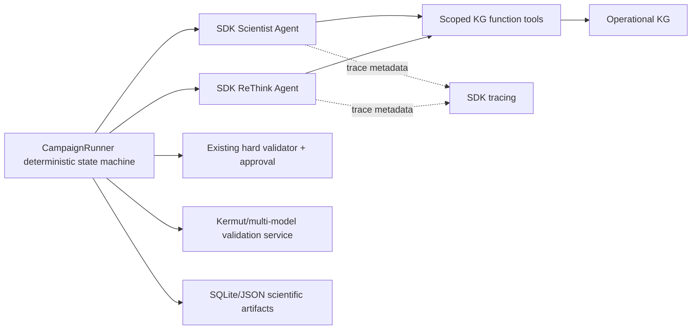

# 是否迁移到 OpenAI Agents SDK：规范化收益、接口成本与建议路径

> 日期：2026-08-16  
> 结论性质：架构分析；按本轮要求，没有安装 SDK，也没有修改现有代码去依赖 SDK。

## 1. 决策结论

**当前不建议把整个多 Agent 系统改写为 OpenAI Agents SDK 主循环；建议采用渐进式混合架构。**

具体做法是继续让 `CampaignRunner` 拥有科研状态机、数据可见性、候选选择、hard validation、oracle/wet reveal 和 artifact 合同；先选 Scientist Agent 与 ReThink Agent 做 SDK pilot，把 KG 查询包装为 function tools，把严格 JSON/Pydantic schema 作为 output type，并把 SDK tracing 映射到现有 run/round/variant ID。等 pilot 证明可复现性、provider 兼容、成本和 guardrail 行为符合要求后，再决定 Critic 或更多角色是否迁移。

原因是当前系统不是普通对话型 agent loop，而是有强时序、强数据隔离、可重放和科学审批约束的实验状态机。OpenAI 官方文档也明确区分：如果应用希望自己拥有 loop、tool dispatch 和 state handling，可以直接使用底层 API；需要 runtime 管理 turns、tools、guardrails、handoffs 或 sessions 时才更适合 SDK；两者可在同一应用中混用。

## 2. 当前系统与 SDK 能力映射

| 当前模块 | SDK 对应能力 | 建议 |
|---|---|---|
| `ScientistAgent` | `Agent` + structured output + function tools | 首批 pilot |
| `ReThinkAgent` | 独立 `Agent` 或 manager 的 agent-as-tool | 首批 pilot，但只读 validation context |
| `CriticAgent` | output guardrail / 独立 Critic Agent | 暂保留现有 deterministic + remote 双轨 |
| `kg_interaction` operators | `function_tool` | 可包装；保留现有 scope/round 校验 |
| `CampaignRunner` | `Runner`/manager orchestration | 不迁移，继续做领域状态机 |
| `ApprovalGateway` / `BatchHardValidator` | tool guardrails / HITL | 不能直接替换，继续作为外层硬边界 |
| `CampaignState` / KG / artifacts | SDK sessions/tracing | 科学真值仍存本地合同；SDK session 只存对话上下文 |
| Kermut/预测器接口 | custom function tool/model adapter | 保留现有 Python protocol；按角色最小暴露 |

## 3. 采用 SDK 的实际优势

### 3.1 Agent 定义和结构化输出更统一

SDK 用少量 primitives 表达 Agent、tools、handoffs 和 guardrails，function tool 可自动生成 schema 并使用 Pydantic 校验。Scientist、ReThink、Critic 的 instruction、tool 白名单、output schema 和 model settings 可以采用相同声明方式，减少当前 mock/remote client 之间的重复解析代码。

### 3.2 可观测性更成熟

内置 tracing 可以显示 model call、tool call、handoff、guardrail 和时延/用量。若把 `run_id`、`round_id`、`variant_id` 作为 trace metadata，可更容易回答：某条 hypothesis 使用了哪些 KG 事实、ReThink 为什么产生某个 verdict、哪次 provider fallback 增加了延迟。

### 3.3 Tool 与 handoff 契约标准化

`hypothesis_context`、`explain_variant`、`compare_variants` 可以成为显式 function tools；manager-style orchestration 或 handoff 可以表达 Scientist→ReThink/专门 KG 分析角色。未来增加结构专家、文献专家或 assay 专家时，接口比手写分派更一致。

### 3.4 Sessions、HITL 与 provider 抽象

SDK 提供 session、human-in-the-loop 和模型 provider 相关能力，有利于远程长任务、人工批准和断点恢复。它也允许在高级 agent workflow 中保留底层 Responses 路径，适合渐进迁移。

## 4. 全量迁移的主要难点

### 4.1 双重主循环冲突

现有 `CampaignRunner` 已经明确控制：

`VISIBLE → EVIDENCE → HYPOTHESIS → DESIGN → INITIAL_SELECTION → DRY_VALIDATION → REVIEW → WET_REVEAL → RETHINK → UPDATE`

SDK Runner 也有自己的 turn/tool loop。如果让 SDK 拥有整个 campaign，容易产生两个问题：一是 Agent 可以在不正确阶段调用 tool；二是 SDK session state 与 `CampaignState`、KG 和 oracle visibility 出现双写或恢复歧义。科研循环应由 deterministic domain orchestrator 驱动，Agent runtime 只执行被授权的局部认知任务。

### 4.2 数据泄漏和可复现性要求高于普通 Agent 应用

fold、final-test、尚未 reveal 的 oracle label 必须在 Python 数据层物理不可见，不能只靠 prompt 要求模型“不读取”。当前代码通过 split bundle、round scope、ApprovalGateway 和 KG visibility rule 实现这一点。迁移时如果把文件搜索、MCP、shell 或 hosted tool 广泛开放，会扩大泄漏面和重放不确定性。

### 4.3 自定义预测器与多 provider 接口

Kermut、ProteinNPT、ProSST、Pythia-PPI 等适应度模型是本地 Python `FitnessPredictor`，不是对话模型。它们更适合作为受限 validation service，而不是 SDK model provider。DeepSeek 等 OpenAI-compatible LLM 还需验证 SDK 的 model adapter、structured output、reasoning 参数、重试和 usage accounting 是否与当前配置等价。

### 4.4 Guardrail 不能自动替代现有硬审批

OpenAI 官方 guardrail 文档有几个必须保留在设计中的边界：

- input guardrail 只对 agent chain 的第一个 Agent 生效；
- output guardrail 只对最终输出 Agent 生效；
- tool guardrail 会包裹 custom function tools，但不自动覆盖 handoff；
- hosted tools、内置执行工具和 `Agent.as_tool()` 当前也不走同一 tool-guardrail pipeline。

因此，`BatchHardValidator`、round visibility、mutation notation、batch size、duplicate/revealed ID、final-test 隔离和 `ApprovalGateway` 不能被 SDK guardrail 替换。最安全的做法是把它们保留为 SDK 外层的不可绕过 domain gate。

### 4.5 Session 不应成为科研真值库

SDK session 适合保存对话工作记忆，不适合替代追加式 wet/dry validation、model version、provenance 和 fold manifest。科学真值仍应写入现有 SQLite/JSON artifact；session 只保存生成该 artifact 所需的短期模型上下文，并通过 artifact ID 引用，而不是复制整套状态。

## 5. 推荐的混合架构

边界原则：

1. SDK Agent 只能接收 `CampaignRunner` 提供的当前轮 sanitized context。
2. KG function tool 的 scope、max rows、round visibility 和 query budget 继续由 `kg_interaction` 校验。
3. SDK Agent 不直接调用 oracle、final-test、实验 backend 或 batch submission。
4. Agent 输出先经 Pydantic/schema validation，再经现有 hard validator/approval。
5. wet/dry/KG/artifact 仍是唯一科研状态源；SDK trace 是观测副本，不参与恢复判定。

## 6. 渐进迁移路线

### 阶段 A：无行为变化的 adapter pilot

- 为 `ScientistAgent` 建立 SDK adapter，输入/输出继续使用现有 `Hypothesis` schema。
- 把三个 KG operator 包成 read-only function tools。
- 固定 model、temperature、tool budget 和 max turns。
- 同时运行现有 remote client 与 SDK adapter，比较 schema 成功率、内容差异、token/latency 和 trace 完整性；不让 SDK 输出参与正式选择。

退出条件：100% 通过 round visibility/泄漏测试；结构化输出成功率和 fallback 率不劣于当前实现；相同 seed/context 的行为差异被记录。

### 阶段 B：ReThink shadow/canary

- SDK ReThink 先以 shadow 模式生成，不写 KG。
- 人工抽审 `support/conflict/mixed/inconclusive` 与 revised reason。
- 达到阈值后只在少量 campaign 写入 KG，并保留现有 mock fallback。

退出条件：每个 selected variant 覆盖完整；不虚构 wet/dry；冲突样本识别达到预设人工一致率。

### 阶段 C：有限生产接入

- Scientist/ReThink 使用 SDK；CampaignRunner 仍主导状态机。
- 接 trace exporter，把 run/round/query IDs 映射到现有 trace。
- 明确数据保留、敏感序列、API 成本和重试策略。

### 阶段 D：再评估 Critic，不迁移 CampaignRunner

只有当 SDK guardrail + function tool 能证明不降低现有安全性时，才考虑迁移 remote Critic。即使到此阶段，也不建议让 SDK Runner 接管 oracle reveal、fold state、Kermut validation 或 batch approval。

## 7. 评估矩阵与 Go/No-Go

| 维度 | 指标 | Go 条件 |
|---|---|---|
| 合同可靠性 | schema success / fallback rate | 不劣于现有 remote client |
| 科学安全 | hidden oracle/final-test 泄漏测试 | 0 泄漏 |
| 可复现性 | 固定输入的结构/工具调用稳定度 | 可解释且有 trace |
| 推理质量 | hypothesis 可证伪性、ReThink 冲突识别 | 人工/规则评审提升 |
| 成本 | token、延迟、重试、失败成本 | 在预算内且可配置 |
| 自定义能力 | DeepSeek/未来 provider、KG、预测器适配 | 无阻断性缺口 |
| 运维 | trace 与现有 artifacts 对齐 | run/round/variant 可回溯 |

No-Go 情形包括：SDK 需要向 Agent 暴露过宽文件/工具权限；structured output/fallback 明显更差；provider 参数无法等价映射；session 与科学状态产生双写；或 hard validation 只能依赖 prompt/agent-level guardrail。

## 8. 最终建议

SDK 的最大价值在 Scientist/ReThink 这类“模型 + 受限只读工具 + 结构化输出 + tracing”的局部任务，而不是替代当前 campaign 的领域状态机。采用混合架构可以获得规范化和可观测性，同时保留当前系统最重要的实验隔离、确定性审批和可复现 artifact。

建议下一阶段只做一个 feature-flagged SDK Scientist adapter，并将其作为 shadow experiment；不要先从全量依赖、handoff 重构或 CampaignRunner 改写开始。

## 9. 官方资料

1. [OpenAI Agents SDK 概览](https://openai.github.io/openai-agents-python/)：SDK primitives、tracing、sessions，以及 Agents SDK 与直接使用 Responses API 的选择边界。
2. [Agents](https://openai.github.io/openai-agents-python/agents/)：Agent 配置和结构化输出等能力。
3. [Tools](https://openai.github.io/openai-agents-python/tools/)：function tools、hosted tools 和 tool schema。
4. [Guardrails](https://openai.github.io/openai-agents-python/guardrails/)：input/output/tool guardrail 的执行边界及 handoff/hosted tool 限制。
5. [Agent orchestration](https://openai.github.io/openai-agents-python/multi_agent/)：manager-style orchestration 与 handoff 选择。
6. [Tracing](https://openai.github.io/openai-agents-python/tracing/)：trace/span 与自定义 processor。
> **状态：已废弃（2026-08-17）。** 本文记录历史 SDK pilot 分析，不代表当前实现。
> 当前系统已采用零 Agents SDK 的项目原生 Client 架构；以
> `docs/deepseek-contract-first-agent-refactor-plan.md` 及代码为准。

